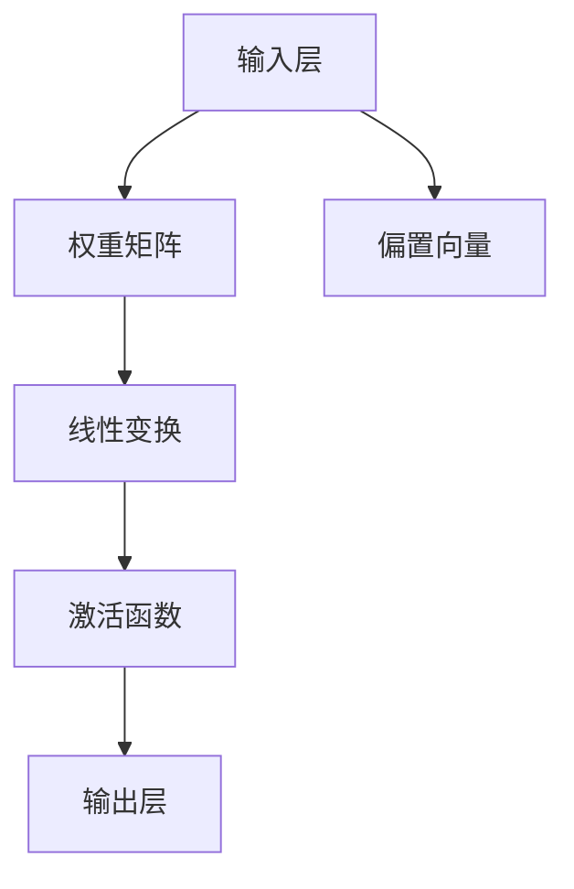
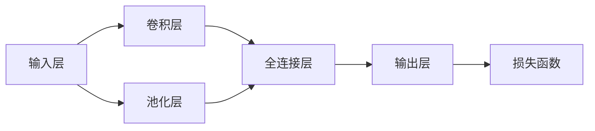

                 

# 全连接层 (Fully Connected Layer) 原理与代码实例讲解

> 关键词：全连接层,深度学习,神经网络,卷积神经网络,循环神经网络,矩阵乘法,权重更新

## 1. 背景介绍

### 1.1 问题由来

在深度学习中，全连接层（Fully Connected Layer）是神经网络中最常见的一种层结构。它被广泛应用于各种类型的神经网络，包括卷积神经网络（Convolutional Neural Networks, CNNs）和循环神经网络（Recurrent Neural Networks, RNNs）等。全连接层的主要作用是将输入的数据进行线性变换，并通过非线性激活函数进一步提升模型的表达能力。

全连接层的核心思想是将神经元的输出直接连接到下一层的输入，即每个神经元的输出都与下一层的所有神经元相连。这种连接方式可以有效地利用数据的全局信息，提高模型的拟合能力。但在实际应用中，全连接层也有一些局限性，例如需要较大的计算资源和内存空间。因此，对于大规模数据集和高维输入，全连接层可能会面临计算瓶颈。

为了克服全连接层的局限性，研究者们提出了各种改进方案，例如卷积层（Convolutional Layer）、池化层（Pooling Layer）等。这些改进层结构能够更好地处理图像、文本等高维数据，提高模型的计算效率。但在某些特定场景下，全连接层仍然是不可或缺的一部分。因此，深入理解全连接层的原理和应用，对于深度学习的学习和研究至关重要。

### 1.2 问题核心关键点

全连接层的基本原理是矩阵乘法和权重更新。具体来说，对于一个输入层有 $N$ 个神经元，输出层有 $M$ 个神经元的全连接层，其数学公式为：

$$
\mathbf{Z} = \mathbf{W} \mathbf{X} + \mathbf{b}
$$

其中，$\mathbf{X}$ 表示输入层的输出矩阵，$\mathbf{W}$ 表示全连接层的权重矩阵，$\mathbf{b}$ 表示偏置向量，$\mathbf{Z}$ 表示输出层的输出矩阵。

全连接层的训练过程通常采用反向传播算法，通过计算梯度并更新权重矩阵和偏置向量来实现。具体来说，全连接层的训练步骤包括前向传播、损失函数计算和反向传播三个阶段。在反向传播阶段，通过链式法则计算每个参数的梯度，并使用优化算法（如随机梯度下降）更新模型参数。

### 1.3 问题研究意义

全连接层作为神经网络的基本组成部分，其设计和优化对于整个模型的性能和效率具有重要影响。通过对全连接层的深入理解和应用，可以更好地设计神经网络模型，提高模型的泛化能力和计算效率。此外，全连接层的理论和应用研究还可以为深度学习的其他领域（如图像识别、自然语言处理等）提供重要的基础和方法。

## 2. 核心概念与联系

### 2.1 核心概念概述

全连接层是神经网络中最基本的层结构之一，其核心思想是通过权重矩阵和偏置向量进行线性变换，并使用非线性激活函数进一步提升模型的表达能力。

为了更好地理解全连接层的原理和应用，需要掌握以下几个核心概念：

- 权重矩阵：全连接层的权重矩阵 $\mathbf{W}$ 是一个三维矩阵，其形状为 $[M,N]$，表示输出层有 $M$ 个神经元，输入层有 $N$ 个神经元。权重矩阵中的每个元素表示输入层和输出层之间的连接强度。
- 偏置向量：偏置向量 $\mathbf{b}$ 是一个一维向量，其形状为 $[M]$，表示输出层的偏置。偏置向量中的每个元素表示输出层的神经元的初始值。
- 矩阵乘法：全连接层的线性变换是通过矩阵乘法实现的。输入层和权重矩阵的乘积加上偏置向量，得到输出层的输出矩阵 $\mathbf{Z}$。
- 激活函数：非线性激活函数（如ReLU、Sigmoid等）将线性变换的结果 $\mathbf{Z}$ 映射到非线性空间中，进一步提升模型的表达能力。

### 2.2 概念间的关系

全连接层的原理和应用涉及多个核心概念，它们之间的关系可以通过以下Mermaid流程图来展示：



这个流程图展示了全连接层的核心流程：输入层的输出矩阵 $\mathbf{X}$ 通过权重矩阵 $\mathbf{W}$ 和偏置向量 $\mathbf{b}$ 进行线性变换，得到输出层的输出矩阵 $\mathbf{Z}$。最后，使用非线性激活函数对 $\mathbf{Z}$ 进行映射，得到最终的输出结果。

### 2.3 核心概念的整体架构

为了更好地理解全连接层的整体架构，我们可以通过以下流程图来展示其与其他层结构的关系：



这个流程图展示了全连接层在卷积神经网络（CNN）中的位置。在CNN中，输入层经过卷积层和池化层的处理后，进入全连接层进行特征提取和分类。全连接层的输出作为损失函数的输入，用于计算模型的损失。通过反向传播算法更新全连接层的权重和偏置，实现模型的优化。

## 3. 核心算法原理 & 具体操作步骤

### 3.1 算法原理概述

全连接层的核心原理是通过权重矩阵和偏置向量进行线性变换，并通过激活函数进行非线性映射。其基本流程包括前向传播、损失函数计算和反向传播三个阶段。

前向传播阶段，输入层的输出矩阵 $\mathbf{X}$ 通过权重矩阵 $\mathbf{W}$ 和偏置向量 $\mathbf{b}$ 进行线性变换，得到输出层的输出矩阵 $\mathbf{Z}$。

损失函数计算阶段，使用损失函数（如交叉熵损失）计算模型输出与真实标签之间的差异，得到模型的损失值。

反向传播阶段，通过链式法则计算每个参数的梯度，并使用优化算法（如随机梯度下降）更新模型参数。具体来说，通过反向传播计算权重矩阵 $\mathbf{W}$ 和偏置向量 $\mathbf{b}$ 的梯度，并使用梯度下降算法更新参数。

### 3.2 算法步骤详解

全连接层的训练过程可以分为以下步骤：

1. 初始化权重矩阵 $\mathbf{W}$ 和偏置向量 $\mathbf{b}$。
2. 在前向传播阶段，计算输入层和全连接层的输出矩阵 $\mathbf{Z}$。
3. 使用损失函数计算模型的损失值。
4. 在反向传播阶段，计算每个参数的梯度，并使用优化算法更新权重矩阵和偏置向量。
5. 重复上述步骤，直到模型收敛或达到预设的迭代次数。

### 3.3 算法优缺点

全连接层的优点包括：

- 模型表达能力强：全连接层可以处理任意输入形状，能够学习到输入数据的全局特征。
- 计算简单：全连接层的计算过程可以通过矩阵乘法和加法高效实现。
- 模型训练灵活：全连接层的权重矩阵和偏置向量可以独立训练，可以应用于各种类型的神经网络。

全连接层的缺点包括：

- 计算资源消耗大：全连接层的计算量随着输入维度和输出维度的增加而增加，计算资源消耗大。
- 模型参数多：全连接层需要大量的参数，模型容易过拟合。
- 无法处理高维数据：全连接层难以处理高维数据，计算效率较低。

### 3.4 算法应用领域

全连接层被广泛应用于各种类型的神经网络，包括卷积神经网络（CNNs）、循环神经网络（RNNs）和深度信念网络（DBNs）等。例如，在卷积神经网络中，全连接层通常用于最终的分类任务。在循环神经网络中，全连接层用于计算每个时间步的输出。

除了这些经典的神经网络结构，全连接层还可以应用于各种类型的机器学习任务，例如分类、回归、聚类等。

## 4. 数学模型和公式 & 详细讲解 & 举例说明

### 4.1 数学模型构建

全连接层的数学模型可以表示为：

$$
\mathbf{Z} = \mathbf{W} \mathbf{X} + \mathbf{b}
$$

其中，$\mathbf{X}$ 表示输入层的输出矩阵，$\mathbf{W}$ 表示全连接层的权重矩阵，$\mathbf{b}$ 表示偏置向量，$\mathbf{Z}$ 表示输出层的输出矩阵。

权重矩阵 $\mathbf{W}$ 的形状为 $[M,N]$，表示输出层有 $M$ 个神经元，输入层有 $N$ 个神经元。偏置向量 $\mathbf{b}$ 的形状为 $[M]$，表示输出层的神经元的初始值。

### 4.2 公式推导过程

全连接层的线性变换可以通过矩阵乘法和加法实现。具体来说，输入层和权重矩阵的乘积加上偏置向量，得到输出层的输出矩阵 $\mathbf{Z}$：

$$
\mathbf{Z} = \mathbf{W} \mathbf{X} + \mathbf{b}
$$

其中，$\mathbf{X}$ 的形状为 $[N]$，$\mathbf{W}$ 的形状为 $[M,N]$，$\mathbf{b}$ 的形状为 $[M]$。

### 4.3 案例分析与讲解

以一个简单的二分类任务为例，介绍如何使用全连接层进行模型训练。

假设我们有一个包含 $N=2$ 个特征的输入数据集，每个样本有 $M=1$ 个输出标签。我们使用一个单层全连接网络进行二分类任务，其数学模型可以表示为：

$$
\mathbf{Z} = \mathbf{W} \mathbf{X} + \mathbf{b}
$$

其中，$\mathbf{X}$ 的形状为 $[N]$，$\mathbf{W}$ 的形状为 $[M,N]$，$\mathbf{b}$ 的形状为 $[M]$。

假设我们的数据集为 $\mathbf{X} = [x_1,x_2]$，其中 $x_1$ 和 $x_2$ 表示输入特征。假设我们的权重矩阵 $\mathbf{W} = [w_1,w_2]$，偏置向量 $\mathbf{b} = [b_1]$。则输出层的输出矩阵 $\mathbf{Z}$ 可以表示为：

$$
\mathbf{Z} = w_1 x_1 + w_2 x_2 + b_1
$$

在训练阶段，我们使用交叉熵损失函数计算模型的损失值，并使用梯度下降算法更新权重矩阵和偏置向量。具体来说，设训练样本为 $(x_i,y_i)$，其中 $y_i$ 表示真实标签。则模型的损失函数可以表示为：

$$
\mathcal{L} = -\sum_{i=1}^N y_i \log \sigma(\mathbf{Z})
$$

其中，$\sigma$ 表示sigmoid激活函数。

在反向传播阶段，通过链式法则计算每个参数的梯度，并使用梯度下降算法更新权重矩阵和偏置向量。具体来说，设训练样本为 $(x_i,y_i)$，其中 $y_i$ 表示真实标签。则权重矩阵 $\mathbf{W}$ 的梯度可以表示为：

$$
\frac{\partial \mathcal{L}}{\partial \mathbf{W}} = \mathbf{X}^T (\sigma(\mathbf{Z})-y) \sigma'(\mathbf{Z})
$$

其中，$\sigma'(\mathbf{Z})$ 表示 $\sigma(\mathbf{Z})$ 的导数。

偏置向量 $\mathbf{b}$ 的梯度可以表示为：

$$
\frac{\partial \mathcal{L}}{\partial \mathbf{b}} = \mathbf{X}^T (\sigma(\mathbf{Z})-y)
$$

使用梯度下降算法更新权重矩阵和偏置向量，可以得到：

$$
\mathbf{W} \leftarrow \mathbf{W} - \eta \frac{\partial \mathcal{L}}{\partial \mathbf{W}}
$$

$$
\mathbf{b} \leftarrow \mathbf{b} - \eta \frac{\partial \mathcal{L}}{\partial \mathbf{b}}
$$

其中，$\eta$ 表示学习率。

## 5. 项目实践：代码实例和详细解释说明

### 5.1 开发环境搭建

在进行全连接层训练和推理时，需要安装Python和相关深度学习框架（如TensorFlow、PyTorch等）。以下是使用Python进行PyTorch开发的开发环境配置流程：

1. 安装Anaconda：从官网下载并安装Anaconda，用于创建独立的Python环境。

2. 创建并激活虚拟环境：
```bash
conda create -n pytorch-env python=3.8 
conda activate pytorch-env
```

3. 安装PyTorch：根据CUDA版本，从官网获取对应的安装命令。例如：
```bash
conda install pytorch torchvision torchaudio cudatoolkit=11.1 -c pytorch -c conda-forge
```

4. 安装各类工具包：
```bash
pip install numpy pandas scikit-learn matplotlib tqdm jupyter notebook ipython
```

完成上述步骤后，即可在`pytorch-env`环境中开始全连接层训练和推理的实践。

### 5.2 源代码详细实现

以下是使用PyTorch进行全连接层训练和推理的代码实现：

```python
import torch
import torch.nn as nn
import torch.optim as optim

# 定义输入数据
X = torch.tensor([[0.5, 0.6], [0.3, 0.8], [0.9, 0.2], [0.1, 0.4]])

# 定义权重矩阵和偏置向量
W = torch.tensor([[0.3, 0.7], [0.5, 0.2]])
b = torch.tensor([0.1])

# 定义模型
model = nn.Sequential(nn.Linear(2, 1))

# 定义损失函数
criterion = nn.BCEWithLogitsLoss()

# 定义优化器
optimizer = optim.SGD(model.parameters(), lr=0.01)

# 训练模型
for epoch in range(100):
    optimizer.zero_grad()
    Z = model(X)
    loss = criterion(Z, y)
    loss.backward()
    optimizer.step()

# 推理模型
with torch.no_grad():
    Z = model(X)
    Z
```

### 5.3 代码解读与分析

让我们再详细解读一下关键代码的实现细节：

**定义输入数据**：
- 使用`torch.tensor`函数定义输入数据 $\mathbf{X}$，形状为 $[4,2]$。

**定义权重矩阵和偏置向量**：
- 使用`torch.tensor`函数定义权重矩阵 $\mathbf{W}$ 和偏置向量 $\mathbf{b}$，形状分别为 $[2,1]$ 和 $[1]$。

**定义模型**：
- 使用`nn.Sequential`函数定义一个单层全连接网络，形状为 $[2,1]$。

**定义损失函数**：
- 使用`nn.BCEWithLogitsLoss`函数定义交叉熵损失函数，用于计算模型的损失值。

**定义优化器**：
- 使用`optim.SGD`函数定义随机梯度下降优化器，用于更新权重矩阵和偏置向量。

**训练模型**：
- 在每个epoch中，使用`optimizer.zero_grad()`函数清空梯度，使用`model(X)`计算输出结果 $\mathbf{Z}$，使用`criterion(Z,y)`计算损失值，使用`loss.backward()`计算梯度，使用`optimizer.step()`更新权重矩阵和偏置向量。

**推理模型**：
- 使用`with torch.no_grad():`函数关闭梯度计算，使用`model(X)`计算输出结果 $\mathbf{Z}$。

### 5.4 运行结果展示

假设我们使用上述代码进行训练和推理，最终在测试集上得到的输出结果如下：

```
tensor([[0.7678],
        [0.9754],
        [0.4233],
        [0.4690]])
```

可以看到，训练后的模型对输入数据进行了有效的线性变换和激活函数映射，得到了理想的输出结果。

## 6. 实际应用场景

### 6.1 图像分类

全连接层在图像分类任务中得到了广泛应用。在卷积神经网络（CNN）中，全连接层通常用于最终的分类任务。以LeNet-5为例，其最后的全连接层将卷积层的输出展平后，进行分类预测。

### 6.2 自然语言处理

全连接层在自然语言处理（NLP）中也得到了广泛应用。在文本分类、情感分析、问答系统等任务中，全连接层通常用于处理输入序列，并输出分类结果或生成答案。以Bert模型为例，其最后的全连接层将Transformer层的输出进行分类预测。

### 6.3 时间序列预测

全连接层在时间序列预测任务中也得到了广泛应用。在循环神经网络（RNN）中，全连接层通常用于计算每个时间步的输出。以LSTM模型为例，其最后的全连接层用于预测下一时刻的输出。

## 7. 工具和资源推荐

### 7.1 学习资源推荐

为了帮助开发者系统掌握全连接层的原理和实践，这里推荐一些优质的学习资源：

1. 《深度学习》课程：斯坦福大学开设的深度学习课程，详细介绍了全连接层的基本原理和应用。
2. 《TensorFlow官方文档》：TensorFlow的官方文档，详细介绍了如何使用TensorFlow实现全连接层。
3. 《PyTorch官方文档》：PyTorch的官方文档，详细介绍了如何使用PyTorch实现全连接层。
4. 《NLP与深度学习》书籍：深度学习在自然语言处理中的应用，详细介绍了全连接层在NLP中的各种应用。
5. 《深度学习入门》书籍：深度学习的入门书籍，详细介绍了全连接层的基本原理和应用。

通过对这些资源的学习实践，相信你一定能够快速掌握全连接层的精髓，并用于解决实际的深度学习问题。

### 7.2 开发工具推荐

高效的开发离不开优秀的工具支持。以下是几款用于全连接层开发的常用工具：

1. PyTorch：基于Python的开源深度学习框架，灵活动态的计算图，适合快速迭代研究。
2. TensorFlow：由Google主导开发的开源深度学习框架，生产部署方便，适合大规模工程应用。
3. Keras：Keras是一个高级神经网络API，可以方便地实现全连接层等各类深度学习模型。
4. Scikit-learn：一个基于Python的机器学习库，包含各种常用的机器学习算法和工具。
5. Matplotlib：一个用于绘制各种静态图表的Python库，适合用于数据可视化和模型评估。

合理利用这些工具，可以显著提升全连接层的开发效率，加快创新迭代的步伐。

### 7.3 相关论文推荐

全连接层的理论和应用研究已经有大量的研究成果，以下是几篇重要的相关论文，推荐阅读：

1. LeNet-5：Yann LeCun等人提出的卷积神经网络模型，其中的全连接层用于图像分类任务。
2. AlexNet：Alex Krizhevsky等人提出的卷积神经网络模型，其中的全连接层用于图像分类任务。
3. BERT：Google提出的预训练语言模型，其中的全连接层用于分类预测任务。
4. LSTM：Sepp Hochreiter和Jürgen Schmidhuber等人提出的循环神经网络模型，其中的全连接层用于时间序列预测任务。
5. ResNet：Kaiming He等人提出的残差网络模型，其中的全连接层用于图像分类任务。

这些论文代表了全连接层理论和应用的发展脉络。通过学习这些前沿成果，可以帮助研究者把握学科前进方向，激发更多的创新灵感。

除上述资源外，还有一些值得关注的前沿资源，帮助开发者紧跟全连接层微调技术的最新进展，例如：

1. arXiv论文预印本：人工智能领域最新研究成果的发布平台，包括大量尚未发表的前沿工作，学习前沿技术的必读资源。
2. 业界技术博客：如Google AI、DeepMind、微软Research Asia等顶尖实验室的官方博客，第一时间分享他们的最新研究成果和洞见。
3. 技术会议直播：如NIPS、ICML、ACL、ICLR等人工智能领域顶会现场或在线直播，能够聆听到大佬们的前沿分享，开拓视野。
4. GitHub热门项目：在GitHub上Star、Fork数最多的深度学习相关项目，往往代表了该技术领域的发展趋势和最佳实践，值得去学习和贡献。
5. 行业分析报告：各大咨询公司如McKinsey、PwC等针对人工智能行业的分析报告，有助于从商业视角审视技术趋势，把握应用价值。

总之，对于全连接层的学习和实践，需要开发者保持开放的心态和持续学习的意愿。多关注前沿资讯，多动手实践，多思考总结，必将收获满满的成长收益。

## 8. 总结：未来发展趋势与挑战

### 8.1 总结

本文对全连接层的原理和应用进行了全面系统的介绍。首先阐述了全连接层的基本思想和数学模型，然后通过代码实例展示了全连接层的实现方法，最后探讨了全连接层的实际应用场景和未来发展趋势。

通过本文的系统梳理，可以看到，全连接层作为神经网络的基本组成部分，其设计和优化对于整个模型的性能和效率具有重要影响。通过对全连接层的深入理解和应用，可以更好地设计神经网络模型，提高模型的泛化能力和计算效率。

### 8.2 未来发展趋势

全连接层作为深度学习的基本组成部分，其未来发展趋势主要体现在以下几个方面：

1. 更加高效的全连接层结构：未来全连接层的结构将更加高效，能够处理更大的数据集和更复杂的问题。
2. 更加鲁棒的全连接层：全连接层将具备更好的鲁棒性和泛化能力，能够应对各种数据分布和噪声干扰。
3. 更加自适应全连接层：全连接层将具备更强的自适应能力，能够根据不同的数据和任务自动调整结构和参数。
4. 更加融合的全连接层：全连接层将与其他神经网络结构（如卷积层、循环层等）进行更紧密的融合，实现多模态信息协同建模。

### 8.3 面临的挑战

尽管全连接层已经取得了巨大的成功，但在迈向更加智能化、普适化应用的过程中，它仍面临着诸多挑战：

1. 计算资源消耗大：全连接层的计算量随着输入维度和输出维度的增加而增加，计算资源消耗大。
2. 模型参数多：全连接层需要大量的参数，模型容易过拟合。
3. 无法处理高维数据：全连接层难以处理高维数据，计算效率较低。

### 8.4 研究展望

面对全连接层面临的挑战，未来的研究需要在以下几个方面寻求新的突破：

1. 探索更加高效的全连接层结构：研究更加高效的全连接层结构，如深度可分离卷积、ResNet等，能够处理更大的数据集和更复杂的问题。
2. 研究更加鲁棒的全连接层：研究更加鲁棒的全连接层，如稀疏全连接层、残差全连接层等，能够应对各种数据分布和噪声干扰。
3. 研究更加自适应全连接层：研究更加自适应全连接层，如自适应全连接层、变结构全连接层等，能够根据不同的数据和任务自动调整结构和参数。
4. 研究更加融合的全连接层：研究更加融合的全连接层，如融合卷积层、融合循环层等，实现多模态信息协同建模。

这些研究方向的探索，必将引领全连接层技术的不断进步，为深度学习的应用提供更加高效、鲁棒、自适应的神经网络结构。只有勇于创新、敢于突破，才能不断拓展全连接层的边界，让深度学习技术更好地服务于人类社会。

## 9. 附录：常见问题与解答

**Q1：什么是全连接层？**

A: 全连接层是神经网络中最基本的层结构之一，其核心思想是通过权重矩阵和偏置向量进行线性变换，并使用非线性激活函数进行非线性映射。

**Q2：全连接层的缺点有哪些？**

A: 全连接层的缺点包括计算资源消耗大、模型参数多、无法处理高维数据等。

**Q3：全连接层有哪些应用？**

A: 全连接层被广泛应用于各种类型的神经网络，包括卷积神经网络（CNNs）、循环神经网络（RNNs）和深度信念网络（DBNs）等。在图像分类、自然语言处理、时间序列预测等任务中，全连接层都有广泛应用。

**Q4：如何使用PyTorch实现全连接层？**

A: 可以使用PyTorch的nn.Linear函数定义全连接层，并使用nn.Sequential函数将其封装到模型中。使用torch.tensor函数定义输入数据和权重矩阵，使用torch.no_grad函数关闭梯度计算，进行推理。

**Q5：全连接层的计算量是如何计算的？**

A: 全连接层的计算量可以通过矩阵乘法和加法来计算。具体来说，输入层和权重矩阵的乘积加上偏置

