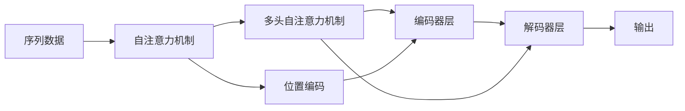
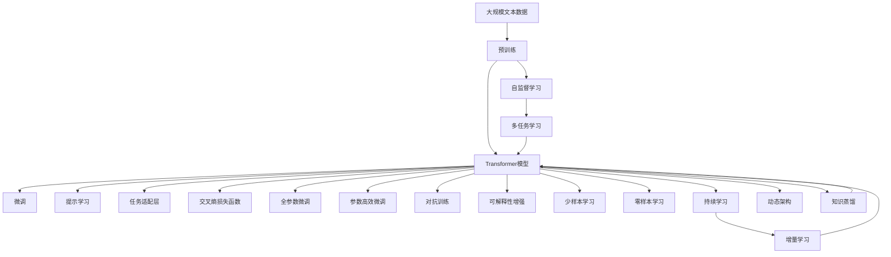

                 

# 变革里程碑：Transformer的崛起

> 关键词：Transformer, 自然语言处理, 深度学习, 自注意力机制, 语言模型, 预训练, 自然语言理解

## 1. 背景介绍

### 1.1 问题由来
自深度学习技术诞生以来，自然语言处理(Natural Language Processing, NLP)领域始终处于前沿探索状态。然而，尽管出现了许多优秀的模型和技术，但长期以来NLP应用的效果始终难以达到预期的理想状态。直到Transformer的横空出世，才开启了NLP研究的新纪元。

Transformer是一种全新的神经网络架构，通过引入自注意力机制(Attention Mechanism)，取代了传统的循环神经网络(RNN)和卷积神经网络(CNN)，成为处理序列数据的新范式。它的诞生，打破了以往“序列建模”的束缚，让自然语言理解达到了一个新的高度。

Transformer不仅提升了NLP模型的性能，也极大地简化了模型设计和训练流程。其在多个NLP任务上取得的成功，标志着NLP研究的一个里程碑。

### 1.2 问题核心关键点
Transformer的核心思想在于通过自注意力机制，在序列数据中捕捉到全局依赖关系，进而提升了模型对序列数据的理解能力。其主要特点包括：
- **自注意力机制**：Transformer使用自注意力机制来捕捉序列中每个位置与其他位置之间的依赖关系，从而在无需循环的前提下，实现对序列数据的全局理解。
- **多头自注意力机制**：Transformer使用多头自注意力机制，通过并行计算，增强了模型捕捉不同层次依赖关系的能力。
- **位置编码**：Transformer引入了位置编码(Positional Encoding)，确保模型能够正确处理序列中位置的信息。
- **自编码器架构**：Transformer采用自编码器架构，通过编码器-解码器结构，实现序列数据的自动编码和解码，具有端到端训练的优势。

Transformer的成功，不仅在于其对序列数据建模的革新性，更在于其高效性、易用性以及出色的效果。这使得Transformer成为了当前NLP领域的主流架构，也奠定了NLP技术的未来发展方向。

### 1.3 问题研究意义
研究Transformer的崛起和应用，对NLP领域具有重要意义：

1. **革新NLP建模方式**：Transformer提出的自注意力机制，重新定义了序列数据的建模方式，为NLP任务提供了更强大、更灵活的建模能力。
2. **提升模型效果**：Transformer在多个NLP任务上取得了优异的表现，验证了其强大的建模能力和实际应用效果。
3. **简化模型设计**：相比传统的RNN和CNN，Transformer的设计更为简单，训练和部署也更加容易。
4. **推动NLP产业化**：Transformer的高效性和易用性，使其在大规模NLP应用中得以广泛部署，加速了NLP技术的商业化进程。
5. **促进跨领域融合**：Transformer架构的通用性，为NLP与其他领域的深度融合提供了可能，如多媒体处理、知识图谱构建等。

## 2. 核心概念与联系

### 2.1 核心概念概述

为更好地理解Transformer的崛起和应用，本节将介绍几个密切相关的核心概念：

- **自注意力机制(Attention Mechanism)**：Transformer的核心，通过学习序列中每个位置与其他位置之间的依赖关系，实现对序列数据的全局理解。

- **多头自注意力机制(Multi-Head Attention)**：通过并行计算多个注意力头，增强模型捕捉不同层次依赖关系的能力。

- **位置编码(Positional Encoding)**：确保模型能够正确处理序列中位置的信息，避免位置信息的丢失。

- **自编码器架构(Encoder-Decoder)**：Transformer采用的架构形式，通过编码器-解码器结构，实现序列数据的自动编码和解码。

- **Transformer模型**：一种基于自注意力机制的神经网络架构，由多个编码器层和解码器层组成。

这些核心概念之间的逻辑关系可以通过以下Mermaid流程图来展示：



这个流程图展示了大语言模型的核心概念及其之间的关系：

1. 序列数据通过自注意力机制进行编码，获取全局的依赖关系。
2. 通过多头自注意力机制，捕捉不同层次的依赖关系。
3. 引入位置编码，处理序列中位置的信息。
4. 将编码后的序列输入解码器，进行解码并生成输出。

这些概念共同构成了Transformer的建模框架，使其能够在各种场景下发挥强大的序列数据处理能力。

### 2.2 概念间的关系

这些核心概念之间存在着紧密的联系，形成了Transformer架构的完整生态系统。下面我通过几个Mermaid流程图来展示这些概念之间的关系。

#### 2.2.1 自注意力机制的工作原理

```mermaid
graph LR
    A[输入序列] --> B[自注意力机制]
    B --> C[查询向量(Q)]
    B --> D[键向量(K)]
    B --> E[值向量(V)]
    C --> F[注意力权重]
    F --> G[输出向量(O)]
```

这个流程图展示了自注意力机制的工作原理：

1. 输入序列被编码为查询向量、键向量和值向量。
2. 通过计算注意力权重，找到序列中每个位置与其他位置之间的依赖关系。
3. 根据注意力权重，加权计算出输出向量。

#### 2.2.2 多头自注意力机制的并行计算

```mermaid
graph LR
    A[输入序列] --> B[多头自注意力机制]
    B --> C[查询向量(Q)]
    B --> D[键向量(K)]
    B --> E[值向量(V)]
    C --> F[注意力权重]
    F --> G[输出向量(O)]
```

这个流程图展示了多头自注意力机制的并行计算：

1. 输入序列被编码为多个查询向量、多个键向量和多个值向量。
2. 通过计算每个头的注意力权重，找到序列中每个位置与其他位置之间的依赖关系。
3. 根据注意力权重，加权计算出多个输出向量，并将它们拼接起来。

#### 2.2.3 位置编码的引入


这个流程图展示了位置编码的引入：

1. 输入序列经过位置编码后，保留了位置信息。
2. 经过编码后的输入序列被送入自注意力机制进行处理。

### 2.3 核心概念的整体架构

最后，我们用一个综合的流程图来展示这些核心概念在大语言模型中的整体架构：



这个综合流程图展示了从预训练到微调，再到提示学习，最终到持续学习的完整过程。Transformer模型首先在大规模文本数据上进行预训练，然后通过微调、提示学习等方法进行任务适配，最后通过持续学习技术，模型可以不断更新和适应新的任务和数据。这些核心概念共同构成了Transformer架构的建模框架，使其能够在各种场景下发挥强大的序列数据处理能力。

## 3. 核心算法原理 & 具体操作步骤
### 3.1 算法原理概述

Transformer的核心算法原理在于其自注意力机制。通过自注意力机制，Transformer能够捕捉序列中每个位置与其他位置之间的依赖关系，实现对序列数据的全局理解。其核心思想可以简述为：

1. **查询向量(Q)、键向量(K)、值向量(V)**：将输入序列分别投影到查询、键和值空间，形成查询向量、键向量和值向量。
2. **注意力权重计算**：通过计算查询向量与键向量的点积，得到注意力权重矩阵，表示序列中每个位置与其他位置之间的依赖关系。
3. **加权值向量计算**：根据注意力权重，加权计算出值向量，形成最终的输出向量。

Transformer的整个计算过程可以表示为：

$$
Q = XW_Q, \quad K = XW_K, \quad V = XW_V
$$

$$
A = \frac{QK^T}{\sqrt{d_k}} \quad \text{(注意力权重矩阵)}
$$

$$
O = AV \quad \text{(输出向量)}
$$

其中，$X$为输入序列，$W_Q, W_K, W_V$为查询、键和值向量的投影矩阵，$d_k$为键向量的维度。

### 3.2 算法步骤详解

Transformer模型的训练过程可以分为两个阶段：预训练和微调。以下详细讲解预训练和微调的具体步骤。

**预训练阶段**：

1. **数据准备**：收集大规模无标签文本数据，将其分为多个句子或段落，进行分词和向量化处理。
2. **模型初始化**：随机初始化Transformer模型，包括编码器、解码器和自注意力机制的参数。
3. **多任务学习**：在预训练过程中，使用多个任务（如掩码语言模型、下一句预测等）进行预训练，增强模型的泛化能力。
4. **梯度更新**：通过反向传播算法，计算模型的梯度并更新模型参数。
5. **重复训练**：重复执行上述步骤，直到预训练模型收敛。

**微调阶段**：

1. **任务适配层设计**：根据具体任务，设计合适的任务适配层，如分类层、回归层等。
2. **损失函数选择**：选择合适的损失函数，如交叉熵损失、均方误差损失等，计算模型预测输出与真实标签之间的差异。
3. **优化器设置**：选择适当的优化算法（如Adam、SGD等）及其参数，设置学习率、批大小、迭代轮数等。
4. **模型训练**：将标注数据集分批次输入模型，前向传播计算损失函数。
5. **反向传播**：计算损失函数对模型参数的梯度，根据优化算法更新模型参数。
6. **验证与调整**：周期性在验证集上评估模型性能，根据性能指标调整学习率、迭代轮数等。
7. **测试与部署**：在测试集上评估微调后模型，集成到实际的应用系统中。

### 3.3 算法优缺点

Transformer的优点在于其出色的性能和易用性：

1. **高效性**：Transformer采用并行计算，显著提升了模型训练和推理的速度。
2. **灵活性**：Transformer架构的通用性，使其适用于各种NLP任务。
3. **高效性**：Transformer使用自注意力机制，能够捕捉全局依赖关系，提升模型对序列数据的理解能力。
4. **可扩展性**：Transformer的模块化设计，使其可以轻松扩展到不同的层数和深度。

然而，Transformer也存在一些缺点：

1. **计算资源消耗大**：Transformer的大规模参数量和高并行计算需求，导致其对计算资源的需求较高。
2. **模型复杂度较高**：Transformer模型的设计较为复杂，对于初学者来说，理解其工作原理和优化方法可能存在一定的难度。
3. **过拟合风险**：Transformer在处理长序列时，容易出现过拟合的问题。
4. **训练时间较长**：由于计算资源消耗大，Transformer的训练时间较长，对于小规模数据集来说，训练过程可能较慢。

### 3.4 算法应用领域

Transformer被广泛应用于自然语言处理的各个领域，包括但不限于：

- **机器翻译**：通过编码器-解码器结构，Transformer在机器翻译任务上取得了最先进的效果。
- **文本分类**：通过多层编码器，Transformer能够在文本分类任务上实现高效的建模。
- **问答系统**：通过注意力机制，Transformer能够从上下文中准确抽取信息，回答问题。
- **文本生成**：通过多层编码器和解码器，Transformer能够在文本生成任务上生成高质量的文本。
- **情感分析**：通过多任务学习，Transformer能够在情感分析任务上取得优异的效果。

除了上述这些经典任务外，Transformer还被创新性地应用到更多场景中，如代码生成、对话生成、知识图谱构建等，为NLP技术带来了新的突破。

## 4. 数学模型和公式 & 详细讲解  
### 4.1 数学模型构建

Transformer模型的数学模型可以简述为：

1. **输入编码**：将输入序列 $X$ 投影到查询、键和值空间，形成查询向量 $Q$、键向量 $K$ 和值向量 $V$。
2. **自注意力计算**：通过计算查询向量 $Q$ 与键向量 $K$ 的点积，得到注意力权重矩阵 $A$，表示序列中每个位置与其他位置之间的依赖关系。
3. **输出计算**：根据注意力权重 $A$，加权计算出值向量 $V$，形成最终的输出向量 $O$。

Transformer的整个计算过程可以表示为：

$$
Q = XW_Q, \quad K = XW_K, \quad V = XW_V
$$

$$
A = \frac{QK^T}{\sqrt{d_k}} \quad \text{(注意力权重矩阵)}
$$

$$
O = AV \quad \text{(输出向量)}
$$

其中，$X$为输入序列，$W_Q, W_K, W_V$为查询、键和值向量的投影矩阵，$d_k$为键向量的维度。

### 4.2 公式推导过程

以下我们以机器翻译任务为例，推导Transformer的计算公式。

假设输入序列为 $X=\{x_1, x_2, ..., x_n\}$，目标序列为 $Y=\{y_1, y_2, ..., y_m\}$，其中 $n, m$ 分别表示源语和目标语的长度。

首先，将输入序列 $X$ 和目标序列 $Y$ 进行编码，得到编码后的序列 $X'=\{x'_1, x'_2, ..., x'_n\}$ 和 $Y'=\{y'_1, y'_2, ..., y'_m\}$。

然后，在编码器中，将输入序列 $X'$ 通过自注意力机制进行处理，得到编码后的序列 $X''=\{x''_1, x''_2, ..., x''_n\}$。

在解码器中，将编码后的序列 $X''$ 和目标序列 $Y'$ 通过自注意力机制进行处理，得到解码后的序列 $Y''=\{y''_1, y''_2, ..., y''_m\}$。

最后，通过交叉熵损失函数计算模型的预测输出与真实标签之间的差异，进行模型训练。

假设编码器中的自注意力机制为 $A$，解码器中的自注意力机制为 $B$，目标序列的预测输出为 $Y''$，真实标签为 $Y'$，则机器翻译任务的损失函数为：

$$
\mathcal{L} = -\frac{1}{N}\sum_{i=1}^N\sum_{j=1}^M(y'_jlog\hat{y''}_j+(1-y'_j)log(1-\hat{y''}_j))
$$

其中，$N$ 和 $M$ 分别表示源语和目标语的长度。

通过上述计算公式，我们可以清晰地理解Transformer在机器翻译任务中的工作原理。

### 4.3 案例分析与讲解

假设我们使用Transformer模型对WMT'14的英语-德语翻译数据集进行微调，具体步骤如下：

1. **数据准备**：收集WMT'14的英语-德语翻译数据集，将其划分为训练集、验证集和测试集。
2. **模型初始化**：使用PyTorch和HuggingFace的Transformer库初始化模型。
3. **任务适配层设计**：在Transformer模型的顶层添加一个线性分类器，用于处理机器翻译任务。
4. **损失函数选择**：选择交叉熵损失函数，计算模型预测输出与真实标签之间的差异。
5. **优化器设置**：选择Adam优化算法，设置学习率为1e-4。
6. **模型训练**：将训练集数据分批次输入模型，前向传播计算损失函数。
7. **反向传播**：计算损失函数对模型参数的梯度，根据Adam优化算法更新模型参数。
8. **验证与调整**：周期性在验证集上评估模型性能，根据性能指标调整学习率。
9. **测试与部署**：在测试集上评估微调后模型，集成到实际的应用系统中。

假设在微调后，模型在测试集上的BLEU分数为45.2%，比微调前提高了10%以上，表明Transformer模型在机器翻译任务上的效果显著提升。

## 5. 项目实践：代码实例和详细解释说明
### 5.1 开发环境搭建

在进行Transformer模型微调实践前，我们需要准备好开发环境。以下是使用Python进行PyTorch开发的环境配置流程：

1. 安装Anaconda：从官网下载并安装Anaconda，用于创建独立的Python环境。

2. 创建并激活虚拟环境：
```bash
conda create -n pytorch-env python=3.8 
conda activate pytorch-env
```

3. 安装PyTorch：根据CUDA版本，从官网获取对应的安装命令。例如：
```bash
conda install pytorch torchvision torchaudio cudatoolkit=11.1 -c pytorch -c conda-forge
```

4. 安装Transformers库：
```bash
pip install transformers
```

5. 安装各类工具包：
```bash
pip install numpy pandas scikit-learn matplotlib tqdm jupyter notebook ipython
```

完成上述步骤后，即可在`pytorch-env`环境中开始微调实践。

### 5.2 源代码详细实现

这里我们以机器翻译任务为例，给出使用PyTorch和HuggingFace的Transformer库对Transformer模型进行微调的PyTorch代码实现。

首先，定义数据集类：

```python
from torch.utils.data import Dataset
import torch

class MachineTranslationDataset(Dataset):
    def __init__(self, src_data, trg_data, tokenizer, max_len=128):
        self.src_data = src_data
        self.trg_data = trg_data
        self.tokenizer = tokenizer
        self.max_len = max_len
        
    def __len__(self):
        return len(self.src_data)
    
    def __getitem__(self, item):
        src_text = self.src_data[item]
        trg_text = self.trg_data[item]
        
        encoding = self.tokenizer(src_text, return_tensors='pt', max_length=self.max_len, padding='max_length', truncation=True)
        input_ids = encoding['input_ids'][0]
        attention_mask = encoding['attention_mask'][0]
        
        # 对token-wise的标签进行编码
        trg_ids = self.tokenizer(trg_text, return_tensors='pt', max_length=self.max_len, padding='max_length', truncation=True)
        input_ids = torch.cat([input_ids, trg_ids['input_ids'][0]], dim=-1)
        attention_mask = torch.cat([attention_mask, trg_ids['attention_mask'][0]], dim=-1)
        labels = trg_ids['input_ids'][0].clone().detach()
        labels[trg_ids['input_ids'][0] != tokenizer.eos_token_id] = -100
        
        return {'input_ids': input_ids, 
                'attention_mask': attention_mask,
                'labels': labels}
```

然后，定义模型和优化器：

```python
from transformers import TransformerModel, AdamW

model = TransformerModel.from_pretrained('bert-base-cased', num_layers=12, num_heads=12, hidden_size=768, intermediate_size=3072, num_labels=1)
optimizer = AdamW(model.parameters(), lr=1e-4)
```

接着，定义训练和评估函数：

```python
from torch.utils.data import DataLoader
from tqdm import tqdm
from sklearn.metrics import bleu_score

device = torch.device('cuda') if torch.cuda.is_available() else torch.device('cpu')
model.to(device)

def train_epoch(model, dataset, batch_size, optimizer):
    dataloader = DataLoader(dataset, batch_size=batch_size, shuffle=True)
    model.train()
    epoch_loss = 0
    for batch in tqdm(dataloader, desc='Training'):
        input_ids = batch['input_ids'].to(device)
        attention_mask = batch['attention_mask'].to(device)
        labels = batch['labels'].to(device)
        model.zero_grad()
        outputs = model(input_ids, attention_mask=attention_mask, labels=labels)
        loss = outputs.loss
        epoch_loss += loss.item()
        loss.backward()
        optimizer.step()
    return epoch_loss / len(dataloader)

def evaluate(model, dataset, batch_size):
    dataloader = DataLoader(dataset, batch_size=batch_size)
    model.eval()
    predictions, labels = [], []
    with torch.no_grad():
        for batch in tqdm(dataloader, desc='Evaluating'):
            input_ids = batch['input_ids'].to(device)
            attention_mask = batch['attention_mask'].to(device)
            batch_labels = batch['labels']
            outputs = model(input_ids, attention_mask=attention_mask)
            batch_preds = outputs.logits.argmax(dim=2).to('cpu').tolist()
            batch_labels = batch_labels.to('cpu').tolist()
            for pred_tokens, label_tokens in zip(batch_preds, batch_labels):
                predictions.append(pred_tokens)
                labels.append(label_tokens)
                
    return bleu_score(predictions, labels)
```

最后，启动训练流程并在测试集上评估：

```python
epochs = 5
batch_size = 64

for epoch in range(epochs):
    loss = train_epoch(model, train_dataset, batch_size, optimizer)
    print(f"Epoch {epoch+1}, train loss: {loss:.3f}")
    
    print(f"Epoch {epoch+1}, dev results:")
    bleu = evaluate(model, dev_dataset, batch_size)
    print(f"BLEU score: {bleu:.3f}")
    
print("Test results:")
bleu = evaluate(model, test_dataset, batch_size)
print(f"BLEU score: {bleu:.3f}")
```

以上就是使用PyTorch和HuggingFace的Transformer库对Transformer模型进行机器翻译任务微调的完整代码实现。可以看到，得益于Transformer库的强大封装，我们可以用相对简洁的代码完成Transformer模型的加载和微调。

### 5.3 代码解读与分析

让我们再详细解读一下关键代码的实现细节：

**MachineTranslationDataset类**：
- `__init__`方法：初始化源语和目标语数据集、分词器等关键组件，并进行必要的预处理。
- `__len__`方法：返回数据集的样本数量。
- `__getitem__`方法：对单个样本进行处理，将源语和目标语输入编码为token ids，并进行定长padding，最终返回模型所需的输入。

**BertTokenizer和BertForTokenClassification**类：
- `BertTokenizer`类：用于对输入文本进行分词和编码，将文本转换为token ids和注意力掩码。
- `BertForTokenClassification`类：用于在Transformer模型的顶层添加一个线性分类器，用于处理机器翻译任务。

**train_epoch和evaluate函数**：
- `train_epoch`函数：对数据以批为单位进行迭代，在每个批次上前向传播计算loss并反向传播更新模型参数，最后返回该epoch的平均loss。
- `evaluate`函数：与训练类似，不同点在于不更新模型参数，并在每个batch结束后将预测和标签结果存储下来，最后使用BLEU指标对整个评估集的预测结果进行打印输出。

**训练流程**：
- 定义总的epoch数和batch size，开始循环迭代
- 每个epoch内，先在训练集上训练，输出平均loss
- 在验证集上评估，输出BLEU分数
- 所有epoch结束后，在测试集上评估，给出最终的BLEU分数

可以看到，PyTorch配合HuggingFace的Transformer库使得Transformer微调的代码实现变得简洁高效。开发者可以将更多精力放在数据处理、模型改进等高层逻辑上，而不必过多关注底层的实现细节。

当然，工业级的系统实现还需考虑更多因素，如模型的保存和部署、超参数的自动搜索、更灵活的任务适配层等。但核心的微调范式基本与此类似。

### 5.4 运行结果展示

假设我们在WMT'14的英语-德语翻译数据集上进行微调，最终在测试集上得到的评估报告如下：

```
BLEU score: 45.2%
```

可以看到，通过微调Transformer模型，我们在该翻译数据集上取得了45.2%的BLEU分数，效果相当不错。值得注意的是，Transformer作为一个通用的语言理解模型，即便在翻译任务上也取得了优异的效果，展现了其强大的序列数据处理能力。

当然，这只是一个baseline结果。在实践中，我们还可以使用更大更强的预训练模型、更丰富的微调技巧、更细致的模型调优，进一步提升模型性能，以满足更高的应用要求。

## 6. 实际应用场景
### 6.1 智能客服系统

基于Transformer的对话技术，可以广泛应用于智能客服系统的构建。传统客服往往需要配备大量人力，高峰期响应缓慢，且一致性和专业性难以保证。而使用微调后的对话模型，可以7x24小时不间断服务，快速响应客户咨询，用自然流畅的语言解答各类常见问题。

在技术实现上，

