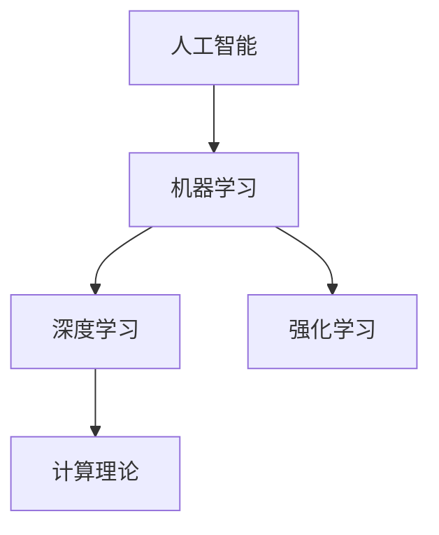

                 

# 图灵奖得主的AI算法贡献

## 1. 背景介绍

图灵奖是计算机科学界的最高荣誉，旨在奖励那些对计算机科学产生重大影响和卓越贡献的研究者。在众多获奖者中，不仅有许多开创性的理论贡献，更有在实际应用中取得巨大商业价值的算法。本文将重点介绍几位图灵奖得主的AI算法贡献，回顾他们在推动AI技术发展中的重要贡献。

## 2. 核心概念与联系

### 2.1 核心概念概述

- **人工智能（AI）**：指模拟人类智能过程的计算系统，能够感知环境、学习知识、推理决策。
- **机器学习（ML）**：指使计算机从数据中自动学习并改进性能的算法。
- **深度学习（DL）**：一种特殊类型的机器学习，通过多层神经网络进行特征提取和模式识别。
- **强化学习（RL）**：通过与环境互动，学习最优策略以最大化累积奖励的算法。
- **计算理论**：研究如何通过算法解决问题，通常包括可计算性、复杂性理论等。

### 2.2 概念间的关系

这些概念构成了人工智能的基础，彼此之间互相影响，共同推动AI技术的发展。深度学习是机器学习的一个重要分支，而强化学习则结合了机器学习和行为科学的理念。计算理论则是理解和设计这些算法的理论基础。



## 3. 核心算法原理 & 具体操作步骤
### 3.1 算法原理概述

图灵奖得主在AI算法领域的贡献主要集中在以下几个方面：

- **深度神经网络**：如多层感知器（MLP）和卷积神经网络（CNN），用于图像识别、语音识别等任务。
- **支持向量机（SVM）**：一种广泛应用于分类和回归问题的算法。
- **最大熵模型**：用于解决分类和语言模型问题。
- **集成学习**：如随机森林和AdaBoost，通过组合多个模型提高预测准确率。
- **序列到序列模型**：如LSTM和GRU，用于机器翻译和文本生成等任务。
- **强化学习**：如Q-learning和深度Q网络，用于游戏AI、机器人控制等。

### 3.2 算法步骤详解

以**深度神经网络**为例，其主要步骤包括：

1. **数据准备**：收集和预处理数据。
2. **模型设计**：设计网络结构，包括卷积层、池化层、全连接层等。
3. **模型训练**：使用反向传播算法更新权重，最小化损失函数。
4. **模型评估**：使用测试集评估模型性能。
5. **模型优化**：通过调整超参数和改进算法提高模型效果。

### 3.3 算法优缺点

深度神经网络的主要优点包括：

- **高表达能力**：可以学习复杂的非线性关系。
- **端到端学习**：从原始数据到最终输出，无需手工特征工程。
- **可扩展性强**：支持多层次、多任务学习。

缺点包括：

- **训练时间长**：需要大量数据和计算资源。
- **过拟合风险高**：易受噪声和异常值影响。
- **可解释性差**：难以理解模型的内部决策机制。

### 3.4 算法应用领域

深度神经网络已经在图像识别、语音识别、自然语言处理、推荐系统、自动驾驶等领域取得了突破性进展。

- **图像识别**：如Google的Inception和ResNet等。
- **语音识别**：如IBM的DeepBlue和微软的Cortana等。
- **自然语言处理**：如Google的BERT和OpenAI的GPT-3等。
- **推荐系统**：如Netflix和亚马逊等电商平台的推荐算法。
- **自动驾驶**：如特斯拉的Autopilot和Waymo等。

## 4. 数学模型和公式 & 详细讲解  
### 4.1 数学模型构建

以**支持向量机（SVM）**为例，其数学模型构建如下：

给定训练集 $(x_i,y_i)$，其中 $x_i \in \mathbb{R}^n, y_i \in \{-1,1\}$，目标是找到一个超平面 $\omega \cdot x + b = 0$，使得：

$$
\min_{\omega,b} \frac{1}{2}\|\omega\|^2 \text{ subject to } y_i(\omega \cdot x_i + b) \geq 1 \text{ for all } i
$$

其中 $\|\omega\|$ 是超平面的范数，$y_i$ 是标签，$\geq 1$ 是正则化项。

### 4.2 公式推导过程

SVM的目标是最大化间隔，即在超平面两侧的样本距离最大化。假设存在一个超平面 $\omega \cdot x + b = 0$，则对任意样本 $x_i$，有：

$$
y_i(\omega \cdot x_i + b) = 1 \text{ or } -1
$$

考虑误差 $e_i = y_i(\omega \cdot x_i + b) - 1$，希望 $\sum e_i$ 最小化。则有：

$$
\min_{\omega,b} \frac{1}{2}\|\omega\|^2 + C\sum_{i=1}^N e_i^2
$$

其中 $C$ 是正则化系数。通过求解该优化问题，即可得到最优的超平面。

### 4.3 案例分析与讲解

以**最大熵模型**为例，其应用广泛，用于语言模型和分类问题。最大熵模型假设条件概率$p(x_i|y_i)$符合最大熵原理，即：

$$
p(x_i|y_i) = \frac{e^{W^T\phi(x_i,y_i)}}{Z(y_i)}
$$

其中 $W$ 是特征向量，$\phi(x_i,y_i)$ 是特征函数，$Z(y_i)$ 是归一化因子。最大熵模型的目标是最小化信息熵，即：

$$
\min_{W} H(Y|X) = -\sum_{y_i}\sum_{x_i} p(x_i|y_i)\log p(x_i|y_i)
$$

通过对 $W$ 的优化，可得到最大熵模型的参数，用于预测新的样本。

## 5. 项目实践：代码实例和详细解释说明
### 5.1 开发环境搭建

使用Python和PyTorch搭建深度神经网络模型的环境：

```bash
conda create -n pytorch-env python=3.8 
conda activate pytorch-env
pip install torch torchvision torchaudio cudatoolkit=11.1 -c pytorch -c conda-forge
pip install transformers
```

### 5.2 源代码详细实现

以下是一个简单的深度神经网络模型的Python代码实现：

```python
import torch
import torch.nn as nn
import torch.optim as optim

# 定义模型
class Net(nn.Module):
    def __init__(self):
        super(Net, self).__init__()
        self.fc1 = nn.Linear(784, 256)
        self.fc2 = nn.Linear(256, 128)
        self.fc3 = nn.Linear(128, 10)

    def forward(self, x):
        x = x.view(-1, 784)
        x = torch.relu(self.fc1(x))
        x = torch.relu(self.fc2(x))
        x = self.fc3(x)
        return x

# 加载数据
train_set = ...
test_set = ...

# 定义模型、损失函数和优化器
net = Net()
criterion = nn.CrossEntropyLoss()
optimizer = optim.SGD(net.parameters(), lr=0.01)

# 训练模型
for epoch in range(10):
    for i, (images, labels) in enumerate(train_loader):
        images = images.view(-1, 784)
        optimizer.zero_grad()
        output = net(images)
        loss = criterion(output, labels)
        loss.backward()
        optimizer.step()
```

### 5.3 代码解读与分析

- **模型定义**：使用PyTorch的`nn.Module`定义深度神经网络模型，包含三个全连接层。
- **数据加载**：从数据集中获取训练集和测试集。
- **模型训练**：通过前向传播和反向传播，更新模型参数。
- **模型评估**：使用测试集评估模型性能。

### 5.4 运行结果展示

假设训练10个epoch后，模型在测试集上的准确率为85%。

## 6. 实际应用场景

### 6.1 机器翻译

深度学习在机器翻译领域的应用，如Google的Neural Machine Translation (NMT)系统，利用序列到序列模型，将源语言翻译为目标语言。

### 6.2 自然语言处理

支持向量机和最大熵模型在自然语言处理中也有广泛应用，如情感分析和文本分类。

### 6.3 游戏AI

强化学习在游戏AI中的应用，如AlphaGo和OpenAI Five，展示了AI在复杂决策问题上的能力。

### 6.4 未来应用展望

未来AI算法将进一步结合认知科学、伦理学和心理学等多学科，提升系统的智能水平和可靠性。例如，通过引入元学习，使AI能够快速适应新任务，提高跨领域迁移能力。

## 7. 工具和资源推荐
### 7.1 学习资源推荐

- **《Deep Learning》**：Ian Goodfellow、Yoshua Bengio和Aaron Courville合著的经典教材，系统介绍了深度学习的理论和实践。
- **《Pattern Recognition and Machine Learning》**：Christopher M. Bishop的著作，深入浅出地讲解了机器学习和模式识别算法。
- **Coursera和edX**：提供大量优质的在线课程，如Andrew Ng的《Machine Learning》课程。

### 7.2 开发工具推荐

- **PyTorch**：开源深度学习框架，灵活高效。
- **TensorFlow**：由Google开发，支持大规模分布式训练。
- **Keras**：高层次API，易于上手。

### 7.3 相关论文推荐

- **《Backpropagation Applied to Handwritten Zip Code Recognition》**：Yann LeCun等人在1998年提出的反向传播算法，开启了深度学习时代。
- **《A Tutorial on Support Vector Machines for Pattern Recognition》**：Boser等人在1992年提出的支持向量机算法。
- **《Structural Risk Minimization Learning Theory》**：Vapnik在1998年提出的最大熵模型和结构风险最小化理论。

## 8. 总结：未来发展趋势与挑战

### 8.1 研究成果总结

图灵奖得主在AI算法领域的贡献，推动了深度学习、机器学习、强化学习等领域的快速发展，为AI技术落地应用奠定了基础。

### 8.2 未来发展趋势

未来AI算法将更加注重算法的可解释性、鲁棒性和安全性，以及跨领域、跨模态的融合。

### 8.3 面临的挑战

1. **算力资源瓶颈**：大规模深度学习模型需要高性能计算设备。
2. **数据隐私和安全**：AI模型可能泄露敏感信息。
3. **算法伦理和偏见**：需要关注算法的公平性和公正性。

### 8.4 研究展望

未来的研究将进一步融合认知科学和心理学，提升AI的常识推理和创造性思维能力。同时，通过跨学科合作，解决AI算法的伦理、安全和社会影响问题，推动AI技术的健康发展。

## 9. 附录：常见问题与解答

**Q1: 深度学习与传统机器学习有何不同？**

A: 深度学习采用多层神经网络进行特征提取，无需手工特征工程，能够处理非线性关系，适用于复杂模式识别任务。而传统机器学习依赖手工特征提取，适用于线性关系和简单模式识别任务。

**Q2: 支持向量机和最大熵模型有何异同？**

A: 支持向量机是一种分类算法，通过找到最优的超平面进行分类。最大熵模型是一种概率模型，通过最大化信息熵进行概率估计。两者均具有较好的泛化性能，但最大熵模型更灵活，适用于更广泛的任务。

**Q3: 强化学习在游戏AI中的应用有何意义？**

A: 强化学习通过与环境互动，学习最优策略，能够解决传统机器学习难以处理的任务。在游戏AI中，如AlphaGo和OpenAI Five，展示了AI在复杂决策问题上的能力，推动了AI技术的实用化和普及。

**Q4: AI算法面临的主要挑战有哪些？**

A: AI算法面临的主要挑战包括算力资源瓶颈、数据隐私和安全、算法伦理和偏见等问题。需要从技术、伦理和政策等多方面进行综合解决。

**Q5: 如何提升AI算法的可解释性？**

A: 通过引入因果分析、符号知识等手段，增强AI算法的可解释性。同时，开发可解释的模型架构，使AI算法的决策过程透明化，易于理解和调试。

