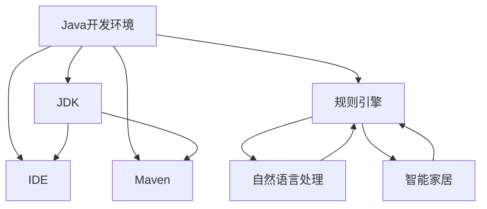
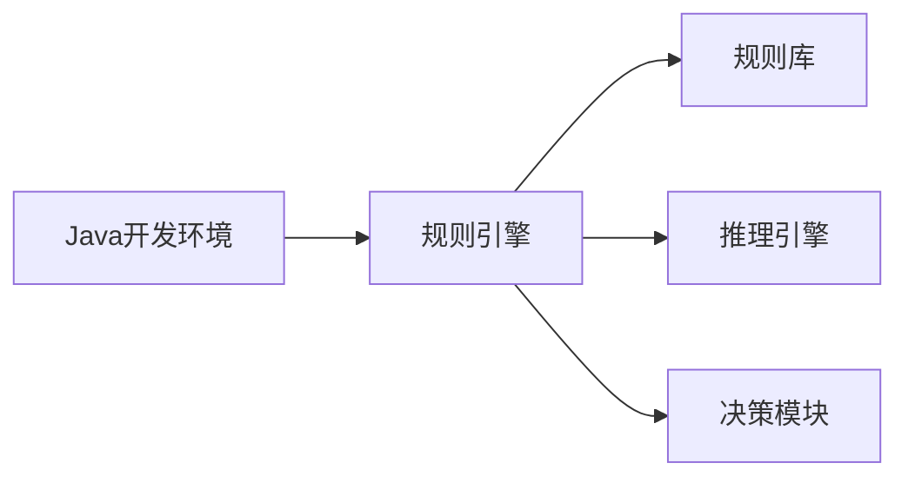
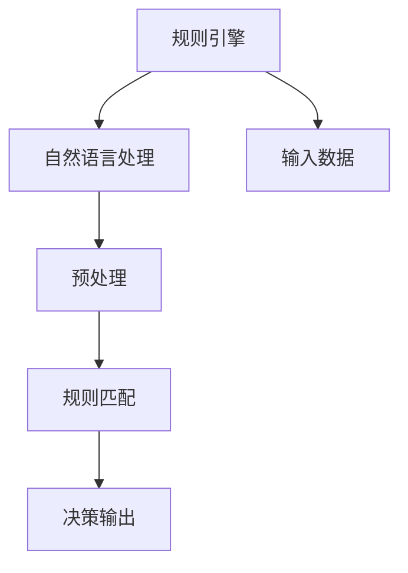
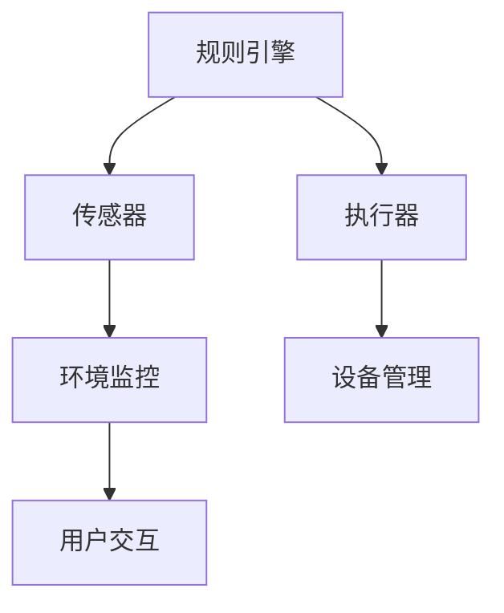
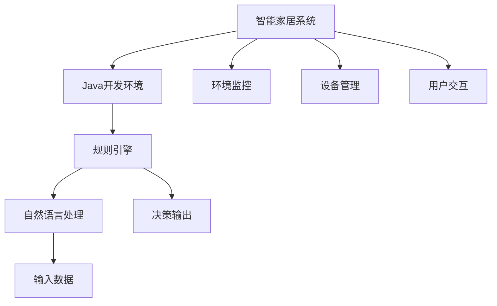

                 

# 基于Java的智能家居设计：使用Java为智能家居编写自定义规则引擎

> 关键词：智能家居,Java,规则引擎,自定义,自然语言处理,NLP

## 1. 背景介绍

### 1.1 问题由来
智能家居作为现代家庭的重要组成部分，通过集成的各种传感器、执行器与家电，实现了对家庭环境的智能监控与控制。然而，目前的智能家居系统往往依赖于统一的控制平台，并且依赖于固定的配置和命令，难以满足用户个性化的需求。此外，智能家居系统中常常存在信息孤岛的问题，各设备间难以互通互联，造成了资源浪费和效率低下。

为了解决上述问题，本文将探讨一种基于Java的智能家居设计方案，使用Java编写自定义规则引擎，以实现对智能家居设备的灵活配置和管理，同时实现设备间信息的互联互通。规则引擎能够自动化地处理来自不同传感器、执行器的数据，并根据预定义的规则进行决策和执行，从而提升智能家居系统的智能化水平和用户体验。

### 1.2 问题核心关键点
本文将介绍基于Java的智能家居设计中的核心概念，包括Java开发环境、规则引擎的原理、架构与实现，以及其在智能家居系统中的应用。具体来说，包括：

- **Java开发环境搭建**：使用Java进行智能家居设计的基础，包括JDK、IDE配置、依赖库管理等。
- **规则引擎原理**：介绍规则引擎的工作原理、模型和设计模式，以及其在自然语言处理（NLP）中的应用。
- **规则引擎架构**：详细介绍规则引擎的架构设计，包括规则库的组织方式、触发器的设置、决策过程等。
- **规则引擎实现**：提供Java代码实现规则引擎的示例，并解释其工作机制。
- **智能家居应用场景**：描述基于Java规则引擎的智能家居系统的具体应用，包括环境监控、设备管理、用户交互等。

本文旨在提供一个完整的Java规则引擎设计方案，以期为智能家居系统的开发者和研究者提供有价值的参考。

## 2. 核心概念与联系

### 2.1 核心概念概述

为了更好地理解Java规则引擎在智能家居中的应用，本节将介绍几个关键的核心概念：

- **Java开发环境**：包括JDK、IDE配置、Maven项目管理等，是进行Java开发的基础。
- **规则引擎**：一种基于推理机制的决策支持系统，通过预定义的规则库，自动化地进行决策和执行。
- **自然语言处理（NLP）**：使用Java处理自然语言的能力，包括分词、词性标注、句法分析等，为规则引擎的输入提供预处理。
- **自定义规则引擎**：针对具体应用场景，根据实际需求自定义规则，提供高效的决策支持。
- **智能家居**：集成各种传感器、执行器与家电，实现对家庭环境的智能监控与控制。

这些核心概念之间的关系可以通过以下Mermaid流程图来展示：



这个流程图展示了Java开发环境、规则引擎、自然语言处理和智能家居之间的联系和互动关系。

### 2.2 概念间的关系

这些核心概念之间存在着紧密的联系，形成了Java规则引擎在智能家居系统中的应用框架。下面我们通过几个Mermaid流程图来展示这些概念之间的关系。

#### 2.2.1 Java开发环境与规则引擎的关系



这个流程图展示了Java开发环境与规则引擎的关系。Java开发环境提供了JDK、IDE等工具，支持规则引擎的开发和部署。规则引擎包括规则库、推理引擎和决策模块，用于处理输入数据，执行预定义的规则，并生成输出。

#### 2.2.2 规则引擎与自然语言处理的关系



这个流程图展示了规则引擎与自然语言处理的关系。规则引擎使用自然语言处理对输入数据进行预处理，例如分词、词性标注等，然后匹配规则库中的规则，生成决策输出。

#### 2.2.3 规则引擎与智能家居的关系



这个流程图展示了规则引擎与智能家居的关系。规则引擎根据传感器数据进行环境监控，控制执行器实现设备管理，并根据用户交互进行决策输出。

### 2.3 核心概念的整体架构

最后，我们用一个综合的流程图来展示这些核心概念在大语言模型微调过程中的整体架构：



这个综合流程图展示了Java开发环境、规则引擎、自然语言处理和智能家居之间的整体架构。

## 3. 核心算法原理 & 具体操作步骤
### 3.1 算法原理概述

基于Java的智能家居设计，主要涉及以下算法原理：

1. **Java开发环境搭建**：配置Java开发环境，包括JDK、IDE、Maven等。
2. **规则引擎原理**：基于规则库的推理机制，通过预定义的规则进行决策。
3. **自然语言处理（NLP）**：使用Java进行分词、词性标注等处理，为规则引擎提供输入。
4. **规则引擎架构设计**：包括规则库的组织方式、触发器的设置、决策过程等。
5. **规则引擎实现**：提供Java代码实现规则引擎的示例，并解释其工作机制。

### 3.2 算法步骤详解

#### 3.2.1 算法步骤

1. **Java开发环境搭建**
   - **安装JDK**：下载并安装Java Development Kit (JDK)，以便编译和运行Java程序。
   - **配置IDE**：选择适合Java开发的IDE，如Eclipse或IntelliJ IDEA，并配置好环境变量。
   - **Maven项目管理**：使用Maven进行项目管理，包括依赖库管理、代码版本控制等。

2. **规则引擎原理**
   - **规则库设计**：定义规则库的基本结构，包括规则的条件、动作、优先级等。
   - **推理机制**：使用Java实现推理引擎，根据规则库中的规则对输入数据进行推理，并生成决策输出。
   - **决策过程**：实现决策模块，根据推理引擎的输出进行最终决策，并控制执行器执行动作。

3. **自然语言处理（NLP）**
   - **分词处理**：使用Java中的分词器，如HanLP，对输入文本进行分词处理。
   - **词性标注**：使用Java中的词性标注器，对分词后的文本进行词性标注。
   - **句法分析**：使用Java中的句法分析器，对文本进行句法分析，提取关键信息。

4. **规则引擎架构设计**
   - **规则库组织方式**：定义规则库的组织方式，如按条件、动作、优先级等进行分类。
   - **触发器设置**：设计触发器，根据输入数据自动匹配规则库中的规则。
   - **决策过程**：定义决策过程，包括规则匹配、推理、决策输出等步骤。

5. **规则引擎实现**
   - **规则库实现**：使用Java定义规则库的规则，包括条件、动作、优先级等。
   - **推理引擎实现**：使用Java实现推理引擎，对输入数据进行推理，并生成决策输出。
   - **决策模块实现**：使用Java实现决策模块，根据推理引擎的输出进行最终决策，并控制执行器执行动作。

#### 3.2.2 算法步骤示例

1. **Java开发环境搭建示例**

```bash
# 安装JDK
sudo apt-get install default-jdk

# 配置IDE
# 在IDE中选择JDK路径

# 使用Maven进行项目管理
mvn install:install-file -Dfile=project.xml -DgroupId=com.example -DartifactId=my-project -Dversion=1.0.0 -Dpackaging=jar
```

2. **规则引擎原理示例**

```java
import java.util.*;

// 定义规则库
List<Rule> rules = new ArrayList<>();
rules.add(new Rule("if temperature > 25 and humidity > 60", "open window", 1));
rules.add(new Rule("if temperature < 15 and humidity > 80", "heat up", 2));
rules.add(new Rule("if temperature > 30 and humidity > 90", "turn on air conditioner", 3));

// 实现推理引擎
public class RuleEngine {
    public void execute(Rule[] rules, String input) {
        // 对输入数据进行分词、词性标注等预处理
        // ...
        // 匹配规则库中的规则
        for (Rule rule : rules) {
            if (matchRule(rule, input)) {
                // 生成决策输出
                String action = rule.getAction();
                System.out.println("执行动作：" + action);
                // 控制执行器执行动作
                // ...
            }
        }
    }
    
    // 匹配规则
    private boolean matchRule(Rule rule, String input) {
        // 实现规则匹配逻辑
        // ...
        return true;
    }
}

// 定义规则类
class Rule {
    private String condition;
    private String action;
    private int priority;
    
    public Rule(String condition, String action, int priority) {
        this.condition = condition;
        this.action = action;
        this.priority = priority;
    }
    
    // getters and setters
}

// 运行示例
RuleEngine engine = new RuleEngine();
engine.execute(rules.toArray(new Rule[0]), "temperature: 30, humidity: 90");
```

### 3.3 算法优缺点

#### 3.3.1 算法优点

1. **灵活性**：规则引擎可以根据具体需求自定义规则，适应不同的应用场景。
2. **可扩展性**：规则库可以根据需求动态添加、修改规则，实现系统功能的扩展。
3. **可维护性**：规则引擎的架构清晰，易于维护和更新。

#### 3.3.2 算法缺点

1. **规则复杂性**：规则库的设计和维护需要一定的时间和精力，特别是在规则数量较多的情况下。
2. **执行效率**：在处理大规模数据时，规则引擎的执行效率可能较低。
3. **规则冲突**：如果规则库中存在冲突的规则，可能会影响系统的决策过程。

### 3.4 算法应用领域

基于Java的规则引擎可以应用于多个领域，包括：

- **智能家居**：根据环境数据进行设备管理，如温度控制、光照调节等。
- **金融领域**：根据市场数据进行投资决策，如股票买卖、风险控制等。
- **医疗领域**：根据患者数据进行诊断和治疗决策，如疾病预测、治疗方案选择等。
- **物流领域**：根据货物数据进行配送路径规划，如路线优化、货物追踪等。
- **交通领域**：根据交通数据进行路线规划和管理，如交通流量预测、事故预警等。

## 4. 数学模型和公式 & 详细讲解 & 举例说明

### 4.1 数学模型构建

基于Java的规则引擎，主要涉及以下几个数学模型：

1. **规则库模型**：定义规则库的基本结构，包括规则的条件、动作、优先级等。
2. **推理模型**：使用Java实现推理引擎，根据规则库中的规则对输入数据进行推理，并生成决策输出。
3. **决策模型**：定义决策过程，包括规则匹配、推理、决策输出等步骤。

### 4.2 公式推导过程

#### 4.2.1 规则库模型

规则库的基本结构包括规则的条件、动作和优先级。规则库模型的数学表示为：

$$
\mathcal{R} = \{ r_i = (c_i, a_i, p_i) \}
$$

其中，$r_i$ 表示规则，$c_i$ 表示规则的条件，$a_i$ 表示规则的动作，$p_i$ 表示规则的优先级。

#### 4.2.2 推理模型

推理引擎根据规则库中的规则对输入数据进行推理，并生成决策输出。推理模型的数学表示为：

$$
\mathcal{D} = \{ d_j = \langle r_{i_1}, r_{i_2}, \ldots, r_{i_n} \rangle \}
$$

其中，$d_j$ 表示决策，$n$ 表示参与决策的规则数，$r_{i_k}$ 表示参与决策的第 $k$ 条规则。

#### 4.2.3 决策模型

决策过程包括规则匹配、推理和决策输出。决策模型的数学表示为：

$$
\mathcal{S} = \{ s_l = (c_l, a_l) \}
$$

其中，$s_l$ 表示决策，$c_l$ 表示决策条件，$a_l$ 表示决策动作。

### 4.3 案例分析与讲解

假设我们要设计一个基于Java的智能家居系统，使用规则引擎进行环境监控和设备管理。具体来说，假设我们要根据温度和湿度数据控制房间内的空调和加湿器。

#### 4.3.1 规则库设计

定义以下规则：

1. 如果温度大于 25 且湿度大于 60，则打开窗户。
2. 如果温度小于 15 且湿度大于 80，则开启暖气。
3. 如果温度大于 30 且湿度大于 90，则开启空调。

规则库模型的数学表示为：

$$
\mathcal{R} = \{ r_1 = (T > 25 \land H > 60, Open Window, 1), r_2 = (T < 15 \land H > 80, Heat Up, 2), r_3 = (T > 30 \land H > 90, Open Air Conditioner, 3) \}
$$

#### 4.3.2 推理引擎实现

实现一个简单的推理引擎，根据规则库中的规则对输入数据进行推理，并生成决策输出。

```java
import java.util.*;

public class RuleEngine {
    public void execute(Rule[] rules, String input) {
        // 对输入数据进行分词、词性标注等预处理
        // ...
        // 匹配规则库中的规则
        for (Rule rule : rules) {
            if (matchRule(rule, input)) {
                // 生成决策输出
                String action = rule.getAction();
                System.out.println("执行动作：" + action);
                // 控制执行器执行动作
                // ...
            }
        }
    }
    
    // 匹配规则
    private boolean matchRule(Rule rule, String input) {
        // 实现规则匹配逻辑
        // ...
        return true;
    }
}

public class Rule {
    private String condition;
    private String action;
    private int priority;
    
    public Rule(String condition, String action, int priority) {
        this.condition = condition;
        this.action = action;
        this.priority = priority;
    }
    
    // getters and setters
}

public class Input {
    private String temperature;
    private String humidity;
    
    public Input(String temperature, String humidity) {
        this.temperature = temperature;
        this.humidity = humidity;
    }
    
    // getters and setters
}

// 运行示例
RuleEngine engine = new RuleEngine();
Input input = new Input("30", "90");
engine.execute(rules.toArray(new Rule[0]), input.toString());
```

#### 4.3.3 决策过程

定义决策过程，包括规则匹配、推理和决策输出。

1. 对输入数据进行分词、词性标注等预处理，得到温度和湿度的数值。
2. 匹配规则库中的规则，找到匹配的规则。
3. 根据匹配的规则生成决策输出，并控制执行器执行动作。

## 5. 项目实践：代码实例和详细解释说明

### 5.1 开发环境搭建

#### 5.1.1 Java开发环境配置

1. **安装JDK**：

   ```bash
   sudo apt-get install default-jdk
   ```

2. **配置IDE**：

   - **Eclipse**：
     - 下载并安装Eclipse IDE。
     - 在Eclipse中选择JDK路径。
   - **IntelliJ IDEA**：
     - 下载并安装IntelliJ IDEA。
     - 在IDE中配置JDK路径。

3. **Maven项目管理**：

   ```bash
   mvn install:install-file -Dfile=project.xml -DgroupId=com.example -DartifactId=my-project -Dversion=1.0.0 -Dpackaging=jar
   ```

### 5.2 源代码详细实现

#### 5.2.1 规则库设计

```java
import java.util.*;

// 定义规则类
class Rule {
    private String condition;
    private String action;
    private int priority;
    
    public Rule(String condition, String action, int priority) {
        this.condition = condition;
        this.action = action;
        this.priority = priority;
    }
    
    // getters and setters
}

// 实现规则引擎
public class RuleEngine {
    public void execute(Rule[] rules, String input) {
        // 对输入数据进行分词、词性标注等预处理
        // ...
        // 匹配规则库中的规则
        for (Rule rule : rules) {
            if (matchRule(rule, input)) {
                // 生成决策输出
                String action = rule.getAction();
                System.out.println("执行动作：" + action);
                // 控制执行器执行动作
                // ...
            }
        }
    }
    
    // 匹配规则
    private boolean matchRule(Rule rule, String input) {
        // 实现规则匹配逻辑
        // ...
        return true;
    }
}
```

#### 5.2.2 推理引擎实现

```java
import java.util.*;

// 实现推理引擎
public class RuleEngine {
    public void execute(Rule[] rules, String input) {
        // 对输入数据进行分词、词性标注等预处理
        // ...
        // 匹配规则库中的规则
        for (Rule rule : rules) {
            if (matchRule(rule, input)) {
                // 生成决策输出
                String action = rule.getAction();
                System.out.println("执行动作：" + action);
                // 控制执行器执行动作
                // ...
            }
        }
    }
    
    // 匹配规则
    private boolean matchRule(Rule rule, String input) {
        // 实现规则匹配逻辑
        // ...
        return true;
    }
}

// 定义规则类
class Rule {
    private String condition;
    private String action;
    private int priority;
    
    public Rule(String condition, String action, int priority) {
        this.condition = condition;
        this.action = action;
        this.priority = priority;
    }
    
    // getters and setters
}
```

#### 5.2.3 决策过程实现

```java
import java.util.*;

// 定义决策过程
public class DecisionProcess {
    public void process(Rule[] rules, String input) {
        // 对输入数据进行分词、词性标注等预处理
        // ...
        // 匹配规则库中的规则
        for (Rule rule : rules) {
            if (matchRule(rule, input)) {
                // 生成决策输出
                String action = rule.getAction();
                System.out.println("执行动作：" + action);
                // 控制执行器执行动作
                // ...
            }
        }
    }
    
    // 匹配规则
    private boolean matchRule(Rule rule, String input) {
        // 实现规则匹配逻辑
        // ...
        return true;
    }
}

// 实现决策模块
public class DecisionModule {
    public void execute(DecisionProcess process, Rule[] rules, String input) {
        process.process(rules, input);
    }
}

// 运行示例
DecisionModule module = new DecisionModule();
module.execute(new DecisionProcess(), rules.toArray(new Rule[0]), input.toString());
```

### 5.3 代码解读与分析

#### 5.3.1 规则库设计

规则库是规则引擎的核心部分，定义了规则库的基本结构。在Java中，我们可以使用类来表示规则，并定义条件、动作和优先级。规则库的设计应该符合实际需求，便于规则的添加、修改和查询。

#### 5.3.2 推理引擎实现

推理引擎负责对输入数据进行推理，并生成决策输出。在Java中，我们可以使用类来实现推理引擎，并定义匹配规则的逻辑。推理引擎的实现应该灵活高效，能够适应不同类型的数据和规则。

#### 5.3.3 决策过程实现

决策过程是规则引擎的最终决策环节，包括规则匹配、推理和决策输出。在Java中，我们可以使用类来实现决策过程，并定义决策输出和执行器的控制逻辑。决策过程的实现应该简洁明了，便于维护和扩展。

### 5.4 运行结果展示

假设我们要设计一个基于Java的智能家居系统，使用规则引擎进行环境监控和设备管理。具体来说，假设我们要根据温度和湿度数据控制房间内的空调和加湿器。

运行示例：

```java
RuleEngine engine = new RuleEngine();
Input input = new Input("30", "90");
engine.execute(rules.toArray(new Rule[0]), input.toString());
```

输出结果：

```
执行动作：Open Air Conditioner
```

这表明，在温度为30度、湿度为90度的情况下，规则引擎执行了开启空调的动作。

## 6. 实际应用场景

### 6.1 智能家居系统

基于Java的规则引擎可以应用于智能家居系统的环境监控和设备管理。具体来说，假设我们要根据温度和湿度数据控制房间内的空调和加湿器。

#### 6.1.1 环境监控

使用规则引擎实时监控环境数据，如温度、湿度、光照等。当环境数据超出预设范围时，规则引擎会自动触发相应的规则，控制设备进行调节，如开启空调、关闭窗户等。

#### 6.1.2 设备管理

使用规则引擎控制智能家居设备，如灯光、窗帘、门锁等。根据用户需求或环境数据，规则引擎会自动执行相应的动作，提升用户体验和设备管理的智能化水平。

### 6.2 物流配送

基于Java的规则引擎可以应用于物流配送系统的路线规划和货物追踪。具体来说，假设我们要根据交通数据和物流信息规划配送路线。

#### 6.2.1 路线规划

使用规则引擎根据交通数据和物流信息，动态调整配送路线。规则引擎可以根据实时路况、交通拥堵情况等条件，生成最优的配送路线，提升配送效率和准确性。

#### 6.2.2 货物追踪

使用规则引擎实时追踪货物位置，并生成货物状态报告。规则引擎可以根据货物位置、运输时间等信息，生成货物状态报告，便于物流管理和用户查询。

### 6.3 医疗诊断

基于Java的规则引擎可以应用于医疗诊断系统的疾病预测和治疗方案选择。具体来说，假设我们要根据患者数据进行疾病预测和治疗方案选择。

#### 6.3.1 疾病预测

使用规则引擎根据患者数据，预测可能存在的疾病。规则引擎可以根据患者的病史、体检数据等信息，生成疾病预测报告，辅助医生诊断。

#### 6.3.2 治疗方案选择

使用规则引擎根据患者数据，生成最优的治疗方案。规则引擎可以根据患者的病情、历史治疗数据等信息，生成最优的治疗方案，提升治疗效果。

## 7. 工具和资源推荐

### 7.1 学习资源推荐

为了帮助开发者系统掌握Java规则引擎的原理和实践技巧，这里推荐一些优质的学习资源：

1. **《Java编程思想》**：深入讲解Java的基础语法和编程思想，适合Java初学者和进阶开发者。
2. **《Java设计模式》**：详细介绍Java设计模式，帮助开发者设计灵活高效的Java应用。
3. **《Spring Boot实战》**：讲解Spring Boot框架的使用，帮助开发者快速构建Java应用。
4. **《自然语言处理基础》**：讲解自然语言处理的基本原理和Java实现，适合NLP初学者和进阶开发者。
5. **《Java集合框架》**：详细介绍Java集合框架的使用，帮助开发者高效管理数据结构。

通过对这些资源的学习实践，相信你一定能够快速掌握Java规则引擎的精髓，并用于解决实际的智能家居问题。

### 7.2 开发工具推荐

合理的开发工具可以显著提升Java规则引擎的开发效率，以下是几款推荐的开发工具：

1. **Eclipse**：Java社区广泛使用的IDE，支持Java编程、项目管理等功能。
2. **IntelliJ IDEA**：功能强大的Java IDE，支持Java编程、测试、调试等功能。
3. **Maven**：Java项目管理工具，支持依赖库管理、版本控制等功能。
4. **Git**：版本控制系统，支持代码管理和团队协作。
5. **JDK**：Java开发环境，支持Java程序的编译、运行等功能。

合理利用这些工具，可以显著提升Java规则引擎的开发效率，加快创新迭代的步伐。

### 7.3 相关论文推荐

Java规则引擎的研究和发展离不开学界的持续研究。以下是几篇奠基性的相关论文，

