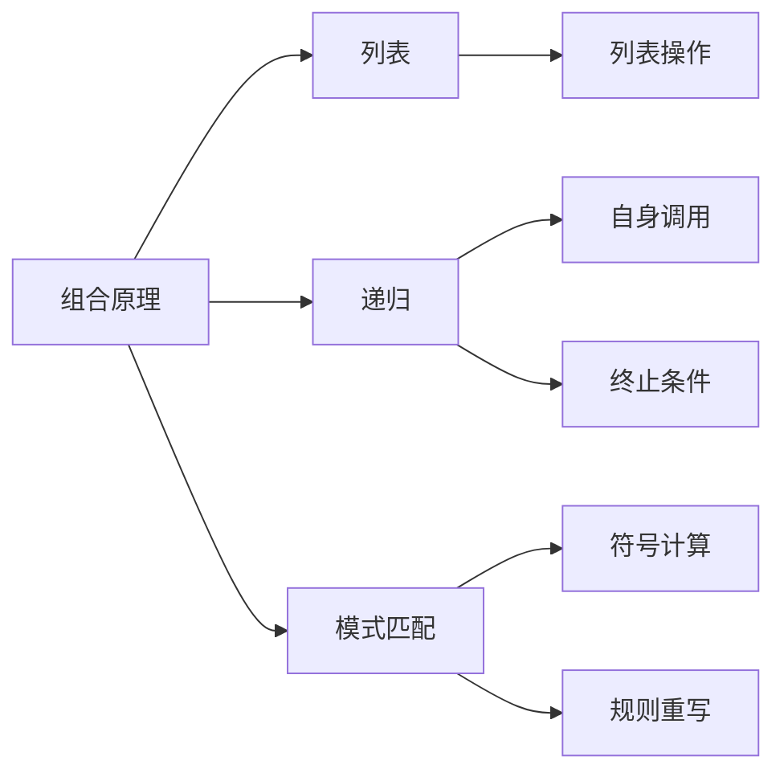

# 集合论导引：L中的组合原理

## 1. 背景介绍

### 1.1 问题的由来

集合论是数学的一个基础分支,它研究集合及其运算、关系等性质。在计算机科学和数学逻辑中,集合论扮演着重要角色。组合原理是集合论中的一个核心概念,它研究对象按一定方式组合在一起的计数问题。

组合原理在计算机科学中有着广泛的应用,例如:

- 算法复杂度分析
- 编码理论
- 密码学
- 概率论与统计学
- 图论
- ...

随着计算机科学的发展,对组合原理的理解和应用也日益深入。本文将探讨组合原理在L语言中的体现。

### 1.2 研究现状

L是一种函数式编程语言,由约翰·麦卡锡(John McCarthy)于1958年创建。它是第一种设计用于人工智能研究的语言,也是现代函数式编程语言(如Lisp、Scheme等)的先驱。

L语言中的组合原理主要体现在列表(List)的处理上。列表是L语言中最基本的数据结构,可以看作是一种递归定义的集合。L语言提供了丰富的列表操作函数,使得程序员可以方便地进行组合计算。

目前,已有一些研究人员探讨了L语言中组合原理的应用,例如:

- 斐波那契数列的计算
- 排列组合问题的求解
- 图论算法的实现
- 符号计算与模式匹配
- ...

然而,这些研究大多集中在特定问题领域,缺乏对L语言中组合原理整体性的阐述。

### 1.3 研究意义

深入理解L语言中的组合原理,有助于:

1. 掌握函数式编程的思维方式,提高编程能力。
2. 更好地利用L语言解决实际问题,提高程序的效率和可读性。
3. 将组合原理应用于其他领域,如密码学、编码理论等。
4. 为人工智能研究提供理论基础和实现工具。

### 1.4 本文结构

本文将系统地介绍L语言中的组合原理,内容安排如下:

1. 背景介绍
2. 核心概念与联系
3. 核心算法原理与具体操作步骤
4. 数学模型和公式详细讲解及举例说明
5. 项目实践:代码实例和详细解释说明
6. 实际应用场景
7. 工具和资源推荐
8. 总结:未来发展趋势与挑战
9. 附录:常见问题与解答

## 2. 核心概念与联系



组合原理在L语言中主要体现在以下几个核心概念:

1. **列表(List)**: L语言中最基本的数据结构,可看作递归定义的集合。
2. **递归(Recursion)**: 函数自身调用的编程技巧,用于解决复杂问题。
3. **模式匹配(Pattern Matching)**: L语言中的特殊语法,用于符号计算和规则重写。

这些概念相互关联、环环相扣:

- 列表是组合原理的载体,通过对列表的操作实现组合计算。
- 递归思想贯穿于组合原理的算法实现中。
- 模式匹配为组合原理提供了符号化的表达和求解方式。

掌握这些核心概念及其联系,是理解L语言中组合原理的基础。

## 3. 核心算法原理与具体操作步骤

### 3.1 算法原理概述

L语言中实现组合原理的核心算法主要有:

1. **生成算法**: 根据给定条件,生成所有可能的组合。
2. **计数算法**: 统计满足特定条件的组合数量。
3. **选择算法**: 从全部组合中,选择满足特定条件的组合。

这些算法都依赖于以下几个基本思想:

1. **递归(Recursion)**: 将复杂问题分解为相似的子问题,通过自身调用求解。
2. **减治(Divide and Conquer)**: 将问题划分为若干子问题,分别求解后合并结果。
3. **回溯(Backtracking)**: 在遍历所有可能情况时,及时剪枝以减少计算量。

### 3.2 算法步骤详解

以生成算法为例,其基本步骤如下:

1. **终止条件检测**: 检查是否满足生成组合的终止条件,如长度达到要求等。若满足,将当前组合加入结果集。
2. **选择位置**: 确定当前要选择的位置,通常从左至右或从小到大选择。
3. **选择元素**: 根据约束条件,选择当前位置可用的元素。
4. **递归生成**: 对于每个选择,递归调用生成算法,生成其后续组合。
5. **回溯重置**: 回到上一层递归,重置当前位置的选择,继续尝试其他可能的元素。

该算法的关键在于:正确设置终止条件、选择位置、可选元素范围,并通过递归和回溯高效地生成所有可能组合。

### 3.3 算法优缺点

**优点**:

1. 思路简单直观,易于理解和实现。
2. 具有很强的通用性,可解决多种组合问题。
3. 利用递归和回溯,减少了重复计算。

**缺点**:

1. 对于规模较大的问题,递归调用过多会导致效率低下。
2. 需要合理设置剪枝条件,否则会做无用功。
3. 对于某些特殊情况,可能存在更高效的专用算法。

### 3.4 算法应用领域

组合原理及其相关算法在计算机科学中有广泛应用,包括但不限于:

1. **算法设计与分析**: 用于估计算法的时间/空间复杂度。
2. **密码学**: 设计密钥生成算法、分析密码强度等。
3. **编码理论**: 构造纠错码、数据压缩编码等。
4. **人工智能**: 模式识别、规则生成、博弈树搜索等。
5. **计算生物学**: 基因序列分析、蛋白质结构预测等。
6. **组合数学**: 图论、代数、拓扑等领域的计算问题。

总的来说,组合原理为解决各类"排列组合"问题提供了强有力的理论基础和计算工具。

## 4. 数学模型和公式详细讲解及举例说明

### 4.1 数学模型构建

组合原理的数学模型主要包括以下几个部分:

1. **集合与幂集**
2. **乘积运算**
3. **加法原理与乘法原理**
4. **排列与组合**

其中,集合与幂集是组合原理的基础概念,乘积运算用于计算笛卡尔积的大小,加法原理与乘法原理用于计算不相交和相交事件的可能情况数,排列与组合则是组合原理的核心内容。

### 4.2 公式推导过程

**1. 集合与幂集**

设$A$为一个集合,其幂集$\mathcal{P}(A)$定义为$A$的所有子集构成的集合,即:

$$\mathcal{P}(A)=\{X|X\subseteq A\}$$

对于有限集合$A$,其幂集的基数(元素个数)为$2^{|A|}$。

**2. 乘积运算**

设$A$和$B$为两个集合,它们的笛卡尔积$A\times B$定义为所有有序对$(a,b)$构成的集合,其中$a\in A, b\in B$。

笛卡尔积的基数公式为:

$$|A\times B|=|A|\times|B|$$

**3. 加法原理与乘法原理**

加法原理:若$A$和$B$为两个不相交的有限集合,则$A\cup B$的基数为:

$$|A\cup B|=|A|+|B|$$

乘法原理:若$A$和$B$为两个有限集合,则$A\times B$的基数为:

$$|A\times B|=|A|\times|B|$$

**4. 排列与组合**

排列:从$n$个不同元素中取出$r$个元素,排成一列,这样的排列有$P_n^r$种,计算公式为:

$$P_n^r=\frac{n!}{(n-r)!}$$

组合:从$n$个不同元素中取出$r$个元素,不考虑顺序,这样的组合有$C_n^r$种,计算公式为:

$$C_n^r=\binom{n}{r}=\frac{n!}{r!(n-r)!}$$

### 4.3 案例分析与讲解

**例1**: 在一个无重复元素的集合$A$中,求$A$的幂集$\mathcal{P}(A)$的基数。

**解**:
设$|A|=n$,根据幂集定义,每个元素要么属于子集,要么不属于子集,因此对于每个元素有两种选择,所以$\mathcal{P}(A)$的基数为:

$$|\mathcal{P}(A)|=2^n$$

**例2**: 有$5$种不同的水果和$3$种不同的蔬菜,求这些水果和蔬菜可以组成多少种不同的拼盘?

**解**:
设$A$为水果集合,有$5$种选择;$B$为蔬菜集合,有$3$种选择。
根据乘法原理,每种水果都可以与每种蔬菜组合,所以不同拼盘数为:

$$|A\times B|=5\times 3=15$$

**例3**: 一家公司有$8$名员工,现在要选出$3$人作为项目小组成员,求有多少种选择方案?

**解**:
这是一个典型的组合问题。从$8$个员工中选$3$个,不考虑顺序,根据组合公式:

$$C_8^3=\binom{8}{3}=\frac{8!}{3!(8-3)!}=\frac{8\times 7\times 6}{3\times 2\times 1}=56$$

因此,一共有$56$种不同的选择方案。

### 4.4 常见问题解答

**1. 什么是组合原理?**

组合原理研究对象按一定方式组合在一起的计数问题,是集合论的一个重要分支。

**2. 组合原理在计算机科学中有什么应用?**

组合原理广泛应用于算法复杂度分析、密码学、编码理论、人工智能、计算生物学等领域。

**3. L语言中如何实现组合原理相关算法?**

L语言利用列表、递归、模式匹配等特性,实现了生成算法、计数算法、选择算法等组合原理相关算法。

**4. 组合原理算法的时间复杂度如何?**

组合原理算法的时间复杂度通常较高,常见的是指数级别的$O(n^k)$或阶乘级别的$O(n!)$,需要通过剪枝等优化策略来提高效率。

**5. 组合原理与其他数学分支有什么关系?**

组合原理与概率论、图论、代数、拓扑学等数学分支有着密切联系,它们相互借鉴、相互渗透。

## 5. 项目实践:代码实例和详细解释说明

### 5.1 开发环境搭建

本节将使用Racket语言(一种基于L语言的现代方言)进行实践,首先需要安装Racket开发环境。可以从官网(https://racket-lang.org/)下载并安装最新版本。

安装完成后,启动DrRacket IDE,新建一个文件,即可开始编写Racket代码。

### 5.2 源代码详细实现

以下是一个生成给定长度列表的所有排列的Racket代码实现:

```racket
#lang racket

; 列表排列生成器
(define (permutations lst)
  (cond
    [(null? lst) (list '())]
    [else
     (foldl
      (lambda (x p)
        (append-map (lambda (y) (map (lambda (z) (cons x z)) y)) p))
      '()
      lst
      (permutations (remove lst (car lst))))]))

; 测试用例
(permutations '(1 2 3))
; 输出: '((1 2 3) (1 3