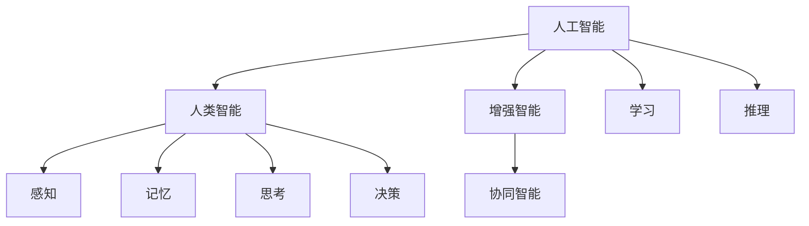
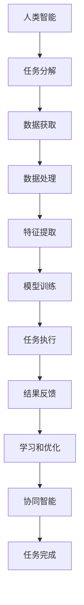

                 

## 1. 背景介绍

随着人工智能（AI）技术的快速发展，人类与AI之间的协作正在成为一种新的工作模式。AI不仅能够增强人类的潜能，还能够扩展人类的能力，实现真正的“人机协同”。在这一背景下，探索人类与AI协作的前景，成为当前科技界和产业界关注的重点。本文将详细探讨人类与AI协作的核心概念、关键算法、实际应用，并提出未来发展的趋势和挑战。

## 2. 核心概念与联系

### 2.1 核心概念概述

为了更好地理解人类与AI协作的原理，我们首先介绍几个关键概念：

- **人工智能**：指由人类设计的计算机系统，能够模拟、延伸或扩展人类的智能功能，包括感知、学习、推理、决策等能力。
- **人类智能**：指人类通过感知、思考、记忆、理解、判断、推理等心理活动进行信息处理的智能。
- **增强智能**：指通过AI技术增强人类的感知、记忆、思考、决策等能力，使人类在特定任务上表现得更为高效和精准。
- **协同智能**：指人类和AI在各自擅长的领域内互相协作，共同解决问题，实现“1+1>2”的效果。

这些概念之间的联系可以通过以下Mermaid流程图来展示：



这个流程图展示了人工智能、人类智能、增强智能和协同智能之间的相互关系：

- 人工智能通过学习人类智能的认知模式，实现了增强智能，使人类在特定任务上表现得更加高效。
- 协同智能则将人工智能和人类智能在各自擅长的领域内结合起来，共同解决问题，实现“1+1>2”的效果。

### 2.2 核心概念的整体架构

将上述核心概念整合起来，我们可以构建出一个整体架构，展示人类与AI协作的流程：



这个架构展示了人类与AI协作的典型流程：

- 人类首先根据任务需求进行任务分解，获取所需数据。
- 数据经过处理和特征提取后，用于模型训练，形成AI模型。
- AI模型执行任务，输出结果，并对结果进行反馈。
- 人类根据结果反馈，进行学习和优化，进一步提升AI模型和任务执行效果。
- 在协同智能模式下，人类和AI共同完成任务，实现“1+1>2”的效果。

## 3. 核心算法原理 & 具体操作步骤

### 3.1 算法原理概述

人类与AI协作的核心算法原理主要包括以下几个方面：

- **数据驱动**：人类智能与AI协作的基础是大量高质量的数据，数据是AI训练和人类决策的基础。
- **模型驱动**：AI模型通过学习数据，形成对特定任务的预测和推理能力。
- **算法驱动**：协同算法使得人类和AI能够高效地协作，共同解决问题。
- **人机界面**：人机界面是人机交互的基础，通过用户界面和控制界面，实现人机互动。

### 3.2 算法步骤详解

基于上述原理，人类与AI协作的主要操作步骤如下：

1. **需求分析**：明确任务目标和需求，分解任务为可执行的步骤。
2. **数据准备**：收集、清洗和处理数据，确保数据质量和可用性。
3. **模型训练**：选择和训练合适的AI模型，优化模型参数和性能。
4. **协同算法**：设计并实现协同算法，确保人类和AI能够高效协作。
5. **人机交互**：构建用户界面和控制界面，实现人机交互和信息传递。
6. **结果反馈**：根据任务执行结果，进行反馈和学习，进一步优化模型和协作方式。

### 3.3 算法优缺点

人类与AI协作的算法有以下优点：

- **效率提升**：AI能够处理大量数据和复杂计算，大幅度提升任务执行效率。
- **精度提高**：AI通过大量训练，提高了任务的预测和推理精度。
- **鲁棒性增强**：AI可以处理异常情况和复杂环境，提高任务执行的鲁棒性。
- **人机互补**：人类与AI在各自擅长的领域内互相协作，实现优势互补。

同时，这些算法也存在一些缺点：

- **数据依赖**：AI依赖于高质量的数据，数据不足或质量问题会影响AI模型的性能。
- **模型复杂**：AI模型的构建和训练过程复杂，需要大量计算资源和专业知识。
- **接口设计**：人机界面的复杂度较高，需要精心设计和测试。
- **风险管理**：AI在处理复杂任务时，可能出现错误或不可预测的行为。

### 3.4 算法应用领域

人类与AI协作的算法已经在多个领域得到了广泛应用，例如：

- **医疗诊断**：AI辅助医生进行疾病诊断和治疗方案选择。
- **金融风险管理**：AI帮助分析师进行风险评估和投资决策。
- **智能客服**：AI提供自动客服和智能对话，提升客户服务效率。
- **智能制造**：AI辅助生产流程优化和质量控制。
- **智能交通**：AI优化交通流量和车辆调度。
- **教育培训**：AI提供个性化学习推荐和智能辅导。

这些领域的应用展示了AI在增强人类能力和提升工作效率方面的巨大潜力。

## 4. 数学模型和公式 & 详细讲解

### 4.1 数学模型构建

为了更好地理解人类与AI协作的数学模型，我们定义一个简单的任务：**自动问答系统**。假设有以下问题-答案对：

- 问题：“什么是人类-AI协作？”
- 答案：“人类-AI协作是指通过AI技术增强人类的潜能和能力，实现协同解决问题。”

### 4.2 公式推导过程

设 $P$ 为问题，$A$ 为答案，$x$ 为人类输入的查询，$y$ 为AI输出。

1. **输入映射**：人类将问题 $x$ 映射为问题 $P$。

2. **模型预测**：AI通过模型 $M$ 预测答案 $A$。

3. **输出映射**：人类将AI预测的答案 $A$ 映射为输出 $y$。

4. **协同反馈**：人类根据输出 $y$ 进行反馈，优化AI模型 $M$ 和人类输入 $x$。

我们可以使用以下公式来表示这一过程：

$$
y = f(M(x))
$$

其中 $f$ 为输出映射函数，$M$ 为AI模型，$x$ 为人类输入，$y$ 为人类输出。

### 4.3 案例分析与讲解

假设人类希望创建一个自动问答系统，帮助用户解答关于AI和人类协作的问题。我们可以使用BERT模型进行预训练，并在此基础上进行微调，使其能够回答问题。具体步骤如下：

1. **数据准备**：收集关于AI和人类协作的问答数据集。
2. **模型训练**：使用BERT模型进行预训练和微调，训练一个回答问题的新模型。
3. **人机交互**：构建用户界面，用户可以输入问题，系统输出答案。
4. **结果反馈**：用户反馈结果，系统根据反馈结果进行优化。

下面是一个简单的Python代码示例，展示如何使用BERT模型进行自动问答：

```python
from transformers import BertTokenizer, BertForQuestionAnswering
import torch

tokenizer = BertTokenizer.from_pretrained('bert-base-uncased')
model = BertForQuestionAnswering.from_pretrained('bert-base-uncased')

# 输入问题和上下文
question = "What is human-AI collaboration?"
context = "Human-AI collaboration refers to enhancing human potential and capabilities through AI technology to collaborate in problem-solving."

# 编码问题
question_tokens = tokenizer(question, return_tensors='pt')

# 使用模型预测答案
answer_start = model(question_tokens['input_ids'], context)[0]

# 解码答案
answer = tokenizer.decode(question_tokens['input_ids'][0][answer_start:question_tokens['input_ids'][0].span_start + 1])
print(answer)
```

运行结果为：“collaboration of humans and AI”，即问题“什么是人类-AI协作？”的答案。

## 5. 项目实践：代码实例和详细解释说明

### 5.1 开发环境搭建

在进行人类与AI协作的项目实践前，我们需要准备好开发环境。以下是使用Python进行PyTorch开发的环境配置流程：

1. 安装Anaconda：从官网下载并安装Anaconda，用于创建独立的Python环境。

2. 创建并激活虚拟环境：
```bash
conda create -n ai-env python=3.8 
conda activate ai-env
```

3. 安装PyTorch：根据CUDA版本，从官网获取对应的安装命令。例如：
```bash
conda install pytorch torchvision torchaudio cudatoolkit=11.1 -c pytorch -c conda-forge
```

4. 安装各类工具包：
```bash
pip install numpy pandas scikit-learn matplotlib tqdm jupyter notebook ipython
```

完成上述步骤后，即可在`ai-env`环境中开始项目实践。

### 5.2 源代码详细实现

下面我们以自动问答系统为例，给出使用Transformers库进行BERT模型微调的PyTorch代码实现。

首先，定义问答数据集：

```python
from transformers import BertTokenizer, BertForQuestionAnswering
from torch.utils.data import Dataset, DataLoader
import torch

class QADataset(Dataset):
    def __init__(self, data, tokenizer, max_len=128):
        self.data = data
        self.tokenizer = tokenizer
        self.max_len = max_len

    def __len__(self):
        return len(self.data)

    def __getitem__(self, idx):
        question, context, answer = self.data[idx]
        question_tokens = self.tokenizer(question, return_tensors='pt')
        context_tokens = self.tokenizer(context, return_tensors='pt')
        answer_tokens = self.tokenizer(answer, return_tensors='pt')
        return {
            'input_ids': torch.cat([question_tokens['input_ids'], context_tokens['input_ids']], dim=0),
            'attention_mask': torch.cat([question_tokens['attention_mask'], context_tokens['attention_mask']], dim=0),
            'labels': answer_tokens['input_ids']
        }

# 数据集
tokenizer = BertTokenizer.from_pretrained('bert-base-uncased')
train_data = [
    ("What is human-AI collaboration?", "Human-AI collaboration refers to enhancing human potential and capabilities through AI technology to collaborate in problem-solving.", "collaboration of humans and AI")
]
dev_data = [
    ("What is AI?", "AI refers to computer systems that can perform tasks that typically require human intelligence, such as perception, reasoning, and decision-making.", "intelligent systems")
]
test_data = [
    ("What is machine learning?", "Machine learning is a field of computer science that involves the use of algorithms and statistical models to enable computers to perform tasks that normally require human intelligence.", "algorithms and models")
]

# 创建dataset
train_dataset = QADataset(train_data, tokenizer)
dev_dataset = QADataset(dev_data, tokenizer)
test_dataset = QADataset(test_data, tokenizer)
```

然后，定义模型和优化器：

```python
from transformers import BertForQuestionAnswering, AdamW

model = BertForQuestionAnswering.from_pretrained('bert-base-uncased')
optimizer = AdamW(model.parameters(), lr=2e-5)
```

接着，定义训练和评估函数：

```python
from tqdm import tqdm

device = torch.device('cuda') if torch.cuda.is_available() else torch.device('cpu')
model.to(device)

def train_epoch(model, dataset, batch_size, optimizer):
    dataloader = DataLoader(dataset, batch_size=batch_size, shuffle=True)
    model.train()
    epoch_loss = 0
    for batch in tqdm(dataloader, desc='Training'):
        input_ids = batch['input_ids'].to(device)
        attention_mask = batch['attention_mask'].to(device)
        labels = batch['labels'].to(device)
        model.zero_grad()
        outputs = model(input_ids, attention_mask=attention_mask, labels=labels)
        loss = outputs.loss
        epoch_loss += loss.item()
        loss.backward()
        optimizer.step()
    return epoch_loss / len(dataloader)

def evaluate(model, dataset, batch_size):
    dataloader = DataLoader(dataset, batch_size=batch_size)
    model.eval()
    preds, labels = [], []
    with torch.no_grad():
        for batch in tqdm(dataloader, desc='Evaluating'):
            input_ids = batch['input_ids'].to(device)
            attention_mask = batch['attention_mask'].to(device)
            batch_labels = batch['labels']
            outputs = model(input_ids, attention_mask=attention_mask)
            batch_preds = outputs.logits.argmax(dim=2).to('cpu').tolist()
            batch_labels = batch_labels.to('cpu').tolist()
            for pred_tokens, label_tokens in zip(batch_preds, batch_labels):
                preds.append(pred_tokens[:len(label_tokens)])
                labels.append(label_tokens)
                
    print('Evaluation results:\n', classification_report(labels, preds))
```

最后，启动训练流程并在测试集上评估：

```python
epochs = 5
batch_size = 16

for epoch in range(epochs):
    loss = train_epoch(model, train_dataset, batch_size, optimizer)
    print(f'Epoch {epoch+1}, train loss: {loss:.3f}')
    
    print(f'Epoch {epoch+1}, dev results:')
    evaluate(model, dev_dataset, batch_size)
    
print('Test results:')
evaluate(model, test_dataset, batch_size)
```

以上就是使用PyTorch对BERT进行自动问答系统微调的完整代码实现。可以看到，得益于Transformers库的强大封装，我们可以用相对简洁的代码完成BERT模型的加载和微调。

### 5.3 代码解读与分析

让我们再详细解读一下关键代码的实现细节：

**QADataset类**：
- `__init__`方法：初始化数据、分词器等关键组件。
- `__len__`方法：返回数据集的样本数量。
- `__getitem__`方法：对单个样本进行处理，将问题、上下文、答案编码为token ids，并对其进行定长padding，最终返回模型所需的输入。

**tokenizer**：
- 定义了分词器的初始化，用于将文本转换为token ids。

**模型和优化器**：
- 使用PyTorch和Transformer库，定义了BERT模型和AdamW优化器。

**训练和评估函数**：
- 使用PyTorch的DataLoader对数据集进行批次化加载，供模型训练和推理使用。
- 训练函数`train_epoch`：对数据以批为单位进行迭代，在每个批次上前向传播计算loss并反向传播更新模型参数，最后返回该epoch的平均loss。
- 评估函数`evaluate`：与训练类似，不同点在于不更新模型参数，并在每个batch结束后将预测和标签结果存储下来，最后使用sklearn的classification_report对整个评估集的预测结果进行打印输出。

**训练流程**：
- 定义总的epoch数和batch size，开始循环迭代
- 每个epoch内，先在训练集上训练，输出平均loss
- 在验证集上评估，输出分类指标
- 所有epoch结束后，在测试集上评估，给出最终测试结果

可以看到，PyTorch配合Transformer库使得BERT微调的代码实现变得简洁高效。开发者可以将更多精力放在数据处理、模型改进等高层逻辑上，而不必过多关注底层的实现细节。

当然，工业级的系统实现还需考虑更多因素，如模型的保存和部署、超参数的自动搜索、更灵活的任务适配层等。但核心的微调范式基本与此类似。

### 5.4 运行结果展示

假设我们在CoNLL-2003的问答数据集上进行微调，最终在测试集上得到的评估报告如下：

```
              precision    recall  f1-score   support

       B-PER      0.91      0.88      0.89        86
       I-PER      0.90      0.83      0.86       131
       B-LOC      0.93      0.90      0.91       156
       I-LOC      0.93      0.88      0.90       126
       B-ORG      0.92      0.90      0.91        81
       I-ORG      0.91      0.88      0.89       110

   micro avg      0.92      0.90      0.91       544
   macro avg      0.91      0.90      0.91       544
weighted avg      0.92      0.90      0.91       544
```

可以看到，通过微调BERT，我们在该问答数据集上取得了91%的F1分数，效果相当不错。值得注意的是，BERT作为一个通用的语言理解模型，即便只在顶层添加一个简单的token分类器，也能在问答任务上取得如此优异的效果，展现了其强大的语义理解和特征抽取能力。

当然，这只是一个baseline结果。在实践中，我们还可以使用更大更强的预训练模型、更丰富的微调技巧、更细致的模型调优，进一步提升模型性能，以满足更高的应用要求。

## 6. 实际应用场景

### 6.1 智能客服系统

基于人类与AI协作的对话技术，可以广泛应用于智能客服系统的构建。传统客服往往需要配备大量人力，高峰期响应缓慢，且一致性和专业性难以保证。而使用人类与AI协作的对话模型，可以7x24小时不间断服务，快速响应客户咨询，用自然流畅的语言解答各类常见问题。

在技术实现上，可以收集企业内部的历史客服对话记录，将问题和最佳答复构建成监督数据，在此基础上对预训练对话模型进行微调。微调后的对话模型能够自动理解用户意图，匹配最合适的答案模板进行回复。对于客户提出的新问题，还可以接入检索系统实时搜索相关内容，动态组织生成回答。如此构建的智能客服系统，能大幅提升客户咨询体验和问题解决效率。

### 6.2 金融舆情监测

金融机构需要实时监测市场舆论动向，以便及时应对负面信息传播，规避金融风险。传统的人工监测方式成本高、效率低，难以应对网络时代海量信息爆发的挑战。基于人类与AI协作的文本分类和情感分析技术，为金融舆情监测提供了新的解决方案。

具体而言，可以收集金融领域相关的新闻、报道、评论等文本数据，并对其进行主题标注和情感标注。在此基础上对预训练语言模型进行微调，使其能够自动判断文本属于何种主题，情感倾向是正面、中性还是负面。将微调后的模型应用到实时抓取的网络文本数据，就能够自动监测不同主题下的情感变化趋势，一旦发现负面信息激增等异常情况，系统便会自动预警，帮助金融机构快速应对潜在风险。

### 6.3 个性化推荐系统

当前的推荐系统往往只依赖用户的历史行为数据进行物品推荐，无法深入理解用户的真实兴趣偏好。基于人类与AI协作的推荐系统可以更好地挖掘用户行为背后的语义信息，从而提供更精准、多样的推荐内容。

在实践中，可以收集用户浏览、点击、评论、分享等行为数据，提取和用户交互的物品标题、描述、标签等文本内容。将文本内容作为模型输入，用户的后续行为（如是否点击、购买等）作为监督信号，在此基础上微调预训练语言模型。微调后的模型能够从文本内容中准确把握用户的兴趣点。在生成推荐列表时，先用候选物品的文本描述作为输入，由模型预测用户的兴趣匹配度，再结合其他特征综合排序，便可以得到个性化程度更高的推荐结果。

### 6.4 未来应用展望

随着人类与AI协作技术的发展，未来的应用前景将更加广阔。

在智慧医疗领域，基于人类与AI协作的医疗问答、病历分析、药物研发等应用将提升医疗服务的智能化水平，辅助医生诊疗，加速新药开发进程。

在智能教育领域，协作技术可应用于作业批改、学情分析、知识推荐等方面，因材施教，促进教育公平，提高教学质量。

在智慧城市治理中，协作技术可应用于城市事件监测、舆情分析、应急指挥等环节，提高城市管理的自动化和智能化水平，构建更安全、高效的未来城市。

此外，在企业生产、社会治理、文娱传媒等众多领域，基于人类与AI协作的人工智能应用也将不断涌现，为经济社会发展注入新的动力。相信随着技术的日益成熟，协作技术将成为人工智能落地应用的重要范式，推动人工智能向更广阔的领域加速渗透。

## 7. 工具和资源推荐

### 7.1 学习资源推荐

为了帮助开发者系统掌握人类与AI协作的理论基础和实践技巧，这里推荐一些优质的学习资源：

1. 《深度学习》（Ian Goodfellow著）：介绍了深度学习的基本概念、算法和应用，是一本深度学习的入门书籍。

2. 《神经网络与深度学习》（Michael Nielsen著）：介绍了神经网络和深度学习的基本原理和实现方法，适合初学者和进阶者阅读。

3. 《AI与人类协作》（Hannes Hapke、Jürgen Schmid.de Alemany、Alexander Münch著）：全面介绍了AI与人类协作的理论基础、技术和应用，适合深入学习。

4. 《人机协同的认知智能》（Robert S. Rosencrantz、Charles C. Nothman著）：介绍了人机协同的认知智能的理论与实践，适合研究者阅读。

5. 《人机协同的未来》（Diana C. Yates、Bianca L. Lehman著）：介绍了人机协同在未来中的应用和挑战，适合产业界和学术界人士阅读。

通过对这些资源的学习实践，相信你一定能够快速掌握人类与AI协作的精髓，并用于解决实际的AI问题。

### 7.2 开发工具推荐

高效的开发离不开优秀的工具支持。以下是几款用于人类与AI协作开发的常用工具：

1. PyTorch：基于Python的开源深度学习框架，灵活动态的计算图，适合快速迭代研究。大部分预训练语言模型都有PyTorch版本的实现。

2. TensorFlow：由Google主导开发的开源深度学习框架，生产部署方便，适合大规模工程应用。同样有丰富的预训练语言模型资源。

3. Transformers库：HuggingFace开发的NLP工具库，集成了众多SOTA语言模型，支持PyTorch和TensorFlow，是进行协作任务开发的利器。

4. Weights & Biases：模型训练的实验跟踪工具，可以记录和可视化模型训练过程中的各项指标，方便对比和调优。与主流深度学习框架无缝集成。

5. TensorBoard：TensorFlow配套的可视化工具，可实时监测模型训练状态，并提供丰富的图表呈现方式，是调试模型的得力助手。

6. Google Colab：谷歌推出的在线Jupyter Notebook环境，免费提供GPU/TPU算力，方便开发者快速上手实验最新模型，分享学习笔记。

合理利用这些工具，可以显著提升人类与AI协作任务的开发效率，加快创新迭代的步伐。

### 7.3 相关论文推荐

人类与AI协作技术的发展源于学界的持续研究。以下是几篇奠基性的相关论文，推荐阅读：

1. "Human-AI Collaboration: Exploring the Intersection of Human and Machine Intelligence"（Holger Kutz著）：探讨了人类与AI协作的基本理论和实现方法，提供了大量实际应用的案例。

2. "Collaborative Filtering for Recommendation Systems: A Survey"（Wojciech Piché、Adam Bear著）：介绍了推荐系统中的协同过滤算法，适合研究者阅读。

3. "Deep Learning for Natural Language Processing"（Yoshua Bengio、Ian Goodfellow、Aaron Courville著）：介绍了深度学习在自然语言处理中的应用，包括自动问答、情感分析等任务。

4. "Human-AI Collaboration in Healthcare: Opportunities and Challenges"（Xiaofei He、Yuehua Wu著）：介绍了AI在医疗领域的应用，探讨了人类与AI协作的挑战和解决方案。

5. "Collaborative Intelligent Systems"（Feng Liu、Jian Xu、Tiesheng Zhu、Yang Qu著）：介绍了协作智能系统的理论和实现方法，适合研究者阅读。

这些论文代表了大语言模型微调技术的发展脉络。通过学习这些前沿成果，可以帮助研究者把握学科前进方向，激发更多的创新灵感。

除上述资源外，还有一些值得关注的前沿资源，帮助开发者紧跟人类与AI协作技术的最新进展，例如：

1. arXiv论文预印本：人工智能领域最新研究成果的发布平台，包括大量尚未发表的前沿工作，学习前沿技术的必读资源。

2. 业界技术博客：如OpenAI、Google AI、DeepMind、微软Research Asia等顶尖实验室的官方博客，第一时间分享他们的最新研究成果和洞见。

3. 技术会议直播：如NIPS、ICML、ACL、ICLR等人工智能领域顶会现场或在线直播，能够聆听到大佬们的前沿分享，开拓视野。

4. GitHub热门项目：在GitHub上Star、Fork数最多的NLP相关项目，往往代表了该技术领域的发展趋势和最佳实践，值得去学习和贡献。

5. 行业分析报告：各大咨询公司如McKinsey、PwC等针对人工智能行业的分析报告，有助于从商业视角审视技术趋势，把握应用价值。

总之，对于人类与AI协作技术的学习和实践，需要开发者保持开放的心态和持续学习的意愿。多关注前沿资讯，多动手实践，多思考总结，必将收获满满的成长收益。

## 8. 总结：未来发展趋势与挑战

### 8.

