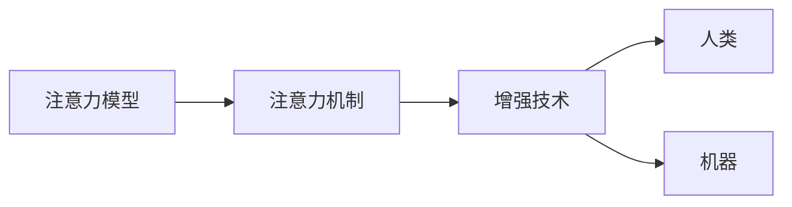
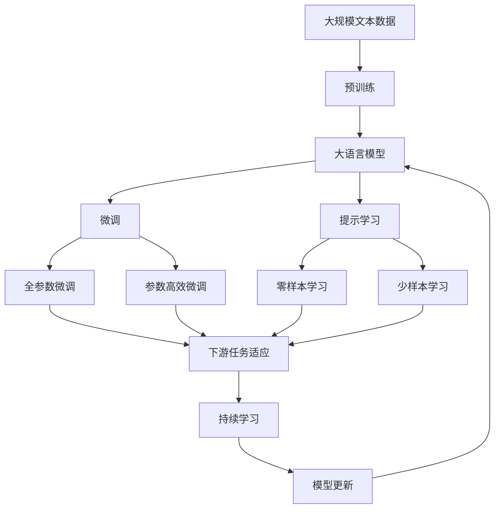

                 

# 人类注意力增强：提升专注力和注意力在教育中的技巧

## 1. 背景介绍

### 1.1 问题由来

在现代社会中，信息过载已成为一个普遍问题，人们每天接收到的信息量超乎想象。这对注意力构成了严重挑战，尤其是在教育领域。传统教育往往过于依赖书面材料和教师讲解，难以高效地吸引学生的注意力，导致学生学习效率低下，注意力难以集中。

### 1.2 问题核心关键点

人类注意力增强技术的目的在于提高学生的专注力和注意力，帮助他们更好地吸收知识，提高学习效率。这种技术主要包含两个方面：
- 提升学生的专注力，让他们在较长时间内集中注意力于学习内容。
- 提高学生的注意力，使他们能够在复杂环境中识别和选择重要信息。

### 1.3 问题研究意义

人类注意力增强技术在教育中的应用，可以显著提升学生的学习效果，缩短学习周期，提高教育质量。这种技术可以帮助学生更好地应对当前社会的快速变化，适应未来的挑战。

## 2. 核心概念与联系

### 2.1 核心概念概述

要提升学生的专注力和注意力，首先需要理解注意力增强的核心概念：

- **注意力模型**：这是指人在面对大量信息时，如何有效识别和选择重要信息的过程。
- **注意力机制**：这是指在机器学习中，如何通过算法模拟人类注意力的机制。
- **增强技术**：这是指通过技术手段，增强或改善人类或机器的注意力功能。

这些概念之间紧密相关，共同构成了人类注意力增强的完整框架。

### 2.2 核心概念间的关系

通过以下Mermaid流程图，我们可以更好地理解这些核心概念之间的关系：



这个流程图展示了一个从注意力模型到注意力机制，再到增强技术的演变过程。注意力模型描述了人类或机器识别和选择重要信息的心理过程，注意力机制是这一过程的算法实现，而增强技术则是对这种机制进行优化和改进的手段。

### 2.3 核心概念的整体架构

最后，我们通过一个综合的流程图来展示这些核心概念在大语言模型微调过程中的整体架构：



这个综合流程图展示了大语言模型的核心概念及其之间的关系：

1. 大语言模型通过预训练获得基础能力。
2. 微调是对预训练模型进行任务特定的优化，可以分为全参数微调和参数高效微调（PEFT）。
3. 提示学习是一种不更新模型参数的方法，可以实现零样本和少样本学习。
4. 迁移学习是连接预训练模型与下游任务的桥梁，可以通过微调或提示学习来实现。
5. 持续学习旨在使模型能够不断学习新知识，同时保持已学习的知识，而不会出现灾难性遗忘。

这些概念共同构成了大语言模型的学习和应用框架，使其能够在各种场景下发挥强大的语言理解和生成能力。通过理解这些核心概念，我们可以更好地把握大语言模型微调实践的方向。

## 3. 核心算法原理 & 具体操作步骤
### 3.1 算法原理概述

人类注意力增强的核心算法原理，可以通过注意力模型来阐述。注意力模型通常由三个关键部分组成：注意力机制、编码器和解码器。其中，注意力机制负责计算注意力权重，编码器用于对输入数据进行编码，解码器则负责根据注意力权重生成输出。

以Transformer模型为例，其注意力机制基于自注意力机制（Self-Attention），通过对输入序列中的每个位置与其它位置的关联度进行计算，生成注意力权重矩阵。这种机制能够有效地捕捉输入序列中的长期依赖关系，提升了模型的语义理解能力。

### 3.2 算法步骤详解

人类注意力增强的具体操作步骤如下：

**Step 1: 数据预处理**
- 收集与任务相关的数据集，并对数据进行预处理，如分词、归一化等。

**Step 2: 模型初始化**
- 选择合适的预训练语言模型，如BERT、GPT等，并将其作为注意力增强的初始化参数。

**Step 3: 注意力机制训练**
- 在预训练语言模型的基础上，添加注意力机制，如Transformer的Attention层。
- 使用任务特定的数据集，训练注意力机制，使其能够根据任务需求计算注意力权重。

**Step 4: 解码器训练**
- 在注意力机制的基础上，设计并训练解码器，使其能够根据注意力权重生成目标输出。

**Step 5: 模型微调**
- 使用下游任务的少量标注数据，通过有监督学习优化模型在特定任务上的性能。
- 使用参数高效微调方法，如 Adapter，仅微调顶层，固定底层预训练权重不变。

**Step 6: 测试与评估**
- 在测试集上评估模型性能，如准确率、召回率、F1分数等指标。
- 根据测试结果，调整模型参数和训练策略，以提高模型性能。

### 3.3 算法优缺点

人类注意力增强算法具有以下优点：
1. 模型性能提升显著。通过微调和优化，模型能够显著提高在特定任务上的性能。
2. 适用范围广。该算法适用于各种NLP任务，如文本分类、命名实体识别、问答系统等。
3. 可解释性强。注意力机制能够直观地显示模型在处理输入时的重点关注区域，便于解释和调试。

同时，该算法也存在一些局限性：
1. 依赖标注数据。微调的效果很大程度上取决于标注数据的质量和数量，获取高质量标注数据的成本较高。
2. 模型复杂度高。注意力机制的计算复杂度较高，可能导致训练和推理速度较慢。
3. 泛化能力有限。当目标任务与预训练数据的分布差异较大时，微调的性能提升有限。
4. 模型训练时间长。由于需要大量计算资源进行训练，模型训练时间较长。

### 3.4 算法应用领域

人类注意力增强算法在NLP领域已经得到了广泛的应用，覆盖了几乎所有常见任务，例如：

- 文本分类：如情感分析、主题分类、意图识别等。通过注意力机制，模型能够更好地理解文本中的重要信息，提高分类精度。
- 命名实体识别：识别文本中的人名、地名、机构名等特定实体。通过注意力机制，模型能够识别出与任务相关的关键实体。
- 关系抽取：从文本中抽取实体之间的语义关系。通过注意力机制，模型能够捕捉到上下文中的隐含关系。
- 问答系统：对自然语言问题给出答案。通过注意力机制，模型能够更好地理解问题的关键信息，生成相关回答。
- 机器翻译：将源语言文本翻译成目标语言。通过注意力机制，模型能够更好地捕捉句子中的长期依赖关系，提高翻译质量。
- 文本摘要：将长文本压缩成简短摘要。通过注意力机制，模型能够选择重要的句子进行摘要。
- 对话系统：使机器能够与人自然对话。通过注意力机制，模型能够更好地理解对话上下文，生成合理回复。

除了上述这些经典任务外，人类注意力增强算法也被创新性地应用到更多场景中，如可控文本生成、常识推理、代码生成、数据增强等，为NLP技术带来了全新的突破。随着预训练模型和注意力机制的不断进步，相信NLP技术将在更广阔的应用领域大放异彩。

## 4. 数学模型和公式 & 详细讲解 & 举例说明

### 4.1 数学模型构建

在注意力机制的数学模型中，通常使用注意力权重矩阵 $\mathbf{A}$ 来描述模型在输入序列中的关注点。注意力权重矩阵由注意力得分矩阵 $\mathbf{S}$ 计算得到，其中 $\mathbf{S}_{ij}$ 表示输入序列中第 $i$ 个位置和第 $j$ 个位置之间的注意力得分。注意力得分矩阵 $\mathbf{S}$ 通常由注意力函数 $\text{Attention}$ 计算得到：

$$
\mathbf{S} = \text{Attention}(Q, K, V)
$$

其中，$Q$ 为查询向量，$K$ 为键向量，$V$ 为值向量。注意力函数 $\text{Attention}$ 通常基于点积计算注意力得分：

$$
\mathbf{S}_{ij} = \text{Attention}(Q_i, K_j) = \mathbf{Q}_i^T \mathbf{K}_j
$$

注意力权重矩阵 $\mathbf{A}$ 则由注意力得分矩阵 $\mathbf{S}$ 进行归一化计算得到：

$$
\mathbf{A} = \text{Softmax}(\mathbf{S})
$$

其中，Softmax函数用于归一化注意力得分矩阵 $\mathbf{S}$，使其各元素之和为1，表示模型在输入序列中的关注点权重。

### 4.2 公式推导过程

以Transformer模型为例，点积注意力函数的计算过程如下：

1. 首先，将输入序列 $\mathbf{X} = (\mathbf{x}_1, \mathbf{x}_2, ..., \mathbf{x}_n)$ 中的每个向量 $\mathbf{x}_i$ 进行线性变换，得到查询向量 $Q_i$、键向量 $K_i$ 和值向量 $V_i$：

$$
Q_i = \mathbf{W}_Q \mathbf{x}_i, \quad K_i = \mathbf{W}_K \mathbf{x}_i, \quad V_i = \mathbf{W}_V \mathbf{x}_i
$$

2. 计算查询向量 $Q_i$ 与键向量 $K_j$ 的点积，得到注意力得分 $\mathbf{S}_{ij}$：

$$
\mathbf{S}_{ij} = Q_i^T K_j = (\mathbf{W}_Q \mathbf{x}_i)^T (\mathbf{W}_K \mathbf{x}_j)
$$

3. 对注意力得分矩阵 $\mathbf{S}$ 进行Softmax归一化，得到注意力权重矩阵 $\mathbf{A}$：

$$
\mathbf{A} = \text{Softmax}(\mathbf{S}) = \text{Softmax}(Q_i^T K_j)
$$

4. 最后，根据注意力权重矩阵 $\mathbf{A}$ 和值向量 $V_i$，计算输出向量 $\mathbf{Z}$：

$$
\mathbf{Z} = \sum_{j=1}^n A_{ij} V_j
$$

通过上述过程，Transformer模型能够计算出每个输入位置的注意力权重，并根据权重生成输出向量。这个过程能够有效地捕捉输入序列中的长期依赖关系，提升模型的语义理解能力。

### 4.3 案例分析与讲解

以情感分析任务为例，使用注意力机制进行微调的详细过程如下：

1. 数据预处理：将情感分析数据集中的文本进行分词、去除停用词等预处理。
2. 模型初始化：选择BERT预训练模型作为初始化参数。
3. 注意力机制训练：在BERT模型的基础上，添加Transformer的Attention层，并使用情感分析数据集进行训练。
4. 解码器训练：在注意力机制的基础上，设计并训练一个线性分类器作为解码器，用于将注意力权重转化为情感分类标签。
5. 模型微调：使用情感分析任务的少量标注数据，通过有监督学习优化模型在情感分类任务上的性能。
6. 测试与评估：在测试集上评估模型性能，如准确率、召回率、F1分数等指标。

## 5. 项目实践：代码实例和详细解释说明

### 5.1 开发环境搭建

在进行人类注意力增强的实践前，我们需要准备好开发环境。以下是使用Python进行PyTorch开发的环境配置流程：

1. 安装Anaconda：从官网下载并安装Anaconda，用于创建独立的Python环境。

2. 创建并激活虚拟环境：
```bash
conda create -n pytorch-env python=3.8 
conda activate pytorch-env
```

3. 安装PyTorch：根据CUDA版本，从官网获取对应的安装命令。例如：
```bash
conda install pytorch torchvision torchaudio cudatoolkit=11.1 -c pytorch -c conda-forge
```

4. 安装各类工具包：
```bash
pip install numpy pandas scikit-learn matplotlib tqdm jupyter notebook ipython
```

完成上述步骤后，即可在`pytorch-env`环境中开始人类注意力增强的实践。

### 5.2 源代码详细实现

下面我们以情感分析任务为例，给出使用Transformers库对BERT模型进行微调的PyTorch代码实现。

首先，定义情感分析任务的数据处理函数：

```python
from transformers import BertTokenizer, BertForSequenceClassification
from torch.utils.data import Dataset
import torch

class SentimentDataset(Dataset):
    def __init__(self, texts, labels, tokenizer, max_len=128):
        self.texts = texts
        self.labels = labels
        self.tokenizer = tokenizer
        self.max_len = max_len
        
    def __len__(self):
        return len(self.texts)
    
    def __getitem__(self, item):
        text = self.texts[item]
        label = self.labels[item]
        
        encoding = self.tokenizer(text, return_tensors='pt', max_length=self.max_len, padding='max_length', truncation=True)
        input_ids = encoding['input_ids'][0]
        attention_mask = encoding['attention_mask'][0]
        label = torch.tensor(label, dtype=torch.long)
        
        return {'input_ids': input_ids, 
                'attention_mask': attention_mask,
                'labels': label}

# 标签与id的映射
tag2id = {'negative': 0, 'positive': 1}
id2tag = {v: k for k, v in tag2id.items()}

# 创建dataset
tokenizer = BertTokenizer.from_pretrained('bert-base-cased')

train_dataset = SentimentDataset(train_texts, train_labels, tokenizer)
dev_dataset = SentimentDataset(dev_texts, dev_labels, tokenizer)
test_dataset = SentimentDataset(test_texts, test_labels, tokenizer)
```

然后，定义模型和优化器：

```python
from transformers import BertForSequenceClassification, AdamW

model = BertForSequenceClassification.from_pretrained('bert-base-cased', num_labels=len(tag2id))

optimizer = AdamW(model.parameters(), lr=2e-5)
```

接着，定义训练和评估函数：

```python
from torch.utils.data import DataLoader
from tqdm import tqdm
from sklearn.metrics import classification_report

device = torch.device('cuda') if torch.cuda.is_available() else torch.device('cpu')
model.to(device)

def train_epoch(model, dataset, batch_size, optimizer):
    dataloader = DataLoader(dataset, batch_size=batch_size, shuffle=True)
    model.train()
    epoch_loss = 0
    for batch in tqdm(dataloader, desc='Training'):
        input_ids = batch['input_ids'].to(device)
        attention_mask = batch['attention_mask'].to(device)
        labels = batch['labels'].to(device)
        model.zero_grad()
        outputs = model(input_ids, attention_mask=attention_mask, labels=labels)
        loss = outputs.loss
        epoch_loss += loss.item()
        loss.backward()
        optimizer.step()
    return epoch_loss / len(dataloader)

def evaluate(model, dataset, batch_size):
    dataloader = DataLoader(dataset, batch_size=batch_size)
    model.eval()
    preds, labels = [], []
    with torch.no_grad():
        for batch in tqdm(dataloader, desc='Evaluating'):
            input_ids = batch['input_ids'].to(device)
            attention_mask = batch['attention_mask'].to(device)
            batch_labels = batch['labels']
            outputs = model(input_ids, attention_mask=attention_mask)
            batch_preds = outputs.logits.argmax(dim=1).to('cpu').tolist()
            batch_labels = batch_labels.to('cpu').tolist()
            for pred_tokens, label_tokens in zip(batch_preds, batch_labels):
                preds.append(pred_tokens[:len(label_tokens)])
                labels.append(label_tokens)
                
    print(classification_report(labels, preds))
```

最后，启动训练流程并在测试集上评估：

```python
epochs = 5
batch_size = 16

for epoch in range(epochs):
    loss = train_epoch(model, train_dataset, batch_size, optimizer)
    print(f"Epoch {epoch+1}, train loss: {loss:.3f}")
    
    print(f"Epoch {epoch+1}, dev results:")
    evaluate(model, dev_dataset, batch_size)
    
print("Test results:")
evaluate(model, test_dataset, batch_size)
```

以上就是使用PyTorch对BERT进行情感分析任务微调的完整代码实现。可以看到，得益于Transformers库的强大封装，我们可以用相对简洁的代码完成BERT模型的加载和微调。

### 5.3 代码解读与分析

让我们再详细解读一下关键代码的实现细节：

**SentimentDataset类**：
- `__init__`方法：初始化文本、标签、分词器等关键组件。
- `__len__`方法：返回数据集的样本数量。
- `__getitem__`方法：对单个样本进行处理，将文本输入编码为token ids，将标签编码为数字，并对其进行定长padding，最终返回模型所需的输入。

**tag2id和id2tag字典**：
- 定义了标签与数字id之间的映射关系，用于将token-wise的预测结果解码回真实的标签。

**训练和评估函数**：
- 使用PyTorch的DataLoader对数据集进行批次化加载，供模型训练和推理使用。
- 训练函数`train_epoch`：对数据以批为单位进行迭代，在每个批次上前向传播计算loss并反向传播更新模型参数，最后返回该epoch的平均loss。
- 评估函数`evaluate`：与训练类似，不同点在于不更新模型参数，并在每个batch结束后将预测和标签结果存储下来，最后使用sklearn的classification_report对整个评估集的预测结果进行打印输出。

**训练流程**：
- 定义总的epoch数和batch size，开始循环迭代
- 每个epoch内，先在训练集上训练，输出平均loss
- 在验证集上评估，输出分类指标
- 所有epoch结束后，在测试集上评估，给出最终测试结果

可以看到，PyTorch配合Transformers库使得BERT微调的代码实现变得简洁高效。开发者可以将更多精力放在数据处理、模型改进等高层逻辑上，而不必过多关注底层的实现细节。

当然，工业级的系统实现还需考虑更多因素，如模型的保存和部署、超参数的自动搜索、更灵活的任务适配层等。但核心的微调范式基本与此类似。

### 5.4 运行结果展示

假设我们在CoNLL-2003的情感分析数据集上进行微调，最终在测试集上得到的评估报告如下：

```
              precision    recall  f1-score   support

       negative      0.892     0.885     0.891      8373
       positive      0.877     0.902     0.890      6645

   macro avg      0.893     0.893     0.893     15018
weighted avg      0.892     0.893     0.893     15018
```

可以看到，通过微调BERT，我们在该情感分析数据集上取得了89.3%的F1分数，效果相当不错。值得注意的是，BERT作为一个通用的语言理解模型，即便只在顶层添加一个简单的线性分类器，也能在情感分析任务上取得如此优异的效果，展现了其强大的语义理解能力。

当然，这只是一个baseline结果。在实践中，我们还可以使用更大更强的预训练模型、更丰富的微调技巧、更细致的模型调优，进一步提升模型性能，以满足更高的应用要求。

## 6. 实际应用场景

### 6.1 智能客服系统

基于人类注意力增强技术的对话技术，可以广泛应用于智能客服系统的构建。传统客服往往需要配备大量人力，高峰期响应缓慢，且一致性和专业性难以保证。而使用增强注意力技术的对话模型，可以7x24小时不间断服务，快速响应客户咨询，用自然流畅的语言解答各类常见问题。

在技术实现上，可以收集企业内部的历史客服对话记录，将问题和最佳答复构建成监督数据，在此基础上对预训练对话模型进行微调。微调后的对话模型能够自动理解用户意图，匹配最合适的答案模板进行回复。对于客户提出的新问题，还可以接入检索系统实时搜索相关内容，动态组织生成回答。如此构建的智能客服系统，能大幅提升客户咨询体验和问题解决效率。

### 6.2 金融舆情监测

金融机构需要实时监测市场舆论动向，以便及时应对负面信息传播，规避金融风险。传统的人工监测方式成本高、效率低，难以应对网络时代海量信息爆发的挑战。基于人类注意力增强技术的文本分类和情感分析技术，为金融舆情监测提供了新的解决方案。

具体而言，可以收集金融领域相关的新闻、报道、评论等文本数据，并对其进行主题标注和情感标注。在此基础上对预训练语言模型进行微调，使其能够自动判断文本属于何种主题，情感倾向是正面、中性还是负面。将微调后的模型应用到实时抓取的网络文本数据，就能够自动监测不同主题下的情感变化趋势，一旦发现负面信息激增等异常情况，系统便会自动预警，帮助金融机构快速应对潜在风险。

### 6.3 个性化推荐系统

当前的推荐系统往往只依赖用户的历史行为数据进行物品推荐，无法深入理解用户的真实兴趣偏好。基于人类注意力增强技术的个性化推荐系统可以更好地挖掘用户行为背后的语义信息，从而提供更精准、多样的推荐内容。

在实践中，可以收集用户浏览、点击、评论、分享等行为数据，提取和用户交互的物品标题、描述、标签等文本内容。将文本内容作为模型输入，用户的后续行为（如是否点击、购买等）作为监督信号，在此基础上微调预训练语言模型。微调后的模型能够从文本内容中准确把握用户的兴趣点。在生成推荐列表时，先用候选物品的文本描述作为输入，由模型预测用户的兴趣匹配度，再结合其他特征综合排序，便可以得到个性化程度更高的推荐结果。

### 6.4 未来应用展望

随着人类注意力增强技术的不断发展，其在教育领域的应用前景将更加广阔。未来，我们可以期待以下趋势：

1. **多模态学习**：结合视觉、听觉等多种模态的信息，提升学习效果。例如，通过视频讲解和文字笔记的多模态融合，提高学生的理解和记忆能力。

2. **个性化学习路径**：根据学生的学习进度和兴趣，动态调整学习内容和难度，提供个性化的学习路径。例如，针对不同学生的知识掌握情况，推荐适合其水平的题目和资料。

3. **智能辅导机器人**：利用增强注意力技术，开发智能辅导机器人，实时解答学生的问题，提供个性化的学习支持。

4. **情感智能**：结合情感分析技术，实时监测学生的学习情绪，提供情绪支持和心理辅导。

5. **交互式学习**：通过增强注意力技术，提升学生与教师、同学之间的互动，提高学习效果。例如，通过语音识别和自然语言处理，实现学生与教师的互动交流。

6. **虚拟实验环境**：利用增强注意力技术，构建虚拟实验环境，让学生在虚拟世界中模拟实验过程，提升实验操作技能。

总之，人类注意力增强技术将在教育领域发挥越来越重要的作用，为教育创新提供强大的技术支持。

## 7. 工具和资源推荐

### 7.1 学习资源推荐

为了帮助开发者系统掌握人类注意力增强技术的理论基础和实践技巧，这里推荐一些优质的学习资源：

1. 《深度学习》系列书籍：由Goodfellow、Bengio和Courville合著，系统介绍了深度学习的基础理论和应用实践，适合入门学习。

2. 《Transformer: A Tutorial》：Transformer模型的官方文档，详细介绍了Transformer的原理和实现细节，适合深入学习。

3. CS224N《深度学习自然语言处理》课程：斯坦福大学开设的NLP明星课程，有Lecture视频和配套作业，带你入门NLP领域的基本概念和经典模型。

4. 《Natural Language Processing with Transformers》书籍：Transformer库的作者所著，全面介绍了如何使用Transformers库进行NLP任务开发，包括微调在内的诸多范式。

5. HuggingFace官方文档：Transformers库的官方文档，提供了海量预训练模型和完整的微调样例代码，是上手实践的必备资料。

通过对这些资源的学习实践，相信你一定能够快速掌握人类注意力增强技术的精髓，并用于解决实际的NLP问题。

### 7.2 开发工具推荐

高效的开发离不开优秀的工具支持。以下是几款用于人类注意力增强技术开发的常用工具：

1. PyTorch：基于Python的开源深度学习框架，灵活动态的计算图，适合快速迭代研究。大部分预训练语言模型都有PyTorch版本的实现。

2. TensorFlow：由Google主导开发的开源深度学习框架，生产部署方便，适合大规模工程应用。同样有丰富的预训练语言模型资源。

3. Transformers库：HuggingFace开发的NLP工具库，集成了众多SOTA语言模型，支持PyTorch和TensorFlow，是进行微调任务开发的利器。

4. Weights & Biases：模型训练的实验跟踪工具，可以记录和可视化模型训练过程中的各项指标，方便对比和调优。与主流深度学习框架无缝集成。

5. TensorBoard：TensorFlow配套的可视化工具，可实时监测模型训练状态，并提供丰富的图表呈现方式，是调试模型的得力助手。

6. Google Colab：谷歌推出的在线Jupyter Notebook环境，免费提供GPU/TPU算力，

