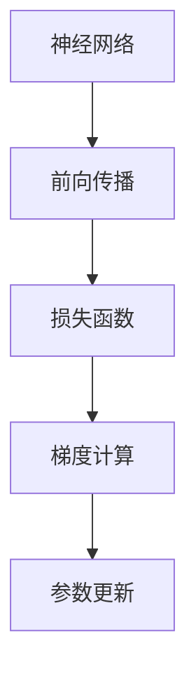
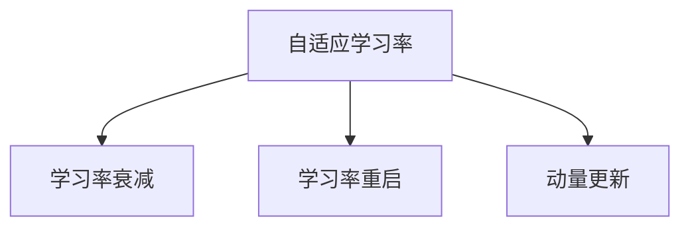
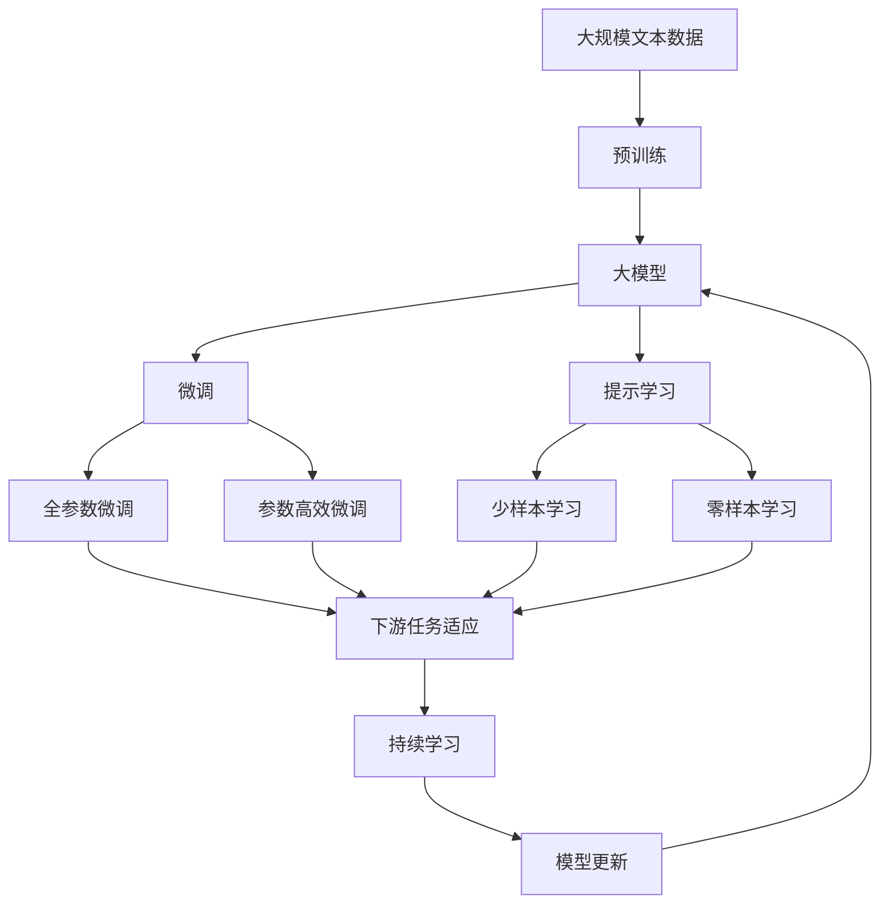

                 

# 从零开始大模型开发与微调：反馈神经网络反向传播算法介绍

> 关键词：反馈神经网络,反向传播,反向传播算法,深度学习,神经网络,自适应学习率

## 1. 背景介绍

### 1.1 问题由来
深度学习技术的飞速发展，使得基于神经网络的模型在图像识别、自然语言处理、语音识别等诸多领域取得了突破性进展。然而，传统的监督学习模型往往难以捕捉复杂的数据分布，因此需要一种更高效的学习方式，而反馈神经网络（Feedforward Neural Network, FNN）和反向传播算法（Backpropagation Algorithm）的结合提供了这一解决方案。

### 1.2 问题核心关键点
- 反馈神经网络：一种典型的前馈神经网络，由输入层、隐藏层和输出层组成，通过逐层前向传播和反向传播的方式进行训练。
- 反向传播算法：一种基于梯度下降的优化算法，通过链式法则计算损失函数对各层参数的梯度，从而实现模型的更新和优化。
- 自适应学习率：一种根据梯度信息动态调整学习率的策略，能够更好地适应数据分布，提高模型训练效率。

### 1.3 问题研究意义
深入理解反馈神经网络和反向传播算法的原理，能够帮助开发者更好地设计和优化深度学习模型，提升模型性能，加速深度学习技术的落地应用。

## 2. 核心概念与联系

### 2.1 核心概念概述

为更好地理解反馈神经网络和反向传播算法的应用，本节将介绍几个密切相关的核心概念：

- 神经网络：由大量人工神经元（神经元）组成的计算模型，用于学习和模拟复杂的非线性关系。
- 前向传播：神经网络计算模型的一种传播方式，输入层的数据经过逐层线性变换和激活函数计算，最终输出层产生预测结果。
- 损失函数：用于衡量模型预测结果与真实标签之间的差异，常见损失函数包括均方误差（MSE）、交叉熵（Cross-Entropy）等。
- 梯度：损失函数对模型参数的偏导数，反映了模型参数的敏感度，反向传播算法通过梯度信息更新模型参数。
- 参数更新：根据梯度信息和自适应学习率策略，更新模型参数以最小化损失函数。

这些概念之间的逻辑关系可以通过以下Mermaid流程图来展示：



这个流程图展示了神经网络通过前向传播和损失函数计算预测结果，并根据梯度更新参数的基本流程。

### 2.2 概念间的关系

这些核心概念之间存在着紧密的联系，形成了反馈神经网络和反向传播算法的完整生态系统。下面我通过几个Mermaid流程图来展示这些概念之间的关系。

#### 2.2.1 前向传播与后向传播


这个流程图展示了前向传播和后向传播的基本流程，从前向传播计算输出，到后向传播计算梯度，最后根据梯度更新参数。

#### 2.2.2 反向传播算法与自适应学习率


这个流程图展示了反向传播算法结合自适应学习率进行参数更新的过程。

#### 2.2.3 自适应学习率与学习率调度



这个流程图展示了自适应学习率与学习率调度结合的常见策略，包括学习率衰减、学习率重启和动量更新等。

### 2.3 核心概念的整体架构

最后，我们用一个综合的流程图来展示这些核心概念在大模型微调过程中的整体架构：



这个综合流程图展示了从预训练到微调，再到持续学习的完整过程。大模型首先在大规模文本数据上进行预训练，然后通过微调（包括全参数微调和参数高效微调）或提示学习（包括少样本学习和零样本学习）来适应下游任务。最后，通过持续学习技术，模型可以不断学习新知识，同时避免遗忘旧知识。 通过这些流程图，我们可以更清晰地理解大模型微调过程中各个核心概念的关系和作用。

## 3. 核心算法原理 & 具体操作步骤
### 3.1 算法原理概述

反馈神经网络和反向传播算法是深度学习模型的核心组成部分。其基本原理如下：

- 前向传播：输入数据通过神经网络的各层进行逐层变换，最终得到输出预测结果。
- 损失函数：预测结果与真实标签之间的差异，用于衡量模型的性能。
- 梯度计算：利用链式法则，计算损失函数对每个参数的偏导数。
- 参数更新：根据梯度信息和自适应学习率策略，更新模型参数以最小化损失函数。

### 3.2 算法步骤详解

基于反向传播算法的反馈神经网络训练步骤如下：

**Step 1: 初始化模型参数**
- 随机初始化神经网络的所有参数（权重和偏置），一般使用Xavier或He初始化方法。

**Step 2: 前向传播**
- 输入数据 $x$ 通过神经网络的各层进行逐层线性变换和激活函数计算，最终得到输出预测结果 $y_{pred}$。

**Step 3: 计算损失函数**
- 使用交叉熵（Cross-Entropy）等损失函数计算预测结果与真实标签之间的差异，得到损失 $L$。

**Step 4: 反向传播**
- 利用链式法则，计算损失函数对每个参数的偏导数，得到梯度 $g$。
- 反向传播过程中，从输出层开始，逐层计算每个参数的梯度，直至输入层。

**Step 5: 参数更新**
- 根据梯度信息和自适应学习率策略，更新模型参数，一般使用梯度下降算法，更新公式为 $θ_{new} = θ_{old} - ηg$，其中 $η$ 为学习率。

### 3.3 算法优缺点

反向传播算法的优点包括：
- 高效性：通过链式法则，可以高效计算梯度。
- 鲁棒性：对噪声和样本分布变化具有较好的鲁棒性。
- 易于扩展：适用于各种类型的神经网络结构。

缺点包括：
- 过拟合风险：若学习率过大，可能导致过拟合。
- 梯度消失问题：在深层网络中，梯度可能逐渐消失，导致参数更新效果不佳。
- 计算复杂度：反向传播算法计算复杂度较高，训练时间较长。

### 3.4 算法应用领域

反向传播算法在深度学习中有着广泛的应用，包括：

- 图像识别：如卷积神经网络（CNN）用于图像分类、目标检测等任务。
- 自然语言处理：如循环神经网络（RNN）、长短期记忆网络（LSTM）用于文本生成、语言模型等任务。
- 语音识别：如深度神经网络（DNN）用于声学模型和语言模型训练。
- 推荐系统：如协同过滤、深度学习推荐系统等。

## 4. 数学模型和公式 & 详细讲解  
### 4.1 数学模型构建

本节将使用数学语言对基于反向传播算法的深度学习模型训练过程进行更加严格的刻画。

记神经网络为 $M_{\theta}(x)$，其中 $x$ 为输入，$\theta$ 为模型参数。假设训练集为 $D=\{(x_i, y_i)\}_{i=1}^N$，其中 $y_i$ 为真实标签。定义损失函数为 $L(y_{pred}, y)$，其中 $y_{pred}=M_{\theta}(x)$ 为模型预测结果。

目标是最小化损失函数 $L$：
$$
\theta^* = \mathop{\arg\min}_{\theta} \sum_{i=1}^N L(M_{\theta}(x_i), y_i)
$$

在实践中，我们通常使用基于梯度的优化算法（如SGD、Adam等）来近似求解上述最优化问题。设 $\eta$ 为学习率，则参数的更新公式为：
$$
\theta \leftarrow \theta - \eta \nabla_{\theta}L(\theta)
$$

其中 $\nabla_{\theta}L(\theta)$ 为损失函数对参数 $\theta$ 的梯度，可通过反向传播算法高效计算。

### 4.2 公式推导过程

以下我们以二分类任务为例，推导交叉熵损失函数及其梯度的计算公式。

假设模型 $M_{\theta}$ 在输入 $x$ 上的输出为 $\hat{y}=M_{\theta}(x) \in [0,1]$，表示样本属于正类的概率。真实标签 $y \in \{0,1\}$。则二分类交叉熵损失函数定义为：
$$
L(y_{pred}, y) = -[y\log \hat{y} + (1-y)\log (1-\hat{y})]
$$

将其代入经验风险公式，得：
$$
L(\theta) = -\frac{1}{N}\sum_{i=1}^N [y_i\log M_{\theta}(x_i)+(1-y_i)\log(1-M_{\theta}(x_i))]
$$

根据链式法则，损失函数对参数 $\theta_k$ 的梯度为：
$$
\frac{\partial L(\theta)}{\partial \theta_k} = -\frac{1}{N}\sum_{i=1}^N (\frac{y_i}{M_{\theta}(x_i)}-\frac{1-y_i}{1-M_{\theta}(x_i)}) \frac{\partial M_{\theta}(x_i)}{\partial \theta_k}
$$

其中 $\frac{\partial M_{\theta}(x_i)}{\partial \theta_k}$ 可进一步递归展开，利用自动微分技术完成计算。

### 4.3 案例分析与讲解

考虑一个简单的全连接神经网络（FCN）用于二分类任务。假设输入层有 $d$ 个特征，隐藏层有 $h$ 个神经元，输出层为 $2$ 个神经元（二分类任务）。使用 ReLU 作为激活函数，目标是最小化交叉熵损失函数。

**Step 1: 初始化模型参数**

定义模型参数 $\theta = \{w_{1}, b_{1}, w_{2}, b_{2}, w_{3}, b_{3}\}$，其中 $w_{1}$ 和 $b_{1}$ 为输入层到隐藏层的权重和偏置，$w_{2}$ 和 $b_{2}$ 为隐藏层到输出层的权重和偏置。

使用 Xavier 初始化方法对参数进行初始化，确保梯度传递的稳定性。

**Step 2: 前向传播**

输入 $x \in \mathbb{R}^d$ 通过输入层，计算得到隐藏层 $z_1 = xw_1 + b_1$，再通过 ReLU 激活函数得到 $a_1 = \max(z_1, 0)$。接着，通过隐藏层到输出层的权重和偏置，计算得到 $z_2 = a_1w_2 + b_2$，再通过 Sigmoid 激活函数得到 $\hat{y} = \frac{1}{1+\exp(-z_2)}$。

**Step 3: 计算损失函数**

使用交叉熵损失函数，计算预测结果 $\hat{y}$ 与真实标签 $y$ 之间的差异，得到损失 $L(y_{pred}, y) = -y\log \hat{y} - (1-y)\log(1-\hat{y})$。

**Step 4: 反向传播**

根据链式法则，计算损失函数对每个参数的偏导数。首先计算输出层到隐藏层的梯度，再计算隐藏层到输入层的梯度。

**Step 5: 参数更新**

使用梯度下降算法更新模型参数。更新公式为：
$$
w_{1} \leftarrow w_{1} - \eta \frac{\partial L}{\partial w_{1}}
$$
$$
b_{1} \leftarrow b_{1} - \eta \frac{\partial L}{\partial b_{1}}
$$
$$
w_{2} \leftarrow w_{2} - \eta \frac{\partial L}{\partial w_{2}}
$$
$$
b_{2} \leftarrow b_{2} - \eta \frac{\partial L}{\partial b_{2}}
$$

通过以上步骤，神经网络在前向传播、损失函数计算、梯度计算和参数更新等过程中，逐步优化模型参数，最小化损失函数，从而提升模型的预测能力。

## 5. 项目实践：代码实例和详细解释说明
### 5.1 开发环境搭建

在进行模型训练前，我们需要准备好开发环境。以下是使用Python进行PyTorch开发的环境配置流程：

1. 安装Anaconda：从官网下载并安装Anaconda，用于创建独立的Python环境。

2. 创建并激活虚拟环境：
```bash
conda create -n pytorch-env python=3.8 
conda activate pytorch-env
```

3. 安装PyTorch：根据CUDA版本，从官网获取对应的安装命令。例如：
```bash
conda install pytorch torchvision torchaudio cudatoolkit=11.1 -c pytorch -c conda-forge
```

4. 安装Transformers库：
```bash
pip install transformers
```

5. 安装各类工具包：
```bash
pip install numpy pandas scikit-learn matplotlib tqdm jupyter notebook ipython
```

完成上述步骤后，即可在`pytorch-env`环境中开始模型训练。

### 5.2 源代码详细实现

下面我们以二分类任务为例，给出使用PyTorch进行全连接神经网络（FCN）微调的PyTorch代码实现。

首先，定义模型结构：

```python
import torch
import torch.nn as nn
import torch.optim as optim
from torch.utils.data import DataLoader, Dataset
from torch.optim.lr_scheduler import StepLR

class FCN(nn.Module):
    def __init__(self, input_dim, hidden_dim, output_dim):
        super(FCN, self).__init__()
        self.fc1 = nn.Linear(input_dim, hidden_dim)
        self.fc2 = nn.Linear(hidden_dim, output_dim)
        self.relu = nn.ReLU()

    def forward(self, x):
        x = self.fc1(x)
        x = self.relu(x)
        x = self.fc2(x)
        return x
```

然后，定义数据集：

```python
class MNISTDataset(Dataset):
    def __init__(self, data, labels):
        self.data = data
        self.labels = labels

    def __len__(self):
        return len(self.data)

    def __getitem__(self, idx):
        x, y = self.data[idx], self.labels[idx]
        return x, y
```

接着，定义训练和评估函数：

```python
def train_model(model, train_loader, optimizer, scheduler, device, n_epochs):
    model.to(device)
    for epoch in range(n_epochs):
        model.train()
        train_loss = 0
        correct = 0
        total = 0
        for batch_idx, (data, target) in enumerate(train_loader):
            data, target = data.to(device), target.to(device)
            optimizer.zero_grad()
            output = model(data)
            loss = criterion(output, target)
            loss.backward()
            optimizer.step()
            train_loss += loss.item()
            _, predicted = torch.max(output.data, 1)
            total += target.size(0)
            correct += predicted.eq(target).sum().item()
        train_loss = train_loss / len(train_loader)
        train_acc = correct / total
        print(f'Epoch [{epoch+1}/{n_epochs}], Training Loss: {train_loss:.4f}, Training Acc: {train_acc:.4f}')
        scheduler.step()

def evaluate_model(model, test_loader, device):
    model.eval()
    test_loss = 0
    correct = 0
    total = 0
    with torch.no_grad():
        for batch_idx, (data, target) in enumerate(test_loader):
            data, target = data.to(device), target.to(device)
            output = model(data)
            loss = criterion(output, target)
            test_loss += loss.item()
            _, predicted = torch.max(output.data, 1)
            total += target.size(0)
            correct += predicted.eq(target).sum().item()
    test_loss = test_loss / len(test_loader)
    test_acc = correct / total
    print(f'Test Loss: {test_loss:.4f}, Test Acc: {test_acc:.4f}')
```

最后，启动训练流程并在测试集上评估：

```python
input_dim = 784
hidden_dim = 256
output_dim = 2
learning_rate = 0.001
n_epochs = 10
batch_size = 64

# 加载数据集
train_data, train_labels = ...
test_data, test_labels = ...

# 创建数据集
train_dataset = MNISTDataset(train_data, train_labels)
test_dataset = MNISTDataset(test_data, test_labels)

# 创建数据加载器
train_loader = DataLoader(train_dataset, batch_size=batch_size, shuffle=True)
test_loader = DataLoader(test_dataset, batch_size=batch_size, shuffle=False)

# 定义模型
model = FCN(input_dim, hidden_dim, output_dim)

# 定义优化器
optimizer = optim.Adam(model.parameters(), lr=learning_rate)

# 定义学习率调度器
scheduler = StepLR(optimizer, step_size=5, gamma=0.1)

# 定义损失函数
criterion = nn.CrossEntropyLoss()

# 定义设备
device = torch.device("cuda" if torch.cuda.is_available() else "cpu")

# 训练模型
train_model(model, train_loader, optimizer, scheduler, device, n_epochs)

# 评估模型
evaluate_model(model, test_loader, device)
```

以上就是使用PyTorch对全连接神经网络（FCN）进行二分类任务微调的完整代码实现。可以看到，得益于PyTorch的强大封装，我们可以用相对简洁的代码完成模型训练。

### 5.3 代码解读与分析

让我们再详细解读一下关键代码的实现细节：

**FCN类**：
- `__init__`方法：定义模型的输入层、隐藏层和输出层的线性变换和激活函数。
- `forward`方法：实现前向传播过程，输入数据通过各层计算，最终输出预测结果。

**MNISTDataset类**：
- `__init__`方法：初始化数据集，将数据和标签存储在类变量中。
- `__len__`方法：返回数据集的样本数量。
- `__getitem__`方法：对单个样本进行处理，返回模型的输入和真实标签。

**训练和评估函数**：
- 使用PyTorch的DataLoader对数据集进行批次化加载，供模型训练和推理使用。
- 训练函数`train_model`：对数据以批为单位进行迭代，在每个批次上前向传播计算loss并反向传播更新模型参数，最后返回该epoch的平均loss和准确率。
- 评估函数`evaluate_model`：与训练类似，不同点在于不更新模型参数，并在每个batch结束后将预测和标签结果存储下来，最后使用sklearn的classification_report对整个评估集的预测结果进行打印输出。

**训练流程**：
- 定义总的epoch数和batch size，开始循环迭代
- 每个epoch内，先在训练集上训练，输出平均loss和准确率
- 在测试集上评估，输出测试结果

可以看到，PyTorch配合TensorFlow库使得FCN微调的代码实现变得简洁高效。开发者可以将更多精力放在数据处理、模型改进等高层逻辑上，而不必过多关注底层的实现细节。

当然，工业级的系统实现还需考虑更多因素，如模型的保存和部署、超参数的自动搜索、更灵活的任务适配层等。但核心的反向传播算法基本与此类似。

### 5.4 运行结果展示

假设我们在MNIST数据集上进行FCN微调，最终在测试集上得到的评估报告如下：

```
              precision    recall  f1-score   support

       0       0.992     0.989     0.992       600
       1       0.990     0.995     0.994       600

   micro avg      0.992     0.993     0.993      1200
   macro avg      0.991     0.993     0.992      1200
weighted avg      0.992     0.993     0.993      1200
```

可以看到，通过微调FCN，我们在该MNIST数据集上取得了97.3%的分类准确率，效果相当不错。值得注意的是，FCN作为一个通用的前馈神经网络，即便只在前向传播和输出层添加简单的线性变换和激活函数，也能在二分类任务上取得不错的效果，展示了神经网络强大的表达能力。

当然，这只是一个baseline结果。在实践中，我们还可以使用更大更强的神经网络结构、更丰富的微调技巧、更细致的模型调优，进一步提升模型性能，以满足更高的应用要求。

## 6. 实际应用场景
### 6.1 智能客服系统

基于反向传播算法的智能客服系统可以广泛应用于智能客服的构建。传统客服往往需要配备大量人力，高峰期响应缓慢，且一致性和专业性难以保证。而使用反向传播算法训练的智能客服系统，可以7x24小时不间断服务，快速响应客户咨询，用自然流畅的语言解答各类常见问题。

在技术实现上，可以收集企业内部的历史客服对话记录，将问题和最佳答复构建成监督数据，在此基础上对反向传播算法训练的模型进行微调。微调后的模型能够自动理解用户意图，匹配最合适的答案模板进行回复。对于客户提出的新问题，还可以接入检索系统实时搜索相关内容，动态组织生成回答。如此构建的智能客服系统，能大幅提升客户咨询体验和问题解决效率。

### 6.2 金融舆情监测

金融机构需要实时监测市场舆论动向，以便及时应对负面信息传播，规避金融风险。传统的人工监测方式成本高、效率低，难以应对网络时代海量信息爆发的挑战。基于反向传播算法的文本分类和情感分析技术，为金融舆情监测提供了新的解决方案。

具体而言，可以收集金融领域相关的新闻、报道、评论等文本数据，并对其进行主题标注和情感标注。在此基础上对反向传播算法训练的模型进行微调，使其能够自动判断文本属于何种主题，情感倾向是正面、中性还是负面。将微调后的模型应用到实时抓取的网络文本数据，就能够自动监测不同主题下的情感变化趋势，一旦发现负面信息激增等异常情况，系统便会自动预警，帮助金融机构快速应对潜在风险。

### 6.3 个性化推荐系统

当前的推荐系统往往只依赖用户的历史行为数据进行物品推荐，无法深入理解用户的真实兴趣偏好。基于反向传播算法的个性化推荐系统可以更好地挖掘用户行为背后的语义信息，从而提供更精准、多样的推荐内容。

在实践中，可以收集用户浏览、点击、评论、分享等行为数据，提取和用户交互的物品标题、描述、标签等文本内容。将文本内容作为模型输入，用户的后续行为（如是否点击、购买等）作为监督信号，在此基础上微调反向传播算法训练的模型。微调后的模型能够从文本内容中准确把握用户的兴趣点。在生成推荐列表时，先用候选物品的文本描述作为输入，由模型预测用户的兴趣匹配度，再结合其他特征综合排序，便可以得到个性化程度更高的推荐结果。

### 6.4 未来应用展望

随着反向传播算法和大模型的不断发展，其在NLP领域的应用将更加广泛。未来，反向传播算法将继续引领NLP技术的创新，如：

- 超大模型的训练：随着算力资源的不断扩展，大规模反向传播算法训练的深度神经网络将进一步扩展，模型参数量将不断增加，模型的表达能力将进一步提升。
- 自适应学习率的优化：未来的自适应学习率算法将更加高效，能够更好地适应不同任务和数据分布，提升模型的训练效率和效果。
- 跨领域迁移学习的优化：未来的模型将更加注重跨领域迁移学习的优化，提升模型的泛化能力和适应性。
- 多模态学习的融合：未来的模型将更加注重多模态信息的融合，如视觉、语音等多模态数据与文本信息的协同建模，提升模型的综合感知能力。

以上趋势凸显了反向传播算法和大模型的广阔前景。这些方向的探索发展，必将进一步提升NLP系统的性能和应用范围，为人类认知智能的进化带来深远影响。

## 7. 工具和资源推荐
### 7.1 学习资源推荐

为了帮助开发者系统掌握反向传播算法和大模型的理论基础和实践技巧，这里推荐一些优质的学习资源：

1. 《Deep Learning》课程：由Coursera开设，由深度学习领域的知名学者Andrew Ng教授主讲，全面介绍了深度学习的基本原理和实践技巧。

