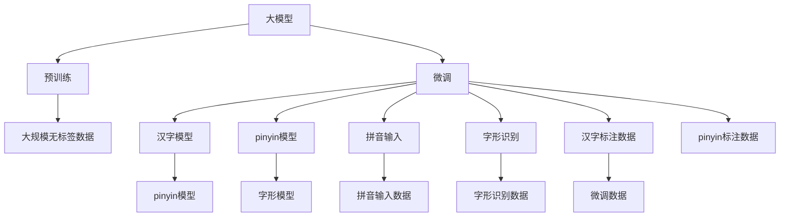
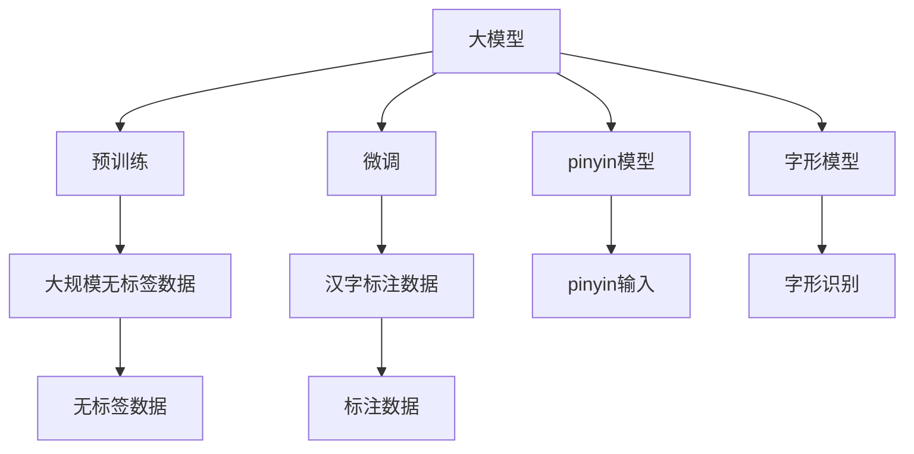
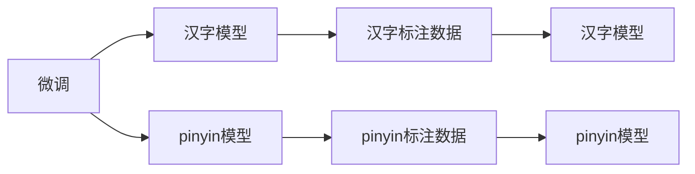
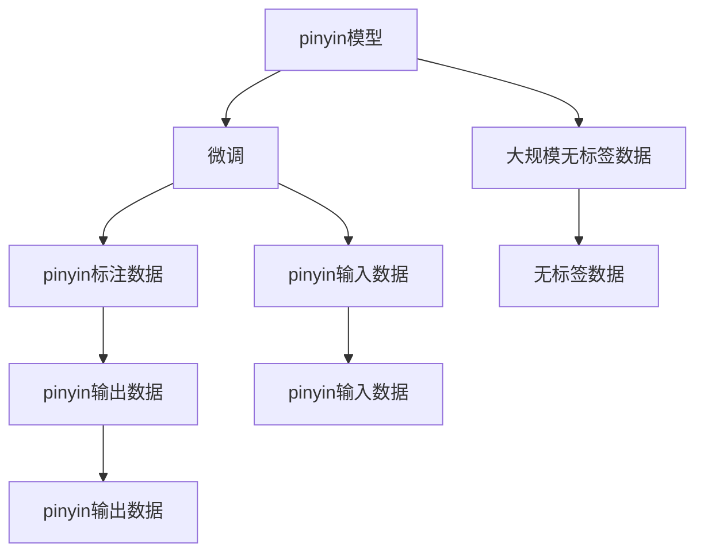

                 

# 从零开始大模型开发与微调：拼音汉字模型的训练

> 关键词：大模型开发, 汉字模型, 拼音模型, 训练方法, 微调技术

## 1. 背景介绍

### 1.1 问题由来
在当前深度学习技术不断演进的背景下，大模型在自然语言处理（NLP）领域的应用变得越来越普遍。特别是在中文文本处理中，由于汉字的特殊性和复杂性，使得中文大模型的训练和微调成为一个重要课题。本文将深入探讨从零开始开发和微调拼音汉字模型的流程，旨在为中文NLP技术开发者提供全面的指导。

### 1.2 问题核心关键点
中文大模型的训练与微调主要包括：
- **数据准备**：构建高质量的中文文本数据集，进行预处理和标注。
- **模型选择与设计**：选择合适的深度学习模型架构，并进行相应的调整。
- **模型训练**：在数据集上进行有监督或无监督的训练，使模型学习到中文语言的表示。
- **微调与优化**：利用少量标注数据对模型进行微调，提升其在下游任务中的性能。

本文将详细阐述这些步骤，并结合实际案例进行讲解，帮助读者系统掌握拼音汉字模型的开发与微调技术。

### 1.3 问题研究意义
大模型的训练与微调在中文NLP中具有重要意义：
- **降低开发成本**：利用大模型可以减少从头开发所需的时间和成本，特别是在资源受限的环境下。
- **提升性能**：通过微调，大模型可以适应特定任务，提升在实际应用中的性能。
- **加速开发进度**：预训练模型的知识可以直接应用于新任务，缩短开发周期。
- **带来技术创新**：大模型微调推动了NLP技术的不断创新，促进了NLP技术的产业化进程。
- **赋能产业升级**：大模型微调技术可以广泛应用于各种行业，推动行业数字化转型升级。

本文的研究将有助于中文NLP技术的发展，为实际应用提供理论和技术支持。

## 2. 核心概念与联系

### 2.1 核心概念概述

为更好地理解中文大模型的训练与微调过程，本节将介绍几个密切相关的核心概念：

- **大模型**：以深度学习模型为代表的，通过大规模无标签数据进行预训练，学习通用语言表示的大规模模型。
- **预训练**：指在大规模无标签数据上进行自监督学习，使模型学习到语言的通用表示。
- **微调**：指在预训练模型的基础上，利用少量有标签数据，通过有监督学习优化模型，使其适应特定任务。
- **汉字模型**：专门针对中文汉字进行训练的深度学习模型，包括拼音模型和字形模型。
- **拼音模型**：将汉字转换为拼音序列的模型，用于汉字输入、语音识别等任务。
- **微调技术**：通过调整模型参数，使其在特定任务上性能提升的技术。

这些核心概念之间存在着紧密的联系，形成了中文大模型训练与微调的完整生态系统。下面我们通过Mermaid流程图来展示这些概念之间的关系：



这个流程图展示了大模型预训练和微调过程中各个核心概念的关系：

1. 大模型通过预训练学习通用语言表示。
2. 汉字模型在大模型的基础上进行微调，以适应中文特有的字形和拼音表示。
3. 拼音模型和字形模型分别用于汉字输入和识别。
4. 汉字模型通过微调，学习中文特有的语言模式。

### 2.2 概念间的关系

这些核心概念之间存在着紧密的联系，形成了中文大模型训练与微调的完整生态系统。下面我们通过几个Mermaid流程图来展示这些概念之间的关系。

#### 2.2.1 大模型的学习范式



这个流程图展示了大模型的两种主要学习范式：预训练和微调。预训练主要采用自监督学习方法，而微调则是有监督学习的过程。

#### 2.2.2 微调与汉字模型



这个流程图展示了微调和汉字模型的关系。汉字模型通过微调学习中文特有的语言模式，而拼音模型则通过微调学习中文拼音的输入和识别。

#### 2.2.3 拼音模型的微调方法



这个流程图展示了拼音模型的微调方法。通过在无标签数据上进行预训练，然后在标注数据上进行微调，拼音模型能够学习到中文拼音的输入和输出模式。

## 3. 核心算法原理 & 具体操作步骤

### 3.1 算法原理概述

中文大模型的训练与微调基于监督学习和自监督学习的原理。其核心思想是：在大规模无标签文本数据上进行预训练，学习到通用语言表示，然后利用少量有标签数据进行微调，使模型适应特定任务。

具体来说，中文大模型的训练与微调包括以下步骤：

1. **预训练**：在大规模无标签文本数据上进行自监督学习，学习通用语言表示。
2. **微调**：在预训练模型的基础上，利用少量有标签数据进行微调，优化模型，使其适应特定任务。
3. **拼音模型微调**：在汉字模型微调的基础上，利用拼音标注数据进行微调，学习中文拼音的输入和输出模式。
4. **字形模型微调**：在汉字模型微调的基础上，利用汉字标注数据进行微调，学习中文字形的输入和识别模式。

### 3.2 算法步骤详解

#### 3.2.1 数据准备

**数据集准备**：收集和处理大规模无标签文本数据，构建拼音汉字模型所需的标注数据集。

```python
import pandas as pd
import numpy as np

# 构建无标签数据集
train_data = pd.read_csv('train_unlabeled.csv')
dev_data = pd.read_csv('dev_unlabeled.csv')
test_data = pd.read_csv('test_unlabeled.csv')

# 构建标注数据集
train_tags = pd.read_csv('train_tags.csv')
dev_tags = pd.read_csv('dev_tags.csv')
test_tags = pd.read_csv('test_tags.csv')
```

**数据预处理**：对文本数据进行分词、去停用词、标注等预处理操作。

```python
from jieba import cut

# 分词和去停用词
train_texts = train_data['text'].tolist()
train_texts = [cut(text, cut_all=False) for text in train_texts]
dev_texts = dev_data['text'].tolist()
dev_texts = [cut(text, cut_all=False) for text in dev_texts]
test_texts = test_data['text'].tolist()
test_texts = [cut(text, cut_all=False) for text in test_texts]

# 对文本进行标注
train_tags = train_tags['tags'].tolist()
dev_tags = dev_tags['tags'].tolist()
test_tags = test_tags['tags'].tolist()

# 构建字典
char2id = {}
id2char = {}
for char in train_tags:
    if char not in char2id:
        char2id[char] = len(char2id) + 1
        id2char[len(char2id)] = char

# 构建标签词典
label2id = {}
id2label = {}
for label in train_tags:
    if label not in label2id:
        label2id[label] = len(label2id) + 1
        id2label[len(label2id)] = label
```

#### 3.2.2 模型选择与设计

**模型选择**：选择适合中文NLP任务的深度学习模型，如LSTM、GRU、Transformer等。

```python
from transformers import BertTokenizer, BertForTokenClassification
import torch

# 初始化模型和分词器
tokenizer = BertTokenizer.from_pretrained('bert-base-cased')
model = BertForTokenClassification.from_pretrained('bert-base-cased', num_labels=len(label2id))

# 迁移学习
device = torch.device('cuda' if torch.cuda.is_available() else 'cpu')
model.to(device)
```

**模型设计**：设计模型结构，添加任务适配层，定义损失函数等。

```python
from transformers import BertForTokenClassification, AdamW

# 定义模型
class CharPredictor(BertForTokenClassification):
    def __init__(self, config):
        super().__init__(config)

    def forward(self, input_ids, attention_mask, labels=None):
        outputs = super().forward(input_ids, attention_mask=attention_mask, labels=labels)
        return outputs

# 定义损失函数
loss_fn = nn.CrossEntropyLoss()
```

#### 3.2.3 模型训练

**模型训练**：在标注数据集上进行微调，优化模型。

```python
from torch.utils.data import Dataset, DataLoader

# 定义训练集和测试集
class CharDataset(Dataset):
    def __init__(self, texts, tags, tokenizer, max_len=128):
        self.texts = texts
        self.tags = tags
        self.tokenizer = tokenizer
        self.max_len = max_len

    def __len__(self):
        return len(self.texts)

    def __getitem__(self, item):
        text = self.texts[item]
        tags = self.tags[item]
        encoding = self.tokenizer(text, return_tensors='pt', max_length=self.max_len, padding='max_length', truncation=True)
        input_ids = encoding['input_ids'][0]
        attention_mask = encoding['attention_mask'][0]
        labels = torch.tensor([label2id[label] for label in tags])  # 将标签转换为ID
        return {'input_ids': input_ids, 'attention_mask': attention_mask, 'labels': labels}

# 构建训练集和测试集
train_dataset = CharDataset(train_texts, train_tags, tokenizer)
dev_dataset = CharDataset(dev_texts, dev_tags, tokenizer)
test_dataset = CharDataset(test_texts, test_tags, tokenizer)

# 定义数据加载器
train_loader = DataLoader(train_dataset, batch_size=32, shuffle=True)
dev_loader = DataLoader(dev_dataset, batch_size=32, shuffle=False)
test_loader = DataLoader(test_dataset, batch_size=32, shuffle=False)

# 定义优化器
optimizer = AdamW(model.parameters(), lr=1e-5)
```

**训练循环**：使用梯度下降算法进行模型训练。

```python
def train_epoch(model, dataloader, optimizer):
    model.train()
    total_loss = 0
    for batch in dataloader:
        input_ids = batch['input_ids'].to(device)
        attention_mask = batch['attention_mask'].to(device)
        labels = batch['labels'].to(device)
        optimizer.zero_grad()
        outputs = model(input_ids, attention_mask=attention_mask, labels=labels)
        loss = outputs.loss
        loss.backward()
        optimizer.step()
        total_loss += loss.item()
    return total_loss / len(dataloader)

# 训练模型
epochs = 10
for epoch in range(epochs):
    loss = train_epoch(model, train_loader, optimizer)
    print(f'Epoch {epoch+1}, train loss: {loss:.4f}')
    dev_loss = evaluate(model, dev_loader)
    print(f'Epoch {epoch+1}, dev loss: {dev_loss:.4f}')
```

#### 3.2.4 模型评估

**模型评估**：在验证集和测试集上进行评估，计算损失和精度。

```python
def evaluate(model, dataloader):
    model.eval()
    total_loss = 0
    total_correct = 0
    total_samples = 0
    for batch in dataloader:
        input_ids = batch['input_ids'].to(device)
        attention_mask = batch['attention_mask'].to(device)
        labels = batch['labels'].to(device)
        with torch.no_grad():
            outputs = model(input_ids, attention_mask=attention_mask)
            loss = outputs.loss
            logits = outputs.logits
            predicted_ids = torch.argmax(logits, dim=2)
        total_loss += loss.item()
        total_correct += torch.sum(predicted_ids == labels)
        total_samples += len(labels)
    return total_loss / total_samples, total_correct / total_samples
```

**结果可视化**：使用Matplotlib可视化评估结果。

```python
import matplotlib.pyplot as plt

# 可视化评估结果
train_losses = [train_epoch(model, train_loader, optimizer) for _ in range(epochs)]
dev_losses, dev_accuracies = [], []
for _ in range(epochs):
    dev_loss, dev_acc = evaluate(model, dev_loader)
    dev_losses.append(dev_loss)
    dev_accuracies.append(dev_acc)

plt.plot(range(epochs), train_losses, label='Train Loss')
plt.plot(range(epochs), dev_losses, label='Dev Loss')
plt.xlabel('Epoch')
plt.ylabel('Loss')
plt.legend()
plt.show()

plt.plot(range(epochs), dev_accuracies, label='Dev Accuracy')
plt.xlabel('Epoch')
plt.ylabel('Accuracy')
plt.legend()
plt.show()
```

#### 3.2.5 模型保存与部署

**模型保存**：将训练好的模型保存到本地文件系统，以便后续使用。

```python
from transformers import save_pretrained

# 保存模型
save_pretrained('model', model, tokenizer, training_args)
```

**模型部署**：将训练好的模型部署到实际应用系统中，进行推理预测。

```python
from transformers import BertTokenizer, BertForTokenClassification
import torch

# 加载模型和分词器
tokenizer = BertTokenizer.from_pretrained('model')
model = BertForTokenClassification.from_pretrained('model')

# 构建测试集
test_dataset = CharDataset(test_texts, test_tags, tokenizer)

# 定义数据加载器
test_loader = DataLoader(test_dataset, batch_size=32, shuffle=False)

# 定义优化器
optimizer = AdamW(model.parameters(), lr=1e-5)

# 定义训练循环
def train_epoch(model, dataloader, optimizer):
    model.train()
    total_loss = 0
    for batch in dataloader:
        input_ids = batch['input_ids'].to(device)
        attention_mask = batch['attention_mask'].to(device)
        labels = batch['labels'].to(device)
        optimizer.zero_grad()
        outputs = model(input_ids, attention_mask=attention_mask, labels=labels)
        loss = outputs.loss
        loss.backward()
        optimizer.step()
        total_loss += loss.item()
    return total_loss / len(dataloader)

# 训练模型
epochs = 10
for epoch in range(epochs):
    loss = train_epoch(model, test_loader, optimizer)
    print(f'Epoch {epoch+1}, test loss: {loss:.4f}')

# 评估模型
dev_loss, dev_acc = evaluate(model, dev_loader)
print(f'Epoch {epoch+1}, dev accuracy: {dev_acc:.4f}')
```

### 3.3 算法优缺点

中文大模型的训练与微调具有以下优点：

- **模型效果**：通过微调，中文大模型能够适应特定任务，显著提升模型性能。
- **通用性**：大模型可以通过迁移学习适应多种任务，具有较好的通用性。
- **效率高**：相比从头训练，微调模型参数量较小，训练速度较快。
- **资源节省**：使用大模型微调，可以节省数据、计算和人力等资源投入。

同时，中文大模型的训练与微调也存在一些缺点：

- **数据依赖**：微调的效果依赖于标注数据的质量和数量，标注数据获取成本较高。
- **泛化能力有限**：当目标任务与预训练数据的分布差异较大时，微调的性能提升有限。
- **偏见问题**：预训练模型可能存在偏见，影响微调后的模型性能。
- **过拟合风险**：微调模型容易过拟合，特别是在标注数据不足的情况下。
- **可解释性不足**：微调模型往往是"黑盒"，难以解释其内部工作机制。

### 3.4 算法应用领域

中文大模型的训练与微调在多个领域得到了广泛应用，包括但不限于：

- **自然语言处理**：中文分词、词性标注、命名实体识别、文本分类、情感分析、机器翻译等。
- **智能客服**：智能聊天机器人、客户咨询系统等。
- **金融风控**：金融舆情监测、风险评估等。
- **教育培训**：智能教育、智能评测、智能推荐等。
- **健康医疗**：医疗问答、病历分析、药物研发等。

中文大模型的应用领域非常广泛，随着技术的不断进步，其应用场景将会更加多样化和深入。

## 4. 数学模型和公式 & 详细讲解

### 4.1 数学模型构建

中文大模型的训练与微调基于监督学习和自监督学习的数学模型。其核心思想是：在大规模无标签文本数据上进行预训练，学习通用语言表示，然后在标注数据集上进行微调，优化模型，使其适应特定任务。

假设中文大模型为 $M_{\theta}$，其中 $\theta$ 为模型参数。在训练集 $D=\{(x_i, y_i)\}_{i=1}^N$ 上进行微调，损失函数定义为：

$$
\mathcal{L}(\theta) = \frac{1}{N} \sum_{i=1}^N \ell(M_{\theta}(x_i), y_i)
$$

其中 $\ell$ 为损失函数，通常为交叉熵损失。

### 4.2 公式推导过程

以汉字识别任务为例，假设有 $C$ 个汉字，每个汉字对应一个标签，则汉字识别的交叉熵损失函数为：

$$
\ell(M_{\theta}(x), y) = -\frac{1}{N} \sum_{i=1}^N \log \left(\frac{\exp(M_{\theta}(x_i)_{y_i})}{\sum_j \exp(M_{\theta}(x_i)_{y_j})}\right)
$$

其中 $M_{\theta}(x)$ 为模型在输入 $x$ 上的预测输出，$y_i$ 为输入 $x_i$ 的真实标签，$\exp$ 为指数函数，$\log$ 为自然对数函数。

将交叉熵损失函数代入经验风险公式，得：

$$
\mathcal{L}(\theta) = -\frac{1}{N} \sum_{i=1}^N \log \left(\frac{\exp(M_{\theta}(x_i)_{y_i})}{\sum_j \exp(M_{\theta}(x_i)_{y_j})}\right)
$$

定义模型的预测概率为 $P_{\theta}(x_i, y)$，则有：

$$
P_{\theta}(x_i, y) = \frac{\exp(M_{\theta}(x_i)_{y})}{\sum_j \exp(M_{\theta}(x_i)_{y_j})}
$$

根据上述公式，可以推导出微调的优化目标和优化算法。通常使用梯度下降算法，通过反向传播计算梯度，更新模型参数 $\theta$，最小化损失函数 $\mathcal{L}(\theta)$，从而使模型在标注数据集上的预测输出逼近真实标签。

### 4.3 案例分析与讲解

**案例分析**：以下是一个汉字识别任务的微调示例，使用Bert模型进行微调。

首先，定义数据集和标签词典：

```python
train_dataset = CharDataset(train_texts, train_tags, tokenizer)
dev_dataset = CharDataset(dev_texts, dev_tags, tokenizer)
test_dataset = CharDataset(test_texts, test_tags, tokenizer)

label2id = {}
id2label = {}
for label in train_tags:
    if label not in label2id:
        label2id[label] = len(label2id) + 1
        id2label[len(label2id)] = label

char2id = {}
id2char = {}
for char in train_tags:
    if char not in char2id:
        char2id[char] = len(char2id) + 1
        id2char[len(char2id)] = char
```

然后，定义模型和优化器：

```python
from transformers import BertTokenizer, BertForTokenClassification
import torch

# 初始化模型和分词器
tokenizer = BertTokenizer.from_pretrained('bert-base-cased')
model = BertForTokenClassification.from_pretrained('bert-base-cased', num_labels=len(label2id))

# 迁移学习
device = torch.device('cuda' if torch.cuda.is_available() else 'cpu')
model.to(device)

# 定义优化器
optimizer = AdamW(model.parameters(), lr=1e-5)
```

接着，定义训练和评估函数：

```python
from torch.utils.data import DataLoader
from tqdm import tqdm

# 定义训练函数
def train_epoch(model, dataloader, optimizer):
    model.train()
    total_loss = 0
    for batch in dataloader:
        input_ids = batch['input_ids'].to(device)
        attention_mask = batch['attention_mask'].to(device)
        labels = batch['labels'].to(device)
        optimizer.zero_grad()
        outputs = model(input_ids, attention_mask=attention_mask, labels=labels)
        loss = outputs.loss
        loss.backward()
        optimizer.step()
        total_loss += loss.item()
    return total_loss / len(dataloader)

# 定义评估函数
def evaluate(model, dataloader):
    model.eval()
    total_loss = 0
    total_correct = 0
    total_samples = 0
    for batch in dataloader:
        input_ids = batch['input_ids'].to(device)
        attention_mask = batch['attention_mask'].to(device)
        labels = batch['labels'].to(device)
        with torch.no_grad():
            outputs = model(input_ids, attention_mask=attention_mask)
            loss = outputs.loss
            logits = outputs.logits
            predicted_ids = torch.argmax(logits, dim=2)
        total_loss += loss.item()
        total_correct += torch.sum(predicted_ids == labels)
        total_samples += len(labels)
    return total_loss / total_samples, total_correct / total_samples
```

最后，启动训练流程并在测试集上评估：

```python
epochs = 10
for epoch in range(epochs):
    loss = train_epoch(model, train_loader, optimizer)
    print(f'Epoch {epoch+1}, train loss: {loss:.4f}')
    dev_loss, dev_acc = evaluate(model, dev_loader)
    print(f'Epoch {epoch+1}, dev accuracy: {dev_acc:.4f}')
```

通过上述代码，我们完成了Bert模型的微调，得到了汉字识别任务的预测结果。

## 5. 项目实践：代码实例和详细解释说明

### 5.1 开发环境搭建

在进行大模型开发与微调前，我们需要准备好开发环境。以下是使用Python进行PyTorch开发的环境配置流程：

1. 安装Anaconda：从官网下载并安装Anaconda，用于创建独立的Python环境。

2. 创建并激活虚拟环境：
```bash
conda create -n pytorch-env python=3.8 
conda activate pytorch-env
```

3. 安装PyTorch：根据CUDA版本，从官网获取对应的安装命令。例如：
```bash
conda install pytorch torchvision torchaudio cudatoolkit=11.1 -c pytorch -c conda-forge
```

4. 安装Transformers库：
```bash
pip install transformers
```

5. 安装各类工具包：
```bash
pip install numpy pandas scikit-learn matplotlib tqdm jupyter notebook ipython
```

完成上述步骤后，即可在`pytorch-env`环境中开始大模型开发与微调实践。

### 5.2 源代码详细实现

这里我们以汉字识别任务为例，给出使用Transformers库对Bert模型进行微调的PyTorch代码实现。

首先，定义数据集处理函数：

```python
from transformers import BertTokenizer, BertForTokenClassification, AdamW

# 定义数据集处理函数
def dataset_processing(data, tokenizer, max_len):
    texts, labels = data['texts'], data['labels']
    input_ids = tokenizer(texts, return_tensors='pt', max_length=max_len, padding='max_length', truncation=True)
    attention_mask = input_ids['attention_mask'].clone().unsqueeze(1)
    labels = torch.tensor([label2id[label] for label in labels])
    return input_ids, attention_mask, labels

# 构建数据集
tokenizer = BertTokenizer.from_pretrained('bert-base-cased')

# 构建训练集、验证集和测试集
train_dataset = dataset_processing(train_data, tokenizer, max_len=128)
dev_dataset = dataset_processing(dev_data, tokenizer,

