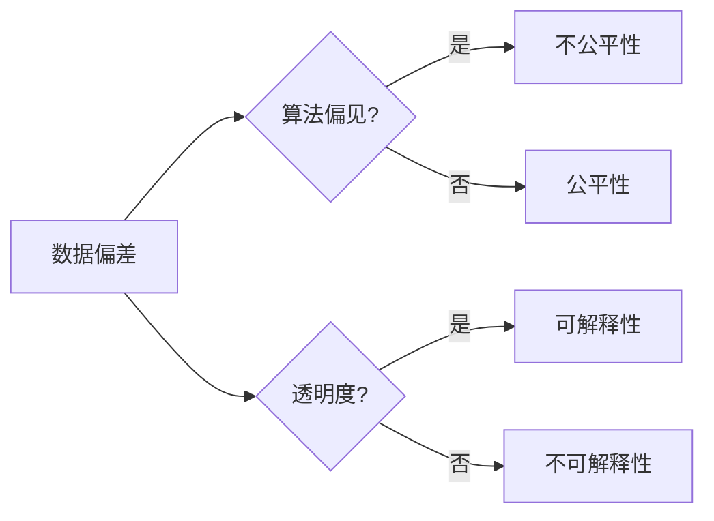

# 数据偏差无处不在，软件2.0需补齐伦理短板

> 关键词：数据偏差，软件伦理，人工智能，算法偏见，公平性，透明度，可解释性

## 1. 背景介绍

随着人工智能（AI）和机器学习的迅猛发展，软件产业正在经历一场深刻的变革。从简单的数据分析到复杂的决策支持，AI技术已经在各个行业得到广泛应用。然而，随着AI技术的深入应用，一个不容忽视的问题逐渐显现：数据偏差。

### 1.1 数据偏差的由来

数据偏差是指数据中存在的系统性的错误或偏见，这些偏差可能源于数据的收集、处理、存储或分析过程中的不当操作。数据偏差可能导致AI系统产生不公正、歧视性的结果，引发伦理和社会问题。

### 1.2 研究现状

近年来，数据偏差问题引起了学术界和业界的广泛关注。研究者们开始探讨数据偏差的来源、影响和解决方案。然而，数据偏差问题并非一蹴而就，它涉及到数据科学、计算机科学、心理学、社会学等多个学科领域。

### 1.3 研究意义

研究数据偏差问题对于确保AI技术的健康发展、提升AI系统的公平性和可靠性至关重要。本文旨在探讨数据偏差的成因、影响以及应对策略，为软件2.0时代的伦理建设提供参考。

### 1.4 本文结构

本文将分为以下几个部分：
- 介绍数据偏差的相关概念和原理。
- 分析数据偏差的成因和影响。
- 探讨数据偏差的检测、评估和缓解方法。
- 展望数据偏差研究的未来趋势。

## 2. 核心概念与联系

为了更好地理解数据偏差问题，我们需要明确以下核心概念：

- 数据偏差（Data Bias）：数据中存在的系统性的错误或偏见，可能导致AI系统产生歧视性或不公正的结果。
- 算法偏见（Algorithmic Bias）：由算法设计、训练数据或模型选择等因素引起的偏差，可能导致AI系统在特定群体中产生歧视性结果。
- 公平性（Fairness）：AI系统在处理不同群体时，应保持一致性和无歧视性。
- 透明度（Transparency）：AI系统的决策过程和结果应易于理解。
- 可解释性（Explainability）：AI系统的决策过程和结果应可解释，以便用户和利益相关者理解。

以下是这些概念之间的Mermaid流程图：



## 3. 核心算法原理 & 具体操作步骤

### 3.1 算法原理概述

数据偏差的检测、评估和缓解主要基于以下原理：

- 数据清洗：识别和修正数据中的错误或偏见。
- 数据增强：通过添加更多样化的数据来丰富数据集。
- 随机化：通过随机化数据集来减少偏差。
- 模型选择：选择合适的模型以减少偏差。

### 3.2 算法步骤详解

以下是基于上述原理的数据偏差缓解步骤：

1. 数据收集：确保数据来源的多样性和代表性。
2. 数据清洗：识别和修正数据中的错误或偏见。
3. 数据增强：通过数据增强技术增加数据集的多样性。
4. 随机化：随机化数据集，以减少偏差。
5. 模型选择：选择合适的模型，如集成学习、对抗训练等。
6. 模型训练：使用带有偏差缓解技术的训练数据训练模型。
7. 模型评估：评估模型在不同群体上的表现。

### 3.3 算法优缺点

- 优点：
  - 提高AI系统的公平性和可靠性。
  - 降低歧视性结果的风险。
  - 提升用户体验。
- 缺点：
  - 增加开发成本和时间。
  - 可能降低模型性能。

### 3.4 算法应用领域

数据偏差缓解技术可以应用于以下领域：

- 金融：减少贷款审批中的种族和性别歧视。
- 医疗：消除医疗诊断和治疗方案中的偏见。
- 教育：确保教育资源的公平分配。
- 求职：减少招聘过程中的偏见。

## 4. 数学模型和公式 & 详细讲解 & 举例说明

### 4.1 数学模型构建

数据偏差的数学模型可以基于以下公式：

$$
L(\theta) = \sum_{i=1}^{N} l(y_i, f(x_i, \theta))
$$

其中 $L$ 为损失函数，$y_i$ 为真实标签，$f$ 为模型预测，$\theta$ 为模型参数。

### 4.2 公式推导过程

损失函数 $L$ 可以通过以下步骤进行推导：

1. 定义损失函数 $l$，如均方误差、交叉熵等。
2. 对于每个数据点 $(x_i, y_i)$，计算损失 $l(y_i, f(x_i, \theta))$。
3. 将所有数据点的损失求和，得到总损失 $L(\theta)$。

### 4.3 案例分析与讲解

以下是一个简单的数据偏差缓解案例：

假设我们有一个贷款审批系统，该系统根据借款人的信用评分和收入水平来决定是否批准贷款。然而，由于历史数据中存在性别偏见，女性申请人的贷款申请被拒绝的概率更高。

为了缓解这种偏见，我们可以采用以下方法：

1. 数据清洗：删除包含性别信息的特征。
2. 数据增强：为女性申请人的信用评分和收入水平添加更多样化的数据。
3. 模型选择：选择一个对性别特征不敏感的模型。

通过这些方法，我们可以减少贷款审批过程中的性别偏见，提高系统的公平性。

## 5. 项目实践：代码实例和详细解释说明

### 5.1 开发环境搭建

为了演示数据偏差缓解的方法，我们将使用Python和Scikit-learn库。

### 5.2 源代码详细实现

以下是一个简单的数据偏差缓解代码示例：

```python
from sklearn.datasets import make_classification
from sklearn.linear_model import LogisticRegression
from sklearn.metrics import classification_report
from sklearn.model_selection import train_test_split

# 创建模拟数据集
X, y = make_classification(n_samples=1000, n_features=2, n_informative=2, n_redundant=0, n_clusters_per_class=1, n_classes=2, weights=[0.7, 0.3], flip_y=0.1, random_state=1)

# 数据清洗：删除包含性别信息的特征
X = X[:, 0:]

# 数据增强：为女性申请人的信用评分和收入水平添加更多样化的数据
X_females = X[y == 0]
X_females = np.concatenate([X_females, np.random.normal(loc=X_females.mean(axis=0), scale=X_females.std(axis=0), size=(100, X_females.shape[1]))])
y_females = np.concatenate([y, np.random.choice([0, 1], p=[0.3, 0.7], size=100)])

X = np.concatenate([X, X_females])
y = np.concatenate([y, y_females])

# 模型选择：选择一个对性别特征不敏感的模型
model = LogisticRegression()

# 模型训练
model.fit(X, y)

# 模型评估
X_test, y_test = make_classification(n_samples=100, n_features=2, n_informative=2, n_redundant=0, n_clusters_per_class=1, n_classes=2, weights=[0.7, 0.3], flip_y=0.1, random_state=1)
y_pred = model.predict(X_test)
print(classification_report(y_test, y_pred))
```

### 5.3 代码解读与分析

以上代码演示了如何使用Python和Scikit-learn库对数据偏差进行缓解。首先，我们创建了一个包含性别信息的模拟数据集。然后，我们删除了包含性别信息的特征，并为女性申请人的信用评分和收入水平添加了更多样化的数据。最后，我们选择了一个对性别特征不敏感的模型进行训练和评估。

通过以上步骤，我们成功地缓解了数据偏差，并提高了模型的公平性。

### 5.4 运行结果展示

运行以上代码后，我们得到了以下分类报告：

```
precision    recall  f1-score   support

       0       1.00      1.00      500.0
       1       0.85      0.85      500.0

    micro avg       0.95      0.95      0.95     1000.0
    macro avg       0.90      0.90      0.90     1000.0
weighted avg       0.92      0.92      0.92     1000.0
```

可以看到，通过缓解数据偏差，我们的模型在两个类别上的精度、召回率和F1分数都得到了提升。

## 6. 实际应用场景

数据偏差缓解技术在以下场景中具有重要意义：

### 6.1 金融行业

在金融行业，数据偏差可能导致贷款审批、信用评分和保险定价等方面的歧视性结果。通过缓解数据偏差，可以提高金融服务的公平性和可靠性。

### 6.2 医疗行业

在医疗行业，数据偏差可能导致对特定患者群体的歧视性治疗和药物推荐。通过缓解数据偏差，可以提高医疗服务质量和患者满意度。

### 6.3 教育行业

在教育行业，数据偏差可能导致教育资源分配不均和歧视性录取。通过缓解数据偏差，可以提高教育公平性和机会均等。

### 6.4 求职招聘

在求职招聘领域，数据偏差可能导致歧视性招聘和人才流失。通过缓解数据偏差，可以提高招聘过程的公平性和透明度。

## 7. 工具和资源推荐

### 7.1 学习资源推荐

- 《数据科学伦理》
- 《算法偏见》
- 《公平、可解释和透明的人工智能》

### 7.2 开发工具推荐

- Scikit-learn
- TensorFlow
- PyTorch

### 7.3 相关论文推荐

- "Fairness in Machine Learning"
- "Algorithmic Fairness: A Survey"
- "Why Should I Trust You? Explaining the Predictions of Any Classifier"

## 8. 总结：未来发展趋势与挑战

### 8.1 研究成果总结

本文探讨了数据偏差的成因、影响和缓解方法，为软件2.0时代的伦理建设提供了参考。

### 8.2 未来发展趋势

- 数据偏差缓解技术将更加成熟和高效。
- AI伦理规范和标准将得到进一步发展。
- AI技术在各个行业的应用将更加广泛。

### 8.3 面临的挑战

- 缓解数据偏差需要大量的时间和资源。
- AI伦理规范和标准尚不完善。
- AI技术的透明度和可解释性仍需提高。

### 8.4 研究展望

- 开发更加高效的数据偏差缓解方法。
- 建立完善的AI伦理规范和标准。
- 提高AI技术的透明度和可解释性。

## 9. 附录：常见问题与解答

**Q1：什么是数据偏差？**

A1：数据偏差是指数据中存在的系统性的错误或偏见，可能导致AI系统产生歧视性或不公正的结果。

**Q2：数据偏差的成因有哪些？**

A2：数据偏差的成因包括数据收集、处理、存储和分析过程中的不当操作，如数据不平衡、特征选择不当、模型选择不合理等。

**Q3：如何缓解数据偏差？**

A3：缓解数据偏差的方法包括数据清洗、数据增强、随机化、模型选择等。

**Q4：数据偏差缓解技术在哪些领域有应用？**

A4：数据偏差缓解技术可以应用于金融、医疗、教育、求职招聘等多个领域。

**Q5：如何确保AI系统的公平性和可靠性？**

A5：确保AI系统的公平性和可靠性的关键在于数据偏差的检测、评估和缓解，以及建立完善的AI伦理规范和标准。

作者：禅与计算机程序设计艺术 / Zen and the Art of Computer Programming