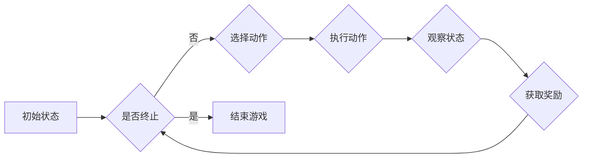

# 深度 Q-learning：在电子游戏中的应用

> 关键词：深度 Q-learning, 强化学习, 电子游戏, 游戏AI, 深度神经网络, 价值函数, 策略学习, 自主决策

## 1. 背景介绍

电子游戏作为人工智能领域的一个重要应用场景，一直是机器学习研究的热点。近年来，随着深度学习技术的飞速发展，基于深度神经网络的强化学习算法在电子游戏领域取得了显著的成果。其中，深度 Q-learning（DQN）因其强大的学习能力、广泛的适用性和易于实现的特点，成为了电子游戏AI领域的首选算法之一。本文将深入探讨深度 Q-learning在电子游戏中的应用，分析其原理、操作步骤、优缺点以及未来发展趋势。

## 2. 核心概念与联系

### 2.1 核心概念

#### 深度 Q-learning

深度 Q-learning（DQN）是深度学习与Q-learning的结合，它通过神经网络来近似Q函数，从而实现更复杂的策略学习。DQN在Q-learning的基础上引入了经验回放（Experience Replay）和目标网络（Target Network）等技术，有效解决了Q-learning中的样本不连续和梯度消失问题。

#### 强化学习

强化学习是一种机器学习方法，通过学习如何从一个环境中的状态序列到动作序列的映射，使智能体在未知的环境中做出最优决策。强化学习的主要特点是学习过程中存在奖励信号，智能体通过不断学习来最大化累积奖励。

#### 电子游戏

电子游戏是一种交互式娱乐形式，玩家通过控制游戏角色在虚拟世界中完成各种任务。电子游戏为强化学习提供了一个理想的测试平台，可以用于评估智能体的决策能力和学习效果。

### 2.2 架构的 Mermaid 流程图



## 3. 核心算法原理 & 具体操作步骤

### 3.1 算法原理概述

DQN算法的核心思想是学习一个Q函数，该函数能够预测在特定状态下执行特定动作所能获得的最大未来奖励。具体来说，DQN通过以下步骤实现：

1. 初始化Q网络：使用随机初始化的深度神经网络作为Q网络，其输入为当前状态，输出为各个动作对应的Q值。
2. 探索与利用：在训练过程中，智能体需要通过探索和利用来学习最优策略。探索策略可以使用ε-贪婪策略，即以一定概率随机选择动作；利用策略则是选择Q值最大的动作。
3. 经验回放：将智能体在游戏过程中遇到的经验（状态、动作、奖励、下一状态）存储到经验池中，并在训练时随机从经验池中抽取经验进行学习，以减少样本偏差。
4. 目标网络：使用目标网络来稳定训练过程，目标网络与Q网络结构相同，但参数更新频率较低。
5. 训练Q网络：通过最小化Q值预测与实际奖励之间的误差来更新Q网络参数。

### 3.2 算法步骤详解

1. **初始化**：创建一个深度神经网络Q网络和一个目标网络，两个网络结构相同，但参数不同。
2. **选择动作**：根据当前状态和ε-贪婪策略，选择动作。
3. **执行动作**：在游戏环境中执行选择的动作，并获得奖励和下一状态。
4. **存储经验**：将当前状态、动作、奖励、下一状态存储到经验池中。
5. **样本抽取**：从经验池中随机抽取一批经验。
6. **计算目标值**：对于每个抽取的经验，计算目标值，即当前状态、动作对应的Q值加上未来奖励的最大值。
7. **更新Q网络**：使用反向传播算法，根据目标值和实际奖励计算梯度，并更新Q网络参数。
8. **更新目标网络**：每隔一定次数，将Q网络参数复制到目标网络中。
9. **重复步骤2-8**，直到达到预设的训练次数或性能指标。

### 3.3 算法优缺点

#### 优点

- **强大的学习能力**：DQN可以学习复杂的策略，适用于各种类型的电子游戏。
- **易于实现**：DQN算法结构简单，易于实现和调试。
- **泛化能力强**：通过经验回放技术，DQN可以学习到更具泛化能力的策略。

#### 缺点

- **样本效率低**：DQN需要大量的样本才能收敛到良好的性能。
- **梯度消失**：在深度神经网络中，梯度可能会消失，导致Q网络难以学习。
- **超参数选择**：DQN的参数设置对性能有较大影响，需要根据具体任务进行调整。

### 3.4 算法应用领域

DQN在电子游戏领域具有广泛的应用，以下是一些典型的应用案例：

- **Atari游戏**：DQN在许多Atari游戏上取得了超越人类水平的成绩，如《太空侵略者》、《吃豆人》等。
- **棋类游戏**：DQN可以应用于棋类游戏，如国际象棋、围棋等。
- **体育游戏**：DQN可以应用于体育游戏，如乒乓球、足球等。

## 4. 数学模型和公式 & 详细讲解 & 举例说明

### 4.1 数学模型构建

DQN的数学模型主要包括以下部分：

- **状态空间 $S$**：游戏的状态描述，如游戏画面、角色位置等。
- **动作空间 $A$**：游戏允许的动作集合，如移动、射击等。
- **Q函数 $Q(s,a)$**：在状态 $s$ 下执行动作 $a$ 所能获得的最大未来奖励的预测值。
- **策略 $\pi(a|s)$**：在状态 $s$ 下选择动作 $a$ 的概率分布。

### 4.2 公式推导过程

DQN的目标是最大化累积奖励，即：

$$
J(\theta) = \mathbb{E}_{\pi(\cdot|s)}[R_t + \gamma \max_{a}Q(S_{t+1},a)]
$$

其中，$R_t$ 是在第 $t$ 个时间步获得的奖励，$\gamma$ 是折扣因子，$\theta$ 是Q网络的参数。

为了求解上述优化问题，我们可以使用梯度下降法。具体来说，对于每个时间步 $t$，我们计算：

$$
\nabla_{\theta}J(\theta) = \nabla_{\theta}\mathbb{E}_{\pi(\cdot|s)}[R_t + \gamma \max_{a}Q(S_{t+1},a)]
$$

然后，使用梯度下降法更新Q网络参数：

$$
\theta \leftarrow \theta - \alpha \nabla_{\theta}J(\theta)
$$

其中，$\alpha$ 是学习率。

### 4.3 案例分析与讲解

以《Pong》游戏为例，说明DQN在电子游戏中的应用。

**状态空间**：游戏画面，包括球的位置、速度、方向、得分等信息。

**动作空间**：上、下、左、右移动球拍。

**Q函数**：$Q(s,a) = \mathbb{E}[R_{t+1} + \gamma \max_{a'}Q(S_{t+1},a') | S_t = s, A_t = a]$，即在状态 $s$ 下执行动作 $a$ 所能获得的最大未来奖励的预测值。

**策略**：$\pi(a|s) = \frac{1}{|A|} \quad \forall s, a$，即在状态 $s$ 下，均匀随机选择动作。

DQN在《Pong》游戏上的训练过程如下：

1. 初始化Q网络和目标网络。
2. 选择动作，如上、下、左、右移动球拍。
3. 执行动作，并获得奖励和下一状态。
4. 将当前状态、动作、奖励、下一状态存储到经验池中。
5. 随机从经验池中抽取一批经验。
6. 计算目标值，即当前状态、动作对应的Q值加上未来奖励的最大值。
7. 更新Q网络参数。
8. 更新目标网络参数。
9. 重复步骤2-8，直到达到预设的训练次数或性能指标。

经过训练，DQN能够在《Pong》游戏中实现自动控制球拍，实现自动游戏。

## 5. 项目实践：代码实例和详细解释说明

### 5.1 开发环境搭建

1. 安装Python环境（Python 3.6及以上版本）。
2. 安装TensorFlow和Gym库。

### 5.2 源代码详细实现

以下是一个简单的DQN代码实例：

```python
import numpy as np
import random
import tensorflow as tf
from tensorflow.keras import layers
from gym import make

# 创建环境
env = make('CartPole-v0')

# 定义Q网络
class DQNNetwork(tf.keras.Model):
    def __init__(self):
        super(DQNNetwork, self).__init__()
        self.fc1 = layers.Dense(24, activation='relu')
        self.fc2 = layers.Dense(24, activation='relu')
        self.fc3 = layers.Dense(env.action_space.n)

    def call(self, x):
        x = self.fc1(x)
        x = self.fc2(x)
        x = self.fc3(x)
        return x

# 定义DQN
class DQN:
    def __init__(self, env):
        self.env = env
        self.q_network = DQNNetwork()
        self.optimizer = tf.keras.optimizers.Adam(learning_rate=0.001)
        self.gamma = 0.99
        self.epsilon = 0.1

    def choose_action(self, state):
        if random.random() < self.epsilon:
            return self.env.action_space.sample()
        else:
            state = tf.expand_dims(state, 0)
            q_values = self.q_network(state)
            return np.argmax(q_values[0])

    def train(self, memory):
        for _ in range(32):
            state, action, reward, next_state, done = random.choice(memory)
            state = tf.expand_dims(state, 0)
            next_state = tf.expand_dims(next_state, 0)

            if done:
                td_target = reward
            else:
                td_target = reward + self.gamma * np.max(self.q_network(next_state)[0])

            td_error = td_target - self.q_network(state)[0][action]
            with tf.GradientTape() as tape:
                tape.watch(self.q_network(state))
                predicted_value = self.q_network(state)
                td_loss = tf.reduce_mean(tf.square(td_error + predicted_value - td_target))
            grads = tape.gradient(td_loss, self.q_network.trainable_variables)
            self.optimizer.apply_gradients(zip(grads, self.q_network.trainable_variables))

    def load(self):
        self.q_network.load_weights('dqn_cartpole.h5')

    def save(self):
        self.q_network.save_weights('dqn_cartpole.h5')

# 训练DQN
memory = []
dqn = DQN(env)
for episode in range(10000):
    state = env.reset()
    done = False
    while not done:
        action = dqn.choose_action(state)
        next_state, reward, done, _ = env.step(action)
        memory.append([state, action, reward, next_state, done])
        state = next_state

    if len(memory) > 32:
        dqn.train(memory)
        memory = memory[-32:]

dqn.save()
```

### 5.3 代码解读与分析

- **DQNNetwork类**：定义了DQN的Q网络，包含三个全连接层。
- **DQN类**：封装了DQN的核心功能，包括选择动作、训练和保存/加载模型。
- **训练过程**：首先初始化经验池和DQN模型，然后进行多轮训练。在每轮训练中，智能体通过选择动作与环境交互，将交互经验存储到经验池中。当经验池达到预设大小后，随机抽取经验进行训练，并更新Q网络参数。

### 5.4 运行结果展示

通过以上代码，DQN可以在CartPole-v0环境中实现自动控制，使小车保持平衡。训练过程中，智能体会逐渐学习到平衡小车的策略，最终能够在环境中稳定运行。

## 6. 实际应用场景

深度 Q-learning在电子游戏领域具有广泛的应用场景，以下是一些典型的应用案例：

- **游戏开发**：利用DQN技术，可以开发具有高度智能化的游戏AI，提升游戏体验。
- **人机对抗**：DQN可以用于开发人机对战游戏，如围棋、国际象棋等。
- **虚拟现实**：在虚拟现实环境中，DQN可以用于开发智能角色，提供更加真实的交互体验。
- **教育训练**：DQN可以用于教育训练，如训练机器人完成特定任务。

## 7. 工具和资源推荐

### 7.1 学习资源推荐

- 《Reinforcement Learning: An Introduction》
- 《Deep Reinforcement Learning》
- TensorFlow官方文档
- Gym官方文档

### 7.2 开发工具推荐

- TensorFlow
- PyTorch
- Gym
- OpenAI Gym环境库

### 7.3 相关论文推荐

- “Playing Atari with Deep Reinforcement Learning” (Silver et al., 2013)
- “Deep Q-Network” (Mnih et al., 2013)
- “Human-level control through deep reinforcement learning” (Silver et al., 2016)

## 8. 总结：未来发展趋势与挑战

### 8.1 研究成果总结

深度 Q-learning在电子游戏领域取得了显著的成果，为游戏AI的发展提供了新的思路。DQN算法通过神经网络近似Q函数，实现了在复杂环境中的智能决策，为其他强化学习应用提供了借鉴。

### 8.2 未来发展趋势

未来，深度 Q-learning在电子游戏领域的发展趋势主要包括：

- **模型结构优化**：设计更加高效的神经网络结构，提高模型学习效率。
- **算法改进**：探索更加鲁棒的算法，提高模型的泛化能力和稳定性。
- **多智能体强化学习**：研究多智能体强化学习算法，实现多智能体在电子游戏中的协同合作。

### 8.3 面临的挑战

深度 Q-learning在电子游戏领域面临的挑战主要包括：

- **样本效率**：提高样本效率，降低对大量样本的依赖。
- **梯度消失**：解决深度神经网络中的梯度消失问题，提高模型学习效果。
- **超参数优化**：设计更加有效的超参数优化方法，提高模型性能。

### 8.4 研究展望

随着深度学习技术的不断发展，深度 Q-learning在电子游戏领域有望取得更大的突破。未来，深度 Q-learning将在游戏开发、人机对抗、虚拟现实等领域发挥更大的作用，为人工智能技术发展贡献力量。

## 9. 附录：常见问题与解答

**Q1：深度 Q-learning的适用场景有哪些？**

A：深度 Q-learning适用于各种类型的电子游戏，如Atari游戏、棋类游戏、体育游戏等。

**Q2：如何解决深度 Q-learning中的梯度消失问题？**

A：可以使用残差网络、LSTM、GRU等结构来解决深度 Q-learning中的梯度消失问题。

**Q3：如何提高深度 Q-learning的样本效率？**

A：可以使用经验回放、重要性采样等技术提高深度 Q-learning的样本效率。

**Q4：深度 Q-learning与深度强化学习有什么区别？**

A：深度强化学习包括深度 Q-learning、策略梯度、深度确定性策略梯度等，而深度 Q-learning是深度强化学习的一个子集。

**Q5：深度 Q-learning在现实世界中有哪些应用？**

A：深度 Q-learning可以应用于自动驾驶、机器人控制、资源管理等领域。