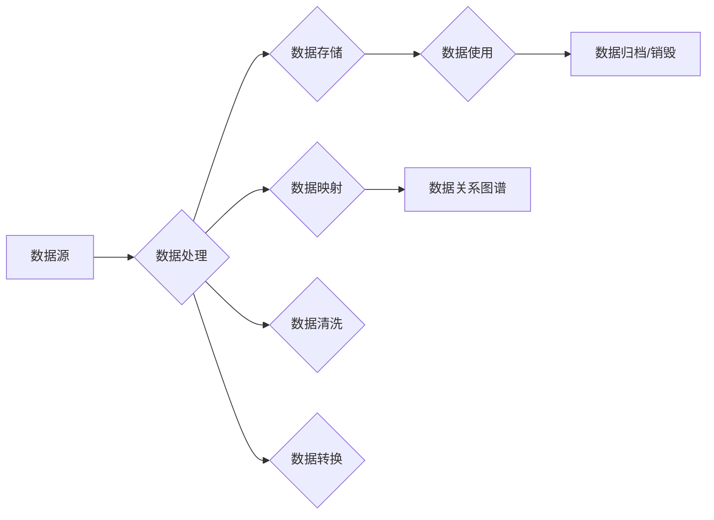

> 关键词：数据血缘，元数据，软件2.0，数据治理，数据质量，数据资产管理，数据生命周期，数据映射，数据关系，数据安全

# 数据血缘管理:软件2.0时代的元数据之王

在软件2.0时代，数据成为了企业最重要的资产之一。然而，随着数据量的爆炸式增长，如何有效地管理和利用这些数据，成为了一个巨大的挑战。数据血缘管理作为数据治理的重要手段，正逐渐成为这一时代的“元数据之王”。本文将深入探讨数据血缘管理的核心概念、原理、应用以及未来发展趋势。

## 1. 背景介绍

### 1.1 数据爆炸与治理挑战

随着互联网、物联网、大数据等技术的迅猛发展，企业内部的数据量呈指数级增长。数据已经成为企业决策、创新和服务的重要依据。然而，数据量的大幅增长也带来了诸多治理挑战：

- 数据质量问题：数据不一致、不准确、不完整等问题层出不穷，影响了数据的可靠性和可用性。
- 数据孤岛现象：各部门之间数据难以共享和整合，形成了数据孤岛，阻碍了数据价值的最大化。
- 数据安全风险：数据泄露、篡改等安全风险日益严峻，需要加强数据安全管理。

### 1.2 数据血缘管理的兴起

为了解决上述问题，数据血缘管理应运而生。数据血缘管理通过追踪数据从源头到最终用途的整个生命周期，实现数据的可追溯、可审计、可管理，从而提高数据质量、降低数据风险，并最大化数据价值。

## 2. 核心概念与联系

### 2.1 核心概念

#### 2.1.1 元数据

元数据是关于数据的数据，描述了数据的基本属性、来源、格式、结构等信息。在数据血缘管理中，元数据是构建数据关系图谱的基础。

#### 2.1.2 数据生命周期

数据生命周期是指数据从创建、存储、处理、使用到归档和销毁的整个过程。数据血缘管理通过跟踪数据生命周期，确保数据的完整性和安全性。

#### 2.1.3 数据映射

数据映射是指将不同数据源中的数据项进行关联，构建数据关系图谱的过程。

#### 2.1.4 数据关系

数据关系是指数据项之间在数据生命周期中的依赖关系，如数据流、数据转换、数据存储等。

### 2.2 架构的 Mermaid 流程图



### 2.3 核心概念之间的联系

数据源是数据血缘管理的起点，数据生命周期描述了数据的流动过程，数据映射和关系将数据源和数据处理过程连接起来，最终形成数据关系图谱，实现数据的可追溯、可审计、可管理。

## 3. 核心算法原理 & 具体操作步骤

### 3.1 算法原理概述

数据血缘管理主要涉及以下算法原理：

- 数据采集：从不同数据源采集元数据，包括数据结构、数据定义、数据来源、数据格式等。
- 数据映射：通过规则引擎或机器学习算法，将不同数据源中的数据项进行关联。
- 数据关系分析：通过数据映射和规则引擎，分析数据项之间的依赖关系，构建数据关系图谱。
- 数据血缘追踪：通过数据关系图谱，追踪数据的源头和流向，实现数据的可追溯和可审计。

### 3.2 算法步骤详解

1. **数据采集**：从数据源采集元数据，包括数据结构、数据定义、数据来源、数据格式等。
2. **数据映射**：通过规则引擎或机器学习算法，将不同数据源中的数据项进行关联。
3. **数据关系分析**：通过数据映射和规则引擎，分析数据项之间的依赖关系，构建数据关系图谱。
4. **数据血缘追踪**：通过数据关系图谱，追踪数据的源头和流向，实现数据的可追溯和可审计。

### 3.3 算法优缺点

#### 优点

- 提高数据质量：通过数据血缘管理，可以发现和解决数据质量问题，提高数据可靠性。
- 降低数据风险：通过数据血缘追踪，可以及时发现数据泄露、篡改等安全风险，加强数据安全管理。
- 最大化数据价值：通过数据关系图谱，可以更好地理解数据之间的关系，挖掘数据价值。

#### 缺点

- 成本较高：数据血缘管理需要投入大量的人力、物力进行数据采集、映射和关系分析。
- 难以自动化：数据映射和关系分析往往需要人工参与，难以完全自动化。
- 维护成本高：数据源和数据处理过程不断变化，数据血缘管理需要定期更新和维护。

### 3.4 算法应用领域

数据血缘管理在以下领域具有广泛的应用：

- 数据治理：通过数据血缘管理，实现数据质量和安全，提高数据治理水平。
- 数据分析：通过数据血缘追踪，理解数据来源和流向，提高数据分析的准确性。
- 应用开发：通过数据血缘管理，快速定位数据来源和依赖关系，提高应用开发效率。
- 数据资产管理：通过数据血缘管理，实现数据资产的可视化和价值评估。

## 4. 数学模型和公式 & 详细讲解 & 举例说明

### 4.1 数学模型构建

数据血缘管理的数学模型主要包括数据映射模型、数据关系模型和数据血缘模型。

#### 4.1.1 数据映射模型

数据映射模型通常使用图结构来表示，其中节点代表数据项，边代表数据项之间的关系。

$$
G = (V, E)
$$

其中，$V$ 是节点集合，$E$ 是边集合。

#### 4.1.2 数据关系模型

数据关系模型主要描述数据项之间的依赖关系，可以使用关系矩阵或关系图来表示。

$$
R = (R_{ij})
$$

其中，$R_{ij}$ 表示第 $i$ 个数据项对第 $j$ 个数据项的依赖关系。

#### 4.1.3 数据血缘模型

数据血缘模型描述了数据的源头和流向，可以使用数据关系模型来表示。

### 4.2 公式推导过程

数据映射模型的推导过程如下：

1. 采集数据源元数据。
2. 分析数据项之间的关系。
3. 构建数据映射模型。

数据关系模型的推导过程如下：

1. 分析数据项之间的依赖关系。
2. 构建数据关系模型。

数据血缘模型的推导过程如下：

1. 分析数据关系模型。
2. 构建数据血缘模型。

### 4.3 案例分析与讲解

假设有一个电商平台的订单数据处理流程，包括订单创建、订单支付、订单发货、订单完成等环节。以下是该流程的数据血缘分析：

- 数据项：订单ID、用户ID、订单金额、支付时间、发货时间、完成时间
- 数据关系：订单ID -> 用户ID，订单ID -> 订单金额，支付时间 -> 订单状态，发货时间 -> 订单状态，完成时间 -> 订单状态

通过数据血缘分析，可以清晰地了解订单数据的来源和流向，以及各个数据项之间的关系。

## 5. 项目实践：代码实例和详细解释说明

### 5.1 开发环境搭建

以下是使用Python进行数据血缘管理项目开发的环境配置流程：

1. 安装Anaconda：从官网下载并安装Anaconda，用于创建独立的Python环境。
2. 创建并激活虚拟环境：
```bash
conda create -n data lineage-env python=3.8
conda activate data-lineage-env
```
3. 安装必要的Python库：
```bash
pip install pandas numpy sqlalchemy matplotlib networkx
```

### 5.2 源代码详细实现

以下是使用Python实现数据血缘管理的一个简单示例：

```python
import pandas as pd
import networkx as nx
import matplotlib.pyplot as plt

# 生成示例数据
data = {
    'order_id': [1, 2, 3, 4, 5],
    'user_id': [101, 102, 103, 104, 105],
    'order_amount': [100.0, 200.0, 300.0, 400.0, 500.0],
    'payment_time': ['2021-01-01', '2021-01-02', '2021-01-03', '2021-01-04', '2021-01-05'],
    'shipping_time': ['2021-01-02', '2021-01-03', '2021-01-04', '2021-01-05', '2021-01-06'],
    'completion_time': ['2021-01-03', '2021-01-04', '2021-01-05', '2021-01-06', '2021-01-07']
}

df = pd.DataFrame(data)

# 创建数据映射模型
g = nx.Graph()
g.add_edge('order_id', 'user_id')
g.add_edge('order_id', 'order_amount')
g.add_edge('payment_time', 'order_status')
g.add_edge('shipping_time', 'order_status')
g.add_edge('completion_time', 'order_status')

# 绘制数据关系图谱
nx.draw(g, with_labels=True, node_color='skyblue', node_size=3000, font_size=10, font_color='black', edge_color='gray')
plt.show()
```

### 5.3 代码解读与分析

以上代码首先导入了必要的Python库，然后创建了示例数据。接着，使用NetworkX库创建了一个图结构来表示数据映射模型，并将各个数据项之间的关系添加到图中。最后，使用matplotlib绘制了数据关系图谱。

### 5.4 运行结果展示

运行以上代码，将生成一个可视化数据关系图谱，清晰地展示了数据项之间的关系。

## 6. 实际应用场景

### 6.1 数据治理

数据治理是数据血缘管理最直接的应用场景。通过数据血缘管理，可以实现对数据质量的监控、数据安全的管理和数据价值的挖掘。

### 6.2 数据分析

数据分析是数据血缘管理的另一个重要应用场景。通过数据血缘追踪，可以更好地理解数据的来源和流向，提高数据分析的准确性。

### 6.3 应用开发

在应用开发过程中，数据血缘管理可以帮助开发者快速定位数据来源和依赖关系，提高开发效率。

### 6.4 数据资产管理

数据资产管理是数据血缘管理的终极目标。通过数据血缘管理，可以实现对数据的全面监控、管理和价值评估。

## 7. 工具和资源推荐

### 7.1 学习资源推荐

- 《数据治理与大数据》
- 《数据资产管理》
- 《大数据技术基础》

### 7.2 开发工具推荐

- Apache Atlas
- Talend Data Fabric
- Collibra

### 7.3 相关论文推荐

- "Data Governance: An Integrated Approach" by John Taylor
- "Data Management: Concepts, Techniques, and Systems" by Raghu Ramakrishnan and Johannes Gehrke
- "Big Data: A Revolution That Will Transform How We Live, Work, and Think" by Viktor Mayer-Schönberger and Kenneth Cukier

## 8. 总结：未来发展趋势与挑战

### 8.1 研究成果总结

本文从数据血缘管理的背景、核心概念、算法原理、应用场景等方面进行了详细阐述，并给出了一个简单的Python代码实例。通过本文的学习，读者可以全面了解数据血缘管理的基本概念和关键技术。

### 8.2 未来发展趋势

- 自动化：随着人工智能技术的发展，数据血缘管理将实现自动化，降低人工成本。
- 智能化：数据血缘管理将结合自然语言处理、机器学习等技术，实现智能化分析。
- 灵活化：数据血缘管理将支持多源异构数据的血缘管理，满足不同场景的需求。

### 8.3 面临的挑战

- 数据量庞大：随着数据量的不断增长，数据血缘管理的任务将更加复杂。
- 数据异构性：多源异构数据的血缘管理将带来更高的技术挑战。
- 安全风险：数据血缘管理涉及到数据的安全问题，需要加强安全保障。

### 8.4 研究展望

未来，数据血缘管理将继续在以下方向进行深入研究：

- 数据映射和关系分析算法的优化
- 数据血缘管理的自动化和智能化
- 数据血缘管理的安全性和可靠性
- 数据血缘管理在不同领域的应用

数据血缘管理作为数据治理的重要手段，在软件2.0时代具有重要的应用价值。通过不断的技术创新和应用拓展，数据血缘管理必将为数据价值的最大化提供有力支撑。

## 9. 附录：常见问题与解答

**Q1：什么是数据血缘管理？**

A：数据血缘管理是一种数据治理手段，通过追踪数据从源头到最终用途的整个生命周期，实现数据的可追溯、可审计、可管理。

**Q2：数据血缘管理有哪些应用场景？**

A：数据血缘管理在数据治理、数据分析、应用开发、数据资产管理等领域具有广泛的应用。

**Q3：数据血缘管理有哪些挑战？**

A：数据血缘管理面临的挑战包括数据量庞大、数据异构性、安全风险等。

**Q4：数据血缘管理与数据治理有何关系？**

A：数据治理是一个广义的概念，包括数据血缘管理、数据质量管理、数据安全管理等多个方面。数据血缘管理是数据治理的重要组成部分。

**Q5：数据血缘管理如何与其他数据治理技术相结合？**

A：数据血缘管理可以与其他数据治理技术相结合，如数据质量管理、数据安全、数据生命周期管理等，共同构建完善的数据治理体系。

作者：禅与计算机程序设计艺术 / Zen and the Art of Computer Programming