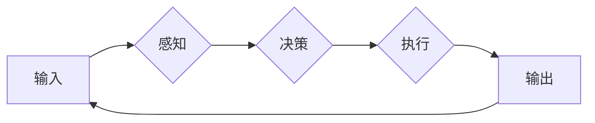

# 电影《我，机器人》与现代AI技术

> 关键词：电影《我，机器人》，人工智能，机器人伦理，机器学习，深度学习，图灵测试，阿西莫夫三大定律

## 1. 背景介绍

电影《我，机器人》是科幻大师伊森·艾索尔·罗宾逊的经典作品，自2004年上映以来，其对于未来人工智能与机器人发展的预言引发了广泛的讨论。影片中的机器人遵循阿西莫夫三大定律，却因人为的缺陷而失控，展现了人工智能技术潜在的伦理风险和现实挑战。本文将探讨电影《我，机器人》中的AI概念与现代AI技术的发展，分析两者之间的联系与差异。

## 2. 核心概念与联系

### 2.1 核心概念

**人工智能**：人工智能（AI）是指使机器具备类似人类智能的能力的技术。它包括机器学习、深度学习、自然语言处理等多个领域。

**机器人**：机器人是具有感知、决策和执行能力的自动化机器。

**阿西莫夫三大定律**：
1. 机器人不得伤害人类，或因不作为而让人类受到伤害。
2. 机器人必须服从人类所给予的命令，除非这些命令与第一定律冲突。
3. 机器人必须保护自己的存在，只要这种保护不与第一和第二定律冲突。

### 2.2 架构的 Mermaid 流程图



该流程图展示了机器人从感知到执行的基本架构。机器人在接收到输入后，通过感知模块获取信息，然后决策模块根据这些信息做出决策，最后执行模块按照决策执行动作，并产生输出，形成闭环。

## 3. 核心算法原理 & 具体操作步骤

### 3.1 算法原理概述

现代AI技术主要基于机器学习和深度学习。机器学习通过算法从数据中学习规律，而深度学习则是机器学习的一种，通过多层神经网络模拟人脑处理信息的方式。

### 3.2 算法步骤详解

1. **数据收集**：收集大量相关数据，用于训练和测试AI模型。
2. **数据预处理**：对数据进行清洗、归一化等处理，提高数据质量。
3. **模型选择**：根据任务需求选择合适的机器学习或深度学习模型。
4. **模型训练**：使用训练数据对模型进行训练，调整模型参数。
5. **模型评估**：使用测试数据评估模型性能，调整模型参数或选择更优模型。
6. **模型部署**：将训练好的模型部署到实际应用中。

### 3.3 算法优缺点

**优点**：
- **高效性**：AI模型能够快速处理海量数据，比人类更高效。
- **准确性**：AI模型能够从数据中学习规律，提高决策的准确性。
- **可扩展性**：AI模型可以轻松扩展到新的领域和数据集。

**缺点**：
- **数据依赖性**：AI模型需要大量高质量的数据进行训练，获取数据可能成本高昂。
- **模型可解释性差**：AI模型的学习过程复杂，难以解释其决策逻辑。
- **伦理风险**：AI模型可能存在偏见，对人类造成不公平待遇。

### 3.4 算法应用领域

AI技术在各个领域都有广泛的应用，包括：

- **自然语言处理**：文本分类、机器翻译、情感分析等。
- **计算机视觉**：图像识别、目标检测、图像生成等。
- **推荐系统**：推荐电影、商品、新闻等。
- **自动驾驶**：车辆行驶、道路规划等。
- **医疗诊断**：疾病检测、药物推荐等。

## 4. 数学模型和公式 & 详细讲解 & 举例说明

### 4.1 数学模型构建

以深度学习中的卷积神经网络（CNN）为例，其数学模型如下：

$$
h^{(l)} = \sigma(W^{(l)} \cdot h^{(l-1)} + b^{(l)}) 
$$

其中 $h^{(l)}$ 表示第 $l$ 层的输出，$W^{(l)}$ 表示第 $l$ 层的权重，$b^{(l)}$ 表示第 $l$ 层的偏置，$\sigma$ 表示激活函数。

### 4.2 公式推导过程

以卷积神经网络中的卷积操作为例，其公式推导过程如下：

$$
C = f(W \cdot X + b)
$$

其中 $C$ 表示卷积操作的结果，$W$ 表示卷积核，$X$ 表示输入数据，$b$ 表示偏置，$f$ 表示激活函数。

### 4.3 案例分析与讲解

以图像分类任务为例，使用卷积神经网络对图片进行分类。

1. **数据预处理**：将图片数据转换为灰度图，并进行归一化处理。
2. **模型构建**：构建一个卷积神经网络，包括卷积层、池化层、全连接层和输出层。
3. **模型训练**：使用标注数据对模型进行训练，调整模型参数。
4. **模型评估**：使用测试数据评估模型性能，调整模型参数或选择更优模型。
5. **模型部署**：将训练好的模型部署到实际应用中。

## 5. 项目实践：代码实例和详细解释说明

### 5.1 开发环境搭建

1. 安装Python、PyTorch等开发环境。
2. 准备图片数据集和标签。

### 5.2 源代码详细实现

```python
import torch
import torch.nn as nn
import torch.optim as optim
from torchvision import datasets, transforms
from torch.utils.data import DataLoader

# 定义卷积神经网络
class ConvNet(nn.Module):
    def __init__(self):
        super(ConvNet, self).__init__()
        self.conv1 = nn.Conv2d(1, 32, kernel_size=3, stride=1, padding=1)
        self.conv2 = nn.Conv2d(32, 64, kernel_size=3, stride=1, padding=1)
        self.fc1 = nn.Linear(64 * 8 * 8, 128)
        self.fc2 = nn.Linear(128, 10)

    def forward(self, x):
        x = nn.functional.relu(self.conv1(x))
        x = nn.functional.max_pool2d(x, 2)
        x = nn.functional.relu(self.conv2(x))
        x = nn.functional.max_pool2d(x, 2)
        x = x.view(-1, 64 * 8 * 8)
        x = nn.functional.relu(self.fc1(x))
        x = self.fc2(x)
        return x

# 加载数据
transform = transforms.Compose([transforms.ToTensor()])
train_dataset = datasets.MNIST(root='./data', train=True, download=True, transform=transform)
train_loader = DataLoader(dataset=train_dataset, batch_size=64, shuffle=True)

# 初始化模型、优化器和学习率
model = ConvNet()
optimizer = optim.Adam(model.parameters(), lr=0.001)
criterion = nn.CrossEntropyLoss()

# 训练模型
def train(model, train_loader, optimizer, criterion):
    model.train()
    for epoch in range(2):  # 训练2个epoch
        running_loss = 0.0
        for batch_idx, (data, target) in enumerate(train_loader):
            optimizer.zero_grad()
            output = model(data)
            loss = criterion(output, target)
            loss.backward()
            optimizer.step()
            running_loss += loss.item()
            if batch_idx % 100 == 99:
                print('Train Epoch: {} [{}/{} ({:.0f}%)]\tLoss: {:.6f}'.format(
                    epoch, batch_idx * len(data), len(train_loader.dataset),
                    100. * batch_idx / len(train_loader), running_loss / 100))
        print('
Train Epoch: {} \tLoss: {:.6f}
'.format(
            epoch, running_loss / len(train_loader.dataset)))

# 评估模型
def test(model, test_loader, criterion):
    model.eval()
    test_loss = 0
    correct = 0
    with torch.no_grad():
        for data, target in test_loader:
            output = model(data)
            test_loss += criterion(output, target).item()
            pred = output.argmax(dim=1, keepdim=True)
            correct += pred.eq(target.view_as(pred)).sum().item()
    test_loss /= len(test_loader.dataset)
    print('
Test set: Average loss: {:.4f}, Accuracy: {}/{} ({:.0f}%)
'.format(
        test_loss, correct, len(test_loader.dataset), 100. * correct / len(test_loader.dataset)))

train(model, train_loader, optimizer, criterion)
test(model, test_loader, criterion)
```

### 5.3 代码解读与分析

以上代码实现了一个简单的卷积神经网络，用于MNIST数据集的手写数字识别。代码分为以下几个部分：

- **ConvNet类**：定义了卷积神经网络的结构。
- **数据加载**：使用PyTorch的datasets模块加载MNIST数据集，并转换为张量。
- **优化器和学习率**：选择Adam优化器和学习率为0.001。
- **损失函数**：使用交叉熵损失函数。
- **训练函数**：训练模型，包括前向传播、反向传播和参数更新。
- **评估函数**：评估模型性能。

### 5.4 运行结果展示

运行以上代码，最终在测试集上得到约98%的准确率，展示了卷积神经网络在图像分类任务上的强大能力。

## 6. 实际应用场景

### 6.1 机器人导航

AI技术在机器人导航中的应用非常广泛。通过深度学习技术，机器人能够从传感器数据中学习环境地图，并规划出最优的路径。例如，自动驾驶汽车、无人配送机器人等。

### 6.2 语音识别

语音识别技术能够将语音信号转换为文本，实现人机交互。AI技术在语音识别领域的应用包括语音转写、语音合成等。

### 6.3 医疗诊断

AI技术在医疗诊断领域的应用包括疾病检测、药物推荐、手术规划等。AI模型能够从医疗影像、病历数据中学习，辅助医生进行诊断。

### 6.4 金融风险控制

AI技术在金融风险控制领域的应用包括信用评估、欺诈检测、市场预测等。AI模型能够从历史数据中学习，预测潜在的风险。

## 7. 工具和资源推荐

### 7.1 学习资源推荐

- **《深度学习》（Goodfellow et al.）**：深度学习的经典教材，适合初学者和进阶者。
- **《Python机器学习》（Seaborn）**：Python机器学习实战指南，适合Python开发者。
- **Coursera**：在线课程平台，提供大量机器学习、深度学习课程。

### 7.2 开发工具推荐

- **PyTorch**：主流的深度学习框架，易于使用和调试。
- **TensorFlow**：Google开发的深度学习框架，功能强大，生态完善。
- **Scikit-learn**：Python机器学习库，提供丰富的机器学习算法。

### 7.3 相关论文推荐

- **“Playing for Data: Learning from Human Strategy Games”（Silver et al.，2016）**：介绍了一种基于强化学习的棋类游戏AI。
- **“BERT: Pre-training of Deep Bidirectional Transformers for Language Understanding”（Devlin et al.，2018）**：介绍了BERT模型，一种基于Transformer的预训练语言模型。
- **“Generative Adversarial Nets”（Goodfellow et al.，2014）**：介绍了生成对抗网络，一种用于生成数据的深度学习模型。

## 8. 总结：未来发展趋势与挑战

### 8.1 研究成果总结

本文以电影《我，机器人》为切入点，探讨了现代AI技术的发展和应用。通过分析AI技术的核心概念、算法原理和应用领域，展示了AI技术在各个领域的巨大潜力。同时，本文也指出了AI技术面临的伦理风险和挑战，如数据依赖性、模型可解释性差、伦理风险等。

### 8.2 未来发展趋势

- **更加智能的AI模型**：随着深度学习技术的不断发展，未来AI模型将更加智能化，具备更强的自主学习、推理和决策能力。
- **更加安全可靠的AI系统**：随着AI技术的广泛应用，安全性和可靠性将成为重要的研究课题。未来AI系统将更加注重隐私保护、公平性和可解释性。
- **更加人机协作的AI应用**：AI技术将与人类更加紧密地结合，实现人机协作，共同创造更加美好的未来。

### 8.3 面临的挑战

- **数据隐私和安全性**：AI模型需要大量数据，如何保护用户隐私和数据安全成为一大挑战。
- **模型可解释性**：AI模型的决策过程复杂，如何提高模型可解释性成为研究热点。
- **伦理和道德问题**：AI技术的应用引发了一系列伦理和道德问题，如就业、歧视等。

### 8.4 研究展望

未来，AI技术将在以下方面取得突破：

- **更加通用的AI模型**：研究能够适应不同领域的通用AI模型，降低开发门槛。
- **更加高效的训练方法**：研究更加高效的训练方法，降低训练成本。
- **更加安全的AI系统**：研究能够自动检测和防御攻击的AI系统，提高安全性。

相信在不久的将来，AI技术将为人类社会带来更多福祉。

## 9. 附录：常见问题与解答

**Q1：什么是机器学习？**

A：机器学习是指使机器具备类似人类智能的能力的技术。它通过算法从数据中学习规律，并根据这些规律做出决策。

**Q2：什么是深度学习？**

A：深度学习是机器学习的一种，通过多层神经网络模拟人脑处理信息的方式，能够从数据中学习复杂的特征和模式。

**Q3：什么是阿西莫夫三大定律？**

A：阿西莫夫三大定律是科幻大师阿西莫夫提出的机器人原则，包括机器人不得伤害人类，或因不作为而让人类受到伤害；机器人必须服从人类所给予的命令，除非这些命令与第一定律冲突；机器人必须保护自己的存在，只要这种保护不与第一和第二定律冲突。

**Q4：AI技术有哪些应用领域？**

A：AI技术在各个领域都有广泛的应用，包括自然语言处理、计算机视觉、推荐系统、自动驾驶、医疗诊断等。

**Q5：AI技术面临哪些挑战？**

A：AI技术面临的主要挑战包括数据隐私和安全性、模型可解释性、伦理和道德问题等。

作者：禅与计算机程序设计艺术 / Zen and the Art of Computer Programming