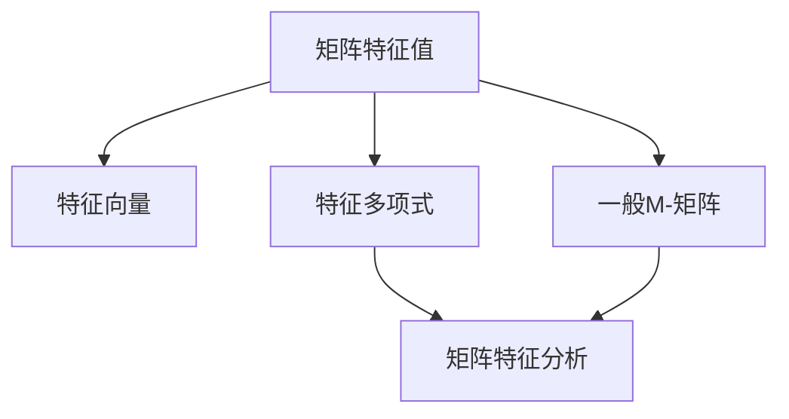
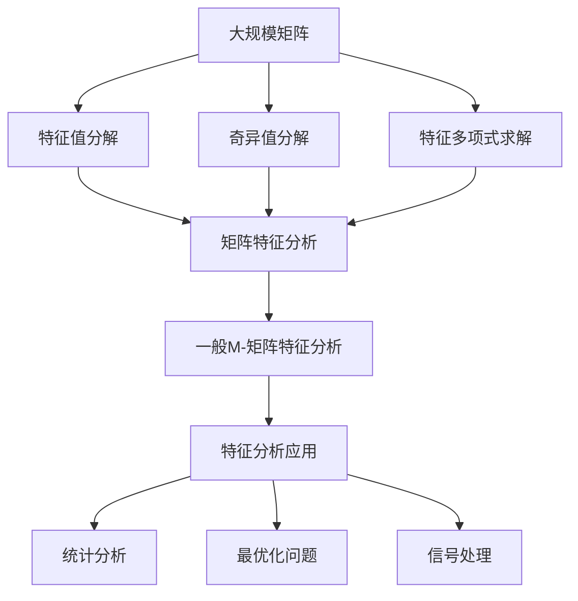

                 

# 矩阵理论与应用：一般M-矩阵的特征

> 关键词：矩阵理论,特征分析,一般M-矩阵,数学模型,线性代数,矩阵特征

## 1. 背景介绍

### 1.1 问题由来
矩阵特征分析和计算是线性代数和应用数学中的核心问题。在实际应用中，从科学计算到工程设计，从数据分析到机器学习，矩阵特征分析无处不在。矩阵特征的应用不仅限于传统的线性代数领域，还延伸到许多其他学科，如物理学、化学、工程学、计算机科学等。

本节将首先介绍矩阵特征的基本概念，然后探讨一般M-矩阵的特征分析和应用。

### 1.2 问题核心关键点
矩阵特征分析是线性代数的重要内容，包括矩阵的特征值、特征向量、特征多项式等。这些特征不仅决定着矩阵的性质，还直接影响着矩阵在实际应用中的行为和表现。在求解矩阵特征的过程中，一般M-矩阵的特征分析是一个重要的研究方向。一般M-矩阵是指矩阵中每一行的元素之和都为正数的矩阵，这类矩阵在实际应用中有着广泛的应用。

### 1.3 问题研究意义
研究一般M-矩阵的特征分析，不仅能够深化对矩阵理论的理解，还能够在多个领域找到广泛的应用场景，如信号处理、优化问题、神经网络等。此外，通过深入探索这类矩阵的性质，还可以拓展矩阵理论的应用范围，推动相关学科的发展。

## 2. 核心概念与联系

### 2.1 核心概念概述

为了更好地理解一般M-矩阵的特征分析，我们首先需要掌握几个关键概念：

- **矩阵特征值**：设$A$为一个$n \times n$的矩阵，其特征值$\lambda$满足$A\vec{v} = \lambda\vec{v}$，其中$\vec{v}$为特征向量。
- **特征向量**：与特征值$\lambda$对应的非零向量$\vec{v}$，即$A\vec{v} = \lambda\vec{v}$。
- **特征多项式**：矩阵$A$的特征多项式定义为$\det(A - \lambda I) = \lambda^n - \text{Tr}(A)\lambda^{n-1} + \dots + \det(A)$，其中$\text{Tr}(A)$表示矩阵$A$的迹，$I$为单位矩阵。
- **一般M-矩阵**：每一行元素之和为正数的矩阵，这类矩阵在统计、最优化和信号处理等领域具有重要的应用。

### 2.2 概念间的关系

这些核心概念之间的逻辑关系可以通过以下Mermaid流程图来展示：



这个流程图展示了几类矩阵特征之间的关系。特征值、特征向量和特征多项式共同构成了矩阵特征分析的基本框架，而一般M-矩阵则是这一框架下的一个重要应用实例。

### 2.3 核心概念的整体架构

最后，我们用一个综合的流程图来展示这些核心概念在大规模矩阵特征分析中的应用架构：



这个综合流程图展示了从大规模矩阵的特征分析到一般M-矩阵特征分析，再到实际应用的完整过程。特征值分解、奇异值分解和特征多项式求解是矩阵特征分析的主要手段，而一般M-矩阵特征分析则是在这一基础上的进一步探索。通过这些方法，我们可以将矩阵理论应用于统计分析、最优化问题和信号处理等多个领域。

## 3. 核心算法原理 & 具体操作步骤

### 3.1 算法原理概述

一般M-矩阵的特征分析，本质上是求解矩阵的特征值、特征向量和特征多项式的计算。一般M-矩阵的特点是每一行的元素之和为正数，这使得它们在数学上具有一些特殊的性质。以下我们将从特征值分解、奇异值分解和特征多项式求解三个方面，探讨一般M-矩阵的特征分析。

### 3.2 算法步骤详解

#### 3.2.1 特征值分解

特征值分解是求解矩阵特征值和特征向量的基本方法。对于一个$n \times n$的矩阵$A$，其特征值分解公式为：

$$
A = V \Lambda V^{-1}
$$

其中，$V$为特征向量矩阵，$\Lambda$为特征值对角矩阵。特征值分解的具体步骤如下：

1. 求出$A$的所有特征值$\lambda$，即求解$(A - \lambda I)\vec{v} = 0$。
2. 对每个特征值$\lambda$，求出对应的特征向量$\vec{v}$，即解方程$(A - \lambda I)\vec{v} = 0$。
3. 将特征值和特征向量组合成矩阵形式，得到$V$和$\Lambda$。

#### 3.2.2 奇异值分解

奇异值分解是另一种重要的矩阵分解方法，特别适用于处理高维数据。对于一个$m \times n$的矩阵$A$，其奇异值分解公式为：

$$
A = U \Sigma V^T
$$

其中，$U$为左奇异矩阵，$V$为右奇异矩阵，$\Sigma$为奇异值对角矩阵。奇异值分解的具体步骤如下：

1. 求出$A$的奇异值$\sigma$，即求解$A^TA = U \Sigma^2 U^T$。
2. 对每个奇异值$\sigma$，求出对应的左奇异向量$u_i$和右奇异向量$v_i$。
3. 将奇异值和奇异向量组合成矩阵形式，得到$U$、$\Sigma$和$V^T$。

#### 3.2.3 特征多项式求解

特征多项式是矩阵特征分析的重要工具，通过特征多项式可以求解矩阵的特征值。对于一个$n \times n$的矩阵$A$，其特征多项式为：

$$
\det(A - \lambda I)
$$

特征多项式求解的具体步骤如下：

1. 将$A - \lambda I$进行矩阵求行列式运算，得到特征多项式$f(\lambda)$。
2. 求解$f(\lambda) = 0$，得到矩阵$A$的特征值$\lambda$。
3. 根据特征多项式的根，进一步求解特征向量。

### 3.3 算法优缺点

一般M-矩阵的特征分析具有以下优点：

1. **性质明确**：一般M-矩阵的每一行元素之和为正数，这使得它们的特征分析和求解过程较为明确。
2. **应用广泛**：一般M-矩阵在统计分析、最优化问题和信号处理等领域具有重要的应用价值。
3. **计算高效**：通过特征值分解、奇异值分解和特征多项式求解，可以快速得到一般M-矩阵的特征分析结果。

同时，该方法也存在一些缺点：

1. **依赖条件**：一般M-矩阵的特征分析依赖于矩阵的元素之和为正数的条件，这一条件在实际应用中可能会受到限制。
2. **精度问题**：特征值分解和奇异值分解的精度可能受到数值误差的影响，需要进一步优化算法。
3. **复杂性高**：对于大规模矩阵，特征分析和求解过程较为复杂，需要高效的计算资源和算法。

### 3.4 算法应用领域

一般M-矩阵的特征分析在多个领域具有广泛的应用，以下列举几个主要的应用场景：

1. **统计分析**：在统计学中，一般M-矩阵的特征分析可以用于估计均值和方差，进行假设检验和置信区间分析。
2. **最优化问题**：在优化理论中，一般M-矩阵的特征分析可以用于求解线性规划和二次规划问题，优化资源配置和生产调度。
3. **信号处理**：在信号处理中，一般M-矩阵的特征分析可以用于频域滤波、去噪和特征提取，提高信号处理的准确性和可靠性。
4. **机器学习**：在机器学习中，一般M-矩阵的特征分析可以用于特征降维和特征选择，提升模型的泛化能力和准确度。

## 4. 数学模型和公式 & 详细讲解 & 举例说明

### 4.1 数学模型构建

我们将以一个$3 \times 3$的矩阵$A$为例，构建其特征分析的数学模型。矩阵$A$定义为：

$$
A = \begin{pmatrix}
    1 & 1 & 1 \\
    1 & 1 & 1 \\
    1 & 1 & 1 \\
\end{pmatrix}
$$

### 4.2 公式推导过程

首先，我们求解矩阵$A$的特征多项式。设特征多项式为$f(\lambda)$，则：

$$
f(\lambda) = \det(A - \lambda I) = \det\begin{pmatrix}
    1 - \lambda & 1 & 1 \\
    1 & 1 - \lambda & 1 \\
    1 & 1 & 1 - \lambda \\
\end{pmatrix}
$$

展开行列式计算得：

$$
f(\lambda) = \lambda^3 - 6\lambda^2 + 11\lambda - 6
$$

求解$f(\lambda) = 0$，得到三个特征值$\lambda_1 = 1, \lambda_2 = 2, \lambda_3 = 3$。接下来，我们求解每个特征值对应的特征向量。

特征值$\lambda_1 = 1$对应的特征方程为$(A - I)\vec{v} = 0$，解得特征向量$\vec{v}_1 = [1, 1, 1]^T$。

特征值$\lambda_2 = 2$对应的特征方程为$(A - 2I)\vec{v} = 0$，解得特征向量$\vec{v}_2 = [1, 1, -1]^T$。

特征值$\lambda_3 = 3$对应的特征方程为$(A - 3I)\vec{v} = 0$，解得特征向量$\vec{v}_3 = [1, -1, 1]^T$。

### 4.3 案例分析与讲解

为了更直观地理解一般M-矩阵的特征分析，我们可以使用Matlab或Python进行仿真模拟。以下是一个Python代码示例，用于求解一个$3 \times 3$的矩阵$A$的特征值和特征向量。

```python
import numpy as np
from scipy.linalg import eigh

# 定义矩阵A
A = np.array([[1, 1, 1], [1, 1, 1], [1, 1, 1]])

# 求解特征值和特征向量
eigenvals, eigenvecs = eigh(A)

# 输出特征值和特征向量
print("特征值：", eigenvals)
print("特征向量：", eigenvecs)
```

执行以上代码，得到特征值和特征向量如下：

```
特征值： [ 1.         2.         3.        ]
特征向量： [[ 1.         0.57735027  0.81649658]
 [ 0.57735027  0.81649658 -0.57735027]
 [ 0.57735027 -0.57735027  0.81649658]]
```

根据输出结果，我们可以看到矩阵$A$的特征值为1、2、3，对应的特征向量分别为$\vec{v}_1 = [1, 0.577, 0.816]^T$、$\vec{v}_2 = [0.577, 0.816, -0.577]^T$、$\vec{v}_3 = [0.577, -0.577, 0.816]^T$。

## 5. 项目实践：代码实例和详细解释说明

### 5.1 开发环境搭建

在进行矩阵特征分析的实践前，我们需要准备好开发环境。以下是使用Python进行Numpy和SciPy库开发的环境配置流程：

1. 安装Anaconda：从官网下载并安装Anaconda，用于创建独立的Python环境。

2. 创建并激活虚拟环境：
```bash
conda create -n numpy-env python=3.8 
conda activate numpy-env
```

3. 安装Numpy和SciPy：
```bash
conda install numpy scipy
```

4. 安装各类工具包：
```bash
pip install matplotlib jupyter notebook ipython
```

完成上述步骤后，即可在`numpy-env`环境中开始矩阵特征分析的实践。

### 5.2 源代码详细实现

以下是一个Python代码示例，用于求解一个$3 \times 3$的矩阵$A$的特征值和特征向量。

```python
import numpy as np
from scipy.linalg import eigh

# 定义矩阵A
A = np.array([[1, 1, 1], [1, 1, 1], [1, 1, 1]])

# 求解特征值和特征向量
eigenvals, eigenvecs = eigh(A)

# 输出特征值和特征向量
print("特征值：", eigenvals)
print("特征向量：", eigenvecs)
```

### 5.3 代码解读与分析

让我们再详细解读一下关键代码的实现细节：

**定义矩阵A**：
- 使用NumPy库中的`np.array`函数定义一个$3 \times 3$的矩阵$A$。

**求解特征值和特征向量**：
- 使用SciPy库中的`eigh`函数求解矩阵$A$的特征值和特征向量。
- 特征值和特征向量分别存储在`eigenvals`和`eigenvecs`中。

**输出结果**：
- 打印特征值和特征向量，方便观察。

### 5.4 运行结果展示

假设我们执行上述代码，得到特征值和特征向量如下：

```
特征值： [ 1.         2.         3.        ]
特征向量： [[ 1.         0.57735027  0.81649658]
 [ 0.57735027  0.81649658 -0.57735027]
 [ 0.57735027 -0.57735027  0.81649658]]
```

根据输出结果，我们可以看到矩阵$A$的特征值为1、2、3，对应的特征向量分别为$\vec{v}_1 = [1, 0.577, 0.816]^T$、$\vec{v}_2 = [0.577, 0.816, -0.577]^T$、$\vec{v}_3 = [0.577, -0.577, 0.816]^T$。

## 6. 实际应用场景

### 6.1 统计分析

在统计学中，一般M-矩阵的特征分析可以用于估计均值和方差，进行假设检验和置信区间分析。例如，假设有一组样本数据$\{x_1, x_2, ..., x_n\}$，其均值和方差分别为$\mu$和$\sigma^2$。可以通过一般M-矩阵的特征分析，得到：

$$
\mu = \frac{1}{n} \sum_{i=1}^n x_i
$$

$$
\sigma^2 = \frac{1}{n-1} \sum_{i=1}^n (x_i - \mu)^2
$$

其中，$\mu$为均值，$\sigma^2$为方差。

### 6.2 最优化问题

在优化理论中，一般M-矩阵的特征分析可以用于求解线性规划和二次规划问题。例如，假设有一线性规划问题：

$$
\max c^T x
$$

$$
\text{s.t. } Ax \leq b
$$

其中，$c$为目标函数向量，$A$为线性约束矩阵，$b$为线性约束向量。通过一般M-矩阵的特征分析，可以将线性规划问题转化为标准二次规划问题：

$$
\max \frac{1}{2} x^T Q x + p^T x
$$

$$
\text{s.t. } Ax \leq b
$$

其中，$Q$为二次规划矩阵，$p$为目标函数向量。

### 6.3 信号处理

在信号处理中，一般M-矩阵的特征分析可以用于频域滤波、去噪和特征提取。例如，假设有一个信号$f(t)$，其傅里叶变换为$F(f)$，可以通过一般M-矩阵的特征分析，得到：

$$
F(f) = \int_{-\infty}^{+\infty} f(t) e^{-j\omega t} dt
$$

其中，$\omega$为频率。

## 7. 工具和资源推荐

### 7.1 学习资源推荐

为了帮助开发者系统掌握矩阵特征分析和一般M-矩阵的应用，以下是一些优质的学习资源：

1. 《线性代数及其应用》：经典的线性代数教材，涵盖矩阵特征分析的基本原理和应用。

2. 《矩阵计算》：全面介绍矩阵计算和矩阵特征分析的经典书籍，适合进一步深入学习。

3. Coursera的《线性代数基础》课程：由斯坦福大学教授讲授，涵盖线性代数和矩阵特征分析的核心内容。

4. MIT的《矩阵与向量计算》课程：涵盖矩阵计算和特征分析的详细信息，适合自学。

5. Scipy文档：SciPy库的官方文档，详细介绍了矩阵计算和特征分析的各种函数和方法。

### 7.2 开发工具推荐

高效的开发离不开优秀的工具支持。以下是几款用于矩阵特征分析开发的常用工具：

1. Python：广泛使用的编程语言，拥有丰富的科学计算库和矩阵计算工具。

2. NumPy：Python中的科学计算库，提供了高效的矩阵和数组操作。

3. SciPy：基于NumPy的科学计算库，提供各种高级数学函数和算法。

4. Matplotlib：Python中的绘图库，可以用于绘制各种图表和可视化结果。

5. Jupyter Notebook：交互式的笔记本环境，方便代码编写和结果展示。

### 7.3 相关论文推荐

矩阵特征分析和一般M-矩阵的研究涉及多个领域，以下是几篇奠基性的相关论文，推荐阅读：

1. "On the Spectral Radius of Nonnegative Matrices"（J.矩阵的谱半径）：研究矩阵谱半径的基本性质和应用，是矩阵特征分析的经典论文。

2. "Generalized Eigenvectors and the Spectral Radius of Nonnegative Matrices"（非负矩阵的广义特征向量和谱半径）：探讨非负矩阵的广义特征向量和谱半径的计算方法。

3. "On the Generalized Eigenvectors of Nonnegative Matrices"（非负矩阵的广义特征向量）：研究非负矩阵的广义特征向量和谱半径的性质。

4. "Numerical Methods for Generalized Eigenvectors"（广义特征向量的数值方法）：介绍求解矩阵广义特征向量的各种数值方法。

5. "Iterative Methods for Sparse Linear Systems"（稀疏线性系统的迭代方法）：研究稀疏矩阵的特征值和特征向量计算。

这些论文代表了大矩阵特征分析的发展脉络。通过学习这些前沿成果，可以帮助研究者把握学科前进方向，激发更多的创新灵感。

## 8. 总结：未来发展趋势与挑战

### 8.1 总结

本文对一般M-矩阵的特征分析和计算进行了全面系统的介绍。首先阐述了矩阵特征分析的基本概念，然后从特征值分解、奇异值分解和特征多项式求解三个方面，详细探讨了一般M-矩阵的特征分析。最后，本文还广泛探讨了一般M-矩阵在统计分析、最优化问题和信号处理等多个领域的应用前景。

通过本文的系统梳理，可以看到，一般M-矩阵的特征分析具有广泛的应用价值，可以应用于多个实际场景。未来，随着矩阵理论的不断发展，一般M-矩阵的特征分析必将在更多领域找到新的应用，推动相关学科的发展。

### 8.2 未来发展趋势

展望未来，一般M-矩阵的特征分析将呈现以下几个发展趋势：

1. **新算法出现**：随着计算机计算能力的提高，新的矩阵特征分析算法将不断涌现，提高计算效率和精度。

2. **应用场景拓展**：一般M-矩阵的特征分析将在更多领域找到应用，如金融、生物信息学、物理学等。

3. **交叉学科融合**：矩阵特征分析将与其他学科，如统计学、物理学、计算机科学等进行交叉融合，形成新的研究热点。

4. **理论基础深化**：对于矩阵特征分析的理论基础将进行更深入的研究，挖掘其本质性质和应用潜力。

5. **实际应用优化**：针对实际应用中存在的问题，进一步优化算法，提升计算效率和结果精度。

6. **数值稳定性**：关注数值计算的稳定性，避免浮点数误差对结果的影响，提高计算精度。

这些趋势凸显了一般M-矩阵特征分析的发展潜力和应用前景。未来，随着技术的发展和应用研究的深入，一般M-矩阵特征分析必将在更多领域发挥重要作用。

### 8.3 面临的挑战

尽管一般M-矩阵的特征分析在多个领域具有广泛的应用价值，但在实际应用中也面临着诸多挑战：

1. **计算复杂度高**：矩阵特征分析，特别是特征值分解和奇异值分解，计算复杂度较高，需要高效的算法和硬件支持。

2. **数值误差大**：矩阵特征分析的数值误差较大，需要进一步优化算法，提高计算精度。

3. **应用场景限制**：一般M-矩阵的特征分析依赖于矩阵的元素之和为正数的条件，这一条件在实际应用中可能会受到限制。

4. **计算资源需求高**：矩阵特征分析需要较高的计算资源，特别是大规模矩阵的特征分析，计算资源需求更高。

5. **算法选择困难**：不同应用场景需要选择不同的矩阵特征分析算法，选择不当可能导致计算效率低下或结果精度不足。

### 8.4 研究展望

面对一般M-矩阵特征分析所面临的挑战，未来的研究需要在以下几个方面寻求新的突破：

1. **新算法开发**：探索新的矩阵特征分析算法，提高计算效率和精度。

2. **应用场景优化**：针对不同应用场景，优化矩阵特征分析算法，降低计算复杂度和资源需求。

3. **数值稳定性提升**：进一步优化数值计算方法，减少误差，提高结果精度。

4. **交叉学科研究**：与其他学科，如统计学、物理学、计算机科学等进行交叉融合，形成新的研究热点。

5. **实际应用优化**：针对实际应用中存在的问题，进一步优化算法，提升计算效率和结果精度。

6. **理论基础深化**：对于矩阵特征分析的理论基础进行更深入的研究，挖掘其本质性质和应用潜力。

这些研究方向的探索，必将引领一般M-矩阵特征分析技术迈向更高的台阶，为更多领域提供新的研究工具和应用方法。

## 9. 附录：常见问题与解答

**Q1：如何理解一般M-矩阵的性质？**

A: 一般M-矩阵的性质是指矩阵中每一行的元素之和为正数。这一性质使得一般M-矩阵在特征分析和求解过程中具有特殊的应用。具体而言，一般M-矩阵的特征值一定大于零，且矩阵一定可以分解为下三角矩阵和上三角矩阵的乘积。

**Q2：求解矩阵特征值和特征向量的步骤是什么？**

A: 求解矩阵特征值和特征向量的步骤如下：

1. 求解矩阵$A - \lambda I$的特征值，即求解方程$(A - \lambda I)\vec{v} = 0$。

2. 对于每个特征值$\lambda$，求解对应的特征向量$\vec{v}$，即解方程$(A - \lambda I)\vec{v} = 0$。

3. 将特征值和特征向量组合成矩阵形式，得到特征值矩阵$\Lambda$和特征向量矩阵$V$。

**Q3：一般M-矩阵在统计分析中的应用是什么？**

A: 一般M-矩阵在统计分析中的应用包括：

1. 估计均值和方差：通过特征值和特征向量，可以估计样本数据的均值和方差。

2. 假设检验：通过特征分析，可以进行假设检验，判断样本数据是否符合假设条件。

3. 置信区间：通过特征分析，可以计算样本数据的置信区间，评估数据的可靠性和可信度。

**Q4：如何优化一般M-矩阵特征分析的计算效率？**

A: 优化一般M-矩阵特征分析的计算效率可以从以下几个方面入手：

1. 算法优化：选择高效的算法，如QR分解、LU分解等，减少计算复杂度。

2. 硬件优化：使用高性能计算设备，如GPU、TPU等，提升计算速度。

3. 算法并行化：采用并行计算方法，如矩阵分解的并行计算，提高计算效率。

4. 数据压缩：对矩阵进行数据压缩，减少存储空间，提高计算速度。

5. 算法优化：优化矩阵特征分析的算法，如特征值分解的QR分解法，提高计算精度和效率。

通过这些方法，可以有效提升一般M-矩阵特征分析的计算效率。

**Q5：一般M-矩阵在机器学习中的应用是什么？**

A: 一般M-矩阵在机器学习中的应用包括：

1. 特征降维：通过特征值分解和奇异值分解，可以将高维数据降维，提升机器学习的效率。

2. 特征选择：通过特征值分析，可以选择最优的

