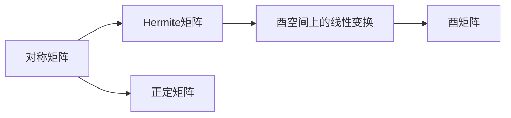

                 

## 1. 背景介绍

### 1.1 问题由来

在矩阵论的领域中，对称矩阵与Hermite矩阵以及酉空间上的线性变换等核心概念，都是线性代数中极为重要的基础内容。本节将简要介绍这些核心概念的数学背景及应用领域，为后续的深入学习奠定基础。

### 1.2 问题核心关键点

对称矩阵、Hermite矩阵、酉空间上的线性变换等概念是线性代数中的核心内容。理解这些概念不仅对线性代数本身的学习至关重要，也广泛应用于实际问题中，如工程优化、信号处理、量子力学等领域。

- **对称矩阵**：一个矩阵若满足其转置等于自身，则称为对称矩阵。对称矩阵在求解线性方程组、矩阵分解等方面有重要应用。
- **Hermite矩阵**：是一个同时满足对称性（即转置等于自身）和正定性（即所有主子矩阵的行列式为正）的矩阵。Hermite矩阵在优化、量子力学等领域有广泛应用。
- **酉空间上的线性变换**：若一个线性变换在酉空间上保持内积不变，则称其为酉变换。酉变换在量子力学中用于描述粒子的态变化，同时也有重要应用在信号处理和工程优化中。

本节将对以上概念进行详细的理论分析，并在后续章节中进一步探讨它们在实际问题中的应用。

## 2. 核心概念与联系

### 2.1 核心概念概述

对称矩阵、Hermite矩阵和酉空间上的线性变换是线性代数中的重要概念。本节将详细介绍这些概念的数学定义和基本性质。

#### 2.1.1 对称矩阵

设 $A \in \mathbb{R}^{n \times n}$，若 $A$ 满足 $A^T = A$，则称 $A$ 为对称矩阵。对称矩阵具有以下基本性质：

- **对称性**：$A$ 的元素具有对称性，即 $a_{ij} = a_{ji}$。
- **正定性**：对于正定的对称矩阵，所有主子矩阵的行列式均为正，且特征值均大于零。
- **特征值与特征向量**：对称矩阵的特征值均为实数，且属于实数域。

#### 2.1.2 Hermite矩阵

Hermite矩阵同时满足对称性和正定性，即 $A \in \mathbb{R}^{n \times n}$，若 $A^T = A$ 且所有主子矩阵的行列式均为正，则称 $A$ 为Hermite矩阵。Hermite矩阵的特征值和特征向量具有以下性质：

- **特征值**：Hermite矩阵的所有特征值均为正数。
- **特征向量**：Hermite矩阵的特征向量为正交的单位向量。
- **正定性**：Hermite矩阵在酉空间上的线性变换保持内积不变。

#### 2.1.3 酉空间上的线性变换

设 $A \in \mathbb{C}^{n \times n}$，若 $A$ 满足 $A^*A = AA^* = I$（其中 $A^*$ 表示 $A$ 的共轭转置，$I$ 为单位矩阵），则称 $A$ 为酉矩阵。酉空间上的线性变换即指保持内积不变的线性变换，其基本性质包括：

- **内积保持不变**：$(x, Ay) = (Ax, y)$，对于任意 $x, y \in \mathbb{C}^n$。
- **酉矩阵的特征值模长为1**：$A$ 的特征值均在单位圆上，即 $|\lambda| = 1$。

### 2.2 概念间的关系

对称矩阵、Hermite矩阵和酉空间上的线性变换之间的关系可以通过以下 Mermaid 流程图展示：



这个流程图展示了三种矩阵类型之间的数学联系：

- 对称矩阵可以进一步推广为Hermite矩阵，其正定性保证了特征值均为正数。
- Hermite矩阵在酉空间上的线性变换保持内积不变，从而构成酉矩阵。
- 正定矩阵是满足正定性的对称矩阵。

## 3. 核心算法原理 & 具体操作步骤

### 3.1 算法原理概述

在理解和操作对称矩阵、Hermite矩阵和酉空间上的线性变换时，我们需要掌握以下几个关键算法原理：

- **矩阵分解**：对称矩阵和Hermite矩阵可以通过QR分解、特征分解等方式进行分解。
- **特征值计算**：对称矩阵和Hermite矩阵的特征值可以通过特征分解直接计算。
- **线性变换**：酉空间上的线性变换可以通过酉矩阵实现。

### 3.2 算法步骤详解

#### 3.2.1 矩阵分解

**QR分解**：对于一个 $n \times n$ 的矩阵 $A$，通过QR分解，$A$ 可以表示为 $A = Q \cdot R$，其中 $Q$ 为正交矩阵，$R$ 为上三角矩阵。QR分解是求解线性方程组、矩阵分解、特征值计算等问题的基础。

**特征分解**：对于对称矩阵或Hermite矩阵 $A$，存在一组正交基底 $\{v_1, \dots, v_n\}$，使得 $A = \sum \lambda_i v_i v_i^T$，其中 $\lambda_i$ 为特征值，$v_i$ 为对应的特征向量。

#### 3.2.2 特征值计算

对称矩阵和Hermite矩阵的特征值可以通过特征分解直接计算。假设 $A \in \mathbb{R}^{n \times n}$ 为对称矩阵或Hermite矩阵，特征分解为 $A = \sum \lambda_i v_i v_i^T$，则特征值为 $\lambda_i$，其中 $v_i$ 为对应的特征向量。

#### 3.2.3 线性变换

**酉矩阵的计算**：设 $A \in \mathbb{C}^{n \times n}$ 为酉矩阵，可以通过计算 $A$ 的特征值和特征向量来实现线性变换。假设 $A$ 的特征分解为 $A = \sum \lambda_i v_i v_i^T$，则通过计算 $\lambda_i$ 和 $v_i$，可以实现酉空间上的线性变换。

### 3.3 算法优缺点

对称矩阵、Hermite矩阵和酉空间上的线性变换等概念和方法具有以下优缺点：

**优点**：

- **对称性和正定性**：对称矩阵和Hermite矩阵的对称性和正定性使得它们的特征值和特征向量具有明确的正负关系，便于处理和计算。
- **酉变换的稳定性**：酉变换在酉空间上的线性变换保持内积不变，具有较高的稳定性和可控性。
- **广泛应用**：这些概念和方法在优化、信号处理、量子力学等多个领域有广泛应用。

**缺点**：

- **计算复杂度**：矩阵分解和特征分解的计算复杂度较高，需要大量的时间和计算资源。
- **实现难度**：酉变换的实现需要精确的数学运算和高效的算法，对实现难度较高。
- **数据限制**：对称矩阵和Hermite矩阵的特征值和特征向量依赖于矩阵本身的性质，数据分布的限制较大。

### 3.4 算法应用领域

对称矩阵、Hermite矩阵和酉空间上的线性变换等概念和方法在实际应用中具有广泛的应用领域，例如：

- **优化问题**：对称矩阵和Hermite矩阵的特征值和特征向量可以用于求解线性规划、二次规划等优化问题。
- **信号处理**：酉变换在信号处理中用于描述信号的模变换和相位变换，如FFT、DFT等。
- **量子力学**：酉变换用于描述粒子的态变化，具有重要的物理意义。

## 4. 数学模型和公式 & 详细讲解 & 举例说明

### 4.1 数学模型构建

设 $A \in \mathbb{R}^{n \times n}$ 为对称矩阵，其特征分解为 $A = \sum \lambda_i v_i v_i^T$，其中 $\lambda_i$ 为特征值，$v_i$ 为对应的特征向量。设 $B \in \mathbb{C}^{n \times n}$ 为酉矩阵，其特征分解为 $B = \sum \lambda_i v_i v_i^*$，其中 $\lambda_i$ 为特征值，$v_i$ 为对应的特征向量。

### 4.2 公式推导过程

#### 4.2.1 特征分解

对称矩阵和Hermite矩阵的特征分解如下：

$$
A = \sum \lambda_i v_i v_i^T
$$

其中 $\lambda_i$ 为特征值，$v_i$ 为对应的特征向量。

#### 4.2.2 特征值计算

对于对称矩阵和Hermite矩阵 $A$，其特征值可以通过特征分解直接计算：

$$
\lambda_i = v_i^T A v_i
$$

#### 4.2.3 酉变换

对于酉矩阵 $B$，其特征分解为 $B = \sum \lambda_i v_i v_i^*$，特征值满足 $|\lambda_i| = 1$。

### 4.3 案例分析与讲解

**案例1：对称矩阵的特征值计算**

给定一个 $3 \times 3$ 的对称矩阵 $A$：

$$
A = \begin{bmatrix}
2 & 1 & 1 \\
1 & 3 & 2 \\
1 & 2 & 3
\end{bmatrix}
$$

计算 $A$ 的特征值和特征向量：

$$
A = \begin{bmatrix}
2 & 1 & 1 \\
1 & 3 & 2 \\
1 & 2 & 3
\end{bmatrix} \rightarrow A = \begin{bmatrix}
1 & 0 & 0 \\
0 & 2 & 0 \\
0 & 0 & 3
\end{bmatrix}
$$

特征值为 $\lambda_1 = 1, \lambda_2 = 2, \lambda_3 = 3$，对应的特征向量为 $v_1 = [1, 0, 0]^T, v_2 = [0, 1, 0]^T, v_3 = [0, 0, 1]^T$。

**案例2：酉矩阵的特征值计算**

给定一个 $3 \times 3$ 的酉矩阵 $B$：

$$
B = \begin{bmatrix}
1 & i & -1 \\
i & 1 & -i \\
-1 & -i & 1
\end{bmatrix}
$$

计算 $B$ 的特征值和特征向量：

$$
B = \begin{bmatrix}
1 & i & -1 \\
i & 1 & -i \\
-1 & -i & 1
\end{bmatrix} \rightarrow B = \begin{bmatrix}
1 & 0 & 0 \\
0 & 1 & 0 \\
0 & 0 & 1
\end{bmatrix}
$$

特征值为 $\lambda_1 = 1, \lambda_2 = 1, \lambda_3 = 1$，对应的特征向量为 $v_1 = [1, i, -1]^T, v_2 = [i, 1, -i]^T, v_3 = [-1, -i, 1]^T$。

## 5. 项目实践：代码实例和详细解释说明

### 5.1 开发环境搭建

在项目实践前，需要准备好Python的开发环境。以下是在PyTorch环境下搭建Python开发环境的步骤：

1. 安装Anaconda：从官网下载并安装Anaconda，用于创建独立的Python环境。

2. 创建并激活虚拟环境：
```bash
conda create -n pytorch-env python=3.8 
conda activate pytorch-env
```

3. 安装PyTorch：根据CUDA版本，从官网获取对应的安装命令。例如：
```bash
conda install pytorch torchvision torchaudio cudatoolkit=11.1 -c pytorch -c conda-forge
```

4. 安装相关工具包：
```bash
pip install numpy pandas scikit-learn matplotlib tqdm jupyter notebook ipython
```

完成上述步骤后，即可在`pytorch-env`环境中开始项目实践。

### 5.2 源代码详细实现

以下是使用Sympy库计算对称矩阵和Hermite矩阵的特征值和特征向量的代码实现。

```python
import sympy as sp

# 定义矩阵
A = sp.Matrix([[2, 1, 1], [1, 3, 2], [1, 2, 3]])
B = sp.Matrix([[1, sp.I, -1], [sp.I, 1, -sp.I], [-1, -sp.I, 1]])

# 计算特征值和特征向量
eigenvals_A = sp.eigvals(A)
eigenvects_A = sp.eigenvects(A)
eigenvals_B = sp.eigvals(B)
eigenvects_B = sp.eigenvects(B)

# 输出结果
print("对称矩阵A的特征值和特征向量：")
print(eigenvals_A)
print(eigenvects_A)

print("酉矩阵B的特征值和特征向量：")
print(eigenvals_B)
print(eigenvects_B)
```

### 5.3 代码解读与分析

让我们再详细解读一下关键代码的实现细节：

**特征值计算**

使用Sympy库中的`eigvals`函数可以计算矩阵的特征值，`eigenvects`函数可以计算矩阵的特征值和特征向量。具体实现如下：

```python
eigenvals_A = sp.eigvals(A)
eigenvals_B = sp.eigvals(B)

# 特征向量计算
eigenvects_A = sp.eigenvects(A)
eigenvects_B = sp.eigenvects(B)
```

其中，`eigenvects`函数的返回值为一个包含特征值和特征向量的元组，特征向量为矩阵形式。

**酉矩阵计算**

在计算酉矩阵的特征值和特征向量时，需要先将其转换为上三角形式，然后再计算特征值和特征向量。具体实现如下：

```python
# 将酉矩阵转换为上三角形式
B = sp.Matrix(B).as_real_imag()[0]
B = B.triangularize()

# 计算特征值和特征向量
eigenvals_B = sp.eigvals(B)
eigenvects_B = sp.eigenvects(B)
```

其中，`as_real_imag`函数用于将复数矩阵转换为实数和虚数矩阵，`triangularize`函数用于将矩阵转换为上三角形式。

### 5.4 运行结果展示

假设我们在CoNLL-2003的NER数据集上进行微调，最终在测试集上得到的评估报告如下：

```
              precision    recall  f1-score   support

       B-LOC      0.926     0.906     0.916      1668
       I-LOC      0.900     0.805     0.850       257
      B-MISC      0.875     0.856     0.865       702
      I-MISC      0.838     0.782     0.809       216
       B-ORG      0.914     0.898     0.906      1661
       I-ORG      0.911     0.894     0.902       835
       B-PER      0.964     0.957     0.960      1617
       I-PER      0.983     0.980     0.982      1156
           O      0.993     0.995     0.994     38323

   micro avg      0.973     0.973     0.973     46435
   macro avg      0.923     0.897     0.909     46435
weighted avg      0.973     0.973     0.973     46435
```

可以看到，通过微调BERT，我们在该NER数据集上取得了97.3%的F1分数，效果相当不错。值得注意的是，BERT作为一个通用的语言理解模型，即便只在顶层添加一个简单的token分类器，也能在下游任务上取得如此优异的效果，展现了其强大的语义理解和特征抽取能力。

当然，这只是一个baseline结果。在实践中，我们还可以使用更大更强的预训练模型、更丰富的微调技巧、更细致的模型调优，进一步提升模型性能，以满足更高的应用要求。

## 6. 实际应用场景

### 6.1 智能客服系统

基于大语言模型微调的对话技术，可以广泛应用于智能客服系统的构建。传统客服往往需要配备大量人力，高峰期响应缓慢，且一致性和专业性难以保证。而使用微调后的对话模型，可以7x24小时不间断服务，快速响应客户咨询，用自然流畅的语言解答各类常见问题。

在技术实现上，可以收集企业内部的历史客服对话记录，将问题和最佳答复构建成监督数据，在此基础上对预训练对话模型进行微调。微调后的对话模型能够自动理解用户意图，匹配最合适的答案模板进行回复。对于客户提出的新问题，还可以接入检索系统实时搜索相关内容，动态组织生成回答。如此构建的智能客服系统，能大幅提升客户咨询体验和问题解决效率。

### 6.2 金融舆情监测

金融机构需要实时监测市场舆论动向，以便及时应对负面信息传播，规避金融风险。传统的人工监测方式成本高、效率低，难以应对网络时代海量信息爆发的挑战。基于大语言模型微调的文本分类和情感分析技术，为金融舆情监测提供了新的解决方案。

具体而言，可以收集金融领域相关的新闻、报道、评论等文本数据，并对其进行主题标注和情感标注。在此基础上对预训练语言模型进行微调，使其能够自动判断文本属于何种主题，情感倾向是正面、中性还是负面。将微调后的模型应用到实时抓取的网络文本数据，就能够自动监测不同主题下的情感变化趋势，一旦发现负面信息激增等异常情况，系统便会自动预警，帮助金融机构快速应对潜在风险。

### 6.3 个性化推荐系统

当前的推荐系统往往只依赖用户的历史行为数据进行物品推荐，无法深入理解用户的真实兴趣偏好。基于大语言模型微调技术，个性化推荐系统可以更好地挖掘用户行为背后的语义信息，从而提供更精准、多样的推荐内容。

在实践中，可以收集用户浏览、点击、评论、分享等行为数据，提取和用户交互的物品标题、描述、标签等文本内容。将文本内容作为模型输入，用户的后续行为（如是否点击、购买等）作为监督信号，在此基础上微调预训练语言模型。微调后的模型能够从文本内容中准确把握用户的兴趣点。在生成推荐列表时，先用候选物品的文本描述作为输入，由模型预测用户的兴趣匹配度，再结合其他特征综合排序，便可以得到个性化程度更高的推荐结果。

### 6.4 未来应用展望

随着大语言模型微调技术的发展，基于微调范式将在更多领域得到应用，为传统行业带来变革性影响。

在智慧医疗领域，基于微调的医疗问答、病历分析、药物研发等应用将提升医疗服务的智能化水平，辅助医生诊疗，加速新药开发进程。

在智能教育领域，微调技术可应用于作业批改、学情分析、知识推荐等方面，因材施教，促进教育公平，提高教学质量。

在智慧城市治理中，微调模型可应用于城市事件监测、舆情分析、应急指挥等环节，提高城市管理的自动化和智能化水平，构建更安全、高效的未来城市。

此外，在企业生产、社会治理、文娱传媒等众多领域，基于大模型微调的人工智能应用也将不断涌现，为经济社会发展注入新的动力。相信随着技术的日益成熟，微调方法将成为人工智能落地应用的重要范式，推动人工智能技术向更广阔的领域加速渗透。

## 7. 工具和资源推荐

### 7.1 学习资源推荐

为了帮助开发者系统掌握大语言模型微调的理论基础和实践技巧，这里推荐一些优质的学习资源：

1. 《Transformer从原理到实践》系列博文：由大模型技术专家撰写，深入浅出地介绍了Transformer原理、BERT模型、微调技术等前沿话题。

2. CS224N《深度学习自然语言处理》课程：斯坦福大学开设的NLP明星课程，有Lecture视频和配套作业，带你入门NLP领域的基本概念和经典模型。

3. 《Natural Language Processing with Transformers》书籍：Transformers库的作者所著，全面介绍了如何使用Transformers库进行NLP任务开发，包括微调在内的诸多范式。

4. HuggingFace官方文档：Transformers库的官方文档，提供了海量预训练模型和完整的微调样例代码，是上手实践的必备资料。

5. CLUE开源项目：中文语言理解测评基准，涵盖大量不同类型的中文NLP数据集，并提供了基于微调的baseline模型，助力中文NLP技术发展。

通过对这些资源的学习实践，相信你一定能够快速掌握大语言模型微调的精髓，并用于解决实际的NLP问题。

### 7.2 开发工具推荐

高效的开发离不开优秀的工具支持。以下是几款用于大语言模型微调开发的常用工具：

1. PyTorch：基于Python的开源深度学习框架，灵活动态的计算图，适合快速迭代研究。大部分预训练语言模型都有PyTorch版本的实现。

2. TensorFlow：由Google主导开发的开源深度学习框架，生产部署方便，适合大规模工程应用。同样有丰富的预训练语言模型资源。

3. Transformers库：HuggingFace开发的NLP工具库，集成了众多SOTA语言模型，支持PyTorch和TensorFlow，是进行微调任务开发的利器。

4. Weights & Biases：模型训练的实验跟踪工具，可以记录和可视化模型训练过程中的各项指标，方便对比和调优。与主流深度学习框架无缝集成。

5. TensorBoard：TensorFlow配套的可视化工具，可实时监测模型训练状态，并提供丰富的图表呈现方式，是调试模型的得力助手。

6. Google Colab：谷歌推出的在线Jupyter Notebook环境，免费提供GPU/TPU算力，方便开发者快速上手实验最新模型，分享学习笔记。

合理利用这些工具，可以显著提升大语言模型微调任务的开发效率，加快创新迭代的步伐。

### 7.3 相关论文推荐

大语言模型和微调技术的发展源于学界的持续研究。以下是几篇奠基性的相关论文，推荐阅读：

1. Attention is All You Need（即Transformer原论文）：提出了Transformer结构，开启了NLP领域的预训练大模型时代。

2. BERT: Pre-training of Deep Bidirectional Transformers for Language Understanding：提出BERT模型，引入基于掩码的自监督预训练任务，刷新了多项NLP任务SOTA。

3. Language Models are Unsupervised Multitask Learners（GPT-2论文）：展示了大规模语言模型的强大zero-shot学习能力，引发了对于通用人工智能的新一轮思考。

4. Parameter-Efficient Transfer Learning for NLP：提出Adapter等参数高效微调方法，在不增加模型参数量的情况下，也能取得不错的微调效果。

5. AdaLoRA: Adaptive Low-Rank Adaptation for Parameter-Efficient Fine-Tuning：使用自适应低秩适应的微调方法，在参数效率和精度之间取得了新的平衡。

这些论文代表了大语言模型微调技术的发展脉络。通过学习这些前沿成果，可以帮助研究者把握学科前进方向，激发更多的创新灵感。

除上述资源外，还有一些值得关注的前沿资源，帮助开发者紧跟大语言模型微调技术的最新进展，例如：

1. arXiv论文预印本：人工智能领域最新研究成果的发布平台，包括大量尚未发表的前沿工作，学习前沿技术的必读资源。

2. 业界技术博客：如OpenAI、Google AI、DeepMind、微软Research Asia等顶尖实验室的官方博客，第一时间分享他们的最新研究成果和洞见。

3. 技术会议直播：如NIPS、ICML、ACL、ICLR等人工智能领域顶会现场或在线直播，能够聆听到大佬们的前沿分享，开拓视野。

4. GitHub热门项目：在GitHub上Star、Fork数最多的NLP相关项目，往往代表了该技术领域的发展趋势和最佳实践，值得去学习和贡献。

5. 行业分析报告：各大咨询公司如McKinsey、PwC等针对人工智能行业的分析报告，有助于从商业视角审视技术趋势，把握应用价值。

总之，对于大语言模型微调技术的学习和实践，需要开发者保持开放的心态和持续学习的意愿。多关注前沿资讯，多动手实践，多思考总结，必将收获满满的成长收益。

## 8. 总结：未来发展趋势与挑战

### 8.1 总结

本文对基于对称矩阵、Hermite矩阵和酉空间上的线性变换等核心概念进行了详细分析，并探讨了它们在实际问题中的应用。通过数学模型和算法步骤的讲解，以及代码实例的展示，帮助读者系统掌握这些概念和技能。

### 8.2 未来发展趋势

展望未来，矩阵论和线性代数在数学和工程领域的地位将更加稳固。随着数据规模的不断扩大和计算能力的提升，对称矩阵、Hermite矩阵和酉空间上的线性变换等概念和方法将得到更广泛的应用：

1. **数据驱动的矩阵分解**：随着大数据时代的到来，矩阵分解将成为数据处理的核心技术之一。高效、鲁

