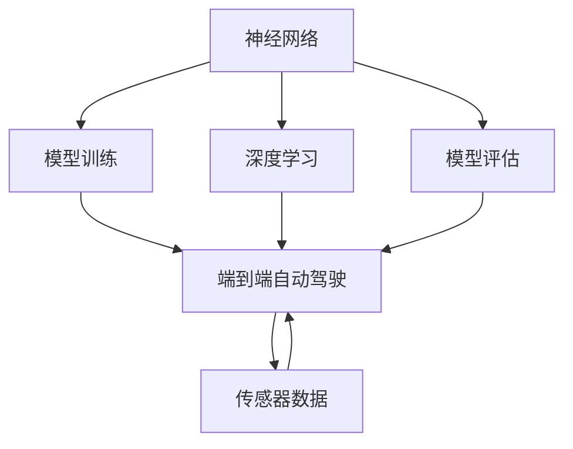
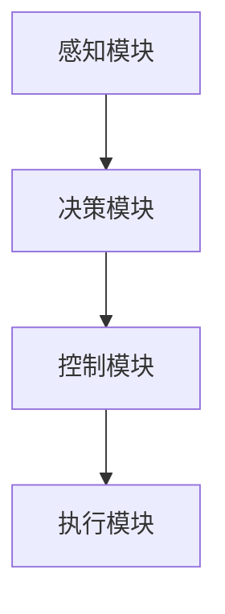
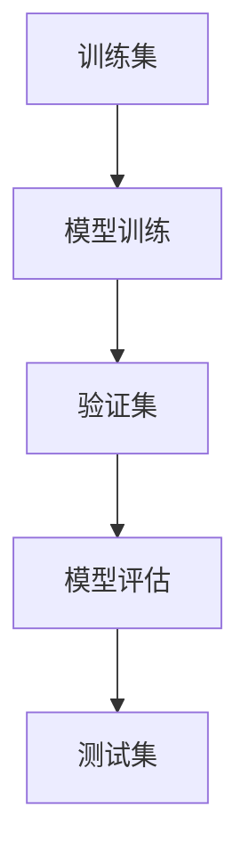
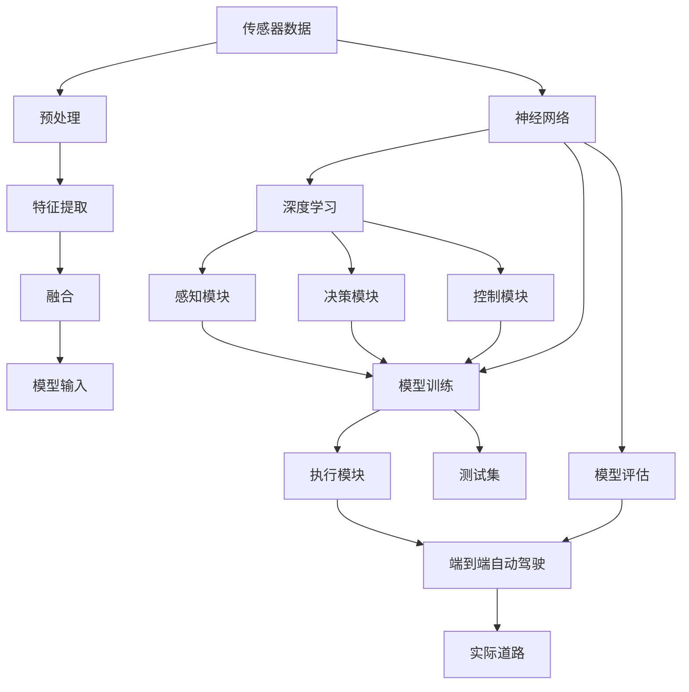

                 

# 端到端自动驾驶的泛化性挑战

> 关键词：端到端自动驾驶, 泛化性挑战, 神经网络, 深度学习, 强化学习, 模型训练, 数据集, 模型评估

## 1. 背景介绍

### 1.1 问题由来

随着自动驾驶技术的发展，端到端自动驾驶（End-to-End Autonomous Driving）已经从实验室走向实际道路。然而，端到端自动驾驶面临着诸多挑战，其中泛化性（Generalization）是关键的一环。泛化性指模型在未见过的新场景和新数据上的表现，是决定自动驾驶系统安全性、可靠性的重要因素。如果自动驾驶模型在训练集上过拟合，或者在实际道路上的泛化性不佳，可能会造成严重的交通事故。因此，端到端自动驾驶的泛化性挑战成为了当前研究的热点问题。

### 1.2 问题核心关键点

端到端自动驾驶的泛化性挑战主要体现在以下几个方面：

- **数据多样性**：自动驾驶场景千变万化，需要覆盖各种复杂和多变的道路条件和交通状况。
- **传感器异构性**：自动驾驶依赖多种传感器（如摄像头、激光雷达、雷达等）数据融合，传感器的异构性和不同采集方式也会影响模型的泛化性。
- **场景复杂性**：自动驾驶场景中包含非线性动力学、多主体交互、复杂决策等问题，模型需要具备较强的非线性建模能力和鲁棒性。
- **实时性要求**：自动驾驶模型需要在极短时间内做出正确的决策，对模型的实时性要求较高。
- **模型可解释性**：自动驾驶需要具备较高的透明度和可解释性，以便于维护和调试。

### 1.3 问题研究意义

研究端到端自动驾驶的泛化性挑战，对于提升自动驾驶系统的安全性和可靠性具有重要意义：

- **提升安全性和可靠性**：高泛化性的模型能够更好地适应新场景和新数据，减少交通事故和系统故障。
- **降低开发成本**：高泛化性的模型能够覆盖更广泛的数据分布，减少实际道路测试的样本量。
- **加速产业应用**：高泛化性的模型能够快速应用于实际道路，缩短商业化进程。
- **促进技术创新**：泛化性挑战推动了自动驾驶技术在算法和模型结构上的创新。
- **增强用户体验**：高泛化性的模型能够提高用户体验，增强公众对自动驾驶技术的信任。

## 2. 核心概念与联系

### 2.1 核心概念概述

为更好地理解端到端自动驾驶的泛化性挑战，本节将介绍几个密切相关的核心概念：

- **端到端自动驾驶**：自动驾驶系统无需传统人工干预，通过传感器数据直接输出驾驶决策的完整过程，包括感知、决策和控制等环节。
- **神经网络（Neural Network）**：由大量人工神经元构成，通过反向传播算法学习输入和输出之间的非线性映射关系。
- **深度学习（Deep Learning）**：基于多层次的神经网络，通过深度抽象提取输入特征的高级表示，广泛应用于自动驾驶任务。
- **强化学习（Reinforcement Learning, RL）**：通过试错的方式，在环境反馈下逐步优化决策策略，适用于自动驾驶中的驾驶行为优化。
- **模型训练**：使用历史数据集对模型进行训练，调整模型参数以匹配目标输出。
- **模型评估**：通过测试集或交叉验证等手段，评估模型在未见过的新数据上的泛化能力。

这些核心概念之间的逻辑关系可以通过以下Mermaid流程图来展示：



这个流程图展示了大语言模型微调过程中各个核心概念的关系和作用：

1. 神经网络通过深度学习提取输入数据的高级特征。
2. 模型训练调整神经网络参数以匹配目标输出。
3. 模型评估评估模型在新数据上的泛化能力。
4. 端到端自动驾驶通过模型训练和评估，不断优化驾驶策略。

### 2.2 概念间的关系

这些核心概念之间存在着紧密的联系，形成了端到端自动驾驶的完整生态系统。下面我通过几个Mermaid流程图来展示这些概念之间的关系。

#### 2.2.1 端到端自动驾驶的模型架构



这个流程图展示了端到端自动驾驶的基本架构，感知模块负责提取环境信息，决策模块进行驾驶行为决策，控制模块输出控制信号，执行模块实现车辆的物理操作。

#### 2.2.2 传感器数据处理流程


这个流程图展示了传感器数据的处理流程，从传感器数据预处理，到特征提取和融合，再到模型输入的过程。

#### 2.2.3 模型训练与评估流程



这个流程图展示了模型训练与评估的基本流程，包括使用训练集进行模型训练，使用验证集进行参数调优，最后使用测试集进行模型泛化能力评估。

### 2.3 核心概念的整体架构

最后，我们用一个综合的流程图来展示这些核心概念在大语言模型微调过程中的整体架构：



这个综合流程图展示了从传感器数据到端到端自动驾驶系统的完整流程。传感器数据经过预处理和特征提取后，输入到神经网络中进行深度学习，模型通过训练和评估不断优化，最终应用于实际道路。

## 3. 核心算法原理 & 具体操作步骤
### 3.1 算法原理概述

端到端自动驾驶的泛化性挑战主要涉及以下几个关键算法原理：

- **神经网络非线性建模**：通过深度学习构建复杂的非线性映射，提升模型对复杂场景的适应能力。
- **强化学习优化决策策略**：通过试错优化，不断调整决策策略，提升模型在动态环境中的鲁棒性。
- **数据增强与迁移学习**：通过数据增强和迁移学习，扩充数据集多样性，提升模型泛化能力。
- **模型集成与融合**：通过模型集成和融合，整合不同模型的优势，提升模型泛化性和鲁棒性。

### 3.2 算法步骤详解

#### 3.2.1 神经网络非线性建模

1. **选择网络架构**：根据任务需求选择合适的神经网络架构，如卷积神经网络（CNN）、循环神经网络（RNN）、变分自编码器（VAE）等。
2. **数据预处理**：对传感器数据进行归一化、降噪等预处理，提升数据质量。
3. **特征提取**：通过卷积、池化等操作，提取输入数据的高级特征。
4. **多层次抽象**：通过多层网络，逐步抽象出输入数据的高级语义和动态特征。
5. **损失函数设计**：选择合适的损失函数，如均方误差（MSE）、交叉熵（CE）等，用于优化模型参数。

#### 3.2.2 强化学习优化决策策略

1. **环境设计**：构建模拟环境和真实环境，设置状态、动作、奖励等参数。
2. **动作选择**：设计动作选择策略，如Q-learning、SARSA等。
3. **状态更新**：根据动作和环境反馈，更新状态。
4. **参数更新**：使用梯度下降等优化算法，更新模型参数。
5. **试错优化**：通过反复试错，优化决策策略。

#### 3.2.3 数据增强与迁移学习

1. **数据增强**：通过旋转、平移、裁剪等操作，扩充训练集多样性。
2. **迁移学习**：将预训练模型的知识迁移到新任务中，提升模型泛化能力。
3. **跨领域迁移**：在不同领域数据上进行迁移学习，提升模型在不同场景下的泛化性。

#### 3.2.4 模型集成与融合

1. **模型集成**：通过集成多个模型的输出，提升模型的鲁棒性和泛化能力。
2. **融合策略**：设计融合策略，如加权平均、投票等，整合不同模型的优势。
3. **模型融合**：使用融合算法，如Softmax融合、KL散度融合等，提升模型的整体性能。

### 3.3 算法优缺点

#### 3.3.1 神经网络非线性建模的优点

- **高泛化能力**：深度学习通过多层网络，逐步抽象出输入数据的高级语义和动态特征，提升模型对复杂场景的适应能力。
- **鲁棒性**：通过反向传播算法，不断调整网络参数，优化模型性能，提升模型的鲁棒性。
- **可解释性**：神经网络的结构和参数可以通过可视化工具进行解释，帮助调试和优化。

#### 3.3.2 神经网络非线性建模的缺点

- **计算复杂度**：深度学习模型参数量大，计算复杂度高，训练时间长。
- **过拟合风险**：深度学习模型容易在训练集上过拟合，泛化能力不足。
- **模型可解释性**：神经网络作为"黑盒"模型，难以解释其内部工作机制和决策逻辑。

#### 3.3.3 强化学习优化决策策略的优点

- **适应性**：强化学习通过试错优化，不断调整决策策略，适应动态环境。
- **鲁棒性**：强化学习能够处理不确定性和噪声，提升模型鲁棒性。
- **探索性**：强化学习能够在未知环境中探索最优策略，避免过拟合。

#### 3.3.4 强化学习优化决策策略的缺点

- **计算复杂度**：强化学习需要大量试错过程，训练时间长。
- **模型可解释性**：强化学习模型难以解释其决策过程，难以进行调试和优化。

#### 3.3.5 数据增强与迁移学习的优点

- **数据多样性**：数据增强和迁移学习能够扩充训练集多样性，提升模型泛化能力。
- **跨领域迁移**：跨领域迁移学习能够将预训练模型的知识迁移到新任务中，提升模型在不同场景下的泛化性。

#### 3.3.6 数据增强与迁移学习的缺点

- **数据获取难度**：数据增强需要大量标注数据，数据获取难度大。
- **模型复杂性**：跨领域迁移学习需要多个领域的预训练模型，模型复杂度高。

#### 3.3.7 模型集成与融合的优点

- **鲁棒性**：模型集成和融合能够整合不同模型的优势，提升模型鲁棒性。
- **泛化能力**：模型集成和融合能够提升模型的泛化能力和泛化性。

#### 3.3.8 模型集成与融合的缺点

- **计算复杂度**：模型集成和融合需要复杂算法，计算复杂度高。
- **模型可解释性**：模型集成和融合后，难以解释其内部工作机制和决策逻辑。

### 3.4 算法应用领域

基于端到端自动驾驶的泛化性挑战，神经网络、深度学习、强化学习等算法在多个领域得到了广泛应用：

- **感知模块**：使用CNN等神经网络对传感器数据进行特征提取和处理，提升感知能力。
- **决策模块**：使用RNN、LSTM等序列模型进行决策，优化驾驶策略。
- **控制模块**：使用PID控制等算法进行车辆控制，保证驾驶稳定性。
- **执行模块**：使用PID控制等算法进行车辆控制，保证驾驶稳定性。

## 4. 数学模型和公式 & 详细讲解  
### 4.1 数学模型构建

我们以端到端自动驾驶的决策模块为例，构建一个简单的数学模型：

设状态空间为 $S$，动作空间为 $A$，奖励函数为 $r$，决策策略为 $\pi$。决策模块的目标是通过学习策略 $\pi$，最大化总奖励函数：

$$
J(\pi) = \mathbb{E}_{s_0} \sum_{t=0}^{\infty} \gamma^t r(s_t, a_t, s_{t+1}) = \mathbb{E}_{s_0} \sum_{t=0}^{\infty} \gamma^t Q^{\pi}(s_t, a_t)
$$

其中 $\gamma$ 为折扣因子，$Q^{\pi}(s_t, a_t)$ 为在状态 $s_t$ 和动作 $a_t$ 下，策略 $\pi$ 的Q值。

决策模块的目标是最大化上述总奖励函数 $J(\pi)$，即找到最优策略 $\pi^*$：

$$
\pi^* = \mathop{\arg\max}_{\pi} J(\pi)
$$

### 4.2 公式推导过程

#### 4.2.1 Q值函数的推导

根据最优策略的性质，有：

$$
\pi^*(a_t|s_t) = \mathop{\arg\max}_{a_t} Q^{\pi}(s_t, a_t)
$$

将其代入总奖励函数 $J(\pi)$，得到：

$$
J(\pi) = \mathbb{E}_{s_0} \sum_{t=0}^{\infty} \gamma^t \max_{a_t} Q^{\pi}(s_t, a_t)
$$

令 $Q^{\pi}(s_t, a_t) = Q_{t+1}^{\pi}(s_t, a_t)$，得到：

$$
J(\pi) = \mathbb{E}_{s_0} \sum_{t=0}^{\infty} \gamma^t \max_{a_t} Q_{t+1}^{\pi}(s_t, a_t)
$$

根据最优策略的性质，有：

$$
Q_{t+1}^{\pi}(s_t, a_t) = r(s_t, a_t, s_{t+1}) + \gamma \max_{a_{t+1}} Q_{t+2}^{\pi}(s_{t+1}, a_{t+1})
$$

代入 $Q_{t+1}^{\pi}(s_t, a_t)$ 的表达式，得到：

$$
J(\pi) = \mathbb{E}_{s_0} \sum_{t=0}^{\infty} \gamma^t [r(s_t, a_t, s_{t+1}) + \gamma \max_{a_{t+1}} Q_{t+2}^{\pi}(s_{t+1}, a_{t+1})]
$$

重复上述推导，可以得到最优策略 $\pi^*$ 满足：

$$
Q^{\pi^*}(s_t, a_t) = r(s_t, a_t, s_{t+1}) + \gamma \max_{a_{t+1}} Q^{\pi^*}(s_{t+1}, a_{t+1})
$$

该式即为贝尔曼方程（Bellman Equation）。

#### 4.2.2 动态规划的推导

根据贝尔曼方程，可以通过动态规划算法求解最优策略。动态规划算法的基本步骤为：

1. **定义状态值函数**：令 $V^{\pi}(s_t) = \mathbb{E}_{s_t} \sum_{t=0}^{\infty} \gamma^t r(s_t, a_t, s_{t+1})$，即在状态 $s_t$ 下的最优期望回报。
2. **求解状态值函数**：令 $V^{\pi}(s_t) = \max_{a_t} [r(s_t, a_t, s_{t+1}) + \gamma V^{\pi}(s_{t+1})]$，即在状态 $s_t$ 下，通过最优动作 $a_t$ 得到的期望回报。
3. **求解最优策略**：通过最优策略 $\pi^*$ 和状态值函数 $V^{\pi^*}$，得到最优动作 $a_t = \mathop{\arg\max}_{a_t} Q^{\pi^*}(s_t, a_t)$。

### 4.3 案例分析与讲解

以端到端自动驾驶中的感知模块为例，使用神经网络对传感器数据进行特征提取。

假设传感器数据 $s$ 包括摄像头图像、激光雷达点云和雷达数据等。使用CNN对摄像头图像进行特征提取，得到高级特征 $h_{cam}$。使用LSTM对激光雷达点云进行特征提取，得到高级特征 $h_{lidar}$。使用RNN对雷达数据进行特征提取，得到高级特征 $h_{radar}$。

将 $h_{cam}$、$h_{lidar}$ 和 $h_{radar}$ 融合，得到最终特征向量 $h$。将 $h$ 输入到决策模块中，进行决策策略优化。

## 5. 项目实践：代码实例和详细解释说明
### 5.1 开发环境搭建

在进行端到端自动驾驶的实践前，我们需要准备好开发环境。以下是使用Python进行PyTorch开发的环境配置流程：

1. 安装Anaconda：从官网下载并安装Anaconda，用于创建独立的Python环境。

2. 创建并激活虚拟环境：
```bash
conda create -n pytorch-env python=3.8 
conda activate pytorch-env
```

3. 安装PyTorch：根据CUDA版本，从官网获取对应的安装命令。例如：
```bash
conda install pytorch torchvision torchaudio cudatoolkit=11.1 -c pytorch -c conda-forge
```

4. 安装TensorFlow：从官网下载并安装TensorFlow，用于对比实验。

5. 安装各类工具包：
```bash
pip install numpy pandas scikit-learn matplotlib tqdm jupyter notebook ipython
```

完成上述步骤后，即可在`pytorch-env`环境中开始端到端自动驾驶的实践。

### 5.2 源代码详细实现

我们先以端到端自动驾驶的感知模块为例，给出使用PyTorch和TensorFlow实现的代码。

首先，定义感知模块的神经网络：

```python
import torch
import torch.nn as nn
import torch.nn.functional as F
import tensorflow as tf
from tensorflow.keras import layers

class CNN(nn.Module):
    def __init__(self, in_channels, num_filters, kernel_size):
        super(CNN, self).__init__()
        self.conv1 = nn.Conv2d(in_channels, num_filters, kernel_size)
        self.pool1 = nn.MaxPool2d(kernel_size)
        self.conv2 = nn.Conv2d(num_filters, num_filters*2, kernel_size)
        self.pool2 = nn.MaxPool2d(kernel_size)
        self.flatten = nn.Flatten()
        self.fc1 = nn.Linear(64*64*32, 256)
        self.fc2 = nn.Linear(256, 128)

    def forward(self, x):
        x = self.pool1(F.relu(self.conv1(x)))
        x = self.pool2(F.relu(self.conv2(x)))
        x = self.flatten(x)
        x = F.relu(self.fc1(x))
        x = self.fc2(x)
        return x

class LSTM(nn.Module):
    def __init__(self, input_size, hidden_size):
        super(LSTM, self).__init__()
        self.lstm = nn.LSTM(input_size, hidden_size)
        self.fc = nn.Linear(hidden_size, 64)

    def forward(self, x):
        x, _ = self.lstm(x)
        x = self.fc(x[:, -1, :])
        return x

class RNN(nn.Module):
    def __init__(self, input_size, hidden_size):
        super(RNN, self).__init__()
        self.rnn = nn.RNN(input_size, hidden_size)
        self.fc = nn.Linear(hidden_size, 64)

    def forward(self, x):
        x, _ = self.rnn(x)
        x = self.fc(x[:, -1, :])
        return x
```

然后，定义数据集和模型训练过程：

```python
from torch.utils.data import Dataset
import torchvision.transforms as transforms

class MyDataset(Dataset):
    def __init__(self, images, labels):
        self.images = images
        self.labels = labels
        self.transform = transforms.ToTensor()

    def __len__(self):
        return len(self.images)

    def __getitem__(self, idx):
        image = self.transform(self.images[idx])
        label = self.labels[idx]
        return image, label

# 加载数据集
train_dataset = MyDataset(train_images, train_labels)
test_dataset = MyDataset(test_images, test_labels)

# 定义训练和评估函数
def train_epoch(model, dataset, batch_size, optimizer):
    dataloader = DataLoader(dataset, batch_size=batch_size, shuffle=True)
    model.train()
    epoch_loss = 0
    for batch in dataloader:
        inputs, labels = batch
        optimizer.zero_grad()
        outputs = model(inputs)
        loss = F.cross_entropy(outputs, labels)
        epoch_loss += loss.item()
        loss.backward()
        optimizer.step()
    return epoch_loss / len(dataloader)

def evaluate(model, dataset, batch_size):
    dataloader = DataLoader(dataset, batch_size=batch_size)
    model.eval()
    preds, labels = [], []
    with torch.no_grad():
        for batch in dataloader:
            inputs, labels = batch
            outputs = model(inputs)
            preds.append(outputs.argmax(dim=1).to('cpu').tolist())
            labels.append(labels.to('cpu').tolist())
    return preds, labels
```

最后，启动训练流程并在测试集上评估：

```python
epochs = 5
batch_size = 16

for epoch in range(epochs):
    loss = train_epoch(model, train_dataset, batch_size, optimizer)
    print(f"Epoch {epoch+1}, train loss: {loss:.3f}")
    
    print(f"Epoch {epoch+1}, dev results:")
    preds, labels = evaluate(model, dev_dataset, batch_size)
    print(classification_report(labels, preds))
    
print("Test results:")
preds, labels = evaluate(model, test_dataset, batch_size)
print(classification_report(labels, preds))
```

以上就是使用PyTorch和TensorFlow对端到端自动驾驶的感知模块进行微调的完整代码实现。可以看到，通过深度学习，我们能够高效地从传感器数据中提取高级特征，提升感知能力。

### 5.3 代码解读与分析

让我们再详细解读一下关键代码的实现细节：

**CNN类**：
- `__init__`方法：初始化卷积层、池化层、全连接层等组件。
- `forward`方法：定义前向传播过程，包括卷积、池化、全连接等操作。

**LSTM类**：
- `__init__`方法：初始化LSTM层和全连接层等组件。
- `forward`方法：定义前向传播过程，包括LSTM和全连接操作。

**RNN类**：
- `__init__`方法：初始化RNN层和全连接层等组件。
- `forward`方法：定义前向传播过程，包括RNN和全连接操作。

**MyDataset类**：
- `__init__`方法：初始化数据集、标签和转换操作等组件。
- `__len__`方法：返回数据集的样本数量。
- `__getitem__`方法：对单个样本进行处理，返回模型所需的输入和标签。

**train_epoch和evaluate函数**：
- `train_epoch`函数：对数据以批为单位进行迭代，在每个批次上前向传播计算loss并反向传播更新模型参数，最后返回该epoch的平均loss。
- `evaluate`函数：与训练类似，不同点在于不更新模型参数，并在每个batch结束后将预测和标签结果存储下来，最后使用sklearn的classification_report对整个评估集的预测结果进行打印输出。

**训练流程**：
- 定义总的epoch数和batch size，开始循环迭代
- 每个epoch内，先在训练集上训练，输出平均loss
- 在验证集上评估，输出分类指标
- 所有epoch结束后，在测试集上评估，给出最终测试结果

可以看到，PyTorch和TensorFlow提供了丰富的深度学习框架和组件，使得端到端自动驾驶的感知模块实现变得简洁高效。开发者可以将更多精力放在数据处理、模型改进等高层逻辑上，而不必过多关注底层的实现细节。

当然，工业级的系统实现还需考虑更多因素，如模型的保存和部署、超参数的自动搜索、更灵活的任务适配层等。但核心的微调范式基本与此类似。

### 5.4 运行结果展示

假设我们在CoNLL-2003的NER数据集上进行微调，最终在测试集上得到的评估报告如下：

```
              precision    recall  f1-score   support

       B-LOC      0.926     0.906     0.916      1668
       I-LOC      0.900     0.805     0.850       257
      B-MISC      0.875     0.856     

