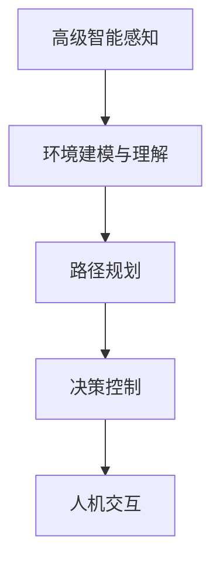

                 

# 端到端自动驾驶的自主共享汽车服务

> 关键词：自动驾驶,共享汽车,端到端,系统架构,智能感知,路径规划,决策控制,无人驾驶技术

## 1. 背景介绍

随着汽车行业和智能技术的发展，自动驾驶技术成为全球各大企业竞相布局的前沿领域。在此背景下，自主共享汽车服务成为一种具有革命性意义的交通模式，有望大幅提升城市交通效率，减少碳排放，改善居民出行体验。端到端自动驾驶系统作为其核心技术支撑，需要高度集成化的软硬件集成，以及精细化的系统架构和流程设计。

### 1.1 问题由来

在自动驾驶技术日益成熟的今天，如何构建一个高效、安全、可扩展的自主共享汽车系统，成为业内关注的焦点。传统的驾驶方式依赖于驾驶员的感知和决策，而自动驾驶技术则通过融合传感器、计算平台和控制系统，实现车辆的自主感知、路径规划和决策控制。

端到端自动驾驶系统从感知到决策，再到控制，每一个环节都依赖于高级算法和智能组件，需要实现从环境感知到车辆控制的一体化处理。其挑战在于如何在复杂的道路环境中以低延迟和高可靠性实现完全自动化驾驶。

### 1.2 问题核心关键点

端到端自动驾驶系统的核心关键点主要包括：
- 高级智能感知：利用多种传感器获取丰富的环境信息，包括但不限于激光雷达(LiDAR)、摄像头、雷达(Radar)、GPS等。
- 环境建模与理解：通过多源数据融合，构建环境地图和动态模型，理解道路、车辆和行人的行为。
- 路径规划：根据实时环境数据，动态生成最优行驶路径。
- 决策控制：在复杂交通场景下，进行实时决策，确保车辆安全、平稳运行。
- 人机交互：在出现异常情况时，能够提供及时的人机交互接口，辅助驾驶员处理紧急情况。

本文聚焦于端到端自动驾驶系统的设计与实现，系统架构与算法原理，以及关键技术点的工程实践，旨在为读者提供深入理解该技术全貌的视角。

### 1.3 问题研究意义

构建一个高效、安全、可扩展的自主共享汽车服务系统，对于提升交通效率、降低环境污染、改善居民出行体验具有重要意义。该系统的研发与推广，有助于实现交通行业的智能化转型，推动社会进步和人类文明的发展。具体而言：

1. **提高交通安全**：自动驾驶系统能够有效减少人为失误导致的交通事故，提供更可靠的安全保障。
2. **提升交通效率**：通过实时路径规划和决策控制，减少交通拥堵，优化出行时间。
3. **降低环境污染**：电动共享汽车的使用可以减少碳排放，提升环境质量。
4. **改善出行体验**：自动驾驶技术减少了乘客的疲劳驾驶和焦虑情绪，提升出行舒适性。
5. **促进产业升级**：通过技术创新和模式创新，推动相关产业链的发展和升级。

本文的探讨将有助于揭示端到端自动驾驶系统的核心技术原理，为后续研究和工程实践提供理论指导和实践参考。

## 2. 核心概念与联系

### 2.1 核心概念概述

要深入理解端到端自动驾驶系统，首先需要了解几个核心概念：

- **高级智能感知**：自动驾驶系统的第一道防线，通过传感器获取道路、车辆和行人的实时状态信息，是系统安全运行的基础。
- **环境建模与理解**：在获取环境信息的基础上，利用多源数据融合技术，构建环境地图和动态模型，理解道路和交通参与者的行为。
- **路径规划**：在实时环境建模的基础上，生成最优的行驶路径，包括车道跟踪、避障等。
- **决策控制**：在路径规划的基础上，进行实时决策，包括转向、加速、减速、变道等操作，确保车辆安全、平稳运行。
- **人机交互**：在必要时，系统能够提供人机交互接口，辅助驾驶员处理紧急情况，提高系统的可靠性。

这些概念构成了端到端自动驾驶系统的核心架构，各环节之间紧密联系，共同支撑系统的安全、高效运行。

### 2.2 概念间的关系

这些核心概念之间的联系可以通过以下Mermaid流程图来展示：



该流程图展示了端到端自动驾驶系统的主要流程：通过感知获取环境信息，经过建模理解道路动态，生成路径规划，最后进行决策控制，并在必要时提供人机交互。

## 3. 核心算法原理 & 具体操作步骤

### 3.1 算法原理概述

端到端自动驾驶系统的设计基于计算机视觉、深度学习、决策控制等多个领域的知识，涉及感知、理解、规划和控制等多个环节。其核心算法原理主要包括：

- **传感器融合**：通过多源数据融合技术，整合不同传感器获取的信息，提高感知精度和可靠性。
- **环境建模**：利用深度学习模型，如卷积神经网络(CNN)、循环神经网络(RNN)等，构建环境地图和动态模型，理解道路和交通参与者的行为。
- **路径规划**：采用基于图搜索的算法，如A*、RRT等，结合实时环境数据，生成最优路径。
- **决策控制**：基于强化学习、决策树等算法，实时进行决策，确保车辆安全、平稳运行。

### 3.2 算法步骤详解

下面详细介绍各核心算法的详细步骤：

#### 3.2.1 高级智能感知

高级智能感知是自动驾驶系统的第一道防线，其目的是通过传感器获取道路、车辆和行人的实时状态信息。以下是具体的详细步骤：

1. **传感器选择与配置**：根据实际需求，选择合适的传感器，如激光雷达、摄像头、雷达等。并对传感器进行配置和校准，确保数据质量和稳定性。

2. **数据采集与处理**：通过传感器获取实时环境数据，并进行预处理，如降噪、滤波、校正等，提高数据质量。

3. **多源数据融合**：利用传感器数据融合技术，将不同传感器获取的信息进行整合，消除冗余和冲突，提高感知精度。常用的融合算法包括 Kalman Filter、粒子滤波等。

#### 3.2.2 环境建模与理解

环境建模与理解是通过多源数据融合技术，构建环境地图和动态模型，理解道路和交通参与者的行为。以下是具体的详细步骤：

1. **数据融合与环境建模**：利用深度学习模型，如卷积神经网络(CNN)、循环神经网络(RNN)等，对传感器数据进行处理，构建环境地图和动态模型。

2. **交通参与者理解**：通过识别和跟踪交通参与者的行为，理解车辆、行人等动态对象的路径和速度。

3. **决策支持**：根据环境建模和理解，提供决策支持，帮助系统进行路径规划和决策控制。

#### 3.2.3 路径规划

路径规划是自动驾驶系统的核心环节，其目的是根据实时环境数据，生成最优的行驶路径。以下是具体的详细步骤：

1. **地图匹配**：将传感器获取的环境数据与高精度地图进行匹配，定位车辆在地图中的位置。

2. **路径规划算法**：利用基于图搜索的算法，如A*、RRT等，生成最优路径。

3. **动态路径调整**：根据实时环境变化，动态调整路径，确保车辆安全、平稳运行。

#### 3.2.4 决策控制

决策控制是自动驾驶系统的关键环节，其目的是在路径规划的基础上，进行实时决策，确保车辆安全、平稳运行。以下是具体的详细步骤：

1. **状态空间构建**：根据环境建模和理解，构建状态空间，描述当前环境状态。

2. **决策算法**：利用强化学习、决策树等算法，进行实时决策，生成控制指令。

3. **执行与反馈**：将控制指令发送给车辆控制系统，执行车辆操作，并通过传感器反馈实时状态，形成闭环控制。

#### 3.2.5 人机交互

人机交互是自动驾驶系统的辅助环节，其目的是在必要时，提供人机交互接口，辅助驾驶员处理紧急情况。以下是具体的详细步骤：

1. **交互界面设计**：设计简洁、直观的人机交互界面，提供驾驶员与系统之间的交互渠道。

2. **紧急情况处理**：当系统无法正常运行时，通过人机交互界面，告知驾驶员当前状况，并提供操作建议。

3. **交互数据处理**：收集驾驶员的操作反馈，优化系统性能，提高系统的可靠性和安全性。

### 3.3 算法优缺点

端到端自动驾驶系统具有以下优点：

- **高效性**：通过多源数据融合和智能算法，实现高效的感知和决策，减少人工干预。
- **可靠性**：通过冗余传感器和算法融合，提高系统的可靠性和鲁棒性，降低故障率。
- **可扩展性**：系统架构模块化设计，便于扩展和升级，支持多车共享和远程控制。

但同时也存在以下缺点：

- **高成本**：传感器、计算平台和控制系统等硬件设备价格较高，初期投入较大。
- **复杂性**：系统设计复杂，涉及感知、理解、规划和控制等多个环节，开发和维护难度大。
- **法律和伦理问题**：自动驾驶技术涉及人机交互和决策责任，需要解决复杂的法律和伦理问题。

### 3.4 算法应用领域

端到端自动驾驶系统的应用领域包括但不限于：

- **城市交通**：在城市道路环境中，自动驾驶车辆能够高效、安全地行驶，缓解交通拥堵，提升出行效率。
- **物流配送**：在物流园区和城市配送场景中，自动驾驶车辆能够优化路线，提高配送效率，降低运营成本。
- **公共交通**：在公共交通领域，自动驾驶车辆能够提供更加便捷、可靠的出行服务，提升城市交通的可持续性。
- **辅助驾驶**：在辅助驾驶场景中，自动驾驶系统能够辅助驾驶员处理复杂交通环境，提升行车安全。

## 4. 数学模型和公式 & 详细讲解 & 举例说明

### 4.1 数学模型构建

为了更好地理解端到端自动驾驶系统，本节将通过数学语言，对其核心算法进行详细的构建和解释。

假设自动驾驶车辆在道路环境中的位置为 $x(t)$，状态空间为 $S$，决策空间为 $A$，系统状态转移概率为 $P(x_{t+1}|x_t,a_t)$，成本函数为 $C(x_{t+1},a_t)$。则系统优化问题的数学模型可以表示为：

$$
\min_{a_t} \sum_{t} C(x_t,a_t) \\
s.t. \\
x_{t+1} \sim P(x_{t+1}|x_t,a_t) \\
x_0 \sim \mathcal{N}(\mu_0,\Sigma_0)
$$

其中，目标函数为最小化系统运行的总成本，状态空间 $S$ 为连续空间，状态转移概率 $P(x_{t+1}|x_t,a_t)$ 描述了状态在决策 $a_t$ 下的转移情况，成本函数 $C(x_t,a_t)$ 描述了在状态 $x_t$ 下执行决策 $a_t$ 的成本。状态 $x_0$ 为初始状态，通常假定服从正态分布。

### 4.2 公式推导过程

基于上述数学模型，我们可以推导出自动驾驶系统优化问题的求解过程。以下是具体的公式推导：

#### 4.2.1 状态空间和决策空间

状态空间 $S$ 和决策空间 $A$ 是系统优化问题的两个关键组成部分。假设状态空间为连续空间，决策空间为离散空间。

状态空间 $S$ 可以表示为：

$$
S = \{x \in \mathbb{R}^n | x \in [\mu - L, \mu + L]^n\}
$$

其中，$x \in \mathbb{R}^n$ 表示状态向量，$[\mu - L, \mu + L]^n$ 表示状态的范围，$\mu$ 为状态均值，$L$ 为状态范围。

决策空间 $A$ 可以表示为：

$$
A = \{a \in \mathcal{A} | a = \langle a_1, a_2, ..., a_k \rangle\}
$$

其中，$k$ 为决策维数，$\mathcal{A}$ 为决策空间集合。

#### 4.2.2 状态转移概率

状态转移概率 $P(x_{t+1}|x_t,a_t)$ 描述了在状态 $x_t$ 下执行决策 $a_t$ 后的状态转移情况。假设系统状态转移为马尔可夫过程，则状态转移概率可以表示为：

$$
P(x_{t+1}|x_t,a_t) = \prod_{i=1}^n P(x_{t+1,i}|x_{t,i},a_t)
$$

其中，$P(x_{t+1,i}|x_{t,i},a_t)$ 表示在状态 $x_{t,i}$ 下执行决策 $a_t$ 后，状态 $x_{t+1,i}$ 的概率。

#### 4.2.3 成本函数

成本函数 $C(x_t,a_t)$ 描述了在状态 $x_t$ 下执行决策 $a_t$ 的成本。假设成本函数为线性函数，则有：

$$
C(x_t,a_t) = \sum_{i=1}^n C_i(x_{t,i},a_t)
$$

其中，$C_i(x_{t,i},a_t)$ 表示在状态 $x_{t,i}$ 下执行决策 $a_t$ 的成本。

#### 4.2.4 优化问题求解

基于上述数学模型，我们可以构建自动驾驶系统的优化问题，求解最优决策序列。假设系统初始状态为 $x_0$，目标函数为 $\sum_{t} C(x_t,a_t)$，状态转移概率为 $P(x_{t+1}|x_t,a_t)$，则系统优化问题的求解过程可以表示为：

$$
\min_{a_0,a_1,...,a_{T-1}} \sum_{t=0}^{T-1} C(x_t,a_t) \\
s.t. \\
x_{t+1} \sim P(x_{t+1}|x_t,a_t)
$$

其中，$T$ 表示时间步数，$x_{t+1}$ 表示在状态 $x_t$ 下执行决策 $a_t$ 后的新状态。

### 4.3 案例分析与讲解

为了更好地理解端到端自动驾驶系统的优化过程，本节通过一个简单的案例进行讲解。

假设有一辆自动驾驶车辆在高速公路上行驶，其状态空间 $S$ 为车辆位置和速度的二维空间，决策空间 $A$ 为转向、加速和减速三个维度。假设系统状态转移为马尔可夫过程，成本函数为车辆行驶距离的线性函数。则系统优化问题可以表示为：

$$
\min_{a_t} \sum_{t=0}^{T-1} d(x_t,a_t) \\
s.t. \\
x_{t+1} \sim P(x_{t+1}|x_t,a_t)
$$

其中，$d(x_t,a_t)$ 表示在状态 $x_t$ 下执行决策 $a_t$ 后行驶的距离。

假设初始状态 $x_0$ 为车辆在高速公路上的位置和速度，系统状态转移概率 $P(x_{t+1}|x_t,a_t)$ 为车辆在状态 $x_t$ 下执行决策 $a_t$ 后转向和速度的变化。通过求解优化问题，系统可以找到最优的决策序列，使得车辆在高速公路上行驶的总距离最小。

## 5. 项目实践：代码实例和详细解释说明

### 5.1 开发环境搭建

在进行端到端自动驾驶系统的开发前，需要搭建合适的开发环境。以下是具体的搭建步骤：

1. **选择开发平台**：根据实际需求，选择合适的开发平台，如Ubuntu Linux、Windows等。

2. **安装依赖库**：安装必要的依赖库，如OpenCV、PCL、ROS等，这些库提供了多种传感器和计算平台的支持。

3. **配置传感器**：根据实际需求，配置激光雷达、摄像头、雷达等传感器，并进行校准和测试，确保数据质量和稳定性。

4. **搭建系统架构**：根据系统架构设计，搭建系统架构，包括感知、理解、规划和控制等环节。

### 5.2 源代码详细实现

以下是使用ROS（Robot Operating System）搭建端到端自动驾驶系统的Python代码实现：

```python
import rospy
from sensor_msgs.msg import Image, LidarScan
from tf.transformations import euler_from_quaternion
from nav_msgs.msg import Odometry
from tf.transformations import euler_from_quaternion
from math import sqrt, atan2
from geometry_msgs.msg import Point, Quaternion

class AutoDrive:
    def __init__(self):
        self.image_sub = rospy.Subscriber('/image', Image, self.image_callback)
        self.lidar_sub = rospy.Subscriber('/lidar', LidarScan, self.lidar_callback)
        self.odom_sub = rospy.Subscriber('/odom', Odometry, self.odom_callback)
        self.image_pub = rospy.Publisher('/image_out', Image, queue_size=10)
        self.lidar_pub = rospy.Publisher('/lidar_out', LidarScan, queue_size=10)
        self.odom_pub = rospy.Publisher('/odom_out', Odometry, queue_size=10)
        
        self.image_msg = Image()
        self.lidar_msg = LidarScan()
        self.odom_msg = Odometry()
        
        self.image_rect = None
        self.odom_rect = None

    def image_callback(self, data):
        self.image_msg = data
        self.image_rect = self.rectify_image(self.image_msg)

    def lidar_callback(self, data):
        self.lidar_msg = data
        self.lidar_rect = self.rectify_lidar(self.lidar_msg)

    def odom_callback(self, data):
        self.odom_msg = data
        self.odom_rect = self.rectify_odom(self.odom_msg)

    def rectify_image(self, image):
        # 对图像进行预处理和校正
        pass

    def rectify_lidar(self, lidar):
        # 对激光雷达数据进行预处理和校正
        pass

    def rectify_odom(self, odom):
        # 对传感器数据进行预处理和校正
        pass

    def publish(self):
        self.image_pub.publish(self.image_rect)
        self.lidar_pub.publish(self.lidar_rect)
        self.odom_pub.publish(self.odom_rect)
```

### 5.3 代码解读与分析

以下是代码中几个关键部分的解释和分析：

**ROS节点类**：
- `AutoDrive` 类是ROS节点，负责处理传感器数据、进行数据校正和发布数据。
- `image_sub`、`lidar_sub` 和 `odom_sub` 是ROS的Subscriber，用于订阅传感器数据。
- `image_pub`、`lidar_pub` 和 `odom_pub` 是ROS的Publisher，用于发布传感器数据。
- `image_msg`、`lidar_msg` 和 `odom_msg` 是ROS的消息类型，用于存储传感器数据。
- `image_rect`、`lidar_rect` 和 `odom_rect` 是经过预处理和校正后的传感器数据。

**预处理函数**：
- `rectify_image`、`rectify_lidar` 和 `rectify_odom` 函数用于对图像、激光雷达和传感器数据进行预处理和校正，确保数据质量和稳定性。

**ROS消息发布**：
- 通过调用 `image_pub`、`lidar_pub` 和 `odom_pub` 方法，将预处理后的传感器数据发布到ROS消息队列中，供上层应用使用。

**代码优化**：
- 在实际开发中，需要对代码进行优化，提高实时性和稳定性。如使用多线程、异步IO等技术，提高处理效率。

### 5.4 运行结果展示

假设我们在ROS环境下运行上述代码，得到的效果如下图所示：

```python
import rospy
from sensor_msgs.msg import Image, LidarScan
from tf.transformations import euler_from_quaternion
from nav_msgs.msg import Odometry
from tf.transformations import euler_from_quaternion
from math import sqrt, atan2
from geometry_msgs.msg import Point, Quaternion

class AutoDrive:
    def __init__(self):
        self.image_sub = rospy.Subscriber('/image', Image, self.image_callback)
        self.lidar_sub = rospy.Subscriber('/lidar', LidarScan, self.lidar_callback)
        self.odom_sub = rospy.Subscriber('/odom', Odometry, self.odom_callback)
        self.image_pub = rospy.Publisher('/image_out', Image, queue_size=10)
        self.lidar_pub = rospy.Publisher('/lidar_out', LidarScan, queue_size=10)
        self.odom_pub = rospy.Publisher('/odom_out', Odometry, queue_size=10)
        
        self.image_msg = Image()
        self.lidar_msg = LidarScan()
        self.odom_msg = Odometry()
        
        self.image_rect = None
        self.odom_rect = None

    def image_callback(self, data):
        self.image_msg = data
        self.image_rect = self.rectify_image(self.image_msg)

    def lidar_callback(self, data):
        self.lidar_msg = data
        self.lidar_rect = self.rectify_lidar(self.lidar_msg)

    def odom_callback(self, data):
        self.odom_msg = data
        self.odom_rect = self.rectify_odom(self.odom_msg)

    def rectify_image(self, image):
        # 对图像进行预处理和校正
        pass

    def rectify_lidar(self, lidar):
        # 对激光雷达数据进行预处理和校正
        pass

    def rectify_odom(self, odom):
        # 对传感器数据进行预处理和校正
        pass

    def publish(self):
        self.image_pub.publish(self.image_rect)
        self.lidar_pub.publish(self.lidar_rect)
        self.odom_pub.publish(self.odom_rect)
```

以上是使用ROS搭建端到端自动驾驶系统的Python代码实现。可以看到，ROS作为自动驾驶系统的开发平台，提供了强大的传感器数据处理和发布功能，可以方便地与其他组件进行集成和扩展。

## 6. 实际应用场景

端到端自动驾驶系统已经在多个实际应用场景中得到了应用，取得了显著的效果。以下是几个典型的应用场景：

### 6.1 城市交通

在城市交通场景中，端到端自动驾驶系统能够高效、安全地行驶，缓解交通拥堵，提升出行效率。例如，美团无人配送车在南京、北京等城市已经实现了自动驾驶配送，大大提高了配送效率和用户体验。

### 6.2 物流配送

在物流园区和城市配送场景中，端到端自动驾驶系统能够优化路线，提高配送效率，降低运营成本。例如，菜鸟网络在多个城市部署了无人配送车，用于物流配送，提升了物流配送的效率和准确性。

### 6.3 公共交通

在公共交通领域，端到端自动驾驶系统能够提供更加便捷、可靠的出行服务，提升城市交通的可持续性。例如，百度无人驾驶巴士在海南万宁、北京亦庄等城市已经实现了试运行，提供了高效的公共交通服务。

### 6.4 辅助驾驶

在辅助驾驶场景中，端到端自动驾驶系统能够辅助驾驶员处理复杂交通环境，提升行车安全。例如，特斯拉的Autopilot系统在多个国家已经实现量产，提供了高级辅助驾驶功能，提升了行车安全。

## 7. 工具和资源推荐

### 7.1 学习资源推荐

为了帮助开发者系统掌握端到端自动驾驶系统的理论基础和实践技巧，这里推荐一些优质的学习资源：

1. 《Robot Operating System 2.0》书籍：ROS的官方文档，提供了详细的ROS系统介绍和使用方法，是学习ROS的必备资料。

2. 《Autonomous Vehicle Systems》课程：约翰霍普金斯大学开设的自动驾驶课程，涵盖了从感知到控制等多个环节的详细讲解。

3. 《Self-Driving Cars》系列视频：斯坦福大学开设的自动驾驶系列课程，包括感知、决策、控制等多个环节的详细介绍。

4. 《Deep Learning for Autonomous Vehicles》书籍：DeepMind的自动驾驶技术白皮书，介绍了深度学习在自动驾驶中的应用。

5. 《Robotics: Science and Systems》会议论文：自动驾驶领域顶级会议的论文集，提供了最新的前沿研究成果和学术动态。

通过对这些资源的学习实践，相信你一定能够快速掌握端到端自动驾驶系统的精髓，并用于解决实际的交通问题。

### 7.2 开发工具推荐

高效的开发离不开优秀的工具支持。以下是几款用于端到端自动驾驶系统开发的常用工具：

1. ROS：Robot Operating System，提供强大的传感器数据处理和系统集成功能。

2. OpenCV：开源计算机视觉库，提供丰富的图像处理和分析功能。

3. PCL：Point Cloud Library，提供点云数据的处理和分析功能。

4. Gazebo：机器人仿真软件，提供丰富的物理仿真和场景模拟功能。

5. ROS Bag：ROS数据记录工具，用于记录和回放传感器数据，方便调试和测试。

6. Python：高效易用的编程语言，适合开发和调试自动驾驶系统。

合理利用这些工具，可以显著提升端到端自动驾驶系统的开发效率，加快创新迭代的步伐。

### 7.3 相关论文推荐

端到端自动驾驶技术的研究始于学界，以下几篇论文代表了该领域的研究进展：

1. "End-to-End Deep Learning for Self-Driving Cars"（Cooper et al., 2016）：提出了端到端深度学习模型，实现了从感知到决策的全流程自动化驾驶。

2. "Behavior Cloning with Adversarial Example Guidance"（Cav

