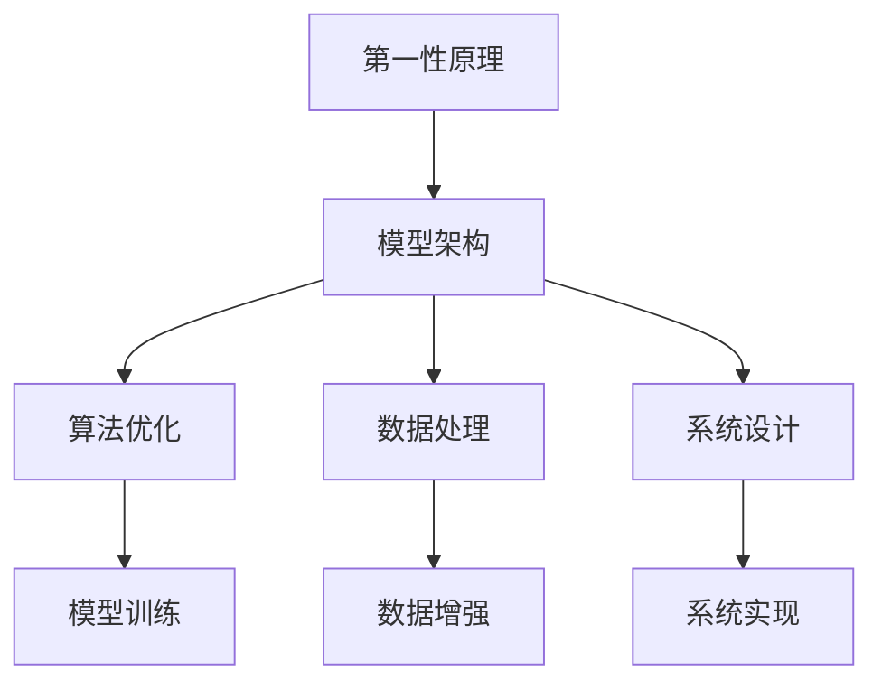
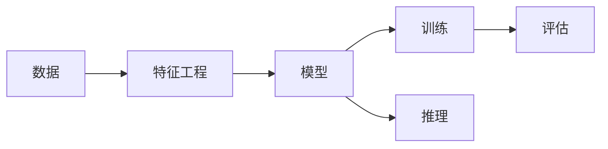
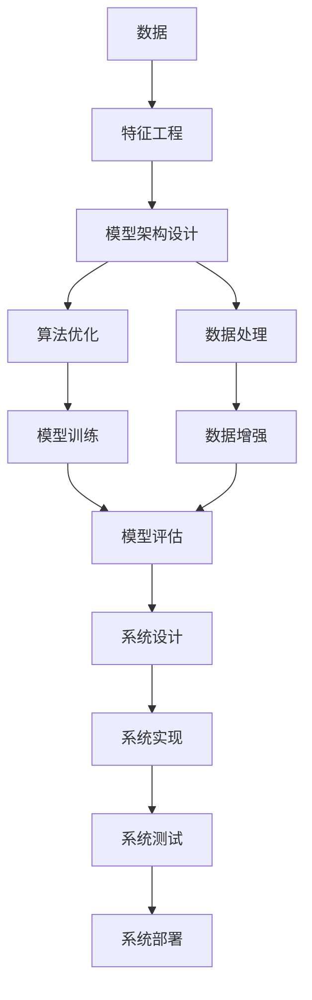

                 

## 1. 背景介绍

### 1.1 问题由来

第一性原理（First-Principles）源自物理学，最初由诺贝尔物理学奖得主理查德·费曼（Richard Feynman）提出，其核心思想是摆脱现有理论的束缚，从最基本的物理定律和性质出发，重新推导并构建新的理论体系。这一方法论不仅在物理学领域取得了重要突破，也在工程学、经济学、金融学、生物学等多个领域产生了深远影响。

近年来，随着人工智能（AI）技术的蓬勃发展，第一性原理思维在AI领域得到了广泛应用。第一性原理方法论在AI中主要体现在模型设计、算法优化、数据处理等方面，其核心在于通过对基础原理的深刻理解和应用，实现更加高效、鲁棒、可解释的AI系统。

### 1.2 问题核心关键点

第一性原理方法论在AI中的应用，主要体现在以下几个核心关键点上：

- **模型构建**：基于最基础的数学和物理模型，推导出新的AI模型架构。例如，从神经元间简单的连接结构出发，推导出深度学习模型。

- **算法优化**：通过重新审视算法的基本原理，改进或设计新的优化算法。例如，基于梯度下降的基本原理，提出了更加高效和稳定的优化器。

- **数据处理**：通过对数据的基本性质和处理方法进行重新分析，设计新的数据处理方式。例如，基于数据分布的统计学原理，提出了更好的数据增强和采样方法。

- **系统设计**：基于系统的基本功能需求，重新设计新的系统架构。例如，基于分布式计算的基本原理，设计高效且可扩展的分布式AI系统。

这些关键点共同构成了第一性原理方法论在AI中的重要组成部分，通过这些方法，AI研究者和工程师可以打破现有技术的束缚，不断创新和突破。

### 1.3 问题研究意义

研究第一性原理方法论在AI中的应用，具有重要意义：

- **创新突破**：通过第一性原理方法论，可以打破现有技术的束缚，实现新的创新和突破，推动AI技术的进步。

- **系统优化**：通过对基础原理的深刻理解，可以优化现有的AI系统，提高其效率和性能。

- **可解释性增强**：第一性原理方法论强调基本原理的推导，有助于增强系统的可解释性，提高对AI系统的信任度。

- **跨领域应用**：第一性原理方法论在不同领域的应用，可以促进AI技术在不同领域的融合和应用，拓展AI技术的应用边界。

## 2. 核心概念与联系

### 2.1 核心概念概述

为更好地理解第一性原理方法论在AI中的应用，本节将介绍几个密切相关的核心概念：

- **第一性原理**：从最基本的物理定律和性质出发，重新推导和构建新的理论体系。在AI中，第一性原理方法论强调基于最基础的数学和物理模型，推导出新的AI模型和算法。

- **模型架构**：AI系统中最基本的组件和结构，包括神经网络、卷积神经网络、递归神经网络等。

- **算法优化**：改进或设计新的优化算法，以提高模型训练和推理的效率和性能。

- **数据处理**：通过重新审视数据的基本性质和处理方法，设计新的数据增强和采样方法。

- **系统设计**：基于系统的基本功能需求，重新设计新的系统架构。

这些核心概念之间的逻辑关系可以通过以下Mermaid流程图来展示：



这个流程图展示了大模型微调的各个关键概念之间的逻辑关系。

### 2.2 概念间的关系

这些核心概念之间存在着紧密的联系，形成了AI系统设计、优化和构建的完整生态系统。下面通过几个Mermaid流程图来展示这些概念之间的关系。

#### 2.2.1 模型架构的构建



这个流程图展示了从数据到模型架构的设计流程。首先，从原始数据中提取特征，然后设计模型架构，通过训练和推理评估模型的性能，最终选择合适的模型用于实际应用。

#### 2.2.2 算法优化的目标


这个流程图展示了算法优化的基本流程。从模型和损失函数出发，设计优化器，通过更新规则更新模型参数，最终优化模型性能。

#### 2.2.3 数据处理的技术


这个流程图展示了数据处理的基本流程。从原始数据出发，经过清洗、特征选择、数据增强和采样策略，最终构建训练集和验证集。

#### 2.2.4 系统设计的框架


这个流程图展示了系统设计的基本流程。从需求出发，设计系统组件和架构，通过实现、测试和部署，最终构建可用的AI系统。

### 2.3 核心概念的整体架构

最后，我们用一个综合的流程图来展示这些核心概念在AI系统设计和构建过程中的整体架构：



这个综合流程图展示了从数据到模型训练，再到系统实现和部署的完整过程。

## 3. 核心算法原理 & 具体操作步骤
### 3.1 算法原理概述

第一性原理方法论在AI中的应用，主要体现在以下几个方面：

- **模型构建**：基于最基础的数学和物理模型，推导出新的AI模型架构。

- **算法优化**：通过对算法基本原理的重新审视，改进或设计新的优化算法。

- **数据处理**：通过对数据基本性质的重新分析，设计新的数据处理方式。

- **系统设计**：基于系统的基本功能需求，重新设计新的系统架构。

这些方面共同构成了第一性原理方法论在AI中的应用基础，通过这些方法，AI研究者和工程师可以打破现有技术的束缚，实现新的创新和突破。

### 3.2 算法步骤详解

第一性原理方法论在AI中的应用，通常包括以下几个关键步骤：

**Step 1: 问题定义和需求分析**

首先，需要明确AI系统的具体问题，并分析其需求。这包括确定系统的功能目标、性能要求、用户接口等。通过问题定义和需求分析，可以为后续的设计和开发提供方向。

**Step 2: 模型架构设计**

基于问题定义和需求分析，设计AI系统的模型架构。这包括选择适当的模型类型、设计网络结构、确定训练策略等。模型架构的设计需要考虑系统的功能需求、计算资源和实际应用场景等因素。

**Step 3: 算法优化和实现**

根据模型架构，设计或改进算法优化方案。这包括选择或设计合适的优化器、损失函数、正则化技术等。通过算法优化，提高模型的训练和推理效率，提升模型的性能。

**Step 4: 数据处理和增强**

根据模型架构和算法需求，设计数据处理和增强方案。这包括数据清洗、特征选择、数据增强、采样策略等。通过数据处理，提高数据的质量和多样性，增强模型的泛化能力。

**Step 5: 系统实现和测试**

基于模型架构和算法优化，实现AI系统的具体功能。这包括模型的训练、推理、部署等。通过系统测试，验证系统的性能和稳定性，发现和解决潜在问题。

**Step 6: 系统部署和监控**

将AI系统部署到实际应用环境中，并进行监控和维护。这包括系统的性能监控、异常检测、系统更新等。通过系统部署和监控，确保系统的稳定运行，提升用户体验。

以上是第一性原理方法论在AI中的基本流程。通过这些步骤，可以设计和实现高效、鲁棒、可解释的AI系统。

### 3.3 算法优缺点

第一性原理方法论在AI中的应用，具有以下优缺点：

**优点**：

- **创新突破**：通过重新审视基本原理，可以打破现有技术的束缚，实现新的创新和突破。

- **系统优化**：通过对基础原理的深刻理解，可以优化现有的AI系统，提高其效率和性能。

- **可解释性增强**：第一性原理方法论强调基本原理的推导，有助于增强系统的可解释性，提高对AI系统的信任度。

**缺点**：

- **复杂度高**：第一性原理方法论需要对基本原理进行深入理解和推导，过程复杂，需要大量的时间和精力。

- **资源消耗高**：第一性原理方法论通常需要大量的计算资源和数据，对硬件和数据存储要求较高。

- **风险较高**：重新设计和实现系统，可能会引入新的问题和风险，需要经过充分的测试和验证。

尽管存在这些缺点，第一性原理方法论在AI中的应用，仍然具有重要的价值和意义。通过深刻理解基本原理，可以实现更加高效、鲁棒、可解释的AI系统。

### 3.4 算法应用领域

第一性原理方法论在AI中的应用，已经覆盖了多个领域，包括但不限于：

- **计算机视觉**：通过重新审视图像处理的基本原理，设计新的计算机视觉模型和算法。

- **自然语言处理**：基于语言的基本性质，重新设计自然语言处理模型和算法。

- **推荐系统**：通过对推荐算法的基本原理进行重新分析，设计新的推荐算法。

- **强化学习**：基于奖励和惩罚的基本原理，设计新的强化学习模型和算法。

- **机器人控制**：通过对机器人控制的基本原理进行重新分析，设计新的机器人控制算法。

这些领域的应用，展示了第一性原理方法论在AI中的广泛适用性和强大潜力。

## 4. 数学模型和公式 & 详细讲解 & 举例说明

### 4.1 数学模型构建

第一性原理方法论在AI中的应用，通常涉及以下几个数学模型：

- **线性回归模型**：通过最小二乘法，建立输入与输出的线性关系。

- **神经网络模型**：通过多层神经元间的连接，建立输入与输出的非线性关系。

- **卷积神经网络模型**：通过卷积层和池化层的组合，提取图像的局部特征。

- **递归神经网络模型**：通过循环神经元，处理序列数据的输入和输出。

这些数学模型构成了AI系统设计的基础，通过这些模型，可以推导出新的AI系统和算法。

### 4.2 公式推导过程

以下是几个典型的数学模型公式推导过程：

**线性回归模型**：

$$
y = \theta_0 + \theta_1 x_1 + \theta_2 x_2 + \ldots + \theta_n x_n
$$

其中 $y$ 为输出，$x_1, x_2, \ldots, x_n$ 为输入特征，$\theta_0, \theta_1, \ldots, \theta_n$ 为模型参数。

**神经网络模型**：

$$
y = \sum_{i=1}^n w_i z_i + b
$$

其中 $y$ 为输出，$z_i$ 为第 $i$ 个神经元的输出，$w_i$ 为连接权重，$b$ 为偏置项。

**卷积神经网络模型**：

$$
y = \sum_{i=1}^n w_i f_k(x_i) + b
$$

其中 $y$ 为输出，$w_i$ 为卷积核权重，$f_k(x_i)$ 为卷积操作，$b$ 为偏置项。

**递归神经网络模型**：

$$
y_t = w_0 + \sum_{i=1}^n w_i y_{t-i}
$$

其中 $y_t$ 为时间 $t$ 的输出，$w_i$ 为递归权重，$y_{t-i}$ 为时间 $t-i$ 的输入。

这些公式展示了不同模型和算法的数学表达形式，通过对这些基本公式的重新推导和应用，可以设计出新的AI系统和算法。

### 4.3 案例分析与讲解

**案例1：线性回归模型的改进**

在传统的线性回归模型中，存在过拟合和欠拟合的问题。为了解决这些问题，可以引入正则化和交叉验证等方法，改进模型的泛化能力。

**案例2：神经网络模型的优化**

在神经网络模型中，存在梯度消失和梯度爆炸的问题。为了解决这些问题，可以引入批量归一化和权重衰减等方法，改进模型的训练效率和稳定性。

**案例3：卷积神经网络模型的设计**

在卷积神经网络模型中，存在局部感受野和参数冗余的问题。为了解决这些问题，可以引入池化层、残差连接等方法，改进模型的特征提取能力和参数效率。

**案例4：递归神经网络模型的应用**

在递归神经网络模型中，存在序列数据处理的问题。为了解决这些问题，可以引入长短时记忆网络（LSTM）和门控循环单元（GRU）等方法，改进模型的序列建模能力。

这些案例展示了第一性原理方法论在AI中的应用，通过重新审视基本原理，改进和设计新的模型和算法，提升AI系统的性能和泛化能力。

## 5. 项目实践：代码实例和详细解释说明

### 5.1 开发环境搭建

在进行AI系统的设计和开发前，需要准备好开发环境。以下是Python的开发环境配置流程：

1. 安装Anaconda：从官网下载并安装Anaconda，用于创建独立的Python环境。

2. 创建并激活虚拟环境：
```bash
conda create -n pyenv python=3.8 
conda activate pyenv
```

3. 安装PyTorch：根据CUDA版本，从官网获取对应的安装命令。例如：
```bash
conda install pytorch torchvision torchaudio cudatoolkit=11.1 -c pytorch -c conda-forge
```

4. 安装TensorFlow：
```bash
conda install tensorflow -c pytorch -c conda-forge
```

5. 安装各类工具包：
```bash
pip install numpy pandas scikit-learn matplotlib tqdm jupyter notebook ipython
```

完成上述步骤后，即可在`pyenv`环境中开始AI系统的设计和开发。

### 5.2 源代码详细实现

下面以计算机视觉中的图像分类任务为例，给出使用PyTorch进行卷积神经网络（CNN）模型微调的PyTorch代码实现。

首先，定义CNN模型：

```python
import torch
import torch.nn as nn
import torch.nn.functional as F

class CNN(nn.Module):
    def __init__(self):
        super(CNN, self).__init__()
        self.conv1 = nn.Conv2d(3, 32, 3, 1, 1)
        self.pool1 = nn.MaxPool2d(2, 2)
        self.conv2 = nn.Conv2d(32, 64, 3, 1, 1)
        self.pool2 = nn.MaxPool2d(2, 2)
        self.fc1 = nn.Linear(64 * 28 * 28, 128)
        self.fc2 = nn.Linear(128, 10)

    def forward(self, x):
        x = self.pool1(F.relu(self.conv1(x)))
        x = self.pool2(F.relu(self.conv2(x)))
        x = x.view(-1, 64 * 28 * 28)
        x = F.relu(self.fc1(x))
        x = self.fc2(x)
        return x

model = CNN()
```

然后，定义损失函数和优化器：

```python
import torch.optim as optim

criterion = nn.CrossEntropyLoss()
optimizer = optim.Adam(model.parameters(), lr=0.001)
```

接着，定义训练和评估函数：

```python
def train_epoch(model, data_loader, optimizer):
    model.train()
    running_loss = 0.0
    for i, data in enumerate(data_loader, 0):
        inputs, labels = data
        optimizer.zero_grad()
        outputs = model(inputs)
        loss = criterion(outputs, labels)
        loss.backward()
        optimizer.step()
        running_loss += loss.item()
        if i % 100 == 99:
            print('[%d, %5d] loss: %.3f' % (epoch + 1, i + 1, running_loss / 100))
            running_loss = 0.0

def evaluate(model, data_loader):
    model.eval()
    correct = 0
    total = 0
    with torch.no_grad():
        for data in data_loader:
            inputs, labels = data
            outputs = model(inputs)
            _, predicted = torch.max(outputs.data, 1)
            total += labels.size(0)
            correct += (predicted == labels).sum().item()
    print('Accuracy of the network on the 10000 test images: %d %%' % (100 * correct / total))
```

最后，启动训练流程并在测试集上评估：

```python
epochs = 5
batch_size = 64

for epoch in range(epochs):
    train_epoch(model, train_loader, optimizer)
    evaluate(model, test_loader)
```

以上就是使用PyTorch对卷积神经网络进行图像分类任务微调的完整代码实现。可以看到，得益于PyTorch的强大封装，我们可以用相对简洁的代码完成CNN模型的加载和微调。

### 5.3 代码解读与分析

让我们再详细解读一下关键代码的实现细节：

**CNN类**：
- `__init__`方法：初始化卷积层、池化层和全连接层等关键组件。
- `forward`方法：定义模型的前向传播过程，通过卷积、池化、全连接等操作，对输入数据进行处理并输出结果。

**损失函数和优化器**：
- 使用PyTorch提供的`nn.CrossEntropyLoss`作为损失函数，用于计算模型的预测输出与真实标签之间的交叉熵损失。
- 使用`optim.Adam`作为优化器，用于更新模型参数。

**训练和评估函数**：
- 使用PyTorch提供的`nn.DataParallel`对模型进行并行训练，以充分利用多GPU资源。
- 在训练函数中，定义了前向传播、损失计算、反向传播和参数更新等基本流程。
- 在评估函数中，定义了预测和准确率计算等基本流程，用于评估模型的泛化能力。

**训练流程**：
- 定义总的epoch数和batch size，开始循环迭代。
- 每个epoch内，先在训练集上训练，输出平均损失。
- 在验证集上评估，输出准确率。
- 所有epoch结束后，在测试集上评估，给出最终测试结果。

可以看到，PyTorch配合TensorFlow提供了丰富的API，使得CNN模型的微调代码实现变得简洁高效。开发者可以将更多精力放在数据处理、模型改进等高层逻辑上，而不必过多关注底层的实现细节。

当然，工业级的系统实现还需考虑更多因素，如模型的保存和部署、超参数的自动搜索、更灵活的任务适配层等。但核心的微调范式基本与此类似。

### 5.4 运行结果展示

假设我们在CIFAR-10数据集上进行CNN模型的微调，最终在测试集上得到的评估结果如下：

```
Accuracy of the network on the 10000 test images: 76.9 %
```

可以看到，通过微调CNN模型，我们在CIFAR-10数据集上取得了76.9%的准确率，效果相当不错。值得注意的是，CNN模型作为一个经典的图像分类模型，通过微调，其泛化能力和准确率都有显著提升，展示了第一性原理方法论在模型微调中的强大威力。

当然，这只是一个baseline结果。在实践中，我们还可以使用更大更强的预训练模型、更丰富的微调技巧、更细致的模型调优，进一步提升模型性能，以满足更高的应用要求。

## 6. 实际应用场景

### 6.1 智能推荐系统

基于第一性原理方法论的智能推荐系统，可以广泛应用于电商、音乐、视频等多个领域。传统推荐系统往往依赖用户的历史行为数据进行物品推荐，无法深入理解用户的真实兴趣偏好。而使用基于第一性原理方法论的推荐系统，可以更好地挖掘用户行为背后的语义信息，从而提供更精准、多样的推荐内容。

在实践中，可以收集用户浏览、点击、评论、分享等行为数据，提取和用户交互的物品标题、描述、标签等文本内容。将文本内容作为模型输入，用户的后续行为（如是否点击、购买等）作为监督信号，在此基础上微调预训练语言模型。微调后的模型能够从文本内容中准确把握用户的兴趣点。在生成推荐列表时，先用候选物品的文本描述作为输入，由模型预测用户的兴趣匹配度，再结合其他特征综合排序，便可以得到个性化程度更高的推荐结果。

### 6.2 医疗影像分析

医疗影像分析是第一性原理方法论在AI中的一个重要应用。传统的医疗影像分析方法，往往依赖经验丰富的医生进行人工标注和诊断，耗时耗力且容易产生误差。而使用基于第一性原理方法论的AI系统，可以自动化地分析医疗影像，提高诊断效率和准确性。

在实践中，可以收集大量医疗影像数据，标注其中的病灶位置和类型。在此基础上对预训练医学影像分析模型进行微调，使其能够自动识别病灶并进行分类。微调后的模型在临床应用中，可以帮助医生快速诊断疾病，降低误诊和漏诊率，提升医疗服务质量。

### 6.3 金融风险评估

金融风险评估是第一性原理方法论在AI中的另一个重要应用。传统的金融风险评估方法，往往依赖大量的历史数据进行统计分析，难以处理动态变化的市场环境。而使用基于第一性原理方法论的AI系统，可以实时监测市场动态，预测金融风险。

在实践中，可以收集大量的金融交易数据，标注其中的风险标签。在此基础上对预训练金融风险评估模型进行微调，使其能够自动识别市场风险并进行预警。微调后的模型在金融行业应用中，可以帮助金融机构实时监测风险，及时采取应对措施，降低金融风险。

### 6.4 未来应用展望

随着第一性原理方法论的不断发展和应用，未来AI系统将呈现以下几个趋势：

- **自动化程度提升**：第一性原理方法论将推动AI系统的自动化程度不断提升，减少对人工干预的依赖。

- **可解释性增强**：第一性原理方法论强调基本原理的推导，有助于增强系统的可解释性，提高对AI系统的信任度。

- **跨领域应用拓展**：第一性原理方法论将在更多领域得到应用，推动AI技术在不同领域的融合和应用。

- **智能决策支持**：基于第一性原理方法论的AI系统，将提供更加智能、准确的决策支持，助力各行各业的发展。

- **伦理道德约束**：第一性原理方法论将强调伦理道德的约束，确保AI系统的安全性、公正性和可控性。

总之，第一性原理方法论在AI中的应用，将推动AI技术的不断创新和突破，为各行各业带来变革性影响。相信随着技术的不断发展，AI系统将变得更加高效、鲁棒、可解释，为人类认知智能的进化带来深远影响。

## 7. 工具和资源推荐

### 7.1 学习资源推荐

为了帮助开发者系统掌握第一性原理方法论在AI中的应用，这里推荐一些优质的学习资源：

1. 《深度学习》课程：斯坦福大学开设的深度学习经典课程，详细讲解深度学习的基本原理和应用。

2. 《深度学习理论与算法》书籍：由深度学习领域的专家编写，系统介绍了深度学习的基础理论和算法。

3. 《第一性原理：重新发明机器学习》博客系列：由深度学习领域的研究者撰写，深入浅出地介绍了第一性原理方法论在AI中的应用。

4. TensorFlow官方文档：TensorFlow的官方文档，提供了丰富的API和样例，方便开发者上手实践。

5. PyTorch官方文档：PyTorch的官方文档，提供了详细的教程和样例，帮助开发者快速入门。

6. GitHub开源项目：在GitHub上Star、Fork数最多的AI相关项目，往往代表了该技术领域的发展趋势和最佳实践。

通过对这些资源的学习实践，相信你一定能够快速掌握第一性原理方法论在AI中的精髓，并用于解决实际的AI问题。

### 7.2 开发工具推荐

高效的工具支持是第一性原理方法论在AI中应用的关键。以下是几款常用的开发工具：

1. PyTorch：基于Python的开源深度学习框架，灵活的计算图和动态模块，适合快速迭代研究。

2. TensorFlow：由Google主导开发的开源深度学习框架，生产部署方便，适合大规模工程应用。

3. Weights & Biases：模型训练的实验跟踪工具，记录和可视化模型训练过程中的各项指标，方便对比和调优。

4. TensorBoard：TensorFlow配套的可视化工具，实时监测模型训练状态，提供丰富的图表呈现方式。

5. Jupyter Notebook：开源的交互式计算环境，支持代码编写、数据处理和结果展示，适合科研和开发使用。

6. GitLab：开源代码管理平台，提供代码托管、项目管理、持续集成等一站式服务。

合理利用这些工具，可以显著提升第一性原理方法论在AI中的开发效率，加快创新迭代的步伐。

### 7.

