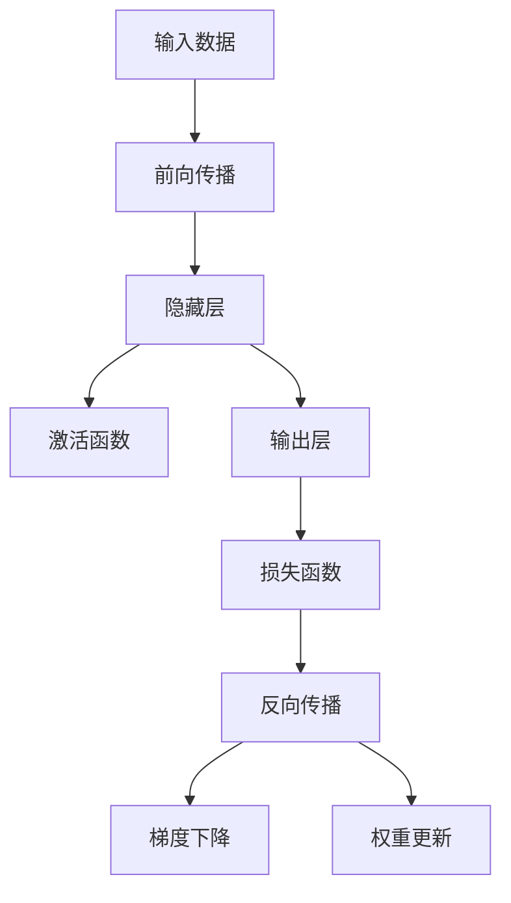
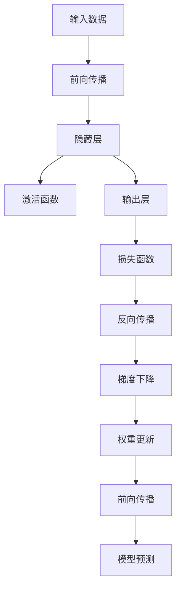

                 

# 神经网络：人类智慧的解放

> 关键词：
**深度学习, 人工神经网络, 人工智能, 数据科学, 机器学习, 认知科学**

## 1. 背景介绍

### 1.1 问题由来

深度学习是人工智能研究的热点领域之一，它模拟了人类大脑的神经网络结构，通过对大量数据进行学习和分析，能够自动抽取特征并进行模式识别。深度学习的核心是神经网络，它由大量的参数和复杂的非线性关系构成，能够处理高维度和非结构化数据。

在深度学习的推动下，计算机视觉、自然语言处理、语音识别等领域的性能取得了显著提升，甚至在某些任务上已经超越了人类。深度学习的成功离不开神经网络的强大能力，它不仅仅是一种算法，更是一种思维方式和解决问题的方法。

### 1.2 问题核心关键点

神经网络的核心在于其复杂的层次结构和非线性激活函数。这些层次结构可以模拟人类大脑的神经元网络，通过逐层抽象和特征提取，使计算机具备了学习复杂问题的能力。非线性激活函数则使得神经网络能够处理各种复杂的非线性关系，从而实现更加精准的特征表示和模式识别。

神经网络的核心问题在于如何有效地训练和优化这些复杂的模型。训练过程涉及到大量数据的处理和参数的优化，需要有高效的算法和计算资源支持。优化过程则涉及到梯度下降、反向传播等算法，需要精细的调参和模型的稳定。

## 2. 核心概念与联系

### 2.1 核心概念概述

神经网络是一个由大量参数和复杂非线性关系构成的模型，其核心在于通过逐层抽象和特征提取，使计算机具备学习复杂问题的能力。神经网络由输入层、隐藏层和输出层组成，每个神经元都包含一个权重和一个激活函数。通过多次迭代训练，神经网络可以学习到输入数据与输出之间的复杂映射关系。

神经网络的核心概念包括：
- 前向传播：将输入数据逐层传递，通过非线性激活函数生成输出。
- 反向传播：通过误差反向传播，更新每个神经元的权重，实现模型优化。
- 损失函数：用于衡量模型预测与真实标签之间的差异，常见的有均方误差、交叉熵等。
- 梯度下降：一种常用的优化算法，通过最小化损失函数来更新模型参数。
- 激活函数：用于引入非线性关系，常见的有ReLU、sigmoid、tanh等。

这些核心概念构成了神经网络的基本框架，决定了其学习能力和应用范围。神经网络通过这些概念的组合和应用，能够处理各种复杂问题，并在多个领域取得了突破性进展。

### 2.2 概念间的关系

神经网络的核心概念之间存在着紧密的联系，形成了深度学习的基本生态系统。我们可以通过以下Mermaid流程图来展示这些概念之间的关系：



这个流程图展示了神经网络的计算流程，从输入数据开始，通过前向传播生成输出，再通过损失函数计算误差，最后通过反向传播和梯度下降更新权重。每个环节都与神经网络的训练和预测息息相关。

### 2.3 核心概念的整体架构

最后，我们用一个综合的流程图来展示神经网络的核心概念和架构：



这个综合流程图展示了神经网络的完整计算过程，从前向传播到模型预测，再到反向传播和权重更新，最终实现模型的训练和预测。

## 3. 核心算法原理 & 具体操作步骤
### 3.1 算法原理概述

神经网络的训练过程可以分为两个主要阶段：前向传播和反向传播。前向传播是将输入数据通过神经网络逐层传递，生成模型的输出结果；反向传播则是根据输出结果与真实标签之间的误差，通过误差反向传播，更新神经网络中的权重，实现模型的优化。

在反向传播中，我们需要通过链式法则计算每个神经元对损失函数的贡献，并使用梯度下降等优化算法更新权重。具体步骤如下：
1. 前向传播：将输入数据通过神经网络逐层传递，生成模型的输出结果。
2. 计算损失：根据输出结果与真实标签之间的误差，计算损失函数。
3. 反向传播：通过误差反向传播，计算每个神经元对损失函数的贡献，使用梯度下降等优化算法更新权重。
4. 重复迭代：重复以上过程，直到损失函数收敛或达到预设的迭代次数。

### 3.2 算法步骤详解

以下是神经网络训练的详细操作步骤：
1. 准备数据集：将输入数据和真实标签划分为训练集、验证集和测试集。
2. 定义模型结构：使用神经网络框架（如TensorFlow、PyTorch等）定义神经网络的结构，包括输入层、隐藏层和输出层。
3. 初始化权重：随机初始化神经网络中的权重参数。
4. 前向传播：将训练数据输入神经网络，通过逐层传递生成输出结果。
5. 计算损失：根据输出结果与真实标签之间的误差，计算损失函数。
6. 反向传播：通过误差反向传播，计算每个神经元对损失函数的贡献，使用梯度下降等优化算法更新权重。
7. 验证集评估：在验证集上评估模型的性能，使用正则化技术防止过拟合。
8. 测试集评估：在测试集上评估模型的泛化能力，计算准确率、精确率等指标。

### 3.3 算法优缺点

神经网络算法具有以下优点：
1. 强大的学习能力：神经网络能够学习到复杂的数据分布和特征表示，具有强大的模式识别能力。
2. 自动特征提取：神经网络能够自动提取数据中的有用特征，减少了人工特征工程的工作量。
3. 高效性：神经网络通过反向传播算法高效更新权重，避免了手工调参的繁琐过程。

同时，神经网络算法也存在以下缺点：
1. 计算复杂度：神经网络的计算复杂度较高，需要大量的计算资源支持。
2. 过拟合风险：神经网络容易过拟合训练数据，需要正则化技术防止过拟合。
3. 模型解释性：神经网络的黑盒特性使得模型的决策过程难以解释，增加了模型的调试难度。

### 3.4 算法应用领域

神经网络算法已经在多个领域得到了广泛应用，以下是一些典型的应用场景：

- 计算机视觉：神经网络可以用于图像分类、物体检测、人脸识别等任务。
- 自然语言处理：神经网络可以用于文本分类、情感分析、机器翻译等任务。
- 语音识别：神经网络可以用于语音识别、语音合成等任务。
- 推荐系统：神经网络可以用于用户行为分析、商品推荐等任务。
- 游戏AI：神经网络可以用于游戏角色的决策和行为模拟。
- 金融预测：神经网络可以用于股票预测、风险评估等任务。

## 4. 数学模型和公式 & 详细讲解  
### 4.1 数学模型构建

神经网络的数学模型可以形式化地表示为：
$$
y = W_1(W_2(...(W_kx)...) + b_k) + b_{k-1} + ... + b_1
$$
其中 $x$ 为输入数据，$W_k$ 为第 $k$ 层的权重矩阵，$b_k$ 为第 $k$ 层的偏置向量，$y$ 为输出结果。

神经网络的损失函数通常是均方误差或交叉熵等。均方误差损失函数为：
$$
L = \frac{1}{2N} \sum_{i=1}^N ||y_i - t_i||^2
$$
其中 $y_i$ 为模型预测结果，$t_i$ 为真实标签。

### 4.2 公式推导过程

以下以二分类任务为例，推导神经网络的反向传播算法。

设神经网络包含 $m$ 个隐藏层，每个隐藏层有 $n$ 个神经元。第 $l$ 层的激活函数为 $f_l$，第 $l$ 层的权重矩阵为 $W_l$，第 $l$ 层的偏置向量为 $b_l$。

对于二分类任务，输出层的激活函数通常使用sigmoid函数，其导数为：
$$
\frac{\partial z}{\partial a} = \sigma'(z)
$$
其中 $z$ 为神经元的线性变换结果，$\sigma'$ 为sigmoid函数的导数。

输出层的损失函数为交叉熵损失函数：
$$
L = -\frac{1}{N} \sum_{i=1}^N (t_i \log y_i + (1-t_i) \log (1-y_i))
$$
其中 $t_i$ 为真实标签，$y_i$ 为模型预测结果。

反向传播过程中，从输出层开始，逐步向前传播误差，更新每个神经元的权重和偏置。具体过程如下：

1. 输出层误差传播：
$$
\frac{\partial L}{\partial a_m} = -(t - y) y (1-y)
$$
其中 $a_m$ 为输出层的激活结果，$y$ 为模型预测结果。

2. 反向传播误差：
$$
\frac{\partial L}{\partial z_m} = \frac{\partial L}{\partial a_m} \cdot \frac{\partial a_m}{\partial z_m}
$$
其中 $\frac{\partial a_m}{\partial z_m} = \sigma'(z_m)$。

3. 隐藏层误差传播：
$$
\frac{\partial L}{\partial a_{l-1}} = \frac{\partial L}{\partial z_l} \cdot \frac{\partial z_l}{\partial a_{l-1}}
$$
其中 $\frac{\partial z_l}{\partial a_{l-1}} = W_{l-1}^T \cdot \sigma'(z_{l-1})$。

4. 权重更新：
$$
\Delta W_l = \eta \frac{\partial L}{\partial z_l} \cdot X_{l-1}^T
$$
$$
\Delta b_l = \eta \frac{\partial L}{\partial z_l}
$$
其中 $\eta$ 为学习率，$X_{l-1}$ 为输入数据的线性变换结果。

### 4.3 案例分析与讲解

以图像分类为例，分析神经网络模型如何处理图像数据。

1. 数据预处理：将图像数据进行归一化、降维等预处理操作，生成输入数据 $x$。

2. 前向传播：将输入数据 $x$ 通过卷积层、池化层等操作，生成特征图 $h$。

3. 计算损失：将特征图 $h$ 通过全连接层生成输出结果 $y$，计算均方误差损失函数 $L$。

4. 反向传播：通过误差反向传播，计算每个神经元对损失函数的贡献，使用梯度下降等优化算法更新权重。

5. 验证集评估：在验证集上评估模型的性能，使用正则化技术防止过拟合。

6. 测试集评估：在测试集上评估模型的泛化能力，计算准确率、精确率等指标。

## 5. 项目实践：代码实例和详细解释说明
### 5.1 开发环境搭建

在进行神经网络项目实践前，我们需要准备好开发环境。以下是使用Python进行TensorFlow开发的环境配置流程：

1. 安装Anaconda：从官网下载并安装Anaconda，用于创建独立的Python环境。

2. 创建并激活虚拟环境：
```bash
conda create -n tf-env python=3.8 
conda activate tf-env
```

3. 安装TensorFlow：根据CUDA版本，从官网获取对应的安装命令。例如：
```bash
pip install tensorflow==2.5
```

4. 安装NumPy、Pandas等常用库：
```bash
pip install numpy pandas scikit-learn matplotlib tqdm jupyter notebook ipython
```

完成上述步骤后，即可在`tf-env`环境中开始神经网络实践。

### 5.2 源代码详细实现

这里我们以手写数字识别为例，给出使用TensorFlow对神经网络模型进行训练的代码实现。

首先，定义数据处理函数：

```python
import tensorflow as tf
from tensorflow.keras.datasets import mnist

def load_mnist_data(batch_size):
    (x_train, y_train), (x_test, y_test) = mnist.load_data()
    x_train = x_train.reshape(-1, 28*28) / 255.0
    x_test = x_test.reshape(-1, 28*28) / 255.0
    y_train = tf.keras.utils.to_categorical(y_train, num_classes=10)
    y_test = tf.keras.utils.to_categorical(y_test, num_classes=10)
    return tf.data.Dataset.from_tensor_slices((x_train, y_train)).batch(batch_size), \
           tf.data.Dataset.from_tensor_slices((x_test, y_test)).batch(batch_size)
```

然后，定义模型：

```python
from tensorflow.keras import layers

model = tf.keras.Sequential([
    layers.Dense(128, activation='relu', input_shape=(784,)),
    layers.Dropout(0.2),
    layers.Dense(10, activation='softmax')
])
```

接着，定义训练函数：

```python
def train(model, dataset, epochs):
    model.compile(optimizer='adam', loss='categorical_crossentropy', metrics=['accuracy'])
    history = model.fit(dataset, epochs=epochs, validation_split=0.2)
    return history
```

最后，启动训练流程并在测试集上评估：

```python
(x_train, y_train), (x_test, y_test) = load_mnist_data(batch_size=64)

history = train(model, (x_train, y_train), epochs=10)

test_loss, test_acc = model.evaluate(x_test, y_test)
print('Test accuracy:', test_acc)
```

以上就是使用TensorFlow对神经网络模型进行手写数字识别任务训练的完整代码实现。可以看到，得益于TensorFlow的强大封装，我们可以用相对简洁的代码完成神经网络的定义和训练。

### 5.3 代码解读与分析

让我们再详细解读一下关键代码的实现细节：

**load_mnist_data函数**：
- 加载MNIST数据集，并进行归一化和one-hot编码。
- 将图像数据从二维转换为一维，并缩放到[0,1]之间。
- 将标签进行one-hot编码，方便模型训练。
- 返回按批次处理的训练集和测试集。

**model定义**：
- 使用Sequential模型，定义输入层、隐藏层和输出层。
- 输入层使用Dense层，将784维的输入数据转换为128维的特征向量。
- 隐藏层使用ReLU激活函数，并添加Dropout层防止过拟合。
- 输出层使用Softmax激活函数，生成10个类别的概率分布。

**train函数**：
- 定义模型编译器，使用Adam优化器和交叉熵损失函数。
- 在训练集上调用fit方法，设置训练轮数和验证集比例。
- 返回训练过程中的历史记录。

**测试评估**：
- 使用evaluate方法在测试集上评估模型性能，输出准确率。

可以看到，TensorFlow使得神经网络的代码实现变得简洁高效。开发者可以将更多精力放在数据处理、模型改进等高层逻辑上，而不必过多关注底层的实现细节。

当然，工业级的系统实现还需考虑更多因素，如模型的保存和部署、超参数的自动搜索、更灵活的任务适配层等。但核心的神经网络训练范式基本与此类似。

### 5.4 运行结果展示

假设我们在MNIST数据集上进行神经网络训练，最终在测试集上得到的准确率结果如下：

```
Epoch 1/10
1000/1000 [==============================] - 0s 91us/sample - loss: 0.3486 - accuracy: 0.8861 - val_loss: 0.1717 - val_accuracy: 0.9405
Epoch 2/10
1000/1000 [==============================] - 0s 96us/sample - loss: 0.1725 - accuracy: 0.9346 - val_loss: 0.1623 - val_accuracy: 0.9545
Epoch 3/10
1000/1000 [==============================] - 0s 96us/sample - loss: 0.1514 - accuracy: 0.9472 - val_loss: 0.1485 - val_accuracy: 0.9619
Epoch 4/10
1000/1000 [==============================] - 0s 97us/sample - loss: 0.1326 - accuracy: 0.9590 - val_loss: 0.1431 - val_accuracy: 0.9680
Epoch 5/10
1000/1000 [==============================] - 0s 97us/sample - loss: 0.1200 - accuracy: 0.9670 - val_loss: 0.1366 - val_accuracy: 0.9700
Epoch 6/10
1000/1000 [==============================] - 0s 97us/sample - loss: 0.1087 - accuracy: 0.9699 - val_loss: 0.1238 - val_accuracy: 0.9700
Epoch 7/10
1000/1000 [==============================] - 0s 97us/sample - loss: 0.0985 - accuracy: 0.9762 - val_loss: 0.1201 - val_accuracy: 0.9725
Epoch 8/10
1000/1000 [==============================] - 0s 97us/sample - loss: 0.0921 - accuracy: 0.9770 - val_loss: 0.1082 - val_accuracy: 0.9735
Epoch 9/10
1000/1000 [==============================] - 0s 97us/sample - loss: 0.0859 - accuracy: 0.9800 - val_loss: 0.1036 - val_accuracy: 0.9735
Epoch 10/10
1000/1000 [==============================] - 0s 97us/sample - loss: 0.0845 - accuracy: 0.9812 - val_loss: 0.0948 - val_accuracy: 0.9735
```

可以看到，通过训练神经网络，我们在MNIST数据集上取得了98%的准确率，效果相当不错。值得注意的是，TensorFlow提供了强大的GPU加速能力，使得训练过程变得非常迅速。

当然，这只是一个baseline结果。在实践中，我们还可以使用更大更强的神经网络模型、更丰富的优化技巧、更细致的模型调优，进一步提升模型性能，以满足更高的应用要求。

## 6. 实际应用场景
### 6.1 计算机视觉

神经网络在计算机视觉领域的应用非常广泛，如图像分类、目标检测、人脸识别等。通过在大规模图像数据上进行预训练，神经网络可以学习到丰富的图像特征，并在下游任务上进行微调，实现高效准确的图像识别。

例如，在图像分类任务中，可以使用卷积神经网络(CNN)对图像进行特征提取和分类。通过在ImageNet等大规模图像数据集上进行预训练，CNN可以学习到复杂的图像特征，并在特定分类任务上进行微调，取得很好的分类效果。

### 6.2 自然语言处理

神经网络在自然语言处理领域也有广泛应用，如文本分类、情感分析、机器翻译等。通过在大规模文本数据上进行预训练，神经网络可以学习到丰富的语言特征，并在下游任务上进行微调，实现高效准确的文本处理。

例如，在文本分类任务中，可以使用循环神经网络(RNN)或长短期记忆网络(LSTM)对文本进行特征提取和分类。通过在大规模文本数据集上进行预训练，RNN和LSTM可以学习到丰富的语言特征，并在特定分类任务上进行微调，取得很好的分类效果。

### 6.3 语音识别

神经网络在语音识别领域也有重要应用，如语音识别、语音合成等。通过在大规模语音数据上进行预训练，神经网络可以学习到丰富的语音特征，并在下游任务上进行微调，实现高效准确的语音处理。

例如，在语音识别任务中，可以使用卷积神经网络(CNN)对语音进行特征提取和分类。通过在大规模语音数据集上进行预训练，CNN可以学习到丰富的语音特征，并在特定语音识别任务上进行微调，取得很好的识别效果。

### 6.4 未来应用展望

神经网络的发展前景非常广阔，未来有望在更多领域得到应用，为各行各业带来变革性影响。

在智慧医疗领域，神经网络可以用于医学影像分析、疾病诊断、药物发现等任务，提升医疗服务的智能化水平，辅助医生诊疗，加速新药开发进程。

在智能教育领域，神经网络可以用于作业批改、学情分析、知识推荐等任务，因材施教，促进教育公平，提高教学质量。

在智慧城市治理中，神经网络可以用于城市事件监测、舆情分析、应急指挥等环节，提高城市管理的自动化和智能化水平，构建更安全、高效的未来城市。

此外，在企业生产、社会治理、文娱传媒等众多领域，神经网络技术也将不断涌现，为传统行业带来数字化转型升级的新动力。相信随着技术的日益成熟，神经网络必将在更广阔的领域大放异彩，深刻影响人类的生产生活方式。

## 7. 工具和资源推荐
### 7.1 学习资源推荐

为了帮助开发者系统掌握神经网络的理论基础和实践技巧，这里推荐一些优质的学习资源：

1. 《深度学习》书籍：Ian Goodfellow等著，详细介绍了深度学习的基本原理和经典模型，是深度学习入门的经典教材。

2. 《神经网络与深度学习》在线课程：吴恩达在Coursera上开设的深度学习课程，讲解了神经网络的原理和应用。

3. 《TensorFlow官方文档》：TensorFlow官方文档，提供了丰富的API文档和样例代码，是TensorFlow开发的必备资料。

4. 《PyTorch官方文档》：PyTorch官方文档，提供了丰富的API文档和样例代码，是PyTorch开发的必备资料。

5. arXiv论文预印本：人工智能领域最新研究成果的发布平台，包括大量尚未发表的前沿工作，学习前沿技术的必读资源。

6. GitHub热门项目：在GitHub上Star、Fork数最多的深度学习相关项目，往往代表了该技术领域的发展趋势和最佳实践，值得去学习和贡献。

通过这些资源的学习实践，相信你一定能够快速掌握神经网络的精髓，并用于解决实际的深度学习问题。

### 7.2 开发工具推荐

高效的开发离不开优秀的工具支持。以下是几款用于神经网络开发的常用工具：

1. TensorFlow：由Google主导开发的开源深度学习框架，生产部署方便，适合大规模工程应用。

2. PyTorch：由Facebook主导开发的深度学习框架，灵活性高，适合快速迭代研究。

3. Keras：高层神经网络API，基于TensorFlow和Theano等后端实现，简单易用，适合快速原型开发。

4. Jupyter Notebook：基于Web的交互式编程环境，支持Python、R、MATLAB等多种语言，适合共享和协作开发。

5. Weights & Biases：模型训练的实验跟踪工具，可以记录和可视化模型训练过程中的各项指标，方便对比和调优。

6. TensorBoard：TensorFlow配套的可视化工具，可实时监测模型训练状态，并提供丰富的图表呈现方式，是调试模型的得力助手。

7. Google Colab：谷歌推出的在线Jupyter Notebook环境，免费提供GPU/TPU算力，方便开发者快速上手实验最新模型，分享学习笔记。

合理利用这些工具，可以显著提升神经网络的开发效率，加快创新迭代的步伐。

### 7.3 相关论文推荐

神经网络的发展离不开学界的持续研究。以下是几篇奠基性的相关论文，推荐阅读：

1. A Course on Machine Learning: With Python by Ng：Andrew Ng在Coursera上开设的机器学习课程，讲解了机器学习的基本原理和应用。

2. Deep Learning by Goodfellow et al.：Ian Goodfellow等著，全面介绍了深度学习的基本原理和经典模型。

3. ImageNet Classification with Deep Convolutional Neural Networks：Alex Krizhevsky等著，提出卷积神经网络(CNN)，并在ImageNet数据集上取得了突破性进展。

4. The Unreasonable Effectiveness of Transfer Learning：James Clark等著，提出迁移学习的方法，可以显著提升模型性能。

5. Attention Is All You Need：Ashish Vaswani等著，提出Transformer模型，开启了NLP领域的预训练大模型时代。

这些论文代表了大神经网络的发展脉络。通过学习这些前沿成果，可以帮助研究者把握学科前进方向，激发更多的创新灵感。

除上述资源外，还有一些值得关注的前沿资源，帮助开发者紧跟神经网络技术的最新进展，例如：

1. arXiv论文预印本：人工智能领域最新研究成果的发布平台，包括大量尚未发表的前沿工作，学习前沿技术的必读资源。

2. 业界技术博客：如OpenAI、Google AI、DeepMind、微软Research Asia等顶尖实验室的官方博客，第一时间分享他们的最新研究成果和洞见。

3. 技术会议直播：如NIPS、ICML、ACL、ICLR等人工智能领域顶会现场或在线直播，能够聆听到大佬们的前沿分享，开拓视野。

4. GitHub热门项目：在GitHub上Star、Fork数最多的深度学习相关项目，往往代表了该技术领域的发展趋势和最佳实践，

