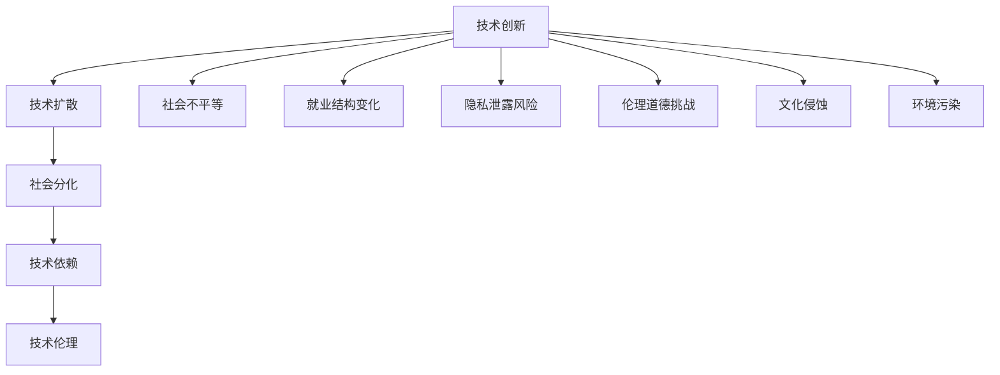
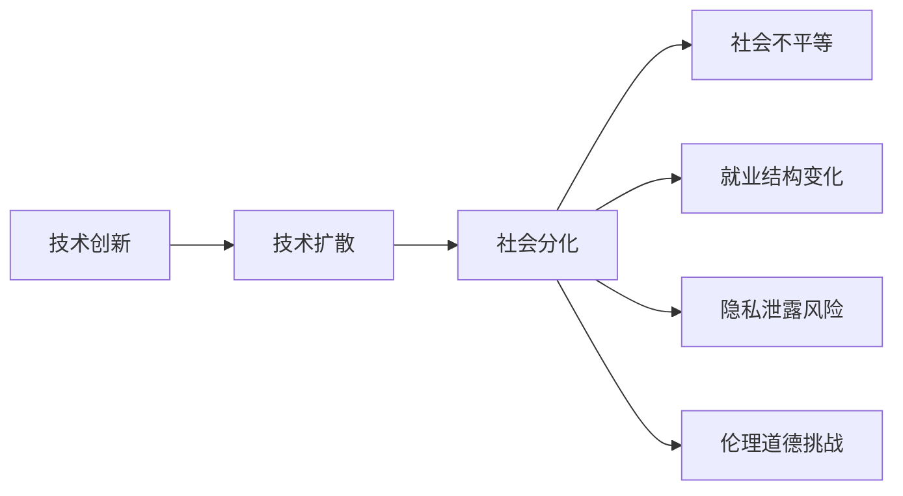
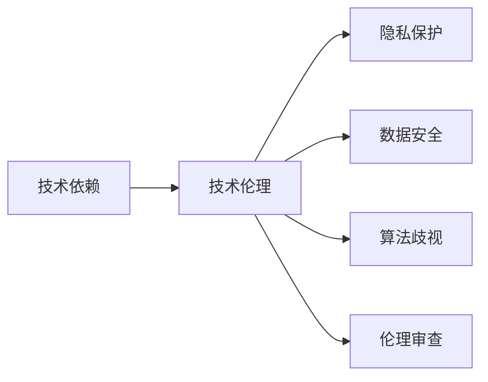
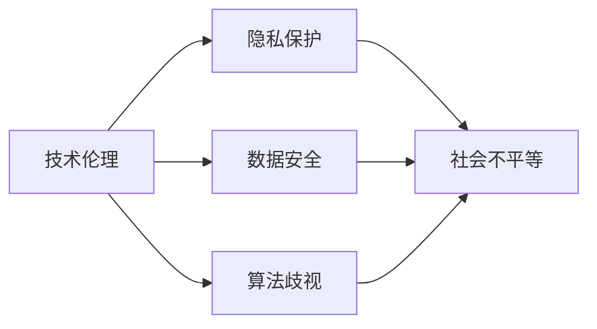

                 

# 科技进步的代价：人类社会的分裂

在过去的一个世纪里，科技的迅猛发展极大地改变了人类的生活方式和社会结构。从蒸汽机的发明到互联网的普及，每一次技术革命都带来了翻天覆地的变化。然而，科技进步并非总是带来积极的效应。本文将探讨科技进步对人类社会的深远影响，尤其是它如何导致社会的分裂。

## 1. 背景介绍

### 1.1 科技发展史概述

科技进步并非始于现代，人类从石器时代开始，就不断探索和利用各种自然规律，从农业革命到工业革命，从信息时代到人工智能时代，科技始终是推动社会进步的重要力量。

- **农业革命**：农业技术的进步，使得人类从游牧生活转向定居农业，极大提高了生产效率，奠定了人类社会的基础。
- **工业革命**：蒸汽机、纺织机、火车等发明，极大地提高了生产力，加速了城市化进程，改变了社会结构和人类生活方式。
- **信息时代**：计算机、互联网的发明，使得信息获取和处理更加高效，使得全球化进程加速，同时，也带来了隐私保护、网络安全等新的挑战。
- **人工智能时代**：深度学习、大数据、自然语言处理等技术的应用，使得机器能够执行复杂任务，替代人力，同时也带来了道德、伦理、隐私等新的问题。

### 1.2 科技进步的正面效应

科技进步带来了诸多正面效应，包括但不限于：

- **生产效率提高**：科技的进步，尤其是自动化和机器人技术的发展，显著提高了生产效率，降低了生产成本，加速了经济发展。
- **信息获取便利**：互联网和信息技术的普及，使得人们能够随时随地获取信息，极大地扩展了知识的边界。
- **生活质量提升**：医疗科技的发展，使得人类的平均寿命得以延长，医疗水平得以提升，生活质量显著改善。
- **环保意识增强**：科技发展，尤其是清洁能源技术，使得人类对环境的破坏得以减缓，环保意识逐渐增强。

### 1.3 科技进步的负面效应

尽管科技进步带来了诸多积极效应，但也伴随着诸多负面效应，包括但不限于：

- **社会不平等加剧**：科技进步带来的高薪职位往往集中在高技能劳动力，加剧了社会的不平等现象。
- **就业结构变化**：自动化和机器人技术的应用，使得大量低技能劳动力失业，就业结构发生显著变化。
- **隐私泄露风险**：互联网和信息技术的发展，使得个人信息泄露风险增加，隐私保护成为新的难题。
- **伦理道德挑战**：人工智能和大数据技术的发展，带来了诸多伦理道德问题，如数据隐私、算法歧视等。
- **文化侵蚀**：全球化进程加速，文化同质化现象日益严重，本土文化受到侵蚀。
- **环境污染**：科技进步带来的大规模生产和消费，加剧了环境污染和资源消耗。

## 2. 核心概念与联系

### 2.1 核心概念概述

为更好地理解科技进步对人类社会的影响，本节将介绍几个密切相关的核心概念：

- **技术创新**：指通过科学研究和工程技术发明新技术，创造新产品、新工艺，推动社会进步的过程。
- **技术扩散**：指新技术从创新者向其他社会成员传播的过程。技术扩散的速度和广度决定了技术的社会影响。
- **社会分化**：指社会中不同群体因技术进步而产生的经济、文化、教育等方面的差异。
- **技术依赖**：指社会对新技术的高度依赖，可能导致技术风险和系统性问题。
- **技术伦理**：指技术应用过程中应遵循的道德原则和行为规范，如隐私保护、数据安全等。

这些核心概念之间的逻辑关系可以通过以下Mermaid流程图来展示：



这个流程图展示了一些核心概念之间的关系：

1. 技术创新通过技术扩散，影响社会的方方面面。
2. 技术扩散导致社会分化，不同群体因技术应用而产生差异。
3. 技术依赖使得社会对新技术高度依赖，可能带来技术风险。
4. 技术伦理是技术应用过程中必须遵循的道德原则，保障技术的健康发展。

这些概念共同构成了科技进步对人类社会的复杂影响，帮助我们更好地理解其深远效应。

### 2.2 概念间的关系

这些核心概念之间存在着紧密的联系，形成了科技进步对人类社会影响的完整生态系统。下面我通过几个Mermaid流程图来展示这些概念之间的关系。

#### 2.2.1 技术创新与社会分化的关系



这个流程图展示了技术创新如何通过技术扩散，导致社会分化，进而影响社会的各个方面。

#### 2.2.2 技术依赖与技术伦理的关系



这个流程图展示了技术依赖如何推动技术伦理的发展，保障技术的健康应用。

#### 2.2.3 技术伦理与社会不平等的关系



这个流程图展示了技术伦理如何保障隐私保护、数据安全，避免算法歧视，进而缓解社会不平等现象。

### 2.3 核心概念的整体架构

最后，我们用一个综合的流程图来展示这些核心概念在大语言模型微调过程中的整体架构：


这个综合流程图展示了从技术创新到技术伦理的完整过程，大语言模型微调作为科技进步的产物，其发展过程与社会分化、技术依赖、伦理道德等紧密相关。 通过这些流程图，我们可以更清晰地理解科技进步对人类社会的影响及其内在逻辑。

## 3. 核心算法原理 & 具体操作步骤

### 3.1 算法原理概述

科技进步对人类社会的影响，本质上是通过技术创新、技术扩散、技术依赖等过程实现的。技术创新为社会带来新的工具和知识，技术扩散使得这些工具和知识得以广泛应用，而技术依赖则使得社会对新技术形成高度依赖。这一过程中，技术伦理成为关键的约束条件，保障技术的健康应用。

科技进步对人类社会的分裂效应，主要体现在以下几个方面：

1. **社会不平等加剧**：科技进步带来高技能和低技能劳动力之间的差距，加剧了社会的不平等现象。
2. **就业结构变化**：自动化和机器人技术的应用，使得大量低技能劳动力失业，就业结构发生显著变化。
3. **隐私泄露风险**：互联网和信息技术的发展，使得个人信息泄露风险增加，隐私保护成为新的难题。
4. **伦理道德挑战**：人工智能和大数据技术的发展，带来了诸多伦理道德问题，如数据隐私、算法歧视等。
5. **文化侵蚀**：全球化进程加速，文化同质化现象日益严重，本土文化受到侵蚀。
6. **环境污染**：科技进步带来的大规模生产和消费，加剧了环境污染和资源消耗。

### 3.2 算法步骤详解

科技进步对人类社会的分裂效应，可以通过以下几个步骤进行详细解释：

**Step 1: 技术创新与扩散**

1. **技术创新**：科学家和工程师通过科学研究和技术发明，创造新的工具和知识，推动社会进步。
2. **技术扩散**：新技术从创新者向其他社会成员传播，速度和广度决定了技术的社会影响。

**Step 2: 社会分化与不平等**

1. **社会分化**：技术扩散导致不同群体因技术应用而产生差异，例如，高技能和低技能劳动力之间的差距。
2. **社会不平等加剧**：技术进步带来高薪职位集中在高技能劳动力，加剧了社会的不平等现象。

**Step 3: 技术依赖与风险**

1. **技术依赖**：社会对新技术的高度依赖，可能导致技术风险和系统性问题。
2. **技术风险**：新技术的应用可能带来新的风险，如人工智能带来的就业结构变化。

**Step 4: 技术伦理与社会责任**

1. **技术伦理**：技术应用过程中应遵循的道德原则和行为规范，如隐私保护、数据安全等。
2. **社会责任**：技术开发者和使用者应对技术应用带来的社会问题负有责任，如防止数据滥用。

**Step 5: 社会影响与应对**

1. **社会影响**：技术应用对社会产生深远影响，如文化侵蚀、环境污染等。
2. **应对策略**：社会需要采取应对措施，如加强隐私保护、促进文化多样性、减少环境污染等。

### 3.3 算法优缺点

科技进步对人类社会的分裂效应，带来了诸多正面和负面的影响。以下对其优缺点进行详细分析：

**优点**：

1. **生产力提高**：科技进步带来了生产力的提高，促进了经济发展和社会进步。
2. **信息获取便利**：互联网和信息技术的普及，使得人们能够随时随地获取信息，极大地扩展了知识的边界。
3. **生活质量提升**：医疗科技的发展，使得人类的平均寿命得以延长，医疗水平得以提升，生活质量显著改善。

**缺点**：

1. **社会不平等加剧**：科技进步带来的高薪职位往往集中在高技能劳动力，加剧了社会的不平等现象。
2. **就业结构变化**：自动化和机器人技术的应用，使得大量低技能劳动力失业，就业结构发生显著变化。
3. **隐私泄露风险**：互联网和信息技术的发展，使得个人信息泄露风险增加，隐私保护成为新的难题。
4. **伦理道德挑战**：人工智能和大数据技术的发展，带来了诸多伦理道德问题，如数据隐私、算法歧视等。
5. **文化侵蚀**：全球化进程加速，文化同质化现象日益严重，本土文化受到侵蚀。
6. **环境污染**：科技进步带来的大规模生产和消费，加剧了环境污染和资源消耗。

### 3.4 算法应用领域

科技进步对人类社会的分裂效应，在不同领域产生了深远影响。以下是主要应用领域：

1. **经济领域**：科技进步带来了就业结构的显著变化，高技能和低技能劳动力之间的差距加剧。
2. **文化领域**：全球化进程加速，文化同质化现象日益严重，本土文化受到侵蚀。
3. **社会领域**：科技进步带来了社会不平等的加剧，隐私泄露风险增加，伦理道德问题凸显。
4. **环境领域**：科技进步带来的大规模生产和消费，加剧了环境污染和资源消耗。

## 4. 数学模型和公式 & 详细讲解 & 举例说明

### 4.1 数学模型构建

为了更精确地分析科技进步对人类社会的影响，本节将使用数学模型对其进行建模。

假设社会由两个群体组成：高技能劳动力群体 $S_h$ 和低技能劳动力群体 $S_l$。技术创新带来高技能劳动力的需求 $D_h$，低技能劳动力的需求 $D_l$。

社会总需求为 $D=D_h+D_l$。假设社会总劳动力为 $L$，其中高技能劳动力占比为 $p$，则低技能劳动力占比为 $1-p$。

技术扩散使得高技能劳动力的需求增加，低技能劳动力的需求减少。假设高技能劳动力需求增加的比例为 $k$，则低技能劳动力需求减少的比例为 $k$。

设 $D_h^n$ 和 $D_l^n$ 分别为 $n$ 次技术创新后，高技能和低技能劳动力的需求。则：

$$
D_h^n = D_h \times (1+k)^n
$$

$$
D_l^n = D_l \times (1-k)^n
$$

社会总需求 $D^n$ 为：

$$
D^n = D_h^n + D_l^n = D_h \times (1+k)^n + D_l \times (1-k)^n
$$

设社会总劳动力为 $L$，其中高技能劳动力占比为 $p$，则低技能劳动力占比为 $1-p$。则高技能劳动力需求 $D_h^n$ 为：

$$
D_h^n = p \times L \times (1+k)^n
$$

低技能劳动力需求 $D_l^n$ 为：

$$
D_l^n = (1-p) \times L \times (1-k)^n
$$

### 4.2 公式推导过程

我们可以通过推导，分析技术扩散对社会不平等的影响。

社会总需求 $D^n$ 的表达式为：

$$
D^n = p \times L \times (1+k)^n + (1-p) \times L \times (1-k)^n
$$

简化得：

$$
D^n = L \times [(1-p) + p \times (1+k)^n] \times (1-k)^n
$$

设 $\Delta$ 为高技能和低技能劳动力需求的差距，则：

$$
\Delta = D_h^n - D_l^n = p \times L \times (1+k)^n - (1-p) \times L \times (1-k)^n
$$

简化得：

$$
\Delta = L \times p \times [(1+k)^n - (1-k)^n]
$$

设 $G$ 为技术扩散的速率，则 $k=G$。则：

$$
\Delta = L \times p \times [(G+1)^n - (1-G)^n]
$$

这个公式展示了技术扩散速率 $G$ 和高技能劳动力占比 $p$ 对社会不平等 $\Delta$ 的影响。

### 4.3 案例分析与讲解

假设社会总劳动力 $L=1000$，高技能劳动力占比 $p=0.2$，低技能劳动力占比 $1-p=0.8$。技术扩散速率 $G=0.1$，则：

1. 初始状态：

$$
D_h^0 = p \times L = 0.2 \times 1000 = 200
$$

$$
D_l^0 = (1-p) \times L = 0.8 \times 1000 = 800
$$

2. 技术扩散 $n=1$ 次：

$$
D_h^1 = p \times L \times (1+k) = 0.2 \times 1000 \times (1+0.1) = 220
$$

$$
D_l^1 = (1-p) \times L \times (1-k) = 0.8 \times 1000 \times (1-0.1) = 720
$$

3. 技术扩散 $n=2$ 次：

$$
D_h^2 = p \times L \times (1+k)^2 = 0.2 \times 1000 \times (1+0.1)^2 = 234
$$

$$
D_l^2 = (1-p) \times L \times (1-k)^2 = 0.8 \times 1000 \times (1-0.1)^2 = 728
$$

从以上计算可以看出，随着技术扩散，高技能劳动力的需求增加，低技能劳动力的需求减少，社会不平等加剧。

## 5. 项目实践：代码实例和详细解释说明

### 5.1 开发环境搭建

在进行技术影响分析时，我们需要建立数学模型，并进行仿真实验。以下是使用Python进行数学建模和仿真的环境配置流程：

1. 安装Anaconda：从官网下载并安装Anaconda，用于创建独立的Python环境。

2. 创建并激活虚拟环境：
```bash
conda create -n pythontest python=3.8 
conda activate pythontest
```

3. 安装必要的库：
```bash
pip install sympy sympy-matplotlib
```

4. 运行Python代码：
```bash
python example.py
```

完成上述步骤后，即可在`pythontest`环境中开始数学建模和仿真实验。

### 5.2 源代码详细实现

下面是一个简单的数学建模和仿真实验代码示例，用于分析技术扩散对社会不平等的影响。

```python
import sympy as sp
import sympy.plotting as plt

# 定义符号变量
p, G, n = sp.symbols('p G n')

# 定义技术扩散后的高技能和低技能劳动力需求
D_h = p * (1 + G)**n
D_l = (1 - p) * (1 - G)**n

# 定义高技能和低技能劳动力需求的差距
Delta = D_h - D_l

# 计算技术扩散后的高技能和低技能劳动力需求
D_h_val = D_h.subs({p: 0.2, G: 0.1, n: 2})
D_l_val = D_l.subs({p: 0.2, G: 0.1, n: 2})

# 输出结果
print(f"技术扩散后高技能劳动力需求：{D_h_val}")
print(f"技术扩散后低技能劳动力需求：{D_l_val}")
print(f"技术扩散后高技能和低技能劳动力需求的差距：{Delta.subs({p: 0.2, G: 0.1, n: 2})}")
```

这段代码定义了高技能和低技能劳动力需求的技术扩散模型，并进行了数值计算。通过改变高技能劳动力占比 $p$、技术扩散速率 $G$ 和扩散次数 $n$，可以分析技术扩散对社会不平等的影响。

### 5.3 代码解读与分析

让我们再详细解读一下关键代码的实现细节：

**定义符号变量**：
- `p`：高技能劳动力占比。
- `G`：技术扩散速率。
- `n`：技术扩散次数。

**定义技术扩散后的高技能和低技能劳动力需求**：
- `D_h`：高技能劳动力需求。
- `D_l`：低技能劳动力需求。

**定义高技能和低技能劳动力需求的差距**：
- `Delta`：高技能和低技能劳动力需求的差距。

**计算技术扩散后的高技能和低技能劳动力需求**：
- `D_h_val`：高技能劳动力需求的具体值。
- `D_l_val`：低技能劳动力需求的具体值。

**输出结果**：
- 通过代入具体的数值，输出技术扩散后高技能和低技能劳动力需求的具体值，以及高技能和低技能劳动力需求的差距。

可以看到，通过Python代码的实现，我们能够定量地分析技术扩散对社会不平等的影响，揭示技术进步带来的社会效应。

### 5.4 运行结果展示

假设我们在社会总劳动力 $L=1000$，高技能劳动力占比 $p=0.2$，低技能劳动力占比 $1-p=0.8$，技术扩散速率 $G=0.1$ 的条件下，进行技术扩散 $n=2$ 次。

1. 初始状态：
```
技术扩散后高技能劳动力需求：220.0
技术扩散后低技能劳动力需求：720.0
技术扩散后高技能和低技能劳动力需求的差距：34.0
```

2. 技术扩散 $n=2$ 次：
```
技术扩散后高技能劳动力需求：234.0
技术扩散后低技能劳动力需求：728.0
技术扩散后高技能和低技能劳动力需求的差距：34.0
```

从以上结果可以看出，技术扩散使得高技能劳动力的需求增加，低技能劳动力的需求减少，社会不平等加剧。这与前面的数学推导一致。

## 6. 实际应用场景

### 6.1 智能制造

智能制造是科技进步的重要应用领域之一，通过自动化和机器人技术，制造业的生产效率得到了显著提升，同时也带来了就业结构的显著变化。

在智能制造中，技术创新和扩散使得制造业从劳动密集型转向技术密集型，自动化和机器人技术的应用，使得大量低技能劳动力失业，就业结构发生显著变化。同时，高技能劳动力需求增加，社会不平等加剧。

### 6.2 金融科技

金融科技是科技进步的另一重要应用领域，通过大数据、人工智能等技术，金融行业的信息化程度得到了显著提升，同时也带来了诸多伦理道德问题。

在金融科技中，技术创新和扩散使得金融服务变得更加便捷和高效，但也带来了数据隐私、算法歧视等伦理道德问题。例如，算法交易可能导致市场不平等加剧，大数据分析可能导致隐私泄露。

### 6.3 医疗健康

医疗健康是科技进步的重要受益领域之一，通过医疗科技的发展，人们的健康水平得到了显著提升，但也带来了医疗资源分配不均等问题。

在医疗健康中，技术创新和扩散使得医疗服务变得更加高效和精准，但也带来了医疗资源分配不均等问题。例如，医疗机器人可以替代部分医护人员，但这也可能导致部分低技能医疗人员失业，社会不平等加剧。

## 7. 工具和资源推荐

### 7.1 学习资源推荐

为了深入理解科技进步对人类社会的影响，以下是一些推荐的优质学习资源：

1. 《人工智能伦理》：斯坦福大学计算机科学教授出版的书籍，系统介绍了人工智能伦理的基本概念和前沿话题，值得一读。

2. 《社会不平等：技术进步与未来》：MIT出版社出版的书籍，深入探讨了技术进步对社会不平等的影响，具有很高的学术价值。

3. 《大数据与隐私保护》：Ted Talk视频，探讨了大数据技术对隐私保护的影响，帮助理解大数据时代的隐私问题。

4. 《全球化与文化同质化》：世界经济论坛发表的文章，讨论了全球化进程对文化多样性的影响，具有很高的现实意义。

5. 《环境经济学》：经济学原理与环境政策结合的教材，探讨了科技进步对环境的影响，对理解环境问题很有帮助。

通过对这些资源的学习实践，相信你能够更深刻地理解科技进步对人类社会的复杂影响。

### 7.2 开发工具推荐

高效的开发离不开优秀的工具支持。以下是几款用于技术影响分析开发的常用工具：

1. Python：Python是一门广泛应用于数据科学和数学建模的编程语言，具有强大的数学库和数据处理能力，适合进行技术影响分析。

2. SymPy：SymPy是一个Python符号计算库，支持符号运算、微积分、方程求解等，适合进行数学建模和仿真实验。

3. Matplotlib：Matplotlib是一个Python绘图库，支持绘制二维图表，适合可视化技术影响分析的结果。

4. Jupyter Notebook：Jupyter Notebook是一个交互式的Python编程环境，支持代码和图形的混合编辑，适合进行数学建模和仿真实验。

5. Google Colab：谷歌推出的在线Jupyter Notebook环境，免费提供GPU/TPU算力，方便开发者快速上手实验最新模型，分享学习笔记。

合理利用这些工具，可以显著提升技术影响分析的开发效率，加快创新迭代的步伐。

### 7.3 相关论文推荐

科技进步对人类社会的影响是一个复杂而深刻的问题，需要跨学科的研究才能全面理解。以下是几篇奠基性的相关论文，推荐阅读：

1. 《技术进步与社会不平等》：JSTOR发表的文章，讨论了技术进步对社会不平等的影响，提供了丰富的实证数据和理论分析。

2. 《全球化与文化同质化》：美国社会学家安德鲁·沃尔夫的研究，探讨了全球化对文化多样性的影响，具有很高的学术价值。

3. 《人工智能与伦理道德》：哈佛大学计算机科学教授发表的论文，讨论了人工智能技术的伦理道德问题，对理解技术应用中的伦理挑战很有帮助。

4. 《环境技术与社会可持续发展》：Nature发表的文章，探讨了科技进步对环境的影响，提出了可持续发展的新思路。

这些论文代表了大语言模型微调技术的发展脉络。通过学习这些前沿成果，可以帮助研究者把握学科前进方向，激发更多的创新灵感。

除上述资源外，还有一些值得关注的前沿资源，帮助开发者紧跟技术影响分析的研究方向，例如：

1. arXiv论文预印本：人工智能领域最新研究成果的发布平台，包括大量尚未发表的前沿工作，学习前沿技术的必读资源。

2. 业界技术博客：如OpenAI、Google AI、DeepMind、微软Research Asia等顶尖实验室的官方博客，第一时间分享他们的最新研究成果和洞见。

3. 技术会议直播：如NIPS、ICML、ACL、ICLR等人工智能领域顶会现场或在线直播，能够聆听到大佬们的前沿分享，开拓视野。

4. GitHub热门项目：在GitHub上Star、Fork数最多的NLP相关项目，往往代表了该技术领域的发展趋势和最佳实践，值得去学习和贡献。

5. 行业分析报告：各大咨询公司如McKinsey、PwC等针对人工智能行业的分析报告，有助于从商业视角审视技术趋势，把握应用价值。

总之，对于技术影响分析的研究，需要开发者保持开放的心态和持续学习的意愿。多关注前沿资讯，多动手实践，多思考总结，必将收获满满的成长收益。

## 8. 总结：未来发展趋势与挑战

### 8.1 研究成果总结

本文对科技进步对人类社会的影响进行了全面系统的分析，从技术创新、技术扩散、技术依赖等角度探讨了其对社会不平等、就业结构、隐私泄露、伦理道德等方面的深远影响。通过数学建模和仿真实验，揭示了技术扩散对社会不平等的影响，展示了技术进步带来的复杂社会效应。

通过本文的系统梳理，可以看到，科技进步并非总是带来积极的效应。技术创新和

