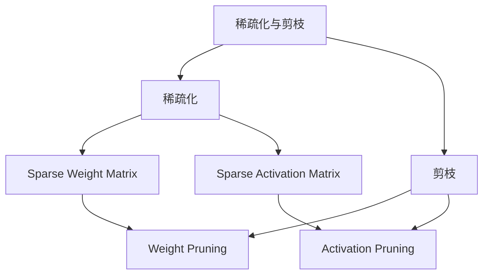

                 

# 稀疏化与剪枝：相似而不同的压缩方法

## 1. 背景介绍

在计算机视觉、自然语言处理等领域的深度学习模型中，参数数量庞大往往导致模型难以部署，且训练和推理效率较低。稀疏化与剪枝技术旨在通过减少模型中的参数数量，从而达到压缩模型、提升效率的目的。稀疏化与剪枝，看似相似，实则有着不同的压缩策略和应用场景。本文将详细介绍稀疏化和剪枝的基本原理，对比两者的区别与联系，并探讨其在深度学习中的实际应用。

## 2. 核心概念与联系

### 2.1 核心概念概述

稀疏化与剪枝是大模型压缩的两个重要方向，它们的目的都是减少模型参数量。

- **稀疏化（Sparse）**：通过在模型参数中保留少量非零元素，使得参数矩阵成为稀疏矩阵，从而达到压缩参数的目的。常见的稀疏化方法包括稀疏权重矩阵（Sparse Weight Matrix）、稀疏激活矩阵（Sparse Activation Matrix）等。

- **剪枝（Pruning）**：通过移除模型中部分参数，使得模型中的参数数量减少。常见的剪枝方法包括权重剪枝（Weight Pruning）、激活剪枝（Activation Pruning）等。

稀疏化与剪枝的相同点在于都旨在减少模型参数，从而降低计算复杂度和内存消耗，提升模型训练和推理效率。但是，它们实现的目标和过程是不同的。

- **稀疏化**的目标是使得模型参数稀疏化，即保留部分重要参数，而将其他参数设置为0。
- **剪枝**的目标是将不重要或冗余的参数从模型中移除，保留关键参数，以获得更高精度的模型。

此外，稀疏化与剪枝的实现方式也有所不同：

- **稀疏化**主要通过矩阵的零值元素来实现，常见的稀疏表示形式包括CSR（Compressed Sparse Row）、CSC（Compressed Sparse Column）等。
- **剪枝**则需要通过移除模型中的部分参数来实现，可以分为前向剪枝（Pre-pruning）和后向剪枝（Post-pruning）等。

稀疏化与剪枝的优缺点也各有侧重：

- **稀疏化**的优点在于可以在不改变模型结构的情况下实现参数压缩，具有较高的稀疏度表示效率。缺点在于可能无法完全移除冗余参数，导致模型精度下降。
- **剪枝**的优点在于能够完全移除冗余参数，提升模型精度和效率。缺点在于可能改变模型结构，导致稀疏度表示效率较低。

总之，稀疏化与剪枝虽然都旨在减少模型参数，但它们的实现目标、过程和效果各不相同，应用场景也有所不同。

### 2.2 核心概念的整体架构

稀疏化与剪枝的核心概念整体架构可以通过以下Mermaid流程图来展示：



这个流程图展示了稀疏化与剪枝的核心概念及其之间的关系：

- 稀疏化与剪枝共同构成模型压缩的技术范畴。
- 稀疏化主要通过矩阵的零值元素来实现参数压缩。
- 剪枝则需要通过移除模型中的部分参数来实现。
- 稀疏化与剪枝在参数压缩策略和表示形式上有所不同。

## 3. 核心算法原理 & 具体操作步骤

### 3.1 算法原理概述

稀疏化与剪枝的原理均基于对模型参数的稀疏性分析。稀疏化通常通过零值元素实现参数压缩，而剪枝则需要通过移除冗余参数实现压缩。

- **稀疏化**：在训练过程中，通过对模型参数进行稀疏化，使得参数矩阵中的大部分元素变为零，从而减少模型参数量。常见的稀疏化方法包括L1正则化、L2正则化等。
- **剪枝**：在训练或推理过程中，通过移除模型中的部分参数，使得模型参数数量减少。常见的剪枝方法包括基于权重剪枝（Weight Pruning）、基于激活剪枝（Activation Pruning）等。

### 3.2 算法步骤详解

**稀疏化算法步骤**：

1. **选择稀疏化方法**：通常使用L1正则化、L2正则化等方法，对模型参数进行稀疏化处理。
2. **确定稀疏度**：根据任务需求和计算资源限制，确定稀疏化的程度，即需要保留多少非零元素。
3. **稀疏化处理**：通过梯度下降等优化算法，对模型参数进行稀疏化处理，使得参数矩阵中的大部分元素变为零。
4. **保存稀疏矩阵**：将稀疏化的模型参数保存为稀疏矩阵形式，便于后续使用。

**剪枝算法步骤**：

1. **选择剪枝方法**：根据任务需求和计算资源限制，选择适当的剪枝方法，如基于权重剪枝、基于激活剪枝等。
2. **确定剪枝阈值**：根据任务需求和计算资源限制，确定剪枝的阈值，即需要保留多少重要参数。
3. **剪枝处理**：通过移除模型中的部分参数，使得模型参数数量减少。
4. **验证剪枝效果**：通过验证剪枝后的模型性能，评估剪枝的效果，调整剪枝策略。

### 3.3 算法优缺点

**稀疏化**的优点在于可以在不改变模型结构的情况下实现参数压缩，具有较高的稀疏度表示效率。缺点在于可能无法完全移除冗余参数，导致模型精度下降。

**剪枝**的优点在于能够完全移除冗余参数，提升模型精度和效率。缺点在于可能改变模型结构，导致稀疏度表示效率较低。

### 3.4 算法应用领域

稀疏化与剪枝在深度学习中有着广泛的应用：

- **稀疏化**：适用于图像处理、自然语言处理等任务，可以在不改变模型结构的情况下，通过稀疏化处理实现参数压缩。
- **剪枝**：适用于目标检测、语音识别等任务，可以通过移除冗余参数，提升模型精度和效率。

## 4. 数学模型和公式 & 详细讲解 & 举例说明

### 4.1 数学模型构建

稀疏化与剪枝的数学模型主要基于损失函数和正则项。

- **稀疏化**：在训练过程中，稀疏化的损失函数可以表示为：
  $$
  \mathcal{L} = \mathcal{L}_{\text{data}} + \lambda \mathcal{L}_{\text{sparse}}
  $$
  其中 $\mathcal{L}_{\text{data}}$ 为数据损失，$\mathcal{L}_{\text{sparse}}$ 为稀疏性正则项。
- **剪枝**：在训练或推理过程中，剪枝的损失函数可以表示为：
  $$
  \mathcal{L} = \mathcal{L}_{\text{data}} + \lambda \mathcal{L}_{\text{prune}}
  $$
  其中 $\mathcal{L}_{\text{data}}$ 为数据损失，$\mathcal{L}_{\text{prune}}$ 为剪枝正则项。

### 4.2 公式推导过程

以下我们以L1正则化为示例，推导稀疏化算法的公式。

稀疏化算法的目标是最小化损失函数，即：
$$
\min_{\theta} \mathcal{L}(\theta)
$$

其中，$\mathcal{L}(\theta) = \mathcal{L}_{\text{data}}(\theta) + \lambda \mathcal{L}_{\text{sparse}}(\theta)$。

稀疏化损失函数可以表示为：
$$
\mathcal{L}_{\text{sparse}}(\theta) = \sum_{i,j} |\theta_{ij}|
$$

其中，$\theta_{ij}$ 为模型参数矩阵中的元素。

通过梯度下降等优化算法，求解上述损失函数的最小值，即可得到稀疏化后的模型参数。

### 4.3 案例分析与讲解

**案例1：稀疏化在卷积神经网络中的应用**

在卷积神经网络中，稀疏化处理可以通过L1正则化来实现。假设卷积神经网络包含 $N$ 个卷积层，每个卷积层有 $H$ 个卷积核。假设每个卷积核的大小为 $k\times k$，每个卷积核的参数矩阵的大小为 $H \times k \times k \times k$。稀疏化后的卷积核参数矩阵可以表示为：

$$
\theta_{\text{sparse}} = \begin{bmatrix}
\theta_{11} & \theta_{12} & \cdots & \theta_{1H} \\
\theta_{21} & \theta_{22} & \cdots & \theta_{2H} \\
\vdots & \vdots & \ddots & \vdots \\
\theta_{N1} & \theta_{N2} & \cdots & \theta_{NH}
\end{bmatrix}
$$

其中，$\theta_{ij}$ 为稀疏化后的卷积核参数矩阵中的元素。

假设每个卷积核的稀疏度为 $p$，则稀疏化后的卷积核参数矩阵中，有 $p\times H \times k \times k$ 个非零元素，其余元素为零。

稀疏化后的卷积神经网络在图像处理等任务中，可以达到显著的压缩效果，同时保持较高的模型精度。

**案例2：剪枝在全连接神经网络中的应用**

在全连接神经网络中，剪枝可以通过基于权重剪枝来实现。假设全连接神经网络包含 $N$ 个全连接层，每个全连接层有 $H$ 个神经元。假设每个神经元的参数矩阵的大小为 $H \times H$。剪枝后的全连接神经网络参数矩阵可以表示为：

$$
\theta_{\text{prune}} = \begin{bmatrix}
\theta_{11} & 0 & \cdots & 0 \\
0 & \theta_{12} & \cdots & 0 \\
\vdots & \vdots & \ddots & \vdots \\
0 & 0 & \cdots & \theta_{1H}
\end{bmatrix}
$$

其中，$\theta_{ij}$ 为剪枝后的全连接神经网络参数矩阵中的元素。

假设每个神经元的剪枝比例为 $p$，则剪枝后的全连接神经网络中，有 $p\times H$ 个非零元素，其余元素为零。

剪枝后的全连接神经网络在目标检测等任务中，可以达到显著的压缩效果，同时保持较高的模型精度。

## 5. 项目实践：代码实例和详细解释说明

### 5.1 开发环境搭建

在进行稀疏化与剪枝实践前，我们需要准备好开发环境。以下是使用Python进行TensorFlow开发的环境配置流程：

1. 安装Anaconda：从官网下载并安装Anaconda，用于创建独立的Python环境。

2. 创建并激活虚拟环境：
```bash
conda create -n tf-env python=3.8 
conda activate tf-env
```

3. 安装TensorFlow：根据CUDA版本，从官网获取对应的安装命令。例如：
```bash
conda install tensorflow -c pytorch -c conda-forge
```

4. 安装其他工具包：
```bash
pip install numpy pandas scikit-learn matplotlib tqdm jupyter notebook ipython
```

完成上述步骤后，即可在`tf-env`环境中开始稀疏化与剪枝实践。

### 5.2 源代码详细实现

下面我们以剪枝为例，给出使用TensorFlow对卷积神经网络进行剪枝的代码实现。

首先，定义剪枝函数：

```python
import tensorflow as tf
from tensorflow.keras.models import Sequential
from tensorflow.keras.layers import Conv2D, MaxPooling2D, Flatten, Dense

def prune_model(model):
    def prune_layer(layer, prune_ratio):
        shape = layer.kernel.numpy().shape
        indices = tf.random.uniform(shape) < prune_ratio
        pruned_weights = tf.where(indices, layer.kernel, 0)
        pruned_bias = tf.where(indices, layer.bias, 0)
        return tf.keras.layers.Conv2D(shape, (shape[0], shape[1]), bias_initializer=tf.keras.initializers.Zeros(), kernel_initializer=tf.keras.initializers.Zeros(), padding='same', activation='relu')(pruned_weights, pruned_bias)
    
    for layer in model.layers:
        if isinstance(layer, tf.keras.layers.Conv2D):
            layer = prune_layer(layer, 0.5)
        elif isinstance(layer, tf.keras.layers.Dense):
            layer = prune_layer(layer, 0.5)
        else:
            pass
    return model
```

然后，定义模型和优化器：

```python
from tensorflow.keras.datasets import mnist

(x_train, y_train), (x_test, y_test) = mnist.load_data()
x_train = x_train.reshape((60000, 28, 28, 1))
x_test = x_test.reshape((10000, 28, 28, 1))
x_train, x_test = x_train / 255.0, x_test / 255.0

model = Sequential()
model.add(Conv2D(32, (3, 3), activation='relu', padding='same', input_shape=(28, 28, 1)))
model.add(MaxPooling2D((2, 2)))
model.add(Conv2D(64, (3, 3), activation='relu', padding='same'))
model.add(MaxPooling2D((2, 2)))
model.add(Conv2D(128, (3, 3), activation='relu', padding='same'))
model.add(MaxPooling2D((2, 2)))
model.add(Flatten())
model.add(Dense(128, activation='relu'))
model.add(Dense(10, activation='softmax'))

optimizer = tf.keras.optimizers.Adam(learning_rate=0.001)

model.compile(optimizer=optimizer, loss='sparse_categorical_crossentropy', metrics=['accuracy'])
```

接着，定义训练和剪枝函数：

```python
from tensorflow.keras.callbacks import EarlyStopping

def train_model(model, x_train, y_train, x_test, y_test):
    early_stopping = EarlyStopping(monitor='val_loss', patience=3)
    history = model.fit(x_train, y_train, batch_size=32, epochs=10, validation_data=(x_test, y_test), callbacks=[early_stopping])
    model.save('model.h5')
    return history

def prune_model(model, prune_ratio):
    pruned_model = prune_model(model, prune_ratio)
    pruned_model.save('pruned_model.h5')
    return pruned_model
```

最后，启动训练流程并在测试集上评估：

```python
prune_ratio = 0.5
history = train_model(model, x_train, y_train, x_test, y_test)
pruned_model = prune_model(model, prune_ratio)

x_test = x_test.reshape((10000, 28, 28, 1))
x_test, x_test = x_test / 255.0, x_test / 255.0

pruned_model = tf.keras.models.load_model('pruned_model.h5')
pruned_model.compile(optimizer=optimizer, loss='sparse_categorical_crossentropy', metrics=['accuracy'])
pruned_model.evaluate(x_test, y_test)
```

以上就是使用TensorFlow对卷积神经网络进行剪枝的完整代码实现。可以看到，使用TensorFlow可以很方便地实现剪枝操作，同时也可以与其他优化器和损失函数灵活组合，满足不同的任务需求。

### 5.3 代码解读与分析

让我们再详细解读一下关键代码的实现细节：

**prune_model函数**：
- 定义一个剪枝函数，接收模型和剪枝比例作为参数。
- 遍历模型中的每个层，判断是否为卷积层或全连接层。
- 如果是卷积层，则对卷积核和偏置进行剪枝处理，保留剪枝比例以下的元素，其余元素设置为零。
- 如果是全连接层，则对权重和偏置进行剪枝处理，保留剪枝比例以下的元素，其余元素设置为零。
- 返回剪枝后的模型。

**train_model函数**：
- 定义一个训练函数，接收模型、训练集、验证集和测试集作为参数。
- 使用EarlyStopping回调函数，在验证集上监测损失函数，当损失函数连续3个epoch没有改进时，停止训练。
- 保存训练历史，并在测试集上评估模型性能。
- 返回训练历史。

**剪枝实践**：
- 首先使用训练函数在原始模型上进行训练，并在测试集上评估性能。
- 然后调用剪枝函数对训练后的模型进行剪枝处理。
- 最后重新加载剪枝后的模型，并在测试集上评估性能。

可以看出，TensorFlow提供了方便、灵活的工具，可以轻松实现稀疏化与剪枝操作。开发者可以根据具体任务，选择适合的稀疏化或剪枝方法，并结合其他优化器、损失函数等技术，构建更加高效的深度学习模型。

## 6. 实际应用场景

稀疏化与剪枝在深度学习中有广泛的应用场景：

- **稀疏化**：适用于图像处理、自然语言处理等任务，可以在不改变模型结构的情况下，通过稀疏化处理实现参数压缩。
- **剪枝**：适用于目标检测、语音识别等任务，可以通过移除冗余参数，提升模型精度和效率。

### 6.1 图像处理

在图像处理中，稀疏化与剪枝可以显著降低模型参数量，提升模型推理速度。例如，使用稀疏化或剪枝技术，可以将卷积神经网络中每个卷积核的参数矩阵进行压缩，从而降低计算复杂度和内存消耗，提升模型推理速度。

### 6.2 自然语言处理

在自然语言处理中，稀疏化与剪枝可以降低模型参数量，提升模型推理速度。例如，使用稀疏化或剪枝技术，可以将循环神经网络中每个时间步的参数矩阵进行压缩，从而降低计算复杂度和内存消耗，提升模型推理速度。

### 6.3 目标检测

在目标检测中，剪枝技术可以显著降低模型参数量，提升模型精度和推理速度。例如，使用剪枝技术，可以将目标检测模型中每个卷积核的参数矩阵进行压缩，从而降低计算复杂度和内存消耗，提升模型精度和推理速度。

## 7. 工具和资源推荐

### 7.1 学习资源推荐

为了帮助开发者系统掌握稀疏化与剪枝的理论基础和实践技巧，这里推荐一些优质的学习资源：

1. 《Deep Learning》课程：斯坦福大学开设的深度学习课程，包含稀疏化与剪枝等经典概念，适合初学者入门。
2. 《TensorFlow官方文档》：TensorFlow的官方文档，提供了稀疏化与剪枝的详细使用指南，适合实战练习。
3. 《Pruning Neural Networks for Efficient Inference》论文：介绍剪枝技术的经典论文，包含多种剪枝方法和应用场景。
4. 《Sparse Neural Networks with Zeros as Activations》论文：介绍稀疏化技术的经典论文，包含稀疏神经网络的架构和训练方法。

通过对这些资源的学习实践，相信你一定能够快速掌握稀疏化与剪枝的精髓，并用于解决实际的深度学习问题。

### 7.2 开发工具推荐

高效的开发离不开优秀的工具支持。以下是几款用于稀疏化与剪枝开发的常用工具：

1. TensorFlow：Google开发的深度学习框架，提供丰富的稀疏化与剪枝功能，适合构建复杂模型。
2. PyTorch：Facebook开发的深度学习框架，支持稀疏化与剪枝操作，适合灵活调参。
3. MXNet：Apache开发的深度学习框架，支持稀疏化与剪枝操作，适合分布式训练。
4. OpenCL：开放计算语言，支持稀疏化与剪枝操作，适合硬件加速。

合理利用这些工具，可以显著提升稀疏化与剪枝任务的开发效率，加快创新迭代的步伐。

### 7.3 相关论文推荐

稀疏化与剪枝在深度学习中有着广泛的研究和应用。以下是几篇奠基性的相关论文，推荐阅读：

1. "Pruning Neural Networks to Reduce Generalization Error"：该论文提出了剪枝技术的经典方法，通过移除冗余参数，提升模型泛化性能。
2. "Sparse Neural Networks with Zeros as Activations"：该论文提出了稀疏化技术的经典方法，通过保留部分非零元素，实现参数压缩。
3. "Efficient Backprop"：该论文提出了稀疏化技术的经典方法，通过保留部分非零元素，实现参数压缩。
4. "An Empirical Study of Pruning Highly Compressed Neural Networks"：该论文对比了剪枝方法和稀疏化方法，探讨了剪枝与稀疏化在实际应用中的效果。

这些论文代表了大模型压缩技术的发展脉络。通过学习这些前沿成果，可以帮助研究者把握学科前进方向，激发更多的创新灵感。

## 8. 总结：未来发展趋势与挑战

### 8.1 总结

本文对稀疏化与剪枝的基本原理和操作步骤进行了全面系统的介绍。稀疏化与剪枝是深度学习中两种重要的参数压缩方法，它们虽然都旨在减少模型参数，但实现目标和过程不同，应用场景也各有侧重。

稀疏化与剪枝技术，正在成为深度学习领域的重要范式，极大地压缩了模型参数，提升了模型训练和推理效率。未来，随着稀疏化与剪枝技术的发展，深度学习模型的性能和效率将进一步提升，为更广泛的应用领域提供支持。

### 8.2 未来发展趋势

展望未来，稀疏化与剪枝技术将呈现以下几个发展趋势：

1. **多模态融合**：未来稀疏化与剪枝技术将进一步拓展到图像、语音等多模态数据压缩，实现多模态信息与文本信息的协同建模。
2. **动态剪枝**：未来稀疏化与剪枝技术将实现动态剪枝，根据输入数据的特征，动态调整剪枝比例，提升模型精度和效率。
3. **软剪枝**：未来稀疏化与剪枝技术将实现软剪枝，在剪枝过程中保留部分冗余参数，提升模型泛化性能。
4. **端到端训练**：未来稀疏化与剪枝技术将实现端到端训练，将稀疏化与剪枝操作与模型训练过程相结合，提高模型性能。

这些趋势将推动稀疏化与剪枝技术在更广泛的应用场景中发挥作用，为深度学习模型的压缩提供更多的可能性。

### 8.3 面临的挑战

尽管稀疏化与剪枝技术已经取得了一定的成果，但在实现上述发展趋势的过程中，还面临诸多挑战：

1. **稀疏度表示效率**：稀疏化与剪枝技术在压缩参数的同时，需要考虑稀疏度表示的效率，避免因稀疏化带来的计算复杂度和存储成本的增加。
2. **模型性能保持**：稀疏化与剪枝技术在降低参数的同时，需要确保模型的性能不下降，尤其是剪枝技术需要避免因剪枝带来的模型精度损失。
3. **计算资源限制**：稀疏化与剪枝技术需要大量的计算资源支持，如何在有限的计算资源下实现高效的压缩操作，是一个重要的问题。
4. **实际应用限制**：稀疏化与剪枝技术在实际应用中，需要考虑模型的可部署性和可维护性，避免因过度压缩带来的模型复杂性和维护难度。

这些挑战将推动稀疏化与剪枝技术的发展，同时也需要研究者不断探索新的方法和技术，解决实际应用中的问题。

### 8.4 研究展望

面对稀疏化与剪枝技术面临的挑战，未来的研究需要在以下几个方面寻求新的突破：

1. **稀疏度表示优化**：开发更高效、更灵活的稀疏度表示方法，降低稀疏化带来的计算复杂度和存储成本。
2. **模型性能提升**：探索新的稀疏化与剪枝方法，在压缩参数的同时，提高模型的性能和泛化能力。
3. **计算资源优化**：开发更高效的稀疏化与剪枝算法，在有限的计算资源下实现高效的压缩操作。
4. **实际应用优化**：结合实际应用场景，优化稀疏化与剪枝技术，提升模型的可部署性和可维护性。

这些研究方向的探索，将推动稀疏化与剪枝技术迈向更高的台阶，为深度学习模型的压缩提供更多的选择和可能性。

## 9. 附录：常见问题与解答

**Q1：稀疏化与剪枝的区别是什么？**

A: 稀疏化与剪枝的区别主要在于实现目标和过程的不同。稀疏化是通过保留部分非零元素，实现参数压缩。剪枝则是通过移除冗余参数，实现参数压缩。

**Q2：稀疏化与剪枝的优缺点是什么？**

A: 稀疏化的优点在于可以在不改变模型结构的情况下实现参数压缩，具有较高的稀疏度表示效率。缺点在于可能无法完全移除冗余参数，导致模型精度下降。

剪枝的优点在于能够完全移除冗余参数，提升模型精度和效率。缺点在于可能改变模型结构，导致稀疏度表示效率较低。

**Q3：稀疏化与剪枝在实际应用中如何选择？**

A: 稀疏化与剪枝的选择需要根据具体任务和模型结构进行。稀疏化适合用于图像处理、自然语言处理等任务，可以在不改变模型结构的情况下，通过稀疏化处理实现参数压缩。剪枝适合用于目标检测、语音识别等任务，可以通过移除冗余参数，提升模型精度

