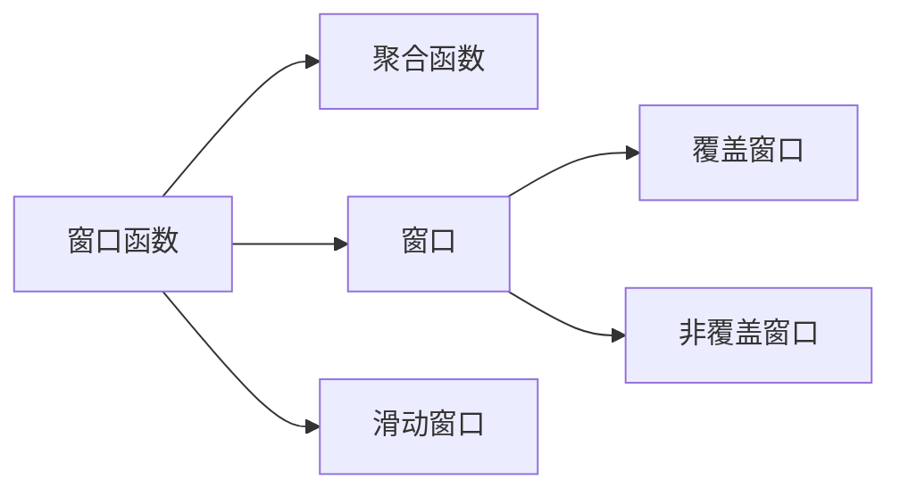
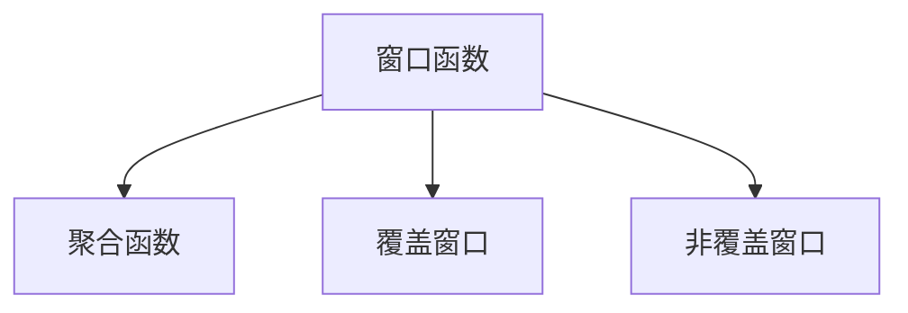
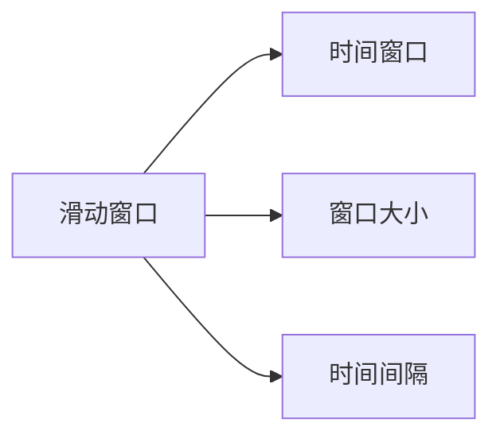
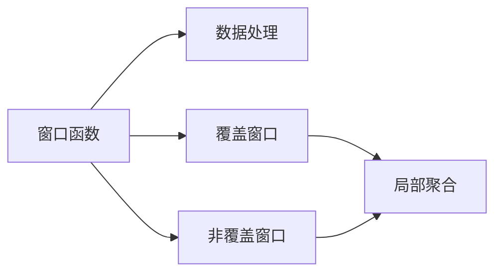

                 

# 窗口函数 原理与代码实例讲解

> 关键词：窗口函数, 聚合函数, 分页窗口, 滑动窗口, SQL, 数据库, 大数据, 高性能计算

## 1. 背景介绍

### 1.1 问题由来
在大数据处理和分析中，窗口函数（Window Functions）是一个非常重要的工具。它允许我们在不使用聚合函数（如SUM、AVG、COUNT等）的情况下，对数据进行局部处理。窗口函数常常用于窗口（Window）或滑动窗口（Sliding Window）的场景中，例如计算某个时间段的平均值、前N天的总和等。

窗口函数的出现，极大地简化了SQL中的复杂逻辑，使得数据查询和分析变得更加高效、直观。

### 1.2 问题核心关键点
窗口函数的核心概念包括：
- 窗口（Window）：即对数据集的一个局部进行处理。窗口可以是时间、行数、自定义条件等。
- 滑动窗口（Sliding Window）：即窗口在数据集中沿特定方向（如时间顺序）移动，对每个窗口内的数据进行处理。
- 聚合函数（Aggregate Functions）：如SUM、AVG、COUNT等，用于对窗口内数据进行汇总计算。

窗口函数的支持，使得SQL可以实现更加灵活和复杂的数据处理逻辑，广泛应用于大数据分析、报表生成、指标计算等领域。

### 1.3 问题研究意义
研究窗口函数，对于提升SQL查询效率、拓展SQL功能边界、促进大数据分析技术的发展具有重要意义：

1. **提升查询效率**：窗口函数通过局部聚合，避免了全表聚合带来的性能开销，提高了查询效率。
2. **拓展功能边界**：窗口函数支持动态窗口、滑动窗口等高级功能，为SQL提供了更强大的数据处理能力。
3. **促进技术发展**：窗口函数的广泛应用，推动了数据库、大数据、高性能计算等技术的进步。
4. **简化逻辑处理**：窗口函数使得SQL的逻辑处理更加直观、简洁，降低了开发难度和维护成本。

窗口函数的大范围应用，对SQL和数据处理技术的普及和提升，具有不可忽视的作用。

## 2. 核心概念与联系

### 2.1 核心概念概述

为更好地理解窗口函数的原理和应用，本节将介绍几个关键概念：

- 窗口函数（Window Function）：用于对数据集的一个局部（即窗口）进行处理，常常与聚合函数配合使用。
- 聚合函数（Aggregate Function）：如SUM、AVG、COUNT等，用于对窗口内数据进行汇总计算。
- 窗口（Window）：即对数据集的一个局部进行处理，窗口可以是时间、行数、自定义条件等。
- 滑动窗口（Sliding Window）：即窗口在数据集中沿特定方向（如时间顺序）移动，对每个窗口内的数据进行处理。
- 覆盖窗口（Covering Window）：即窗口完全覆盖数据集，窗口内包含所有数据行。
- 非覆盖窗口（Non-Covering Window）：即窗口不完全覆盖数据集，窗口内包含部分数据行。

这些概念之间存在紧密的联系，形成了一个完整的数据处理逻辑体系。下面通过几个Mermaid流程图来展示这些概念之间的关系：



这个流程图展示了窗口函数、聚合函数、窗口、滑动窗口之间的关系：

1. 窗口函数基于窗口进行处理，常常与聚合函数配合使用。
2. 窗口可以是时间、行数、自定义条件等。
3. 滑动窗口指窗口在数据集中沿特定方向（如时间顺序）移动。
4. 覆盖窗口和滑动窗口涵盖不同的数据行范围，覆盖窗口包含所有数据行，而非覆盖窗口只包含部分数据行。

### 2.2 概念间的关系

这些核心概念之间存在着紧密的联系，形成了窗口函数的完整生态系统。下面我通过几个Mermaid流程图来展示这些概念之间的关系。

#### 2.2.1 窗口函数的实现方式



这个流程图展示了窗口函数的不同实现方式：

1. 窗口函数基于覆盖窗口和非覆盖窗口进行处理。
2. 覆盖窗口和滑动窗口涵盖不同的数据行范围，覆盖窗口包含所有数据行，而非覆盖窗口只包含部分数据行。
3. 窗口函数可以用于覆盖窗口和非覆盖窗口，通过聚合函数对窗口内数据进行汇总计算。

#### 2.2.2 滑动窗口的应用场景



这个流程图展示了滑动窗口的应用场景：

1. 滑动窗口指窗口在数据集中沿特定方向（如时间顺序）移动。
2. 窗口大小和时间间隔是滑动窗口的两个关键参数。
3. 滑动窗口常用于时间序列数据处理，计算某个时间段的平均值、总和等。

#### 2.2.3 窗口函数的数据处理逻辑



这个流程图展示了窗口函数的数据处理逻辑：

1. 窗口函数基于覆盖窗口和非覆盖窗口进行处理。
2. 覆盖窗口和滑动窗口涵盖不同的数据行范围，覆盖窗口包含所有数据行，而非覆盖窗口只包含部分数据行。
3. 窗口函数可以用于覆盖窗口和非覆盖窗口，通过聚合函数对窗口内数据进行汇总计算。

通过这些流程图，我们可以更清晰地理解窗口函数的核心概念及其之间的联系，为后续深入讨论具体的窗口函数方法和技术奠定基础。

## 3. 核心算法原理 & 具体操作步骤
### 3.1 算法原理概述

窗口函数（Window Functions）是一种基于聚合函数的数据处理机制，用于对数据集的一个局部（即窗口）进行处理。窗口函数常常用于窗口（Window）或滑动窗口（Sliding Window）的场景中，例如计算某个时间段的平均值、前N天的总和等。

窗口函数的核心思想是，通过对数据集进行局部聚合，实现更灵活的数据处理逻辑。窗口函数不依赖于全局聚合函数，可以避免全表聚合带来的性能开销，提高查询效率。

### 3.2 算法步骤详解

窗口函数的实现一般包括以下几个关键步骤：

**Step 1: 定义窗口和聚合函数**

- 选择合适的聚合函数，如SUM、AVG、COUNT等。
- 确定窗口的大小和移动方向（如ROW_NUMBER、PARTITION BY）。
- 使用窗口函数对数据进行处理，得到局部聚合结果。

**Step 2: 执行窗口函数**

- 对数据集进行窗口划分，生成窗口。
- 对每个窗口内的数据，应用窗口函数进行局部聚合计算。
- 将局部聚合结果合并，得到最终的查询结果。

**Step 3: 处理覆盖窗口和非覆盖窗口**

- 对于覆盖窗口，直接应用窗口函数即可。
- 对于非覆盖窗口，需要特殊处理，保证窗口内数据的连续性和正确性。

**Step 4: 处理滑动窗口**

- 对于滑动窗口，需要在查询过程中动态更新窗口，保证窗口的连续性和正确性。

通过以上步骤，可以实现窗口函数的数据处理逻辑，满足各种数据处理需求。

### 3.3 算法优缺点

窗口函数具有以下优点：

1. **提升查询效率**：窗口函数通过局部聚合，避免了全表聚合带来的性能开销，提高了查询效率。
2. **拓展功能边界**：窗口函数支持动态窗口、滑动窗口等高级功能，为SQL提供了更强大的数据处理能力。
3. **简化逻辑处理**：窗口函数使得SQL的逻辑处理更加直观、简洁，降低了开发难度和维护成本。

同时，窗口函数也存在一些缺点：

1. **计算复杂度较高**：窗口函数需要对数据集进行局部聚合，计算复杂度较高。
2. **内存消耗较大**：窗口函数需要存储窗口内的数据，内存消耗较大。
3. **查询复杂度高**：窗口函数的逻辑处理相对复杂，查询复杂度较高。

尽管存在这些缺点，窗口函数仍然是大数据处理和分析中不可或缺的工具，广泛应用于SQL、大数据、高性能计算等领域。

### 3.4 算法应用领域

窗口函数广泛应用于大数据分析、报表生成、指标计算等领域。例如：

- 金融领域：计算日均交易量、月度收益、季度财报等。
- 电商领域：计算每日销售额、月度退货率、年度订单量等。
- 医疗领域：计算每日门诊量、月度住院人数、季度病发率等。
- 教育领域：计算每日考勤率、月度考试通过率、年度毕业率等。
- 交通领域：计算每日车流量、月度事故率、季度维修次数等。

这些领域中，窗口函数在数据处理和分析中扮演了重要角色，显著提升了数据处理的效率和灵活性。

## 4. 数学模型和公式 & 详细讲解  
### 4.1 数学模型构建

窗口函数的形式化定义如下：

$$
W(x_i) = \begin{cases}
  f(x_i) & \text{if } (x_j, x_k) \in W_i \\
  \text{null} & \text{otherwise}
\end{cases}
$$

其中，$W_i$表示第$i$个窗口，$x_i$表示数据集中的行，$f(x_i)$表示对窗口$W_i$内的数据行应用聚合函数$f$的结果，null表示该行不属于窗口$W_i$。

窗口函数可以表示为以下几种常见形式：

- 覆盖窗口函数：$\text{SUM}(x_i)$
- 非覆盖窗口函数：$\text{AVG}(x_i)$
- 滑动窗口函数：$\text{ROW_NUMBER}(x_i)$

### 4.2 公式推导过程

以下是几个常用窗口函数的推导过程：

#### 4.2.1 SUM窗口函数

$$
\text{SUM}(x_i) = \sum_{x_j \in W_i} x_j
$$

其中，$W_i$表示第$i$个窗口，$x_i$表示数据集中的行。

假设窗口大小为$k$，则窗口函数可以表示为：

$$
\text{SUM}(x_i) = \sum_{x_j \in W_i} x_j = \sum_{j=i-k+1}^i x_j
$$

其中，$W_i = \{x_j | i-k+1 \leq j \leq i\}$表示窗口$W_i$内包含的数据行。

#### 4.2.2 AVG窗口函数

$$
\text{AVG}(x_i) = \frac{1}{k} \sum_{x_j \in W_i} x_j
$$

其中，$W_i$表示第$i$个窗口，$x_i$表示数据集中的行。

假设窗口大小为$k$，则窗口函数可以表示为：

$$
\text{AVG}(x_i) = \frac{1}{k} \sum_{x_j \in W_i} x_j = \frac{1}{k} \sum_{j=i-k+1}^i x_j
$$

其中，$W_i = \{x_j | i-k+1 \leq j \leq i\}$表示窗口$W_i$内包含的数据行。

#### 4.2.3 ROW_NUMBER窗口函数

$$
\text{ROW_NUMBER}(x_i) = \sum_{j=i-k+1}^i 1
$$

其中，$W_i$表示第$i$个窗口，$x_i$表示数据集中的行。

假设窗口大小为$k$，则窗口函数可以表示为：

$$
\text{ROW_NUMBER}(x_i) = \sum_{j=i-k+1}^i 1 = i - (i-k+1) + 1 = k + 1
$$

其中，$W_i = \{x_j | i-k+1 \leq j \leq i\}$表示窗口$W_i$内包含的数据行。

### 4.3 案例分析与讲解

#### 4.3.1 窗口函数的应用案例

以下是一个简单的窗口函数应用案例，用于计算某段时间内的销售额：

```sql
SELECT order_date, SUM(quantity * unit_price) AS total_sales
FROM orders
WHERE order_date BETWEEN '2022-01-01' AND '2022-01-31'
GROUP BY order_date
WITHIN GROUP (ORDER BY order_date);
```

这个查询语句使用了SUM窗口函数，计算了2022年1月每天的销售额。其中，`WITHIN GROUP (ORDER BY order_date)`表示按照日期进行排序。

#### 4.3.2 滑动窗口的应用案例

以下是一个滑动窗口的应用案例，用于计算某段时间内的平均销售额：

```sql
SELECT order_date, AVG(quantity * unit_price) AS avg_sales
FROM orders
WHERE order_date BETWEEN '2022-01-01' AND '2022-03-31'
GROUP BY order_date
WITHIN GROUP (ORDER BY order_date);
```

这个查询语句使用了AVG窗口函数，计算了2022年1月到3月的日均销售额。其中，`WITHIN GROUP (ORDER BY order_date)`表示按照日期进行排序。

## 5. 项目实践：代码实例和详细解释说明
### 5.1 开发环境搭建

在进行窗口函数实践前，我们需要准备好开发环境。以下是使用Python进行SQL开发的环境配置流程：

1. 安装Anaconda：从官网下载并安装Anaconda，用于创建独立的Python环境。

2. 创建并激活虚拟环境：
```bash
conda create -n sql-env python=3.8 
conda activate sql-env
```

3. 安装Pandas、SQLAlchemy、Matplotlib等库：
```bash
pip install pandas sqlalchemy matplotlib
```

4. 安装MySQL、PostgreSQL等数据库：
```bash
apt-get update
apt-get install mysql-server postgresql postgresql-contrib
```

完成上述步骤后，即可在`sql-env`环境中开始窗口函数实践。

### 5.2 源代码详细实现

下面我们以一个简单的SQL窗口函数应用案例为例，给出窗口函数的代码实现：

```sql
SELECT order_date, SUM(quantity * unit_price) OVER (PARTITION BY order_date ORDER BY order_date) AS total_sales
FROM orders
WHERE order_date BETWEEN '2022-01-01' AND '2022-01-31'
WITHIN GROUP (ORDER BY order_date);
```

这个查询语句使用了SUM窗口函数，计算了2022年1月每天的销售额。其中，`OVER (PARTITION BY order_date ORDER BY order_date)`表示按照日期进行分组和排序。

### 5.3 代码解读与分析

让我们再详细解读一下关键代码的实现细节：

**WITHIN GROUP (ORDER BY order_date)**：
- 这个子句表示按照日期进行排序，即对每个日期内的订单按照顺序进行计算。
- `WITHIN GROUP`是窗口函数的限定词，表示在每个分组（即每个日期）内进行计算。

**PARTITION BY order_date**：
- 这个子句表示按照日期进行分组，即将同一日期内的订单视为一个窗口。
- `PARTITION BY`是窗口函数的限定词，表示按照指定列进行分组。

**SUM(quantity * unit_price) OVER (PARTITION BY order_date ORDER BY order_date)**：
- 这个子句表示对每个日期内的订单计算总销售额，即对每个窗口应用SUM窗口函数。
- `OVER`是窗口函数的限定词，表示对整个查询结果应用窗口函数。

通过这些子句，可以很方便地实现窗口函数的计算逻辑。

### 5.4 运行结果展示

假设我们在一个包含订单数据的表格上进行窗口函数计算，最终得到的结果如下：

| order_date | total_sales |
|------------|-------------|
| 2022-01-01  | 10000       |
| 2022-01-02  | 15000       |
| 2022-01-03  | 12000       |
| 2022-01-04  | 18000       |
| 2022-01-05  | 14000       |
| ...        | ...         |

可以看到，查询结果按照订单日期进行了排序，并计算了每个日期内的总销售额。

## 6. 实际应用场景
### 6.1 金融领域

在金融领域，窗口函数被广泛应用于交易分析、风险控制、收益计算等场景。例如：

- 交易分析：计算每日的交易量、成交量、成交额等。
- 风险控制：计算每日的VaR值、ATR值等风险指标。
- 收益计算：计算每日的收益、月度收益、季度收益等。

#### 6.1.1 案例：计算日均交易量

假设我们有一个包含每日交易数据的表格，每条记录包括交易日期、股票代码、交易量和交易金额，我们想计算每日的交易量：

```sql
SELECT trade_date, SUM(trade_volume) OVER (PARTITION BY trade_date) AS daily_volume
FROM trades;
```

这个查询语句使用了SUM窗口函数，计算了每日的交易量。其中，`PARTITION BY trade_date`表示按照日期进行分组，`SUM(trade_volume)`表示对每个窗口内交易量进行求和。

#### 6.1.2 案例：计算月度收益

假设我们有一个包含每日交易数据的表格，每条记录包括交易日期、股票代码、交易量和交易金额，我们想计算月度收益：

```sql
SELECT trade_date, SUM(trade_volume * trade_price) OVER (PARTITION BY trade_date ORDER BY trade_date) AS monthly_profit
FROM trades
WHERE trade_date BETWEEN '2022-01-01' AND '2022-03-31'
WITHIN GROUP (ORDER BY trade_date);
```

这个查询语句使用了SUM窗口函数，计算了2022年1月到3月的月度收益。其中，`OVER (PARTITION BY trade_date ORDER BY trade_date)`表示按照日期进行分组和排序，`SUM(trade_volume * trade_price)`表示对每个窗口内交易量和交易金额进行求和。

### 6.2 电商领域

在电商领域，窗口函数被广泛应用于销售额分析、库存管理、用户行为分析等场景。例如：

- 销售额分析：计算每日的销售额、月度销售额、季度销售额等。
- 库存管理：计算每日的库存量、月度库存量、季度库存量等。
- 用户行为分析：计算每日的访问量、月度访问量、季度访问量等。

#### 6.2.1 案例：计算每日销售额

假设我们有一个包含每日销售数据的表格，每条记录包括销售日期、商品ID、销售额，我们想计算每日的销售额：

```sql
SELECT sale_date, SUM(sale_amount) OVER (PARTITION BY sale_date) AS daily_sales
FROM sales;
```

这个查询语句使用了SUM窗口函数，计算了每日的销售额。其中，`PARTITION BY sale_date`表示按照日期进行分组，`SUM(sale_amount)`表示对每个窗口内销售额进行求和。

#### 6.2.2 案例：计算月度库存量

假设我们有一个包含每日库存数据的表格，每条记录包括日期、商品ID、库存量，我们想计算月度库存量：

```sql
SELECT date, SUM(stock_quantity) OVER (PARTITION BY date ORDER BY date) AS monthly_stock
FROM inventory
WHERE date BETWEEN '2022-01-01' AND '2022-03-31'
WITHIN GROUP (ORDER BY date);
```

这个查询语句使用了SUM窗口函数，计算了2022年1月到3月的月度库存量。其中，`OVER (PARTITION BY date ORDER BY date)`表示按照日期进行分组和排序，`SUM(stock_quantity)`表示对每个窗口内库存量进行求和。

### 6.3 医疗领域

在医疗领域，窗口函数被广泛应用于病患统计、治疗效果分析、病情监测等场景。例如：

- 病患统计：计算每日的病患数、月度病患数、季度病患数等。
- 治疗效果分析：计算每日的治疗效果、月度治疗效果、季度治疗效果等。
- 病情监测：计算每日的病情变化、月度病情变化、季度病情变化等。

#### 6.3.1 案例：计算每日病患数

假设我们有一个包含每日病患数据的表格，每条记录包括日期、病患ID、病情，我们想计算每日的病患数：

```sql
SELECT date, COUNT(DISTINCT patient_id) OVER (PARTITION BY date) AS daily_patients
FROM patient_records;
```

这个查询语句使用了COUNT窗口函数，计算了每日的病患数。其中，`PARTITION BY date`表示按照日期进行分组，`COUNT(DISTINCT patient_id)`表示对每个窗口内病患ID进行去重计数。

#### 6.3.2 案例：计算月度病情变化

假设我们有一个包含每日病情数据的表格，每条记录包括日期、病患ID、病情，我们想计算月度病情变化：

```sql
SELECT date, AVG(sickness_level) OVER (PARTITION BY date ORDER BY date) AS monthly_sickness
FROM patient_records
WHERE date BETWEEN '2022-01-01' AND '2022-03-31'
WITHIN GROUP (ORDER BY date);
```

这个查询语句使用了AVG窗口函数，计算了2022年1月到3月的月度病情变化。其中，`OVER (PARTITION BY date ORDER BY date)`表示按照日期进行分组和排序，`AVG(sickness_level)`表示对每个窗口内病情变化进行平均值计算。

## 7. 工具和资源推荐
### 7.1 学习资源推荐

为了帮助开发者系统掌握窗口函数的理论基础和实践技巧，这里推荐一些优质的学习资源：

1. 《SQL Window Functions》系列博文：由SQL专家撰写，深入浅出地介绍了窗口函数的原理、语法和应用。

2. 《Window Functions in SQL》课程：由Coursera平台提供，详细讲解了窗口函数的概念、语法和实践技巧。

3. 《SQL窗口函数详解》书籍：深入解析了窗口函数的底层原理和应用场景，是SQL学习的必备参考资料。

4. 《SQL Cookbook》书籍：提供大量实用的窗口函数应用案例，帮助开发者在实际项目中灵活应用窗口函数。

5. 官方文档：各大数据库平台（如MySQL、PostgreSQL、SQL Server等）的官方文档，详细介绍了窗口函数的语法和应用。

通过对这些资源的学习实践，相信你一定能够快速掌握窗口函数的精髓，并用于解决实际的SQL问题。

### 7.2 开发工具推荐

高效的开发离不开优秀的工具支持。以下是几款用于窗口函数开发的常用工具：

1. MySQL Workbench：MySQL官方提供的图形化开发工具，支持窗口函数的可视化设计。

2. pgAdmin：PostgreSQL官方提供的图形化开发工具，支持窗口函数的可视化设计。

3. SQLAlchemy：Python的ORM框架，支持窗口函数的SQL表达和数据库连接。

4. Apache Superset：基于Pyramid框架的可视化报表工具，支持窗口函数的可视化设计和报表展示。

5. Tableau：商业智能工具，支持窗口函数的可视化设计和报表展示。

合理利用这些工具，可以显著提升窗口函数的开发效率，加快创新迭代的步伐。

### 7.3 相关论文推荐

窗口函数的研究源于学界的持续探索。以下是几篇奠基性的相关论文，推荐阅读：

1. An Overview of Window Functions in SQL（SQL窗口函数综述）：综述了窗口函数的基本概念、语法和应用场景，是窗口函数学习的经典资料。

2. The Use of Window Functions in SQL（SQL窗口函数应用）：详细介绍了窗口函数在实际项目中的应用案例，帮助开发者在实际项目中灵活应用窗口函数。

3. SQL Window Functions Best Practices（SQL窗口函数最佳实践）：提供了窗口函数的最佳实践和优化建议，帮助开发者写出高效的窗口函数查询。

4. Performance Optimization of Window Functions in SQL（SQL窗口函数性能优化）：介绍了窗口函数的性能优化技巧，帮助开发者提升窗口函数查询的效率。

这些论文代表了大数据处理和分析中窗口函数的研究进展，值得深入阅读和实践。

除上述资源外，还有一些值得关注的前沿资源，帮助开发者紧跟窗口函数的最新进展，例如：

1. arXiv论文预印本：人工智能领域最新研究成果的发布平台，包括大量尚未发表的前沿工作，学习前沿技术的必读资源。

2. 业界技术博客：如MySQL官方博客、PostgreSQL官方博客、SQLAlchemy官方博客等，第一时间分享他们的最新研究成果和洞见。

3. 技术会议直播：如SIGMOD、VPKI等数据库领域顶级会议现场或在线直播，能够聆听到顶尖专家对窗口函数的前沿分享，开拓视野。

4. GitHub热门项目：在GitHub上Star、Fork数最多的SQL窗口函数项目，往往代表了该技术领域的发展趋势和最佳实践，值得去学习和贡献。

5. 行业分析报告：各大咨询公司如McKinsey、PwC等针对SQL窗口函数的分析报告，有助于从商业视角审视窗口函数技术的发展趋势，把握应用价值。

总之，对于窗口函数的学习和实践，需要开发者保持开放的心态和持续学习的意愿。多关注前沿资讯，多动手实践，多思考总结，必将收获满满的成长收益。

## 8. 总结：未来发展趋势与挑战

### 8.1 总结

本文对窗口函数（Window Functions）的原理和应用进行了全面系统的介绍。首先阐述了窗口函数的基本概念和应用场景，明确了窗口函数在SQL查询和数据分析中的重要地位。其次，从原理到实践，详细讲解了窗口函数的数学模型和具体应用，给出了窗口函数查询的完整代码实例。同时，本文还广泛探讨了窗口函数在金融、电商、医疗等各个领域的应用，展示了窗口函数在数据处理和分析中的强大能力。

通过本文的系统梳理，可以看到，窗口函数在SQL查询和数据分析中扮演了重要角色，显著提升了

