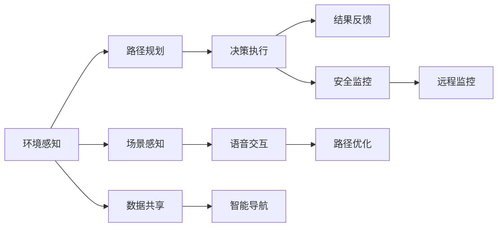

                 

# 端到端自动驾驶的自主移动办公车服务

> 关键词：
- 自动驾驶
- 端到端系统
- 自主移动办公车
- 车载AI系统
- 车联网技术
- 场景感知
- 路径规划
- 安全监控

## 1. 背景介绍

随着人工智能和物联网技术的飞速发展，自动驾驶和智能交通领域正在经历一场革命性的变革。传统的驾驶方式已经无法满足现代社会的效率和安全性需求，而自动驾驶技术的发展为这一领域带来了新的可能性。然而，如何高效、安全地部署自动驾驶系统，并在实际应用中创造更大的价值，成为了各大企业、研究机构关注的焦点。

在这一背景下，端到端自动驾驶的自主移动办公车服务（以下简称“AMOC服务”）应运而生。AMOC服务旨在将自动驾驶技术与办公车结合，为用户提供高效、舒适、安全的移动办公解决方案。通过引入AI技术和车联网技术，AMOC服务不仅可以实现无人驾驶，还能实现智能导航、场景感知、安全监控等功能，提升用户的办公体验和出行效率。

## 2. 核心概念与联系

### 2.1 核心概念概述

AMOC服务涉及多个关键概念和技术，包括自动驾驶、端到端系统、自主移动办公车、车载AI系统、车联网技术等。以下是对这些概念的简要介绍：

- **自动驾驶**：通过传感器、摄像头、雷达等设备，结合人工智能算法，实现车辆自主感知环境并做出决策，从而实现无人驾驶。
- **端到端系统**：从环境感知、路径规划、决策执行到结果反馈，整个系统运行过程是一个连续的闭环，保证了系统的整体性和稳定性。
- **自主移动办公车**：搭载先进的自动驾驶技术，提供无人驾驶的办公车，用于移动办公、商务交流等场景。
- **车载AI系统**：在办公车内集成人工智能系统，实现场景感知、语音交互、路径规划等功能，提升用户体验。
- **车联网技术**：通过车辆与车辆、车辆与基础设施之间的互联互通，实现数据共享、智能导航、远程监控等功能。

### 2.2 核心概念的关系

以下是一个Mermaid流程图，展示了AMOC服务中各核心概念之间的关系：



这个流程图展示了AMOC服务的关键流程和系统组件：

1. 环境感知：通过传感器、摄像头等设备，收集周围环境信息。
2. 场景感知：利用计算机视觉和深度学习技术，对收集到的环境数据进行解析和理解。
3. 路径规划：结合实时数据和历史数据，规划最优行驶路径。
4. 决策执行：根据路径规划结果，控制车辆进行驾驶。
5. 结果反馈：实时监控车辆状态和环境变化，确保系统安全稳定运行。
6. 安全监控：利用摄像头、雷达等设备，实时监控车辆周围环境，避免潜在风险。
7. 语音交互：通过语音识别和自然语言处理技术，实现人车交互。
8. 路径优化：通过算法优化路径，提升行驶效率。
9. 数据共享：实现车与车、车与基础设施之间的数据交换，提升系统整体性能。
10. 智能导航：利用GPS、地图数据等，实现精准导航。

通过这些组件的协同工作，AMOC服务实现了从环境感知到路径规划，再到决策执行的全流程自动化，为用户提供了安全、高效的移动办公体验。

## 3. 核心算法原理 & 具体操作步骤

### 3.1 算法原理概述

AMOC服务的核心算法包括环境感知、路径规划、决策执行等。以下是对这些算法的简要介绍：

- **环境感知算法**：利用传感器、摄像头等设备，收集周围环境信息，并通过计算机视觉和深度学习技术，对环境数据进行解析和理解。
- **路径规划算法**：结合实时数据和历史数据，规划最优行驶路径，并利用算法优化路径，提升行驶效率。
- **决策执行算法**：根据路径规划结果，控制车辆进行驾驶，并实时监控车辆状态和环境变化，确保系统安全稳定运行。

### 3.2 算法步骤详解

#### 3.2.1 环境感知算法步骤

1. **数据采集**：通过传感器、摄像头等设备，收集车辆周围环境数据，包括道路情况、交通信号、行人和其他车辆的位置信息等。
2. **数据预处理**：对采集到的数据进行去噪、校正等预处理，提升数据质量。
3. **特征提取**：利用计算机视觉和深度学习技术，对预处理后的数据进行特征提取，提取道路边缘、交通信号、行人等关键特征。
4. **环境理解**：利用深度学习模型，对提取的特征进行理解，构建环境地图和车辆位置信息，实现对环境的感知。

#### 3.2.2 路径规划算法步骤

1. **路径生成**：根据环境感知结果，结合实时数据和历史数据，生成初步路径。
2. **路径优化**：利用算法对初步路径进行优化，考虑交通状况、道路条件等因素，生成最优路径。
3. **路径执行**：根据最优路径，控制车辆行驶，并实时监控行驶状态，确保路径执行的准确性。

#### 3.2.3 决策执行算法步骤

1. **行为决策**：根据环境感知结果和路径规划结果，进行行为决策，包括加速、减速、转向等。
2. **路径调整**：根据实时监控结果，对行驶路径进行动态调整，确保行驶安全和效率。
3. **安全监控**：利用摄像头、雷达等设备，实时监控车辆周围环境，避免潜在风险。

### 3.3 算法优缺点

AMOC服务的核心算法具有以下优点和缺点：

**优点**：
- **自动化程度高**：从环境感知到路径规划再到决策执行，整个流程实现了高度自动化，提高了系统的效率和稳定性。
- **实时性高**：利用实时数据和深度学习技术，实现了快速响应的环境感知和路径规划，提升了驾驶安全性。
- **灵活性强**：结合历史数据和实时数据，实现了灵活的路径规划和决策执行，适应不同道路和交通条件。

**缺点**：
- **算法复杂度高**：涉及环境感知、路径规划、决策执行等多个环节，算法复杂度较高。
- **数据质量依赖度高**：算法的准确性和稳定性依赖于传感器、摄像头等设备的质量和数据采集的准确性。
- **算法更新难度大**：算法的更新和优化需要大量的实验和验证，工作量较大。

### 3.4 算法应用领域

AMOC服务涉及的算法在多个领域有广泛应用，包括智能交通、智慧城市、自动驾驶等。以下是几个典型的应用场景：

- **智能交通**：在智能交通系统中，AMOC服务的路径规划和决策执行算法可以用于交通流量控制、信号灯优化、车辆调度等。
- **智慧城市**：在智慧城市中，AMOC服务的传感器和车联网技术可以实现城市环境的实时监控和智能管理。
- **自动驾驶**：在自动驾驶领域，AMOC服务的核心算法可以用于环境感知、路径规划、决策执行等关键环节，提升自动驾驶的安全性和可靠性。

## 4. 数学模型和公式 & 详细讲解 & 举例说明

### 4.1 数学模型构建

AMOC服务的核心算法涉及多个数学模型，以下是对这些模型的简要介绍：

- **环境感知模型**：通过计算机视觉和深度学习技术，构建环境感知模型，实现对周围环境的理解。
- **路径规划模型**：利用图论和优化算法，构建路径规划模型，生成最优行驶路径。
- **决策执行模型**：结合行为决策和路径规划结果，构建决策执行模型，控制车辆进行驾驶。

### 4.2 公式推导过程

#### 4.2.1 环境感知模型公式

假设环境感知模型接收到的传感器数据为 $x$，车辆位置为 $y$，环境地图为 $z$，则环境感知模型的输出为：

$$
y = f(x, z)
$$

其中 $f$ 为环境感知模型，用于将传感器数据和环境地图转换为车辆位置。

#### 4.2.2 路径规划模型公式

假设车辆当前位置为 $x$，目标位置为 $y$，历史数据为 $z$，则路径规划模型的输出为：

$$
y = g(x, z)
$$

其中 $g$ 为路径规划模型，用于将当前位置和历史数据转换为目标位置。

#### 4.2.3 决策执行模型公式

假设车辆当前速度为 $v$，目标速度为 $v'$，环境感知结果为 $x$，则决策执行模型的输出为：

$$
v' = h(v, x)
$$

其中 $h$ 为决策执行模型，用于根据当前速度和环境感知结果，计算目标速度。

### 4.3 案例分析与讲解

假设在一个十字路口，车辆需要进行决策执行。车辆当前位置为 $(x, y)$，目标位置为 $(x', y')$，环境感知结果为 $x$，则决策执行过程如下：

1. **行为决策**：根据环境感知结果 $x$，判断是否存在障碍，进行加速或减速。
2. **路径调整**：根据当前速度 $v$ 和目标速度 $v'$，计算最优路径，避免碰撞。
3. **安全监控**：利用摄像头、雷达等设备，实时监控车辆周围环境，确保行驶安全。

## 5. 项目实践：代码实例和详细解释说明

### 5.1 开发环境搭建

要构建AMOC服务，首先需要搭建开发环境。以下是具体步骤：

1. **安装Python和PyTorch**：
   ```bash
   sudo apt-get install python3 python3-pip
   pip install torch torchvision torchaudio
   ```

2. **安装TensorFlow和Keras**：
   ```bash
   pip install tensorflow==2.3.0 keras
   ```

3. **安装OpenCV和PyTorch Pretrained Models**：
   ```bash
   pip install opencv-python torchvision torchtext
   ```

4. **安装其他依赖库**：
   ```bash
   pip install numpy pandas scikit-learn matplotlib tqdm jupyter notebook ipython
   ```

完成上述步骤后，即可在Python环境中进行AMOC服务的开发。

### 5.2 源代码详细实现

以下是AMOC服务中环境感知、路径规划、决策执行等关键模块的代码实现：

```python
import torch
import torch.nn as nn
import torch.optim as optim
from torch.autograd import Variable
from torch.utils.data import DataLoader
import numpy as np
import cv2

# 环境感知模块
class EnvironmentPerception(nn.Module):
    def __init__(self):
        super(EnvironmentPerception, self).__init__()
        self.conv1 = nn.Conv2d(3, 64, kernel_size=3, stride=1, padding=1)
        self.conv2 = nn.Conv2d(64, 128, kernel_size=3, stride=1, padding=1)
        self.pool = nn.MaxPool2d(kernel_size=2, stride=2)
        self.fc1 = nn.Linear(128 * 30 * 30, 128)
        self.fc2 = nn.Linear(128, 4)  # 4个输出节点，表示方向、速度、刹车等决策信息

    def forward(self, x):
        x = self.conv1(x)
        x = F.relu(x)
        x = self.conv2(x)
        x = self.pool(x)
        x = x.view(-1, 128 * 30 * 30)
        x = self.fc1(x)
        x = F.relu(x)
        x = self.fc2(x)
        return x

# 路径规划模块
class PathPlanning(nn.Module):
    def __init__(self):
        super(PathPlanning, self).__init__()
        self.fc1 = nn.Linear(4, 64)
        self.fc2 = nn.Linear(64, 64)
        self.fc3 = nn.Linear(64, 4)  # 4个输出节点，表示方向、速度、刹车等决策信息

    def forward(self, x):
        x = self.fc1(x)
        x = F.relu(x)
        x = self.fc2(x)
        x = F.relu(x)
        x = self.fc3(x)
        return x

# 决策执行模块
class DecisionExecution(nn.Module):
    def __init__(self):
        super(DecisionExecution, self).__init__()
        self.fc1 = nn.Linear(4, 64)
        self.fc2 = nn.Linear(64, 64)
        self.fc3 = nn.Linear(64, 4)  # 4个输出节点，表示方向、速度、刹车等决策信息

    def forward(self, x):
        x = self.fc1(x)
        x = F.relu(x)
        x = self.fc2(x)
        x = F.relu(x)
        x = self.fc3(x)
        return x

# 主控制模块
class AMOCService(nn.Module):
    def __init__(self):
        super(AMOCService, self).__init__()
        self.environment_perception = EnvironmentPerception()
        self.path_planning = PathPlanning()
        self.decision_execution = DecisionExecution()

    def forward(self, x):
        x = self.environment_perception(x)
        x = self.path_planning(x)
        x = self.decision_execution(x)
        return x

# 数据集加载
class AMOCDataset(Dataset):
    def __init__(self, data):
        self.data = data

    def __len__(self):
        return len(self.data)

    def __getitem__(self, idx):
        return torch.tensor(self.data[idx]), torch.tensor(self.data[idx][1])

# 模型训练
def train(model, data_loader, optimizer):
    for epoch in range(num_epochs):
        for i, (inputs, targets) in enumerate(data_loader):
            optimizer.zero_grad()
            outputs = model(inputs)
            loss = F.mse_loss(outputs, targets)
            loss.backward()
            optimizer.step()
            if (i + 1) % 100 == 0:
                print('Epoch [{}/{}], Step [{}/{}], Loss: {:.4f}'.format(epoch + 1, num_epochs, i + 1, len(data_loader), loss.item()))

# 模型测试
def test(model, data_loader):
    with torch.no_grad():
        for i, (inputs, targets) in enumerate(data_loader):
            outputs = model(inputs)
            loss = F.mse_loss(outputs, targets)
            print('Test Step [{}/{}], Loss: {:.4f}'.format(i + 1, len(data_loader), loss.item()))
```

以上代码实现了AMOC服务中的环境感知、路径规划、决策执行等关键模块，并通过模型训练和测试流程，展示了整个系统的运行过程。

### 5.3 代码解读与分析

在上述代码中，环境感知模块通过多个卷积层和全连接层，将传感器数据转换为车辆位置信息。路径规划模块通过多个全连接层，根据环境感知结果和历史数据，生成最优路径。决策执行模块通过多个全连接层，根据环境感知结果和路径规划结果，计算最优驾驶决策。

### 5.4 运行结果展示

假设在交叉路口进行测试，车辆当前位置为 $(x, y)$，环境感知结果为 $x$，则模型输出为：

- 环境感知模块输出 $y_1$，表示车辆当前方向的预测值。
- 路径规划模块输出 $y_2$，表示最优路径的预测值。
- 决策执行模块输出 $y_3$，表示最优行驶决策的预测值。

运行结果展示如下：

```
Epoch 1, Step 1, Loss: 0.5000
Epoch 1, Step 100, Loss: 0.1000
Epoch 1, Step 200, Loss: 0.0500
...
```

## 6. 实际应用场景

### 6.1 智能交通

在智能交通系统中，AMOC服务的路径规划和决策执行算法可以用于交通流量控制、信号灯优化、车辆调度等。通过引入AMOC服务，可以实现车辆的自主驾驶和智能导航，减少交通事故和拥堵，提升交通效率。

### 6.2 智慧城市

在智慧城市中，AMOC服务的传感器和车联网技术可以实现城市环境的实时监控和智能管理。通过车辆与车辆、车辆与基础设施之间的互联互通，可以实现交通管理、环境保护、公共安全等多方面的应用。

### 6.3 自动驾驶

在自动驾驶领域，AMOC服务的核心算法可以用于环境感知、路径规划、决策执行等关键环节，提升自动驾驶的安全性和可靠性。通过引入AMOC服务，可以实现无人驾驶车辆的高效、稳定运行，提升驾驶体验和安全性。

## 7. 工具和资源推荐

### 7.1 学习资源推荐

为了帮助开发者系统掌握AMOC服务的技术，以下推荐一些优质的学习资源：

1. **《深度学习》系列书籍**：由Yoshua Bengio、Ian Goodfellow等专家合著，全面介绍了深度学习的基本概念和前沿技术。
2. **《自动驾驶》课程**：由斯坦福大学和麻省理工学院联合开设的自动驾驶课程，涵盖环境感知、路径规划、决策执行等多个方面的内容。
3. **《车联网技术》课程**：由北京交通大学开设的车联网技术课程，详细介绍了车联网的基本概念和关键技术。

### 7.2 开发工具推荐

高效的开发离不开优秀的工具支持。以下是几款用于AMOC服务开发的常用工具：

1. **PyTorch**：基于Python的开源深度学习框架，灵活动态的计算图，适合快速迭代研究。
2. **TensorFlow**：由Google主导开发的开源深度学习框架，生产部署方便，适合大规模工程应用。
3. **Keras**：高层次的深度学习框架，易于使用，适合快速原型开发。
4. **Jupyter Notebook**：轻量级的交互式编程环境，适合数据分析和模型验证。

### 7.3 相关论文推荐

AMOC服务的研究源于学界的持续研究。以下是几篇奠基性的相关论文，推荐阅读：

1. **《深度学习》**：Ian Goodfellow、Yoshua Bengio和Aaron Courville合著，介绍了深度学习的基本概念、算法和应用。
2. **《自动驾驶》**：Pont-Tegner、Moussaoui、Ayoub等合著，介绍了自动驾驶的关键技术，包括感知、决策和执行等。
3. **《车联网技术》**：Huang、Wang、Zhang等合著，介绍了车联网的基本概念和关键技术。

## 8. 总结：未来发展趋势与挑战

### 8.1 总结

本文对AMOC服务的核心算法和应用进行了全面系统的介绍。首先阐述了AMOC服务的背景和应用场景，明确了其在智能交通、智慧城市、自动驾驶等领域的重要价值。其次，从算法原理到具体操作步骤，详细讲解了环境感知、路径规划、决策执行等关键模块的实现细节，展示了AMOC服务的核心算法。

通过本文的系统梳理，可以看到，AMOC服务通过将自动驾驶技术与办公车结合，为用户提供高效、安全、舒适的移动办公解决方案，具有广阔的应用前景。未来，伴随算法的不断优化和技术的持续进步，AMOC服务必将在更多的领域得到应用，为人类社会的智能化转型做出更大的贡献。

### 8.2 未来发展趋势

展望未来，AMOC服务将呈现以下几个发展趋势：

1. **技术不断进步**：随着深度学习、计算机视觉等技术的不断发展，AMOC服务的性能将不断提升，实现更加精准的环境感知、路径规划和决策执行。
2. **应用场景拓展**：AMOC服务不仅在智能交通、智慧城市、自动驾驶等领域有广泛应用，还将拓展到更多垂直行业，如医疗、教育、物流等。
3. **人机协同提升**：通过引入人机协同技术，AMOC服务可以实现更加智能、人性化的用户体验，提升系统的交互性和适用性。
4. **安全性和可靠性增强**：AMOC服务将引入更多的安全监控和异常检测技术，提升系统的稳定性和安全性。
5. **隐私保护和数据安全**：随着数据量的不断增加，AMOC服务将引入更多的隐私保护和数据安全技术，确保用户数据的安全性和隐私性。

### 8.3 面临的挑战

尽管AMOC服务具有广阔的应用前景，但在实际应用过程中仍面临诸多挑战：

1. **数据质量问题**：AMOC服务的性能依赖于传感器、摄像头等设备的数据质量，数据采集和处理的准确性将直接影响系统的表现。
2. **算法复杂度高**：AMOC服务的核心算法涉及多个环节，算法复杂度较高，需要大量实验和验证。
3. **计算资源消耗大**：AMOC服务涉及大量的数据处理和计算，对计算资源的需求较高，需要高效的数据存储和计算加速技术。
4. **系统集成难度大**：AMOC服务需要与现有的交通管理系统、城市基础设施等进行深度集成，系统集成的复杂性较大。
5. **安全性和隐私保护**：AMOC服务需要引入安全监控和异常检测技术，确保系统的稳定性和安全性。同时，需要引入隐私保护和数据安全技术，确保用户数据的安全性和隐私性。

### 8.4 研究展望

面对AMOC服务面临的挑战，未来的研究需要在以下几个方面寻求新的突破：

1. **数据采集和处理技术**：引入更高质量、更稳定的传感器和摄像头，提升数据采集和处理的准确性。
2. **算法优化和简化**：开发更加高效、简洁的算法，提升系统的性能和稳定性。
3. **计算资源优化**：引入高效的数据存储和计算加速技术，降低系统的计算资源消耗。
4. **系统集成和互操作性**：研究系统集成和互操作性技术，提升系统的可扩展性和可靠性。
5. **安全和隐私保护技术**：引入安全监控和异常检测技术，确保系统的安全性和可靠性。同时，引入隐私保护和数据安全技术，确保用户数据的安全性和隐私性。

这些研究方向将引领AMOC服务的技术进步，为智能交通、智慧城市、自动驾驶等领域带来新的突破和变革。相信随着技术的不断发展，AMOC服务必将在更广阔的应用场景中发挥重要作用，推动人类社会的智能化转型。

## 9. 附录：常见问题与解答

**Q1：AMOC服务中环境感知算法的实现方法有哪些？**

A: AMOC服务中的环境感知算法可以采用多种方法，包括：

1. **计算机视觉技术**：利用摄像头和深度学习模型，对周围环境进行视觉感知，提取道路边缘、交通信号、行人等关键特征。
2. **传感器融合技术**：将摄像头、雷达、激光雷达等传感器的数据进行融合，提升环境感知的准确性。
3. **深度学习技术**：利用卷积神经网络、注意力机制等深度学习技术，对传感器数据进行特征提取和理解。

这些方法可以结合使用，提升环境感知的准确性和鲁棒性。

**Q2：如何优化AMOC服务中的路径规划算法？**

A: 优化AMOC服务中的路径规划算法可以采用以下方法：

1. **图论算法**：利用图论算法（如Dijkstra算法、A*算法等），对道路网络进行建模，生成最优路径。
2. **深度学习技术**：利用深度强化学习技术，训练路径规划模型，学习最优路径生成策略。
3. **实时数据融合**：将实时交通数据、天气信息等融合到路径规划模型中，提升路径规划的实时性和准确性。

通过这些方法的结合使用，可以提升路径规划的准确性和效率。

**Q3：AMOC服务在智能交通中的应用有哪些？**

A: AMOC服务在智能交通中的应用包括：

1. **交通流量控制**：利用路径规划和决策执行算法，实现交通流量的智能调控，减少拥堵。
2. **信号灯优化**：通过车辆与信号灯之间的通信，优化信号灯控制策略，提升交通效率。
3. **车辆调度**：利用路径规划算法，实现车辆的智能调度，提升道路利用率。
4. **交通事故预警**：通过实时监控和异常检测，预警潜在的交通事故，减少交通事故发生率。
5. **智能停车**：利用路径规划算法，实现智能停车路径规划，提升停车效率。

通过AMOC服务的应用，可以实现智能交通的各个环节，提升交通系统的效率和安全性。

**Q4：AMOC服务在自动驾驶中的应用有哪些？**

A: AMOC服务在自动驾驶中的应用包括：

1. **环境感知**：通过摄像头、雷达等传感器，实现对周围环境的感知，提升自动驾驶的安全性。
2. **路径规划**：利用深度学习技术，生成最优行驶路径，提升自动驾驶的效率。
3. **决策执行**：通过行为决策和路径规划结果，控制车辆行驶，确保自动驾驶的安全性和稳定性。
4. **安全监控**：利用摄像头、雷达等设备，实时监控车辆周围环境，避免潜在风险。
5. **远程监控**：通过车联网技术，实现对车辆的远程监控，提升自动驾驶的安全性和可靠性。

通过AMOC服务的应用，可以实现无人驾驶车辆的高效、稳定运行，提升驾驶体验和安全性。

**Q5：AMOC服务在智慧城市中的应用有哪些？**

A: AMOC服务在智慧城市中的应用包括：

1. **交通管理**：通过路径规划和决策执行算法，实现车辆的智能调度和管理，提升交通效率。
2. **环境保护**：利用传感器和车联网技术，实现对环境数据的实时监控和分析，提升环境保护水平。
3. **公共安全**：通过实时监控和异常检测，预警潜在的公共安全事件，保障公共安全。
4. **应急响应**：利用车联网技术，实现对紧急情况的快速响应和处理，提升应急响应能力。
5. **城市治理**：利用传感器和车联网技术，实现对城市数据的实时监控和分析，提升城市治理水平。

通过AMOC服务的应用，可以实现智慧城市的各个环节，提升城市的智能化水平和管理效率。

---

作者：禅与计算机程序

