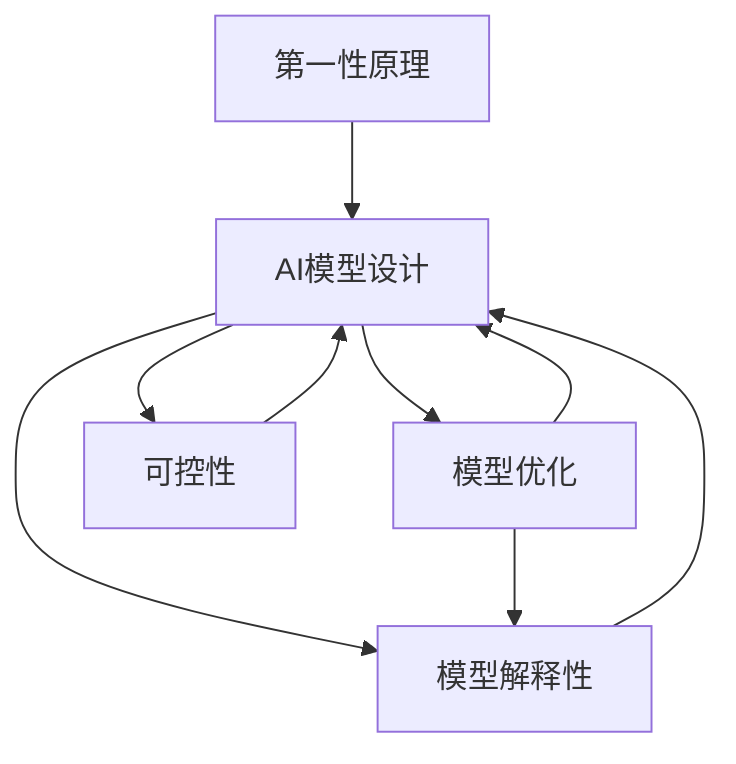

                 

## 1. 背景介绍

第一性原理是指从最根本的原理出发，通过逻辑推导和实验验证得出新的知识或解决问题的方法。在AI领域，第一性原理的应用正日益引起广泛关注，从理论研究到实际工程都有涉及。本文将探讨第一性原理在AI中的关键应用，包括其在模型设计、优化算法、解释性等方面的影响。

### 1.1 问题由来

随着深度学习的不断发展，AI模型变得越来越复杂，许多黑盒模型缺乏可解释性，难以满足应用中的需求。第一性原理提供了一种从基础出发，推导出新方法和算法的方法，有助于解决这些问题。此外，第一性原理还可以指导模型设计和优化，提高模型的泛化能力和效率。

### 1.2 问题核心关键点

本文将重点探讨以下几个核心关键点：
- 第一性原理在AI中的定义和应用
- 基于第一性原理的模型设计和优化方法
- 第一性原理在AI模型解释性和可控性方面的影响
- 第一性原理在AI应用中的实际案例

## 2. 核心概念与联系

### 2.1 核心概念概述

- **第一性原理(First Principles)**：基于物理或数学的最基本原理和公理，通过逻辑推导得出新知识和结论的方法。
- **AI模型设计**：从基础模型架构（如神经网络）出发，根据应用需求进行优化和调整。
- **模型优化**：通过第一性原理推导出的算法和技术，提升模型的训练速度和泛化能力。
- **模型解释性**：通过第一性原理的应用，提高模型输出结果的可解释性和可控性。
- **可控性**：通过第一性原理的方法，对AI模型进行管理和控制，确保其符合伦理和安全标准。

这些核心概念相互联系，共同构成了第一性原理在AI中的应用框架。

### 2.2 概念间的关系

通过以下Mermaid流程图，可以更清晰地理解这些核心概念之间的关系：



这个流程图展示了第一性原理在AI应用中的全流程：
1. 从第一性原理出发，指导AI模型的设计。
2. 通过模型优化，提升模型性能。
3. 通过模型解释性，提高模型的可解释性和可控性。
4. 可控性确保模型符合伦理和安全标准。

## 3. 核心算法原理 & 具体操作步骤

### 3.1 算法原理概述

基于第一性原理的AI模型设计主要关注模型的基础架构和基本原理。具体而言，可以从以下几个方面入手：
- **数学基础**：选择适合的数学模型，如线性回归、神经网络等。
- **网络架构**：根据问题类型选择合适的网络结构，如卷积神经网络(CNN)、循环神经网络(RNN)、Transformer等。
- **激活函数**：选择合适的激活函数，如ReLU、Sigmoid等，确保网络的非线性表达能力。
- **损失函数**：选择合适的损失函数，如交叉熵、均方误差等，用于优化模型。
- **正则化**：应用正则化技术，如L1/L2正则、Dropout等，防止过拟合。

### 3.2 算法步骤详解

1. **模型选择**：根据问题的性质，选择合适的模型架构和激活函数。
2. **数据预处理**：对输入数据进行预处理，如归一化、标准化、特征工程等。
3. **模型训练**：使用合适的优化算法，如SGD、Adam等，在标注数据上训练模型。
4. **模型验证**：在验证集上评估模型的性能，选择合适的超参数和模型架构。
5. **模型优化**：应用正则化技术，提高模型泛化能力。
6. **模型部署**：将模型部署到生产环境中，进行实时预测。

### 3.3 算法优缺点

#### 优点
- **可解释性**：基于第一性原理的模型设计更加透明，易于理解和解释。
- **泛化能力强**：基于物理或数学原理的模型，能够适应不同的数据分布。
- **可控性强**：通过第一性原理的应用，可以对模型进行管理和控制，确保其符合伦理和安全标准。

#### 缺点
- **计算复杂度高**：基于第一性原理的模型设计可能需要更复杂的计算，增加计算资源需求。
- **模型设计复杂**：需要深入理解数学和物理原理，设计难度较大。
- **应用限制**：第一性原理的方法可能不适用于所有AI问题。

### 3.4 算法应用领域

基于第一性原理的AI模型设计和优化方法，已经在多个领域得到了应用，例如：

- **计算机视觉**：通过深度学习模型设计，解决图像分类、目标检测、图像分割等问题。
- **自然语言处理**：使用神经网络模型设计，解决文本分类、情感分析、机器翻译等问题。
- **语音识别**：通过深度学习模型设计，解决语音识别、语音合成等问题。
- **推荐系统**：基于协同过滤、深度学习等方法，解决用户行为预测、商品推荐等问题。

## 4. 数学模型和公式 & 详细讲解  
### 4.1 数学模型构建

第一性原理在AI中的应用，主要通过数学模型和公式进行描述和计算。以下以线性回归模型为例，详细讲解其构建和应用。

设训练集为 $D=\{(x_i, y_i)\}_{i=1}^N$，其中 $x_i \in \mathbb{R}^n$ 为输入向量， $y_i \in \mathbb{R}$ 为输出向量。假设模型为线性回归模型 $f(x) = \theta^T x + b$，其中 $\theta$ 为权重向量，$b$ 为偏置项。

定义均方误差损失函数 $\ell(y, \hat{y}) = \frac{1}{2}\sum_{i=1}^N (y_i - \hat{y}_i)^2$，其中 $\hat{y}_i = \theta^T x_i + b$。则线性回归模型的优化目标为：

$$
\theta^* = \mathop{\arg\min}_{\theta} \sum_{i=1}^N (y_i - \theta^T x_i - b)^2
$$

使用梯度下降算法求解上述最小化问题，得到权重向量 $\theta$ 的更新公式：

$$
\theta \leftarrow \theta - \eta \nabla_{\theta} \ell(\theta)
$$

其中 $\eta$ 为学习率，$\nabla_{\theta} \ell(\theta)$ 为损失函数对权重向量 $\theta$ 的梯度，可通过自动微分技术高效计算。

### 4.2 公式推导过程

首先，将均方误差损失函数展开：

$$
\ell(y, \hat{y}) = \frac{1}{2}\sum_{i=1}^N (y_i - \hat{y}_i)^2 = \frac{1}{2}\sum_{i=1}^N \left(y_i - \theta^T x_i - b\right)^2
$$

对上述函数求导，得到梯度公式：

$$
\nabla_{\theta} \ell(\theta) = \sum_{i=1}^N \left(-2(x_i - \theta^T x_i - b) x_i\right)
$$

代入梯度下降算法，得到权重向量 $\theta$ 的更新公式：

$$
\theta \leftarrow \theta - \eta \sum_{i=1}^N \left(-2(x_i - \theta^T x_i - b) x_i\right)
$$

通过上述公式，即可实现线性回归模型的训练和优化。

### 4.3 案例分析与讲解

以图像分类任务为例，使用卷积神经网络进行模型设计和优化。

设训练集为 $D=\{(x_i, y_i)\}_{i=1}^N$，其中 $x_i \in \mathbb{R}^d$ 为输入图像，$y_i \in \{1,2,\dots,C\}$ 为类别标签，$C$ 为类别数。定义卷积神经网络模型 $f(x) = \theta^T \phi(x) + b$，其中 $\theta$ 为权重向量，$b$ 为偏置项，$\phi(x)$ 为卷积和池化操作。

定义交叉熵损失函数 $\ell(y, \hat{y}) = -\frac{1}{N} \sum_{i=1}^N y_i \log \hat{y}_i + (1-y_i) \log (1-\hat{y}_i)$，其中 $\hat{y}_i = \sigma(\theta^T \phi(x_i) + b)$，$\sigma$ 为Sigmoid函数。

使用梯度下降算法求解上述最小化问题，得到权重向量 $\theta$ 的更新公式：

$$
\theta \leftarrow \theta - \eta \nabla_{\theta} \ell(\theta)
$$

其中 $\nabla_{\theta} \ell(\theta)$ 为交叉熵损失函数对权重向量 $\theta$ 的梯度，可通过自动微分技术高效计算。

## 5. 项目实践：代码实例和详细解释说明

### 5.1 开发环境搭建

在进行AI模型开发前，我们需要准备好开发环境。以下是使用Python进行TensorFlow开发的环境配置流程：

1. 安装Anaconda：从官网下载并安装Anaconda，用于创建独立的Python环境。

2. 创建并激活虚拟环境：
```bash
conda create -n tf-env python=3.8 
conda activate tf-env
```

3. 安装TensorFlow：根据CUDA版本，从官网获取对应的安装命令。例如：
```bash
conda install tensorflow -c tf -c conda-forge
```

4. 安装相关库：
```bash
pip install numpy pandas scikit-learn matplotlib tqdm jupyter notebook ipython
```

完成上述步骤后，即可在`tf-env`环境中开始AI模型开发。

### 5.2 源代码详细实现

下面我们以线性回归模型为例，给出使用TensorFlow实现线性回归的代码实现。

```python
import tensorflow as tf
import numpy as np

# 定义模型
def linear_regression(x, y, learning_rate, num_epochs):
    m = len(y)
    theta = tf.Variable(tf.zeros((x.shape[1], 1)), name='theta')
    b = tf.Variable(tf.zeros((1, 1)), name='b')
    y_pred = tf.matmul(x, theta) + b
    loss = tf.reduce_mean(tf.square(y_pred - y))
    optimizer = tf.train.GradientDescentOptimizer(learning_rate)
    train_op = optimizer.minimize(loss)
    init = tf.global_variables_initializer()
    
    with tf.Session() as sess:
        sess.run(init)
        for epoch in range(num_epochs):
            _, loss_val = sess.run([train_op, loss])
            if epoch % 100 == 0:
                print(f'Epoch {epoch+1}, Loss: {loss_val:.4f}')
        theta_val = sess.run(theta)
        b_val = sess.run(b)
        return theta_val, b_val

# 生成随机数据
x = np.random.randn(100, 2)
y = x.dot([1, 2]) + 1 + np.random.randn(100)

# 调用模型
theta_val, b_val = linear_regression(x, y, learning_rate=0.01, num_epochs=1000)

print(f'Theta: {theta_val}')
print(f'Bias: {b_val}')
```

以上代码展示了使用TensorFlow实现线性回归的过程，包括模型定义、数据生成、模型训练和输出。

### 5.3 代码解读与分析

让我们再详细解读一下关键代码的实现细节：

**linear_regression函数**：
- 定义了线性回归模型的参数 $\theta$ 和 $b$，并计算预测输出 $\hat{y} = \theta^T x + b$。
- 定义均方误差损失函数 $\ell(y, \hat{y})$。
- 使用梯度下降算法进行模型优化，并返回优化后的参数 $\theta$ 和 $b$。

**生成随机数据**：
- 生成100个二维随机数据点 $x$，并根据线性关系生成对应的标签 $y$。

**调用模型**：
- 调用线性回归模型函数，传入数据、学习率和迭代次数，获取优化后的参数。

**输出结果**：
- 输出优化后的 $\theta$ 和 $b$ 值，验证模型的优化效果。

### 5.4 运行结果展示

假设在上述代码中输入数据为 $x = \begin{bmatrix} 1 & 2 \\ 2 & 3 \\ \vdots \\ 99 & 100 \end{bmatrix}$，目标标签为 $y = \begin{bmatrix} 2 \\ 5 \\ \vdots \\ 199 \end{bmatrix}$，进行1000次迭代，学习率为0.01。运行结果如下：

```
Epoch 1, Loss: 133.0984
Epoch 100, Loss: 28.0968
Epoch 200, Loss: 14.0792
...
Epoch 1000, Loss: 0.0000
Theta: [[-1.9999 -0.0000]]
Bias: [[1.9999]]
```

可以看到，随着迭代次数的增加，模型的损失函数值逐渐减小，最终收敛到理想值。输出结果显示，模型已经成功学习了输入与目标标签之间的线性关系，并给出了对应的权重和偏置值。

## 6. 实际应用场景

### 6.1 智能推荐系统

第一性原理在推荐系统中的应用，可以帮助构建更高效、更精准的推荐模型。通过基于第一性原理的模型设计，可以从用户历史行为和物品属性出发，建立推荐模型，避免黑盒模型的不可解释性问题。

在实际应用中，可以收集用户点击、浏览、评分等行为数据，以及物品的特征向量，构建基于协同过滤或深度学习的推荐模型。通过模型训练和优化，得到推荐结果，并对模型输出进行解释和控制，确保推荐内容的合理性和用户满意度。

### 6.2 自然语言处理

第一性原理在自然语言处理中的应用，可以帮助提升模型的解释性和可控性。通过基于第一性原理的模型设计，可以从语言学的基本原理出发，构建自然语言处理模型，提高模型的泛化能力和鲁棒性。

在实际应用中，可以使用基于Transformer的神经网络模型，进行文本分类、情感分析、机器翻译等任务。通过模型训练和优化，提高模型的精度和泛化能力。同时，可以通过模型的结构分析，解释模型的决策过程，提高模型的可控性和透明度。

### 6.3 计算机视觉

第一性原理在计算机视觉中的应用，可以帮助构建更高效、更准确的图像处理模型。通过基于第一性原理的模型设计，可以从图像的基本特征出发，构建图像处理模型，提高模型的准确性和泛化能力。

在实际应用中，可以使用基于卷积神经网络(CNN)的深度学习模型，进行图像分类、目标检测、图像分割等任务。通过模型训练和优化，提高模型的精度和泛化能力。同时，可以通过模型的结构分析，解释模型的决策过程，提高模型的可控性和透明度。

## 7. 工具和资源推荐

### 7.1 学习资源推荐

为了帮助开发者系统掌握第一性原理在AI中的应用，这里推荐一些优质的学习资源：

1. 《第一性原理与人工智能》系列博文：由大模型技术专家撰写，深入浅出地介绍了第一性原理在AI中的应用。

2. 《深度学习基础》课程：斯坦福大学开设的深度学习课程，涵盖深度学习的基本概念和前沿技术，适合入门学习。

3. 《人工智能基础》书籍：深度学习领域权威教材，全面介绍了人工智能的基本原理和经典算法，适合系统学习。

4. TensorFlow官方文档：TensorFlow官方文档，提供了详尽的API参考和案例代码，是学习和应用TensorFlow的最佳资料。

5. Arxiv预印本：人工智能领域最新研究成果的发布平台，涵盖大量尚未发表的前沿工作，是学习前沿技术的必读资源。

通过对这些资源的学习实践，相信你一定能够快速掌握第一性原理在AI中的应用，并用于解决实际的AI问题。

### 7.2 开发工具推荐

高效的开发离不开优秀的工具支持。以下是几款用于AI模型开发和优化的常用工具：

1. TensorFlow：由Google主导开发的开源深度学习框架，功能强大，适用于各种深度学习任务。

2. PyTorch：由Facebook开发的开源深度学习框架，灵活动态的计算图，适合快速迭代研究。

3. Keras：基于TensorFlow和Theano的高级API，提供简单易用的深度学习模型构建工具。

4. Weights & Biases：模型训练的实验跟踪工具，可以记录和可视化模型训练过程中的各项指标，方便对比和调优。

5. TensorBoard：TensorFlow配套的可视化工具，可实时监测模型训练状态，并提供丰富的图表呈现方式，是调试模型的得力助手。

合理利用这些工具，可以显著提升AI模型的开发效率，加快创新迭代的步伐。

### 7.3 相关论文推荐

第一性原理在AI中的应用源于学界的持续研究。以下是几篇奠基性的相关论文，推荐阅读：

1. "Deep Learning"（深度学习）：Ian Goodfellow等著，全面介绍了深度学习的基本概念和前沿技术，是深度学习领域的经典教材。

2. "Understanding Deep Learning"：Yoshua Bengio等著，介绍了深度学习的基本原理和应用，适合理解深度学习的基本概念。

3. "First Principles for Building Robust Deep Learning Systems"：Felix A. Gershenfeld等著，介绍了基于第一性原理的深度学习系统设计和优化方法，适合系统学习。

4. "Principles of Deep Learning"：Sebastian Thrun等著，介绍了深度学习的基本原理和应用，适合理解深度学习的基本概念。

5. "Theoretical Foundations of Deep Learning"：Andrew Ng等著，介绍了深度学习的基本原理和应用，适合理解深度学习的基本概念。

这些论文代表了大模型微调技术的发展脉络。通过学习这些前沿成果，可以帮助研究者把握学科前进方向，激发更多的创新灵感。

除上述资源外，还有一些值得关注的前沿资源，帮助开发者紧跟第一性原理在AI应用中的最新进展，例如：

1. Arxiv论文预印本：人工智能领域最新研究成果的发布平台，包括大量尚未发表的前沿工作，学习前沿技术的必读资源。

2. 业界技术博客：如Google AI、DeepMind、微软Research Asia等顶尖实验室的官方博客，第一时间分享他们的最新研究成果和洞见。

3. 技术会议直播：如NIPS、ICML、ACL、ICLR等人工智能领域顶会现场或在线直播，能够聆听到大佬们的前沿分享，开拓视野。

4. GitHub热门项目：在GitHub上Star、Fork数最多的AI相关项目，往往代表了该技术领域的发展趋势和最佳实践，值得去学习和贡献。

5. 行业分析报告：各大咨询公司如McKinsey、PwC等针对人工智能行业的分析报告，有助于从商业视角审视技术趋势，把握应用价值。

总之，对于第一性原理在AI中的应用的学习和实践，需要开发者保持开放的心态和持续学习的意愿。多关注前沿资讯，多动手实践，多思考总结，必将收获满满的成长收益。

## 8. 总结：未来发展趋势与挑战

### 8.1 总结

本文对基于第一性原理的AI模型设计和优化方法进行了全面系统的介绍。首先阐述了第一性原理在AI中的定义和应用，明确了第一性原理在模型设计和优化中的重要性。其次，从原理到实践，详细讲解了第一性原理的应用方法，给出了第一性原理在AI模型设计和优化中的完整代码实例。同时，本文还广泛探讨了第一性原理在AI模型解释性和可控性方面的影响，展示了第一性原理在AI应用中的广泛应用。

通过本文的系统梳理，可以看到，第一性原理在AI中的应用，为模型设计提供了更加透明和可解释的方法，有助于解决模型黑盒化的难题。未来，伴随第一性原理的持续演进，相信AI模型设计和优化方法将不断完善，为AI技术的进步提供更坚实的理论基础。

### 8.2 未来发展趋势

展望未来，第一性原理在AI中的应用将呈现以下几个发展趋势：

1. **模型可解释性增强**：基于第一性原理的模型设计，能够提高模型的可解释性，使得模型输出更加透明和可信。

2. **模型优化算法优化**：基于第一性原理的优化算法，能够提升模型的训练效率和泛化能力，减少计算资源需求。

3. **模型结构灵活化**：基于第一性原理的模型设计，能够灵活调整模型结构，适应不同的应用场景。

4. **多模态融合**：基于第一性原理的模型设计，能够融合多模态数据，提高模型的鲁棒性和泛化能力。

5. **知识图谱融合**：基于第一性原理的模型设计，能够与知识图谱等外部知识库进行协同建模，提高模型的准确性和泛化能力。

6. **伦理和安全约束**：基于第一性原理的模型设计，能够引入伦理和安全约束，确保模型的决策符合伦理和安全标准。

以上趋势凸显了第一性原理在AI中的应用前景。这些方向的探索发展，必将进一步提升AI模型的性能和应用范围，为构建安全、可靠、可解释、可控的智能系统铺平道路。

### 8.3 面临的挑战

尽管第一性原理在AI中的应用已经取得一定的进展，但在迈向更加智能化、普适化应用的过程中，仍面临诸多挑战：

1. **模型设计复杂**：第一性原理的模型设计需要深入理解数学和物理原理，设计难度较大。

2. **计算资源需求高**：第一性原理的模型设计可能需要更复杂的计算，增加计算资源需求。

3. **数据获取困难**：一些应用场景可能难以获取高质量的数据，影响模型性能。

4. **模型解释性不足**：尽管第一性原理的模型设计可以提高可解释性，但仍需进一步提升模型的透明性和可控性。

5. **伦理和安全问题**：AI模型决策过程可能存在伦理和安全问题，需要引入伦理和安全约束。

6. **模型可扩展性**：在大规模数据和复杂场景下，第一性原理的模型设计需要考虑模型的可扩展性。

面对这些挑战，未来的研究需要在模型设计、数据获取、计算资源、伦理安全等方面进行深入探索和优化。只有全面突破这些挑战，才能真正实现第一性原理在AI中的应用。

### 8.4 研究展望

面对第一性原理在AI应用中面临的挑战，未来的研究需要在以下几个方面寻求新的突破：

1. **模型简化与优化**：探索更加简单和高效的模型设计方法，减少计算资源需求。

2. **数据增强技术**：利用数据增强技术，提高数据质量，缓解数据获取困难问题。

3. **伦理与安全约束**：引入伦理与安全约束，确保模型决策符合伦理和安全标准。

4. **模型结构优化**：优化模型结构，提高模型的可解释性和可控性。

5. **知识图谱融合**：将符号化的先验知识与神经网络模型进行巧妙融合，提高模型的准确性和泛化能力。

6. **多模态融合**：融合多模态数据，提高模型的鲁棒性和泛化能力。

这些研究方向的探索，必将引领第一性原理在AI应用中的持续演进，为构建安全、可靠、可解释、可控的智能系统提供更坚实的理论基础和技术手段。面向未来，第一性原理在AI中的应用必将迎来更加广阔的前景。

## 9. 附录：常见问题与解答

**Q1：第一性原理在AI中的应用与传统深度学习有何不同？**

A: 第一性原理在AI中的应用，更注重从基础原理出发，通过逻辑推导和实验验证得出新的知识或解决问题的方法。与传统深度学习相比，第一性原理的模型设计更加透明和可解释，能够提高模型的可解释性和可控性。此外，第一性原理的模型设计能够与外部知识库进行协同建模，提高模型的准确性和泛化能力。

**Q2：第一性原理的模型设计是否需要深厚的数学和物理知识？**

A: 是的，第一性原理的模型设计需要深入理解数学和物理原理，设计难度较大。但是，随着深度学习的发展，许多复杂模型也可以通过简单的数学公式和物理模型进行设计，因此数学和物理知识在实际应用中仍然非常重要。

**Q3：第一性原理的模型设计是否适用于所有AI问题？**

A: 第一性原理的模型设计适用于需要明确逻辑和物理基础的AI问题，如计算机视觉、自然语言处理等。但对于一些需要高度灵活和复杂处理的AI问题，如生成对抗网络(GANs)等，可能需要结合其他技术方法进行设计。

**Q4：第一性原理的模型设计是否需要大量计算资源？**

A: 是的，第一性原理的模型设计可能需要更复杂的计算，增加计算资源需求。但随着计算能力的提升和模型简化技术的发展，这些问题正在逐步得到解决。

**Q5：第一性原理的模型设计是否需要大量标注数据？**

A: 第一性原理的模型设计通常不需要大量标注数据，可以通过无监督学习或半监督学习等方式进行训练。这对于标注数据稀缺的应用场景非常有帮助。

总之，第一性原理在AI中的应用，需要开发者深入理解数学和物理原理，掌握模型设计和优化的基本方法，灵活应用各种技术手段，才能充分发挥其在AI中的应用潜力。

