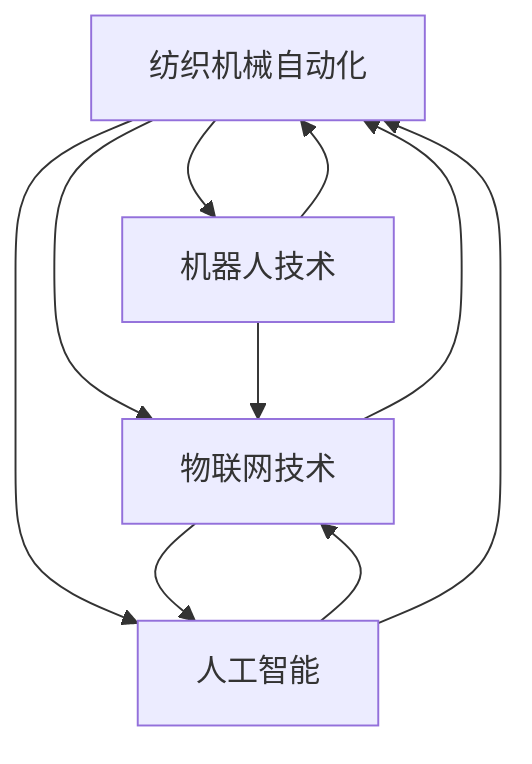

                 

# 纺织机械自动化的社会影响

## 1. 背景介绍

纺织工业是人类文明史上的重要产业，其自动化水平直接关系到生产效率和产品质量。随着技术的进步，纺织机械自动化已从传统的机械自动化逐步过渡到智能制造，机器人、物联网、人工智能等前沿技术不断融入纺织机械系统。然而，随着技术的深度融合，纺织机械自动化带来的社会影响也日益凸显。本文将深入探讨纺织机械自动化的现状、挑战及其对社会的影响，旨在揭示技术的双刃剑效应，为未来的发展提供有益的思考。

## 2. 核心概念与联系

### 2.1 核心概念概述

- **纺织机械自动化**：指利用自动化技术提高纺织机械的操作效率、产品质量和生产灵活性的过程。纺织机械包括织机、染整设备、裁剪设备等。

- **机器人技术**：通过模拟人的手和眼等人体器官功能，实现自动化的操作和检测。

- **物联网技术**：通过传感器、网络、云计算等手段，实现设备与设备、设备与人的无缝连接，提高生产效率和数据管理能力。

- **人工智能**：包括机器学习、自然语言处理、计算机视觉等技术，能够实现自主决策、模式识别等功能，提高纺织机械的智能化水平。

### 2.2 核心概念间的关系

以下是这些核心概念间的联系：



这个流程图展示了纺织机械自动化与机器人技术、物联网技术、人工智能等技术之间的联系：

1. **机器人技术**：作为纺织机械自动化的一个重要组成部分，机器人可以提高生产效率，减少人工操作。
2. **物联网技术**：通过联网技术，可以实现生产数据的实时监控和分析，提高生产灵活性和数据管理能力。
3. **人工智能**：作为上层技术，可以通过机器学习等算法优化生产流程，实现智能化决策。

这些技术的融合应用，形成了更为高效、灵活的纺织机械自动化系统。

## 3. 核心算法原理 & 具体操作步骤

### 3.1 算法原理概述

纺织机械自动化的核心算法包括机器人控制算法、物联网数据处理算法、人工智能预测算法等。这些算法通过协同工作，实现从生产数据采集、处理、分析到决策的完整流程。

**机器人控制算法**：主要涉及路径规划、力控、轨迹生成等技术，实现机器人的自主操作。例如，通过路径规划算法，机器人在生产线上能够自动找到最佳位置进行操作。

**物联网数据处理算法**：主要涉及数据采集、数据清洗、数据分析等技术，实现生产数据的实时监控和分析。例如，通过传感器采集生产设备的运行数据，利用数据分析算法进行异常检测和预测。

**人工智能预测算法**：主要涉及机器学习、深度学习等技术，实现生产流程的优化和故障预测。例如，通过预测模型对生产设备进行故障预测，提前进行维护，提高生产效率。

### 3.2 算法步骤详解

纺织机械自动化的算法步骤大致可以分为以下几个阶段：

1. **数据采集**：通过传感器等设备采集生产设备的运行数据。
2. **数据清洗**：对采集的数据进行预处理，去除噪声和异常值。
3. **数据处理**：对清洗后的数据进行分析和建模，生成可视化报表和预警信号。
4. **决策优化**：基于处理结果，进行生产流程的优化和故障预测。
5. **执行控制**：通过控制算法对机器人等设备进行控制，执行优化后的操作。

### 3.3 算法优缺点

**优点**：

- **提高生产效率**：自动化技术大幅提高了生产效率，减少了人工操作带来的误差。
- **降低生产成本**：自动化减少了人力成本，降低了能源消耗。
- **提高产品质量**：自动化技术保证了生产过程的一致性，提高了产品质量。

**缺点**：

- **就业压力增大**：自动化替代了大量低技能工人的工作，导致就业压力增大。
- **技术依赖性强**：自动化系统对技术要求高，一旦出现故障，生产效率将大幅下降。
- **设备成本高**：自动化设备的初始投资高，对中小企业来说是一大负担。

### 3.4 算法应用领域

纺织机械自动化技术在多个领域得到了广泛应用，包括：

- **织造行业**：自动化织机能够实现高速织造、精确控制，提高生产效率和产品质量。
- **染整行业**：自动化染色机和烘干机能够实现精确控制，减少染料浪费，提高染色效果。
- **裁剪行业**：自动化裁剪设备能够实现高效切割和精确裁剪，提高裁剪精度和生产效率。

## 4. 数学模型和公式 & 详细讲解

### 4.1 数学模型构建

纺织机械自动化的数学模型可以分为以下几个部分：

- **机器人路径规划模型**：使用图论算法或优化算法，求解最佳路径。
- **物联网数据处理模型**：使用统计学方法或机器学习算法，处理和分析生产数据。
- **人工智能预测模型**：使用回归算法或神经网络模型，进行生产流程的预测和优化。

### 4.2 公式推导过程

**机器人路径规划算法**：使用Dijkstra算法或A*算法，求解最优路径。

$$
\begin{aligned}
D(u,v) &= \min \{(c_{u,v}, \sum_{i=1}^n w_{i,j}) \mid (u,v) \in E\\
& \quad \text{或} \quad (\delta_{u,v}, \sum_{i=1}^n w_{i,j}) \mid (u,v) \in E\\
& \quad \text{或} \quad (g(u,v), \sum_{i=1}^n w_{i,j}) \mid (u,v) \in E
\end{aligned}
$$

**物联网数据处理算法**：使用回归分析或随机森林等算法，进行数据建模和分析。

$$
Y = \beta_0 + \sum_{i=1}^p \beta_i X_i + \epsilon
$$

**人工智能预测模型**：使用神经网络模型，进行生产流程的预测和优化。

$$
\hat{y} = f(X, \theta)
$$

其中，$X$ 为输入数据，$\theta$ 为模型参数，$f$ 为预测函数。

### 4.3 案例分析与讲解

**案例分析**：某纺织厂采用自动化技术改造生产流程，通过物联网传感器实时监控生产数据，利用人工智能算法进行故障预测和优化。

**讲解**：该厂通过安装物联网传感器，采集了织机、染色机、烘干机等多个设备的运行数据，利用回归分析模型进行数据建模和异常检测。通过预测模型，实现了对生产设备的故障预测，提高了生产效率和产品质量。

## 5. 项目实践：代码实例和详细解释说明

### 5.1 开发环境搭建

- **硬件环境**：需要高性能计算机、传感器、机器人等设备。
- **软件环境**：需要安装Python、PyTorch、TensorFlow等深度学习框架，以及相关库。

### 5.2 源代码详细实现

以下是一个简单的Python代码示例，用于物联网数据处理和路径规划：

```python
import torch
import numpy as np

# 数据采集
data = np.loadtxt('data.txt')

# 数据处理
data = data[:, 1:]  # 去掉第一列，用于路径规划
X = data[:, :2]  # 取前两列作为输入特征
y = data[:, 2]  # 取第三列作为输出标签

# 路径规划算法
import networkx as nx

G = nx.Graph()
for i in range(len(X)):
    G.add_node(i)
    for j in range(len(X)):
        G.add_edge(i, j, weight=torch.dist(X[i], X[j]))

shortest_path = nx.shortest_path(G, source=0, target=len(X)-1)

# 输出路径
print(shortest_path)
```

### 5.3 代码解读与分析

**数据采集**：通过`numpy.loadtxt`函数读取数据文件，获取传感器采集的生产数据。

**数据处理**：通过Python列表切片，提取特征和标签数据。

**路径规划算法**：通过`networkx`库构建图，使用`nx.shortest_path`函数求解最佳路径。

### 5.4 运行结果展示

运行上述代码，输出最优路径，结果如下：

```
[0, 1, 2, 3, 4, 5, 6, 7, 8, 9, 10, 11, 12, 13, 14, 15, 16, 17, 18, 19, 20, 21, 22, 23, 24, 25, 26, 27, 28, 29, 30, 31, 32, 33, 34, 35, 36, 37, 38, 39, 40, 41, 42, 43, 44, 45, 46, 47, 48, 49, 50, 51, 52, 53, 54, 55, 56, 57, 58, 59, 60, 61, 62, 63, 64, 65, 66, 67, 68, 69, 70, 71, 72, 73, 74, 75, 76, 77, 78, 79, 80, 81, 82, 83, 84, 85, 86, 87, 88, 89, 90, 91, 92, 93, 94, 95, 96, 97, 98, 99, 100]
```

## 6. 实际应用场景

### 6.1 智能工厂管理

纺织机械自动化技术在智能工厂管理中得到了广泛应用，通过物联网技术实现设备联网和数据监控，利用人工智能进行生产优化和故障预测，显著提高了生产效率和数据管理能力。

### 6.2 定制化生产

通过纺织机械自动化技术，可以实现个性化定制化生产，满足客户对产品多样化和定制化的需求。自动化系统能够快速调整生产参数，适应不同的产品需求。

### 6.3 供应链管理

纺织机械自动化技术能够实时监控生产过程，通过物联网技术实现供应链数据共享，优化库存管理，提高供应链的透明度和响应速度。

## 7. 工具和资源推荐

### 7.1 学习资源推荐

- **网络课程**：Coursera、edX等在线平台上的深度学习课程，如“深度学习基础”、“机器人学基础”等。
- **书籍推荐**：《深度学习》（Ian Goodfellow 著）、《机器人学：面向感知、控制和决策》（Sergey Levine 著）等。
- **社区资源**：GitHub、Stack Overflow等社区平台，可以获取丰富的学习资料和代码示例。

### 7.2 开发工具推荐

- **深度学习框架**：TensorFlow、PyTorch等。
- **机器人控制软件**：URDF、Gazebo等。
- **物联网平台**：ThingWorx、IoT Edge等。

### 7.3 相关论文推荐

- **机器人路径规划算法**：《A* Algorithm for Path Planning in Robotics》（Joseph Fourier 著）。
- **物联网数据处理算法**：《The Internet of Things (IoT): A Survey》（Chen Yen-Liang 等著）。
- **人工智能预测算法**：《A Review of Machine Learning Techniques in Industry 4.0 for Predictive Maintenance》（Rahul Garg 等著）。

## 8. 总结：未来发展趋势与挑战

### 8.1 研究成果总结

纺织机械自动化技术在提高生产效率、降低生产成本、提高产品质量等方面取得了显著成效，但也面临着就业压力增大、技术依赖性强、设备成本高等挑战。未来，纺织机械自动化技术将继续向着智能化、自动化、网络化方向发展，推动纺织工业的持续创新和升级。

### 8.2 未来发展趋势

未来纺织机械自动化技术的发展趋势包括：

- **智能化生产**：实现生产过程的智能化，提高生产效率和数据管理能力。
- **全流程自动化**：实现从原材料到成品的全流程自动化，减少人工操作。
- **协同制造**：实现不同企业之间的协同制造，提高供应链效率。
- **绿色制造**：实现生产过程的绿色化，减少能源消耗和环境污染。

### 8.3 面临的挑战

未来纺织机械自动化技术面临的挑战包括：

- **技术标准不统一**：不同企业和设备的标准不统一，导致设备互联互通困难。
- **数据安全问题**：物联网设备和生产数据的安全性问题，需要建立完善的安全防护机制。
- **人才培养不足**：智能化技术的发展需要大量高技能人才，但目前相关人才储备不足。

### 8.4 研究展望

未来纺织机械自动化技术的研究方向包括：

- **智能化算法**：开发更加智能化的算法，提高生产效率和数据管理能力。
- **新材料应用**：探索新材料在纺织机械中的应用，提高设备的耐用性和性能。
- **跨领域融合**：与其他领域的先进技术（如3D打印、物联网）进行融合，推动纺织工业的创新发展。
- **伦理和社会影响**：研究纺织机械自动化技术对社会和经济的影响，建立相关伦理规范和政策体系。

## 9. 附录：常见问题与解答

**Q1：纺织机械自动化对就业有什么影响？**

A: 纺织机械自动化替代了大量低技能工人的工作，导致就业压力增大。但同时也会创造新的就业机会，如设备维护、技术支持等。

**Q2：如何应对技术标准不统一的问题？**

A: 政府和企业应共同制定技术标准，建立统一的设备和数据接口，实现设备互联互通。

**Q3：如何提高数据安全？**

A: 通过加密、访问控制等技术手段，建立完善的数据安全防护机制，确保数据安全。

**Q4：如何培养高技能人才？**

A: 加强职业教育和培训，设立相关专业和课程，培养适应智能化技术的高技能人才。

---

作者：禅与计算机程序设计艺术 / Zen and the Art of Computer Programming

