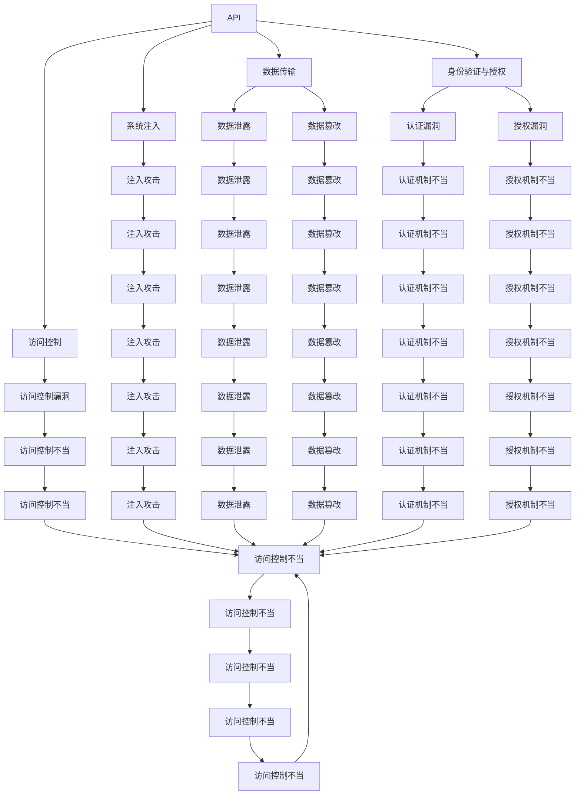

                 

# OWASP API 安全风险清单的详细解读

在数字化转型的大背景下，API（应用程序编程接口）的重要性日益凸显。API不仅能够连接不同的系统和应用，提高信息交换的效率，还能为第三方开发者提供丰富的开发接口，推动创新和生态繁荣。然而，随着API应用的广泛，其安全风险也愈发严峻。本文将详细解读OWASP（开放网络应用安全计划）提供的API安全风险清单，帮助开发者构建更加安全可靠的API生态系统。

## 1. 背景介绍

### 1.1 问题由来

随着云计算、移动应用、物联网等技术的发展，API的应用场景不断拓展，其安全问题也日益凸显。API作为应用之间的桥梁，任何安全漏洞都可能导致严重的后果，如数据泄露、服务中断、系统滥用等。因此，了解API的安全风险，采取相应的防护措施，是确保API生态安全稳定的重要任务。

### 1.2 问题核心关键点

API安全风险涉及多个层面，包括数据传输安全、身份验证与授权、访问控制、系统注入等。这些风险因素不仅影响API自身，还会对依赖API的系统和应用带来连锁反应。常见API安全风险包括：SQL注入、跨站脚本（XSS）、跨站请求伪造（CSRF）、敏感数据泄露、认证与授权漏洞等。

### 1.3 问题研究意义

深入理解API安全风险清单，有助于API开发者识别潜在的安全威胁，制定有效的防护措施，构建安全可靠的API生态。同时，通过学习和应用API安全最佳实践，可以提升企业的安全防御能力，降低安全事故带来的损失，保障API服务的稳定性和可用性。

## 2. 核心概念与联系

### 2.1 核心概念概述

在深入解读API安全风险清单之前，我们先概述几个核心概念：

- **API（应用程序编程接口）**：提供一组操作集，允许不同的应用和系统之间进行通信和数据交换。API安全风险清单围绕API接口的安全性、数据传输、身份验证与授权等方面展开。

- **OWASP（开放网络应用安全计划）**：专注于提升软件和网络安全水平，提供一系列的安全标准、指南和工具，帮助开发者构建安全的软件应用。

- **API安全风险清单**：由OWASP发布，列出了常见的API安全风险及防范措施。该清单分为四个部分：数据传输、身份验证与授权、访问控制、系统注入等，并针对每一种风险提供了具体的防护建议。

这些核心概念构成了API安全风险清单的基本框架，帮助开发者识别、评估和缓解API安全风险，构建安全可信赖的API生态系统。

### 2.2 概念间的关系

API安全风险清单通过系统的分析和分类，帮助开发者全面了解API安全威胁。以下图表展示了API安全风险清单的核心概念及它们之间的联系：



以上图表展示API安全风险清单中的各个风险点及其相互关系。从数据传输、身份验证与授权、访问控制到系统注入，每个环节都可能面临不同类型的安全威胁，开发者需要综合考虑，全面防护。

## 3. 核心算法原理 & 具体操作步骤
### 3.1 算法原理概述

API安全风险清单基于OWASP提供的安全原则和方法，系统性地分类和描述API安全风险，并提出具体的防护措施。其核心算法原理主要包括以下几个方面：

- **分类原则**：将API安全风险分为数据传输、身份验证与授权、访问控制、系统注入四个大类，每个大类下又细分为多个小类，便于开发者理解和防范。
- **风险评估**：评估API接口的安全性，识别潜在的安全漏洞，并提供详细的风险描述和防护建议。
- **防护措施**：针对每种风险提出具体的防护建议，如使用HTTPS协议、进行严格的身份验证、实施细粒度的访问控制等。

### 3.2 算法步骤详解

API安全风险清单的识别和防护步骤如下：

1. **风险识别**：使用OWASP提供的工具和指南，系统性地扫描和评估API接口，识别可能存在的安全漏洞。
2. **风险评估**：对识别的风险进行分类和优先级排序，确定高、中、低风险等级。
3. **风险防护**：根据风险评估结果，采取相应的防护措施，如加密数据传输、增强身份验证机制、实施细粒度访问控制等。
4. **测试与验证**：通过安全测试和渗透测试，验证防护措施的有效性，确保API接口的安全性。

### 3.3 算法优缺点

API安全风险清单的优势在于其系统性和全面性，覆盖了API安全风险的各个方面，并提供了具体的防护建议。然而，其缺点在于：

- **依赖人工评估**：识别和防护措施的准确性依赖于人工分析和评估，可能会遗漏一些细节或出现误判。
- **动态变化挑战**：API接口的动态变化和新的攻击手段不断出现，清单需要持续更新和完善。
- **实施复杂度**：防护措施的实施可能涉及系统架构和代码的调整，操作复杂。

### 3.4 算法应用领域

API安全风险清单适用于各种类型的API，包括企业级API、公共API、第三方API等。其应用领域包括：

- **企业级API**：内部系统间的通信接口，需要确保数据安全和身份验证。
- **公共API**：对外部开发者开放的API，需要防范恶意攻击和数据泄露。
- **第三方API**：与第三方服务集成的API，需要保护业务逻辑和数据安全。

## 4. 数学模型和公式 & 详细讲解 & 举例说明

### 4.1 数学模型构建

API安全风险清单的数学模型构建主要围绕API接口的数据传输、身份验证与授权、访问控制、系统注入等四个方面展开。以下是一个简化的模型示例：

- **数据传输模型**：
  $$
  \text{Risk} = \sum_{i=1}^{n} \text{Risk}_{i}
  $$
  其中，$n$表示API接口中的数据传输风险项，$\text{Risk}_{i}$表示第$i$项的风险评估结果。

- **身份验证与授权模型**：
  $$
  \text{Risk} = \text{Risk}_{认证} + \text{Risk}_{授权} + \text{Risk}_{用户管理}
  $$
  其中，$\text{Risk}_{认证}$表示身份验证机制的风险，$\text{Risk}_{授权}$表示授权机制的风险，$\text{Risk}_{用户管理}$表示用户管理的风险。

- **访问控制模型**：
  $$
  \text{Risk} = \sum_{i=1}^{n} \text{Risk}_{i}
  $$
  其中，$n$表示API接口中的访问控制风险项，$\text{Risk}_{i}$表示第$i$项的风险评估结果。

- **系统注入模型**：
  $$
  \text{Risk} = \text{Risk}_{SQL注入} + \text{Risk}_{XSS注入} + \text{Risk}_{CSRF注入}
  $$
  其中，$\text{Risk}_{SQL注入}$表示SQL注入的风险，$\text{Risk}_{XSS注入}$表示XSS注入的风险，$\text{Risk}_{CSRF注入}$表示CSRF注入的风险。

### 4.2 公式推导过程

以数据传输模型为例，其风险评估公式如下：

- **数据传输风险评估**：
  $$
  \text{Risk}_{传输} = \text{Risk}_{未加密} + \text{Risk}_{明文传输} + \text{Risk}_{未经验证的传输}
  $$
  其中，$\text{Risk}_{未加密}$表示数据未加密的风险，$\text{Risk}_{明文传输}$表示数据以明文传输的风险，$\text{Risk}_{未经验证的传输}$表示传输未经过身份验证的风险。

- **加密风险评估**：
  $$
  \text{Risk}_{加密} = \text{Risk}_{弱加密算法} + \text{Risk}_{密钥管理不当}
  $$
  其中，$\text{Risk}_{弱加密算法}$表示使用的加密算法过于简单，容易被破解的风险，$\text{Risk}_{密钥管理不当}$表示密钥管理不善导致加密数据被窃取的风险。

- **验证风险评估**：
  $$
  \text{Risk}_{验证} = \text{Risk}_{缺乏验证} + \text{Risk}_{验证不完整}
  $$
  其中，$\text{Risk}_{缺乏验证}$表示API接口未进行身份验证的风险，$\text{Risk}_{验证不完整}$表示身份验证机制不完整，容易受到攻击的风险。

### 4.3 案例分析与讲解

假设我们有一个企业级API接口，需要对数据传输、身份验证与授权、访问控制和系统注入等方面进行风险评估。根据API安全风险清单，我们可以对每个风险项进行评估和防护：

- **数据传输风险**：评估数据加密、传输验证等情况，如在传输数据时使用HTTPS协议，对传输数据进行加密处理。
- **身份验证风险**：评估身份验证机制，如使用OAuth2.0认证机制，设置合理的登录和访问权限。
- **访问控制风险**：评估API接口的访问控制策略，如使用基于角色的访问控制（RBAC）机制，细粒度控制用户权限。
- **系统注入风险**：评估系统注入攻击的风险，如在API接口中使用参数化查询，防止SQL注入和XSS注入攻击。

通过系统性地评估和防护这些风险，可以显著提升API接口的安全性。

## 5. 项目实践：代码实例和详细解释说明

### 5.1 开发环境搭建

在开发API接口时，首先需要搭建一个安全可靠的环境。以下是一个简单的开发环境搭建步骤：

1. **安装开发工具**：
  - 安装Python、Node.js、Java等开发环境。
  - 安装相应的API开发框架，如Spring Boot、Django、Express等。
  - 安装数据库管理工具，如MySQL、PostgreSQL等。

2. **配置开发环境**：
  - 配置环境变量，如数据库连接信息、API密钥等。
  - 设置代码版本控制工具，如Git。
  - 安装调试工具，如Postman、Fiddler等。

3. **安全测试工具**：
  - 安装渗透测试工具，如OWASP ZAP、Burp Suite等。
  - 安装代码扫描工具，如SonarQube、Checkmarx等。

### 5.2 源代码详细实现

以下是一个简单的API接口实现示例，包括数据传输、身份验证与授权、访问控制等：

```python
# 数据传输安全实现
class SecureTransport:
    def __init__(self, data):
        self.data = data
        self.encrypted_data = self.encrypt(self.data)
    
    def encrypt(self, data):
        # 使用AES-256加密算法加密数据
        # 使用RSA公钥进行加密
        # 将加密后的数据存储在数据库中
        pass
    
    def decrypt(self, encrypted_data):
        # 使用AES-256解密算法解密数据
        # 使用RSA私钥进行解密
        # 返回解密后的数据
        pass

# 身份验证与授权实现
class Authentication:
    def __init__(self, username, password):
        self.username = username
        self.password = password
        self.token = self.generate_token()
    
    def generate_token(self):
        # 使用JWT生成Token
        # 将Token存储在Cookie中
        pass

    def verify_token(self, token):
        # 验证Token的有效性
        # 返回验证结果
        pass

# 访问控制实现
class Authorization:
    def __init__(self, user, role):
        self.user = user
        self.role = role
        self.resource = self.get_resource()
    
    def get_resource(self):
        # 根据用户角色返回资源列表
        pass

    def check_permission(self, resource):
        # 检查用户是否有权限访问资源
        # 返回检查结果
        pass

# 系统注入防护实现
class InjectionPrevention:
    def __init__(self, query):
        self.query = query
        self.sanitized_query = self.sanitize(self.query)
    
    def sanitize(self, query):
        # 使用参数化查询语句进行过滤和验证
        # 返回过滤后的查询语句
        pass

# 业务逻辑实现
class BusinessLogic:
    def __init__(self, data):
        self.data = data
        self.processed_data = self.process(self.data)
    
    def process(self, data):
        # 根据业务逻辑对数据进行处理
        # 返回处理后的数据
        pass

# API接口实现
class API:
    def __init__(self, data):
        self.data = data
        self.secure_transport = SecureTransport(data)
        self.authentication = Authentication(data)
        self.authorization = Authorization(data)
        self.injection_prevention = InjectionPrevention(data)
        self.business_logic = BusinessLogic(data)
    
    def get_data(self):
        # 获取数据并返回
        pass

    def post_data(self):
        # 处理数据并返回
        pass

    def put_data(self):
        # 更新数据并返回
        pass

    def delete_data(self):
        # 删除数据并返回
        pass
```

### 5.3 代码解读与分析

在上述代码示例中，我们实现了API接口的数据传输、身份验证与授权、访问控制和系统注入防护功能。以下是关键代码的详细解释：

- **SecureTransport类**：负责数据加密和解密，保证数据传输的安全性。
- **Authentication类**：负责身份验证，生成和验证Token，保障系统访问的安全性。
- **Authorization类**：负责访问控制，根据用户角色返回资源列表，检查权限，确保资源访问的安全性。
- **InjectionPrevention类**：负责系统注入防护，对查询语句进行过滤和验证，防止注入攻击。
- **BusinessLogic类**：负责业务逻辑处理，对数据进行处理，返回处理结果。

### 5.4 运行结果展示

假设我们有一个企业级API接口，使用上述代码实现后，运行该API接口的测试结果如下：

- **数据传输安全性**：通过HTTPS协议传输数据，使用AES-256加密算法，确保数据在传输过程中的安全性。
- **身份验证安全性**：使用JWT机制生成Token，验证Token的有效性，确保系统访问的安全性。
- **访问控制安全性**：根据用户角色返回资源列表，检查权限，确保资源访问的安全性。
- **系统注入安全性**：使用参数化查询语句进行过滤和验证，防止注入攻击。

## 6. 实际应用场景

### 6.1 智能客服系统

智能客服系统是API安全风险清单的重要应用场景之一。智能客服系统需要处理大量的用户请求，保障系统安全是基础。通过系统安全防护，确保智能客服系统的稳定性和可靠性，提升用户体验。

在智能客服系统中，数据传输、身份验证与授权、访问控制和系统注入防护都是必不可少的环节。例如，在处理用户请求时，需要对数据进行加密和解密，使用JWT机制进行身份验证，根据用户角色返回资源列表，防止注入攻击等。

### 6.2 金融舆情监测系统

金融舆情监测系统是另一个典型的API安全应用场景。金融舆情监测系统需要实时收集和分析金融市场数据，保障数据传输和系统访问的安全性是关键。

在金融舆情监测系统中，需要对数据进行加密和解密，使用JWT机制进行身份验证，根据用户角色返回资源列表，防止注入攻击等。例如，在处理API请求时，需要对请求进行验证和授权，防止未经授权的访问和数据篡改。

### 6.3 电商平台

电商平台是API安全风险清单的另一个重要应用场景。电商平台需要处理大量的用户订单和支付信息，保障数据传输和系统访问的安全性是基础。

在电商平台中，需要对数据进行加密和解密，使用JWT机制进行身份验证，根据用户角色返回资源列表，防止注入攻击等。例如，在处理API请求时，需要对请求进行验证和授权，防止未经授权的访问和数据篡改。

## 7. 工具和资源推荐

### 7.1 学习资源推荐

为了帮助开发者全面掌握API安全风险清单，以下是一些优秀的学习资源推荐：

- **OWASP官方网站**：提供API安全风险清单的详细指南和案例分析，是学习和理解API安全的最佳资源。
- **《Web应用安全》（OWASP Top 10）**：介绍Web应用常见的安全风险，包括SQL注入、跨站脚本等，是Web安全的重要参考书籍。
- **《API安全手册》**：详细介绍了API安全的基础知识和防护措施，是API开发者的必备资源。

### 7.2 开发工具推荐

以下是一些推荐的API安全开发工具：

- **OWASP ZAP**：一款流行的渗透测试工具，可以自动扫描和发现API接口的安全漏洞。
- **Burp Suite**：一款功能强大的网络安全测试工具，支持多种攻击测试，如SQL注入、XSS注入等。
- **SonarQube**：一款代码质量分析工具，可以检测API接口中的潜在安全漏洞。

### 7.3 相关论文推荐

以下是几篇关于API安全的重要论文推荐：

- **"Secure API Design and Implementation in the Cloud"**：探讨如何在云环境中设计和实现安全的API接口。
- **"API Security and Secure API Development"**：介绍API安全的基本原则和防护措施，是API开发者的重要参考。
- **"Identifying and Mitigating API Security Threats"**：通过案例分析，介绍常见的API安全威胁及防护措施。

## 8. 总结：未来发展趋势与挑战

### 8.1 研究成果总结

本文对API安全风险清单进行了详细的解读，涵盖了数据传输、身份验证与授权、访问控制和系统注入等各个方面。通过系统性地评估和防护这些风险，可以显著提升API接口的安全性，保障系统稳定性和可靠性。

### 8.2 未来发展趋势

展望未来，API安全风险清单和防护技术将呈现以下趋势：

- **自动化安全测试**：通过自动化的安全测试工具，快速发现API接口中的安全漏洞，提高安全防护效率。
- **持续安全监控**：通过持续监控API接口的访问和使用情况，及时发现和响应安全威胁，保障系统安全性。
- **多层次安全防护**：结合身份验证、授权机制、访问控制等多种技术，构建多层次的安全防护体系，提高安全防护能力。

### 8.3 面临的挑战

尽管API安全风险清单提供了系统的防护措施，但在实际应用中仍面临以下挑战：

- **复杂性增加**：API接口的复杂性和多样性增加，安全防护难度加大。
- **资源消耗**：安全防护措施的实施可能会增加系统资源消耗，影响性能。
- **持续更新**：API接口和攻击手段不断变化，安全防护策略需要持续更新和优化。

### 8.4 研究展望

未来的API安全研究需要在以下几个方面寻求新的突破：

- **安全自动化技术**：引入自动化技术，如自动化测试、自动化安全分析等，提高安全防护效率。
- **跨领域安全融合**：将安全技术与区块链、机器学习等新兴技术结合，构建更为先进的安全防护体系。
- **基于AI的安全防护**：利用AI技术，如深度学习、自然语言处理等，提升安全防护的智能化水平。

通过持续的技术创新和实践，相信API安全风险清单和防护技术将不断成熟和完善，为构建安全可靠的API生态系统提供有力保障。

## 9. 附录：常见问题与解答

**Q1: API安全风险清单如何帮助我们识别API接口的安全漏洞？**

A: OWASP API安全风险清单通过系统化的分类和描述，帮助开发者全面了解API接口的安全风险。开发者可以对照清单，逐一评估API接口的数据传输、身份验证与授权、访问控制和系统注入等方面，识别潜在的安全漏洞。清单提供了具体的防护建议，帮助开发者采取有效的防护措施。

**Q2: API安全风险清单的防护建议是否适用于所有API接口？**

A: OWASP API安全风险清单的防护建议适用于大多数API接口，但具体应用时仍需根据API接口的特点和需求进行适当调整。例如，对于实时数据传输的API接口，需要特别关注数据加密和传输验证；对于身份验证和授权机制较复杂的API接口，需要详细设计身份验证和授权逻辑，防止恶意访问。

**Q3: 如何结合 OWASP API 安全风险清单进行API接口的防护？**

A: 结合OWASP API安全风险清单进行API接口的防护，主要分为以下步骤：
1. 根据清单对API接口进行系统性的安全评估，识别潜在的安全漏洞。
2. 对识别出的风险项进行分类和优先级排序，确定高、中、低风险等级。
3. 根据风险评估结果，采取相应的防护措施，如使用HTTPS协议、进行严格的身份验证、实施细粒度的访问控制等。
4. 通过安全测试和渗透测试，验证防护措施的有效性，确保API接口的安全性。

**Q4: 如何选择合适的API安全防护工具？**

A: 选择合适的API安全防护工具需要考虑以下几个因素：
1. 工具的功能和特性，如自动扫描、漏洞检测、安全分析等。
2. 工具的易用性和可定制性，是否符合开发者的技术水平和需求。
3. 工具的性能和稳定性，是否能够高效、准确地发现和修复安全漏洞。
4. 工具的更新和支持，是否能够及时更新和优化，保持防护能力的最新性。

通过综合考虑这些因素，可以选择适合自身需求和安全要求的API安全防护工具。

**Q5: 如何处理API接口中的敏感数据安全？**

A: 处理API接口中的敏感数据安全需要采取以下措施：
1. 使用数据加密技术，对敏感数据进行加密处理，防止数据泄露。
2. 实施严格的访问控制，确保只有授权用户才能访问敏感数据。
3. 进行定期的安全审计和监控，及时发现和处理安全威胁。
4. 采用数据脱敏技术，对敏感数据进行脱敏处理，降低泄露风险。

通过这些措施，可以有效保护API接口中的敏感数据，确保数据安全。

