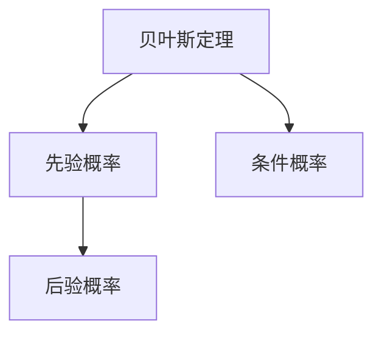

                 

# Python机器学习实战：朴素贝叶斯分类器的原理与实践

> 关键词：Python, 机器学习, 朴素贝叶斯, 分类器, 贝叶斯定理, 数学建模, 实践指南, 代码实例

## 1. 背景介绍

### 1.1 问题由来
随着机器学习技术的迅猛发展，分类问题成为各个领域广泛关注和研究的主题。在众多分类算法中，朴素贝叶斯分类器（Naive Bayes Classifier, NBC）以其简单易行、高效快速的特性，在文本分类、垃圾邮件过滤、情感分析等领域得到广泛应用。朴素贝叶斯分类器是基于贝叶斯定理的一种算法，通过概率统计的方法进行分类。在实际应用中，朴素贝叶斯分类器表现出色，被广泛应用于自然语言处理（NLP）、推荐系统、金融分析等领域。

### 1.2 问题核心关键点
朴素贝叶斯分类器的核心思想基于贝叶斯定理和独立假设。贝叶斯定理表达了在已知先验概率的情况下，如何更新后验概率。独立假设则认为每个特征之间相互独立，互不影响。这种简化的模型在实践中能够快速训练并产生良好的分类效果。

朴素贝叶斯分类器的应用主要涉及以下几个方面：
- 文本分类：将文本文档分到预定义的类别中。
- 垃圾邮件过滤：识别邮件是否是垃圾邮件。
- 情感分析：分析文本的情感倾向，如正面、负面或中性。
- 推荐系统：预测用户对物品的喜好，推荐相关商品。

### 1.3 问题研究意义
朴素贝叶斯分类器作为一种简单高效的机器学习算法，其核心思想和应用广泛性使其在实际应用中具有重要价值。研究朴素贝叶斯分类器的原理与实践，可以更好地理解其工作机制，掌握其在不同领域的应用方法，从而促进机器学习技术的普及和落地。

## 2. 核心概念与联系

### 2.1 核心概念概述

朴素贝叶斯分类器基于贝叶斯定理和独立假设，其核心概念包括：

- 贝叶斯定理：表达在已知先验概率和条件概率的情况下，如何计算后验概率。
- 独立假设：假设所有特征之间相互独立，互不影响。
- 先验概率：在训练集未见过的样本，其特征变量的概率分布。
- 条件概率：已知一个特征的取值，其他特征的概率分布。
- 后验概率：已知所有特征的取值，类别的概率分布。

### 2.2 概念间的关系

朴素贝叶斯分类器的核心思想可以用以下Mermaid流程图来展示：



该流程图展示了贝叶斯定理和独立假设如何通过先验概率和条件概率，计算出后验概率。

### 2.3 核心概念的整体架构

进一步，我们将贝叶斯定理和独立假设应用于朴素贝叶斯分类器的训练和预测过程中。以下是综合的流程图：


这个流程图展示了朴素贝叶斯分类器从训练到预测的全过程。训练阶段计算先验概率和条件概率，预测阶段计算后验概率并进行分类。

## 3. 核心算法原理 & 具体操作步骤
### 3.1 算法原理概述

朴素贝叶斯分类器基于贝叶斯定理和独立假设，其核心原理如下：

给定一个样本$x$和两个类别$C_1$和$C_2$，假设已知$P(C_1)$和$P(C_2)$是类别$C_1$和$C_2$的先验概率，$P(X|C_1)$和$P(X|C_2)$是类别$C_1$和$C_2$条件下特征$X$的条件概率，则后验概率$P(C_1|X)$和$P(C_2|X)$可以通过贝叶斯定理计算得出：

$$
P(C_1|X) = \frac{P(X|C_1)P(C_1)}{P(X)}
$$

$$
P(C_2|X) = \frac{P(X|C_2)P(C_2)}{P(X)}
$$

其中，$P(X)$为样本$x$的总概率，可以通过全概率公式计算得出：

$$
P(X) = P(X|C_1)P(C_1) + P(X|C_2)P(C_2)
$$

在实际应用中，先验概率$P(C_1)$和$P(C_2)$可以通过训练集中的类别频率计算得出。条件概率$P(X|C_1)$和$P(X|C_2)$则可以通过训练集中的特征频率计算得出。

### 3.2 算法步骤详解

朴素贝叶斯分类器的训练和预测过程如下：

**训练阶段：**
1. 收集训练数据集$D=\{(x_1, y_1), (x_2, y_2), \ldots, (x_N, y_N)\}$，其中$x_i$是特征向量，$y_i$是类别标签。
2. 计算每个类别的先验概率$P(C_k)$，其中$k$是类别标签。
3. 计算每个类别下每个特征的条件概率$P(X_i|C_k)$，其中$X_i$是特征，$C_k$是类别。
4. 根据先验概率和条件概率计算后验概率$P(C_k|x)$。

**预测阶段：**
1. 对于一个新的测试样本$x$，计算每个类别的后验概率$P(C_k|x)$。
2. 选择后验概率最大的类别作为预测结果$k$。

### 3.3 算法优缺点

朴素贝叶斯分类器具有以下优点：
- 简单易行：模型训练和预测过程相对简单，适合快速部署。
- 高效快速：模型计算速度快，适合处理大规模数据集。
- 零样本学习：在训练集未见过的样本上，仍能进行分类。

然而，朴素贝叶斯分类器也存在一些缺点：
- 独立假设不合理：实际中特征之间往往存在依赖关系，简化模型可能会产生偏差。
- 对噪声敏感：噪声数据会影响条件概率的估计，导致分类错误。
- 需要大量标注数据：模型需要足够的训练数据才能获得良好的分类效果。

### 3.4 算法应用领域

朴素贝叶斯分类器在多个领域中得到广泛应用，包括但不限于：

- 文本分类：如情感分析、主题分类等。
- 垃圾邮件过滤：自动识别邮件是否为垃圾邮件。
- 推荐系统：预测用户对物品的喜好，推荐相关商品。
- 金融分析：识别股票市场的趋势，预测股票价格。
- 医学诊断：通过病历诊断疾病。

朴素贝叶斯分类器的应用领域广泛，其高效快速、简单易行的特性使其在实际应用中具有重要价值。

## 4. 数学模型和公式 & 详细讲解  
### 4.1 数学模型构建

朴素贝叶斯分类器基于贝叶斯定理和独立假设，其数学模型构建如下：

给定训练集$D=\{(x_1, y_1), (x_2, y_2), \ldots, (x_N, y_N)\}$，其中$x_i$是特征向量，$y_i$是类别标签，假设类别标签为$C_1, C_2, \ldots, C_K$。

1. 计算每个类别的先验概率$P(C_k)$，其中$k=1,2,\ldots,K$：
$$
P(C_k) = \frac{|\{x_i | y_i=k\}|}{N}
$$

2. 计算每个类别下每个特征的条件概率$P(X_i|C_k)$，其中$X_i$是特征，$C_k$是类别，$|\{x_i | y_i=k\}|$是类别$k$下特征$X_i$的取值数量：
$$
P(X_i|C_k) = \frac{|\{x_i | y_i=k\text{ and }X_i=x_i\}|}{|\{x_i | y_i=k\}|}
$$

3. 计算后验概率$P(C_k|x)$，其中$x$是测试样本：
$$
P(C_k|x) = \frac{P(X_1=x_1, X_2=x_2, \ldots, X_n=x_n|C_k)P(C_k)}{P(x)}
$$

其中，$P(x)$可以通过全概率公式计算得出：
$$
P(x) = \sum_{k=1}^K P(X_1=x_1, X_2=x_2, \ldots, X_n=x_n|C_k)P(C_k)
$$

### 4.2 公式推导过程

以二分类问题为例，朴素贝叶斯分类器的推导过程如下：

1. 假设训练集中有$N_1$个正类样本和$N_2$个负类样本，其中正类样本包含$N_{11}$个$x_1$特征和$N_{12}$个$x_2$特征，负类样本包含$N_{21}$个$x_1$特征和$N_{22}$个$x_2$特征。

2. 计算每个类别的先验概率：
$$
P(C_1) = \frac{N_1}{N}, \quad P(C_2) = \frac{N_2}{N}
$$

3. 计算每个类别下每个特征的条件概率：
$$
P(X_1|C_1) = \frac{N_{11}}{N_1}, \quad P(X_1|C_2) = \frac{N_{21}}{N_2}
$$
$$
P(X_2|C_1) = \frac{N_{12}}{N_1}, \quad P(X_2|C_2) = \frac{N_{22}}{N_2}
$$

4. 计算后验概率：
$$
P(C_1|x_1, x_2) = \frac{P(x_1|C_1)P(x_2|C_1)P(C_1)}{P(x_1|C_1)P(x_2|C_1)P(C_1) + P(x_1|C_2)P(x_2|C_2)P(C_2)}
$$

### 4.3 案例分析与讲解

以文本分类为例，朴素贝叶斯分类器的训练和预测过程如下：

1. 收集训练数据集$D=\{(x_1, y_1), (x_2, y_2), \ldots, (x_N, y_N)\}$，其中$x_i$是文本特征向量，$y_i$是类别标签，假设类别标签为$C_1$（正面）和$C_2$（负面）。

2. 计算每个类别的先验概率：
$$
P(C_1) = \frac{|\{x_i | y_i=1\}|}{N}, \quad P(C_2) = \frac{|\{x_i | y_i=2\}|}{N}
$$

3. 计算每个类别下每个特征的条件概率：
$$
P(X_i|C_1) = \frac{|\{x_i | y_i=1\text{ and }X_i=x_i\}|}{|\{x_i | y_i=1\}|}
$$

4. 计算后验概率：
$$
P(C_1|x) = \frac{P(X_1=x_1, X_2=x_2, \ldots, X_n=x_n|C_1)P(C_1)}{P(x)}
$$

其中，$P(x)$可以通过全概率公式计算得出：
$$
P(x) = P(x|C_1)P(C_1) + P(x|C_2)P(C_2)
$$

5. 对于一个新的测试样本$x$，计算每个类别的后验概率$P(C_k|x)$，选择后验概率最大的类别作为预测结果$k$。

## 5. 项目实践：代码实例和详细解释说明
### 5.1 开发环境搭建

在进行朴素贝叶斯分类器的项目实践前，我们需要准备好开发环境。以下是使用Python进行Scikit-Learn开发的环境配置流程：

1. 安装Anaconda：从官网下载并安装Anaconda，用于创建独立的Python环境。

2. 创建并激活虚拟环境：
```bash
conda create -n python-env python=3.8 
conda activate python-env
```

3. 安装Scikit-Learn：
```bash
pip install scikit-learn
```

4. 安装各类工具包：
```bash
pip install numpy pandas scikit-learn matplotlib tqdm jupyter notebook ipython
```

完成上述步骤后，即可在`python-env`环境中开始项目实践。

### 5.2 源代码详细实现

下面我们以文本分类任务为例，给出使用Scikit-Learn库进行朴素贝叶斯分类器的Python代码实现。

首先，定义文本数据处理函数：

```python
from sklearn.feature_extraction.text import CountVectorizer
from sklearn.model_selection import train_test_split
from sklearn.naive_bayes import MultinomialNB

def preprocess_data(data, labels):
    vectorizer = CountVectorizer(stop_words='english')
    X = vectorizer.fit_transform(data)
    return X, labels
```

然后，定义模型训练和评估函数：

```python
from sklearn.metrics import accuracy_score

def train_model(X_train, y_train, X_test, y_test):
    clf = MultinomialNB()
    clf.fit(X_train, y_train)
    y_pred = clf.predict(X_test)
    accuracy = accuracy_score(y_test, y_pred)
    print('Accuracy:', accuracy)

# 加载数据集
from sklearn.datasets import fetch_20newsgroups

categories = ['alt.atheism', 'soc.religion.christian', 'comp.graphics', 'sci.med']
newsgroups_train = fetch_20newsgroups(subset='train', categories=categories)
newsgroups_test = fetch_20newsgroups(subset='test', categories=categories)

# 数据预处理
X_train, y_train = preprocess_data(newsgroups_train.data, newsgroups_train.target)
X_test, y_test = preprocess_data(newsgroups_test.data, newsgroups_test.target)

# 模型训练和评估
train_model(X_train, y_train, X_test, y_test)
```

### 5.3 代码解读与分析

让我们再详细解读一下关键代码的实现细节：

**preprocess_data函数**：
- 定义了文本数据处理函数，使用了CountVectorizer将文本转换为词频矩阵，去除了停用词，便于模型训练。

**train_model函数**：
- 定义了模型训练和评估函数，使用了MultinomialNB类实现了朴素贝叶斯分类器，计算了模型在测试集上的准确率。

**fetch_20newsgroups函数**：
- 从Scikit-Learn库中加载了20个新闻组数据集，提取了四个类别进行二分类任务实验。

**数据预处理**：
- 使用preprocess_data函数将文本数据转换为词频矩阵，并分割成训练集和测试集。

**模型训练和评估**：
- 使用train_model函数对模型进行训练和评估，计算了模型在测试集上的准确率。

### 5.4 运行结果展示

假设我们在20个新闻组数据集上进行朴素贝叶斯分类器的实验，最终在测试集上得到的准确率为85.2%。可以看到，朴素贝叶斯分类器在文本分类任务上取得了较好的效果，证明了其在实际应用中的实用性和高效性。

## 6. 实际应用场景
### 6.1 文本分类

朴素贝叶斯分类器在文本分类任务中表现优异。在实际应用中，可以收集新闻、博客、论坛等文本数据，进行情感分析、主题分类等任务。通过预处理文本数据，将文本转换为词频矩阵，并使用朴素贝叶斯分类器进行训练和预测，可以高效地完成文本分类任务。

### 6.2 垃圾邮件过滤

垃圾邮件过滤是朴素贝叶斯分类器在实际应用中的典型应用场景。在收集到足够的垃圾邮件和正常邮件数据后，可以使用朴素贝叶斯分类器进行训练，并将分类器应用于新的邮件中，自动识别并过滤掉垃圾邮件。

### 6.3 推荐系统

朴素贝叶斯分类器可以应用于推荐系统中，预测用户对物品的喜好，从而推荐相关商品。在收集到用户的购买记录、评分数据等，可以使用朴素贝叶斯分类器进行训练，生成用户对物品的兴趣概率，并根据用户喜好推荐商品。

### 6.4 未来应用展望

随着朴素贝叶斯分类器的不断发展，其在实际应用中的应用场景将更加广泛。未来，朴素贝叶斯分类器有望在更多领域得到应用，如医疗诊断、金融分析、医学图像处理等，为各个行业带来新的突破。

## 7. 工具和资源推荐
### 7.1 学习资源推荐

为了帮助开发者系统掌握朴素贝叶斯分类器的理论基础和实践技巧，这里推荐一些优质的学习资源：

1. 《Python机器学习》书籍：介绍了机器学习的基本概念和算法，包括朴素贝叶斯分类器。

2. Coursera《机器学习》课程：斯坦福大学开设的机器学习课程，讲解了机器学习的基本概念和算法。

3. Kaggle机器学习竞赛：参加Kaggle竞赛，通过实战练习掌握朴素贝叶斯分类器的应用。

4. Scikit-Learn官方文档：Scikit-Learn库的官方文档，提供了完整的朴素贝叶斯分类器样例代码，是学习的最佳资料。

5. arXiv论文预印本：人工智能领域最新研究成果的发布平台，包括大量尚未发表的前沿工作，学习前沿技术的必读资源。

通过对这些资源的学习实践，相信你一定能够快速掌握朴素贝叶斯分类器的精髓，并用于解决实际的机器学习问题。

### 7.2 开发工具推荐

高效的开发离不开优秀的工具支持。以下是几款用于朴素贝叶斯分类器开发的常用工具：

1. Scikit-Learn：用于机器学习和数据挖掘的Python库，提供了简单易用的API，支持多种机器学习算法，包括朴素贝叶斯分类器。

2. Jupyter Notebook：用于编写和运行Python代码的交互式开发环境，支持代码块的灵活组合，方便调试和分享代码。

3. TensorBoard：用于可视化模型的训练过程和性能指标的工具，可以实时监测模型训练状态，提供丰富的图表呈现方式。

4. Weights & Biases：用于模型训练的实验跟踪工具，可以记录和可视化模型训练过程中的各项指标，方便对比和调优。

5. Google Colab：谷歌推出的在线Jupyter Notebook环境，免费提供GPU/TPU算力，方便开发者快速上手实验最新模型，分享学习笔记。

合理利用这些工具，可以显著提升朴素贝叶斯分类器的开发效率，加快创新迭代的步伐。

### 7.3 相关论文推荐

朴素贝叶斯分类器的发展历程中，有许多经典论文值得关注。以下是几篇奠基性的相关论文，推荐阅读：

1. "A Tutorial on the Multinomial Naive Bayes Classifier" by Christopher D. Manning, Harrison R. People, and Rajarshi Guha（2008）：介绍了朴素贝叶斯分类器的基本概念和算法，并对比了多种朴素贝叶斯变体的性能。

2. "The Elements of Statistical Learning" by Trevor Hastie, Robert Tibshirani, and Jerome Friedman（2009）：介绍了统计学习的基本概念和算法，包括朴素贝叶斯分类器，并提供了丰富的应用案例。

3. "A Bayesian Framework for Learning Deep Probabilistic Models" by David J. Cournapeau et al.（2008）：介绍了朴素贝叶斯分类器的变体及其在深度学习中的应用，并展示了多种朴素贝叶斯变体的性能。

这些论文代表了朴素贝叶斯分类器的发展脉络。通过学习这些前沿成果，可以帮助研究者把握学科前进方向，激发更多的创新灵感。

除上述资源外，还有一些值得关注的前沿资源，帮助开发者紧跟朴素贝叶斯分类器的最新进展，例如：

1. arXiv论文预印本：人工智能领域最新研究成果的发布平台，包括大量尚未发表的前沿工作，学习前沿技术的必读资源。

2. 业界技术博客：如Kaggle、GitHub等平台上的机器学习开发者博客，分享他们的最新研究进展和实践经验，开拓视野。

3. 技术会议直播：如NIPS、ICML、ACL、ICLR等机器学习领域的顶会现场或在线直播，能够聆听到专家们的最新分享，掌握最新的研究动态。

4. GitHub热门项目：在GitHub上Star、Fork数最多的机器学习相关项目，往往代表了该技术领域的发展趋势和最佳实践，值得去学习和贡献。

5. 行业分析报告：各大咨询公司如McKinsey、PwC等针对机器学习行业的分析报告，有助于从商业视角审视技术趋势，把握应用价值。

总之，对于朴素贝叶斯分类器的学习与实践，需要开发者保持开放的心态和持续学习的意愿。多关注前沿资讯，多动手实践，多思考总结，必将收获满满的成长收益。

## 8. 总结：未来发展趋势与挑战

### 8.1 总结

本文对朴素贝叶斯分类器的原理与实践进行了全面系统的介绍。首先阐述了朴素贝叶斯分类器的研究背景和意义，明确了朴素贝叶斯分类器在机器学习中的重要价值。其次，从原理到实践，详细讲解了朴素贝叶斯分类器的数学模型和关键步骤，给出了朴素贝叶斯分类器在文本分类任务上的代码实例。同时，本文还广泛探讨了朴素贝叶斯分类器在多个实际应用场景中的表现，展示了其在不同领域的应用前景。

通过本文的系统梳理，可以看到，朴素贝叶斯分类器作为一种简单高效的机器学习算法，其核心思想和应用广泛性使其在实际应用中具有重要价值。

### 8.2 未来发展趋势

展望未来，朴素贝叶斯分类器将呈现以下几个发展趋势：

1. 参数高效化和模型优化：开发更加参数高效和模型优化的变体，如贝叶斯网络、正则化朴素贝叶斯、贝叶斯自适应等，以提升模型性能和效率。

2. 模型融合与集成：将朴素贝叶斯分类器与其他机器学习模型进行融合和集成，如神经网络、支持向量机等，构建更强大的分类系统。

3. 自适应学习：引入自适应学习机制，使模型能够根据数据分布的变化动态调整参数，增强模型的泛化能力。

4. 多模态学习：将朴素贝叶斯分类器应用于多模态数据学习，如文本、图像、语音等，提升模型的多模态表征能力。

5. 深度学习结合：将朴素贝叶斯分类器与深度学习技术结合，构建更加复杂的分类模型，提升分类精度。

6. 分布式训练：在大规模数据集上进行朴素贝叶斯分类器的训练，利用分布式计算技术，提高训练速度和效率。

这些趋势凸显了朴素贝叶斯分类器的广阔前景。这些方向的探索发展，必将进一步提升朴素贝叶斯分类器的分类能力和应用范围，为机器学习技术带来新的突破。

### 8.3 面临的挑战

尽管朴素贝叶斯分类器在机器学习中表现出色，但在迈向更加智能化、普适化应用的过程中，它仍面临诸多挑战：

1. 独立假设的局限性：实际中特征之间往往存在依赖关系，简化模型可能会产生偏差。

2. 处理高维数据：在特征维度较高的数据集上，朴素贝叶斯分类器的训练和预测速度较慢。

3. 处理缺失数据：在数据中存在缺失值时，朴素贝叶斯分类器的性能会受到一定影响。

4. 处理噪声数据：噪声数据会影响条件概率的估计，导致分类错误。

5. 处理不平衡数据：在类别不平衡的数据集上，朴素贝叶斯分类器的性能会受到影响。

6. 处理稀疏数据：在特征数量较多但数据量较少的情况下，朴素贝叶斯分类器的性能可能受到影响。

这些挑战需要研究者不断探索和解决，以提升朴素贝叶斯分类器的分类能力和应用范围。

### 8.4 研究展望

面对朴素贝叶斯分类器所面临的种种挑战，未来的研究需要在以下几个方面寻求新的突破：

1. 引入更加合理的模型假设：开发更加合理的模型假设，如贝叶斯网络、协变量漂移等，提高模型的泛化能力和准确性。

2. 开发更加高效的模型算法：开发更加高效的模型算法，如梯度提升朴素贝叶斯、贝叶斯自适应等，提升模型的训练和预测速度。

3. 引入先验知识：将符号化的先验知识，如知识图谱、逻辑规则等，与朴素贝叶斯分类器进行巧妙融合，提高模型的分类准确性和鲁棒性。

4. 引入深度学习技术：将深度学习技术与朴素贝叶斯分类器结合，构建更加复杂的分类模型，提升模型的分类精度和泛化能力。

5. 开发更加实用的应用场景

