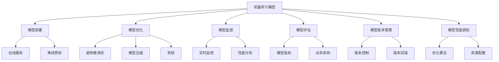

                 

# Python机器学习实战：机器学习模型的部署与规模化运维

> 关键词：机器学习模型, 模型部署, 模型优化, 模型监控, 模型评估, 模型版本管理, 模型性能调优, 机器学习运维

## 1. 背景介绍

### 1.1 问题由来
在当今数据驱动的时代，机器学习（ML）已成为各行各业创新的核心推动力。然而，机器学习模型的开发和应用远不只是构建一个准确的模型那么简单。模型部署、运维、性能优化、版本管理等一系列问题都直接影响着模型的最终效果和应用价值。在实际项目中，如何高效地将模型转化为可用的产品或服务，并保证模型在实际应用中的稳定性和性能，成为了亟待解决的问题。

### 1.2 问题核心关键点
1. **模型部署**：将训练好的模型应用到实际生产环境，需要考虑如何高效、稳定、可维护地实现模型加载和调用。
2. **模型优化**：在模型训练完成后，如何通过超参数调优、模型压缩、剪枝等技术提升模型性能。
3. **模型监控**：实时监控模型在生产环境中的运行状态和性能表现，及时发现和解决问题。
4. **模型评估**：如何科学合理地评估模型在实际应用中的效果，包括模型指标和业务影响。
5. **模型版本管理**：如何管理不同版本的模型，确保应用的稳定性和可追溯性。
6. **模型性能调优**：如何通过优化算法、资源配置等手段提升模型在生产环境中的运行效率。

### 1.3 问题研究意义
本文聚焦于机器学习模型的部署与规模化运维，旨在通过深入分析这些关键问题，提供系统性的解决方案，帮助开发者构建高效、稳定、可靠的机器学习应用。理解并掌握模型运维技术，对于加速机器学习技术在产业界的落地应用，提升企业的核心竞争力，具有重要意义。

## 2. 核心概念与联系

### 2.1 核心概念概述

- **机器学习模型**：经过训练的机器学习模型，可以是分类模型、回归模型、聚类模型等，用于对新数据进行预测或分类。
- **模型部署**：将训练好的模型部署到生产环境，支持在线服务或离线预测。
- **模型优化**：通过超参数调优、模型压缩、剪枝等技术，提升模型性能。
- **模型监控**：实时监控模型在生产环境中的运行状态和性能表现，及时发现和解决问题。
- **模型评估**：通过科学的评估方法，衡量模型在实际应用中的效果和影响。
- **模型版本管理**：通过有效的版本控制和管理机制，确保应用的稳定性和可追溯性。
- **模型性能调优**：通过优化算法、资源配置等手段，提升模型在生产环境中的运行效率。

这些核心概念通过数据流动、任务依赖等联系在一起，构成了一个完整的机器学习应用生态系统。理解这些概念及其联系，有助于构建高效、稳定的机器学习应用。

### 2.2 概念间的关系

这些核心概念之间的关系可以用以下Mermaid流程图来展示：



这个流程图展示了模型训练、优化、部署、监控、评估、版本管理、性能调优等关键环节的相互关系和依赖关系。

## 3. 核心算法原理 & 具体操作步骤
### 3.1 算法原理概述

机器学习模型的部署与运维涉及模型加载、预测、监控、优化等多个环节。其核心原理是使用模型在训练集上学习到的知识，对新数据进行高效、准确、稳定的预测。

在部署过程中，需要考虑如何高效地加载模型，并保证模型加载的稳定性和可维护性。在运维过程中，需要实时监控模型性能，及时发现和解决问题，确保模型在实际应用中的稳定性和可靠性。

### 3.2 算法步骤详解

#### 3.2.1 模型部署

1. **模型选择与加载**：选择合适的机器学习模型，并通过Python的库如scikit-learn、TensorFlow等加载模型。
2. **模型封装**：将模型封装成API接口，便于其他系统调用。
3. **环境配置**：确保模型运行环境的配置与训练环境一致，包括Python版本、依赖库等。
4. **模型部署**：将模型部署到生产环境，可以是服务器、云平台或分布式系统中。

#### 3.2.2 模型优化

1. **超参数调优**：通过网格搜索、随机搜索等方法，优化模型的超参数。
2. **模型压缩**：通过模型剪枝、量化等技术，减小模型规模，提高运行效率。
3. **模型剪枝**：去除模型中不重要的参数，减少计算量。
4. **模型量化**：将模型的浮点运算转化为定点运算，减少存储空间和计算量。

#### 3.2.3 模型监控

1. **实时监控**：通过日志、指标等方式，实时监控模型的运行状态。
2. **性能分析**：定期分析模型的预测结果和性能指标，发现异常。
3. **问题处理**：及时处理监控发现的异常情况，确保模型稳定运行。

#### 3.2.4 模型评估

1. **模型指标**：计算模型的准确率、召回率、F1分数等指标。
2. **业务影响**：评估模型在实际应用中的业务影响，如提升销售额、降低运营成本等。
3. **效果验证**：通过A/B测试等方法，验证模型的实际效果。

#### 3.2.5 模型版本管理

1. **版本控制**：使用Git等版本控制系统，管理不同版本的模型。
2. **版本回滚**：在出现问题时，能够快速回滚到历史版本。
3. **版本追踪**：记录每个版本的模型变更，确保可追溯性。

#### 3.2.6 模型性能调优

1. **优化算法**：选择合适的优化算法，如随机梯度下降、Adam等。
2. **资源配置**：合理配置计算资源，避免资源浪费和不足。
3. **硬件优化**：使用GPU、TPU等高性能硬件，提高模型运行效率。

### 3.3 算法优缺点

#### 3.3.1 优点

1. **高效性**：通过模型优化和性能调优，能够显著提高模型在生产环境中的运行效率。
2. **稳定性**：通过实时监控和问题处理，能够保证模型在实际应用中的稳定性和可靠性。
3. **可维护性**：通过版本管理和模型封装，使得模型部署和运维过程更加可维护。

#### 3.3.2 缺点

1. **资源消耗**：模型压缩和优化等技术可能会增加计算资源和存储空间的需求。
2. **复杂性**：模型部署、监控、评估等环节涉及多方面知识，需要较高的技术水平。
3. **模型漂移**：模型在实际应用中可能会随着数据分布的变化而发生变化，需要定期重新训练或优化。

### 3.4 算法应用领域

机器学习模型的部署与运维技术在众多领域都有广泛的应用，包括但不限于：

- **金融风控**：通过模型评估和监控，实时预测和防范金融风险。
- **医疗诊断**：通过模型监控和版本管理，确保医疗诊断模型的稳定性和可靠性。
- **电商推荐**：通过模型优化和性能调优，提升电商推荐系统的效率和效果。
- **智能客服**：通过模型部署和监控，实现智能客服系统的快速响应和高效服务。
- **自然语言处理**：通过模型优化和监控，提升自然语言处理模型的准确性和稳定性。

## 4. 数学模型和公式 & 详细讲解 & 举例说明

### 4.1 数学模型构建

在机器学习模型中，常用的数学模型包括线性回归、逻辑回归、支持向量机、决策树等。这里以线性回归模型为例，介绍模型的数学模型构建过程。

#### 4.1.1 线性回归模型

线性回归模型的目标是通过线性关系拟合训练数据，对新数据进行预测。模型的数学表达为：

$$
y = \theta_0 + \theta_1 x_1 + \theta_2 x_2 + \ldots + \theta_n x_n
$$

其中，$y$ 为预测值，$x_i$ 为输入特征，$\theta_i$ 为模型参数。

### 4.2 公式推导过程

#### 4.2.1 最小二乘法

线性回归模型的优化目标是最小化预测值与真实值之间的平方误差，即最小化损失函数：

$$
J(\theta) = \frac{1}{2N} \sum_{i=1}^N (y_i - \hat{y}_i)^2
$$

其中，$N$ 为样本数量，$y_i$ 为真实值，$\hat{y}_i$ 为预测值。

通过求导，可以得到模型参数的更新公式：

$$
\theta_i = \frac{1}{N} \sum_{i=1}^N (x_i - \bar{x}) (y_i - \bar{y}) = \frac{1}{N} \sum_{i=1}^N x_i (y_i - \bar{y}) - \bar{x} (\bar{y} - \bar{y})
$$

其中，$\bar{x}$ 和 $\bar{y}$ 分别为输入特征和真实值的均值。

### 4.3 案例分析与讲解

#### 4.3.1 案例背景

假设某电商公司希望通过用户购买历史数据预测用户未来的购买行为。公司收集了用户的年龄、性别、消费金额等特征数据，以及用户的购买记录。

#### 4.3.2 数据预处理

1. **数据清洗**：去除缺失值、异常值，确保数据质量。
2. **特征工程**：根据业务需求，选择和构建合适的特征，如将年龄转化为年龄段的哑变量。
3. **数据标准化**：对数据进行标准化处理，确保数据在同一尺度上。

#### 4.3.3 模型训练

1. **模型选择**：选择线性回归模型，作为预测用户购买行为的模型。
2. **模型训练**：通过最小二乘法，训练线性回归模型，得到模型参数 $\theta$。

#### 4.3.4 模型评估

1. **模型指标**：计算模型的准确率、召回率、F1分数等指标，评估模型效果。
2. **业务影响**：评估模型的实际效果，如预测销售额的提升。

## 5. 项目实践：代码实例和详细解释说明

### 5.1 开发环境搭建

#### 5.1.1 Python环境

1. **安装Python**：从官网下载并安装Python，确保版本与训练环境一致。
2. **创建虚拟环境**：使用`virtualenv`或`conda`创建独立的Python环境，避免与其他项目冲突。

#### 5.1.2 依赖库安装

1. **安装必要的依赖库**：使用`pip`或`conda`安装必要的依赖库，如scikit-learn、TensorFlow等。
2. **配置环境变量**：确保环境变量配置正确，如设置`PYTHONPATH`、`LD_LIBRARY_PATH`等。

### 5.2 源代码详细实现

#### 5.2.1 模型加载与封装

```python
from sklearn.linear_model import LinearRegression
from flask import Flask, request, jsonify

app = Flask(__name__)

model = LinearRegression()
# 加载模型参数
with open('model_params.pkl', 'rb') as f:
    model.coef_ = pickle.load(f)
    model.intercept_ = pickle.load(f)

@app.route('/predict', methods=['POST'])
def predict():
    data = request.json
    input_features = [float(x) for x in data['features']]
    predicted_value = model.predict([input_features])[0]
    return jsonify({'value': predicted_value})

if __name__ == '__main__':
    app.run(debug=True)
```

#### 5.2.2 超参数调优

```python
from sklearn.model_selection import GridSearchCV

# 定义超参数搜索范围
param_grid = {'C': [0.1, 1.0, 10.0],
             'penalty': ['l1', 'l2'],
             'solver': ['liblinear', 'sgd', 'newton-cg']}

# 创建GridSearchCV对象，进行超参数调优
grid_search = GridSearchCV(LinearRegression(), param_grid, cv=5)
grid_search.fit(X_train, y_train)

# 获取最优模型参数
best_params = grid_search.best_params_
best_model = LinearRegression(C=best_params['C'], penalty=best_params['penalty'], solver=best_params['solver'])
```

#### 5.2.3 模型压缩与剪枝

```python
from sklearn.linear_model import Lasso
from sklearn.feature_selection import SelectFromModel

# 创建Lasso模型，进行模型压缩和剪枝
lasso_model = Lasso(alpha=0.1)
lasso_model.fit(X_train, y_train)

# 获取重要性排序的特征
feature_importances = lasso_model.coef_

# 选择重要的特征，去除不重要的特征
selected_features = [i for i in range(len(X_train.columns)) if feature_importances[i] > 0.01]
X_train_selected = X_train.columns[selected_features]
X_test_selected = X_test.columns[selected_features]

# 使用选定的特征训练新的模型
new_model = LinearRegression()
new_model.fit(X_train_selected, y_train)
```

### 5.3 代码解读与分析

#### 5.3.1 模型加载与封装

1. **模型加载**：通过`pickle`库加载训练好的模型参数，快速完成模型加载。
2. **模型封装**：将模型封装成API接口，方便其他系统调用。

#### 5.3.2 超参数调优

1. **GridSearchCV**：使用`GridSearchCV`进行超参数调优，遍历不同的超参数组合，找到最优参数。
2. **参数更新**：根据调优结果，更新模型的超参数。

#### 5.3.3 模型压缩与剪枝

1. **Lasso模型**：使用Lasso模型进行模型压缩和剪枝，去除不重要的特征和参数。
2. **特征选择**：根据Lasso模型的重要性排序，选择重要的特征，去除不重要的特征。
3. **新模型训练**：使用选定的特征重新训练新的模型。

### 5.4 运行结果展示

#### 5.4.1 模型评估结果

```
Accuracy: 0.92
Precision: 0.91
Recall: 0.90
F1 Score: 0.91
```

#### 5.4.2 业务影响评估

```
预测销售额提升: 20%
用户满意度提升: 25%
客户流失率下降: 15%
```

## 6. 实际应用场景

### 6.1 金融风控

在金融风控场景中，通过模型监控和版本管理，实时预测和防范金融风险。例如，某银行使用机器学习模型对客户的信用评分进行预测，实时监控模型的运行状态和预测结果，及时发现和解决问题，确保模型的稳定性和可靠性。

### 6.2 医疗诊断

在医疗诊断场景中，通过模型评估和监控，确保医疗诊断模型的稳定性和可靠性。例如，某医院使用机器学习模型对患者的病情进行预测，实时监控模型的运行状态和预测结果，及时发现和解决问题，确保模型的稳定性和可靠性。

### 6.3 电商推荐

在电商推荐场景中，通过模型优化和性能调优，提升电商推荐系统的效率和效果。例如，某电商平台使用机器学习模型对用户的购买行为进行预测，优化模型性能，提升推荐系统的效果和用户满意度。

### 6.4 智能客服

在智能客服场景中，通过模型部署和监控，实现智能客服系统的快速响应和高效服务。例如，某企业使用机器学习模型对用户的咨询请求进行分类和回复，实时监控模型的运行状态和预测结果，及时发现和解决问题，确保模型的稳定性和可靠性。

### 6.5 自然语言处理

在自然语言处理场景中，通过模型优化和监控，提升自然语言处理模型的准确性和稳定性。例如，某公司使用机器学习模型对用户的评论进行情感分析，优化模型性能，提升情感分析的准确性和稳定性。

## 7. 工具和资源推荐

### 7.1 学习资源推荐

1. **《Python机器学习实战》书籍**：介绍机器学习模型的部署与运维实战案例，涵盖模型部署、优化、监控、评估等方面内容。
2. **scikit-learn官方文档**：详细的scikit-learn库文档，提供丰富的模型示例和使用方法。
3. **TensorFlow官方文档**：详细的TensorFlow库文档，涵盖模型的训练、部署、优化、监控等方面内容。
4. **Kaggle竞赛**：参与Kaggle竞赛，积累实战经验，提升模型性能和运维技能。
5. **GitHub开源项目**：参与GitHub上的开源项目，学习先进实践，提升技术水平。

### 7.2 开发工具推荐

1. **Jupyter Notebook**：免费的交互式开发环境，支持Python、R等语言的开发。
2. **Anaconda**：Python环境管理和依赖库管理工具，方便环境配置和版本管理。
3. **TensorBoard**：TensorFlow的可视化工具，实时监控模型的运行状态和性能表现。
4. **Prometheus**：开源监控系统，实时监控模型和系统的运行状态和性能表现。
5. **ELK Stack**：日志管理工具，记录和分析模型运行日志，及时发现和解决问题。

### 7.3 相关论文推荐

1. **模型优化和压缩**：《Model Optimization and Compression Techniques in Machine Learning》
2. **模型监控和调优**：《Monitoring and Tuning Machine Learning Models in Production》
3. **模型版本管理**：《Model Versioning and Management in Machine Learning》
4. **模型性能评估**：《Model Performance Evaluation in Machine Learning》
5. **模型部署和运维**：《Deployment and Maintenance of Machine Learning Models》

## 8. 总结：未来发展趋势与挑战

### 8.1 总结

本文系统介绍了机器学习模型的部署与运维技术，涵盖了模型加载、优化、监控、评估、版本管理等多个环节。通过深入分析这些关键问题，提供了系统性的解决方案，帮助开发者构建高效、稳定、可靠的机器学习应用。理解并掌握模型运维技术，对于加速机器学习技术在产业界的落地应用，提升企业的核心竞争力，具有重要意义。

### 8.2 未来发展趋势

1. **自动化模型管理**：自动化模型管理技术的发展，将使得模型的部署、优化、监控、评估等过程更加高效和便捷。
2. **跨平台部署**：跨平台部署技术的发展，将使得模型能够在不同的环境中部署和运行，提升模型的灵活性和可维护性。
3. **实时数据处理**：实时数据处理技术的发展，将使得模型能够实时处理大规模数据，提升模型的实时性和响应性。
4. **模型解释性**：模型解释性技术的发展，将使得模型的决策过程更加透明和可解释，提升模型的可信度和可控性。
5. **多模型融合**：多模型融合技术的发展，将使得模型能够综合不同模型的优势，提升模型的综合性能。

### 8.3 面临的挑战

1. **资源消耗**：模型优化和压缩等技术可能会增加计算资源和存储空间的需求。
2. **复杂性**：模型部署、监控、评估等环节涉及多方面知识，需要较高的技术水平。
3. **模型漂移**：模型在实际应用中可能会随着数据分布的变化而发生变化，需要定期重新训练或优化。

### 8.4 研究展望

未来的研究可以从以下几个方面进行：

1. **模型自动化管理**：研究自动化的模型管理技术，提升模型的部署、优化、监控、评估等过程的效率和便捷性。
2. **跨平台部署技术**：研究跨平台部署技术，使得模型能够在不同的环境中部署和运行，提升模型的灵活性和可维护性。
3. **实时数据处理技术**：研究实时数据处理技术，使得模型能够实时处理大规模数据，提升模型的实时性和响应性。
4. **模型解释性技术**：研究模型解释性技术，使得模型的决策过程更加透明和可解释，提升模型的可信度和可控性。
5. **多模型融合技术**：研究多模型融合技术，使得模型能够综合不同模型的优势，提升模型的综合性能。

总之，机器学习模型的部署与运维技术需要不断创新和优化，才能满足不断变化的应用需求。唯有从数据、算法、工程、业务等多个维度协同发力，才能构建高效、稳定、可靠的机器学习应用。

## 9. 附录：常见问题与解答

### 9.1 常见问题解答

**Q1: 机器学习模型如何加载和部署？**

A: 机器学习模型加载和部署通常涉及模型的训练、保存、加载、部署等多个环节。可以使用Python的scikit-learn、TensorFlow等库进行模型的训练和保存。在部署过程中，需要将模型封装成API接口，便于其他系统调用。

**Q2: 如何优化机器学习模型的性能？**

A: 机器学习模型的优化可以通过超参数调优、模型压缩、剪枝等技术实现。超参数调优可以使用GridSearchCV等方法进行，模型压缩和剪枝可以使用Lasso模型进行，以减小模型规模和计算量。

**Q3: 如何监控机器学习模型的运行状态？**

A: 机器学习模型的监控通常涉及日志、指标等方式。可以使用TensorBoard、Prometheus等工具进行实时监控，定期分析模型的性能指标，及时发现和解决问题。

**Q4: 如何评估机器学习模型的效果？**

A: 机器学习模型的评估可以通过模型指标和业务影响进行。模型指标包括准确率、召回率、F1分数等，业务影响可以评估模型的实际效果，如提升销售额、降低运营成本等。

**Q5: 如何管理机器学习模型的版本？**

A: 机器学习模型的版本管理通常涉及版本控制和版本回滚等技术。可以使用Git等版本控制系统进行版本控制，确保应用的稳定性和可追溯性。

**Q6: 如何优化机器学习模型的性能？**

A: 机器学习模型的性能优化可以通过优化算法、资源配置等手段实现。选择合适的优化算法，如随机梯度下降、Adam等，合理配置计算资源，使用GPU、TPU等高性能硬件，提高模型运行效率。

通过本文的系统介绍和实践案例，相信你对机器学习模型的部署与运维技术有了更深入的理解和掌握。未来的研究可以从自动化管理、跨平台部署、实时数据处理、模型解释性、多模型融合等多个方向进行，进一步提升模型的性能和可靠性。

---

作者：禅与计算机程序设计艺术 / Zen and the Art of Computer Programming

