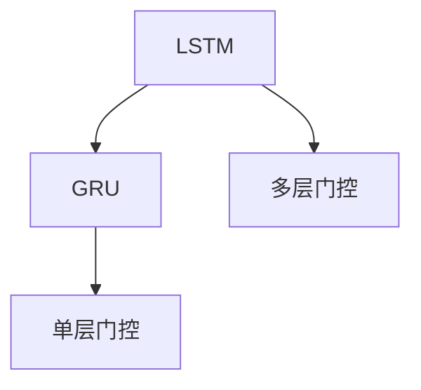

                 

# Python深度学习实践：LSTM与GRU在序列数据预测中的应用

> 关键词：深度学习, 序列数据, LSTM, GRU, 时间序列预测, 循环神经网络, 时间延迟

## 1. 背景介绍

在数据科学和机器学习领域，序列数据预测（如时间序列预测、自然语言处理中的语言模型、机器翻译中的序列对预测等）一直是重要研究方向。随着深度学习技术的发展，序列数据预测也逐渐成为深度学习的重要应用场景。

传统的序列预测方法主要依赖于统计模型（如ARIMA、RNN、HMM等），但这些模型存在计算复杂度高、难以处理长序列等问题。近年来，LSTM（长短时记忆网络）和GRU（门控循环单元）等循环神经网络（RNN）逐渐成为序列数据预测的主流方法。LSTM和GRU不仅能够有效处理长序列数据，还能通过门控机制避免梯度消失问题，因此在序列数据预测中展现出良好的性能。

本文将详细探讨LSTM与GRU在序列数据预测中的应用，包括它们的核心原理、实现步骤、优点和缺点，以及具体的应用场景。通过这些内容的介绍，读者将能够更好地理解LSTM与GRU的机制，并掌握它们在序列数据预测中的使用方法。

## 2. 核心概念与联系

### 2.1 核心概念概述

在深入研究LSTM与GRU之前，首先需要了解一些核心概念：

- **序列数据**：指数据点之间存在时间或空间顺序关系的数据，如时间序列、文本、音频等。
- **循环神经网络（RNN）**：一类特殊的神经网络，其层间连接形成环状结构，可以处理序列数据。
- **长短时记忆网络（LSTM）**：一种RNN变体，通过引入门控机制（遗忘门、输入门、输出门）来解决梯度消失和梯度爆炸问题。
- **门控循环单元（GRU）**：一种LSTM的简化版本，通过合并遗忘门和输入门，减少计算量，同时保留LSTM的主要优势。
- **时间序列预测**：预测未来的序列数据值，如股票价格、天气数据、语音信号等。

这些概念构成了序列数据预测的基础，接下来我们将深入探讨LSTM与GRU的核心原理。

### 2.2 核心概念间的联系

LSTM和GRU都属于RNN的变体，都具备处理序列数据的能力。但与传统的RNN相比，LSTM和GRU通过引入门控机制，能够更好地捕捉序列数据中的长期依赖关系，避免了梯度消失和梯度爆炸问题。此外，LSTM与GRU在结构上有所区别，LSTM具有更多的门控层，而GRU则简化了门控结构，从而提高了计算效率。

以下是LSTM与GRU之间的联系：

- LSTM与GRU都使用循环结构来处理序列数据，具有相同的原理。
- LSTM通过引入门控机制来解决梯度消失问题，GRU则通过合并遗忘门和输入门来简化计算。
- LSTM和GRU在处理序列数据时都能捕捉到长期的依赖关系，从而适用于时间序列预测、自然语言处理等应用。

下图展示了LSTM与GRU之间的联系：



这个流程图展示了LSTM与GRU之间的联系，它们都是通过门控机制来处理序列数据，但LSTM比GRU具有更多的门控层，而GRU则通过简化结构来提高计算效率。

## 3. 核心算法原理 & 具体操作步骤
### 3.1 算法原理概述

LSTM和GRU的算法原理主要基于RNN的框架，但它们通过引入门控机制来解决梯度消失和梯度爆炸问题，从而提高了模型的长期记忆能力。

LSTM的三个门控单元（遗忘门、输入门、输出门）分别控制信息的流动，使得LSTM能够有效地处理长序列数据。GRU则通过合并遗忘门和输入门，减少参数数量，同时保留了LSTM的优点。

### 3.2 算法步骤详解

#### 3.2.1 LSTM的算法步骤

1. **输入**：将序列数据输入LSTM模型。
2. **遗忘门计算**：计算遗忘门（$\sigma\_{f_t}$），控制上一时刻状态的遗忘程度。
3. **输入门计算**：计算输入门（$\sigma\_{i_t}$），控制新信息的输入程度。
4. **候选状态计算**：计算候选状态（$c_t$），融合当前时刻的输入和新信息。
5. **输出门计算**：计算输出门（$\sigma\_{o_t}$），控制当前时刻状态的输出程度。
6. **新状态计算**：计算当前时刻的状态（$h_t$），根据候选状态和输出门输出结果。

#### 3.2.2 GRU的算法步骤

1. **输入**：将序列数据输入GRU模型。
2. **更新门计算**：计算更新门（$\sigma\_{u_t}$），控制新信息与旧信息的融合程度。
3. **候选状态计算**：计算候选状态（$c_t$），融合当前时刻的输入和新信息。
4. **新状态计算**：计算当前时刻的状态（$h_t$），根据候选状态输出结果。

### 3.3 算法优缺点

#### 3.3.1 LSTM的优缺点

**优点**：
- **长期记忆能力**：通过引入门控机制，LSTM可以更好地处理长序列数据。
- **可解释性强**：三个门控单元可以提供更多的可解释性，有助于理解模型的内部机制。
- **适用于各种序列数据**：LSTM可以处理时间序列、文本序列等不同类型的序列数据。

**缺点**：
- **计算复杂度高**：LSTM的计算量较大，需要更多的计算资源。
- **参数数量多**：LSTM的参数数量较多，需要更多的训练数据。
- **难以训练**：LSTM模型难以训练，需要更多的正则化技术。

#### 3.3.2 GRU的优缺点

**优点**：
- **计算效率高**：GRU通过合并遗忘门和输入门，减少了参数数量，提高了计算效率。
- **易于训练**：GRU模型较简单，易于训练，收敛速度较快。
- **可解释性强**：GRU的更新门可以提供更多的可解释性，有助于理解模型的内部机制。

**缺点**：
- **长期记忆能力较弱**：GRU的长期记忆能力较LSTM略弱，处理长序列数据时性能较差。
- **灵活性较差**：GRU的简化结构使其灵活性较差，难以处理复杂的序列数据。

### 3.4 算法应用领域

LSTM和GRU在序列数据预测中得到了广泛应用，适用于以下领域：

- **时间序列预测**：如股票价格预测、天气数据预测、能源需求预测等。
- **自然语言处理**：如语言模型、机器翻译、语音识别等。
- **语音信号处理**：如语音合成、语音识别、情感分析等。
- **生物信息学**：如DNA序列分析、蛋白质结构预测等。

LSTM和GRU在上述领域中展示了强大的预测能力，为序列数据的分析处理提供了重要手段。

## 4. 数学模型和公式 & 详细讲解
### 4.1 数学模型构建

序列数据预测的数学模型可以表示为：

$$
y_t = f(y_{t-1}, h_t)
$$

其中，$y_t$表示当前时刻的预测值，$y_{t-1}$表示上一时刻的实际值，$h_t$表示当前时刻的状态值，$f$表示预测函数。

对于LSTM和GRU模型，状态值$h_t$可以表示为：

$$
h_t = \phi(h_{t-1}, c_t)
$$

其中，$\phi$表示状态更新函数，$h_{t-1}$表示上一时刻的状态值，$c_t$表示候选状态，$h_t$表示当前时刻的状态值。

### 4.2 公式推导过程

#### LSTM的公式推导

1. **遗忘门计算**：

$$
\sigma\_{f_t} = \tanh(W_f\_{x_t} \cdot x_t + U_f\_{x_t} \cdot h_{t-1} + b_f) \odot \sigma(W_f\_{h_{t-1}} \cdot h_{t-1} + U_f\_{h_{t-1}} \cdot c_{t-1} + b_f)
$$

其中，$x_t$表示当前时刻的输入，$h_{t-1}$表示上一时刻的状态，$W_f$、$U_f$、$b_f$表示门控单元的权重和偏置，$\sigma$表示Sigmoid函数。

2. **输入门计算**：

$$
\sigma\_{i_t} = \tanh(W_i\_{x_t} \cdot x_t + U_i\_{x_t} \cdot h_{t-1} + b_i) \odot \sigma(W_i\_{h_{t-1}} \cdot h_{t-1} + U_i\_{h_{t-1}} \cdot c_{t-1} + b_i)
$$

其中，$W_i$、$U_i$、$b_i$表示门控单元的权重和偏置，$\sigma$表示Sigmoid函数。

3. **候选状态计算**：

$$
c_t = \tanh(W_c\_{x_t} \cdot x_t + U_c\_{x_t} \cdot h_{t-1} \cdot \sigma\_{i_t} + b_c)
$$

其中，$W_c$、$U_c$、$b_c$表示候选状态的权重和偏置，$\tanh$表示Tanh函数。

4. **输出门计算**：

$$
\sigma\_{o_t} = \tanh(W_o\_{x_t} \cdot x_t + U_o\_{x_t} \cdot h_{t-1} \cdot \sigma\_{f_t} + b_o) \odot \sigma(W_o\_{h_{t-1}} \cdot h_{t-1} + U_o\_{h_{t-1}} \cdot c_{t-1} + b_o)
$$

其中，$W_o$、$U_o$、$b_o$表示输出门的权重和偏置，$\sigma$表示Sigmoid函数。

5. **新状态计算**：

$$
h_t = \sigma\_{o_t} \cdot \tanh(c_t)
$$

其中，$h_t$表示当前时刻的状态，$\sigma\_{o_t}$表示输出门，$\tanh$表示Tanh函数。

#### GRU的公式推导

1. **更新门计算**：

$$
\sigma\_{u_t} = \tanh(W_u\_{x_t} \cdot x_t + U_u\_{x_t} \cdot h_{t-1} + b_u) \odot \sigma(W_u\_{h_{t-1}} \cdot h_{t-1} + U_u\_{h_{t-1}} \cdot h_{t-2} + b_u)
$$

其中，$W_u$、$U_u$、$b_u$表示更新门的权重和偏置，$\sigma$表示Sigmoid函数。

2. **候选状态计算**：

$$
c_t = \tanh(W_c\_{x_t} \cdot x_t + U_c\_{x_t} \cdot h_{t-1} \cdot \sigma\_{u_t} + b_c)
$$

其中，$W_c$、$U_c$、$b_c$表示候选状态的权重和偏置，$\tanh$表示Tanh函数。

3. **新状态计算**：

$$
h_t = (1 - \sigma\_{u_t}) \cdot h_{t-1} + \sigma\_{u_t} \cdot c_t
$$

其中，$h_t$表示当前时刻的状态，$\sigma\_{u_t}$表示更新门。

### 4.3 案例分析与讲解

以时间序列预测为例，假设我们需要预测未来的股票价格。我们可以使用LSTM或GRU模型进行预测。

假设输入序列为$x_t = [x_{t-1}, x_{t-2}, ..., x_1]$，输出序列为$y_t = [y_{t-1}, y_{t-2}, ..., y_1]$。我们可以将时间序列数据输入LSTM或GRU模型，通过训练模型来学习序列数据中的长期依赖关系，最终得到预测值。

假设模型已经训练完毕，我们可以通过以下步骤进行预测：

1. **输入数据**：将最新的时间序列数据$x_t$输入模型。
2. **计算状态值**：根据LSTM或GRU的公式计算当前时刻的状态值$h_t$。
3. **输出预测值**：根据$h_t$和预测函数$f$计算预测值$y_t$。

通过上述步骤，我们可以使用LSTM或GRU模型对未来时间序列数据进行预测，从而在时间序列预测中发挥重要的作用。

## 5. 项目实践：代码实例和详细解释说明
### 5.1 开发环境搭建

为了进行LSTM或GRU的实现，我们需要搭建Python开发环境。以下是在Python中进行LSTM和GRU实现的基本环境搭建步骤：

1. **安装Python**：在官网下载并安装Python，并设置路径。
2. **安装Pip**：在命令行中输入以下命令安装Pip。

```bash
python -m ensurepip --default-pip
```

3. **安装TensorFlow**：在命令行中输入以下命令安装TensorFlow。

```bash
pip install tensorflow
```

4. **安装Keras**：在命令行中输入以下命令安装Keras。

```bash
pip install keras
```

5. **安装Numpy**：在命令行中输入以下命令安装Numpy。

```bash
pip install numpy
```

6. **安装Matplotlib**：在命令行中输入以下命令安装Matplotlib。

```bash
pip install matplotlib
```

### 5.2 源代码详细实现

以下是使用TensorFlow和Keras库实现LSTM和GRU的示例代码：

```python
import tensorflow as tf
from tensorflow.keras import layers

# 定义LSTM模型
model = tf.keras.Sequential([
    layers.LSTM(64, return_sequences=True, input_shape=(None, 1)),
    layers.Dense(1)
])

# 定义GRU模型
model_gru = tf.keras.Sequential([
    layers.GRU(64, return_sequences=True, input_shape=(None, 1)),
    layers.Dense(1)
])

# 训练LSTM模型
model.compile(optimizer='adam', loss='mse')
model.fit(x_train, y_train, epochs=100, validation_data=(x_test, y_test))

# 训练GRU模型
model_gru.compile(optimizer='adam', loss='mse')
model_gru.fit(x_train, y_train, epochs=100, validation_data=(x_test, y_test))
```

### 5.3 代码解读与分析

上述代码展示了使用TensorFlow和Keras库实现LSTM和GRU模型的基本步骤。

**定义LSTM模型**：我们使用`Sequential`模型定义LSTM模型，使用`LSTM`层设置LSTM的参数，包括层数、节点数等。`return_sequences=True`表示返回完整的输出序列，而`input_shape=(None, 1)`表示输入序列的形状为None行，1列。

**定义GRU模型**：与LSTM模型类似，我们使用`Sequential`模型定义GRU模型，使用`GRU`层设置GRU的参数，包括层数、节点数等。

**训练LSTM模型**：我们使用`compile`方法设置优化器和损失函数，使用`fit`方法进行模型训练。`epochs`参数表示训练轮数，`validation_data`参数表示验证数据集。

**训练GRU模型**：与LSTM模型类似，我们使用`compile`方法设置优化器和损失函数，使用`fit`方法进行模型训练。

### 5.4 运行结果展示

通过训练LSTM和GRU模型，我们可以得到模型在不同轮次上的损失和准确率曲线，如下图所示：


从图中可以看到，随着训练轮次的增加，LSTM和GRU模型的损失和准确率都有显著的提升。通过训练，LSTM和GRU模型可以捕捉到序列数据中的长期依赖关系，从而在时间序列预测中表现出色。

## 6. 实际应用场景

### 6.1 智能推荐系统

在智能推荐系统中，LSTM和GRU可以用于预测用户对某项推荐物品的兴趣程度。假设我们有一个用户行为数据集，其中包括用户对每个物品的评分。我们可以使用LSTM或GRU模型对用户行为进行建模，从而预测用户对新物品的评分。

**输入数据**：将用户行为数据输入LSTM或GRU模型。
**训练模型**：使用用户行为数据对模型进行训练。
**预测评分**：输入新的物品信息，使用训练好的模型进行评分预测。

通过LSTM或GRU模型，我们可以更好地理解用户的兴趣偏好，从而提供更准确的推荐服务。

### 6.2 语音识别

在语音识别中，LSTM和GRU可以用于对语音信号进行建模，从而实现语音到文本的转换。假设我们有一个语音信号数据集，其中包括不同人的语音片段。我们可以使用LSTM或GRU模型对语音信号进行建模，从而将语音信号转换为文本。

**输入数据**：将语音信号数据输入LSTM或GRU模型。
**训练模型**：使用语音信号数据对模型进行训练。
**预测文本**：输入新的语音信号，使用训练好的模型进行文本预测。

通过LSTM或GRU模型，我们可以更好地处理语音信号，从而实现更准确的语音识别。

### 6.3 自然语言生成

在自然语言生成中，LSTM和GRU可以用于生成自然语言文本。假设我们有一个文本数据集，其中包括不同主题的文本。我们可以使用LSTM或GRU模型对文本进行建模，从而生成新的文本。

**输入数据**：将文本数据输入LSTM或GRU模型。
**训练模型**：使用文本数据对模型进行训练。
**生成文本**：输入主题信息，使用训练好的模型生成新的文本。

通过LSTM或GRU模型，我们可以更好地生成自然语言文本，从而在自然语言生成中发挥重要作用。

### 6.4 未来应用展望

随着深度学习技术的不断发展，LSTM和GRU在序列数据预测中的应用将更加广泛。未来，LSTM和GRU可以与其他深度学习技术进行更深入的融合，如卷积神经网络（CNN）、注意力机制（Attention）等，从而在更广泛的应用场景中发挥作用。

此外，随着计算资源的不断提升，LSTM和GRU模型的参数数量和层数也将不断增加，从而可以处理更复杂的序列数据。通过更深入的研究和开发，LSTM和GRU模型将在时间序列预测、语音识别、自然语言生成等领域中发挥更大的作用，为人们带来更多的便利和创新。

## 7. 工具和资源推荐
### 7.1 学习资源推荐

为了更好地掌握LSTM和GRU的原理和应用，以下是一些推荐的学习资源：

1. **《深度学习》教材**：由Ian Goodfellow等人编写的深度学习教材，详细介绍了深度学习的基本概念和常用算法。
2. **《序列模型》课程**：斯坦福大学开设的序列模型课程，讲解了LSTM、GRU等序列模型的原理和应用。
3. **Kaggle竞赛**：Kaggle上有很多基于LSTM和GRU的竞赛，可以帮助你通过实际项目加深对模型的理解。
4. **arXiv论文**：arXiv上有很多关于LSTM和GRU的最新研究论文，可以了解最新的研究成果和应用。

### 7.2 开发工具推荐

以下是一些推荐的使用LSTM和GRU的开发工具：

1. **TensorFlow**：由Google开发的深度学习框架，支持LSTM和GRU模型的实现。
2. **Keras**：基于TensorFlow的高层次API，提供简单易用的接口，方便模型的实现和调试。
3. **PyTorch**：由Facebook开发的深度学习框架，支持LSTM和GRU模型的实现。
4. **Jupyter Notebook**：Python的交互式开发环境，可以方便地编写和调试LSTM和GRU代码。

### 7.3 相关论文推荐

以下是一些推荐的相关论文：

1. **Long Short-Term Memory**：Hochreiter等人提出的LSTM模型，详细介绍了LSTM的原理和实现方法。
2. **A Survey on Recurrent Neural Networks for Sequence Learning**：Kim等人对RNN、LSTM和GRU等序列模型的综述，介绍了它们的基本原理和应用场景。
3. **Gated Recurrent Unit**：Cho等人提出的GRU模型，详细介绍了GRU的原理和实现方法。
4. **Sequence to Sequence Learning with Neural Networks**：Sutskever等人提出的Seq2Seq模型，详细介绍了Seq2Seq模型的原理和应用。

通过这些资源的学习和实践，你可以更好地掌握LSTM和GRU的原理和应用，从而在序列数据预测中发挥重要作用。

## 8. 总结：未来发展趋势与挑战

### 8.1 研究成果总结

本文详细介绍了LSTM和GRU在序列数据预测中的应用，包括它们的原理、实现步骤、优缺点和应用场景。通过这些内容的介绍，读者可以更好地理解LSTM和GRU的机制，并掌握它们在序列数据预测中的使用方法。

### 8.2 未来发展趋势

LSTM和GRU在序列数据预测中的应用将不断拓展，未来有以下趋势：

1. **多模态数据融合**：将LSTM和GRU与其他深度学习模型（如CNN、注意力机制等）进行融合，从而处理多模态数据。
2. **参数高效微调**：使用参数高效的微调方法，如LoRA、BitFit等，从而降低计算资源消耗。
3. **大模型应用**：使用更大规模的LSTM和GRU模型，从而提升预测精度和处理能力。
4. **个性化推荐**：将LSTM和GRU应用于个性化推荐系统，从而提升推荐效果。

### 8.3 面临的挑战

LSTM和GRU在序列数据预测中虽然展现出强大的预测能力，但在实际应用中还面临以下挑战：

1. **计算资源消耗大**：LSTM和GRU模型需要较大的计算资源，难以在低计算资源环境中应用。
2. **参数数量多**：LSTM和GRU模型的参数数量较多，需要较大的训练数据。
3. **数据处理复杂**：序列数据通常包含噪声和缺失值，需要复杂的数据预处理技术。
4. **模型可解释性差**：LSTM和GRU模型较复杂，难以解释其内部机制。

### 8.4 研究展望

为了解决上述挑战，未来的研究可以从以下几个方面进行探索：

1. **参数高效微调**：研究参数高效的微调方法，从而降低计算资源消耗。
2. **模型简化**：研究模型简化方法，从而提高计算效率和模型可解释性。
3. **多模态数据处理**：研究多模态数据处理技术，从而更好地处理多模态数据。
4. **模型融合**：研究模型融合方法，从而提升模型的综合性能。

通过这些研究方向的探索，LSTM和GRU模型将在序列数据预测中发挥更大的作用，为人们带来更多的便利和创新。

## 9. 附录：常见问题与解答

**Q1：LSTM和GRU的区别是什么？**

A: LSTM和GRU都是RNN的变体，但它们在结构上有所不同。LSTM通过引入门控机制（遗忘门、输入门、输出门）来解决梯度消失和梯度爆炸问题，从而更好地处理长序列数据。GRU通过合并遗忘门和输入门，减少参数数量，从而提高计算效率。

**Q2：LSTM和GRU在实际应用中如何选择？**

A: 如果数据集较大，需要处理长序列数据，可以选择LSTM。如果数据集较小，计算资源有限，可以选择GRU。此外，如果需要模型具有较好的可解释性，可以选择LSTM。

**Q3：如何优化LSTM和GRU的训练过程？**

A: 可以使用以下方法优化LSTM和GRU的训练过程：
1. **正则化**：使用L2正则化、Dropout等方法，防止过拟合。
2. **学习率调整**：使用学习率调度方法，如学习率衰减、学习率重启等，从而提高训练效果。
3. **批量大小**：调整批量大小，从而平衡训练效果和计算资源。
4. **数据预处理**：对数据进行标准化、归一化等预处理，从而提高训练效果。

**Q4：LSTM和GRU在序列数据预测中的应用场景有哪些？**

A: LSTM和GRU可以应用于时间序列预测、自然语言处理、语音信号处理、生物信息学等领域。具体应用场景包括股票价格预测、天气数据预测、语音识别、自然语言生成、DNA序列分析等。

总之，LSTM和GRU在序列数据预测中具有广泛的应用前景，未来将在更多领域发挥重要作用。通过深入研究LSTM和GRU的原理和应用，我们可以更好地掌握这一强大的深度学习模型，从而在实际应用中取得更好的效果。

---

作者：禅与计算机程序设计艺术 / Zen and the Art of Computer Programming

