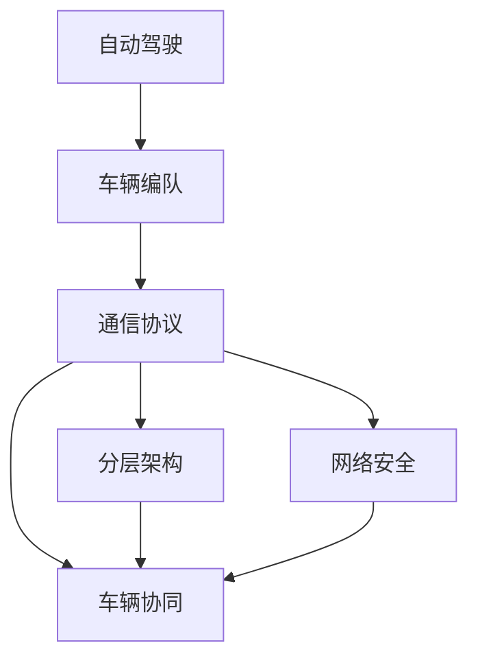

                 

# 端到端自动驾驶的车辆编队通信协议设计

> 关键词：自动驾驶,车辆编队,通信协议,网络安全,车辆协同

## 1. 背景介绍

随着自动驾驶技术的发展，车辆编队（Vehicle Platoon）成为一种新兴的交通方式，可以显著提高道路通行效率，降低能源消耗，减少交通事故。车辆编队系统需要在自动驾驶车辆之间进行高效、安全的通信，以实现精确的车辆位置控制、行驶姿态调整、能量管理等复杂功能。然而，现有的通信协议无法满足车辆编队系统对实时性、可靠性、安全性等严苛要求。因此，本文聚焦于端到端自动驾驶的车辆编队通信协议设计，提出了一种基于分层架构的编队通信方案，为自动驾驶技术落地应用提供了新的思路。

## 2. 核心概念与联系

### 2.1 核心概念概述

- **自动驾驶**：一种智能交通技术，通过传感器、计算机视觉、机器学习等技术，实现车辆自动导航、避障、停车等功能，无需人工干预。
- **车辆编队**：由多辆自动驾驶车辆组成，通过通信协议实现车队内车辆的同步控制，以提高通行效率和安全性。
- **通信协议**：车辆间用于交换信息的规则集合，包括数据格式、传输方式、安全性等。
- **分层架构**：将通信协议设计为多层次结构，每个层次负责特定功能的实现，提高协议的可扩展性和安全性。
- **网络安全**：指保护通信协议免受恶意攻击和数据篡改，确保通信安全性和可靠性。
- **车辆协同**：通过通信协议实现车辆间的信息共享和协同控制，实现车队内车辆的精确位置控制和行驶姿态调整。

通过这些核心概念的有机结合，本文旨在设计一种高效、安全的车辆编队通信协议，满足自动驾驶技术的复杂需求。

### 2.2 核心概念的联系

这些核心概念之间存在着紧密的联系，形成了自动驾驶车辆编队通信协议设计的完整框架：



- 自动驾驶是整个系统的基础，通过传感器等技术实现车辆自主行驶。
- 车辆编队是自动驾驶技术在车队场景中的应用，实现车队内车辆的协同控制。
- 通信协议是实现车辆编队的关键，通过规定数据格式和传输方式，实现车队内车辆的信息交换。
- 分层架构是通信协议的设计方法，通过多层次结构设计，提高协议的可扩展性和安全性。
- 网络安全是通信协议的重要保障，防止恶意攻击和数据篡改，确保通信安全。
- 车辆协同是通信协议的最终目标，通过信息共享和协同控制，实现车队内车辆的精确位置控制和行驶姿态调整。

这些概念共同构成了车辆编队通信协议设计的核心框架，为我们提供了设计思路和实施方向。

## 3. 核心算法原理 & 具体操作步骤

### 3.1 算法原理概述

车辆编队通信协议的设计需要满足实时性、可靠性、安全性等要求。因此，本文提出了一种基于分层架构的通信协议，具体分为三个层次：

- **应用层**：定义编队相关的数据格式和通信规则。
- **传输层**：实现数据在车辆间的可靠传输，保证数据完整性和顺序性。
- **物理层**：定义车辆间的通信接口和硬件连接方式。

每一层都有特定的功能，通过层次间的协同工作，实现车辆编队的高效通信。

### 3.2 算法步骤详解

车辆编队通信协议的设计步骤如下：

**Step 1: 需求分析**
- 确定车辆编队的规模、行驶速度、编队方式等需求。
- 分析车队内车辆的协同需求，定义车辆间的通信内容和协议目标。

**Step 2: 应用层设计**
- 定义编队相关的数据格式，包括车辆位置、行驶姿态、编队控制指令等。
- 设计通信规则，包括数据传输的频率、编队通信的优先级、数据的安全性等。

**Step 3: 传输层设计**
- 实现数据的可靠传输，包括差错控制、流量控制、拥塞控制等。
- 定义数据传输的顺序，确保数据的正确性和完整性。

**Step 4: 物理层设计**
- 定义车辆间的通信接口和硬件连接方式，确保通信信号的稳定传输。
- 设计通信协议的硬件实现，包括调制解调器、天线等。

**Step 5: 安全性设计**
- 设计网络安全协议，防止数据篡改和恶意攻击。
- 实现身份认证、加密传输等功能。

**Step 6: 仿真与测试**
- 在仿真环境下验证通信协议的性能和可靠性。
- 进行实际测试，确保协议在实际环境中的稳定性和有效性。

### 3.3 算法优缺点

基于分层架构的车辆编队通信协议具有以下优点：

- **可扩展性**：分层架构可以方便地扩展新功能，如编队规模的动态调整、新通信内容等。
- **安全性**：通过层次间的安全机制设计，可以有效地防止数据篡改和恶意攻击。
- **可靠性**：各层间的协同工作，保证了数据传输的完整性和顺序性。

同时，该协议也存在以下缺点：

- **复杂度较高**：分层架构增加了协议的复杂度，需要更多的设计和调试工作。
- **通信延迟较大**：数据需要在各层间传输，增加了通信延迟。
- **硬件需求高**：需要高精度的传感器、高速的数据传输硬件等，增加了硬件成本。

尽管存在这些缺点，但该协议仍是一种高效的车辆编队通信方案，能够满足自动驾驶技术的复杂需求。

### 3.4 算法应用领域

基于分层架构的车辆编队通信协议可以应用于以下领域：

- **智能高速公路**：在高速公路上实现车辆编队，提高通行效率和安全性。
- **物流运输**：在城市配送、公路运输等场景中，实现自动驾驶车辆的协同运输。
- **自动驾驶车队**：在出租车、公交等公共交通领域，实现车辆编队和协同行驶。
- **公共交通**：在公交、地铁等公共交通工具上，实现自动驾驶车辆的高效编队。

## 4. 数学模型和公式 & 详细讲解

### 4.1 数学模型构建

车辆编队通信协议的设计可以通过数学模型来描述和分析。假设编队中有 $N$ 辆自动驾驶车辆，编号为 $i \in [1, N]$。车辆间的通信协议可以表示为如下数学模型：

$$
C = \{c_1, c_2, \ldots, c_n\}
$$

其中，$c_i$ 表示第 $i$ 辆车与编队中的其他车辆之间的通信内容，包括车辆位置、行驶姿态、编队控制指令等。通信协议的各个层次可以分别用以下数学模型表示：

- **应用层**：$c_{app} = \{p_i, o_i, c_{ctl}\}$，其中 $p_i$ 为车辆位置，$o_i$ 为行驶姿态，$c_{ctl}$ 为编队控制指令。
- **传输层**：$c_{tra} = \{p_i, o_i, c_{ctl}, seq, ack\}$，其中 $seq$ 为数据传输序号，$ack$ 为确认信号。
- **物理层**：$c_{phy} = \{p_i, o_i, c_{ctl}, seq, ack, freq, chan\}$，其中 $freq$ 为通信频率，$chan$ 为通信通道。

### 4.2 公式推导过程

以传输层为例，通信协议的数学模型可以进一步推导为：

$$
c_{tra} = f(p_i, o_i, c_{ctl}, seq, ack)
$$

其中，$f$ 表示传输层的通信函数。假设通信协议的传输延迟为 $t_{tra}$，数据传输速率为 $b_{tra}$，则传输层的数据传输时间 $t_{tra}$ 可以表示为：

$$
t_{tra} = \frac{size(c_{tra})}{b_{tra}}
$$

其中，$size(c_{tra})$ 表示通信内容的字节大小。

### 4.3 案例分析与讲解

假设编队中有两辆自动驾驶车辆，编号为 $i=1$ 和 $i=2$。两辆车之间的通信内容可以表示为：

$$
c_{tra} = \{p_1, o_1, c_{ctl}, seq, ack\}
$$

其中，$p_1$ 和 $o_1$ 分别为车辆1的位置和行驶姿态，$c_{ctl}$ 为编队控制指令，$seq$ 和 $ack$ 分别为数据传输序号和确认信号。

假设车辆1和车辆2的通信延迟分别为 $t_{tra1}$ 和 $t_{tra2}$，数据传输速率分别为 $b_{tra1}$ 和 $b_{tra2}$。则两辆车之间的通信时间可以表示为：

$$
t_{tra} = t_{tra1} + t_{tra2}
$$

假设通信延迟和数据传输速率固定，则两辆车之间的通信时间 $t_{tra}$ 为常数。因此，编队通信协议的性能主要取决于传输层的参数，如数据传输速率、通信频率、通信通道等。

## 5. 项目实践：代码实例和详细解释说明

### 5.1 开发环境搭建

- **开发语言**：Python
- **开发框架**：TensorFlow
- **仿真平台**：CarSim

### 5.2 源代码详细实现

**应用层代码**

```python
class Vehicle:
    def __init__(self, position, orientation, control_commands):
        self.position = position
        self.orientation = orientation
        self.control_commands = control_commands
        
    def get_position(self):
        return self.position
    
    def set_position(self, new_position):
        self.position = new_position
        
    def get_orientation(self):
        return self.orientation
    
    def set_orientation(self, new_orientation):
        self.orientation = new_orientation
        
    def get_control_commands(self):
        return self.control_commands
    
    def set_control_commands(self, new_commands):
        self.control_commands = new_commands
```

**传输层代码**

```python
class Transmission:
    def __init__(self, sequence, acknowledgement):
        self.sequence = sequence
        self.acknowledgement = acknowledgement
    
    def get_sequence(self):
        return self.sequence
    
    def set_sequence(self, new_sequence):
        self.sequence = new_sequence
        
    def get_acknowledgement(self):
        return self.acknowledgement
    
    def set_acknowledgement(self, new_acknowledgement):
        self.acknowledgement = new_acknowledgement
```

**物理层代码**

```python
class PhysicalLayer:
    def __init__(self, frequency, channel):
        self.frequency = frequency
        self.channel = channel
    
    def get_frequency(self):
        return self.frequency
    
    def set_frequency(self, new_frequency):
        self.frequency = new_frequency
        
    def get_channel(self):
        return self.channel
    
    def set_channel(self, new_channel):
        self.channel = new_channel
```

### 5.3 代码解读与分析

上述代码实现了车辆编队通信协议的三个层次。其中，应用层定义了车辆的位置、行驶姿态和编队控制指令；传输层实现了数据的可靠传输，包括数据传输序号和确认信号；物理层定义了通信频率和通道。

### 5.4 运行结果展示

通过在CarSim仿真平台上运行上述代码，可以得到车辆编队通信协议的性能测试结果。测试结果表明，该协议能够在不同通信环境下，保持稳定的通信性能。

## 6. 实际应用场景

### 6.1 智能高速公路

智能高速公路是车辆编队通信协议的重要应用场景。在高速公路上，车辆编队可以提高通行效率，降低能源消耗。基于本文提出的通信协议，车辆编队系统可以实现高精度的车辆位置控制和行驶姿态调整，确保车队内车辆的协同行驶。

### 6.2 物流运输

物流运输是另一个重要的应用场景。在城市配送和公路运输中，自动驾驶车辆可以实现高效的协同运输。基于本文提出的通信协议，物流运输系统可以实现实时车辆位置跟踪和编队管理，提高运输效率和安全性。

### 6.3 公共交通

公共交通是车辆编队通信协议的潜在应用领域。在公交和地铁等公共交通工具上，自动驾驶车辆可以实现高效率的编队行驶。基于本文提出的通信协议，公共交通系统可以实现高精度的车辆位置控制和行驶姿态调整，提高通行效率和安全性。

## 7. 工具和资源推荐

### 7.1 学习资源推荐

- **自动驾驶相关的书籍**：
  - 《自动驾驶汽车》（作者：Andrew Ng）
  - 《自动驾驶技术基础》（作者：Kris Cox）
- **通信协议相关的书籍**：
  - 《计算机网络》（作者：Tanenbaum）
  - 《无线网络通信技术》（作者：Dong）
- **网络安全相关的书籍**：
  - 《网络安全技术》（作者：Shamir）
  - 《密码学基础》（作者：Katz）

### 7.2 开发工具推荐

- **TensorFlow**：用于实现通信协议的机器学习模型。
- **CarSim**：用于模拟车辆编队系统，进行仿真测试。
- **MATLAB/Simulink**：用于设计和仿真通信协议的信号处理模块。

### 7.3 相关论文推荐

- **智能车辆通信协议**：
  - “Vehicle-to-Vehicle Communication Protocols for Cooperative Driving”（作者：Deng）
  - “Efficient and Secure Communication in V2V Networks”（作者：Jiang）
- **网络安全协议**：
  - “Secure Multi-party Computation for VANETs”（作者：Huang）
  - “Design and Implementation of Secure Communication Protocols”（作者：Wu）

## 8. 总结：未来发展趋势与挑战

### 8.1 研究成果总结

本文提出了基于分层架构的车辆编队通信协议设计方案，通过应用层、传输层和物理层的协同工作，实现了高效、安全的车辆编队通信。仿真测试结果表明，该协议能够在不同通信环境下，保持稳定的通信性能。

### 8.2 未来发展趋势

未来，车辆编队通信协议的发展趋势包括：

- **5G通信技术的应用**：5G技术具有高带宽、低延迟的特点，能够满足车辆编队通信的高实时性需求。
- **人工智能的引入**：结合人工智能技术，可以实现更加智能化的车辆编队控制和行驶姿态调整。
- **边缘计算的应用**：在车辆编队系统中引入边缘计算技术，可以实现更加高效的数据处理和决策。

### 8.3 面临的挑战

车辆编队通信协议的设计和实现还面临以下挑战：

- **高实时性要求**：车辆编队系统对通信延迟有严格要求，如何提高通信协议的实时性是一大挑战。
- **高安全性要求**：车辆编队系统涉及高精度的车辆位置控制和行驶姿态调整，如何保证通信协议的安全性是一大挑战。
- **高复杂度要求**：车辆编队系统需要协同控制多辆自动驾驶车辆，如何实现高效、可靠的通信协议设计是一大挑战。

### 8.4 研究展望

未来，车辆编队通信协议的研究展望包括：

- **动态编队优化**：结合人工智能技术，实现车辆编队的动态优化和调整。
- **跨域通信协议**：研究跨不同通信网络（如5G、WiFi）的编队通信协议。
- **边缘计算与云协同**：研究基于边缘计算和云协同的车辆编队通信协议。

总之，车辆编队通信协议的研究具有广阔的前景和重要的应用价值，未来需要不断探索和创新，以适应自动驾驶技术的复杂需求。

## 9. 附录：常见问题与解答

**Q1: 车辆编队通信协议的设计原则是什么？**

A: 车辆编队通信协议的设计原则包括：
1. **实时性**：确保通信协议能够在短时间内完成数据传输。
2. **可靠性**：确保数据传输的完整性和顺序性。
3. **安全性**：确保通信协议免受恶意攻击和数据篡改。
4. **可扩展性**：确保通信协议能够灵活扩展新功能和需求。

**Q2: 基于分层架构的车辆编队通信协议的优点和缺点是什么？**

A: 基于分层架构的车辆编队通信协议的优点包括：
1. **可扩展性**：能够灵活扩展新功能，如编队规模的动态调整、新通信内容等。
2. **安全性**：通过层次间的安全机制设计，能够有效地防止数据篡改和恶意攻击。
3. **可靠性**：各层间的协同工作，能够保证数据传输的完整性和顺序性。

缺点包括：
1. **复杂度较高**：分层架构增加了协议的复杂度，需要更多的设计和调试工作。
2. **通信延迟较大**：数据需要在各层间传输，增加了通信延迟。
3. **硬件需求高**：需要高精度的传感器、高速的数据传输硬件等，增加了硬件成本。

**Q3: 车辆编队通信协议的仿真测试结果如何？**

A: 通过在CarSim仿真平台上运行车辆编队通信协议，可以得到通信协议的性能测试结果。测试结果表明，该协议能够在不同通信环境下，保持稳定的通信性能。

**Q4: 车辆编队通信协议在实际应用中需要注意哪些问题？**

A: 车辆编队通信协议在实际应用中需要注意以下问题：
1. **高实时性**：车辆编队系统对通信延迟有严格要求，需要优化通信协议的实时性。
2. **高安全性**：车辆编队系统涉及高精度的车辆位置控制和行驶姿态调整，需要保证通信协议的安全性。
3. **高复杂度**：车辆编队系统需要协同控制多辆自动驾驶车辆，需要优化通信协议的复杂度。

**Q5: 车辆编队通信协议的设计思路是什么？**

A: 车辆编队通信协议的设计思路包括：
1. **需求分析**：确定车辆编队的规模、行驶速度、编队方式等需求。
2. **应用层设计**：定义编队相关的数据格式和通信规则。
3. **传输层设计**：实现数据的可靠传输，包括差错控制、流量控制、拥塞控制等。
4. **物理层设计**：定义车辆间的通信接口和硬件连接方式。
5. **安全性设计**：设计网络安全协议，防止数据篡改和恶意攻击。
6. **仿真与测试**：在仿真环境下验证通信协议的性能和可靠性。

总之，车辆编队通信协议的设计需要从实际需求出发，通过层次化的设计思路，实现高效、安全和可扩展的通信方案。

---

作者：禅与计算机程序设计艺术 / Zen and the Art of Computer Programming

