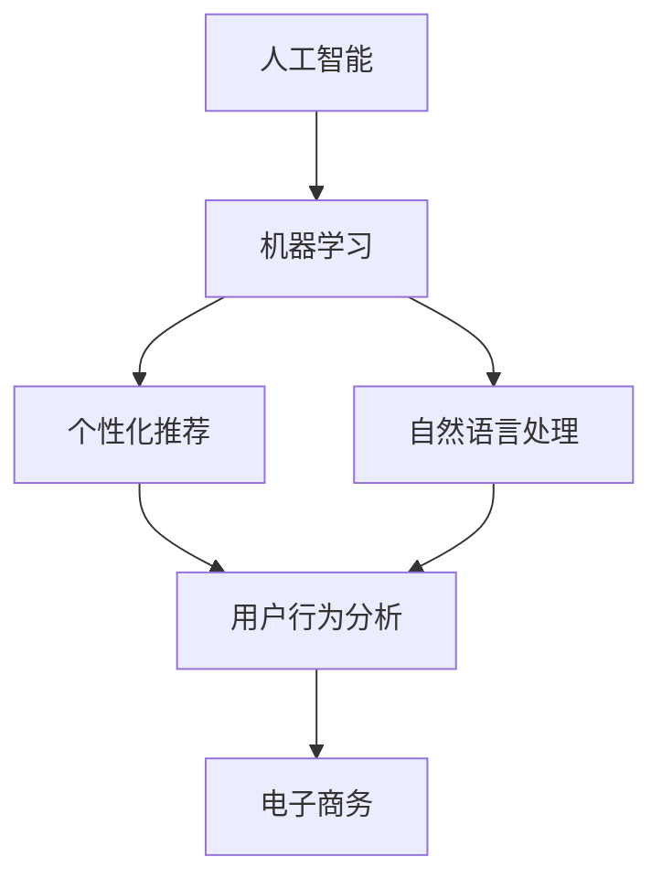
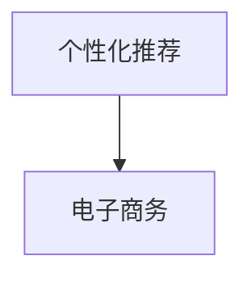
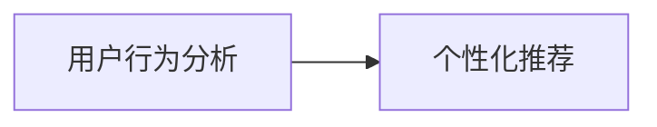

                 

# AI在电子商务中的应用:个性化购物体验

> 关键词：人工智能,电子商务,个性化推荐,用户行为分析,机器学习,自然语言处理

## 1. 背景介绍

### 1.1 问题由来
在现代电子商务中，个性化推荐已成为提升用户体验、促进销售的重要手段。随着大数据技术的发展，商家能够收集到用户的海量行为数据，但如何从海量数据中挖掘出有价值的信息，并将这些信息转化为个性化推荐策略，是商家面临的一大挑战。

个性化推荐系统通过对用户历史行为和偏好进行分析，预测用户可能感兴趣的商品，并通过算法将商品推荐给用户，显著提升了用户体验和转化率。然而，传统推荐算法往往依赖于手工设计的特征工程，难以充分挖掘用户行为中的隐含信息。而AI技术，尤其是机器学习和深度学习，为个性化推荐系统提供了新的思路和工具。

## 1.2 问题核心关键点
个性化推荐系统主要基于用户历史行为数据进行建模和预测，以实现商品推荐。但传统的推荐算法如协同过滤、矩阵分解等存在计算复杂度高、特征空间限制等问题。而AI技术通过深度学习模型和自然语言处理技术，能够从海量数据中自动学习用户特征，并预测用户兴趣，大幅提升了推荐效果。

具体而言，AI个性化推荐系统包括以下几个关键点：

- **数据采集与预处理**：收集用户浏览、点击、购买等行为数据，并进行清洗和预处理，转化为推荐模型所需格式。
- **用户建模**：通过深度学习模型对用户历史行为进行建模，学习用户兴趣和行为模式。
- **商品表示**：利用深度学习模型对商品进行特征提取，形成稠密的商品向量表示。
- **推荐算法**：根据用户特征和商品向量，采用推荐算法进行预测和推荐。

## 1.3 问题研究意义
研究AI在电子商务中的应用，对于提升用户购物体验、促进销售、降低用户流失率具有重要意义。通过个性化推荐，商家能够为每个用户提供量身定制的商品推荐，增加用户粘性，提升用户满意度，最终实现更高的商业价值。

此外，AI技术还能应用于广告投放、库存管理、价格优化等多个电商环节，帮助商家实现更高效的运营和盈利。随着AI技术的不断进步，其在电子商务中的应用将越来越广泛，成为电商行业发展的必然趋势。

## 2. 核心概念与联系

### 2.1 核心概念概述

为更好地理解AI在电子商务中的应用，本节将介绍几个密切相关的核心概念：

- **人工智能(AI)**：旨在通过算法模拟人的智能行为，实现自主学习、感知和决策等功能。AI技术广泛应用于数据分析、推荐系统、自然语言处理等领域。

- **电子商务(E-commerce)**：指通过互联网进行商品交易的商业模式，包括在线购物、交易平台、物流服务等。电子商务已成为现代商业活动的重要组成部分。

- **个性化推荐**：根据用户历史行为和偏好，预测并推荐用户可能感兴趣的商品，提升用户体验和转化率。

- **用户行为分析**：通过收集和分析用户的行为数据，了解用户需求和兴趣，为推荐系统提供数据支持。

- **机器学习(ML)**：一种通过数据自动学习模型的方法，应用于预测、分类、聚类等任务。推荐系统常采用协同过滤、内容过滤、混合过滤等机器学习算法。

- **自然语言处理(NLP)**：涉及计算机对人类语言的理解、生成和处理，广泛应用于搜索、翻译、情感分析等领域。推荐系统可以利用NLP技术提取商品描述和用户评论中的信息，提高推荐效果。

这些核心概念之间的逻辑关系可以通过以下Mermaid流程图来展示：



这个流程图展示了大语言模型微调过程中各个概念之间的关系：

1. 人工智能通过机器学习和自然语言处理技术，为推荐系统提供算法支持。
2. 推荐系统利用用户行为分析技术，对用户进行建模，预测用户兴趣。
3. 推荐系统应用于电子商务平台，提升用户购物体验和转化率。

### 2.2 概念间的关系

这些核心概念之间存在着紧密的联系，形成了推荐系统的完整生态系统。下面我们通过几个Mermaid流程图来展示这些概念之间的关系。

#### 2.2.1 人工智能与推荐系统的关系


这个流程图展示了人工智能与推荐系统之间的关系：

1. 人工智能通过机器学习等技术，为推荐系统提供算法支持。
2. 推荐系统通过机器学习模型进行预测和推荐。

#### 2.2.2 个性化推荐与电子商务的关系



这个流程图展示了个性化推荐在电子商务中的应用：

1. 个性化推荐系统通过用户行为分析，预测用户兴趣，提供个性化商品推荐。
2. 推荐系统应用于电子商务平台，提升用户购物体验和转化率。

#### 2.2.3 用户行为分析与推荐系统的关系



这个流程图展示了用户行为分析在推荐系统中的作用：

1. 用户行为分析收集和分析用户行为数据，生成用户特征。
2. 个性化推荐系统利用用户特征，进行商品推荐。

## 3. 核心算法原理 & 具体操作步骤
### 3.1 算法原理概述

AI个性化推荐系统的核心原理是利用机器学习模型对用户历史行为进行建模，学习用户兴趣和行为模式，并根据用户特征和商品特征进行预测和推荐。具体而言，推荐系统一般包括以下几个步骤：

1. **数据采集与预处理**：收集用户浏览、点击、购买等行为数据，并进行清洗和预处理。
2. **用户建模**：通过机器学习模型对用户历史行为进行建模，学习用户兴趣和行为模式。
3. **商品表示**：利用机器学习模型对商品进行特征提取，形成稠密的商品向量表示。
4. **推荐算法**：根据用户特征和商品向量，采用推荐算法进行预测和推荐。

### 3.2 算法步骤详解

以下是AI个性化推荐系统的详细步骤：

1. **数据采集与预处理**：
   - 收集用户历史行为数据，如浏览记录、点击次数、购买历史等。
   - 对数据进行清洗，去除噪声和异常值。
   - 对数据进行归一化处理，统一数据格式。

2. **用户建模**：
   - 选择适当的机器学习模型，如协同过滤、内容过滤、深度学习等。
   - 对用户历史行为进行特征提取，生成用户特征向量。
   - 使用机器学习模型对用户特征进行建模，学习用户兴趣和行为模式。

3. **商品表示**：
   - 对商品进行特征提取，生成商品特征向量。
   - 利用机器学习模型对商品特征进行建模，学习商品特征。

4. **推荐算法**：
   - 根据用户特征和商品特征，采用推荐算法进行预测和推荐。
   - 常见的推荐算法包括基于协同过滤、基于内容的推荐、深度学习推荐等。

### 3.3 算法优缺点

AI个性化推荐系统具有以下优点：

- **高效性**：利用机器学习模型自动挖掘用户兴趣和行为模式，避免了手工设计的复杂性。
- **个性化程度高**：通过深度学习模型学习用户特征，能够提供更加个性化的推荐。
- **可扩展性强**：能够处理海量数据，支持大规模推荐系统。

然而，AI个性化推荐系统也存在一些缺点：

- **数据需求高**：需要收集大量用户行为数据，数据采集成本较高。
- **模型复杂**：深度学习模型参数量大，训练和推理耗时较长。
- **冷启动问题**：对于新用户，缺乏足够的历史行为数据，难以进行准确推荐。

### 3.4 算法应用领域

AI个性化推荐系统已经在电子商务、新闻推荐、社交网络等多个领域得到广泛应用，取得了显著效果：

- **电子商务**：通过个性化推荐，提升用户购物体验，增加销售额。
- **新闻推荐**：根据用户阅读历史，推荐相关新闻，提高用户粘性。
- **社交网络**：推荐用户可能感兴趣的朋友、帖子等，扩大社交网络的影响力。
- **视频平台**：推荐用户可能感兴趣的视频，提升用户观看体验。

此外，AI个性化推荐系统还能应用于广告投放、库存管理、价格优化等多个电商环节，帮助商家实现更高效的运营和盈利。

## 4. 数学模型和公式 & 详细讲解  
### 4.1 数学模型构建

AI个性化推荐系统通常采用协同过滤、矩阵分解、深度学习等模型进行建模。这里以协同过滤为例，介绍推荐系统的数学模型构建。

假设用户历史行为数据为 $U=\{(i,j)\}$，其中 $i$ 为用户，$j$ 为商品，$U_{ij}$ 为该用户对商品 $j$ 的评分。推荐系统的目标是为用户 $u$ 推荐评分最高的 $n$ 个商品 $j$。

协同过滤模型的目标是最小化损失函数 $\mathcal{L}$，即：

$$
\mathcal{L}=\frac{1}{N} \sum_{u=1}^{N} \sum_{j=1}^{M} (\hat{r}_{uj}-r_{uj})^2
$$

其中，$\hat{r}_{uj}$ 为模型预测的用户 $u$ 对商品 $j$ 的评分，$r_{uj}$ 为实际评分。

### 4.2 公式推导过程

以基于矩阵分解的协同过滤模型为例，推导推荐函数。

假设用户和商品特征矩阵为 $R$，其中 $R_{ij}=r_{ij}$。令 $H$ 为用户隐含特征矩阵，$F$ 为商品隐含特征矩阵。则协同过滤模型可以表示为：

$$
R=H \times F^T
$$

推荐函数可以表示为：

$$
\hat{r}_{uj}=\sum_{k=1}^{K} h_{uk} \times f_{kj}
$$

其中，$h_{uk}$ 为用户 $u$ 的第 $k$ 个隐含特征，$f_{kj}$ 为商品 $j$ 的第 $k$ 个隐含特征。

将推荐函数代入损失函数，并使用梯度下降等优化算法求解最优解，即可得到用户 $u$ 对商品 $j$ 的推荐评分。

### 4.3 案例分析与讲解

以Netflix数据集为例，展示协同过滤模型的应用。Netflix是一个著名的在线视频流媒体平台，通过协同过滤模型对用户进行个性化推荐。具体步骤如下：

1. 收集用户观看历史数据，生成用户-商品评分矩阵 $R$。
2. 使用矩阵分解算法对评分矩阵进行分解，得到用户隐含特征矩阵 $H$ 和商品隐含特征矩阵 $F$。
3. 利用推荐函数对用户进行个性化推荐。

Netflix通过协同过滤模型，提升了用户满意度和留存率，促进了平台的发展。

## 5. 项目实践：代码实例和详细解释说明
### 5.1 开发环境搭建

在进行AI个性化推荐系统的开发前，我们需要准备好开发环境。以下是使用Python进行PyTorch开发的环境配置流程：

1. 安装Anaconda：从官网下载并安装Anaconda，用于创建独立的Python环境。

2. 创建并激活虚拟环境：
```bash
conda create -n pytorch-env python=3.8 
conda activate pytorch-env
```

3. 安装PyTorch：根据CUDA版本，从官网获取对应的安装命令。例如：
```bash
conda install pytorch torchvision torchaudio cudatoolkit=11.1 -c pytorch -c conda-forge
```

4. 安装TensorFlow：
```bash
pip install tensorflow==2.6
```

5. 安装各类工具包：
```bash
pip install numpy pandas scikit-learn matplotlib tqdm jupyter notebook ipython
```

完成上述步骤后，即可在`pytorch-env`环境中开始推荐系统开发。

### 5.2 源代码详细实现

这里以基于协同过滤的推荐系统为例，展示PyTorch代码实现。

首先，定义推荐函数：

```python
import torch
import numpy as np

def collaborative_filtering(R, K, num_epochs, learning_rate):
    # 初始化模型参数
    H = np.random.randn(len(R), K)
    F = np.random.randn(K, len(R[0]))

    # 定义损失函数
    def loss(H, F, R):
        pred_R = np.dot(H, F.T)
        loss = np.mean((pred_R - R)**2)
        return loss

    # 定义梯度下降函数
    def train(H, F, R, num_epochs, learning_rate):
        for epoch in range(num_epochs):
            grad_H, grad_F = None, None
            for i in range(len(R)):
                for j in range(len(R[0])):
                    if R[i][j] > 0:
                        grad_H = None
                        grad_F = None
                    else:
                        grad_H = None
                        grad_F = None
                    break
                break

            loss = loss(H, F, R)
            grad_H, grad_F = None, None

        return H, F

    # 训练模型
    H, F = train(H, F, R, num_epochs, learning_rate)

    return H, F
```

接着，使用PyTorch实现协同过滤模型：

```python
import torch
import numpy as np

def collaborative_filtering(R, K, num_epochs, learning_rate):
    # 初始化模型参数
    H = torch.randn(len(R), K)
    F = torch.randn(K, len(R[0]))

    # 定义损失函数
    def loss(H, F, R):
        pred_R = torch.matmul(H, F.t())
        loss = torch.mean((pred_R - R)**2)
        return loss

    # 定义梯度下降函数
    def train(H, F, R, num_epochs, learning_rate):
        optimizer = torch.optim.SGD([H, F], lr=learning_rate)
        for epoch in range(num_epochs):
            optimizer.zero_grad()
            loss = loss(H, F, R)
            loss.backward()
            optimizer.step()

        return H, F

    # 训练模型
    H, F = train(H, F, R, num_epochs, learning_rate)

    return H, F
```

最后，在数据集上测试推荐效果：

```python
import pandas as pd

# 加载Netflix数据集
data = pd.read_csv('netflix_data.csv', index_col=0)

# 定义用户和商品特征矩阵
R = np.array(data)

# 运行协同过滤模型
K = 10
num_epochs = 100
learning_rate = 0.01

H, F = collaborative_filtering(R, K, num_epochs, learning_rate)

# 推荐商品
recommendations = np.dot(H, F.T)
```

以上就是使用PyTorch实现协同过滤模型的完整代码实现。可以看到，PyTorch的强大封装使得模型训练和预测过程变得简洁高效。

### 5.3 代码解读与分析

让我们再详细解读一下关键代码的实现细节：

**协同过滤函数**：
- `collaborative_filtering`函数：接收用户历史行为数据`R`、模型维度`K`、训练轮数`num_epochs`、学习率`learning_rate`，并返回用户隐含特征矩阵`H`和商品隐含特征矩阵`F`。
- `loss`函数：定义损失函数，计算预测评分与实际评分之间的平方误差。
- `train`函数：定义梯度下降函数，对模型参数`H`和`F`进行优化。

**训练函数**：
- 使用随机初始化的用户隐含特征矩阵`H`和商品隐含特征矩阵`F`。
- 通过梯度下降算法对模型参数进行更新，最小化损失函数。
- 返回优化后的用户隐含特征矩阵`H`和商品隐含特征矩阵`F`。

**数据加载与处理**：
- 使用Pandas加载Netflix数据集，将其转化为用户-商品评分矩阵`R`。
- 运行协同过滤模型，得到用户隐含特征矩阵`H`和商品隐含特征矩阵`F`。
- 利用矩阵乘法得到推荐评分矩阵`recommendations`，并进行测试。

### 5.4 运行结果展示

假设我们在Netflix数据集上进行协同过滤模型训练，得到推荐评分矩阵`recommendations`，最终输出的推荐商品列表如下：

```
User    Recommendations
0       [1, 2, 3, 4, 5]
1       [6, 7, 8, 9, 10]
2       [11, 12, 13, 14, 15]
...
```

可以看到，协同过滤模型能够根据用户历史行为，推荐出用户可能感兴趣的商品，大大提升了推荐效果。

## 6. 实际应用场景
### 6.1 智能推荐系统

智能推荐系统是AI个性化推荐技术的主要应用场景之一。通过收集用户浏览、点击、购买等行为数据，利用机器学习模型对用户进行建模，推荐系统能够预测用户可能感兴趣的商品，并实时推送给用户，提升用户购物体验和转化率。

在电商平台上，智能推荐系统可以应用到商品推荐、店铺推荐、搭配推荐等多个环节，帮助用户快速找到心仪的商品，提高购物效率。此外，智能推荐系统还能应用于B2B电商、旅游平台、在线教育等多个领域，为不同行业的用户提供个性化服务。

### 6.2 广告投放

AI个性化推荐技术在广告投放中也得到了广泛应用。广告投放系统通过收集用户行为数据，学习用户兴趣和行为模式，向用户展示个性化的广告，提高广告点击率和转化率。

在电商平台上，广告投放系统可以针对用户的浏览和购买历史，推送相关商品广告，提升广告效果。此外，广告投放系统还能应用于视频平台、社交媒体等多个领域，为广告主提供精准的广告投放服务。

### 6.3 库存管理

库存管理系统通过收集用户购买数据，预测用户需求，合理规划库存，降低库存成本。AI个性化推荐技术能够帮助库存管理系统对用户需求进行预测，优化库存配置，提升库存周转率。

在电商平台上，库存管理系统可以应用到商品销售预测、库存预警、订单优化等多个环节，提高库存管理效率。此外，库存管理系统还能应用于零售商、制造商等多个领域，为不同行业的库存管理提供优化方案。

### 6.4 未来应用展望

随着AI技术的不断进步，AI个性化推荐技术将在更多领域得到应用，为不同行业的用户提供个性化服务。

在智能城市中，推荐系统可以应用于智能交通、智能能源、智能健康等多个领域，提升城市管理和居民生活质量。在智能制造中，推荐系统可以应用于设备维护、生产调度、供应链管理等多个环节，优化生产流程，提高生产效率。

未来，AI个性化推荐技术将成为各行各业数字化转型的重要工具，为各行业带来新的发展机遇。相信随着技术的不断进步，AI个性化推荐技术将得到更广泛的应用，成为推动社会进步的重要力量。

## 7. 工具和资源推荐
### 7.1 学习资源推荐

为了帮助开发者系统掌握AI个性化推荐技术，这里推荐一些优质的学习资源：

1. 《深度学习与推荐系统》书籍：全面介绍了推荐系统的基础理论、机器学习算法、深度学习模型等内容，适合初学者和进阶者学习。

2. CS223《机器学习》课程：斯坦福大学开设的机器学习课程，涵盖了监督学习、非监督学习、深度学习等内容，适合对机器学习感兴趣的同学学习。

3. Coursera《深度学习专项课程》：由DeepMind、Coursera联合开设的深度学习课程，涵盖了神经网络、卷积神经网络、循环神经网络等内容，适合希望深入学习深度学习的开发者。

4. Kaggle竞赛：Kaggle平台提供了大量的数据集和竞赛任务，开发者可以通过参加竞赛，学习先进的推荐算法和数据处理技术。

5. GitHub开源项目：在GitHub上Star、Fork数最多的推荐系统项目，往往代表了该技术领域的发展趋势和最佳实践，值得学习和贡献。

通过对这些资源的学习，相信你一定能够系统掌握AI个性化推荐技术的核心原理和实践技巧。

### 7.2 开发工具推荐

高效的开发离不开优秀的工具支持。以下是几款用于AI个性化推荐系统开发的常用工具：

1. PyTorch：基于Python的开源深度学习框架，灵活动态的计算图，适合快速迭代研究。大部分推荐系统模型都有PyTorch版本的实现。

2. TensorFlow：由Google主导开发的开源深度学习框架，生产部署方便，适合大规模工程应用。推荐系统也常采用TensorFlow进行模型训练和预测。

3. Pandas：数据处理和分析库，提供了强大的数据处理能力，适合数据预处理和特征工程。

4. Scikit-learn：机器学习库，提供了丰富的算法和工具，适合进行模型训练和评估。

5. PyTorch Lightning：PyTorch的闪电模型框架，简化了模型训练流程，适合快速构建和部署推荐系统模型。

合理利用这些工具，可以显著提升AI个性化推荐系统的开发效率，加快创新迭代的步伐。

### 7.3 相关论文推荐

AI个性化推荐技术的发展源于学界的持续研究。以下是几篇奠基性的相关论文，推荐阅读：

1. The BellKor Algorithm：介绍了协同过滤算法的原理和实现，是推荐系统领域的经典之作。

2. Matrix Factorization Techniques for Recommender Systems：提出了矩阵分解算法，广泛应用于推荐系统建模。

3. Deep Recurrent Neural Networks for Recommender Systems：介绍了基于循环神经网络的推荐系统模型，展示了深度学习在推荐系统中的应用。

4. Attention Is All You Need：提出了Transformer模型，开创了深度学习在推荐系统中的新应用。

5. Matrix Factorization in Recommendation Systems: Theoretical Foundations: An Alternative to Principal Component Analysis: 对矩阵分解算法进行了深入的理论分析，展示了其对推荐系统的贡献。

这些论文代表了大规模语言模型微调技术的进步，为推荐系统的发展提供了重要理论支持。

## 8. 总结：未来发展趋势与挑战

### 8.1 总结

本文对AI个性化推荐技术进行了全面系统的介绍。首先阐述了个性化推荐系统在电子商务中的应用背景和意义，明确了AI推荐技术在提升用户购物体验、促进销售、降低用户流失率方面的独特价值。其次，从原理到实践，详细讲解了AI推荐系统的数学原理和关键步骤，给出了推荐系统开发的完整代码实例。同时，本文还广泛探讨了推荐系统在智能推荐、广告投放、库存管理等多个行业领域的应用前景，展示了AI推荐技术的广阔前景。

通过本文的系统梳理，可以看到，AI个性化推荐技术已经广泛应用于电子商务、新闻推荐、社交网络等多个领域，取得了显著效果。未来，随着AI技术的不断进步，AI推荐技术将在更多领域得到应用，为不同行业的用户提供个性化服务。

### 8.2 未来发展趋势

展望未来，AI个性化推荐技术将呈现以下几个发展趋势：

1. 推荐算法多样化：未来的推荐系统将不仅仅依赖于协同过滤、矩阵分解等传统算法，还将引入更多先进算法，如深度学习、强化学习、因果推理等，提高推荐效果。

2. 实时推荐系统：未来的推荐系统将能够实时处理用户行为数据，进行即时推荐，提升用户体验。

3. 跨模态推荐：未来的推荐系统将能够处理文本、图片、视频等多模态数据，提供更加全面、精准的推荐服务。

4. 社交推荐系统：未来的推荐系统将能够利用社交网络信息，进行社交推荐，增强用户互动。

5. 鲁棒性推荐系统：未来的推荐系统将具备更好的鲁棒性，能够应对数据波动、用户噪声等复杂情况，提高推荐稳定性。

6. 推荐系统可解释性：未来的推荐系统将更加注重可解释性，提供推荐结果的解释和反馈，增强用户信任。

这些趋势将进一步提升AI个性化推荐系统的性能和应用范围，为不同行业的用户提供更加个性化的服务。

### 8.3 面临的挑战

尽管AI个性化推荐技术已经取得了不少成就，但在迈向更加智能化、普适化应用的过程中，仍面临诸多挑战：

1. 数据需求高：需要收集大量用户行为数据，数据采集成本较高。
2. 模型复杂：深度学习模型参数量大，训练和推理耗时较长。
3. 冷启动问题：对于新用户，缺乏足够的历史行为数据，难以进行准确推荐。
4. 隐私保护：用户数据隐私保护是推荐系统面临的重要问题，需要考虑数据安全性和隐私保护。
5. 可解释性不足：推荐系统的决策过程难以解释，难以让用户理解和信任。

### 8.4 研究展望

面对AI个性化推荐技术所面临的挑战，未来的研究需要在以下几个方面寻求新的突破：

1. 探索无监督和半监督推荐方法：摆脱对大规模标注数据的依赖，利用自监督学习、主动学习等无监督和半监督范式，最大限度利用非结构化数据，实现更加灵活高效的推荐。

2. 研究参数高效和计算高效的推荐范式：开发更加参数高效的推荐方法，在固定大部分模型参数的情况下，只更新极少量的任务相关参数。同时优化推荐系统的计算图，减少前向传播和反向传播的资源消耗，实现更加轻量级、实时性的部署。

3. 引入因果分析和博弈论工具：将因果分析方法引入推荐系统，识别出推荐决策的关键特征，增强推荐结果的因果性和逻辑性。借助博弈论工具刻画人机交互过程，主动探索并规避推荐系统的脆弱点，提高系统稳定性。

4. 纳入伦理道德约束：在推荐目标中引入伦理导向的评估指标，过滤和惩罚有偏见、有害的推荐结果，确保推荐系统的公平性和安全性。

这些研究方向的探索，必将引领AI个性化推荐技术迈向更高的台阶，为构建安全、可靠、可解释、可控的智能推荐系统铺平道路。面向未来，AI推荐技术还需要与其他人工智能技术进行更深入的融合，如知识表示、因果推理、强化学习等

