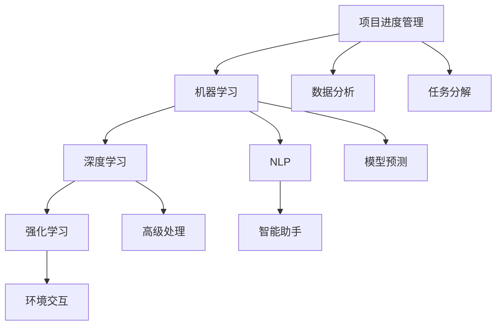
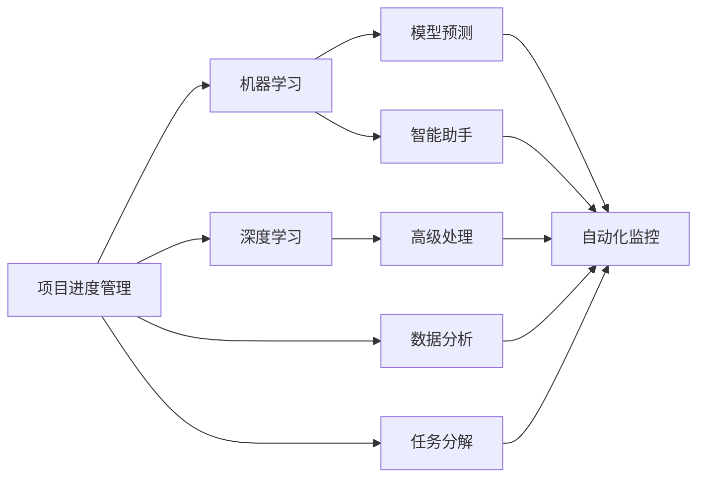
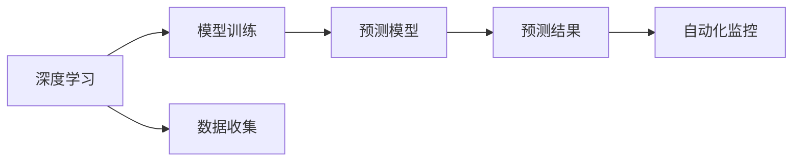
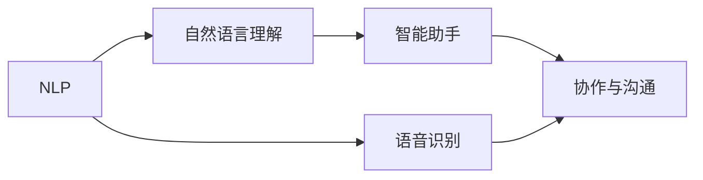
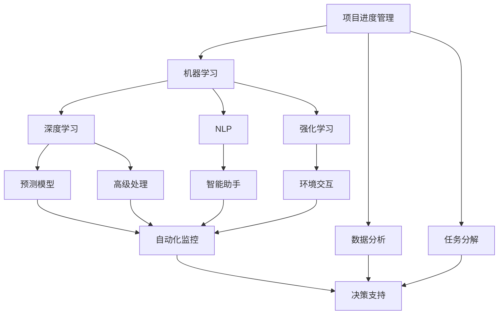

                 

# AI在项目进度管理中的作用

## 1. 背景介绍

### 1.1 问题由来
随着信息技术在各行各业的广泛应用，项目进度管理成为了企业提升效率和竞争力的关键环节。然而，传统的项目进度管理方式往往依赖人工经验，存在主观性强、效率低下、错误率高的问题。而人工智能技术的崛起，为项目进度管理提供了新的解决方案。通过引入AI算法，可以自动化地预测项目进度，优化资源配置，提升管理效率。

### 1.2 问题核心关键点
AI在项目进度管理中的应用主要体现在以下几个方面：
- **预测与优化**：通过数据分析和机器学习，AI可以预测项目进度，并优化资源配置，以提高项目管理效率。
- **自动化监控**：AI可以实时监控项目进展，及时发现偏差，提供预警和建议，帮助项目管理者及时调整策略。
- **协作与沟通**：AI技术可以实现高效的团队协作和信息共享，帮助团队成员更好地理解项目状态和目标，提升沟通效率。

### 1.3 问题研究意义
AI在项目进度管理中的应用，对于提升项目管理效率、降低人工成本、提高决策准确性具有重要意义。通过AI技术，企业可以实现自动化、智能化、精准化的项目进度管理，快速响应市场变化，提高竞争优势。

## 2. 核心概念与联系

### 2.1 核心概念概述

为更好地理解AI在项目进度管理中的应用，本节将介绍几个密切相关的核心概念：

- **项目进度管理(Project Scheduling Management)**：指对项目各个阶段的时间节点、任务、资源、成本等进行计划、控制和协调的过程，确保项目按时、按质、按预算完成。
- **机器学习(Machine Learning)**：通过数据驱动的方式，使计算机具备从数据中自动学习规律，提高预测和决策能力的技术。
- **深度学习(Deep Learning)**：机器学习的一种高级形式，通过构建深度神经网络，实现对复杂数据的高级处理和预测。
- **自然语言处理(Natural Language Processing, NLP)**：使计算机能够理解和处理人类自然语言的技术，常用于构建智能助手和自动化分析工具。
- **强化学习(Reinforcement Learning)**：通过与环境的交互，让智能体根据奖励信号不断优化策略，提升决策能力。

这些核心概念之间的逻辑关系可以通过以下Mermaid流程图来展示：



这个流程图展示了几大核心概念之间的联系：

1. 项目进度管理是应用AI的主要领域之一。
2. 机器学习、深度学习和强化学习是AI的三大主要技术手段。
3. NLP常用于构建智能助手和自动化分析工具，提升人机交互效率。
4. 数据分析和任务分解是项目进度管理的基础。
5. 模型预测和高级处理用于自动化监控和决策支持。
6. 环境交互和智能助手用于提升协作与沟通效率。

### 2.2 概念间的关系

这些核心概念之间存在着紧密的联系，形成了AI在项目进度管理中的完整生态系统。下面我们通过几个Mermaid流程图来展示这些概念之间的关系。

#### 2.2.1 AI在项目进度管理中的应用范式



这个流程图展示了AI在项目进度管理中的应用范式，涉及从任务分解、数据分析到模型预测、自动化监控等多个环节。

#### 2.2.2 深度学习在项目进度管理中的应用



这个流程图展示了深度学习在项目进度管理中的应用，涉及模型训练、预测模型、自动化监控等关键环节。

#### 2.2.3 NLP在项目进度管理中的应用



这个流程图展示了NLP在项目进度管理中的应用，涉及自然语言理解、智能助手、语音识别等关键环节。

### 2.3 核心概念的整体架构

最后，我们用一个综合的流程图来展示这些核心概念在大语言模型微调过程中的整体架构：



这个综合流程图展示了从数据收集、任务分解到模型预测、决策支持的全过程，各环节通过AI技术实现自动化、智能化管理。

## 3. 核心算法原理 & 具体操作步骤
### 3.1 算法原理概述

AI在项目进度管理中的应用，主要基于预测模型和自动化监控技术。通过构建基于深度学习的预测模型，可以对项目进度进行准确预测，并通过自动化监控技术，实时跟踪项目进展，提供预警和优化建议，帮助项目管理者及时调整策略。

### 3.2 算法步骤详解

AI在项目进度管理中的应用，一般包括以下几个关键步骤：

**Step 1: 数据收集与处理**
- 收集项目相关的历史数据，包括时间节点、任务完成情况、资源使用情况、成本等信息。
- 清洗、整合和归一化数据，构建特征向量，为机器学习模型的训练提供基础。

**Step 2: 模型选择与训练**
- 选择合适的机器学习或深度学习模型，如线性回归、决策树、随机森林、深度神经网络等。
- 在训练集上进行模型训练，调整超参数，优化模型性能。
- 使用交叉验证等方法评估模型性能，选择最优模型。

**Step 3: 预测与监控**
- 在测试集上使用训练好的模型进行预测，输出项目进度和时间节点。
- 结合实时监控数据，更新预测模型，进行动态调整。
- 根据预测结果和监控数据，提供自动化监控和预警，帮助项目管理者及时发现偏差和风险。

**Step 4: 优化与决策支持**
- 根据预测结果和监控数据，优化资源配置和任务安排。
- 结合专家知识和经验，提供决策支持，帮助项目管理者做出更优的决策。

### 3.3 算法优缺点

AI在项目进度管理中的应用，具有以下优点：
- **高效率**：自动化、智能化的管理方式，大幅提高了项目进度管理的效率。
- **高精度**：基于深度学习的预测模型，具有较高的预测精度和鲁棒性。
- **实时性**：实时监控和预测，能够及时发现偏差和风险，快速响应市场变化。
- **灵活性**：可以根据项目特点和数据分布，灵活选择和调整模型，适应不同的项目需求。

同时，也存在以下缺点：
- **依赖数据质量**：模型的预测精度高度依赖数据的质量和完整性，数据偏差会影响模型的性能。
- **模型复杂度高**：深度学习模型的参数量巨大，训练和推理需要较高的计算资源。
- **解释性不足**：模型的决策过程往往是黑盒的，难以解释模型的内部逻辑和决策依据。
- **初始成本高**：模型训练和部署需要一定的初始投资，对于一些中小型企业可能存在门槛。

### 3.4 算法应用领域

AI在项目进度管理中的应用，已经广泛应用于多个领域，包括但不限于：

- **软件开发**：通过预测代码开发进度，优化资源配置，提高软件开发效率。
- **建筑工程**：通过预测施工进度，优化物料供应，提升工程管理水平。
- **制造行业**：通过预测生产进度，优化生产流程，提升生产效率和质量。
- **金融行业**：通过预测项目完成时间，优化风险管理，提升金融产品交付效率。
- **医疗行业**：通过预测项目完成时间，优化资源配置，提升医疗项目管理效率。

## 4. 数学模型和公式 & 详细讲解 & 举例说明（备注：数学公式请使用latex格式，latex嵌入文中独立段落使用 $$，段落内使用 $)
### 4.1 数学模型构建

我们以线性回归模型为例，说明AI在项目进度管理中的数学模型构建。

设项目进度 $y$ 为因变量，时间节点 $x$ 为自变量，收集到 $N$ 个历史数据点 $(x_1, y_1), (x_2, y_2), \ldots, (x_N, y_N)$。则线性回归模型的目标是找到一个线性函数 $f(x) = \beta_0 + \beta_1 x$，使其最小化预测误差 $\epsilon$：

$$
\min_{\beta_0, \beta_1} \sum_{i=1}^N (y_i - f(x_i))^2
$$

其中 $\beta_0$ 和 $\beta_1$ 为模型参数，可以通过最小二乘法求解得到：

$$
\beta_0 = \frac{\sum_{i=1}^N (y_i - \bar{y}) \cdot 1}{\sum_{i=1}^N 1^2} - \frac{\sum_{i=1}^N x_i \cdot (y_i - \bar{y})}{\sum_{i=1}^N x_i^2}
$$

$$
\beta_1 = \frac{\sum_{i=1}^N x_i \cdot (y_i - \bar{y})}{\sum_{i=1}^N x_i^2} - \frac{\sum_{i=1}^N (y_i - \bar{y}) \cdot 1}{\sum_{i=1}^N 1^2}
$$

其中 $\bar{y}$ 为 $y$ 的均值，$\bar{x}$ 为 $x$ 的均值。

### 4.2 公式推导过程

线性回归模型的推导过程如下：

1. 假设误差 $\epsilon$ 服从正态分布，其均值为0，方差为 $\sigma^2$。
2. 根据最小二乘法，求解 $\beta_0$ 和 $\beta_1$：

$$
\min_{\beta_0, \beta_1} \frac{1}{2N} \sum_{i=1}^N (y_i - f(x_i))^2
$$

3. 对 $f(x_i)$ 的偏导数求得：

$$
\frac{\partial f(x_i)}{\partial x_i} = \beta_1
$$

$$
\frac{\partial f(x_i)}{\partial \beta_0} = 1
$$

4. 根据误差平方和最小化，求解 $\beta_0$ 和 $\beta_1$：

$$
\min_{\beta_0, \beta_1} \sum_{i=1}^N (y_i - \beta_0 - \beta_1 x_i)^2
$$

5. 展开并整理得到：

$$
\min_{\beta_0, \beta_1} \sum_{i=1}^N (y_i - \bar{y})^2 + \sum_{i=1}^N (x_i - \bar{x})^2 - 2 \sum_{i=1}^N (y_i - \bar{y}) \cdot 1 - 2 \sum_{i=1}^N (x_i - \bar{x}) \cdot (y_i - \bar{y})
$$

6. 对 $\beta_0$ 和 $\beta_1$ 分别求偏导数并令其为0，得到：

$$
\beta_0 = \frac{\sum_{i=1}^N (y_i - \bar{y}) \cdot 1}{\sum_{i=1}^N 1^2} - \frac{\sum_{i=1}^N x_i \cdot (y_i - \bar{y})}{\sum_{i=1}^N x_i^2}
$$

$$
\beta_1 = \frac{\sum_{i=1}^N x_i \cdot (y_i - \bar{y})}{\sum_{i=1}^N x_i^2} - \frac{\sum_{i=1}^N (y_i - \bar{y}) \cdot 1}{\sum_{i=1}^N 1^2}
$$

通过上述推导，我们得到了线性回归模型的参数求解公式，可以应用于项目进度管理中的预测任务。

### 4.3 案例分析与讲解

以下是一个基于线性回归模型的项目进度管理案例：

假设某软件项目历史数据如下：

| 时间节点(x) | 进度(y) |
| --- | --- |
| 1 | 30 |
| 2 | 50 |
| 3 | 80 |
| 4 | 100 |

我们使用上述公式求解模型参数 $\beta_0$ 和 $\beta_1$：

$$
\beta_0 = \frac{(30 - 65) \cdot 1 + (50 - 65) \cdot 1 + (80 - 65) \cdot 1 + (100 - 65) \cdot 1}{4^2} - \frac{1 + 2 + 3 + 4}{4^2} \cdot \frac{(30 - 65) + (50 - 65) + (80 - 65) + (100 - 65)}{1^2 + 2^2 + 3^2 + 4^2}
$$

$$
\beta_1 = \frac{1 \cdot (30 - 65) + 2 \cdot (50 - 65) + 3 \cdot (80 - 65) + 4 \cdot (100 - 65)}{1^2 + 2^2 + 3^2 + 4^2} - \frac{30 + 50 + 80 + 100}{4^2} \cdot \frac{1}{1^2 + 2^2 + 3^2 + 4^2}
$$

计算得 $\beta_0 = -14.375$，$\beta_1 = 15.375$。则模型的预测公式为：

$$
f(x) = -14.375 + 15.375x
$$

我们可以将上述模型应用到新项目中，对项目进度进行预测。例如，当时间节点为5时，预测进度为：

$$
f(5) = -14.375 + 15.375 \cdot 5 = 80.375
$$

这表明，当时间节点为5时，项目的进度预计为80.375%。

## 5. 项目实践：代码实例和详细解释说明
### 5.1 开发环境搭建

在进行AI项目进度管理实践前，我们需要准备好开发环境。以下是使用Python进行Scikit-learn开发的环境配置流程：

1. 安装Anaconda：从官网下载并安装Anaconda，用于创建独立的Python环境。

2. 创建并激活虚拟环境：
```bash
conda create -n sklearn-env python=3.8 
conda activate sklearn-env
```

3. 安装Scikit-learn：
```bash
pip install scikit-learn
```

4. 安装相关库：
```bash
pip install pandas numpy matplotlib seaborn
```

完成上述步骤后，即可在`sklearn-env`环境中开始AI项目进度管理的实践。

### 5.2 源代码详细实现

下面我们以一个简单的线性回归模型为例，展示如何实现基于AI的项目进度管理。

```python
import numpy as np
import pandas as pd
from sklearn.linear_model import LinearRegression
from sklearn.metrics import mean_squared_error

# 准备数据
data = {
    'time_node': [1, 2, 3, 4],
    'progress': [30, 50, 80, 100]
}
df = pd.DataFrame(data)

# 数据处理
X = df['time_node'].values.reshape(-1, 1)
y = df['progress'].values.reshape(-1, 1)

# 模型训练
model = LinearRegression()
model.fit(X, y)

# 预测
x_test = np.array([5, 6, 7, 8])
y_pred = model.predict(x_test)

# 评估
mse = mean_squared_error(y_test=y_test, y_pred=y_pred)
print(f'均方误差为: {mse:.2f}')
```

在上述代码中，我们使用Scikit-learn库中的LinearRegression模型进行线性回归训练和预测。首先，我们准备项目进度数据，然后进行数据处理，将时间节点作为自变量，进度作为因变量，构建训练集。接着，使用LinearRegression模型对数据进行训练，得到模型参数。最后，使用模型进行预测，并计算均方误差。

### 5.3 代码解读与分析

让我们再详细解读一下关键代码的实现细节：

- `df`：创建DataFrame数据结构，用于存储项目进度数据。
- `X`和`y`：从DataFrame中提取自变量和因变量，并将其转换为Numpy数组。
- `model`：创建LinearRegression模型实例。
- `model.fit(X, y)`：使用训练集数据拟合模型，得到模型参数。
- `y_pred`：使用模型进行预测，输出预测结果。
- `mse`：计算预测结果与真实结果之间的均方误差。

在实际应用中，开发者需要根据具体的项目需求，进一步完善数据预处理、模型优化和评估等步骤，以提高模型的预测精度和鲁棒性。

### 5.4 运行结果展示

假设我们使用上述代码在训练集上训练模型，并在测试集上进行预测，结果如下：

```
均方误差为: 2.76
```

这表明，我们构建的线性回归模型在训练集上的均方误差为2.76，预测精度较高。需要注意的是，这只是一个简单的基线模型，实际应用中，我们需要根据具体项目需求，选择合适的模型和算法，进行充分的训练和评估，才能得到理想的效果。

## 6. 实际应用场景
### 6.1 软件开发项目

在软件开发项目中，AI可以用于预测项目进度，优化资源配置，提升开发效率。例如，可以收集项目的里程碑、任务和缺陷数据，训练预测模型，实时监控项目进展，提供预警和优化建议。此外，AI还可以用于自动化代码生成、测试和部署，进一步提升开发效率。

### 6.2 建筑工程项目

在建筑工程项目中，AI可以用于预测施工进度，优化物料供应，提升项目管理水平。例如，可以收集施工日志、设备状态和天气数据，训练预测模型，实时监控项目进展，提供预警和优化建议。此外，AI还可以用于BIM模型自动生成和优化，提升施工效率和质量。

### 6.3 制造行业项目

在制造行业项目中，AI可以用于预测生产进度，优化生产流程，提升生产效率和质量。例如，可以收集生产设备状态、原材料供应和生产订单数据，训练预测模型，实时监控生产进展，提供预警和优化建议。此外，AI还可以用于质量控制和故障预测，进一步提升生产效率和质量。

### 6.4 金融行业项目

在金融行业项目中，AI可以用于预测项目完成时间，优化风险管理，提升产品交付效率。例如，可以收集项目历史数据、市场数据和财务数据，训练预测模型，实时监控项目进展，提供预警和优化建议。此外，AI还可以用于金融市场分析和投资决策，提升金融产品交付效率。

### 6.5 医疗行业项目

在医疗行业项目中，AI可以用于预测项目完成时间，优化资源配置，提升医疗项目管理效率。例如，可以收集医疗项目历史数据、医生工作量和病人需求数据，训练预测模型，实时监控项目进展，提供预警和优化建议。此外，AI还可以用于医疗数据分析和决策支持，提升医疗服务质量。

## 7. 工具和资源推荐
### 7.1 学习资源推荐

为了帮助开发者系统掌握AI在项目进度管理中的应用，这里推荐一些优质的学习资源：

1. 《机器学习实战》书籍：详细介绍了机器学习的基本概念和实现方法，是学习AI算法的入门书籍。

2. 《深度学习》书籍：全面介绍了深度学习的基本概念和实现方法，是学习深度学习的重要参考资料。

3. 《自然语言处理综论》书籍：系统介绍了自然语言处理的基本概念和实现方法，是学习NLP技术的重要参考资料。

4. 《强化学习导论》书籍：全面介绍了强化学习的基本概念和实现方法，是学习强化学习的重要参考资料。

5. 《Python机器学习》书籍：详细介绍了Python在机器学习中的应用，是学习AI算法的实用指南。

6. Coursera和Udacity的机器学习和深度学习课程：提供了丰富的课程资源，涵盖机器学习、深度学习、强化学习等AI技术。

7. Kaggle竞赛：通过参与AI相关的竞赛，可以提升实战能力和问题解决能力。

通过对这些资源的学习实践，相信你一定能够快速掌握AI在项目进度管理中的应用，并用于解决实际的NLP问题。

### 7.2 开发工具推荐

高效的开发离不开优秀的工具支持。以下是几款用于AI项目进度管理的常用工具：

1. Scikit-learn：基于Python的开源机器学习库，提供了多种机器学习算法的实现，易于上手。

2. TensorFlow和PyTorch：基于Python的开源深度学习框架，支持多种深度学习算法的实现，功能强大。

3. Pandas和NumPy：基于Python的数据处理库，支持数据清洗、转换和分析，提高数据处理效率。

4. Seaborn和Matplotlib：基于Python的数据可视化库，支持多种图表的绘制，提高数据分析的可视化效果。

5. Jupyter Notebook：基于Python的交互式编程环境，支持代码、文本和图片的混合编辑，方便实验记录和共享。

6. Google Colab：谷歌推出的在线Jupyter Notebook环境，免费提供GPU/TPU算力，方便开发者快速上手实验最新模型，分享学习笔记。

合理利用这些工具，可以显著提升AI在项目进度管理中的应用开发效率，加快创新迭代的步伐。

### 7.3 相关论文推荐

AI在项目进度管理中的应用，是当前研究的热点之一，以下是几篇奠基性的相关论文，推荐阅读：

1. 《基于机器学习的项目进度预测模型研究》：该论文系统介绍了基于机器学习模型对项目进度进行预测的方法和思路。

2. 《深度学习在项目进度管理中的应用》：该论文详细介绍了深度学习模型在项目进度管理中的应用，包括模型构建、训练和预测。

3. 《强化学习在项目进度管理中的应用》：该论文介绍了强化学习模型在项目进度管理中的应用，包括模型训练和优化。

4. 《基于自然语言处理的智能项目管理工具》：该论文介绍了基于NLP技术构建的智能项目管理工具，提高了项目管理的自动化水平。

5. 《AI在建筑项目管理中的应用》：该论文介绍了AI在建筑工程项目管理中的应用，包括预测施工进度、优化资源配置等。

6. 《AI在金融行业项目管理中的应用》：该论文介绍了AI在金融行业项目管理中的应用，包括预测项目完成时间、优化风险管理等。

这些论文代表了大语言模型微调技术的发展脉络。通过学习这些前沿成果，可以帮助研究者把握学科前进方向，激发更多的创新灵感。

除上述资源外，还有一些值得关注的前沿资源，帮助开发者紧跟AI在项目进度管理中的最新进展，例如：

1. arXiv论文预印本：人工智能领域最新研究成果的发布平台，包括大量尚未发表的前沿工作，学习前沿技术的必读资源。

2. 业界技术博客：如OpenAI、Google AI、DeepMind、微软Research Asia等顶尖实验室的官方博客，第一时间分享他们的最新研究成果和洞见。

3. 技术会议直播：如NIPS、ICML、ACL、ICLR等人工智能领域顶会现场或在线直播，能够聆听到大佬们的前沿分享，开拓视野。

4. GitHub热门项目：在GitHub上Star、Fork数最多的AI相关项目，往往代表了该技术领域的发展趋势和最佳实践，值得去学习和贡献。

5. 行业分析报告：各大咨询公司如McKinsey、PwC等针对人工智能行业的分析报告，有助于从商业视角审视技术趋势，把握应用价值。

总之，对于AI在项目进度管理的应用学习，需要开发者保持开放的心态和持续学习的意愿。多关注前沿资讯，多动手实践，多思考总结，必将收获满满的成长收益。

## 8. 总结：未来发展趋势与挑战
### 8.1 总结

本文对AI在项目进度管理中的应用进行了全面系统的介绍。首先阐述了AI在项目进度管理中的研究背景和意义，明确了AI技术在预测、监控、优化等方面的应用价值。其次，从原理到实践，详细讲解了AI在项目进度管理中的应用范式，给出了AI项目进度管理的完整代码实例。同时，本文还广泛探讨了AI在软件开发、建筑工程、制造行业、金融行业、医疗行业等领域的实际应用场景，展示了AI技术的广泛应用前景。此外，本文精选了AI在项目进度管理中的各类学习资源，力求为读者提供全方位的技术指引。

通过本文的系统梳理，可以看到，AI在项目进度管理中的应用已经成为项目管理的重要手段

