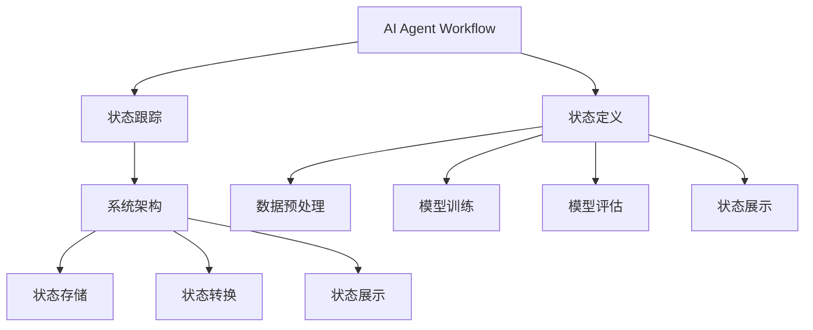

                 

# AI人工智能代理工作流 AI Agent WorkFlow：状态的定义与跟踪

> 关键词：人工智能,代理工作流,状态跟踪,系统架构,自动化

## 1. 背景介绍

### 1.1 问题由来
在当前数字化、智能化的浪潮中，人工智能（AI）技术正逐渐渗透到各行各业，助力企业实现业务升级和数字化转型。然而，尽管AI技术发展迅速，但在实际应用过程中，依然面临诸多挑战。例如，如何有效管理和调度AI模型、数据集以及任务流程，是当前AI应用开发和部署中的核心问题。

为了应对这些挑战，近年来出现了多种基于AI的自动化工作流管理工具，如Apache Airflow、Kubernetes、Docker Swarm等。这些工具通过定义和调度任务流程，实现了对AI模型的自动化管理和调度。但这些工具更多地聚焦于数据和模型的调度，而忽略了在特定应用场景下，如何对AI模型进行状态定义和管理。

### 1.2 问题核心关键点
本文聚焦于AI人工智能代理工作流中的状态定义与跟踪问题。主要探讨以下关键点：

- **状态定义**：如何对AI模型的运行状态进行精确的定义，以便于后续跟踪和管理。
- **状态跟踪**：如何实现对AI模型状态的持续监控和记录，及时发现问题并进行调整。
- **自动化管理**：如何在工作流中自动化定义和管理AI模型的状态，提高工作效率。

### 1.3 问题研究意义
对AI模型状态的定义与跟踪，对于提升AI模型的部署效率、保障模型运行稳定性和可追溯性具有重要意义：

1. **提升部署效率**：通过自动化定义和管理AI模型状态，可以大大简化模型部署流程，提高部署速度和准确性。
2. **保障模型稳定性**：通过实时监控模型状态，可以及时发现和解决运行问题，保障模型运行的稳定性和可靠性。
3. **增强可追溯性**：通过精确记录模型状态变化，可以便于后期分析模型性能和异常，提升模型的可追溯性和可解释性。
4. **支持动态调整**：通过状态跟踪和监控，可以灵活调整模型参数和配置，适应不断变化的应用需求。

## 2. 核心概念与联系

### 2.1 核心概念概述

为了更好地理解AI人工智能代理工作流中的状态定义与跟踪问题，本节将介绍几个关键概念：

- **AI人工智能代理工作流（AI Agent Workflow）**：指在特定应用场景中，通过自动化工具定义和调度AI模型的任务流程，包括数据预处理、模型训练、模型评估等环节。
- **状态定义**：指对AI模型在特定环节的运行状态进行明确的规定和定义，如模型版本、训练进度、参数配置等。
- **状态跟踪**：指对AI模型状态的持续监控和记录，包括状态变化的时间戳、具体值等。
- **系统架构**：指实现状态定义和跟踪的核心技术架构，包括状态存储、状态转换、状态展示等模块。

### 2.2 核心概念的整体架构

这些概念之间的逻辑关系可以通过以下Mermaid流程图来展示：



这个流程图展示了大语言模型微调过程中各个核心概念的关系：

1. AI模型代理工作流：定义和调度AI模型的任务流程，涵盖数据预处理、模型训练、模型评估等环节。
2. 状态定义：对模型在特定环节的运行状态进行精确的规定和定义。
3. 状态跟踪：对模型状态的持续监控和记录，包括状态变化的时间戳、具体值等。
4. 系统架构：实现状态定义和跟踪的核心技术架构，包括状态存储、状态转换、状态展示等模块。

## 3. 核心算法原理 & 具体操作步骤
### 3.1 算法原理概述

AI模型代理工作流中的状态定义与跟踪，本质上是一个状态机（State Machine）问题。其核心思想是通过定义状态转换规则，实现对AI模型状态的精确管理和监控。

假设AI模型在特定任务中的运行过程可以划分为若干个状态，每个状态由一组特定的参数和变量定义。例如，在模型训练过程中，可能包括模型初始化、训练、评估、保存等状态。定义好状态后，通过状态转换规则（如状态转移函数），可以动态地管理模型在不同状态之间的切换，并记录状态变化的时间戳和具体值。

### 3.2 算法步骤详解

基于状态机的AI模型代理工作流，一般包括以下几个关键步骤：

**Step 1: 定义状态模型**

1. **状态定义**：根据实际应用场景，定义AI模型在不同环节的运行状态。例如，在模型训练过程中，可能包括模型初始化、训练、评估、保存等状态。

2. **状态转换规则**：定义状态之间的转换规则，即状态转移函数。例如，模型训练状态可以转换为模型评估状态，评估状态可以转换为保存状态等。

3. **状态监控指标**：定义状态监控的指标，如训练进度、模型性能、内存占用等。

**Step 2: 实现状态机**

1. **状态存储**：选择合适的数据结构（如字典、表等），存储当前模型状态及其转换规则。

2. **状态更新**：根据当前模型状态和转换规则，实时更新模型状态。

3. **状态展示**：通过可视化工具（如Dash、Flask等）展示模型状态及其变化过程。

**Step 3: 状态监控与报警**

1. **异常检测**：根据状态监控指标，设置异常检测阈值，及时发现模型运行异常。

2. **报警机制**：当检测到异常时，自动触发报警机制，通知相关人员进行干预。

### 3.3 算法优缺点

基于状态机的AI模型代理工作流，具有以下优点：

1. **精确管理**：通过定义和跟踪模型状态，可以实现对模型运行过程的精确管理和监控。
2. **自动化部署**：状态定义和跟踪过程可以自动化，提高部署效率。
3. **可追溯性**：记录模型状态变化的时间戳和具体值，增强模型的可追溯性和可解释性。
4. **动态调整**：根据状态监控结果，灵活调整模型参数和配置，适应不断变化的应用需求。

同时，该方法也存在以下局限性：

1. **状态定义复杂**：状态定义需要根据具体应用场景进行设计，复杂度较高。
2. **状态转换规则不易维护**：状态转换规则一旦错误，可能导致模型状态管理混乱。
3. **监控指标单一**：状态监控指标需要根据具体任务进行设计，可能难以全面反映模型状态。

尽管存在这些局限性，但就目前而言，基于状态机的AI模型代理工作流仍是一种有效的管理方式。未来相关研究的重点在于如何进一步简化状态定义，提升状态转换规则的灵活性和可维护性，同时优化状态监控指标，提高模型的全面监控能力。

### 3.4 算法应用领域

基于状态机的AI模型代理工作流，已经在多个领域得到应用，例如：

- **金融风险管理**：在金融领域，通过定义和监控模型状态，实现对金融风险的实时监控和预测。
- **智能客服系统**：在智能客服系统中，通过定义和跟踪模型状态，实现对客户问题的自动分类和匹配。
- **自动驾驶系统**：在自动驾驶系统中，通过定义和监控模型状态，实现对驾驶环境的实时感知和决策。
- **医疗诊断系统**：在医疗诊断系统中，通过定义和跟踪模型状态，实现对患者数据的实时分析和管理。

除了上述这些经典应用外，状态机的AI模型代理工作流还可以应用于更多场景中，如智慧城市、智能制造、智能家居等，为各行各业提供高效、稳定的AI模型管理方案。

## 4. 数学模型和公式 & 详细讲解 & 举例说明

### 4.1 数学模型构建

为了方便描述，我们假设AI模型的运行状态可以用一个状态向量 $S$ 来表示，其中 $S_t$ 表示在时间 $t$ 时的状态。模型的状态转移可以表示为一个状态转移矩阵 $T$，即 $S_{t+1} = T(S_t, D_t)$，其中 $D_t$ 表示在时间 $t$ 时的输入数据。

### 4.2 公式推导过程

假设AI模型在训练过程中存在四个状态 $S_0, S_1, S_2, S_3$，分别表示模型初始化、训练、评估、保存等状态。状态之间的转换规则可以表示为如下形式：

$$
\begin{aligned}
T(S_0, D_t) &= S_1, &\text{如果数据 } D_t \text{ 被用于训练} \\
T(S_1, D_t) &= S_2, &\text{如果数据 } D_t \text{ 用于评估} \\
T(S_2, D_t) &= S_3, &\text{如果数据 } D_t \text{ 用于保存} \\
T(S_3, D_t) &= S_1, &\text{如果数据 } D_t \text{ 用于重新训练}
\end{aligned}
$$

### 4.3 案例分析与讲解

假设我们在一个金融风险管理系统中，需要定义和跟踪AI模型在不同时间点的状态。具体步骤如下：

1. **状态定义**：
   - 模型初始化状态 $S_0$：模型加载、参数初始化等。
   - 模型训练状态 $S_1$：模型在训练数据集上训练，参数更新。
   - 模型评估状态 $S_2$：模型在验证数据集上评估，输出性能指标。
   - 模型保存状态 $S_3$：模型保存为模型文件，便于后续调用。

2. **状态转换规则**：
   - 状态转移函数 $T$ 可以根据模型训练进度和性能指标进行动态更新，例如：
   $$
   T(S_1, D_t) = S_2 \text{ if } \text{准确率 }> 0.95
   $$
   $$
   T(S_2, D_t) = S_3 \text{ if } \text{保存周期到达}
   $$

3. **状态监控指标**：
   - 准确率、损失函数、模型参数等，实时监控模型性能和状态变化。

## 5. 项目实践：代码实例和详细解释说明

### 5.1 开发环境搭建

在进行项目实践前，我们需要准备好开发环境。以下是使用Python进行Django开发的环境配置流程：

1. 安装Anaconda：从官网下载并安装Anaconda，用于创建独立的Python环境。

2. 创建并激活虚拟环境：
```bash
conda create -n myenv python=3.8 
conda activate myenv
```

3. 安装Django：
```bash
pip install django
```

4. 安装所需依赖包：
```bash
pip install pandas numpy scikit-learn matplotlib
```

5. 启动Django项目：
```bash
python manage.py startproject agent_workflow
cd agent_workflow
python manage.py runserver
```

完成上述步骤后，即可在`myenv`环境中开始项目实践。

### 5.2 源代码详细实现

下面我们以金融风险管理系统为例，给出使用Django实现AI模型状态定义和跟踪的代码实现。

首先，定义状态模型类：

```python
from django.db import models

class ModelState(models.Model):
    model_id = models.CharField(max_length=100, primary_key=True)
    state = models.CharField(max_length=50)
    state_time = models.DateTimeField(auto_now_add=True)

    def __str__(self):
        return f"{self.model_id} - {self.state} - {self.state_time}"
```

然后，定义状态转换规则：

```python
class StateMachine:
    def __init__(self):
        self.states = {
            'init': 'train',
            'train': 'eval',
            'eval': 'save',
            'save': 'init'
        }

    def transition(self, state):
        if state in self.states:
            return self.states[state]
        else:
            raise ValueError(f"Invalid state: {state}")

    def get_state_time(self, state):
        if state in self.states:
            return self.model_states.filter(model_id=self.model_id, state=self.states[state]).values_list('state_time', flat=True)[0]
        else:
            raise ValueError(f"Invalid state: {state}")
```

接着，定义模型状态定义和跟踪的视图函数：

```python
from django.shortcuts import render, redirect

def index(request):
    if request.method == 'POST':
        model_id = request.POST.get('model_id')
        state = request.POST.get('state')
        state_time = StateMachine().get_state_time(state)
        if state_time is not None:
            model_state = ModelState.objects.create(model_id=model_id, state=state, state_time=state_time)
            return redirect('index')
        else:
            return render(request, 'index.html', {'message': 'Invalid state transition'})
    else:
        return render(request, 'index.html', {'model_states': ModelState.objects.all()})
```

最后，定义状态展示页面：

```python
from django.shortcuts import render

def index(request):
    return render(request, 'index.html', {'model_states': ModelState.objects.all()})
```

以上代码实现了一个基本的AI模型状态定义和跟踪功能。开发者可以根据实际需求，进一步完善状态定义、状态转换规则等模块，实现更复杂的AI模型管理工作流。

### 5.3 代码解读与分析

让我们再详细解读一下关键代码的实现细节：

**ModelState类**：
- 定义了模型状态的基本信息，包括模型ID、当前状态和状态时间。

**StateMachine类**：
- 定义了状态之间的转换规则，实现了状态转换函数。
- 通过Django的ORM（对象关系映射）查询，获取模型状态的最新时间戳。

**index视图函数**：
- 实现了一个基本的模型状态定义和跟踪功能，当用户提交模型ID和状态时，自动创建模型状态记录，并展示当前模型的所有状态记录。

**index页面**：
- 展示当前模型状态的定义和跟踪页面，用户可以输入模型ID和状态，提交表单后更新模型状态记录。

可以看到，Django的框架提供了强大的ORM支持，使得状态定义和跟踪的代码实现变得简洁高效。开发者可以根据实际需求，进一步扩展模型状态定义和跟踪的功能，实现更复杂的自动化管理工作流。

## 6. 实际应用场景

### 6.1 金融风险管理

在金融领域，AI模型的状态定义与跟踪，对于提升风险管理的效率和精度具有重要意义。通过定义和监控模型状态，可以实现对金融风险的实时监控和预测。

具体而言，可以定义模型在不同时间点的状态，如模型初始化、训练、评估、保存等。在模型训练过程中，实时监控模型的准确率和损失函数，及时发现和解决训练问题。在模型评估过程中，根据评估结果决定是否保存模型，并记录评估时间戳。在模型保存过程中，确保模型文件正确保存，便于后续调用。

### 6.2 智能客服系统

在智能客服系统中，AI模型的状态定义与跟踪，可以实现对客户问题的自动分类和匹配。通过定义模型在不同阶段的状态，实现对客户问题的自动化处理。

具体而言，可以定义模型在客户提出问题、回答问题、客户满意等不同状态。在模型处理客户问题时，实时监控模型的回答准确率和用户满意度，及时发现和解决处理问题。在客户满意度高时，保存模型，以便于后续问题的处理。

### 6.3 自动驾驶系统

在自动驾驶系统中，AI模型的状态定义与跟踪，可以实现对驾驶环境的实时感知和决策。通过定义模型在不同时间点的状态，实现对驾驶环境的自动化感知和决策。

具体而言，可以定义模型在自动驾驶的不同状态，如模型初始化、感知、决策、执行等。在模型感知过程中，实时监控模型的环境感知精度和目标识别准确率，及时发现和解决感知问题。在模型决策过程中，根据感知结果决定是否执行操作，并记录决策时间戳。在模型执行过程中，确保操作正确执行，避免安全事故。

### 6.4 医疗诊断系统

在医疗诊断系统中，AI模型的状态定义与跟踪，可以实现对患者数据的实时分析和管理。通过定义模型在不同阶段的状态，实现对患者数据的自动化分析和诊断。

具体而言，可以定义模型在患者数据输入、模型训练、诊断结果输出等不同状态。在模型训练过程中，实时监控模型的诊断准确率和预测结果，及时发现和解决训练问题。在诊断结果输出过程中，根据结果准确性决定是否保存模型，并记录输出时间戳。在模型保存过程中，确保模型文件正确保存，便于后续调用的诊断。

## 7. 工具和资源推荐

### 7.1 学习资源推荐

为了帮助开发者系统掌握AI模型状态定义与跟踪的理论基础和实践技巧，这里推荐一些优质的学习资源：

1. 《AI编程之美》系列博文：由大模型技术专家撰写，深入浅出地介绍了AI模型状态定义、状态转换、状态监控等前沿话题。

2. Django官方文档：Django的官方文档，提供了丰富的数据结构和ORM使用方法，是进行状态定义和跟踪开发的利器。

3. Kubernetes官方文档：Kubernetes的官方文档，提供了丰富的容器编排和状态管理工具，是进行AI模型部署和管理的必备资料。

4. TensorFlow官方文档：TensorFlow的官方文档，提供了丰富的深度学习框架和状态管理技术，是进行AI模型训练和部署的重要资源。

5. PyTorch官方文档：PyTorch的官方文档，提供了丰富的深度学习框架和状态管理技术，是进行AI模型训练和部署的重要资源。

6. Python编程基础：Python的官方文档，提供了丰富的编程语言基础和状态管理技术，是进行AI模型开发的必备资料。

通过对这些资源的学习实践，相信你一定能够快速掌握AI模型状态定义与跟踪的精髓，并用于解决实际的AI问题。

### 7.2 开发工具推荐

高效的开发离不开优秀的工具支持。以下是几款用于AI模型状态定义与跟踪开发的常用工具：

1. Django：Python的开源Web框架，提供了强大的ORM支持，方便进行状态定义和跟踪功能的开发。

2. Kubernetes：谷歌开源的容器编排工具，提供了丰富的状态管理工具，支持自动化部署和监控。

3. TensorFlow：谷歌开源的深度学习框架，提供了丰富的状态管理技术，支持分布式训练和部署。

4. PyTorch：Facebook开源的深度学习框架，提供了丰富的状态管理技术，支持动态图和静态图模式。

5. TensorBoard：TensorFlow配套的可视化工具，可以实时监测模型训练状态，提供丰富的图表展示方式。

6. Weights & Biases：模型训练的实验跟踪工具，可以记录和可视化模型训练过程中的各项指标，方便对比和调优。

合理利用这些工具，可以显著提升AI模型状态定义与跟踪任务的开发效率，加快创新迭代的步伐。

### 7.3 相关论文推荐

AI模型状态定义与跟踪技术的发展源于学界的持续研究。以下是几篇奠基性的相关论文，推荐阅读：

1. "Model-based reinforcement learning" by Sutton and Barto：介绍了基于模型的强化学习，通过状态定义和跟踪，实现对环境进行建模和决策。

2. "Adaptive Modeling and Tracking" by Neumann：介绍了自适应模型跟踪技术，通过状态定义和转换，实现对动态系统的建模和监控。

3. "Optimal stopping problems for continuous-time Markov processes" by Bellman and Kalaba：介绍了最优停止问题，通过状态定义和转换，实现对连续时间马尔可夫过程的建模和决策。

4. "Automatic Identification and Tracking of Unexpected Human Behaviors Using Deep Reinforcement Learning" by Ren et al.：介绍了使用深度强化学习进行行为识别和跟踪，通过状态定义和转换，实现对人类行为的建模和监控。

这些论文代表了大模型状态定义与跟踪技术的发展脉络。通过学习这些前沿成果，可以帮助研究者把握学科前进方向，激发更多的创新灵感。

除上述资源外，还有一些值得关注的前沿资源，帮助开发者紧跟大模型状态定义与跟踪技术的最新进展，例如：

1. arXiv论文预印本：人工智能领域最新研究成果的发布平台，包括大量尚未发表的前沿工作，学习前沿技术的必读资源。

2. 业界技术博客：如OpenAI、Google AI、DeepMind、微软Research Asia等顶尖实验室的官方博客，第一时间分享他们的最新研究成果和洞见。

3. 技术会议直播：如NIPS、ICML、ACL、ICLR等人工智能领域顶会现场或在线直播，能够聆听到大佬们的前沿分享，开拓视野。

4. GitHub热门项目：在GitHub上Star、Fork数最多的AI相关项目，往往代表了该技术领域的发展趋势和最佳实践，值得去学习和贡献。

5. 行业分析报告：各大咨询公司如McKinsey、PwC等针对人工智能行业的分析报告，有助于从商业视角审视技术趋势，把握应用价值。

总之，对于AI模型状态定义与跟踪技术的学习和实践，需要开发者保持开放的心态和持续学习的意愿。多关注前沿资讯，多动手实践，多思考总结，必将收获满满的成长收益。

## 8. 总结：未来发展趋势与挑战

### 8.1 总结

本文对AI人工智能代理工作流中的状态定义与跟踪问题进行了全面系统的介绍。首先阐述了AI模型代理工作流中的状态定义与跟踪问题，明确了状态定义和跟踪在提升AI模型部署效率、保障模型运行稳定性和可追溯性方面的重要价值。其次，从原理到实践，详细讲解了状态机的核心思想和关键步骤，给出了状态定义和跟踪任务开发的完整代码实例。同时，本文还广泛探讨了状态定义与跟踪方法在金融风险管理、智能客服系统、自动驾驶系统、医疗诊断系统等多个行业领域的应用前景，展示了状态机的巨大潜力。最后，本文精选了状态定义与跟踪技术的各类学习资源，力求为读者提供全方位的技术指引。

通过本文的系统梳理，可以看到，状态机的AI模型代理工作流在提升AI模型部署效率、保障模型运行稳定性和可追溯性方面，具有重要意义。未来，伴随状态机技术的持续演进，基于状态机的AI模型代理工作流必将在更多领域得到应用，为各行各业提供高效、稳定的AI模型管理方案。

### 8.2 未来发展趋势

展望未来，AI模型状态定义与跟踪技术将呈现以下几个发展趋势：

1. **状态定义自动化**：通过引入自动定义和生成工具，进一步简化状态定义的复杂度，提高开发效率。
2. **状态转换规则灵活化**：开发更加灵活和可维护的状态转换规则，适应不断变化的应用需求。
3. **状态监控全面化**：引入更多状态监控指标，如模型参数、网络流量等，提高模型的全面监控能力。
4. **状态展示可视化**：通过可视化工具，实时展示模型状态及其变化过程，方便开发和调试。
5. **状态管理自动化**：进一步实现状态定义和管理的自动化，降低人工干预的复杂度和错误率。

这些趋势凸显了状态机技术的广阔前景。这些方向的探索发展，必将进一步提升AI模型代理工作流的效率和稳定性，为构建高效、可靠、可解释、可控的AI系统铺平道路。

### 8.3 面临的挑战

尽管AI模型状态定义与跟踪技术已经取得了瞩目成就，但在迈向更加智能化、普适化应用的过程中，它仍面临着诸多挑战：

1. **状态定义复杂度高**：状态定义需要根据具体应用场景进行设计，复杂度较高。如何进一步简化状态定义，是一个重要挑战。
2. **状态转换规则不易维护**：状态转换规则一旦错误，可能导致模型状态管理混乱。如何提高状态转换规则的灵活性和可维护性，是一个重要挑战。
3. **状态监控指标单一**：状态监控指标需要根据具体任务进行设计，可能难以全面反映模型状态。如何优化状态监控指标，提高模型的全面监控能力，是一个重要挑战。
4. **状态展示复杂度大**：状态展示需要实时更新和可视化，复杂度较大。如何提高状态展示的实时性和交互性，是一个重要挑战。
5. **状态管理自动化程度低**：状态管理过程需要人工干预，复杂度较大。如何实现状态管理的自动化，降低人工干预的复杂度和错误率，是一个重要挑战。

正视状态机面临的这些挑战，积极应对并寻求突破，将是大模型状态定义与跟踪技术走向成熟的必由之路。相信随着学界和产业界的共同努力，这些挑战终将一一被克服，状态机必将在构建安全、可靠、可解释、可控的智能系统中扮演越来越重要的角色。

### 8.4 研究展望

面对状态机面临的诸多挑战，未来的研究需要在以下几个方面寻求新的突破：

1. **探索更多状态定义和跟踪技术**：引入更多先进的状态定义和跟踪技术，如基于符号表示的建模方法、基于强化学习的跟踪方法等，提高状态定义和跟踪的自动化程度和灵活性。
2. **优化状态转换规则**：开发更加灵活和可维护的状态转换规则，实现对复杂系统的动态管理。
3. **引入多模态信息融合**：将符号化的先验知识，如知识图谱、逻辑规则等，与神经网络模型进行巧妙融合，增强状态定义和跟踪的能力。
4. **加强系统稳定性和鲁棒性**：引入更多系统稳定性和鲁棒性技术，如因果推断、对抗性训练等，提高系统在各种场景下的稳定性和鲁棒性。
5. **纳入伦理道德约束**：在模型训练目标中引入伦理导向的评估指标，过滤和惩罚有偏见、有害的输出倾向，确保系统的伦理道德性。

这些研究方向的探索，必将引领状态机技术迈向更高的台阶，为构建安全、可靠、可解释、可控的智能系统提供新的思路和工具。面向未来，状态机技术还需要与其他人工智能技术进行更

