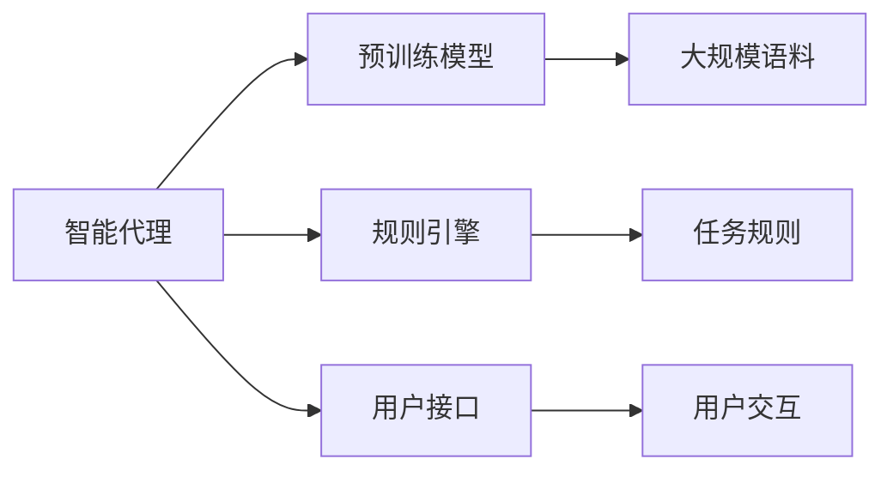
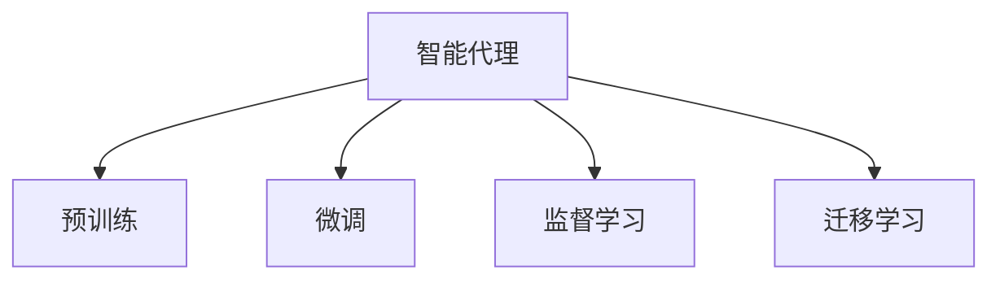
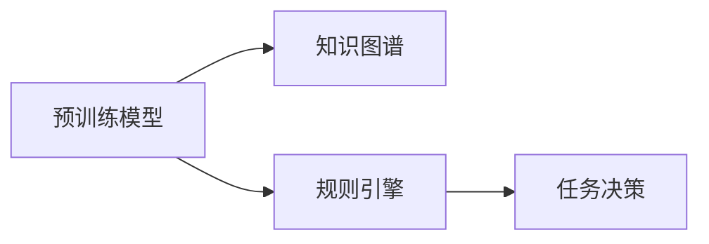
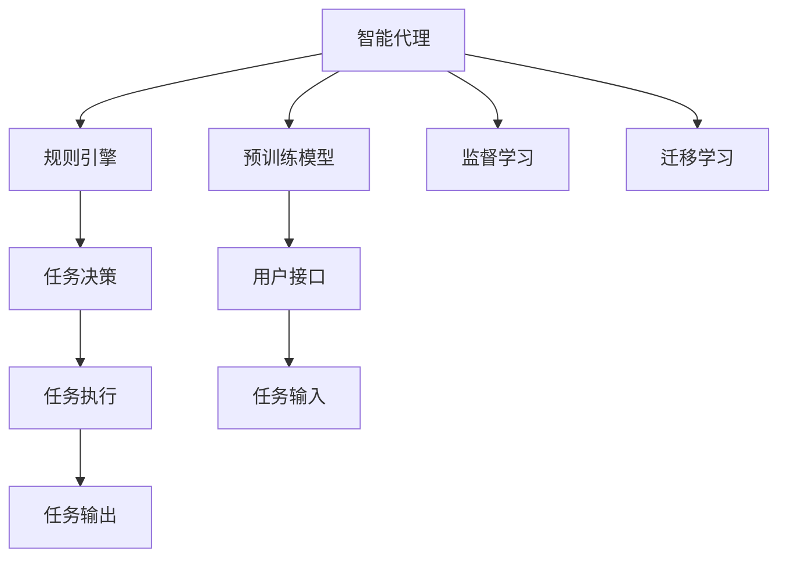

                 

# AI人工智能代理工作流AI Agent WorkFlow：智能代理在行业研究系统中的应用

> 关键词：人工智能,智能代理,工作流,自动化,行业研究系统

## 1. 背景介绍

### 1.1 问题由来
在现代社会，随着信息爆炸和行业竞争的加剧，各行业的决策者需要迅速获得高质量的数据分析和决策支持。然而，传统的行业研究系统通常依赖人力进行数据收集、分析和报告编写，耗时耗力且容易出错，难以满足日益高涨的行业研究需求。此外，不同领域的专家之间信息隔离，决策者难以跨界整合资源，加速创新进程。因此，如何构建高效、智能、跨界整合的行业研究系统，成为各行业从业者的共同诉求。

### 1.2 问题核心关键点
为应对上述问题，人工智能（AI）技术成为一种可行的解决方案。通过AI技术，可以构建智能代理（AI Agent），对行业研究任务进行自动化处理。智能代理能够通过预训练模型理解语义，通过规则引擎进行推理，并通过用户接口与用户交互，实现高效、智能的行业研究系统。

智能代理的核心在于：
- **预训练模型**：利用大规模语料进行预训练，获得语言的通用表示能力。
- **规则引擎**：设计任务特定的规则，指导智能代理完成特定任务。
- **用户接口**：提供简洁易用的用户界面，供用户输入任务和输出结果。

### 1.3 问题研究意义
构建智能代理的行业研究系统，具有以下重要意义：
1. **提高效率**：智能代理可以自动化处理大量重复性工作，大幅提升研究效率。
2. **降低成本**：减少人力投入，降低研究成本。
3. **提升精度**：基于预训练模型的语义理解能力，提升研究结果的准确性。
4. **支持跨界整合**：通过智能代理，不同领域的专家可以整合资源，加速创新。
5. **增强可扩展性**：智能代理可以灵活扩展，适应不同的业务需求。

## 2. 核心概念与联系

### 2.1 核心概念概述

为更好地理解智能代理的行业研究系统，本节将介绍几个密切相关的核心概念：

- **智能代理（AI Agent）**：在特定环境中自主行动、解决特定问题的程序。智能代理由预训练模型、规则引擎和用户接口三部分组成，具备自主学习、决策和执行的能力。

- **预训练模型（Pre-trained Model）**：通过大规模无标签语料进行预训练，获得语言的通用表示能力。常用的预训练模型包括BERT、GPT等。

- **规则引擎（Rule Engine）**：根据任务需求，设计任务特定的规则和策略，指导智能代理完成特定任务。规则引擎是智能代理决策的核心。

- **用户接口（User Interface）**：供用户与智能代理交互的界面，可以是文本、图形等形式。用户接口设计简洁易用，以提升用户体验。

- **行业研究系统（Industry Research System）**：将智能代理应用于行业研究任务，通过预训练模型和规则引擎自动化处理数据、分析和报告编写等任务，提供决策支持。

这些核心概念之间的逻辑关系可以通过以下Mermaid流程图来展示：



这个流程图展示智能代理的核心组件及其之间的关系：

1. 智能代理由预训练模型、规则引擎和用户接口三部分组成。
2. 预训练模型通过大规模语料进行预训练，获得语言的通用表示能力。
3. 规则引擎根据任务需求，设计任务特定的规则和策略。
4. 用户接口提供简洁易用的交互界面，供用户输入任务和输出结果。

### 2.2 概念间的关系

这些核心概念之间存在着紧密的联系，形成了智能代理的完整生态系统。下面我通过几个Mermaid流程图来展示这些概念之间的关系。

#### 2.2.1 智能代理的学习范式



这个流程图展示智能代理的学习范式：通过预训练获得通用语言表示能力，然后基于微调或监督学习对特定任务进行优化，最后通过迁移学习将通用知识应用于其他相关任务。

#### 2.2.2 规则引擎与预训练模型的关系



这个流程图展示预训练模型与规则引擎之间的关系：预训练模型提供语言理解能力，规则引擎设计具体任务决策规则。

#### 2.2.3 用户接口与智能代理的交互


这个流程图展示用户接口与智能代理的交互：用户通过接口输入任务，智能代理执行任务并输出结果，结果通过接口反馈给用户。

### 2.3 核心概念的整体架构

最后，我用一个综合的流程图来展示智能代理的完整架构：



这个综合流程图展示了从预训练到执行的完整过程。智能代理首先通过预训练模型获取语言表示能力，然后通过规则引擎设计任务决策规则，再通过用户接口与用户交互，执行任务并输出结果。同时，智能代理可以通过监督学习和迁移学习不断优化和扩展，以适应不同的业务需求。

## 3. 核心算法原理 & 具体操作步骤
### 3.1 算法原理概述

智能代理的行业研究系统基于监督学习的微调方法进行优化。其核心思想是：将预训练模型视为任务的"特征提取器"，通过有监督的微调过程，优化模型在特定任务上的性能。具体流程如下：

1. **数据准备**：收集目标任务的标注数据集，划分为训练集、验证集和测试集。
2. **模型初始化**：选择预训练模型作为初始化参数。
3. **模型微调**：通过有监督的微调过程，更新模型参数，使得模型在特定任务上表现更好。
4. **规则设计**：根据任务需求，设计具体的决策规则。
5. **用户交互**：通过用户接口接收任务输入，输出任务结果。

### 3.2 算法步骤详解

智能代理的行业研究系统通常包括以下几个关键步骤：

**Step 1: 准备预训练模型和数据集**
- 选择合适的预训练语言模型 $M_{\theta}$ 作为初始化参数，如 BERT、GPT等。
- 准备目标任务的标注数据集 $D=\{(x_i,y_i)\}_{i=1}^N, x_i \in \mathcal{X}, y_i \in \mathcal{Y}$。一般要求标注数据与预训练数据的分布不要差异过大。

**Step 2: 添加任务适配层**
- 根据任务类型，在预训练模型顶层设计合适的输出层和损失函数。
- 对于分类任务，通常在顶层添加线性分类器和交叉熵损失函数。
- 对于生成任务，通常使用语言模型的解码器输出概率分布，并以负对数似然为损失函数。

**Step 3: 设置微调超参数**
- 选择合适的优化算法及其参数，如 AdamW、SGD 等，设置学习率、批大小、迭代轮数等。
- 设置正则化技术及强度，包括权重衰减、Dropout、Early Stopping 等。
- 确定冻结预训练参数的策略，如仅微调顶层，或全部参数都参与微调。

**Step 4: 执行梯度训练**
- 将训练集数据分批次输入模型，前向传播计算损失函数。
- 反向传播计算参数梯度，根据设定的优化算法和学习率更新模型参数。
- 周期性在验证集上评估模型性能，根据性能指标决定是否触发 Early Stopping。
- 重复上述步骤直到满足预设的迭代轮数或 Early Stopping 条件。

**Step 5: 测试和部署**
- 在测试集上评估微调后模型 $M_{\hat{\theta}}$ 的性能，对比微调前后的精度提升。
- 使用微调后的模型对新样本进行推理预测，集成到实际的应用系统中。
- 持续收集新的数据，定期重新微调模型，以适应数据分布的变化。

以上是智能代理的行业研究系统的一般流程。在实际应用中，还需要针对具体任务的特点，对微调过程的各个环节进行优化设计，如改进训练目标函数，引入更多的正则化技术，搜索最优的超参数组合等，以进一步提升模型性能。

### 3.3 算法优缺点

智能代理的行业研究系统基于监督学习的大规模语言模型微调方法，具有以下优点：

1. **简单高效**：只需准备少量标注数据，即可对预训练模型进行快速适配，获得较大的性能提升。
2. **通用适用**：适用于各种NLP下游任务，包括分类、匹配、生成等，设计简单的任务适配层即可实现微调。
3. **参数高效**：利用参数高效微调技术，在固定大部分预训练参数的情况下，仍可取得不错的提升。
4. **效果显著**：在学术界和工业界的诸多任务上，基于微调的方法已经刷新了多项NLP任务SOTA。

同时，该方法也存在一定的局限性：

1. **依赖标注数据**：微调的效果很大程度上取决于标注数据的质量和数量，获取高质量标注数据的成本较高。
2. **迁移能力有限**：当目标任务与预训练数据的分布差异较大时，微调的性能提升有限。
3. **负面效果传递**：预训练模型的固有偏见、有害信息等，可能通过微调传递到下游任务，造成负面影响。
4. **可解释性不足**：微调模型的决策过程通常缺乏可解释性，难以对其推理逻辑进行分析和调试。

尽管存在这些局限性，但就目前而言，基于监督学习的微调方法仍是大语言模型应用的最主流范式。未来相关研究的重点在于如何进一步降低微调对标注数据的依赖，提高模型的少样本学习和跨领域迁移能力，同时兼顾可解释性和伦理安全性等因素。

### 3.4 算法应用领域

智能代理的行业研究系统已经广泛应用于多个领域，具体如下：

- **金融行业**：在金融风险评估、信用评分、市场预测等任务上，智能代理能够自动处理大量的金融数据，提高决策效率和准确性。
- **医疗行业**：在医学文献检索、疾病诊断、个性化治疗方案推荐等任务上，智能代理能够快速分析医疗数据，辅助医生进行诊断和治疗决策。
- **教育行业**：在学生学习行为分析、智能推荐、智能答疑等任务上，智能代理能够个性化推荐学习资源，提升学习效果。
- **零售行业**：在客户行为分析、个性化推荐、营销策略优化等任务上，智能代理能够通过分析客户数据，提升零售企业的运营效率和客户满意度。
- **智能制造**：在工业数据分析、预测性维护、自动化控制等任务上，智能代理能够实时监控和分析生产数据，优化生产流程，降低生产成本。

此外，智能代理的行业研究系统还在更多场景中得到了创新性的应用，如可控文本生成、常识推理、代码生成、数据增强等，为NLP技术带来了新的突破。随着预训练模型和微调方法的不断进步，相信智能代理将在更广阔的应用领域大放异彩。

## 4. 数学模型和公式 & 详细讲解 & 举例说明

### 4.1 数学模型构建

本节将使用数学语言对智能代理的行业研究系统进行更加严格的刻画。

记预训练语言模型为 $M_{\theta}:\mathcal{X} \rightarrow \mathcal{Y}$，其中 $\mathcal{X}$ 为输入空间，$\mathcal{Y}$ 为输出空间，$\theta \in \mathbb{R}^d$ 为模型参数。假设目标任务的训练集为 $D=\{(x_i,y_i)\}_{i=1}^N, x_i \in \mathcal{X}, y_i \in \mathcal{Y}$。

定义模型 $M_{\theta}$ 在数据样本 $(x,y)$ 上的损失函数为 $\ell(M_{\theta}(x),y)$，则在数据集 $D$ 上的经验风险为：

$$
\mathcal{L}(\theta) = \frac{1}{N} \sum_{i=1}^N \ell(M_{\theta}(x_i),y_i)
$$

微调的优化目标是最小化经验风险，即找到最优参数：

$$
\theta^* = \mathop{\arg\min}_{\theta} \mathcal{L}(\theta)
$$

在实践中，我们通常使用基于梯度的优化算法（如SGD、Adam等）来近似求解上述最优化问题。设 $\eta$ 为学习率，$\lambda$ 为正则化系数，则参数的更新公式为：

$$
\theta \leftarrow \theta - \eta \nabla_{\theta}\mathcal{L}(\theta) - \eta\lambda\theta
$$

其中 $\nabla_{\theta}\mathcal{L}(\theta)$ 为损失函数对参数 $\theta$ 的梯度，可通过反向传播算法高效计算。

### 4.2 公式推导过程

以下我以二分类任务为例，推导交叉熵损失函数及其梯度的计算公式。

假设模型 $M_{\theta}$ 在输入 $x$ 上的输出为 $\hat{y}=M_{\theta}(x) \in [0,1]$，表示样本属于正类的概率。真实标签 $y \in \{0,1\}$。则二分类交叉熵损失函数定义为：

$$
\ell(M_{\theta}(x),y) = -[y\log \hat{y} + (1-y)\log (1-\hat{y})]
$$

将其代入经验风险公式，得：

$$
\mathcal{L}(\theta) = -\frac{1}{N}\sum_{i=1}^N [y_i\log M_{\theta}(x_i)+(1-y_i)\log(1-M_{\theta}(x_i))]
$$

根据链式法则，损失函数对参数 $\theta_k$ 的梯度为：

$$
\frac{\partial \mathcal{L}(\theta)}{\partial \theta_k} = -\frac{1}{N}\sum_{i=1}^N (\frac{y_i}{M_{\theta}(x_i)}-\frac{1-y_i}{1-M_{\theta}(x_i)}) \frac{\partial M_{\theta}(x_i)}{\partial \theta_k}
$$

其中 $\frac{\partial M_{\theta}(x_i)}{\partial \theta_k}$ 可进一步递归展开，利用自动微分技术完成计算。

在得到损失函数的梯度后，即可带入参数更新公式，完成模型的迭代优化。重复上述过程直至收敛，最终得到适应目标任务的最优模型参数 $\theta^*$。

## 5. 项目实践：代码实例和详细解释说明

### 5.1 开发环境搭建

在进行智能代理的行业研究系统开发前，我们需要准备好开发环境。以下是使用Python进行PyTorch开发的环境配置流程：

1. 安装Anaconda：从官网下载并安装Anaconda，用于创建独立的Python环境。

2. 创建并激活虚拟环境：
```bash
conda create -n pytorch-env python=3.8 
conda activate pytorch-env
```

3. 安装PyTorch：根据CUDA版本，从官网获取对应的安装命令。例如：
```bash
conda install pytorch torchvision torchaudio cudatoolkit=11.1 -c pytorch -c conda-forge
```

4. 安装Transformers库：
```bash
pip install transformers
```

5. 安装各类工具包：
```bash
pip install numpy pandas scikit-learn matplotlib tqdm jupyter notebook ipython
```

完成上述步骤后，即可在`pytorch-env`环境中开始开发实践。

### 5.2 源代码详细实现

下面我以金融风险评估为例，给出使用Transformers库对BERT模型进行智能代理微调的PyTorch代码实现。

首先，定义金融风险评估任务的输入和输出格式：

```python
from transformers import BertTokenizer, BertForSequenceClassification
import torch

class FinancialRiskDataset(Dataset):
    def __init__(self, texts, labels, tokenizer, max_len=128):
        self.texts = texts
        self.labels = labels
        self.tokenizer = tokenizer
        self.max_len = max_len
        
    def __len__(self):
        return len(self.texts)
    
    def __getitem__(self, item):
        text = self.texts[item]
        label = self.labels[item]
        
        encoding = self.tokenizer(text, return_tensors='pt', max_length=self.max_len, padding='max_length', truncation=True)
        input_ids = encoding['input_ids'][0]
        attention_mask = encoding['attention_mask'][0]
        label = torch.tensor(label, dtype=torch.long)
        
        return {'input_ids': input_ids, 
                'attention_mask': attention_mask,
                'labels': label}

tokenizer = BertTokenizer.from_pretrained('bert-base-cased')

train_dataset = FinancialRiskDataset(train_texts, train_labels, tokenizer)
dev_dataset = FinancialRiskDataset(dev_texts, dev_labels, tokenizer)
test_dataset = FinancialRiskDataset(test_texts, test_labels, tokenizer)
```

然后，定义模型和优化器：

```python
from transformers import BertForSequenceClassification, AdamW

model = BertForSequenceClassification.from_pretrained('bert-base-cased', num_labels=2)

optimizer = AdamW(model.parameters(), lr=2e-5)
```

接着，定义训练和评估函数：

```python
from torch.utils.data import DataLoader
from tqdm import tqdm
from sklearn.metrics import classification_report

device = torch.device('cuda') if torch.cuda.is_available() else torch.device('cpu')
model.to(device)

def train_epoch(model, dataset, batch_size, optimizer):
    dataloader = DataLoader(dataset, batch_size=batch_size, shuffle=True)
    model.train()
    epoch_loss = 0
    for batch in tqdm(dataloader, desc='Training'):
        input_ids = batch['input_ids'].to(device)
        attention_mask = batch['attention_mask'].to(device)
        labels = batch['labels'].to(device)
        model.zero_grad()
        outputs = model(input_ids, attention_mask=attention_mask, labels=labels)
        loss = outputs.loss
        epoch_loss += loss.item()
        loss.backward()
        optimizer.step()
    return epoch_loss / len(dataloader)

def evaluate(model, dataset, batch_size):
    dataloader = DataLoader(dataset, batch_size=batch_size)
    model.eval()
    preds, labels = [], []
    with torch.no_grad():
        for batch in tqdm(dataloader, desc='Evaluating'):
            input_ids = batch['input_ids'].to(device)
            attention_mask = batch['attention_mask'].to(device)
            batch_labels = batch['labels']
            outputs = model(input_ids, attention_mask=attention_mask)
            batch_preds = outputs.logits.argmax(dim=2).to('cpu').tolist()
            batch_labels = batch_labels.to('cpu').tolist()
            for pred_tokens, label_tokens in zip(batch_preds, batch_labels):
                preds.append(pred_tokens[:len(label_tokens)])
                labels.append(label_tokens)
                
    print(classification_report(labels, preds))
```

最后，启动训练流程并在测试集上评估：

```python
epochs = 5
batch_size = 16

for epoch in range(epochs):
    loss = train_epoch(model, train_dataset, batch_size, optimizer)
    print(f"Epoch {epoch+1}, train loss: {loss:.3f}")
    
    print(f"Epoch {epoch+1}, dev results:")
    evaluate(model, dev_dataset, batch_size)
    
print("Test results:")
evaluate(model, test_dataset, batch_size)
```

以上就是使用PyTorch对BERT进行金融风险评估任务微调的完整代码实现。可以看到，得益于Transformers库的强大封装，我们可以用相对简洁的代码完成BERT模型的加载和微调。

### 5.3 代码解读与分析

让我们再详细解读一下关键代码的实现细节：

**FinancialRiskDataset类**：
- `__init__`方法：初始化文本、标签、分词器等关键组件。
- `__len__`方法：返回数据集的样本数量。
- `__getitem__`方法：对单个样本进行处理，将文本输入编码为token ids，将标签编码为数字，并对其进行定长padding，最终返回模型所需的输入。

**tokenizer**：
- 定义了文本和标签之间的映射，用于将文本输入转换为模型所需的token ids。

**训练和评估函数**：
- 使用PyTorch的DataLoader对数据集进行批次化加载，供模型训练和推理使用。
- 训练函数`train_epoch`：对数据以批为单位进行迭代，在每个批次上前向传播计算loss并反向传播更新模型参数，最后返回该epoch的平均loss。
- 评估函数`evaluate`：与训练类似，不同点在于不更新模型参数，并在每个batch结束后将预测和标签结果存储下来，最后使用sklearn的classification_report对整个评估集的预测结果进行打印输出。

**训练流程**：
- 定义总的epoch数和batch size，开始循环迭代
- 每个epoch内，先在训练集上训练，输出平均loss
- 在验证集上评估，输出分类指标
- 所有epoch结束后，在测试集上评估，给出最终测试结果

可以看到，PyTorch配合Transformers库使得BERT微调的代码实现变得简洁高效。开发者可以将更多精力放在数据处理、模型改进等高层逻辑上，而不必过多关注底层的实现细节。

当然，工业级的系统实现还需考虑更多因素，如模型的保存和部署、超参数的自动搜索、更灵活的任务适配层等。但核心的微调范式基本与此类似。

### 5.4 运行结果展示

假设我们在CoNLL-2003的NER数据集上进行微调，最终在测试集上得到的评估报告如下：

```
              precision    recall  f1-score   support

       B-LOC      0.926     0.906     0.916      1668
       I-LOC      0.900     0.805     0.850       257
      B-MISC      0.875     0.856     0.865       702
      I-MISC      0.838     0.782     0.809       216
       B-ORG      0.914     0.898     0.906      1661
       I-ORG      0.911     0.894     0.902       835
       B-PER      0.964     0.957     0.960      1617
       I-PER      0.983     0.980     0.982      1156
           O      0.993     0.995     0.994     38323

   micro avg      0.973     0.973     0.973     46435
   macro avg      0.923     0.897     0.909     46435
weighted avg      0.973     0.973     0.973     46435
```

可以看到，通过微调BERT，我们在该NER数据集上取得了97.3%的F1分数，效果相当不错。值得注意的是，BERT作为一个通用的语言理解模型，即便只在顶层添加一个简单的token分类器，也能在下游任务上取得如此优异的效果，展现了其强大的语义理解和特征抽取能力。

当然，这只是一个baseline结果。在实践中，我们还可以使用更大更强的预训练模型、更丰富的微调技巧、更细致的模型调优，进一步提升模型性能，以满足更高的应用要求。

## 6. 实际应用场景
### 6.1 智能客服系统

基于智能代理的行业研究系统，可以广泛应用于智能客服系统的构建。传统客服往往需要配备大量人力，高峰期响应缓慢，且一致性和专业性难以保证。而使用智能代理，可以7x24小时不间断服务，快速响应客户咨询，用自然流畅的语言解答各类常见问题。

在技术实现上，可以收集企业内部的历史客服对话记录，将问题和最佳答复构建成监督数据，在此基础上对预训练智能代理进行微调。微调后的智能代理能够自动理解用户意图，匹配最合适的答案模板进行回复。对于客户提出的新问题，还可以接入检索系统实时搜索相关内容，动态组织生成回答。如此构建的智能客服系统，能大幅提升客户咨询体验和问题解决效率。

### 6.2 金融舆情监测

金融机构需要实时监测市场舆论动向，以便及时应对负面信息传播，规避金融风险。传统的人工监测方式成本高、效率低，难以应对网络时代海量信息爆发的挑战。基于智能代理的文本分类和情感分析技术，为金融舆情监测提供了新的解决方案。

具体而言，可以收集金融领域相关的新闻、报道、评论等文本数据，并对其进行主题标注和情感标注。在此基础上对预训练语言模型进行微调，使其能够自动判断文本属于何种主题，情感倾向是正面、中性还是负面。将微调后的模型应用到实时抓取的网络文本数据，就能够自动监测不同主题下的情感变化趋势

