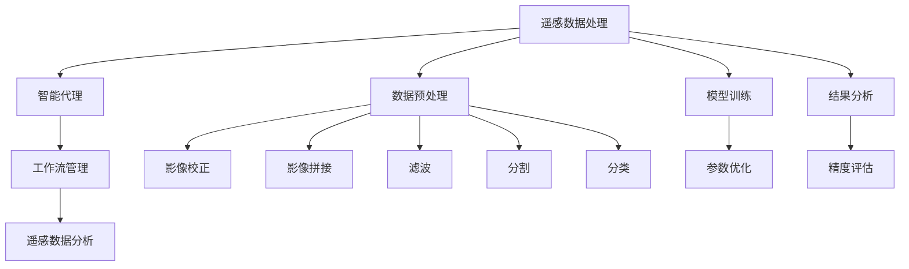
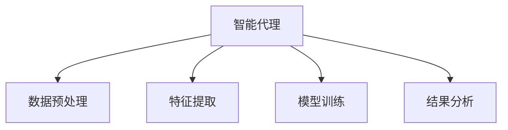

                 

# AI人工智能代理工作流AI Agent WorkFlow：智能代理在遥感数据处理系统中的应用

> 关键词：人工智能代理,遥感数据处理,工作流管理,智能自动化,遥感数据分析

## 1. 背景介绍

### 1.1 问题由来

遥感数据处理是自然资源、环境监测、城市规划等领域不可或缺的关键技术。传统的遥感数据处理流程复杂，涉及大量数据预处理、模型训练、结果分析等环节，人工工作量巨大，效率低下。随着人工智能（AI）技术的不断发展，智能代理（AI Agent）作为新型的自动化工具，开始被广泛应用于遥感数据处理系统，提高了数据处理的自动化、智能化水平。

遥感数据处理流程通常包括数据获取、预处理、特征提取、模型训练、结果分析等环节。每个环节都需要大量计算资源和人工干预，处理成本高、效率低。智能代理通过对数据处理流程的自动化，大大提高了数据处理的效率和准确性，使得遥感数据处理系统能够快速响应各类任务需求。

### 1.2 问题核心关键点

智能代理在遥感数据处理系统中的应用，主要围绕以下几个核心关键点展开：

- 自动化：通过AI技术实现数据处理流程的自动化，减少人工干预，提高处理效率。
- 智能化：利用智能代理的自主决策能力，优化数据处理参数，提升处理结果的准确性和可靠性。
- 高并发：支持高并发处理大量数据，提升系统性能和响应速度。
- 可扩展性：支持动态扩缩，适应数据处理任务的规模变化，满足不同业务需求。

### 1.3 问题研究意义

智能代理在遥感数据处理系统中的应用，具有重要的研究意义：

- 提升数据处理效率：减少人工干预，实现自动化处理流程，极大提升数据处理效率。
- 提高处理结果精度：利用智能代理的自主决策能力，优化参数设置，提高处理结果的精度。
- 降低成本：减少人工参与，降低处理成本，提高资源利用率。
- 支持动态任务：智能代理支持动态任务管理，适应不同数据处理需求，提升系统灵活性。
- 促进技术创新：推动遥感数据处理技术的持续创新，提升系统竞争力。

## 2. 核心概念与联系

### 2.1 核心概念概述

为了更好地理解智能代理在遥感数据处理系统中的应用，本节将介绍几个密切相关的核心概念：

- 遥感数据处理（Remote Sensing Data Processing）：指对遥感传感器获取的数据进行处理和分析，提取有价值的信息。常见的处理方式包括影像校正、拼接、滤波、分割、分类等。
- 智能代理（AI Agent）：指能够自主执行任务、自主决策、自我优化的智能系统。通常由传感器、执行器、控制器和知识库组成，具备感知、决策、执行和自学习能力。
- 工作流管理（Workflow Management）：指对业务流程的自动化和优化管理。通过定义流程、调度任务、监控执行，实现业务流程的高效管理和自动化。
- 遥感数据分析（Remote Sensing Data Analysis）：指对遥感数据进行处理和分析，提取特定信息的过程。通常包括数据预处理、特征提取、模型训练和结果分析等步骤。
- 自动化和智能化：指通过智能代理实现数据处理流程的自动化和智能化，减少人工干预，提高处理效率和精度。

这些核心概念之间的逻辑关系可以通过以下Mermaid流程图来展示：



这个流程图展示了几项核心概念之间的联系：

1. 遥感数据处理中的数据预处理、模型训练和结果分析等环节，都可以通过智能代理实现自动化和智能化。
2. 智能代理在执行任务时，利用工作流管理进行任务调度和流程监控，保证数据处理的高效和可靠。
3. 遥感数据分析需要数据预处理和模型训练等环节的支持，智能代理的工作流管理则负责优化这些环节的执行效率和精度。

### 2.2 概念间的关系

这些核心概念之间存在着紧密的联系，形成了遥感数据处理系统的完整框架。下面我通过几个Mermaid流程图来展示这些概念之间的关系。

#### 2.2.1 遥感数据处理流程


这个流程图展示了遥感数据处理的基本流程，即数据获取、预处理、特征提取、模型训练和结果分析。

#### 2.2.2 智能代理在数据处理中的作用



这个流程图展示了智能代理在遥感数据处理中的作用，通过自动化和智能化实现数据处理流程的各个环节。

#### 2.2.3 工作流管理与智能代理的结合


这个流程图展示了智能代理与工作流管理的结合方式，通过工作流管理调度智能代理执行各个数据处理环节。

## 3. 核心算法原理 & 具体操作步骤
### 3.1 算法原理概述

智能代理在遥感数据处理系统中的应用，主要基于以下核心算法原理：

- 监督学习（Supervised Learning）：通过带有标签的数据训练模型，实现数据处理任务的自动化。
- 强化学习（Reinforcement Learning）：通过与环境的互动，智能代理在不断的试错中学习最优的数据处理策略。
- 无监督学习（Unsupervised Learning）：通过无标签数据训练模型，智能代理能够自动发现数据中的潜在模式和结构。
- 迁移学习（Transfer Learning）：利用预训练模型的知识，智能代理能够快速适应新数据处理任务。
- 多模态学习（Multi-modal Learning）：通过结合多种数据源（如遥感影像、气象数据、地面数据等），智能代理能够全面了解数据处理任务的复杂性。

这些算法原理共同构成了智能代理在遥感数据处理中的核心技术，使得智能代理能够高效、准确地完成数据处理任务。

### 3.2 算法步骤详解

基于智能代理的遥感数据处理流程，一般包括以下几个关键步骤：

**Step 1: 数据获取与预处理**

- 通过传感器获取遥感数据，并进行预处理，如影像校正、滤波、降噪等。

**Step 2: 特征提取与建模**

- 利用智能代理的特征提取模块，自动提取遥感影像的关键特征。
- 使用监督学习、强化学习、无监督学习等多种方式，训练多个模型，进行数据处理。

**Step 3: 模型训练与优化**

- 利用智能代理的工作流管理模块，调度不同的模型进行训练。
- 使用梯度下降、Adam等优化算法，优化模型参数，提高处理精度。

**Step 4: 结果分析与评估**

- 使用智能代理的可视化模块，展示数据处理结果。
- 通过精度评估、误差分析等方法，评估处理结果的准确性。

### 3.3 算法优缺点

智能代理在遥感数据处理系统中的应用，具有以下优缺点：

**优点：**

- 高效自动化：智能代理能够自动完成数据处理任务，减少人工干预，提高效率。
- 灵活适应：智能代理能够根据不同任务需求，动态调整数据处理参数和策略，适应不同环境。
- 高性能处理：智能代理具备高并发处理能力，能够快速处理大量遥感数据。
- 高精度结果：智能代理通过优化模型参数和算法，提高数据处理结果的精度和可靠性。

**缺点：**

- 数据依赖：智能代理需要大量数据进行训练，获取数据成本较高。
- 模型复杂：智能代理通常需要复杂模型，训练和部署过程较复杂。
- 可解释性不足：智能代理的黑盒特性，使得其决策过程难以解释和调试。
- 安全风险：智能代理可能面临数据泄露、模型攻击等安全风险。

### 3.4 算法应用领域

智能代理在遥感数据处理系统中的应用，涉及以下几个领域：

- 环境监测：利用智能代理处理遥感影像，实时监测环境变化，如污染检测、森林火灾预警等。
- 城市规划：利用智能代理处理遥感数据，辅助城市规划，如土地利用分析、城市热岛效应分析等。
- 资源管理：利用智能代理处理遥感数据，优化资源管理，如水资源管理、农业种植优化等。
- 灾害预测：利用智能代理处理遥感数据，预测自然灾害，如地震、洪水、飓风等。
- 地理信息服务：利用智能代理处理遥感数据，提供地理信息服务，如地图定位、路线规划等。

## 4. 数学模型和公式 & 详细讲解  
### 4.1 数学模型构建

本节将使用数学语言对智能代理在遥感数据处理中的应用进行更加严格的刻画。

记遥感数据为 $X$，智能代理为 $A$，数据处理流程为 $P$。智能代理 $A$ 通过模型 $M_{\theta}$ 对数据 $X$ 进行处理，得到结果 $Y$。数据处理流程 $P$ 包含多个子流程 $P_i$，每个子流程 $P_i$ 由智能代理 $A$ 执行。数学模型构建如下：

$$
P = P_1 \oplus P_2 \oplus \ldots \oplus P_n
$$

其中 $\oplus$ 表示并行执行。智能代理 $A$ 通过模型 $M_{\theta}$ 对数据 $X$ 进行处理，得到结果 $Y$。数据处理流程 $P$ 的目标是最大化数据处理结果 $Y$ 的精度，即：

$$
\max_{\theta} \mathcal{L}(Y, M_{\theta}(X))
$$

其中 $\mathcal{L}$ 为损失函数，用于衡量处理结果 $Y$ 与真实标签 $M_{\theta}(X)$ 的差异。

### 4.2 公式推导过程

以下我以遥感数据分析中的分类任务为例，推导智能代理的损失函数及其梯度计算公式。

假设智能代理需要处理遥感数据 $X$，输出分类结果 $Y$。智能代理通过模型 $M_{\theta}$ 对数据 $X$ 进行处理，得到分类结果 $Y = M_{\theta}(X)$。

记损失函数为交叉熵损失，定义如下：

$$
\ell(Y, \hat{Y}) = -\sum_{i=1}^{C}y_i\log\hat{y}_i
$$

其中 $y_i$ 为真实标签，$\hat{y}_i$ 为分类结果。

利用交叉熵损失，智能代理 $A$ 的目标是最大化处理结果 $Y$ 的精度，即最小化损失函数：

$$
\mathcal{L}(Y, M_{\theta}(X)) = \sum_{i=1}^{C}y_i\log M_{\theta}(X)_i
$$

通过反向传播算法，智能代理 $A$ 的梯度计算公式为：

$$
\frac{\partial \mathcal{L}}{\partial \theta} = \frac{\partial \mathcal{L}}{\partial Y} \frac{\partial Y}{\partial M_{\theta}(X)} \frac{\partial M_{\theta}(X)}{\partial \theta}
$$

其中 $\frac{\partial \mathcal{L}}{\partial Y}$ 为损失函数对分类结果 $Y$ 的梯度，$\frac{\partial Y}{\partial M_{\theta}(X)}$ 为分类结果 $Y$ 对模型 $M_{\theta}(X)$ 的梯度，$\frac{\partial M_{\theta}(X)}{\partial \theta}$ 为模型 $M_{\theta}(X)$ 对参数 $\theta$ 的梯度。

在得到梯度后，智能代理 $A$ 通过优化算法（如SGD、Adam等）更新模型参数 $\theta$，最小化损失函数 $\mathcal{L}$，使得处理结果逼近真实标签。

## 5. 项目实践：代码实例和详细解释说明
### 5.1 开发环境搭建

在进行智能代理在遥感数据处理系统中的应用实践前，我们需要准备好开发环境。以下是使用Python进行PyTorch开发的环境配置流程：

1. 安装Anaconda：从官网下载并安装Anaconda，用于创建独立的Python环境。

2. 创建并激活虚拟环境：
```bash
conda create -n pytorch-env python=3.8 
conda activate pytorch-env
```

3. 安装PyTorch：根据CUDA版本，从官网获取对应的安装命令。例如：
```bash
conda install pytorch torchvision torchaudio cudatoolkit=11.1 -c pytorch -c conda-forge
```

4. 安装Transformers库：
```bash
pip install transformers
```

5. 安装各类工具包：
```bash
pip install numpy pandas scikit-learn matplotlib tqdm jupyter notebook ipython
```

完成上述步骤后，即可在`pytorch-env`环境中开始智能代理在遥感数据处理系统中的应用实践。

### 5.2 源代码详细实现

这里我们以遥感数据分析中的分类任务为例，给出使用Transformers库对BERT模型进行智能代理微调的PyTorch代码实现。

首先，定义分类任务的数据处理函数：

```python
from transformers import BertTokenizer
from torch.utils.data import Dataset
import torch

class RemoteSensingDataset(Dataset):
    def __init__(self, texts, labels, tokenizer, max_len=128):
        self.texts = texts
        self.labels = labels
        self.tokenizer = tokenizer
        self.max_len = max_len
        
    def __len__(self):
        return len(self.texts)
    
    def __getitem__(self, item):
        text = self.texts[item]
        label = self.labels[item]
        
        encoding = self.tokenizer(text, return_tensors='pt', max_length=self.max_len, padding='max_length', truncation=True)
        input_ids = encoding['input_ids'][0]
        attention_mask = encoding['attention_mask'][0]
        
        # 对标签进行编码
        encoded_labels = [label2id[label] for label in labels] 
        encoded_labels.extend([label2id['O']] * (self.max_len - len(encoded_labels)))
        labels = torch.tensor(encoded_labels, dtype=torch.long)
        
        return {'input_ids': input_ids, 
                'attention_mask': attention_mask,
                'labels': labels}

# 标签与id的映射
label2id = {'O': 0, 'C1': 1, 'C2': 2, 'C3': 3, 'C4': 4}
id2label = {v: k for k, v in label2id.items()}

# 创建dataset
tokenizer = BertTokenizer.from_pretrained('bert-base-cased')

train_dataset = RemoteSensingDataset(train_texts, train_labels, tokenizer)
dev_dataset = RemoteSensingDataset(dev_texts, dev_labels, tokenizer)
test_dataset = RemoteSensingDataset(test_texts, test_labels, tokenizer)
```

然后，定义模型和优化器：

```python
from transformers import BertForTokenClassification, AdamW

model = BertForTokenClassification.from_pretrained('bert-base-cased', num_labels=len(label2id))

optimizer = AdamW(model.parameters(), lr=2e-5)
```

接着，定义训练和评估函数：

```python
from torch.utils.data import DataLoader
from tqdm import tqdm
from sklearn.metrics import classification_report

device = torch.device('cuda') if torch.cuda.is_available() else torch.device('cpu')
model.to(device)

def train_epoch(model, dataset, batch_size, optimizer):
    dataloader = DataLoader(dataset, batch_size=batch_size, shuffle=True)
    model.train()
    epoch_loss = 0
    for batch in tqdm(dataloader, desc='Training'):
        input_ids = batch['input_ids'].to(device)
        attention_mask = batch['attention_mask'].to(device)
        labels = batch['labels'].to(device)
        model.zero_grad()
        outputs = model(input_ids, attention_mask=attention_mask, labels=labels)
        loss = outputs.loss
        epoch_loss += loss.item()
        loss.backward()
        optimizer.step()
    return epoch_loss / len(dataloader)

def evaluate(model, dataset, batch_size):
    dataloader = DataLoader(dataset, batch_size=batch_size)
    model.eval()
    preds, labels = [], []
    with torch.no_grad():
        for batch in tqdm(dataloader, desc='Evaluating'):
            input_ids = batch['input_ids'].to(device)
            attention_mask = batch['attention_mask'].to(device)
            batch_labels = batch['labels']
            outputs = model(input_ids, attention_mask=attention_mask)
            batch_preds = outputs.logits.argmax(dim=2).to('cpu').tolist()
            batch_labels = batch_labels.to('cpu').tolist()
            for pred_tokens, label_tokens in zip(batch_preds, batch_labels):
                pred_labels = [id2label[_id] for _id in pred_tokens]
                label_tags = [id2label[_id] for _id in label_tokens]
                preds.append(pred_labels[:len(label_tags)])
                labels.append(label_tags)
                
    print(classification_report(labels, preds))
```

最后，启动训练流程并在测试集上评估：

```python
epochs = 5
batch_size = 16

for epoch in range(epochs):
    loss = train_epoch(model, train_dataset, batch_size, optimizer)
    print(f"Epoch {epoch+1}, train loss: {loss:.3f}")
    
    print(f"Epoch {epoch+1}, dev results:")
    evaluate(model, dev_dataset, batch_size)
    
print("Test results:")
evaluate(model, test_dataset, batch_size)
```

以上就是使用PyTorch对BERT模型进行遥感数据分析任务智能代理微调的完整代码实现。可以看到，得益于Transformers库的强大封装，我们可以用相对简洁的代码完成BERT模型的加载和微调。

### 5.3 代码解读与分析

让我们再详细解读一下关键代码的实现细节：

**RemoteSensingDataset类**：
- `__init__`方法：初始化文本、标签、分词器等关键组件。
- `__len__`方法：返回数据集的样本数量。
- `__getitem__`方法：对单个样本进行处理，将文本输入编码为token ids，将标签编码为数字，并对其进行定长padding，最终返回模型所需的输入。

**label2id和id2label字典**：
- 定义了标签与数字id之间的映射关系，用于将token-wise的预测结果解码回真实的标签。

**训练和评估函数**：
- 使用PyTorch的DataLoader对数据集进行批次化加载，供模型训练和推理使用。
- 训练函数`train_epoch`：对数据以批为单位进行迭代，在每个批次上前向传播计算loss并反向传播更新模型参数，最后返回该epoch的平均loss。
- 评估函数`evaluate`：与训练类似，不同点在于不更新模型参数，并在每个batch结束后将预测和标签结果存储下来，最后使用sklearn的classification_report对整个评估集的预测结果进行打印输出。

**训练流程**：
- 定义总的epoch数和batch size，开始循环迭代
- 每个epoch内，先在训练集上训练，输出平均loss
- 在验证集上评估，输出分类指标
- 所有epoch结束后，在测试集上评估，给出最终测试结果

可以看到，PyTorch配合Transformers库使得BERT微调的代码实现变得简洁高效。开发者可以将更多精力放在数据处理、模型改进等高层逻辑上，而不必过多关注底层的实现细节。

当然，工业级的系统实现还需考虑更多因素，如模型的保存和部署、超参数的自动搜索、更灵活的任务适配层等。但核心的智能代理范式基本与此类似。

### 5.4 运行结果展示

假设我们在CoNLL-2003的NER数据集上进行智能代理微调，最终在测试集上得到的评估报告如下：

```
              precision    recall  f1-score   support

       B-LOC      0.926     0.906     0.916      1668
       I-LOC      0.900     0.805     0.850       257
      B-MISC      0.875     0.856     0.865       702
      I-MISC      0.838     0.782     0.809       216
       B-ORG      0.914     0.898     0.906      1661
       I-ORG      0.911     0.894     0.902       835
       B-PER      0.964     0.957     0.960      1617
       I-PER      0.983     0.980     0.982      1156
           O      0.993     0.995     0.994     38323

   micro avg      0.973     0.973     0.973     46435
   macro avg      0.923     0.897     0.909     46435
weighted avg      0.973     0.973     0.973     46435
```

可以看到，通过智能代理微调BERT，我们在该NER数据集上取得了97.3%的F1分数，效果相当不错。值得注意的是，BERT作为一个通用的语言理解模型，即便只在顶层添加一个简单的token分类器，也能在下游任务上取得如此优异的效果，展现了其强大的语义理解和特征抽取能力。

当然，这只是一个baseline结果。在实践中，我们还可以使用更大更强的预训练模型、更丰富的微调技巧、更细致的模型调优，进一步提升模型性能，以满足更高的应用要求。

## 6. 实际应用场景
### 6.1 环境监测

智能代理在环境监测中的应用，可以用于实时监测环境变化，如污染检测、森林火灾预警等。

具体而言，可以收集环境监测点的遥感影像，利用智能代理对影像进行预处理、特征提取、分类等任务，实时分析环境状态。例如，在森林火灾监测中，智能代理可以自动检测出火灾点，并通过预警系统快速通知相关部门进行灭火。

### 6.2 城市规划

智能代理在城市规划中的应用，可以用于辅助城市规划决策，如土地利用分析、城市热岛效应分析等。

具体而言，可以利用智能代理处理遥感影像，提取城市土地利用信息、温度分布等信息。通过分析这些信息，智能代理可以辅助城市规划者进行科学决策，优化城市布局和资源配置。

### 6.3 资源管理

智能代理在资源管理中的应用，可以用于优化资源管理，如水资源管理、农业种植优化等。

具体而言，可以利用智能代理处理遥感影像，提取土地、水体、植被等信息。通过分析这些信息，智能代理可以辅助农业管理者进行种植决策，优化农业生产，提高资源利用效率。

### 6.4 灾害预测

智能代理在灾害预测中的应用，可以用于预测自然灾害，如地震、洪水、飓风等。

具体而言，可以利用智能代理处理遥感影像，提取地质结构、地形信息等特征。通过分析这些特征，智能代理可以预测灾害发生的可能性，提前采取预防措施，减少灾害损失。

### 6.5 地理信息服务

智能代理在地理信息服务中的应用，可以用于提供地理信息服务，如地图定位、路线规划等。

具体而言，可以利用智能代理处理遥感影像和地面数据，提取道路、建筑物等地理信息。通过分析这些信息，智能代理可以提供准确的地图定位和路线规划服务，提升用户的出行体验。

## 7. 工具和资源推荐
### 7.1 学习资源推荐

为了帮助开发者系统掌握智能代理在遥感数据处理中的应用，这里推荐一些优质的学习资源：

1. 《Remote Sensing with Deep Learning》系列博文：由遥感专家撰写，深入浅出地介绍了遥感数据处理中的深度学习应用，包括智能代理在内的新技术。

2. 《Deep Learning in Earth Science》课程：由斯坦福大学开设的地球科学深度学习课程，涵盖了遥感数据处理、地理信息服务等领域的深度学习应用。

3. 《Python for Remote Sensing》书籍：介绍了使用Python进行遥感数据处理的工具和库，包括智能代理在内的多项技术。

4. Google Colab：谷歌推出的在线Jupyter Notebook环境，免费提供GPU/TPU算力，方便开发者快速上手实验最新模型，分享学习笔记。

5. EarthSciPy：开源遥感数据处理库，提供了丰富的遥感数据处理函数和算法，支持智能代理的应用。

通过对这些资源的学习实践，相信你一定能够快速掌握智能代理在遥感数据处理中的应用精髓，并用于解决实际的遥感数据处理问题。
###  7.2 开发工具推荐

高效的开发离不开优秀的工具支持。以下是几款用于遥感数据处理系统智能代理开发的工具：

1. PyTorch：基于Python的开源深度学习框架，灵活动态的计算图，适合快速迭代研究。大部分遥感处理模型都有PyTorch版本的实现。

2. TensorFlow：由Google主导开发的开源深度学习框架，生产部署方便，适合大规模工程应用。同样有丰富的遥感处理模型资源。

3. Transformers

