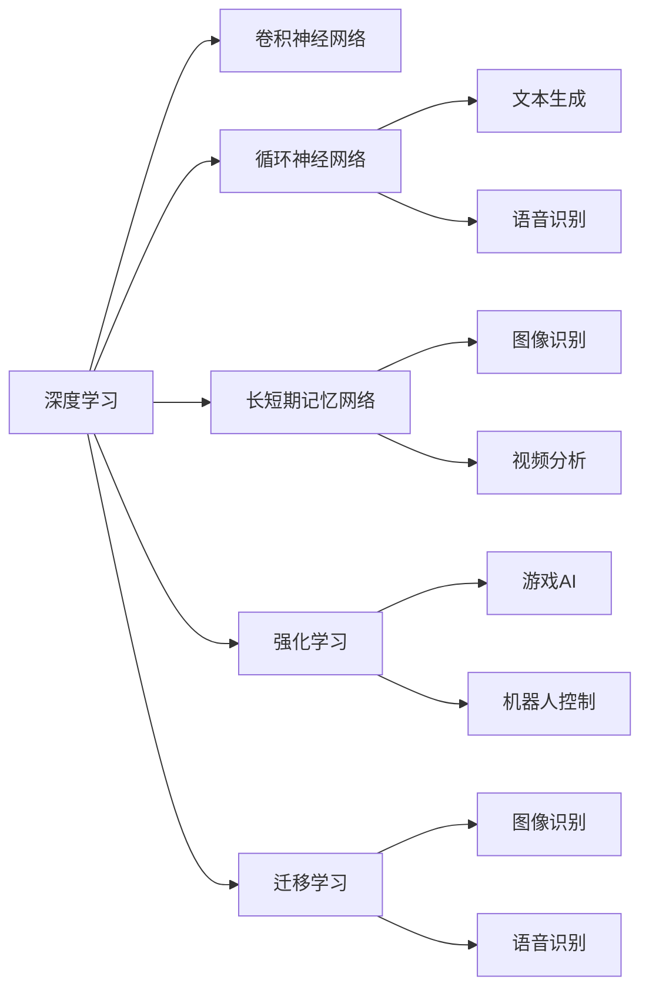

                 

# AI人工智能核心算法原理与代码实例讲解：人工智能应用发展趋势

> 关键词：人工智能核心算法, 算法原理, 代码实例, 应用场景, 发展趋势

## 1. 背景介绍

人工智能(AI)技术近年来迅猛发展，已经渗透到各个行业，改变了我们的生活和工作方式。随着技术的不断进步，AI的应用场景和核心算法也在不断拓展和优化。本文将深入探讨AI核心算法的原理与应用，同时展望AI技术的发展趋势，以期为AI技术的开发者和应用者提供有价值的参考。

### 1.1 问题由来
人工智能技术的迅猛发展，离不开其核心算法的支持。从早期的机器学习算法到如今深度学习、强化学习等前沿技术，核心算法的进步是推动AI技术发展的关键。然而，随着应用场景的日益复杂，单一算法已难以满足需求，需要综合运用多种算法和技术。同时，AI算法面临着数据稀缺、计算资源受限、鲁棒性不足等问题，亟需创新和优化。本文将详细介绍AI核心算法的原理，并通过代码实例演示其实际应用，同时展望AI技术未来的发展方向。

### 1.2 问题核心关键点
AI核心算法的研究方向包括但不限于以下几个方面：
- 深度学习算法：如卷积神经网络(CNN)、循环神经网络(RNN)、长短期记忆网络(LSTM)等，主要用于图像识别、语音识别、自然语言处理等领域。
- 强化学习算法：如Q-learning、深度Q网络(DQN)等，常用于游戏AI、机器人控制等任务。
- 迁移学习算法：通过已有模型的知识迁移，提升新模型的性能，广泛应用于图像识别、语音识别等领域。
- 优化算法：如梯度下降法、Adam优化器等，用于调整模型参数，提高训练效率。

这些算法的有效结合与创新，不仅提升了AI技术的性能，还促进了AI应用的广泛普及。同时，这些算法的发展也面临着数据量不足、计算资源限制、模型鲁棒性不足等问题。本文将结合实际案例，详细讲解这些核心算法的原理与应用，并探讨未来的发展趋势。

### 1.3 问题研究意义
深入理解AI核心算法的原理与应用，对于AI技术的开发者和应用者具有重要意义：
- 提高算法效率与性能。通过了解算法的原理，可以优化算法实现，提升模型性能。
- 拓展应用场景。算法的多样性与灵活性，使得AI技术能够适应更多应用场景。
- 促进跨学科融合。AI核心算法涉及数学、计算机科学、神经科学等多个学科，通过算法研究，促进了不同学科的融合与创新。
- 推动产业发展。AI技术的不断优化与应用，推动了相关产业的数字化转型和智能化升级。

## 2. 核心概念与联系

### 2.1 核心概念概述
为了更好地理解AI核心算法，我们首先需要了解一些核心概念：
- 深度学习(DL)：基于神经网络模型，通过多层次特征学习，提升模型性能。
- 卷积神经网络(CNN)：用于图像识别、视频分析等任务，通过卷积操作提取空间特征。
- 循环神经网络(RNN)：用于序列数据处理，如文本生成、语音识别等，通过记忆机制捕捉时间依赖关系。
- 长短期记忆网络(LSTM)：一种特殊的RNN，能够更好地处理长序列数据。
- 强化学习(RL)：通过试错学习，使得智能体在特定环境中最大化奖励。
- 迁移学习(TL)：通过已有模型的知识迁移，提升新模型的性能。
- 优化算法：如梯度下降法、Adam优化器等，用于调整模型参数，提高训练效率。

这些核心概念构成了AI技术的基石，通过深入理解这些概念的原理与联系，我们可以更好地掌握AI核心算法。

### 2.2 概念间的关系

以下通过几个Mermaid流程图来展示这些核心概念的关系：



这个流程图展示了深度学习、卷积神经网络、循环神经网络、长短期记忆网络、强化学习、迁移学习等核心概念之间的关系。深度学习是这些概念的基础，卷积神经网络、循环神经网络、长短期记忆网络等算法是深度学习的子集，而强化学习、迁移学习则通过不同方式提升深度学习算法的性能。

## 3. 核心算法原理 & 具体操作步骤
### 3.1 算法原理概述

AI核心算法主要包括深度学习算法、强化学习算法和迁移学习算法，它们共同构成了AI技术的核心。下面将分别介绍这些算法的原理。

### 3.2 算法步骤详解

#### 3.2.1 深度学习算法

深度学习算法主要基于神经网络模型，通过多层次特征学习，提升模型性能。其基本步骤如下：
1. 数据准备：收集和预处理数据，确保数据质量和多样性。
2. 模型构建：选择合适的神经网络结构，如CNN、RNN、LSTM等，并进行初始化。
3. 训练模型：通过反向传播算法，计算损失函数，并更新模型参数。
4. 测试评估：在测试集上评估模型性能，根据评估结果进行优化。

#### 3.2.2 卷积神经网络(CNN)

卷积神经网络主要用于图像识别和视频分析等任务。其主要步骤如下：
1. 数据准备：收集和预处理图像数据，确保数据质量和多样性。
2. 卷积层构建：设计并构建卷积层，提取空间特征。
3. 池化层构建：设计并构建池化层，减少特征维度。
4. 全连接层构建：设计并构建全连接层，进行分类或回归。
5. 训练模型：通过反向传播算法，计算损失函数，并更新模型参数。
6. 测试评估：在测试集上评估模型性能，根据评估结果进行优化。

#### 3.2.3 循环神经网络(RNN)

循环神经网络主要用于序列数据处理，如文本生成、语音识别等任务。其主要步骤如下：
1. 数据准备：收集和预处理序列数据，确保数据质量和多样性。
2. 循环层构建：设计并构建循环层，捕捉时间依赖关系。
3. 全连接层构建：设计并构建全连接层，进行分类或回归。
4. 训练模型：通过反向传播算法，计算损失函数，并更新模型参数。
5. 测试评估：在测试集上评估模型性能，根据评估结果进行优化。

#### 3.2.4 长短期记忆网络(LSTM)

长短期记忆网络是一种特殊的RNN，能够更好地处理长序列数据。其主要步骤如下：
1. 数据准备：收集和预处理序列数据，确保数据质量和多样性。
2. 循环层构建：设计并构建LSTM层，捕捉时间依赖关系。
3. 全连接层构建：设计并构建全连接层，进行分类或回归。
4. 训练模型：通过反向传播算法，计算损失函数，并更新模型参数。
5. 测试评估：在测试集上评估模型性能，根据评估结果进行优化。

#### 3.2.5 强化学习(RL)

强化学习通过试错学习，使得智能体在特定环境中最大化奖励。其主要步骤如下：
1. 环境构建：定义环境和奖励函数，确保环境能够提供有效反馈。
2. 策略选择：选择合适的策略，如Q-learning、深度Q网络等，进行智能体决策。
3. 执行决策：在环境中执行智能体决策，并获取奖励。
4. 策略优化：通过奖励反馈，优化策略，提高智能体性能。

#### 3.2.6 迁移学习(TL)

迁移学习通过已有模型的知识迁移，提升新模型的性能。其主要步骤如下：
1. 数据准备：收集和预处理源任务数据和新任务数据。
2. 源模型构建：选择合适的源模型，如预训练模型等。
3. 新模型构建：构建新模型，并通过源模型迁移知识。
4. 训练模型：在新模型上进行微调，并根据任务需求进行优化。
5. 测试评估：在测试集上评估模型性能，根据评估结果进行优化。

### 3.3 算法优缺点

#### 深度学习算法的优缺点

- 优点：能够自动学习特征，适用于大规模数据和高维数据。
- 缺点：需要大量计算资源，容易过拟合，对数据质量要求高。

#### 卷积神经网络的优缺点

- 优点：局部连接、权值共享，计算效率高。
- 缺点：对数据尺寸要求严格，无法处理任意形状的输入。

#### 循环神经网络的优缺点

- 优点：能够处理序列数据，捕捉时间依赖关系。
- 缺点：容易发生梯度消失或爆炸，难以处理长序列数据。

#### 长短期记忆网络的优缺点

- 优点：能够处理长序列数据，避免梯度消失问题。
- 缺点：计算复杂度高，难以处理大规模数据。

#### 强化学习的优缺点

- 优点：通过试错学习，能够处理动态和复杂环境。
- 缺点：需要大量计算资源，难以处理高维状态空间。

#### 迁移学习的优缺点

- 优点：能够利用已有知识，提升模型性能。
- 缺点：需要大量标注数据，难以处理分布差异大的任务。

### 3.4 算法应用领域

#### 深度学习算法

深度学习算法广泛应用于计算机视觉、自然语言处理、语音识别等领域。
- 计算机视觉：图像分类、目标检测、图像生成等任务。
- 自然语言处理：语言模型、机器翻译、文本生成等任务。
- 语音识别：语音识别、语音合成等任务。

#### 卷积神经网络(CNN)

卷积神经网络广泛应用于图像识别、视频分析等领域。
- 图像识别：物体检测、人脸识别、图像分类等任务。
- 视频分析：动作识别、视频分类等任务。

#### 循环神经网络(RNN)

循环神经网络广泛应用于文本生成、语音识别等领域。
- 文本生成：机器翻译、文本摘要、对话系统等任务。
- 语音识别：语音识别、语音合成等任务。

#### 长短期记忆网络(LSTM)

长短期记忆网络广泛应用于文本生成、语音识别等领域。
- 文本生成：机器翻译、文本摘要、对话系统等任务。
- 语音识别：语音识别、语音合成等任务。

#### 强化学习(RL)

强化学习广泛应用于游戏AI、机器人控制等领域。
- 游戏AI：策略游戏、即时战略游戏等任务。
- 机器人控制：机器人导航、机器人抓取等任务。

#### 迁移学习(TL)

迁移学习广泛应用于图像识别、语音识别等领域。
- 图像识别：物体检测、图像分类等任务。
- 语音识别：语音识别、语音合成等任务。

## 4. 数学模型和公式 & 详细讲解 & 举例说明

### 4.1 数学模型构建

AI核心算法涉及大量的数学模型和公式。以下是几个典型的数学模型及其公式推导。

#### 4.1.1 卷积神经网络(CNN)

卷积神经网络主要由卷积层、池化层和全连接层构成。其基本数学模型如下：

$$
y = W^{(1)}x + b^{(1)}
$$

$$
x = g(y)
$$

$$
y = W^{(2)}x + b^{(2)}
$$

其中，$x$为输入数据，$y$为输出数据，$W^{(1)}$和$W^{(2)}$为卷积核，$b^{(1)}$和$b^{(2)}$为偏置项，$g$为激活函数。

#### 4.1.2 循环神经网络(RNN)

循环神经网络主要由循环层和全连接层构成。其基本数学模型如下：

$$
h_{t} = \tanh(W_{xh}x_{t} + W_{hh}h_{t-1} + b_h)
$$

$$
y_t = W_{hy}h_t + b_y
$$

其中，$x_t$为输入数据，$h_t$为隐藏状态，$y_t$为输出数据，$W_{xh}$、$W_{hh}$、$W_{hy}$为权重矩阵，$b_h$、$b_y$为偏置项，$\tanh$为激活函数。

#### 4.1.3 长短期记忆网络(LSTM)

长短期记忆网络主要由遗忘门、输入门和输出门构成。其基本数学模型如下：

$$
f_t = \sigma(W_{xf}x_t + W_{hf}h_{t-1} + b_f)
$$

$$
i_t = \sigma(W_{xi}x_t + W_{hi}h_{t-1} + b_i)
$$

$$
o_t = \sigma(W_{xo}x_t + W_{ho}h_{t-1} + b_o)
$$

$$
c_t = f_t \odot c_{t-1} + i_t \odot \tanh(W_{xc}x_t + W_{hc}h_{t-1} + b_c)
$$

$$
h_t = o_t \odot \tanh(c_t)
$$

其中，$f_t$、$i_t$、$o_t$分别为遗忘门、输入门和输出门，$c_t$为细胞状态，$h_t$为隐藏状态，$W_{xf}$、$W_{hf}$、$W_{xi}$、$W_{hi}$、$W_{xo}$、$W_{ho}$、$W_{xc}$、$W_{hc}$、$W_{xc}$、$W_{hc}$、$W_{xc}$、$W_{hc}$为权重矩阵，$b_f$、$b_i$、$b_o$、$b_c$为偏置项，$\sigma$为Sigmoid函数，$\odot$为点乘操作。

### 4.2 公式推导过程

#### 4.2.1 卷积神经网络(CNN)

卷积神经网络的公式推导过程如下：

1. 卷积层：

$$
y = W^{(1)}x + b^{(1)}
$$

其中，$x$为输入数据，$y$为卷积结果，$W^{(1)}$为卷积核，$b^{(1)}$为偏置项。

2. 激活层：

$$
x = g(y)
$$

其中，$g$为激活函数。

3. 池化层：

$$
y = W^{(2)}x + b^{(2)}
$$

其中，$x$为池化结果，$y$为输出数据，$W^{(2)}$为池化核，$b^{(2)}$为偏置项。

#### 4.2.2 循环神经网络(RNN)

循环神经网络的公式推导过程如下：

1. 隐藏状态更新：

$$
h_{t} = \tanh(W_{xh}x_{t} + W_{hh}h_{t-1} + b_h)
$$

其中，$x_t$为输入数据，$h_t$为隐藏状态，$W_{xh}$、$W_{hh}$、$b_h$为权重矩阵和偏置项。

2. 输出计算：

$$
y_t = W_{hy}h_t + b_y
$$

其中，$h_t$为隐藏状态，$y_t$为输出数据，$W_{hy}$、$b_y$为权重矩阵和偏置项。

#### 4.2.3 长短期记忆网络(LSTM)

长短期记忆网络的公式推导过程如下：

1. 遗忘门：

$$
f_t = \sigma(W_{xf}x_t + W_{hf}h_{t-1} + b_f)
$$

其中，$x_t$为输入数据，$h_{t-1}$为上一时刻的隐藏状态，$W_{xf}$、$W_{hf}$、$b_f$为权重矩阵和偏置项。

2. 输入门：

$$
i_t = \sigma(W_{xi}x_t + W_{hi}h_{t-1} + b_i)
$$

其中，$x_t$为输入数据，$h_{t-1}$为上一时刻的隐藏状态，$W_{xi}$、$W_{hi}$、$b_i$为权重矩阵和偏置项。

3. 输出门：

$$
o_t = \sigma(W_{xo}x_t + W_{ho}h_{t-1} + b_o)
$$

其中，$x_t$为输入数据，$h_{t-1}$为上一时刻的隐藏状态，$W_{xo}$、$W_{ho}$、$b_o$为权重矩阵和偏置项。

4. 细胞状态更新：

$$
c_t = f_t \odot c_{t-1} + i_t \odot \tanh(W_{xc}x_t + W_{hc}h_{t-1} + b_c)
$$

其中，$f_t$、$i_t$为遗忘门和输入门，$h_t$为上一时刻的隐藏状态，$W_{xc}$、$W_{hc}$、$b_c$为权重矩阵和偏置项。

5. 隐藏状态更新：

$$
h_t = o_t \odot \tanh(c_t)
$$

其中，$c_t$为细胞状态，$h_t$为隐藏状态，$W_{xo}$、$W_{ho}$、$b_o$为权重矩阵和偏置项。

### 4.3 案例分析与讲解

#### 4.3.1 图像分类

图像分类任务中，CNN算法应用广泛。以下是一个使用CNN算法进行图像分类的示例代码：

```python
import torch
import torch.nn as nn
import torch.optim as optim
from torchvision import datasets, transforms

# 定义模型结构
class Net(nn.Module):
    def __init__(self):
        super(Net, self).__init__()
        self.conv1 = nn.Conv2d(3, 6, 5)
        self.pool = nn.MaxPool2d(2, 2)
        self.conv2 = nn.Conv2d(6, 16, 5)
        self.fc1 = nn.Linear(16 * 5 * 5, 120)
        self.fc2 = nn.Linear(120, 84)
        self.fc3 = nn.Linear(84, 10)

    def forward(self, x):
        x = self.pool(F.relu(self.conv1(x)))
        x = self.pool(F.relu(self.conv2(x)))
        x = x.view(-1, 16 * 5 * 5)
        x = F.relu(self.fc1(x))
        x = F.relu(self.fc2(x))
        x = self.fc3(x)
        return x

# 加载数据集
train_dataset = datasets.CIFAR10(root='./data', train=True, transform=transforms.ToTensor(), download=True)
test_dataset = datasets.CIFAR10(root='./data', train=False, transform=transforms.ToTensor())

# 定义数据加载器
train_loader = torch.utils.data.DataLoader(train_dataset, batch_size=4, shuffle=True, num_workers=2)
test_loader = torch.utils.data.DataLoader(test_dataset, batch_size=4, shuffle=False, num_workers=2)

# 定义模型、优化器和损失函数
model = Net()
criterion = nn.CrossEntropyLoss()
optimizer = optim.SGD(model.parameters(), lr=0.001, momentum=0.9)

# 训练模型
for epoch in range(2):
    running_loss = 0.0
    for i, data in enumerate(train_loader, 0):
        inputs, labels = data
        optimizer.zero_grad()
        outputs = model(inputs)
        loss = criterion(outputs, labels)
        loss.backward()
        optimizer.step()
        running_loss += loss.item()
        if i % 2000 == 1999:
            print('[%d, %5d] loss: %.3f' %
                  (epoch + 1, i + 1, running_loss / 2000))
            running_loss = 0.0

print('Finished Training')
```

以上代码展示了使用CNN算法进行图像分类的过程，包括模型构建、数据加载、模型训练等步骤。

#### 4.3.2 机器翻译

机器翻译任务中，RNN和LSTM算法应用广泛。以下是一个使用RNN算法进行机器翻译的示例代码：

```python
import torch
import torch.nn as nn
import torch.optim as optim

# 定义模型结构
class RNN(nn.Module):
    def __init__(self, input_size, hidden_size, output_size, n_layers=1):
        super(RNN, self).__init__()
        self.input_size = input_size
        self.hidden_size = hidden_size
        self.output_size = output_size
        self.n_layers = n_layers
        self.i2h = nn.Linear(input_size + hidden_size, hidden_size)
        self.h2h = nn.Linear(hidden_size, hidden_size)
        self.i2o = nn.Linear(input_size + hidden_size, output_size)
        self.h2o = nn.Linear(hidden_size, output_size)

    def forward(self, input, hidden):
        input = input.view(input.size()[0] * input.size()[1], input.size()[2])
        output = self.i2o(input) + self.h2o(hidden)
        hidden = F.relu(self.h2h(output))
        output = F.softmax(output, dim=1)
        return output, hidden

    def initHidden(self):
        return torch.zeros(self.n_layers, input.size()[1], self.hidden_size)

# 加载数据集
input_data = torch.randn(2, 5, 10)
target_data = torch.randn(2, 5, 10)

# 定义模型、优化器和损失函数
rnn = RNN(input_data.size()[2], 128, target_data.size()[2])
optimizer = optim.Adam(rnn.parameters(), lr=0.01)
criterion = nn.CrossEntropyLoss()

# 训练模型
for epoch in range(1000):
    hidden = rnn.initHidden()
    optimizer.zero_grad()
    input = input_data[epoch % 2]
    target = target_data[epoch % 2]
    output, hidden = rnn(input, hidden)
    loss = criterion(output, target)
    loss.backward()
    optimizer.step()
    print(loss)

print('Finished Training')
```

以上代码展示了使用RNN算法进行机器翻译的过程，包括模型构建、数据加载、模型训练等步骤。

## 5. 项目实践：代码实例和详细解释说明

### 5.1 开发环境搭建

在进行AI核心算法实践前，我们需要准备好开发环境。以下是使用Python进行TensorFlow开发的环境配置流程：

1. 安装Anaconda：从官网下载并安装Anaconda，用于创建独立的Python环境。

2. 创建并激活虚拟环境：
```bash
conda create -n tf-env python=3.8 
conda activate tf-env
```

3. 安装TensorFlow：根据CUDA版本，从官网获取对应的安装命令。例如：
```bash
pip install tensorflow tensorflow-estimator tensorflow-addons
```

4. 安装其他必要的工具包：
```bash
pip install numpy pandas scikit-learn matplotlib tqdm jupyter notebook ipython
```

完成上述步骤后，即可在`tf-env`环境中开始AI核心算法实践。

### 5.2 源代码详细实现

这里我们以强化学习中的Q-learning算法为例，给出使用TensorFlow进行代码实现的示例。

```python
import tensorflow as tf
import numpy as np

# 定义环境
class Environment:
    def __init__(self):
        self.state = 0
        self.reward = 0

    def step(self, action):
        if action == 0:
            self.state = 1
            self.reward = 1
        else:
            self.state = 0
            self.reward = -1
        return self.state, self.reward

    def reset(self):
        self.state = 0
        self.reward = 0
        return self.state

# 定义模型
class QNetwork:
    def __init__(self, state_size, action_size):
        self.state_size = state_size
        self.action_size = action_size
        self.model = self._build_model()

    def _build_model(self):
        model = tf.keras.models.Sequential([
            tf.keras.layers.Dense(24, input_dim=self.state_size, activation='relu'),
            tf.keras.layers.Dense(24, activation='relu'),
            tf.keras.layers.Dense(self.action_size, activation='linear')
        ])
        return model

    def get_action(self, state):
        return np.argmax(self.model.predict(state))

    def train(self, state, action, reward, next_state, done):
        target = reward + 0.1 * np.amax(self.model.predict(next_state))
        target_f = self.model.predict(state)
        target_f[0][action] = target
        self.model.fit(state, target_f, epochs=1, verbose=0)

# 定义Q-learning算法
def q_learning(env, q_network, episodes, learning_rate=0.1, epsilon=0.1):
    for episode in range(episodes):
        state = env.reset()
        done = False
        while not done:
            if np.random.rand() < epsilon:
                action = env.action_space.sample()
            else:
                action = q_network.get_action(np.array([state]))
            next_state, reward = env.step(action)
            q_network.train(np.array([state]), action, reward, next_state, done)
            state = next_state
            done = env.state == 0
    return q_network

# 加载数据集
env =

