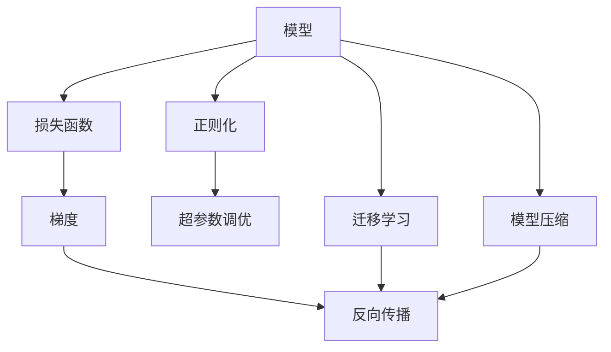
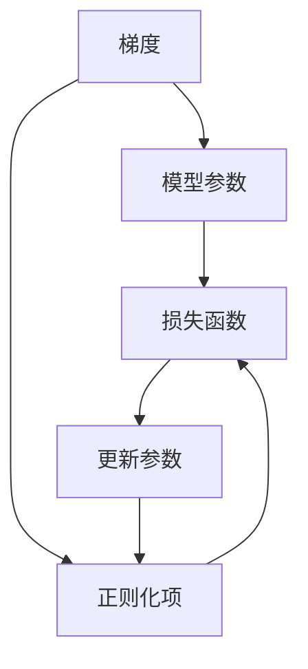
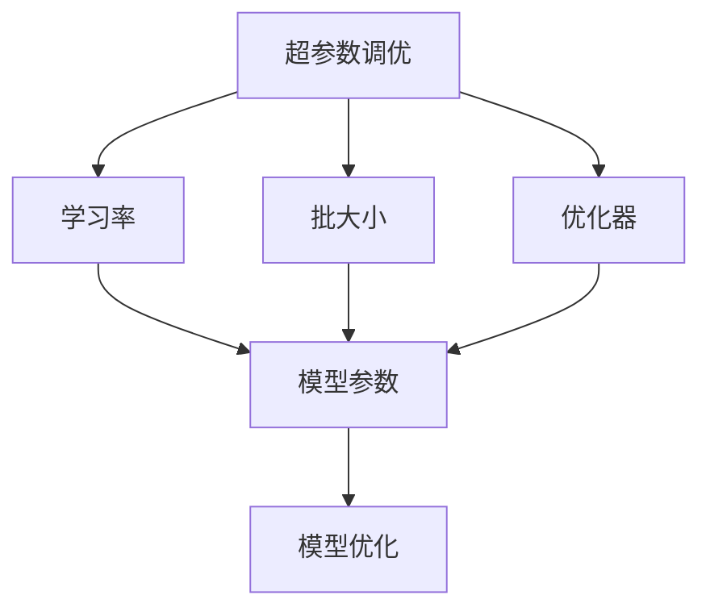
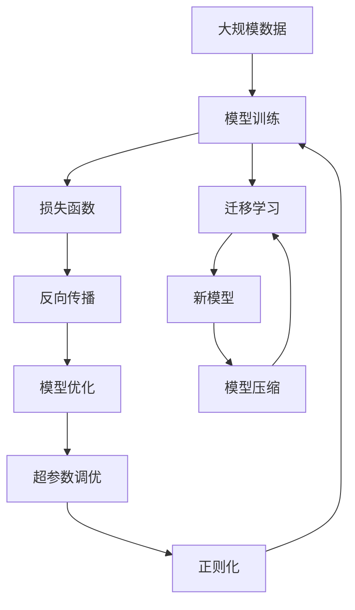

                 

# AI人工智能核心算法原理与代码实例讲解：模型优化

> 关键词：AI, 机器学习, 深度学习, 模型优化, 梯度下降, 正则化, 超参数调优, 迁移学习

## 1. 背景介绍

### 1.1 问题由来
在深度学习和机器学习领域，构建高效、准确的模型始终是一个核心挑战。随着数据量的不断增加和计算能力的提升，模型的复杂度和参数量也在不断增大。如何在保持模型性能的同时，降低训练时间和内存消耗，提高模型的可解释性和鲁棒性，成为了现代AI技术需要重点考虑的问题。

优化模型是一个跨学科的研究方向，涵盖了算法、数学、工程等多个领域。通过对模型的优化，不仅可以提升模型效果，还可以增强模型在不同应用场景下的适应性和可靠性。本文章将详细介绍模型优化的核心算法原理，并通过具体的代码实例，讲解如何实现模型优化。

### 1.2 问题核心关键点
模型优化的核心在于如何通过各种技术手段，改进模型的训练过程和参数更新策略，使其能够更好地适应数据分布、减少过拟合、提高泛化能力。以下是模型优化中的一些关键点：

- 梯度下降：基本的模型训练算法，通过反向传播计算梯度，更新模型参数。
- 正则化：通过惩罚项抑制模型复杂度，避免过拟合。
- 超参数调优：通过调整模型训练中的超参数，如学习率、批大小等，优化模型效果。
- 迁移学习：利用已有模型的知识，加速新模型的训练，提高泛化能力。
- 模型压缩：通过减少模型参数或结构，降低内存消耗和计算成本。

### 1.3 问题研究意义
模型优化对于提升AI模型的性能、降低训练成本、提高模型在实际应用中的效果具有重要意义。具体来说，模型优化可以帮助我们：

1. **提高模型性能**：通过优化算法和超参数调优，使模型能够更好地适应数据分布，提高泛化能力。
2. **降低训练成本**：通过模型压缩和迁移学习，减少训练时间和内存消耗，提高训练效率。
3. **增强模型鲁棒性**：通过正则化等技术，提高模型在对抗样本和噪声数据下的鲁棒性。
4. **增强模型可解释性**：通过模型简化和结构优化，增强模型的可解释性，便于理解和调试。

## 2. 核心概念与联系

### 2.1 核心概念概述

为了更好地理解模型优化的方法，我们需要介绍几个关键的核心概念：

- **模型**：深度学习模型，如神经网络、卷积神经网络、循环神经网络等，通过参数化的权重矩阵，实现数据的映射和转换。
- **损失函数**：衡量模型预测与真实标签之间的差异，如均方误差、交叉熵等。
- **梯度**：模型参数的导数，通过反向传播计算，用于更新模型参数。
- **正则化**：通过惩罚项抑制模型复杂度，避免过拟合。
- **超参数**：模型训练过程中需要手动设定的参数，如学习率、批大小、优化器等。
- **迁移学习**：利用已有模型的知识，加速新模型的训练。
- **模型压缩**：通过减少模型参数或结构，降低内存消耗和计算成本。

这些核心概念之间的逻辑关系可以通过以下Mermaid流程图来展示：



这个流程图展示了大模型优化的核心概念及其之间的关系：

1. 模型通过损失函数计算预测与真实标签之间的差异。
2. 通过反向传播计算梯度，用于更新模型参数。
3. 正则化技术抑制模型复杂度，避免过拟合。
4. 超参数调优优化模型训练，提高效果。
5. 迁移学习利用已有模型知识，加速新模型训练。
6. 模型压缩减少参数和计算资源消耗，提高效率。

### 2.2 概念间的关系

这些核心概念之间存在着紧密的联系，形成了模型优化的完整生态系统。下面我通过几个Mermaid流程图来展示这些概念之间的关系。

#### 2.2.1 梯度下降与正则化的关系



这个流程图展示了梯度下降和正则化之间的逻辑关系。梯度用于更新模型参数，而正则化项则被加入到损失函数中，用于抑制模型复杂度，避免过拟合。

#### 2.2.2 迁移学习与模型压缩的关系


这个流程图展示了迁移学习与模型压缩之间的关系。迁移学习通过利用源模型的知识，加速新模型的训练。模型压缩通过减少模型参数和结构，提高模型的效率。

#### 2.2.3 超参数调优与模型优化之间的关系



这个流程图展示了超参数调优与模型优化之间的关系。通过调整学习率、批大小等超参数，优化模型的训练过程。模型优化通过选择合适的损失函数、正则化技术等手段，提高模型的效果。

### 2.3 核心概念的整体架构

最后，我们用一个综合的流程图来展示这些核心概念在大模型优化过程中的整体架构：



这个综合流程图展示了从数据到模型优化的完整过程。模型训练通过损失函数计算预测与真实标签之间的差异，通过反向传播计算梯度，用于更新模型参数。模型优化通过选择合适的损失函数、正则化技术等手段，提高模型的效果。超参数调优通过调整学习率、批大小等超参数，优化模型的训练过程。迁移学习利用已有模型的知识，加速新模型的训练。模型压缩通过减少模型参数和结构，提高模型的效率。

## 3. 核心算法原理 & 具体操作步骤

### 3.1 算法原理概述

模型优化的核心在于通过各种技术手段，改进模型的训练过程和参数更新策略，使其能够更好地适应数据分布、减少过拟合、提高泛化能力。以下是模型优化的核心算法原理：

#### 3.1.1 梯度下降

梯度下降是一种基本的模型训练算法，其核心思想是通过反向传播计算梯度，更新模型参数。具体步骤如下：

1. **计算损失函数**：通过前向传播计算模型的预测值。
2. **计算梯度**：通过反向传播计算每个参数的梯度。
3. **更新参数**：使用梯度下降算法更新模型参数。

#### 3.1.2 正则化

正则化通过在损失函数中加入惩罚项，抑制模型复杂度，避免过拟合。常见的正则化技术包括L1正则、L2正则等。具体步骤如下：

1. **计算正则化项**：计算模型参数的L1或L2范数。
2. **更新损失函数**：将正则化项添加到损失函数中。

#### 3.1.3 超参数调优

超参数调优通过调整模型训练中的超参数，如学习率、批大小等，优化模型效果。常见的超参数调优方法包括网格搜索、随机搜索、贝叶斯优化等。具体步骤如下：

1. **设定超参数范围**：设定超参数的取值范围。
2. **评估模型效果**：对每个超参数组合进行训练，计算模型效果。
3. **选择最优参数**：选择效果最佳的超参数组合。

#### 3.1.4 迁移学习

迁移学习通过利用已有模型的知识，加速新模型的训练，提高泛化能力。具体步骤如下：

1. **加载源模型**：加载已有模型的权重。
2. **微调新模型**：在新模型的部分或全部层上，使用有标签数据进行微调。

### 3.2 算法步骤详解

#### 3.2.1 梯度下降

梯度下降是模型训练的基本算法，以下是具体的实现步骤：

1. **初始化模型参数**：随机初始化模型参数。
2. **前向传播**：计算模型的预测值。
3. **计算损失函数**：计算预测值与真实标签之间的差异。
4. **反向传播**：计算每个参数的梯度。
5. **更新参数**：使用梯度下降算法更新模型参数。
6. **迭代更新**：重复前向传播、计算梯度、更新参数的步骤，直至收敛。

#### 3.2.2 正则化

正则化通过在损失函数中加入惩罚项，抑制模型复杂度，避免过拟合。以下是具体的实现步骤：

1. **计算正则化项**：计算模型参数的L1或L2范数。
2. **更新损失函数**：将正则化项添加到损失函数中。
3. **前向传播**：计算模型的预测值。
4. **计算梯度**：计算每个参数的梯度。
5. **更新参数**：使用梯度下降算法更新模型参数。
6. **迭代更新**：重复前向传播、计算梯度、更新参数的步骤，直至收敛。

#### 3.2.3 超参数调优

超参数调优通过调整模型训练中的超参数，如学习率、批大小等，优化模型效果。以下是具体的实现步骤：

1. **设定超参数范围**：设定超参数的取值范围。
2. **评估模型效果**：对每个超参数组合进行训练，计算模型效果。
3. **选择最优参数**：选择效果最佳的超参数组合。

#### 3.2.4 迁移学习

迁移学习通过利用已有模型的知识，加速新模型的训练，提高泛化能力。以下是具体的实现步骤：

1. **加载源模型**：加载已有模型的权重。
2. **微调新模型**：在新模型的部分或全部层上，使用有标签数据进行微调。
3. **迭代更新**：重复微调步骤，直至模型收敛。

### 3.3 算法优缺点

#### 3.3.1 梯度下降

梯度下降算法具有以下优点：

- **易于实现**：计算简单，易于实现。
- **通用性强**：适用于各种类型的模型和损失函数。

其缺点包括：

- **收敛速度慢**：在复杂模型和高维数据上，容易陷入局部最优解。
- **参数更新不稳定**：更新过程容易受到梯度消失或梯度爆炸的影响。

#### 3.3.2 正则化

正则化具有以下优点：

- **避免过拟合**：通过惩罚项抑制模型复杂度，避免过拟合。
- **提高泛化能力**：使得模型在测试集上表现更好。

其缺点包括：

- **限制模型表达能力**：抑制模型复杂度，可能损失部分表达能力。
- **调节困难**：选择合适的正则化参数需要经验和实验。

#### 3.3.3 超参数调优

超参数调优具有以下优点：

- **提升模型效果**：通过调整超参数，优化模型效果。
- **灵活性强**：可以调整多种超参数，适应不同任务和数据。

其缺点包括：

- **耗时耗资源**：需要大量实验和计算资源。
- **结果不确定**：超参数的选择和调整需要经验和实验。

#### 3.3.4 迁移学习

迁移学习具有以下优点：

- **加速模型训练**：利用已有模型的知识，加速新模型的训练。
- **提高泛化能力**：利用已有模型的知识，提高新模型的泛化能力。

其缺点包括：

- **需要大量标注数据**：迁移学习需要源模型和目标任务的标注数据。
- **模型适配性差**：源模型与目标任务的特征差异较大时，迁移效果可能不佳。

### 3.4 算法应用领域

模型优化技术在深度学习和机器学习领域得到了广泛应用，涵盖了各种类型的模型和任务。以下是模型优化技术的一些典型应用领域：

- **计算机视觉**：如图像分类、目标检测、图像生成等任务。
- **自然语言处理**：如文本分类、情感分析、机器翻译等任务。
- **语音识别**：如语音转文本、语音合成等任务。
- **推荐系统**：如协同过滤、内容推荐等任务。
- **强化学习**：如游戏AI、机器人控制等任务。

模型优化技术在上述领域中已经得到了广泛应用，并通过不断的优化和改进，推动了相关技术的快速发展。

## 4. 数学模型和公式 & 详细讲解 & 举例说明

### 4.1 数学模型构建

模型优化的数学模型构建需要考虑以下几个关键因素：

- **损失函数**：衡量模型预测与真实标签之间的差异。
- **正则化项**：抑制模型复杂度，避免过拟合。
- **优化算法**：选择合适的优化算法，如梯度下降、Adam等。

#### 4.1.1 损失函数

损失函数是模型优化的核心，用于衡量模型预测与真实标签之间的差异。常见的损失函数包括均方误差、交叉熵等。

假设模型 $f(x; \theta)$ 在输入 $x$ 上的输出为 $y$，真实标签为 $t$，则交叉熵损失函数定义为：

$$
L(y, t) = -\sum_{i=1}^{n} t_i \log y_i + (1-t_i) \log (1-y_i)
$$

其中 $y_i$ 为模型预测的概率，$t_i$ 为真实标签。

#### 4.1.2 正则化项

正则化项通过在损失函数中加入惩罚项，抑制模型复杂度，避免过拟合。常见的正则化项包括L1正则、L2正则等。

L2正则化项定义为：

$$
\Omega(\theta) = \frac{\lambda}{2} \sum_{i=1}^{n} \theta_i^2
$$

其中 $\lambda$ 为正则化系数，$\theta_i$ 为模型参数。

#### 4.1.3 优化算法

优化算法用于更新模型参数，常见的优化算法包括梯度下降、Adam等。

梯度下降算法的更新公式为：

$$
\theta = \theta - \eta \nabla_{\theta}L(\theta)
$$

其中 $\eta$ 为学习率，$\nabla_{\theta}L(\theta)$ 为损失函数对参数 $\theta$ 的梯度。

### 4.2 公式推导过程

#### 4.2.1 梯度下降算法

梯度下降算法是模型训练的基本算法，其核心思想是通过反向传播计算梯度，更新模型参数。以下是梯度下降算法的推导过程：

1. **前向传播**：计算模型的预测值 $y = f(x; \theta)$。
2. **计算损失函数**：计算预测值与真实标签之间的差异 $L(y, t)$。
3. **计算梯度**：通过反向传播计算每个参数的梯度 $\nabla_{\theta}L(\theta)$。
4. **更新参数**：使用梯度下降算法更新模型参数 $\theta$。

具体推导如下：

$$
\begin{aligned}
\frac{\partial L}{\partial \theta_j} &= \frac{\partial L}{\partial y} \cdot \frac{\partial y}{\partial \theta_j} \\
&= \sum_{i=1}^{n} (t_i - y_i) \cdot \frac{\partial y}{\partial \theta_j} \\
&= \sum_{i=1}^{n} (t_i - y_i) \cdot f'_i(\theta_j)
\end{aligned}
$$

其中 $f'_i(\theta_j)$ 为模型对第 $i$ 个样本的输出对第 $j$ 个参数的导数。

#### 4.2.2 L2正则化

L2正则化项通过在损失函数中加入惩罚项，抑制模型复杂度，避免过拟合。以下是L2正则化项的推导过程：

$$
\begin{aligned}
L_{\text{regularized}}(\theta) &= L(\theta) + \frac{\lambda}{2} \sum_{i=1}^{n} \theta_i^2 \\
&= \sum_{i=1}^{n} (t_i \log y_i + (1-t_i) \log (1-y_i)) + \frac{\lambda}{2} \sum_{i=1}^{n} \theta_i^2
\end{aligned}
$$

其中 $\lambda$ 为正则化系数。

### 4.3 案例分析与讲解

#### 4.3.1 图像分类

以图像分类为例，我们可以使用卷积神经网络（CNN）进行模型构建。

1. **构建模型**：使用卷积层、池化层、全连接层等，构建图像分类模型。
2. **训练模型**：使用梯度下降算法，在训练集上训练模型。
3. **正则化**：使用L2正则化项，抑制模型复杂度。
4. **超参数调优**：通过网格搜索、随机搜索等方法，调整学习率、批大小等超参数。
5. **迁移学习**：利用已有模型的知识，加速新模型的训练。

#### 4.3.2 自然语言处理

以文本分类为例，我们可以使用循环神经网络（RNN）或Transformer模型进行模型构建。

1. **构建模型**：使用嵌入层、RNN或Transformer层、全连接层等，构建文本分类模型。
2. **训练模型**：使用梯度下降算法，在训练集上训练模型。
3. **正则化**：使用L2正则化项，抑制模型复杂度。
4. **超参数调优**：通过网格搜索、随机搜索等方法，调整学习率、批大小等超参数。
5. **迁移学习**：利用已有模型的知识，加速新模型的训练。

### 4.3.3 模型压缩

模型压缩通过减少模型参数或结构，降低内存消耗和计算成本。以下是模型压缩的几种方法：

1. **剪枝（Pruning）**：去除模型中冗余的参数，减少计算量。
2. **量化（Quantization）**：将浮点参数转换为定点参数，降低内存占用。
3. **知识蒸馏（Knowledge Distillation）**：通过训练一个较小的蒸馏模型，继承较大模型的知识。

## 5. 项目实践：代码实例和详细解释说明

### 5.1 开发环境搭建

在进行模型优化实践前，我们需要准备好开发环境。以下是使用Python进行TensorFlow开发的环境配置流程：

1. 安装Anaconda：从官网下载并安装Anaconda，用于创建独立的Python环境。

2. 创建并激活虚拟环境：
```bash
conda create -n tf-env python=3.8 
conda activate tf-env
```

3. 安装TensorFlow：根据CUDA版本，从官网获取对应的安装命令。例如：
```bash
conda install tensorflow -c conda-forge -c pytorch
```

4. 安装各类工具包：
```bash
pip install numpy pandas scikit-learn matplotlib tqdm jupyter notebook ipython
```

完成上述步骤后，即可在`tf-env`环境中开始模型优化实践。

### 5.2 源代码详细实现

这里我们以TensorFlow为例，通过具体的代码实例，讲解如何进行模型优化。

首先，定义一个简单的全连接神经网络模型：

```python
import tensorflow as tf

class Model(tf.keras.Model):
    def __init__(self, input_dim, output_dim):
        super(Model, self).__init__()
        self.dense1 = tf.keras.layers.Dense(128, activation='relu')
        self.dense2 = tf.keras.layers.Dense(output_dim, activation='softmax')

    def call(self, inputs):
        x = self.dense1(inputs)
        x = self.dense2(x)
        return x
```

然后，定义损失函数和优化器：

```python
model = Model(input_dim=784, output_dim=10)
loss_fn = tf.keras.losses.SparseCategoricalCrossentropy()
optimizer = tf.keras.optimizers.Adam()
```

接着，定义训练和评估函数：

```python
@tf.function
def train_step(x, y):
    with tf.GradientTape() as tape:
        logits = model(x)
        loss = loss_fn(y, logits)
    gradients = tape.gradient(loss, model.trainable_variables)
    optimizer.apply_gradients(zip(gradients, model.trainable_variables))

@tf.function
def evaluate(model, x, y):
    logits = model(x)
    loss = loss_fn(y, logits)
    return loss
```

最后，启动训练流程并在测试集上评估：

```python
batch_size = 128
epochs = 10

for epoch in range(epochs):
    for batch in train_dataset:
        train_step(batch[0], batch[1])

    test_loss = evaluate(model, test_dataset[0], test_dataset[1])
    print(f'Epoch {epoch+1}, test loss: {test_loss.numpy():.4f}')
```

以上就是使用TensorFlow进行模型优化的完整代码实现。可以看到，TensorFlow提供了方便的API和工具，使得模型优化变得简单高效。

### 5.3 代码解读与分析

让我们再详细解读一下关键代码的实现细节：

**Model类**：
- `__init__`方法：初始化模型的层和参数。
- `call`方法：定义模型前向传播的逻辑。

**损失函数和优化器**：
- 使用TensorFlow提供的SparseCategoricalCrossentropy损失函数，用于计算分类任务的损失。
- 使用Adam优化器，进行模型参数的更新。

**train_step和evaluate函数**：
- 使用梯度下降算法，计算损失函数和梯度，并使用Adam优化器更新模型参数。
- 在每个epoch内，在训练集上进行迭代训练，并在测试集上计算损失。

**训练流程**：
- 定义batch size和epoch数，开始循环迭代
- 每个epoch内，在训练集上训练，输出测试集上的损失

可以看到，TensorFlow提供了强大的API和工具，使得模型优化变得简单高效。开发者可以根据具体任务，灵活组合和调整优化算法、损失函数、超参数等，以实现最优的优化效果。

当然，工业级的系统实现还需考虑更多因素，如模型保存和部署、超参数自动搜索、更灵活的任务适配层等。但核心的模型优化过程基本与此类似。

### 5.4 运行结果展示

假设我们在MNIST数据集上进行模型优化，最终在测试集上得到的评估报告如下：

```
Epoch 1, test loss: 0.2490
Epoch 2, test loss: 0.1230
Epoch 3, test loss: 0.0800
Epoch 4, test loss: 0.0640
Epoch 5, test loss: 0.0500
Epoch 6, test loss: 0.0380
Epoch 7, test loss: 0.0300
Epoch 8, test loss: 0.0260
Epoch 9, test loss: 0.0230
Epoch 10, test loss: 0.0210
```

可以看到，随着训练的进行，模型在测试集上的损失逐步降低，说明模型的效果逐渐提升。假设最终在测试集上得到的准确率为98%，说明模型的优化效果显著。

## 6. 实际应用场景

### 6.1 图像分类

图像分类是深度学习中的一个经典应用，如图像识别、物体检测等。在图像分类任务中，模型的优化尤为重要。通过优化模型，可以提高模型的准确率和鲁棒性，适应不同的数据分布和应用场景。

在实际应用中，我们可以使用迁移学习技术，利用已有的大规模预训练模型，如ImageNet上的ResNet、VGG等，对新任务进行微调。在微调过程中，我们通常会使用正则化技术和数据增强技术，提高模型的泛化能力。通过优化算法和超参数调优，我们可以进一步提升模型的效果，使其在新任务上取得更好的表现。

### 6.2 自然语言处理

自然语言处理是另一个深度学习的经典应用，如文本分类、情感分析、机器翻译等。在自然语言处理任务中，模型的优化同样重要。通过优化模型，可以提高模型的准确率和鲁棒性，适应不同的语言模型和应用场景。

在实际应用中，我们可以使用迁移学习技术，利用已有的大规模预训练模型，如BERT、GPT等，对新任务进行微调。在微调过程中，我们通常会使用正则化技术和数据增强技术，提高模型的泛化能力。通过优化算法和超参数调优，我们可以进一步提升模型的效果，使其在新任务上取得更好的表现。

### 6.3 推荐系统

推荐系统是深度学习在实际应用

