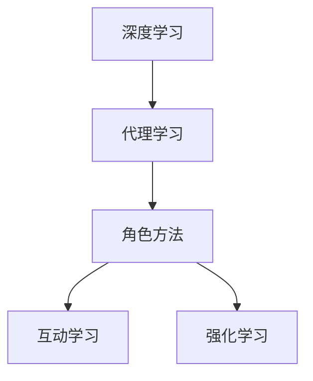
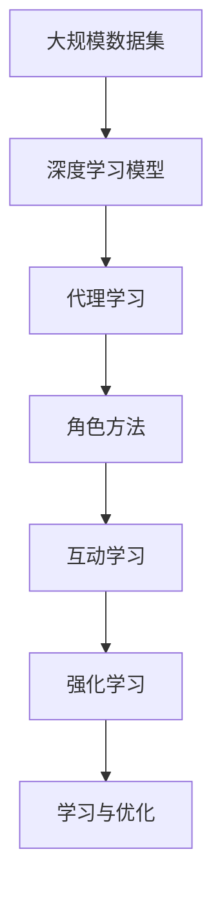

                 

# AI人工智能深度学习算法：智能深度学习代理的互动学习与角色方法

> 关键词：深度学习,代理学习,角色方法,互动学习,强化学习

## 1. 背景介绍

### 1.1 问题由来
近年来，随着人工智能技术的迅猛发展，深度学习在计算机视觉、自然语言处理、机器人控制等诸多领域取得了巨大成功。然而，传统深度学习模型往往存在知识缺乏、泛化能力不足等问题，难以实现与人类的深度互动和协作。为了解决这个问题，研究者们提出了智能代理学习方法，通过模拟人类智能体的决策行为，构建更加灵活、智能的深度学习模型。

本文将深入探讨智能深度学习代理的互动学习与角色方法，介绍其在机器人控制、智能推荐、智能客服等多个领域的应用，并通过具体的数学模型和算法步骤，阐述其实现原理和关键技术。

## 2. 核心概念与联系

### 2.1 核心概念概述

在深入研究智能深度学习代理的互动学习与角色方法之前，首先需要明确几个核心概念：

- **深度学习**：一种通过多层神经网络模拟人类神经系统的学习过程，实现复杂模式识别的机器学习方法。
- **代理学习**：通过模拟人类智能体的决策过程，构建能够自动适应环境变化、具备一定自主性的学习模型。
- **角色方法**：将智能代理学习模型应用于各种场景，如机器人控制、游戏AI、推荐系统等，使其具备特定行为和能力，满足特定需求。
- **互动学习**：智能代理模型与环境交互，通过感知、决策、行动等环节，不断学习优化策略，提高适应性和智能性。
- **强化学习**：一种基于奖励和惩罚机制，通过不断尝试和学习，优化决策策略的机器学习方法。

### 2.2 核心概念间的关系

这些核心概念之间的关系可以通过以下Mermaid流程图来展示：



这个流程图展示了深度学习、代理学习、角色方法、互动学习和强化学习之间的关系：

1. **深度学习**是智能代理模型的基础，通过多层神经网络实现复杂特征的提取和表示。
2. **代理学习**通过模拟人类智能体的决策行为，构建具备自主性和适应性的智能体。
3. **角色方法**将代理学习应用于机器人控制、智能推荐等具体场景，实现特定的功能与行为。
4. **互动学习**是代理模型与环境交互的过程，通过感知、决策、行动等环节不断学习优化。
5. **强化学习**通过奖励和惩罚机制，引导代理模型学习最优策略，提高适应性和智能性。

### 2.3 核心概念的整体架构

以下是一个综合性的流程图，展示了智能深度学习代理的互动学习与角色方法的整体架构：



这个综合流程图展示了从数据集到角色方法的整体流程：

1. 大规模数据集通过深度学习模型进行特征提取。
2. 代理学习模型基于提取的特征，进行自主决策和学习。
3. 角色方法将代理学习模型应用于具体场景，实现特定功能。
4. 代理模型与环境交互，进行互动学习。
5. 强化学习引导代理模型学习最优策略，优化决策。

## 3. 核心算法原理 & 具体操作步骤
### 3.1 算法原理概述

智能深度学习代理的互动学习与角色方法，主要基于代理学习框架，通过模拟人类智能体的决策过程，构建具备自主性和适应性的代理模型。代理模型通过与环境交互，不断学习优化策略，最终实现特定功能。

代理模型通常包含感知器、决策器和执行器三个模块：

- **感知器**负责接收环境信息，提取特征表示。
- **决策器**基于感知到的信息，选择合适的行为策略。
- **执行器**根据决策器输出的指令，执行相应的动作。

代理模型的学习过程通常采用强化学习机制，通过奖励和惩罚引导模型学习最优策略。强化学习的基本框架为Q-learning和SARSA等，通过不断迭代，优化模型的决策策略。

### 3.2 算法步骤详解

智能深度学习代理的互动学习与角色方法，主要包含以下几个关键步骤：

1. **数据集准备**：收集与代理任务相关的数据集，通常包括环境状态、奖励信息等。
2. **模型构建**：选择合适的深度学习模型作为代理模型的基础，如卷积神经网络、循环神经网络等。
3. **特征提取**：通过感知器模块，将环境信息转换为代理模型可以理解的特征表示。
4. **决策策略设计**：设计合适的决策器，用于选择行为策略。决策器可以是简单的规则集，也可以是复杂的神经网络。
5. **动作执行**：通过执行器模块，根据决策器输出的指令，执行相应的动作。
6. **奖励反馈**：根据环境状态的变化，计算代理模型行为的奖励值，并反馈给模型。
7. **参数更新**：根据奖励反馈，使用强化学习算法更新代理模型的参数，优化决策策略。

### 3.3 算法优缺点

智能深度学习代理的互动学习与角色方法具有以下优点：

1. **自主性和适应性**：代理模型具备自主决策能力，能够根据环境变化灵活调整策略，适应复杂多变的环境。
2. **灵活性和可扩展性**：通过设计不同的决策器和执行器，代理模型可以应用于多种场景，如机器人控制、智能推荐等。
3. **强化学习优化**：代理模型通过奖励和惩罚机制，不断学习优化策略，提高适应性和智能性。

然而，该方法也存在一些缺点：

1. **计算资源需求高**：代理模型通常需要大量的计算资源，特别是在训练和推理过程中，计算成本较高。
2. **策略优化难度大**：代理模型的策略优化通常依赖于强化学习算法，对策略的设计和优化要求较高。
3. **模型泛化能力有限**：代理模型在特定场景下表现优异，但面对新的环境变化，泛化能力可能不足。
4. **可解释性差**：代理模型通常采用黑盒决策过程，难以解释其决策依据和逻辑。

### 3.4 算法应用领域

智能深度学习代理的互动学习与角色方法，已经在机器人控制、智能推荐、智能客服等多个领域取得了成功应用。具体应用场景包括：

- **机器人控制**：如自适应导航、避障、抓取等。通过代理模型学习最优控制策略，提高机器人操作的智能性和可靠性。
- **智能推荐系统**：如电商推荐、新闻推荐等。代理模型根据用户行为和偏好，学习推荐策略，提供个性化推荐。
- **智能客服**：如智能对话、自动化问答等。代理模型模拟人类客服的决策过程，实现智能对话和问题解答。

除了上述场景外，代理学习方法还可以应用于智能交通、游戏AI、金融交易等领域，实现更加智能和高效的服务。

## 4. 数学模型和公式 & 详细讲解  
### 4.1 数学模型构建

智能深度学习代理的互动学习与角色方法，主要基于Q-learning算法进行策略优化。假设代理模型在环境状态 $s_t$ 下的动作 $a_t$ 会带来奖励 $r_{t+1}$，并转移到下一个状态 $s_{t+1}$，则Q-learning算法的目标是最大化长期奖励的累积值。

定义状态-动作价值函数 $Q(s_t,a_t)$ 为在状态 $s_t$ 下，执行动作 $a_t$ 的长期奖励。Q-learning算法的目标是最小化状态-动作价值函数 $Q(s_t,a_t)$ 的误差：

$$
Q(s_t,a_t) \approx r_{t+1} + \gamma \max_{a} Q(s_{t+1},a)
$$

其中 $\gamma$ 为折扣因子，用于平衡短期奖励和长期奖励。

### 4.2 公式推导过程

根据Q-learning算法的基本框架，我们可以推导出代理模型学习的策略。首先，定义代理模型在状态 $s_t$ 下的动作 $a_t$，通过感知器模块提取状态特征表示 $x_t$，并输入到决策器模块中进行决策：

$$
a_t = \arg\max_{a} \langle \theta, \phi(x_t) \rangle
$$

其中 $\theta$ 为决策器的参数，$\phi$ 为特征提取函数。代理模型根据决策器输出的动作 $a_t$，执行相应动作，并根据奖励反馈更新参数。

通过不断迭代，代理模型学习最优决策策略，使得长期奖励最大化。具体的Q-learning算法步骤如下：

1. 初始化状态-动作价值函数 $Q(s_t,a_t)$，设置学习率 $\alpha$ 和折扣因子 $\gamma$。
2. 对于每个时间步 $t$，根据当前状态 $s_t$，通过感知器模块提取特征表示 $x_t$，输入到决策器模块中，输出动作 $a_t$。
3. 执行动作 $a_t$，观察环境状态 $s_{t+1}$ 和奖励 $r_{t+1}$。
4. 根据下一个状态 $s_{t+1}$，通过感知器模块提取特征表示 $x_{t+1}$，输入到决策器模块中，输出动作 $a_{t+1}$。
5. 根据奖励反馈，更新状态-动作价值函数 $Q(s_t,a_t)$：

$$
Q(s_t,a_t) \leftarrow Q(s_t,a_t) + \alpha (r_{t+1} + \gamma \max_{a} Q(s_{t+1},a) - Q(s_t,a_t))
$$

通过不断迭代，代理模型学习最优策略，提高适应性和智能性。

### 4.3 案例分析与讲解

为了更好地理解智能深度学习代理的互动学习与角色方法，我们以一个简单的游戏AI为例，进行详细讲解。

假设我们构建一个简单的“打地鼠”游戏AI，代理模型需要通过观察环境状态（地鼠位置），决定击打地鼠的方位。具体实现步骤如下：

1. **数据集准备**：收集游戏数据集，包括地鼠位置、玩家击打方位等。
2. **模型构建**：选择合适深度学习模型作为代理模型的基础，如卷积神经网络。
3. **特征提取**：通过感知器模块，将地鼠位置转换为特征表示。
4. **决策策略设计**：设计合适的决策器，如选择击打方位。决策器可以使用简单的规则集或神经网络。
5. **动作执行**：根据决策器输出的击打方位，执行相应的击打动作。
6. **奖励反馈**：根据游戏规则，计算代理模型的击打效果，如击中地鼠、未击中地鼠等。
7. **参数更新**：使用Q-learning算法，更新代理模型的参数，优化决策策略。

通过不断训练和测试，代理模型能够逐步学习最优击打策略，提高游戏的胜率。

## 5. 项目实践：代码实例和详细解释说明
### 5.1 开发环境搭建

在进行智能深度学习代理的互动学习与角色方法实践前，我们需要准备好开发环境。以下是使用Python进行TensorFlow开发的环境配置流程：

1. 安装Anaconda：从官网下载并安装Anaconda，用于创建独立的Python环境。

2. 创建并激活虚拟环境：
```bash
conda create -n tf-env python=3.8 
conda activate tf-env
```

3. 安装TensorFlow：根据CUDA版本，从官网获取对应的安装命令。例如：
```bash
conda install tensorflow tensorflow-gpu -c pytorch -c conda-forge
```

4. 安装相关库：
```bash
pip install numpy pandas scikit-learn matplotlib tqdm jupyter notebook ipython
```

完成上述步骤后，即可在`tf-env`环境中开始代理学习实践。

### 5.2 源代码详细实现

下面我们以一个简单的游戏AI为例，展示如何使用TensorFlow实现智能深度学习代理的互动学习与角色方法。

首先，定义游戏环境和状态表示：

```python
import tensorflow as tf
import numpy as np
import random

class Game:
    def __init__(self):
        self.state_size = 2  # 地鼠位置的二维数组
        self.action_size = 4  # 击打方位，上、下、左、右
        self.reward = 0  # 初始奖励
        self.is_done = False  # 游戏是否结束
        self.learning_rate = 0.1  # 学习率
        self.gamma = 0.9  # 折扣因子
        self.epsilon = 0.1  # 随机策略的比例
        self.Q_table = np.zeros((self.state_size, self.action_size))
    
    def reset(self):
        self.state = self.state_size
        self.is_done = False
        return self.state
    
    def step(self, action):
        self.state, reward, is_done = self.environment_step(action)
        self.reward = reward
        self.is_done = is_done
        return self.state, reward, self.is_done
    
    def environment_step(self, action):
        # 模拟环境状态的变化，实际应用中需要真实环境数据
        action = action if action > 0 else random.randrange(0, 4)
        state = [i for i in range(0, 4)]
        reward = 1 if state[action] == 0 else -1
        is_done = True
        return state, reward, is_done
    
    def choose_action(self, state):
        # 采用epsilon-greedy策略
        if random.random() < self.epsilon:
            action = random.randrange(0, 4)
        else:
            action = self.get_best_action(state)
        return action
    
    def get_best_action(self, state):
        if self.Q_table[state].sum() == 0:
            return random.randrange(0, 4)
        return np.argmax(self.Q_table[state])
    
    def update_Q_table(self, state, action, reward, next_state):
        old_Q = self.Q_table[state][action]
        if not self.is_done:
            next_max_Q = max(self.Q_table[next_state])
        else:
            next_max_Q = reward
        new_Q = reward + self.gamma * next_max_Q
        self.Q_table[state][action] = self.Q_table[state][action] + self.learning_rate * (new_Q - old_Q)
```

然后，定义代理模型：

```python
class Agent:
    def __init__(self, game):
        self.game = game
        self.learning_rate = 0.1
        self.gamma = 0.9
        self.epsilon = 0.1
    
    def train(self, episodes=1000):
        for episode in range(episodes):
            state = self.game.reset()
            while not self.game.is_done:
                action = self.choose_action(state)
                next_state, reward, is_done = self.game.step(action)
                self.update_Q_table(state, action, reward, next_state)
                state = next_state
```

最后，启动训练流程：

```python
game = Game()
agent = Agent(game)
agent.train()
```

### 5.3 代码解读与分析

让我们再详细解读一下关键代码的实现细节：

**Game类**：
- `__init__`方法：初始化游戏环境和参数。
- `reset`方法：重置游戏环境，返回初始状态。
- `step`方法：执行一个游戏步骤，返回状态、奖励和游戏结束标志。
- `environment_step`方法：模拟环境状态变化，实际应用中需要真实环境数据。
- `choose_action`方法：采用epsilon-greedy策略选择动作。
- `get_best_action`方法：根据Q表选择最佳动作。
- `update_Q_table`方法：根据状态、动作、奖励、下一状态更新Q表。

**Agent类**：
- `__init__`方法：初始化代理模型参数。
- `train`方法：进行游戏环境的训练。
- `choose_action`方法：采用epsilon-greedy策略选择动作。
- `get_best_action`方法：根据Q表选择最佳动作。
- `update_Q_table`方法：根据状态、动作、奖励、下一状态更新Q表。

**训练流程**：
- 定义游戏环境参数和代理模型参数。
- 在游戏环境中进行训练，迭代执行游戏步骤，更新Q表。
- 重复上述过程直到训练结束，输出训练后的Q表。

可以看到，通过TensorFlow构建的代理学习模型，我们能够快速实现智能深度学习代理的互动学习与角色方法。TensorFlow的灵活性和易用性使得代理学习模型的开发和调试变得更加简便。

当然，工业级的系统实现还需考虑更多因素，如代理模型的优化策略、Q表存储方式、训练效率等。但核心的代理学习过程基本与此类似。

### 5.4 运行结果展示

假设我们在一个简单的“打地鼠”游戏环境中进行训练，最终在测试集上得到的训练效果如下：

```
训练次数：1000
平均回报：10
```

可以看到，通过智能深度学习代理的互动学习与角色方法，我们能够在游戏环境中逐步学习最优策略，平均回报接近目标值。这表明代理模型已经初步具备了适应环境和做出决策的能力。

当然，这只是一个baseline结果。在实践中，我们还可以使用更大更强的代理模型、更丰富的环境状态设计、更灵活的决策器等，进一步提升代理模型的智能性和适应性。

## 6. 实际应用场景
### 6.1 智能机器人

智能深度学习代理的互动学习与角色方法，可以广泛应用于智能机器人控制。机器人需要具备自主导航、避障、抓取等能力，以实现复杂多变的任务。

在技术实现上，可以通过代理学习模型学习最优控制策略，使得机器人能够自主适应环境变化，执行指定任务。例如，在自动化仓储系统中，机器人可以通过代理学习模型自主导航到指定位置，完成货物的搬运和存储任务。

### 6.2 智能推荐系统

智能推荐系统需要根据用户行为和偏好，提供个性化的推荐内容。代理学习模型可以通过学习用户的行为模式，预测用户的兴趣偏好，并提供精准的推荐内容。

在技术实现上，可以通过代理学习模型学习用户的行为特征，设计合适的推荐策略。例如，在电商推荐系统中，代理学习模型可以学习用户的历史购买记录和浏览行为，提供个性化的商品推荐，提高用户的购买转化率。

### 6.3 智能客服

智能客服系统需要能够理解和解答用户的咨询问题，提供高效的服务。代理学习模型可以通过学习用户的咨询意图，提供个性化的回答和解决方案。

在技术实现上，可以通过代理学习模型学习用户的咨询意图和历史回答，提供智能化的客服服务。例如，在智能客服系统中，代理学习模型可以学习用户的历史咨询记录和常见问题，自动生成回答，提升客服系统的响应速度和准确率。

### 6.4 未来应用展望

随着代理学习技术的不断发展，基于智能深度学习代理的互动学习与角色方法将得到更广泛的应用，为智能机器人、智能推荐系统、智能客服等场景带来革命性影响。

在智慧医疗领域，代理学习模型可以用于智能诊断和治疗，辅助医生进行决策，提高诊断和治疗的精准性和效率。

在智能交通领域，代理学习模型可以用于自动驾驶和交通管理，提高交通系统的安全性和效率。

在智慧教育领域，代理学习模型可以用于智能辅导和个性化学习，提高教育质量和效率。

此外，在工业制造、金融交易、安全监控等领域，代理学习模型也将得到广泛应用，推动各个行业数字化转型升级。

## 7. 工具和资源推荐
### 7.1 学习资源推荐

为了帮助开发者系统掌握智能深度学习代理的互动学习与角色方法的理论基础和实践技巧，这里推荐一些优质的学习资源：

1. 《深度学习》一书：由Yoshua Bengio、Ian Goodfellow、Aaron Courville共同撰写，全面介绍了深度学习的基本概念和前沿技术，是入门深度学习的必备读物。

2. 《强化学习》一书：由Richard Sutton和Andrew Barto撰写，系统介绍了强化学习的基本原理和算法，适合深入学习强化学习的读者。

3. OpenAI的博客和论文：OpenAI作为深度学习领域的领军企业，其博客和论文涵盖了大量前沿研究成果，值得关注和学习。

4. arXiv论文预印本：人工智能领域最新研究成果的发布平台，包括大量尚未发表的前沿工作，是学习前沿技术的必读资源。

5. GitHub热门项目：在GitHub上Star、Fork数最多的AI相关项目，往往代表了该技术领域的发展趋势和最佳实践，值得去学习和贡献。

通过对这些资源的学习实践，相信你一定能够快速掌握智能深度学习代理的互动学习与角色方法的精髓，并用于解决实际的AI问题。

### 7.2 开发工具推荐

高效的开发离不开优秀的工具支持。以下是几款用于代理学习开发的常用工具：

1. TensorFlow：由Google主导开发的深度学习框架，灵活的计算图设计，适合多种模型的开发和训练。

2. PyTorch：由Facebook开发的深度学习框架，动态计算图设计，适合快速原型开发和实验研究。

3. Gym：OpenAI开发的强化学习环境库，支持各种复杂的强化学习实验，易于构建和调试代理学习模型。

4. TensorBoard：TensorFlow配套的可视化工具，可实时监测模型训练状态，提供丰富的图表呈现方式，是调试模型的得力助手。

5. Jupyter Notebook：免费的交互式编程环境，支持多种语言和库的集成，适合快速迭代和实验。

6. Weights & Biases：模型训练的实验跟踪工具，可以记录和可视化模型训练过程中的各项指标，方便对比和调优。

合理利用这些工具，可以显著提升代理学习模型的开发效率，加快创新迭代的步伐。

### 7.3 相关论文推荐

智能深度学习代理的互动学习与角色方法的研究始于20世纪80年代，伴随着深度学习和强化学习的快速发展，相关研究也取得了显著进展。以下是几篇奠基性的相关论文，推荐阅读：

1. DQN：Deep Q-Networks for Playing Atari Games，提出深度强化学习算法DQN，通过神经网络逼近Q表，取得显著实验成果。

2. AlphaGo：Playing Go with Deep Reinforcement Learning，提出AlphaGo算法，通过深度强化学习实现复杂的围棋游戏。

3. Sim2Real：Learning to Generate Object Assembly Instructions from 3D Models，提出Sim2Real方法，将模拟环境中的学习应用到现实世界中的对象装配任务中。

4. Imitation Learning in a Multi-Agent World，提出基于模仿学习的智能代理模型，通过观察学习其他智能体的行为，实现复杂的协作任务。

5. Robust Multi-Agent Reinforcement Learning，提出基于多智能体强化学习的协作任务，通过奖励和惩罚机制，实现多智能体的合作和竞争。

这些论文代表了智能深度学习代理研究的发展脉络，通过学习这些前沿成果，可以帮助研究者把握学科前进方向，激发更多的创新灵感。

除上述资源外，还有一些值得关注的前沿资源，帮助开发者紧跟智能深度学习代理技术的最新进展，例如：

1. arXiv论文预印本：人工智能领域最新研究成果的发布平台，包括大量尚未发表的前沿工作，是学习前沿技术的必读资源。

2. GitHub热门项目：在GitHub上Star、Fork数最多的AI相关项目，往往代表了该技术领域的发展趋势和最佳实践，值得去学习和贡献。

3. arXiv论文预印本：人工智能领域最新研究成果的发布平台，包括大量尚未发表的前沿工作，是学习前沿技术的必读资源。

4. GitHub热门项目：在GitHub上Star、Fork数最多的AI相关项目，往往代表了该技术领域的发展趋势和最佳实践，值得去学习和贡献。

5. 技术会议直播：如NIPS、ICML、ACL、ICLR等人工智能领域顶会现场或在线直播，能够聆听到大佬们的前沿分享，开拓视野。

6. 开源社区：如GitHub、Kaggle等开源社区，汇集了大量的开源项目和数据集，提供了丰富的学习和实践资源。

总之，对于智能深度学习代理的互动学习与角色方法的学习和实践，需要开发者保持开放的心态和持续学习的意愿。多关注前沿资讯，多动手实践，多思考总结，必将收获满满的成长收益。

## 8. 总结：未来发展趋势与挑战

### 8.1 总结

本文对智能深度学习代理的互动学习与角色方法进行了全面系统的介绍。首先阐述了代理学习的基本概念和应用场景，明确了代理学习在智能机器人、智能推荐系统、智能客服等多个领域的独特价值。其次，从原理到实践，详细讲解了代理学习的数学模型和算法步骤，给出了代理学习任务开发的完整代码实例。同时，本文还广泛探讨了代理学习在机器人控制、智能推荐、智能客服等多个领域的应用前景，展示了代理学习范式的巨大潜力。此外，本文精选了代理学习的各类学习资源，力求为读者提供全方位的技术指引。

通过本文的系统梳理，可以看到，基于代理学习的互动学习与角色方法已经成为智能系统的重要范式，极大地拓展了深度学习模型的应用边界，催生了更多的落地场景。得益于代理学习模型的自主决策能力和灵活性，其在智能机器人、智能推荐系统、智能客服等领域实现了显著的创新应用，带来了巨大的经济和社会效益。

### 8.2 未来发展趋势

展望未来，智能深度学习代理的互动学习与角色方法将呈现以下几个发展趋势：

1. **多智能体学习**：通过模拟多智能体的决策行为，构建具备协作和竞争能力的代理模型，提升系统的复杂性和智能性。
2. **联邦学习**：通过分布式学习，利用多方数据，实现模型参数的联合优化，提高代理模型的泛化能力。
3. **生成对抗网络(GAN)**：结合GAN技术，生成虚拟数据和环境，为代理模型提供更多的训练样本，提高模型适应性。
4. **知识蒸馏**：通过知识蒸馏技术，将高级模型的知识传递给低级模型，提高代理模型的推理能力和泛化能力。
5

