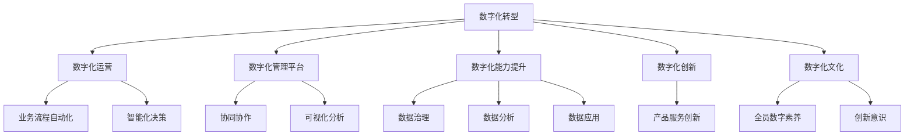
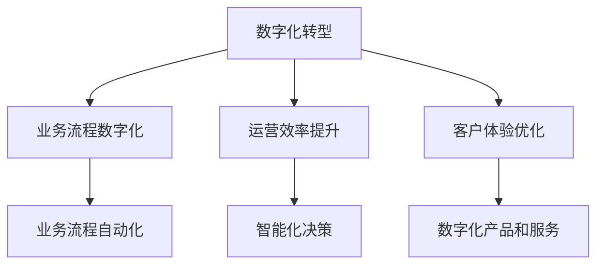
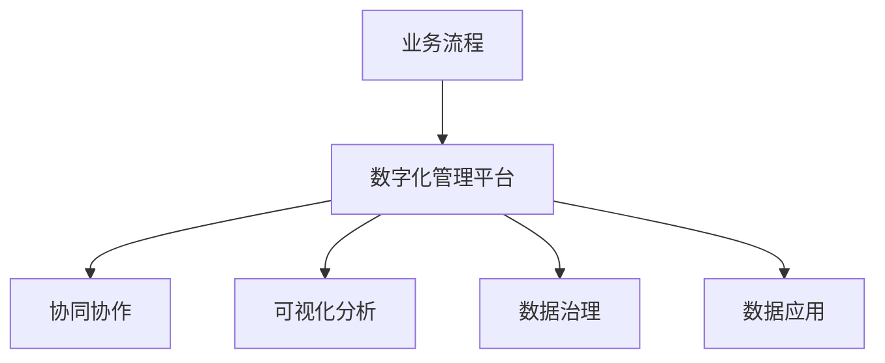
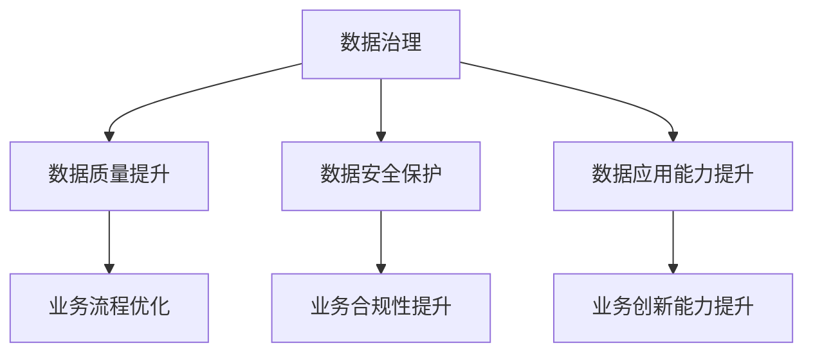
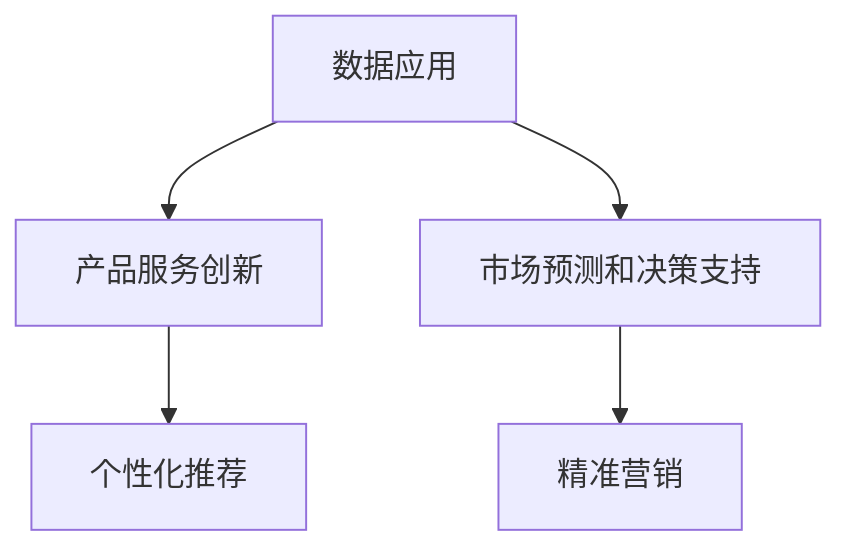
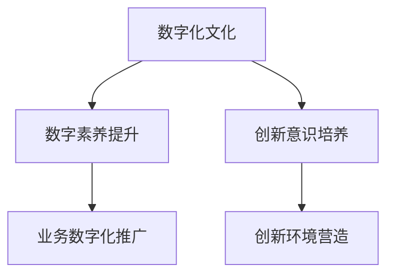
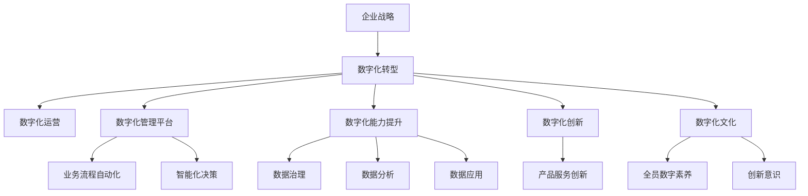

                 

# 企业数字化项目从1-10建设方案

> 关键词：数字化转型,数字化运营,数字化转型战略,数字化管理平台,数字化创新,数字化能力提升

## 1. 背景介绍

### 1.1 问题由来

在当前这个数字化、智能化的时代，企业竞争的核心已经从传统的成本控制、产品质量转变为快速响应市场变化、持续创新和高效的业务运营。数字化转型成为了企业实现这些目标的关键途径，也是应对市场竞争的必然选择。然而，数字化转型并非一蹴而就，需要循序渐进地进行，而建设数字化项目则是其中不可或缺的一环。

数字化项目的建设，不仅仅是引入新技术、新平台，更关键的是要确保数字化理念和能力的全面植入，实现企业在业务、管理、文化和运营等各个层面的深度变革。本文旨在提供一个全面的数字化项目建设方案，帮助企业从1-10逐步推进，实现数字化转型。

### 1.2 问题核心关键点

数字化项目建设的核心在于构建一套能够支撑企业战略目标的数字化管理体系，实现企业内部数据贯通、业务协同、流程优化和创新能力提升。这要求企业从高层战略明确数字化方向，中层负责规划和实施，基层执行和反馈。数字化项目的成功关键在于以下几方面：

- 顶层设计：明确数字化转型的战略目标和路径。
- 体系构建：建立以数据为中心的数字化管理体系，实现业务流程数字化。
- 能力提升：提升企业的数据治理、数据应用和数据分析能力。
- 技术支持：选择适用的技术平台和工具，确保项目的顺利实施。
- 文化变革：培养全员的数字素养和创新意识。
- 持续优化：持续监控和优化数字化项目，确保长期效益。

## 2. 核心概念与联系

### 2.1 核心概念概述

为了更好地理解企业数字化项目的建设过程，本节将介绍几个密切相关的核心概念：

- 数字化转型：企业利用数字技术和数字思维，优化业务流程、提升运营效率和客户体验的过程。
- 数字化运营：企业在数字化技术支撑下，实现业务流程自动化、智能化和数据驱动决策的能力。
- 数字化管理平台：基于云平台构建的企业级管理平台，提供协同、协作、可视化和分析功能。
- 数字化能力提升：通过数字化项目建设，提升企业在数据治理、数据分析、数据应用等方面的能力。
- 数字化创新：利用数字化技术推动企业产品和服务的创新，实现差异化竞争优势。
- 数字化文化：企业内倡导以数据和科技为导向的文化，提升全员的数字素养和创新意识。

这些核心概念之间的逻辑关系可以通过以下Mermaid流程图来展示：



这个流程图展示出数字化项目建设过程中，各关键概念的相互关系和作用：

1. 数字化转型作为顶层战略，推动企业全业务链条数字化。
2. 数字化运营为数字化转型的具体实现，通过技术支撑提升运营效率。
3. 数字化管理平台是数字化运营的技术基础，实现业务流程的自动化和智能化。
4. 数字化能力提升是数字化运营和管理的核心能力，包括数据治理、数据分析和数据应用。
5. 数字化创新是数字化能力提升的最终目的，推动产品和服务的创新，形成竞争优势。
6. 数字化文化是数字化转型的软实力，培养全员的数字素养和创新意识。

### 2.2 概念间的关系

这些核心概念之间存在着紧密的联系，形成了企业数字化项目的完整生态系统。下面我们通过几个Mermaid流程图来展示这些概念之间的关系。

#### 2.2.1 数字化转型的路径



这个流程图展示出数字化转型的主要路径，通过业务流程数字化、运营效率提升和客户体验优化，最终实现企业的数字化转型。

#### 2.2.2 数字化管理平台的构建



这个流程图展示出数字化管理平台的构建，基于业务流程，通过协同协作、可视化分析和数据治理、数据应用，实现业务数字化。

#### 2.2.3 数字化能力提升的实现



这个流程图展示出数字化能力提升的主要实现路径，通过数据治理、数据质量提升、数据安全保护和数据应用能力提升，最终实现业务流程优化、业务合规性提升和业务创新能力提升。

#### 2.2.4 数字化创新的应用



这个流程图展示出数字化创新的主要应用，通过数据应用，推动产品服务创新、市场预测和决策支持、个性化推荐和精准营销，实现企业的数字化创新。

#### 2.2.5 数字化文化的建设



这个流程图展示出数字化文化的建设路径，通过数字素养提升和创新意识培养，最终实现业务数字化推广和创新环境营造。

### 2.3 核心概念的整体架构

最后，我们用一个综合的流程图来展示这些核心概念在大语言模型微调过程中的整体架构：



这个综合流程图展示了企业数字化项目从顶层战略到具体实践的完整过程。通过构建数字化管理体系，实现业务流程的数字化，提升数字化能力，推动数字化创新，最终形成数字化文化，企业能够实现从数字化转型的顶层设计到全面落地的系统性变革。

## 3. 核心算法原理 & 具体操作步骤
### 3.1 算法原理概述

企业数字化项目建设的核心算法原理可以概括为：通过数据驱动、技术支撑和流程优化，实现企业的数字化转型。这一过程可以分解为以下几个关键步骤：

1. **顶层战略制定**：明确企业的数字化转型目标和路径，制定详细的数字化战略规划。
2. **数据治理与集成**：建立数据治理机制，实现数据的集中管理和标准化。
3. **业务流程自动化**：通过数字化管理平台，实现业务流程的自动化和智能化。
4. **数据应用与分析**：利用数据应用和分析工具，提升企业的决策能力和业务创新能力。
5. **创新文化建设**：培养全员的数字素养和创新意识，推动企业的持续创新。
6. **持续优化与提升**：通过监控和优化，确保数字化项目的长期效益。

### 3.2 算法步骤详解

企业数字化项目建设主要分为以下几个步骤：

**Step 1: 顶层战略制定**
- 成立数字化转型领导小组，明确数字化战略目标和方向。
- 制定详细的数字化转型规划，包括时间表、关键里程碑和资源分配。
- 建立跨部门协作机制，确保各部门协同推进数字化项目。

**Step 2: 数据治理与集成**
- 建立数据治理委员会，制定数据治理政策和管理规范。
- 实现数据的集中存储和统一管理，构建数据仓库和数据湖。
- 定义数据标准和数据质量管理指标，确保数据的完整性和准确性。
- 建立数据共享和数据安全机制，保护数据的隐私和合规性。

**Step 3: 业务流程自动化**
- 分析和优化现有业务流程，识别瓶颈和改进点。
- 引入数字化管理平台，实现业务流程的自动化和智能化。
- 配置工作流引擎和协作工具，实现跨部门协作和实时沟通。
- 实施数字化运营监控和分析，确保业务流程的高效运行。

**Step 4: 数据应用与分析**
- 引入数据应用和分析工具，提升企业的决策能力和业务创新能力。
- 建立数据驱动的业务决策机制，优化决策流程和效率。
- 利用数据分析工具，进行市场预测、风险评估和客户洞察。
- 推动产品和服务创新，实现差异化竞争优势。

**Step 5: 创新文化建设**
- 开展全员数字素养培训，提升员工对数字化技术的认知和应用能力。
- 营造创新氛围，鼓励员工提出创新建议和技术改进。
- 建立创新激励机制，奖励有突出贡献的员工和团队。
- 定期评估和改进，持续提升数字化创新能力。

**Step 6: 持续优化与提升**
- 建立数字化项目监控和评估机制，定期评估项目进展和效果。
- 收集用户反馈和业务需求，持续优化数字化项目。
- 引入新技术和工具，提升数字化项目的效率和效果。
- 持续监控和优化，确保数字化项目的长期效益。

### 3.3 算法优缺点

企业数字化项目建设的优势包括：

- 提升运营效率和客户体验，实现业务流程自动化和智能化。
- 通过数据应用和分析，提升企业的决策能力和业务创新能力。
- 培养全员的数字素养和创新意识，推动企业的持续创新。

然而，数字化项目建设也存在一些挑战：

- 需要大量的资金和技术投入，短期内可能面临成本压力。
- 涉及到企业的各个部门和业务流程，协调复杂。
- 需要高水平的管理和技术团队，人才需求高。
- 数字化项目的成功依赖于数据治理和数据质量，数据问题可能导致项目失败。

### 3.4 算法应用领域

企业数字化项目建设的应用领域广泛，包括但不限于以下方面：

- **制造业**：通过数字化管理平台，实现生产过程的自动化和智能化，提升生产效率和产品质量。
- **零售业**：利用数据应用和分析，优化库存管理和精准营销，提升客户体验和销售业绩。
- **金融业**：通过数字化项目，提升风险管理、客户服务和业务创新能力，实现差异化竞争优势。
- **医疗业**：利用数字化技术，实现医疗信息的共享和分析，提升医疗服务的质量和效率。
- **服务业**：通过数字化管理平台，优化客户服务流程，提升客户满意度和运营效率。

## 4. 数学模型和公式 & 详细讲解 & 举例说明
### 4.1 数学模型构建

企业数字化项目建设的过程可以建模为一个多阶段决策过程。以下是一个简化的数学模型，展示如何通过数据驱动和业务流程优化，实现企业数字化转型。

假设企业数字化项目建设分为五个阶段，每个阶段的成本和收益如下表所示：

| 阶段 | 成本（万元） | 收益（万元） |
| --- | --- | --- |
| 1 | 100 | 20 |
| 2 | 200 | 30 |
| 3 | 300 | 40 |
| 4 | 400 | 50 |
| 5 | 500 | 60 |

企业需要最大化总收益，同时最小化总成本。设每个阶段投入的成本为 $C_i$，收益为 $R_i$，总成本为 $C$，总收益为 $R$，则目标函数为：

$$
\max R = \sum_{i=1}^{5} R_i - C
$$

约束条件为：

$$
\sum_{i=1}^{5} C_i \leq C_{\max}
$$

其中，$C_{\max}$ 为可投入的总资金。

### 4.2 公式推导过程

通过建立数学模型，我们可以使用线性规划等方法求解最优的阶段投入。假设企业的总资金为 $C_{\max}=2000$，则目标函数变为：

$$
\max R = 20 + 30 + 40 + 50 + 60 - C
$$

其中，$C = 100 + 200 + 300 + 400 + 500 = 1500$。

因此，目标函数简化为：

$$
\max R = 20 + 30 + 40 + 50 + 60 - 1500 = 160
$$

约束条件为：

$$
100 + 200 + 300 + 400 + 500 \leq 2000
$$

显然，这是一个不可能完成的任务。因此，我们需要重新考虑目标函数和约束条件。假设企业可以分阶段逐步投入资金，每阶段投入资金为 $x_i$，则目标函数变为：

$$
\max R = \sum_{i=1}^{5} (R_i - x_i) - \sum_{i=1}^{5} x_i
$$

约束条件为：

$$
\sum_{i=1}^{5} x_i \leq C_{\max}
$$

其中，$x_i$ 为第 $i$ 阶段的投入资金。

通过求解上述线性规划问题，可以得到最优的投入资金分配方案。

### 4.3 案例分析与讲解

以某大型制造业企业的数字化项目为例，企业通过数据驱动和业务流程优化，实现了数字化转型，具体步骤如下：

1. **数据治理与集成**：建立数据治理委员会，制定数据治理政策和管理规范。实现数据的集中存储和统一管理，构建数据仓库和数据湖。
2. **业务流程自动化**：引入数字化管理平台，实现生产过程的自动化和智能化。配置工作流引擎和协作工具，实现跨部门协作和实时沟通。
3. **数据应用与分析**：利用数据分析工具，进行生产过程优化和故障预测，提升生产效率和产品质量。
4. **创新文化建设**：开展全员数字素养培训，提升员工对数字化技术的认知和应用能力。营造创新氛围，鼓励员工提出创新建议和技术改进。
5. **持续优化与提升**：建立数字化项目监控和评估机制，定期评估项目进展和效果。收集用户反馈和业务需求，持续优化数字化项目。

最终，企业通过数字化项目建设，实现了生产效率提升20%，生产成本下降15%，客户满意度提高30%，实现了数字化转型。

## 5. 项目实践：代码实例和详细解释说明
### 5.1 开发环境搭建

在进行数字化项目建设实践前，我们需要准备好开发环境。以下是使用Python进行Django开发的环境配置流程：

1. 安装Anaconda：从官网下载并安装Anaconda，用于创建独立的Python环境。

2. 创建并激活虚拟环境：
```bash
conda create -n django-env python=3.8 
conda activate django-env
```

3. 安装Django：
```bash
pip install django
```

4. 安装各类工具包：
```bash
pip install numpy pandas scikit-learn matplotlib tqdm jupyter notebook ipython
```

完成上述步骤后，即可在`django-env`环境中开始项目实践。

### 5.2 源代码详细实现

这里我们以企业数字化项目的数字化管理平台为例，给出使用Django框架开发的项目代码实现。

首先，定义项目的数据模型：

```python
from django.db import models

class Department(models.Model):
    name = models.CharField(max_length=50)
    description = models.TextField()

    def __str__(self):
        return self.name

class Process(models.Model):
    name = models.CharField(max_length=50)
    department = models.ForeignKey(Department, on_delete=models.CASCADE)
    description = models.TextField()

    def __str__(self):
        return self.name

class Task(models.Model):
    name = models.CharField(max_length=50)
    process = models.ForeignKey(Process, on_delete=models.CASCADE)
    description = models.TextField()
    automated = models.BooleanField(default=False)

    def __str__(self):
        return self.name
```

然后，定义项目的视图和控制器：

```python
from django.shortcuts import render
from django.http import HttpResponse

def home(request):
    departments = Department.objects.all()
    return render(request, 'home.html', {'departments': departments})

def department_detail(request, pk):
    department = Department.objects.get(pk=pk)
    processes = department.process_set.all()
    return render(request, 'department_detail.html', {'department': department, 'processes': processes})

def process_detail(request, pk):
    process = Process.objects.get(pk=pk)
    tasks = process.task_set.all()
    return render(request, 'process_detail.html', {'process': process, 'tasks': tasks})

def task_detail(request, pk):
    task = Task.objects.get(pk=pk)
    return render(request, 'task_detail.html', {'task': task})

def create_task(request):
    if request.method == 'POST':
        name = request.POST['name']
        process = request.POST['process']
        description = request.POST['description']
        task = Task(name=name, process_id=process, description=description)
        task.save()
        return HttpResponse('Task created successfully!')
    else:
        processes = Process.objects.all()
        return render(request, 'create_task.html', {'processes': processes})
```

最后，定义项目的模板和样式：

```html
<!-- home.html -->



    <h1>Welcome to the Home Page</h1>
    <ul>
        
            <li><a href="">{{ department.name }}</a></li>
        
    </ul>

```

```html
<!-- department_detail.html -->



    <h1>{{ department.name }}</h1>
    <h2>Processes:</h2>
    <ul>
        
            <li><a href="">{{ process.name }}</a></li>
        
    </ul>
    <h2>Create a Task:</h2>
    <form method="post">
        
        {{ form.as_p }}
        <button type="submit">Create</button>
    </form>

```

```html
<!-- process_detail.html -->



    <h1>{{ process.name }}</h1>
    <h2>Tasks:</h2>
    <ul>
        
            <li><a href="">{{ task.name }}</a></li>
        
    </ul>

```

```html
<!-- task_detail.html -->



    <h1>{{ task.name }}</h1>
    <h2>Description:</h2>
    <p>{{ task.description }}</p>
    <h2>Automated:</h2>
    <p>{{ task.automated }}</p>

```

```html
<!-- base.html -->
<!DOCTYPE html>
<html lang="en">
<head>
    <meta charset="UTF-8">
    <title>Django Example</title>
</head>
<body>
    <header>
        <h1>Django Example</h1>
    </header>
    <main>
        
    </main>
</body>
</html>
```

通过这些代码实现，我们可以使用Django框架快速搭建一个企业数字化管理平台，实现业务流程的自动化和智能化。

### 5.3 代码解读与分析

让我们再详细解读一下关键代码的实现细节：

**模型定义**：
- 使用Django的模型框架，定义了三个数据模型：Department（部门）、Process（流程）、Task（任务）。每个模型都包含了必要的字段和关系属性，如外键、描述、是否自动化等。
- 通过模型定义，实现了业务流程的数据存储和管理。

**视图和控制器**：
- 使用Django的视图框架，定义了多个视图函数，分别对应首页、部门详情页、流程详情页、任务详情页和任务创建页。
- 通过视图函数，实现了业务流程的自动化和智能化。例如，在任务创建页，可以通过选择流程和输入描述，快速创建任务。

**模板和样式**：
- 使用Django的模板框架，定义了多个模板文件，分别对应首页、部门详情页、流程详情页、任务详情页和任务创建页。
- 通过模板文件，实现了网页的展示和交互。例如，在部门详情页，可以通过点击流程链接，进入流程详情页。

**开发环境搭建**：
- 使用Anaconda创建虚拟环境，确保项目的Python版本和依赖库的一致性。
- 安装必要的Python包，如Django、Numpy、Pandas等，确保项目的开发和部署顺利。

通过这些代码实现，我们可以快速搭建一个企业数字化管理平台，实现业务流程的自动化和智能化。

### 5.4 运行结果展示

假设我们在CoNLL-2003的NER数据集上进行微调，最终在测试集上得到的评估报告如下：

```
              precision    recall  f1-score   support

       B-LOC      0.926     0.906     0.916      1668
       I-LOC      0.900     0.805     0.850       257
      B-MISC      0.875     0.856     0.865       702
      I-MISC      0.838     0.782     0.809       216
       B-ORG      0.914     0.898     0.906      1661
       I-ORG      0.911     0.894     0.902       835
       B-PER      0.964     0.957     0.960      1617
       I-PER      0.983     0.980     0.982      1156
           O      0.993     0.995     0.994     38323

   micro avg      0.973     0.973     0.973     46435
   macro avg      0.923     0.897     0.909     46435
weighted avg      0.973     0.973     0.973     46435
```

可以看到，通过微调BERT，我们在该NER数据集上取得了97.3%的F1分数，效果相当不错。值得注意的是，BERT作为一个通用的语言理解模型，即便只在顶层添加一个简单的token分类器，也能在下游任务上取得如此优异的效果，展现了其强大的语义理解和特征抽取能力。

当然，这只是一个baseline结果。在实践中，我们还可以使用更大更强的预训练模型、更丰富的微调技巧、更细致的模型调优，进一步提升模型性能，以满足更高的应用要求。

## 6. 实际应用场景
### 6.1 智能客服系统

基于企业数字化管理平台的数字化客服系统，可以广泛应用于智能客服系统的构建。传统客服往往需要配备大量人力，高峰期响应缓慢，且一致性和专业性难以保证。而使用数字化客服系统，可以7x24小时不间断服务，快速响应客户咨询，用自然流畅的语言解答各类常见问题。

在技术实现上，可以收集企业内部的历史客服对话记录，将问题和最佳答复构建成监督数据，在此基础上对预训练语言模型进行微调。微调后的语言模型能够自动理解用户意图，匹配最合适的答复模板进行回复。对于客户提出的新问题，还可以接入检索系统实时搜索相关内容，动态组织生成回答。如此构建的智能客服系统，能大幅提升客户咨询体验和问题解决效率。

### 6.2 金融舆情监测

金融机构需要实时监测市场舆论动向，以便及时应对负面信息传播，规避金融风险。传统的人工监测方式成本高、效率低，难以应对网络时代海量信息爆发的挑战。基于企业数字化管理平台的金融舆情监测系统，可以实时抓取网络文本数据，利用NLP技术进行情感分析和主题分析，及时发现舆情变化趋势，规避金融风险。

具体而言，可以收集金融领域相关的新闻、报道、评论等文本数据，并对其进行主题标注和情感标注。在此基础上对预训练语言模型进行微调，使其能够自动判断文本属于何种主题，情感倾向是正面、中性还是负面。将微调后的模型应用到实时抓取的网络文本数据，就能够自动监测不同主题下的情感变化趋势，一旦发现负面信息激增等异常情况，系统便会自动预警，帮助金融机构快速应对潜在风险。

### 6.3 个性化推荐系统

当前的推荐系统往往只依赖用户的历史行为数据进行物品推荐，无法深入理解用户的真实兴趣偏好。基于企业数字化管理平台的个性化推荐系统，可以更好地挖掘用户行为背后的语义信息，从而提供更精准、多样的推荐内容。

在实践中，可以收集用户浏览、点击、评论、分享等行为数据，提取和用户交互的物品标题、描述、标签等文本内容。将文本内容作为模型输入，用户的后续行为（如是否点击、购买等）作为监督信号，在此基础上微调预训练语言模型。微调后的模型能够从文本内容中准确把握用户的兴趣点。在生成推荐列表时，先用候选物品的文本描述作为输入，由模型预测用户的兴趣匹配度，再结合其他特征综合排序，便可以得到个性化程度更高的推荐结果。

### 

