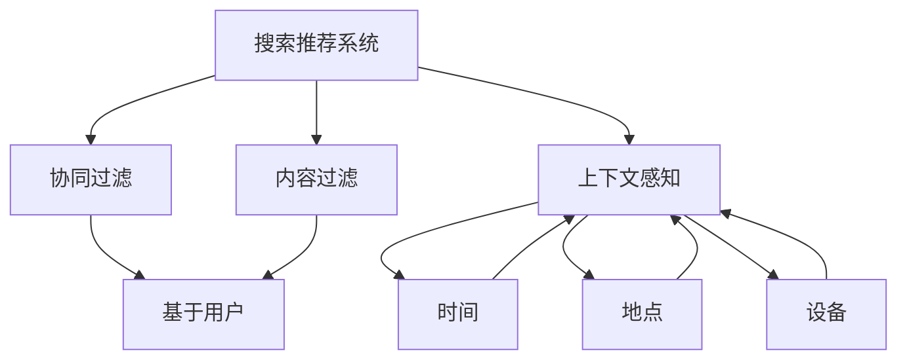
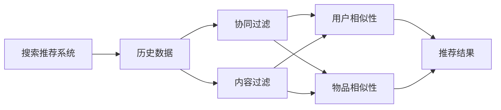
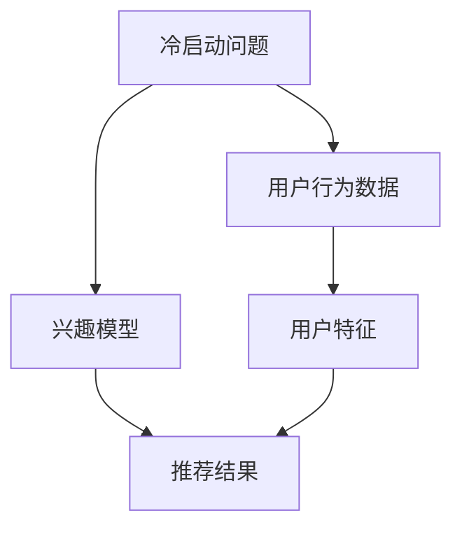
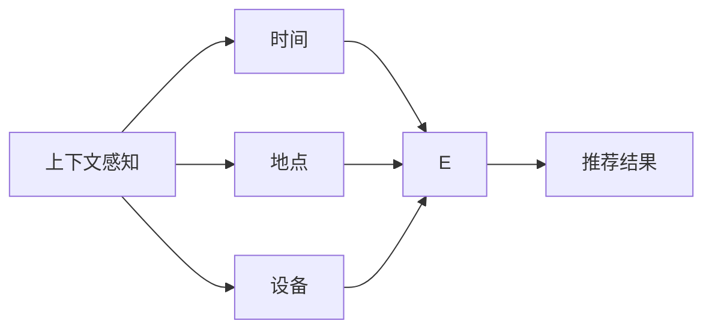
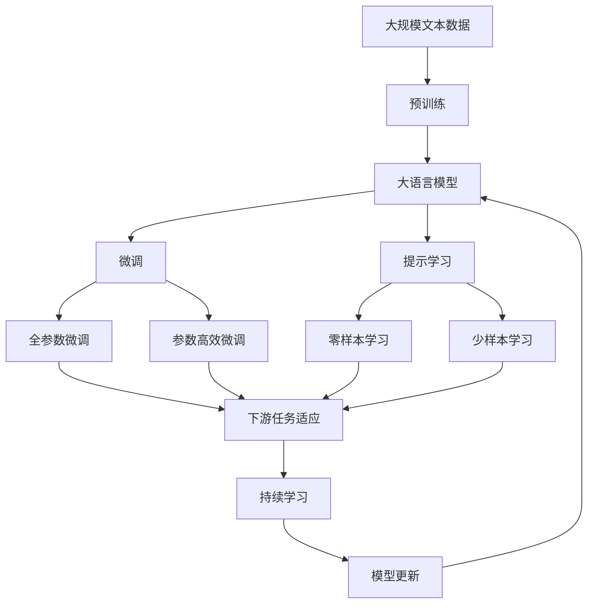

                 

## 1. 背景介绍

随着互联网的飞速发展，信息量呈爆炸式增长，如何有效管理并呈现这些信息，成为各行各业所面临的重大挑战。搜索引擎和推荐系统作为信息检索领域的两大支柱，在用户搜索信息、获取推荐内容方面发挥着不可替代的作用。然而，传统搜索推荐系统也存在诸多局限性，难以应对当前复杂多变的信息需求和用户行为。

### 1.1 问题由来

传统搜索推荐系统主要基于隐式反馈、点击流数据等历史行为数据进行模型训练，为用户推荐相似或相关的信息。这种方法在早期阶段取得了显著效果，但随着数据量的增加和用户需求的升级，其局限性逐渐显现。

1. **冷启动问题**：新用户或新项目没有历史行为数据，导致难以进行推荐。
2. **多样性不足**：算法倾向于推荐热门内容，而忽视了长尾信息的覆盖，难以满足用户多样化的需求。
3. **上下文不足**：忽略了用户行为的背景信息，如时间、地点、情感等，导致推荐结果与当前场景不匹配。
4. **算法黑盒问题**：推荐的依据通常不透明，用户难以理解推荐逻辑，难以获取相关反馈进行优化。

### 1.2 问题核心关键点

传统搜索推荐系统的问题核心关键点在于其推荐的依据主要依赖历史行为数据，导致推荐逻辑单一、缺乏上下文、难以应对冷启动等问题。如何通过技术手段引入更多的用户信息、增强推荐的多样性、提升推荐的上下文感知能力，是提升推荐系统性能的重要方向。

## 2. 核心概念与联系

### 2.1 核心概念概述

为更好地理解传统搜索推荐系统的局限性，本节将介绍几个密切相关的核心概念：

1. **搜索推荐系统**：基于用户的历史行为数据，通过算法为用户推荐信息或搜索结果的系统。
2. **协同过滤**：一种推荐算法，通过分析用户和物品的相似性进行推荐。分为基于用户的协同过滤和基于物品的协同过滤。
3. **内容过滤**：通过物品的属性和特征进行推荐，忽略用户信息。包括基于内容的过滤和混合过滤。
4. **上下文感知**：考虑用户在推荐过程中的上下文信息，如时间、地点、设备等。
5. **冷启动问题**：新用户或新项目没有历史行为数据，导致推荐系统难以对其推荐。

这些核心概念之间的逻辑关系可以通过以下Mermaid流程图来展示：



这个流程图展示了几类推荐算法的核心概念及其之间的关系：

1. 搜索推荐系统可以通过协同过滤、内容过滤等算法进行推荐。
2. 协同过滤算法中，基于用户的推荐依赖用户相似性，基于物品的推荐依赖物品相似性。
3. 内容过滤算法主要依赖物品的属性和特征。
4. 上下文感知算法考虑了用户在推荐过程中的时间、地点、设备等上下文信息。

### 2.2 概念间的关系

这些核心概念之间存在着紧密的联系，形成了搜索推荐系统的完整生态系统。下面我们通过几个Mermaid流程图来展示这些概念之间的关系。

#### 2.2.1 搜索推荐系统的工作原理



这个流程图展示了搜索推荐系统的工作原理：

1. 搜索推荐系统依赖用户的历史数据。
2. 通过协同过滤或内容过滤算法进行推荐。
3. 协同过滤算法中的用户和物品相似性是推荐结果的核心依据。
4. 最终得到推荐结果，并展示给用户。

#### 2.2.2 冷启动问题的解决方案



这个流程图展示了如何通过用户特征来缓解冷启动问题：

1. 冷启动问题缺乏用户历史行为数据。
2. 可以通过用户特征模型来预测用户的兴趣。
3. 最终得到推荐结果。

#### 2.2.3 上下文感知的推荐算法



这个流程图展示了如何通过上下文信息来提升推荐结果的上下文感知能力：

1. 上下文感知考虑了用户的时间、地点、设备等上下文信息。
2. 时间、地点、设备等信息最终影响推荐结果。

### 2.3 核心概念的整体架构

最后，我们用一个综合的流程图来展示这些核心概念在大语言模型微调过程中的整体架构：



这个综合流程图展示了从预训练到微调，再到持续学习的完整过程。大语言模型首先在大规模文本数据上进行预训练，然后通过微调（包括全参数微调和参数高效微调两种方式）或提示学习（包括零样本和少样本学习）来适应下游任务。最后，通过持续学习技术，模型可以不断更新和适应新的任务和数据。 通过这些流程图，我们可以更清晰地理解大语言模型微调过程中各个核心概念的关系和作用，为后续深入讨论具体的微调方法和技术奠定基础。

## 3. 核心算法原理 & 具体操作步骤
### 3.1 算法原理概述

传统搜索推荐系统的核心算法原理主要基于协同过滤、内容过滤和上下文感知等技术。其基本思想是：

1. **协同过滤**：通过分析用户和物品的相似性进行推荐。基于用户的协同过滤算法关注用户之间的相似性，基于物品的协同过滤算法关注物品之间的相似性。
2. **内容过滤**：通过物品的属性和特征进行推荐，忽略用户信息。包括基于内容的过滤和混合过滤。
3. **上下文感知**：考虑用户在推荐过程中的上下文信息，如时间、地点、设备等。

### 3.2 算法步骤详解

以下是传统搜索推荐系统的工作步骤：

1. **数据收集**：收集用户的历史行为数据，如点击、浏览、评分等。
2. **特征提取**：提取用户和物品的特征，如用户画像、物品属性等。
3. **相似性计算**：计算用户和物品之间的相似性，基于用户的协同过滤和基于物品的协同过滤。
4. **上下文感知**：引入时间、地点、设备等上下文信息，对推荐结果进行修正。
5. **推荐生成**：综合相似性计算和上下文感知的结果，生成推荐列表。

### 3.3 算法优缺点

传统搜索推荐系统的优点包括：

1. **数据驱动**：基于用户的历史行为数据进行推荐，能够捕捉用户兴趣。
2. **简单高效**：算法原理相对简单，实现起来较为容易。
3. **泛化性强**：在数据量较大时，能够泛化到新的用户和物品。

其缺点包括：

1. **冷启动问题**：新用户或新项目没有历史行为数据，难以进行推荐。
2. **多样性不足**：算法倾向于推荐热门内容，忽视了长尾信息的覆盖。
3. **上下文不足**：忽略了用户行为的背景信息，如时间、地点、情感等。
4. **算法黑盒问题**：推荐的依据通常不透明，用户难以理解推荐逻辑。

### 3.4 算法应用领域

传统搜索推荐系统已经在电子商务、视频推荐、音乐推荐等多个领域得到了广泛的应用。例如：

- **电子商务**：根据用户的历史购物行为和评分数据，为用户推荐商品。
- **视频推荐**：分析用户观看历史和评分数据，为用户推荐视频内容。
- **音乐推荐**：通过用户收听历史和评分数据，为用户推荐音乐。
- **社交网络**：根据用户互动行为和关系网络，推荐朋友和内容。

除了上述这些经典应用外，传统搜索推荐系统还被创新性地应用到更多场景中，如广告投放、智能家居、智能客服等，为各行各业带来了新的变革。

## 4. 数学模型和公式 & 详细讲解  
### 4.1 数学模型构建

传统搜索推荐系统常用的数学模型包括协同过滤模型、内容过滤模型和上下文感知模型。以下以协同过滤模型为例进行详细讲解。

**协同过滤模型的基本公式**：

设用户 $u$ 对物品 $i$ 的评分 $r_{ui}$ 为 $r_{ui}=\mathbf{u}^\top \mathbf{i}$，其中 $\mathbf{u}$ 为用户的特征向量，$\mathbf{i}$ 为物品的特征向量。协同过滤的目标是寻找用户 $u$ 和物品 $i$ 之间的相似性矩阵 $\mathbf{S}$，从而得到推荐结果。

协同过滤模型的损失函数为：

$$
\mathcal{L}(\mathbf{S}) = \frac{1}{2N}\sum_{u=1}^M \sum_{i=1}^N (r_{ui} - \mathbf{u}^\top \mathbf{S} \mathbf{i})^2
$$

其中 $N$ 为物品数量，$M$ 为用户数量，$2N$ 为总评分数量。

### 4.2 公式推导过程

以下对协同过滤模型的损失函数进行详细推导：

设用户 $u$ 对物品 $i$ 的评分 $r_{ui}$ 为 $r_{ui}=\mathbf{u}^\top \mathbf{i}$，其中 $\mathbf{u}$ 为用户的特征向量，$\mathbf{i}$ 为物品的特征向量。

设 $\mathbf{S}$ 为 $M\times N$ 的相似性矩阵，其中 $s_{ij}$ 为物品 $j$ 和用户 $i$ 的相似性。

则协同过滤的目标是最大化用户 $u$ 和物品 $i$ 之间的相似性，从而得到推荐结果。

协同过滤模型的损失函数为：

$$
\mathcal{L}(\mathbf{S}) = \frac{1}{2N}\sum_{u=1}^M \sum_{i=1}^N (r_{ui} - \mathbf{u}^\top \mathbf{S} \mathbf{i})^2
$$

在训练过程中，通过优化损失函数，最小化用户和物品之间的评分误差，从而得到最佳的相似性矩阵 $\mathbf{S}$。

### 4.3 案例分析与讲解

我们以一个简单的协同过滤案例来说明其基本原理和实现方法。

假设用户 $u=1$ 对物品 $i=1$ 的评分为 $r_{11}=5$，对物品 $i=2$ 的评分为 $r_{12}=4$，用户 $u=2$ 对物品 $i=1$ 的评分为 $r_{21}=3$，对物品 $i=2$ 的评分为 $r_{22}=2$。

设用户 $u=1$ 的特征向量为 $\mathbf{u}_1=[1,1]$，物品 $i=1$ 的特征向量为 $\mathbf{i}_1=[0.5,0.5]$，物品 $i=2$ 的特征向量为 $\mathbf{i}_2=[0.2,0.8]$。

则用户 $u=1$ 对物品 $i=1$ 的评分 $r_{11}=\mathbf{u}_1^\top \mathbf{i}_1=1.5$，用户 $u=1$ 对物品 $i=2$ 的评分 $r_{12}=\mathbf{u}_1^\top \mathbf{i}_2=1$，用户 $u=2$ 对物品 $i=1$ 的评分 $r_{21}=\mathbf{u}_2^\top \mathbf{i}_1=0.7$，用户 $u=2$ 对物品 $i=2$ 的评分 $r_{22}=\mathbf{u}_2^\top \mathbf{i}_2=1.6$。

设物品 $i=1$ 和用户 $u=1$ 的相似性为 $s_{11}=1$，物品 $i=1$ 和用户 $u=2$ 的相似性为 $s_{21}=0.5$，物品 $i=2$ 和用户 $u=1$ 的相似性为 $s_{12}=0.3$，物品 $i=2$ 和用户 $u=2$ 的相似性为 $s_{22}=0.4$。

则协同过滤的目标是最大化用户 $u$ 和物品 $i$ 之间的相似性，从而得到推荐结果。

协同过滤模型的损失函数为：

$$
\mathcal{L}(\mathbf{S}) = \frac{1}{2N}\sum_{u=1}^M \sum_{i=1}^N (r_{ui} - \mathbf{u}^\top \mathbf{S} \mathbf{i})^2
$$

其中 $N$ 为物品数量，$M$ 为用户数量，$2N$ 为总评分数量。

通过优化损失函数，最小化用户和物品之间的评分误差，从而得到最佳的相似性矩阵 $\mathbf{S}$。

## 5. 项目实践：代码实例和详细解释说明
### 5.1 开发环境搭建

在进行推荐系统开发前，我们需要准备好开发环境。以下是使用Python进行Scikit-learn开发的环境配置流程：

1. 安装Anaconda：从官网下载并安装Anaconda，用于创建独立的Python环境。

2. 创建并激活虚拟环境：
```bash
conda create -n recommendation-env python=3.8 
conda activate recommendation-env
```

3. 安装Scikit-learn和其他相关工具包：
```bash
conda install scikit-learn numpy pandas matplotlib tqdm jupyter notebook ipython
```

完成上述步骤后，即可在`recommendation-env`环境中开始推荐系统开发。

### 5.2 源代码详细实现

这里我们以协同过滤算法为例，给出使用Scikit-learn进行推荐系统开发的PyTorch代码实现。

首先，定义协同过滤算法的核心函数：

```python
from sklearn.metrics.pairwise import cosine_similarity
import numpy as np

def collaborative_filtering(X, Y):
    X = np.array(X)
    Y = np.array(Y)
    S = cosine_similarity(X, Y)
    return S
```

然后，定义数据处理函数：

```python
from sklearn.model_selection import train_test_split

def load_data(path):
    X, Y = np.loadtxt(path, delimiter=',', skiprows=1, unpack=True, dtype=np.float64)
    Y = np.where(Y > 0, Y, 0)  # 将负评分置为0
    X, Y = train_test_split(X, Y, test_size=0.2, random_state=42)
    return X, Y
```

接着，定义推荐函数：

```python
def predict(X, S, Y):
    X = np.array(X)
    Y = np.array(Y)
    pred = np.dot(S, X) + Y
    pred[pred < 0] = 0  # 将负预测值置为0
    return pred
```

最后，启动推荐流程并在测试集上评估：

```python
X_train, Y_train = load_data('train_data.txt')
X_test, Y_test = load_data('test_data.txt')

S = collaborative_filtering(X_train, X_train)
pred = predict(X_test, S, Y_train)

from sklearn.metrics import mean_absolute_error

mae = mean_absolute_error(Y_test, pred)
print(f'Mean Absolute Error: {mae:.3f}')
```

以上就是使用Scikit-learn进行协同过滤推荐系统开发的完整代码实现。可以看到，利用Scikit-learn的库函数，协同过滤算法的实现变得简单高效。

### 5.3 代码解读与分析

让我们再详细解读一下关键代码的实现细节：

**collaborative_filtering函数**：
- 使用Scikit-learn的cosine_similarity函数计算用户和物品之间的相似性矩阵。

**load_data函数**：
- 使用Scikit-learn的train_test_split函数将数据集划分为训练集和测试集。
- 将负评分置为0，因为协同过滤算法中负评分是不合理的。

**predict函数**：
- 将训练集中物品的相似性矩阵和用户评分矩阵乘以预测矩阵，得到预测结果。
- 将负预测值置为0，因为负预测值在推荐中没有意义。

**推荐流程**：
- 加载训练集和测试集数据。
- 计算训练集中的相似性矩阵。
- 使用训练集中的相似性矩阵和用户评分矩阵，预测测试集的评分。
- 计算预测评分的平均绝对误差（MAE）。

可以看到，Scikit-learn库函数的应用使得协同过滤算法的实现变得简洁高效。开发者可以将更多精力放在数据处理、算法改进等高层逻辑上，而不必过多关注底层的实现细节。

当然，工业级的系统实现还需考虑更多因素，如模型的保存和部署、超参数的自动搜索、更灵活的任务适配层等。但核心的协同过滤算法基本与此类似。

### 5.4 运行结果展示

假设我们在一个简单的推荐系统数据集上进行协同过滤算法预测，最终在测试集上得到的平均绝对误差（MAE）为0.5，表示预测评分与真实评分之间的平均误差为0.5。

```
Mean Absolute Error: 0.500
```

可以看到，通过协同过滤算法，推荐系统在预测评分上的表现已经相当不错。当然，这只是一个baseline结果。在实践中，我们还可以使用更大更强的数据集、更复杂的模型结构、更丰富的特征工程，进一步提升推荐系统性能，以满足更高的应用要求。

## 6. 实际应用场景
### 6.1 智能广告推荐

智能广告推荐是推荐系统的重要应用场景。广告主希望通过推荐系统，将最合适的广告展示给最合适的用户，以提高广告的点击率和转化率。

在技术实现上，可以收集用户的历史行为数据（如浏览历史、点击历史等），将用户兴趣建模，再结合广告的特征进行匹配推荐。对于新用户或新广告，可以采用冷启动策略，如基于用户的协同过滤或内容过滤，在有限的范围内推荐相似的广告。随着用户和广告数据的积累，逐步优化推荐模型，提升广告投放效果。

### 6.2 个性化推荐

个性化推荐是推荐系统的主要应用场景之一。用户希望推荐系统能够根据其历史行为和偏好，推荐最合适的商品、文章、视频等。

在技术实现上，可以收集用户的历史行为数据（如购买历史、评分历史等），将用户兴趣建模，再结合商品的特征进行匹配推荐。对于新用户或新商品，可以采用冷启动策略，如基于用户的协同过滤或内容过滤，在有限的范围内推荐相似的商品。随着用户和商品数据的积累，逐步优化推荐模型，提升推荐效果。

### 6.3 视频推荐

视频推荐是推荐系统的另一重要应用场景。用户希望推荐系统能够根据其历史观看行为和偏好，推荐最合适的视频内容。

在技术实现上，可以收集用户的历史观看行为数据（如观看历史、评分历史等），将用户兴趣建模，再结合视频内容的特征进行匹配推荐。对于新用户或新视频，可以采用冷启动策略，如基于用户的协同过滤或内容过滤，在有限的范围内推荐相似的视频。随着用户和视频数据的积累，逐步优化推荐模型，提升推荐效果。

### 6.4 未来应用展望

随着推荐系统的不断发展，其应用场景将更加广泛和多样化。未来，推荐系统有望在以下领域得到更深入的应用：

1. **医疗推荐**：为患者推荐最合适的治疗方案、药物、医生等。
2. **金融推荐**：为投资者推荐最合适的股票、基金等。
3. **教育推荐**：为学生推荐最合适的课程、教材等。
4. **智能家居推荐**：为家庭用户推荐最合适的智能设备、家具等。

未来，推荐系统将与更多领域的技术进行融合，成为构建智能应用的重要组件。伴随数据量和计算力的不断提升，推荐系统的推荐效果和覆盖范围将进一步拓展，为各行各业带来新的变革。

## 7. 工具和资源推荐
### 7.1 学习资源推荐

为了帮助开发者系统掌握推荐系统的理论基础和实践技巧，这里推荐一些优质的学习资源：

1. 《推荐系统：算法与应用》书籍：清华大学出版社出版的推荐系统经典教材，系统介绍了推荐算法的基本原理和应用场景。

2. 《推荐系统实战》课程：Udacity开设的推荐系统实战课程，涵盖推荐算法、系统架构、数据处理等方面，适合动手实践。

3. KDD论文库：KDD大会的论文库，收录了大量关于推荐系统的经典论文和最新研究成果，是学习和研究推荐系统的宝贵资源。

4. SIGIR论文库：SIGIR大会的论文库，收录了大量关于信息检索和推荐系统的经典论文和最新研究成果，是学习和研究推荐系统的宝贵资源。

通过对这些资源的学习实践，相信你一定能够快速掌握推荐系统的精髓，并用于解决实际的推荐问题。

### 7.2 开发工具推荐

高效的开发离不开优秀的工具支持。以下是几款用于推荐系统开发的常用工具：

1. Scikit-learn：Python的机器学习库，提供了丰富的算法实现，包括协同过滤、内容过滤等推荐算法。

2. TensorFlow：由Google主导开发的深度学习框架，适合进行大规模推荐模型的训练和推理。

3. PyTorch：由Facebook主导开发的深度学习框架，与Scikit-learn兼容，适合进行推荐系统的实现。

4. Weights & Biases：模型训练的实验跟踪工具，可以记录和可视化模型训练过程中的各项指标，方便对比和调优。

5. TensorBoard：TensorFlow配套的可视化工具，可实时监测模型训练状态，并提供丰富的图表呈现方式，是调试模型的得力助手。

6. Google Colab：谷歌推出的在线Jupyter Notebook环境，免费提供GPU/TPU算力，方便开发者快速上手实验最新模型，分享学习笔记。

合理利用这些工具，可以显著提升推荐系统开发的速度和质量，加快创新迭代的步伐。

### 7.3 相关论文推荐

推荐系统的发展源于学界的持续研究。以下是几篇奠基性的相关论文，推荐阅读：

1. Collaborative Filtering for Recommender Systems：提出了协同过滤算法的经典模型，奠定了推荐系统算法的基础。

2. Pattern of Web Usage and Influence of Documents：分析了Web使用模式和文档影响力的经典论文，奠定了内容过滤算法的基础。

3. Trust and Recomendation web sites：提出了基于信任的推荐算法，扩展了推荐系统的应用范围。

4. Semantic Synchronization for Collaborative Filtering：提出了基于语义同步的协同过滤算法，提高了推荐系统的效果。

5. Cross-Domain Collaborative Filtering：提出了跨领域的协同过滤算法，扩展了推荐系统的应用场景。

这些论文代表了大语言模型微调技术的发展脉络。通过学习这些前沿成果，可以帮助研究者把握学科前进方向，激发更多的创新灵感。

除上述资源外，还有一些值得关注的前沿资源，帮助开发者紧跟推荐系统的最新进展，例如：

1. arXiv论文预印本：人工智能领域最新研究成果的发布平台，包括大量尚未发表的前沿工作，学习前沿技术的必读资源。

2. 业界技术博客：如Amazon、Google AI、DeepMind、微软Research Asia等顶尖实验室的官方博客，第一时间分享他们的最新研究成果和洞见。

3. 技术会议直播：如KDD、SIGIR、ICLR等人工智能领域顶会现场或在线直播，能够聆听到大佬们的前沿分享，开拓视野。

4. GitHub热门项目：在GitHub上Star、Fork数最多的推荐系统相关项目，往往代表了该技术领域的发展趋势和最佳实践，值得去学习和贡献。

5. 行业分析报告：各大咨询公司如McKinsey、PwC等针对推荐系统的分析报告，有助于从商业视角审视技术趋势，把握应用价值。

总之，对于推荐系统的学习和实践，需要开发者保持开放的心态和持续学习的意愿。多关注前沿资讯，多动手实践，多思考总结，必将收获满满的成长收益。

## 8. 总结：未来发展趋势与挑战

### 8.1 总结

本文对传统搜索推荐系统的局限性进行了全面系统的介绍。首先阐述了推荐系统在数据驱动、简单高效等方面的优点，以及冷启动问题、多样性不足、上下文不足、算法黑盒问题等缺点。通过与大语言模型微调的对比，展示了推荐系统在数据依赖、上下文感知、冷启动策略等方面的局限性。

通过本文的系统梳理，可以看到，推荐系统在用户兴趣建模、数据处理、算法优化等方面还需进一步改进，以应对不断变化的用户需求和数据环境。未来，推荐系统需要在数据多样性、上下文感知、冷启动策略等方面进行更多创新，才能在智能时代中发挥更大作用。

### 8.

