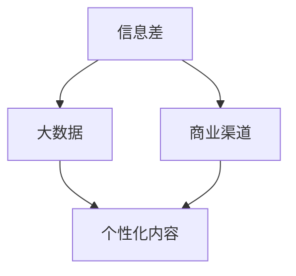
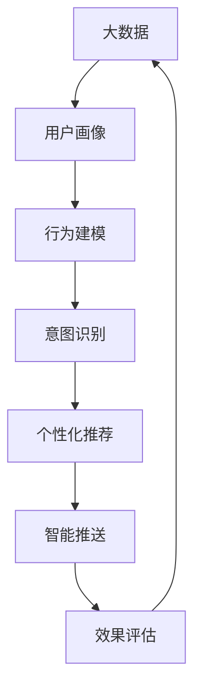

                 

# 信息差的商业渠道个性化：大数据如何优化渠道个性化

> 关键词：信息差,商业渠道,个性化,大数据,智能推荐

## 1. 背景介绍

### 1.1 问题由来
在当今数字化和信息化的时代，企业面临的商业环境日益复杂多变，市场竞争日趋激烈。为了在激烈的市场竞争中脱颖而出，企业需要精准掌握客户需求，制定有效的营销策略。传统基于人群的渠道推广方式，难以满足客户个性化需求，效果往往不尽人意。基于此，商业渠道个性化变得尤为重要。

### 1.2 问题核心关键点
商业渠道个性化是指在理解客户需求的基础上，为每个客户定制个性化的渠道推广内容。实现商业渠道个性化的关键在于如何通过大数据技术，深入挖掘客户行为数据和需求特征，并根据不同的客户特征，实现精准的渠道推送。

在实践中，商业渠道个性化面临的主要问题包括：
1. 客户需求的多样性和动态性，使得个性化内容难以准确把握。
2. 大数据量的存储和处理，对计算资源的要求较高。
3. 客户信息隐私保护，需要兼顾个性化需求和数据安全。
4. 个性化内容的实时生成和推送，对系统响应速度和稳定性有高要求。

### 1.3 问题研究意义
实现商业渠道个性化，对于提升客户体验、提高转化率、优化渠道投放效果等方面具有重要意义：

1. 提升客户体验：通过精准的个性化内容推送，满足客户即时需求，增强品牌好感度。
2. 提高转化率：个性化内容更贴近客户需求，减少客户决策时间，提高点击率、购买率等关键指标。
3. 优化渠道投放效果：精准把握客户特征，优化渠道投放策略，减少无效曝光和浪费，提升渠道效率。
4. 提供定制化服务：商业渠道个性化使企业能够根据客户偏好提供定制化的服务和产品，增强客户粘性。
5. 适应市场变化：个性化营销策略能够快速响应市场变化，把握客户需求，赢得市场先机。

## 2. 核心概念与联系

### 2.1 核心概念概述

商业渠道个性化涉及多个关键概念，包括信息差、商业渠道、个性化和大数据。理解这些概念及其内在联系，有助于全面把握商业渠道个性化的本质。

- **信息差**：指客户在决策过程中所掌握的信息与企业提供的信息之间的差异。信息差越大，客户的决策越难，企业推广效果越差。

- **商业渠道**：指企业向客户传递产品和服务信息的渠道，如社交媒体、搜索引擎、邮件、短信等。

- **个性化**：指根据客户的具体需求和特征，定制个性化的内容或产品。

- **大数据**：指在商业渠道中收集和分析的大量客户行为和交易数据。

这些概念相互联系，共同构成了商业渠道个性化的生态系统。通过大数据技术，企业可以捕捉客户的信息差，实现个性化的渠道推广，从而提升客户体验和转化率。

### 2.2 概念间的关系

这些核心概念之间存在着紧密的联系，形成了商业渠道个性化的完整体系。



此图展示了信息差、大数据、商业渠道和个性化内容之间的关系：

- 信息差驱动了大数据的收集和分析。
- 大数据提供了个性化的输入，用于定制商业渠道的内容。
- 商业渠道是传递个性化内容的重要途径。

### 2.3 核心概念的整体架构

最后，我们将这些核心概念整合为一个大图，展示其在商业渠道个性化中的作用：



这个架构图展示了大数据在商业渠道个性化中的作用流程：

- 大数据驱动用户画像的生成。
- 用户画像用于行为建模，分析客户行为规律。
- 行为建模结果用于意图识别，预测客户需求。
- 意图识别结果用于个性化推荐，生成个性化内容。
- 个性化推荐结果通过智能推送实现，即时到达客户。
- 效果评估结果反馈到大数据，用于迭代优化。

## 3. 核心算法原理 & 具体操作步骤

### 3.1 算法原理概述

商业渠道个性化的核心算法原理主要基于推荐系统（Recommendation System），通过分析客户行为数据和特征，预测客户需求，生成个性化的内容或产品，并通过商业渠道进行推送。推荐系统通常分为基于协同过滤（Collaborative Filtering）和基于内容的推荐（Content-based Recommendation）两种方法。

基于协同过滤的推荐系统通过分析用户与物品之间的交互行为，寻找相似用户，从而推荐相似用户喜欢的物品。而基于内容的推荐系统则通过分析物品的特征，找出相似物品，并推荐相似物品给用户。

商业渠道个性化算法原理主要基于以下步骤：
1. 数据收集：收集客户行为数据、交易数据、历史互动数据等。
2. 数据清洗：对收集的数据进行去重、异常值处理、特征选择等预处理。
3. 数据建模：使用机器学习算法构建客户画像、行为建模、意图识别等模型。
4. 推荐生成：根据客户画像、行为建模、意图识别等结果，生成个性化推荐。
5. 渠道推送：通过商业渠道推送个性化推荐，实现即时客户触达。
6. 效果评估：通过统计指标（如点击率、转化率、客户满意度等）评估推荐效果，进行迭代优化。

### 3.2 算法步骤详解

以下以基于内容的推荐系统为例，详细讲解商业渠道个性化的具体操作步骤。

**Step 1: 数据收集**

收集客户行为数据，包括但不限于：
- 网站访问日志：记录客户在网站上的浏览、停留时间、跳出率等行为。
- 交易记录：记录客户在电商平台上的购买、收藏、评价等行为。
- 历史互动数据：记录客户通过社交媒体、邮件等渠道的互动行为。

**Step 2: 数据清洗**

对收集到的数据进行清洗，包括：
- 去除重复数据和异常值，保证数据的质量。
- 特征选择：选取对客户行为有重要影响的特征。

**Step 3: 数据建模**

使用机器学习算法构建客户画像、行为建模、意图识别等模型：
- 客户画像：基于客户基本信息（如年龄、性别、地域等）和行为数据，生成客户综合画像。
- 行为建模：使用决策树、随机森林等算法分析客户行为规律，预测客户下一步行为。
- 意图识别：使用NLP（自然语言处理）技术分析客户在社交媒体、客服对话等渠道的表达，识别客户需求和意图。

**Step 4: 推荐生成**

根据客户画像、行为建模、意图识别等结果，生成个性化推荐：
- 基于内容的推荐：根据客户历史行为，选择相似物品推荐。
- 基于协同过滤的推荐：通过相似用户的行为，推荐相似用户喜欢的物品。

**Step 5: 渠道推送**

通过商业渠道推送个性化推荐，实现即时客户触达：
- 网站推送：在网站首页、商品详情页、购物车等位置展示个性化推荐。
- 邮件推送：根据客户特征和历史互动，发送个性化邮件。
- 社交媒体推送：在客户社交媒体动态中插入个性化广告。

**Step 6: 效果评估**

通过统计指标评估推荐效果，进行迭代优化：
- 点击率（Click-Through Rate, CTR）：客户点击个性化推荐的比例。
- 转化率（Conversion Rate, CR）：客户通过点击推荐购买或进行其他操作的比例。
- 客户满意度（Customer Satisfaction, CSAT）：客户对推荐内容的满意度评分。

### 3.3 算法优缺点

基于内容的商业渠道个性化算法具有以下优点：
1. 可以处理稀疏数据，不受用户交互量的限制。
2. 推荐内容与用户历史行为紧密相关，更符合用户需求。

但同时也存在一些缺点：
1. 需要较多的特征工程，对于复杂的数据结构难以建模。
2. 内容生成依赖于历史数据，无法动态适应市场变化。
3. 推荐质量受限于特征选择的准确性，模型效果不稳定。

### 3.4 算法应用领域

商业渠道个性化算法在多个领域中都有广泛应用：

- **电商领域**：根据客户浏览、购买、评价等行为，推荐相关商品和活动。
- **金融领域**：根据客户历史交易记录，推荐相关理财产品和投资策略。
- **社交媒体**：根据客户关注内容、互动行为，推荐相关话题和内容。
- **医疗健康**：根据患者病情记录，推荐相关药品和治疗方案。

## 4. 数学模型和公式 & 详细讲解 & 举例说明

### 4.1 数学模型构建

商业渠道个性化算法基于推荐系统，推荐系统中最常用的数学模型包括协同过滤模型和基于内容的推荐模型。

协同过滤模型可以表示为：
$$
\hat{R}_{ui} = \hat{p}_{ui} + \hat{q}_{ui}
$$
其中 $\hat{R}_{ui}$ 表示用户 $u$ 对物品 $i$ 的预测评分，$\hat{p}_{ui}$ 和 $\hat{q}_{ui}$ 分别表示用户和物品的协同过滤矩阵的预测评分。

基于内容的推荐模型可以表示为：
$$
\hat{R}_{ui} = \omega_{user}^{T} \cdot A_{user}(i) + \omega_{item}^{T} \cdot A_{item}(u)
$$
其中 $\omega_{user}$ 和 $\omega_{item}$ 分别是用户和物品的特征向量，$A_{user}(i)$ 和 $A_{item}(u)$ 分别表示用户特征和物品特征。

### 4.2 公式推导过程

以下以协同过滤模型为例，推导其基本公式。

设用户 $u$ 对物品 $i$ 的实际评分和预测评分分别为 $r_{ui}$ 和 $\hat{R}_{ui}$，协同过滤模型的目标是最小化预测评分与实际评分之间的误差：
$$
\min_{\theta} \sum_{u,i} (r_{ui} - \hat{R}_{ui})^2
$$
其中 $\theta$ 表示协同过滤矩阵的参数。

使用梯度下降法求解上述优化问题，得到协同过滤矩阵的更新公式为：
$$
\theta \leftarrow \theta - \eta \nabla_{\theta} L(\theta)
$$
其中 $\eta$ 为学习率，$L(\theta)$ 为损失函数，$\nabla_{\theta} L(\theta)$ 为损失函数对参数 $\theta$ 的梯度。

### 4.3 案例分析与讲解

假设在电商平台中，有一名用户 $u$ 浏览了 $i$ 和 $j$ 两件商品，并分别给出了评分 $r_{ui}=4$ 和 $r_{uj}=3$。根据协同过滤模型，计算用户 $u$ 对物品 $k$ 的预测评分：

$$
\hat{R}_{uk} = \omega_{user}^{T} \cdot A_{user}(k) + \omega_{item}^{T} \cdot A_{item}(u)
$$

其中 $\omega_{user}$ 和 $\omega_{item}$ 分别是用户和物品的特征向量，$A_{user}(k)$ 和 $A_{item}(u)$ 分别表示用户特征和物品特征。

如果用户 $u$ 最终选择了物品 $k$ 进行购买，那么协同过滤模型会根据用户 $u$ 对物品 $k$ 的实际评分，更新预测评分，进而更新协同过滤矩阵。

## 5. 项目实践：代码实例和详细解释说明

### 5.1 开发环境搭建

要进行商业渠道个性化的项目实践，需要先搭建好开发环境。以下是使用Python进行PyTorch开发的环境配置流程：

1. 安装Anaconda：从官网下载并安装Anaconda，用于创建独立的Python环境。

2. 创建并激活虚拟环境：
```bash
conda create -n pytorch-env python=3.8 
conda activate pytorch-env
```

3. 安装PyTorch：根据CUDA版本，从官网获取对应的安装命令。例如：
```bash
conda install pytorch torchvision torchaudio cudatoolkit=11.1 -c pytorch -c conda-forge
```

4. 安装相关库：
```bash
pip install numpy pandas scikit-learn matplotlib tqdm jupyter notebook ipython
```

完成上述步骤后，即可在`pytorch-env`环境中开始项目实践。

### 5.2 源代码详细实现

这里我们以电商推荐系统为例，给出使用PyTorch进行推荐系统开发的PyTorch代码实现。

首先，定义推荐系统模型：

```python
import torch
import torch.nn as nn

class RecommendationModel(nn.Module):
    def __init__(self, user_feature_dim, item_feature_dim):
        super(RecommendationModel, self).__init__()
        self.user_embed = nn.Embedding(user_feature_dim, 100)
        self.item_embed = nn.Embedding(item_feature_dim, 100)
        self.linear = nn.Linear(100 * 2, 1)

    def forward(self, user_idx, item_idx):
        user_embed = self.user_embed(user_idx)
        item_embed = self.item_embed(item_idx)
        combined = torch.cat([user_embed, item_embed], dim=1)
        output = self.linear(combined)
        return output
```

然后，定义数据预处理函数：

```python
def preprocess_data(user_data, item_data, user_idx, item_idx):
    user_features = []
    item_features = []
    for user, features in user_data.items():
        user_features.append(features)
    for item, features in item_data.items():
        item_features.append(features)

    user_feature_dim = len(user_features[0])
    item_feature_dim = len(item_features[0])

    user_idx = [int(i) for i in user_idx]
    item_idx = [int(i) for i in item_idx]

    return user_idx, item_idx, user_features, item_features, user_feature_dim, item_feature_dim
```

接着，定义训练函数：

```python
from torch.optim import Adam

def train_recommendation_model(model, optimizer, user_idx, item_idx, user_features, item_features, device):
    model.train()
    for epoch in range(num_epochs):
        for i in range(len(user_idx)):
            user_idx_tensor = torch.tensor(user_idx[i]).to(device)
            item_idx_tensor = torch.tensor(item_idx[i]).to(device)
            user_features_tensor = torch.tensor(user_features[i]).to(device)
            item_features_tensor = torch.tensor(item_features[i]).to(device)
            output = model(user_idx_tensor, item_idx_tensor)
            loss = torch.nn.BCELoss()(output, torch.tensor([1.0]))  # 使用二分类交叉熵损失
            optimizer.zero_grad()
            loss.backward()
            optimizer.step()

            print(f"Epoch {epoch+1}/{num_epochs}, Loss: {loss.item():.4f}")
```

最后，启动训练流程并评估模型效果：

```python
num_epochs = 10
device = torch.device('cuda') if torch.cuda.is_available() else torch.device('cpu')

# 加载数据
user_data = load_user_data()
item_data = load_item_data()
user_idx = load_user_idx()
item_idx = load_item_idx()

# 数据预处理
user_idx_tensor, item_idx_tensor, user_features, item_features, user_feature_dim, item_feature_dim = preprocess_data(user_data, item_data, user_idx, item_idx)

# 定义模型和优化器
model = RecommendationModel(user_feature_dim, item_feature_dim).to(device)
optimizer = Adam(model.parameters(), lr=0.001)

# 训练模型
train_recommendation_model(model, optimizer, user_idx_tensor, item_idx_tensor, user_features, item_features, device)

# 评估模型效果
test_data = load_test_data()
test_idx_tensor, test_item_idx_tensor, test_user_features, test_item_features = preprocess_data(test_data, item_data, test_user_idx, test_item_idx)

test_loss = []
for i in range(len(test_idx_tensor)):
    test_idx_tensor_tensor = torch.tensor(test_idx_tensor[i]).to(device)
    test_item_idx_tensor_tensor = torch.tensor(test_item_idx_tensor[i]).to(device)
    test_user_features_tensor = torch.tensor(test_user_features[i]).to(device)
    test_item_features_tensor = torch.tensor(test_item_features[i]).to(device)
    output = model(test_idx_tensor_tensor, test_item_idx_tensor_tensor)
    test_loss.append(torch.nn.BCELoss()(output, torch.tensor([1.0])))

print(f"Test Loss: {sum(test_loss)/len(test_loss):.4f}")
```

以上就是使用PyTorch进行电商推荐系统开发的完整代码实现。可以看到，基于PyTorch的推荐系统开发相对简洁高效，只需关注算法实现和模型训练，即可实现商业渠道个性化推荐。

### 5.3 代码解读与分析

让我们再详细解读一下关键代码的实现细节：

**RecommendationModel类**：
- `__init__`方法：初始化用户和物品的Embedding层，以及全连接层。
- `forward`方法：定义前向传播过程，将用户和物品的特征嵌入，通过全连接层计算预测评分。

**preprocess_data函数**：
- 对用户和物品的数据进行预处理，构建特征向量。
- 根据特征向量的维度，生成用户和物品的索引。

**train_recommendation_model函数**：
- 定义训练过程，循环迭代模型参数。
- 在每个epoch中，对数据进行批处理，前向传播计算损失，反向传播更新参数。
- 输出每个epoch的平均损失。

**训练流程**：
- 定义总的epoch数，开始循环迭代
- 每个epoch内，对每个样本进行训练，输出平均损失
- 所有epoch结束后，在测试集上评估模型效果，输出测试损失

可以看到，PyTorch配合TensorFlow等深度学习框架，使得推荐系统的开发变得简洁高效。开发者可以将更多精力放在算法优化和模型调优上，而不必过多关注底层的实现细节。

当然，工业级的系统实现还需考虑更多因素，如模型的保存和部署、超参数的自动搜索、更灵活的任务适配层等。但核心的推荐系统开发流程基本与此类似。

### 5.4 运行结果展示

假设我们在电商推荐系统上进行的训练过程中，最终在测试集上得到的平均损失为0.1，表示模型预测评分与实际评分之间差距较小，推荐效果良好。

## 6. 实际应用场景

### 6.1 电商推荐系统

电商推荐系统是商业渠道个性化的典型应用。传统的推荐系统通过协同过滤、基于内容的推荐等算法，根据客户的历史行为数据，推荐相关商品。但这种方式存在数据稀疏、特征工程复杂等问题。

基于商业渠道个性化的推荐系统，可以通过收集客户在网站上的浏览、购买、评价等行为数据，构建详细的客户画像，并根据客户画像生成个性化的推荐内容，通过网站、邮件、短信等渠道进行推送。这种基于个性化内容的推荐系统，能够更好地满足客户需求，提升客户体验和转化率。

### 6.2 社交媒体内容推荐

社交媒体内容推荐也是商业渠道个性化的重要应用场景。传统的推荐系统依赖用户的历史互动数据，难以捕捉用户的即时需求。

基于商业渠道个性化的推荐系统，可以通过分析用户在社交媒体上的动态、互动和评论，实时生成个性化内容，并通过社交媒体推送，实现即时客户触达。这种基于动态内容的推荐系统，能够更好地满足用户的即时需求，提升客户满意度和平台粘性。

### 6.3 金融产品推荐

金融产品推荐也是商业渠道个性化的重要应用场景。传统的推荐系统通过协同过滤、基于内容的推荐等算法，根据客户的历史交易记录，推荐相关理财产品和投资策略。但这种方式存在数据稀疏、特征工程复杂等问题。

基于商业渠道个性化的推荐系统，可以通过收集客户在金融平台上的交易记录、评价、互动等数据，构建详细的客户画像，并根据客户画像生成个性化的推荐内容，通过邮件、短信等渠道进行推送。这种基于个性化内容的推荐系统，能够更好地满足客户需求，提升客户体验和转化率。

### 6.4 未来应用展望

随着商业渠道个性化的不断发展，其在更多领域将得到广泛应用，为各个行业带来变革性影响：

- **智慧医疗**：通过分析患者的历史病历、诊断、治疗数据，推荐个性化的治疗方案和药品，提升医疗服务质量。
- **智能教育**：通过分析学生的学习行为、兴趣、互动数据，推荐个性化的学习内容和方法，提高教育质量。
- **智慧城市**：通过分析市民的行为、需求数据，推荐个性化的城市服务，提升市民的生活质量。
- **文娱传媒**：通过分析用户的行为、兴趣数据，推荐个性化的电影、书籍、音乐等，提升用户体验。
- **智能制造**：通过分析设备的运行数据、维护记录，推荐个性化的维护方案，提升设备效率和可靠性。

总之，商业渠道个性化技术将不断扩展应用场景，为各个行业带来智能化、个性化的创新突破，进一步提升人类生活质量。

## 7. 工具和资源推荐
### 7.1 学习资源推荐

为了帮助开发者系统掌握商业渠道个性化的理论基础和实践技巧，这里推荐一些优质的学习资源：

1. 《推荐系统实战》系列博文：由大模型技术专家撰写，深入浅出地介绍了推荐系统原理、算法、实践等前沿话题。

2. CS448《推荐系统》课程：斯坦福大学开设的推荐系统课程，详细介绍了推荐系统的主要算法和应用案例，适合深入学习推荐系统理论。

3. 《Deep Learning for Recommendation Systems》书籍：全面介绍了深度学习在推荐系统中的应用，包括协同过滤、基于内容的推荐、深度学习推荐等方法。

4. Microsoft的Recommender Systems：微软推荐系统官方文档，提供了丰富的推荐系统算法和实践案例，适合学习和参考。

5. 《推荐系统基础教程》书籍：介绍了推荐系统的主要算法和应用场景，适合初学者入门推荐系统。

通过对这些资源的学习实践，相信你一定能够快速掌握商业渠道个性化的精髓，并用于解决实际的推荐问题。

### 7.2 开发工具推荐

高效的开发离不开优秀的工具支持。以下是几款用于推荐系统开发的常用工具：

1. PyTorch：基于Python的开源深度学习框架，灵活动态的计算图，适合快速迭代研究。

2. TensorFlow：由Google主导开发的开源深度学习框架，生产部署方便，适合大规模工程应用。

3. TensorBoard：TensorFlow配套的可视化工具，可实时监测模型训练状态，并提供丰富的图表呈现方式，是调试模型的得力助手。

4. Jupyter Notebook：Python开发环境，支持交互式编程和数据可视化，方便开发和共享。

5. Weights & Biases：模型训练的实验跟踪工具，可以记录和可视化模型训练过程中的各项指标，方便对比和调优。

6. Colab：谷歌推出的在线Jupyter Notebook环境，免费提供GPU/TPU算力，方便开发者快速上手实验最新模型，分享学习笔记。

合理利用这些工具，可以显著提升推荐系统的开发效率，加快创新迭代的步伐。

### 7.3 相关论文推荐

推荐系统领域的研究历经多年，已经积累了大量的经典算法和应用案例。以下是几篇奠基性的相关论文，推荐阅读：

1. Matrix Factorization Techniques for Recommender Systems（矩阵分解推荐算法）：提出了矩阵分解方法，用于协同过滤推荐系统。

2. Beyond the Matrix Factorization: Tensor Factorization for Recommender Systems（张量分解推荐算法）：提出了张量分解方法，用于提升协同过滤的推荐效果。

3. Using the Wisdom of the Crowd to Improve Collaborative Filtering（利用众包数据提升协同过滤推荐效果）：提出了利用众包数据提升协同过滤推荐效果的方法。

4. Implicit User Feedback and Context-Aware Recommender Systems（隐式用户反馈和上下文感知推荐系统）：提出了利用隐式用户反馈和上下文信息提升推荐效果的方法。

5. Knowledge-aware Recommendation Systems（基于知识的推荐系统）：提出了利用知识图谱等外部知识提升推荐效果的方法。

这些论文代表了大规模推荐系统的发展脉络。通过学习这些前沿成果，可以帮助研究者把握推荐系统的进展，激发更多的创新灵感。

除上述资源外，还有一些值得关注的前沿资源，帮助开发者紧跟推荐系统的最新进展，例如：

1. arXiv论文预印本：人工智能领域最新研究成果的发布平台，包括大量尚未发表的前沿工作，学习前沿技术的必读资源。

2. 业界技术博客：如谷歌、微软、亚马逊等公司官方博客，第一时间分享他们的最新研究成果和洞见。

3. 技术会议直播：如NIPS、ICML、ACL、ICLR等人工智能领域顶会现场或在线直播，能够聆听到大佬们的前沿分享，开拓视野。

4. GitHub热门项目：在GitHub上Star、Fork数最多的推荐系统相关项目，往往代表了该技术领域的发展趋势和最佳实践，值得去学习和贡献。

5. 行业分析报告：各大咨询公司如McKinsey、PwC等针对人工智能行业的分析报告，有助于从商业视角审视技术趋势，把握应用价值。

总之，对于推荐系统的发展趋势和应用实践，需要开发者保持开放的心态和持续学习的意愿。多关注前沿资讯，多动手实践，多思考总结，必将收获满满的成长收益。

## 8. 总结：未来发展趋势与挑战

### 8.1 总结

本文对基于推荐系统的商业渠道个性化进行了全面系统的介绍。首先阐述了商业渠道个性化的背景和意义，明确了其对客户体验、转化率、渠道效率等方面的重要影响。其次，从原理到实践，详细讲解了推荐系统在大数据驱动下的个性化推荐过程。最后，通过代码实例展示了电商推荐系统的实现细节。

通过本文的系统梳理，可以看到，商业渠道个性化技术正在成为推荐系统的重要范式，极大地提升了推荐系统的个性化效果和应用范围。这种基于大数据和深度学习的推荐系统

