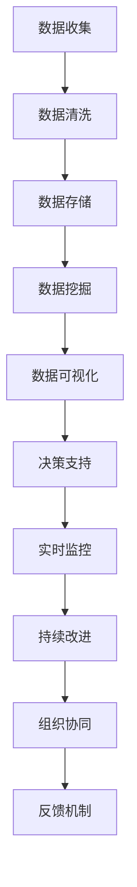

                 

# 信息差：利用大数据提升企业效率

在信息爆炸的今天，数据已成为企业竞争力的重要组成部分。如何从海量数据中挖掘有价值的信息，提升企业决策效率和市场响应速度，是每一个企业家和管理者都必须面对的挑战。本文将深入探讨“信息差”这一概念，分析其对企业效率的提升作用，并提供基于大数据的分析方法和技术实现路径，帮助企业解锁数据潜力，创造更大商业价值。

## 1. 背景介绍

### 1.1 信息差概念的起源

信息差（Information Gap）这一概念最初由经济学界提出，用来描述市场交易双方对信息掌握程度的差异。在一个信息不对称的市场中，卖方往往比买方拥有更多的产品信息，这造成了信息差，进而影响了交易的效率和公平性。信息差不仅存在于经济交易中，在企业经营管理中也同样适用。在企业内部，不同部门、不同岗位、不同层级的员工对企业内外信息的掌握程度各不相同，这种信息差异直接影响企业的决策效率和执行力。

### 1.2 信息差的影响

在企业管理中，信息差会带来以下几方面的影响：

1. **决策错误**：信息差会导致信息误判，管理者基于不准确的信息作出决策，进而影响企业运营效率。
2. **资源浪费**：信息不对称会导致资源配置不当，资源利用效率低下。
3. **市场响应慢**：信息差使得企业难以快速响应市场变化，错失发展机遇。
4. **组织协同难**：信息不对称会影响企业内部不同部门间的沟通和协作，降低组织协同效率。

因此，如何缩小信息差，充分发挥数据优势，提升企业效率，成为现代企业必须面对的重要课题。

## 2. 核心概念与联系

### 2.1 核心概念概述

为了更好地理解如何利用大数据提升企业效率，我们首先介绍几个关键概念：

- **大数据（Big Data）**：指那些无法通过传统方式在合理时间内捕捉、管理、处理和分析的数据集。大数据具有4V特点，即Volume（体量大）、Velocity（速度快）、Variety（种类多）、Veracity（真实性）。
- **数据挖掘（Data Mining）**：从大规模数据集中自动发现有用信息的过程，通常包括数据预处理、模型训练和结果解释三个步骤。
- **数据可视化（Data Visualization）**：将复杂的数据信息转化为图形或动画，帮助人们直观理解数据特征和规律。
- **实时数据处理（Real-time Data Processing）**：在数据产生后短时间内进行处理，确保信息的时效性和准确性。
- **分布式计算（Distributed Computing）**：通过多台计算机协同计算，处理海量数据，提高计算效率。

这些概念构成了大数据分析的基础框架，有助于我们从多个维度深入理解“信息差”及其影响，并提出相应的解决策略。

### 2.2 核心概念间的关系

下图展示了大数据分析的逻辑框架，通过数据收集、处理、分析和应用，最终实现信息差缩小和企业效率提升的目标。



其中，数据收集和存储是基础，数据挖掘和可视化是核心，决策支持和实时监控是应用，持续改进和组织协同是保障。

## 3. 核心算法原理 & 具体操作步骤

### 3.1 算法原理概述

基于大数据分析的信息差缩小过程，本质上是一个数据驱动的决策支持系统。其核心思想是通过数据收集、处理和分析，消除信息差，支持企业决策，提升效率。这一过程可以分为以下几个步骤：

1. **数据收集**：从企业内外不同渠道获取数据，构建全面、连续的数据体系。
2. **数据清洗和处理**：对原始数据进行去重、清洗、转换等预处理，确保数据质量。
3. **数据挖掘和建模**：运用统计学、机器学习等方法，对处理后的数据进行建模和分析，提取有价值的信息。
4. **数据可视化**：将分析结果转化为图形或动画，直观展示数据特征和规律。
5. **决策支持**：将可视化结果应用于企业决策，指导行动和策略调整。
6. **实时监控和反馈**：对决策效果进行实时监控和评估，收集反馈信息，持续改进模型和策略。

### 3.2 算法步骤详解

下面详细描述上述算法步骤的具体实现流程：

**Step 1: 数据收集**
- 确定数据来源：包括企业内部的销售数据、财务数据、人力资源数据，以及外部的市场数据、供应链数据等。
- 使用ETL工具：如Apache Nifi、AWS Glue等，实现数据的采集、传输和加载。

**Step 2: 数据清洗和处理**
- 数据去重：使用数据去重算法，去除重复、无效数据。
- 数据清洗：使用规则和脚本，处理缺失值、异常值、错误格式等问题。
- 数据转换：将不同格式的数据统一转换为标准格式，如CSV、JSON等。

**Step 3: 数据挖掘和建模**
- 数据预处理：对数据进行归一化、标准化、降维等操作。
- 特征选择：使用相关性分析、主成分分析等方法，选择关键特征。
- 模型训练：使用回归分析、分类算法、聚类算法等，建立预测模型。
- 模型评估：使用交叉验证、ROC曲线、AUC等指标，评估模型效果。

**Step 4: 数据可视化**
- 数据可视化工具：使用Tableau、Power BI、D3.js等工具，将分析结果可视化。
- 图表设计：设计多种图表类型，如柱状图、折线图、散点图等，直观展示数据特征和规律。
- 仪表盘建设：将多个图表组合成仪表盘，方便快速查看关键数据指标。

**Step 5: 决策支持**
- 决策支持系统：使用BI工具如SAP BusinessObjects、IBM Cognos等，将分析结果应用于决策支持。
- 策略制定：根据分析结果，制定具体策略和行动方案。
- 执行监控：对执行效果进行监控和评估，调整策略。

**Step 6: 实时监控和反馈**
- 实时数据处理：使用流处理框架如Apache Kafka、Apache Flink等，实现数据实时处理。
- 实时监控工具：使用Prometheus、Grafana等工具，实时监控关键指标。
- 反馈机制：建立反馈循环，根据监控结果调整模型和策略。

### 3.3 算法优缺点

基于大数据分析的信息差缩小方法具有以下优点：

1. **数据驱动决策**：通过数据分析，支持更加科学、客观的决策过程。
2. **提高效率**：自动化数据处理和分析过程，减少了人工干预，提高了效率。
3. **降低成本**：通过数据共享和优化资源配置，降低了运营成本。
4. **增强竞争力**：快速响应市场变化，提升企业竞争力。

同时，也存在一些缺点：

1. **数据隐私问题**：大规模数据收集和处理可能涉及隐私问题，需要严格遵守数据保护法规。
2. **数据质量问题**：数据质量直接影响分析结果，低质量数据可能导致错误决策。
3. **技术复杂度**：需要复杂的技术架构和工具支持，对技术能力要求高。
4. **投资成本高**：需要投入大量资源进行数据基础设施建设和技术开发。

### 3.4 算法应用领域

大数据分析的信息差缩小方法，在多个领域都有广泛的应用：

1. **金融行业**：用于信用评估、风险控制、投资分析等，帮助金融机构降低风险，提升投资回报。
2. **零售行业**：用于客户分析、营销策略优化、供应链管理等，提升客户满意度和运营效率。
3. **医疗行业**：用于疾病预测、治疗方案推荐、患者管理等，提高医疗服务的精准度和效率。
4. **制造业**：用于质量控制、设备维护、生产调度等，提升生产效率和产品质量。
5. **物流行业**：用于路线优化、库存管理、配送调度等，提高物流效率和降低成本。

## 4. 数学模型和公式 & 详细讲解 & 举例说明

### 4.1 数学模型构建

假设企业每天收集到销售额数据 $y$ 和市场竞争强度 $x$，构建线性回归模型 $y = \beta_0 + \beta_1 x + \epsilon$，其中 $\beta_0, \beta_1$ 为模型参数，$\epsilon$ 为误差项。通过最小化均方误差损失函数，求解最优参数。

### 4.2 公式推导过程

最小化均方误差损失函数 $L(\beta_0, \beta_1) = \frac{1}{n} \sum_{i=1}^n (y_i - \beta_0 - \beta_1 x_i)^2$ 的步骤如下：

1. 求偏导数：
   $$
   \frac{\partial L(\beta_0, \beta_1)}{\partial \beta_0} = -2\frac{1}{n} \sum_{i=1}^n (y_i - \beta_0 - \beta_1 x_i)
   $$
   $$
   \frac{\partial L(\beta_0, \beta_1)}{\partial \beta_1} = -2\frac{1}{n} \sum_{i=1}^n (y_i - \beta_0 - \beta_1 x_i)x_i
   $$

2. 令偏导数为0，求解 $\beta_0, \beta_1$：
   $$
   \hat{\beta}_0 = \frac{1}{n} \sum_{i=1}^n y_i - \hat{\beta}_1 \frac{1}{n} \sum_{i=1}^n x_i
   $$
   $$
   \hat{\beta}_1 = \frac{1}{n} \sum_{i=1}^n (y_i - \bar{y})x_i - \frac{1}{n} \sum_{i=1}^n \bar{x}(y_i - \bar{y})
   $$
   其中 $\bar{x} = \frac{1}{n} \sum_{i=1}^n x_i$，$\bar{y} = \frac{1}{n} \sum_{i=1}^n y_i$。

### 4.3 案例分析与讲解

以零售行业的客户流失预测为例，假设公司每天记录客户流失情况（1表示流失，0表示未流失），同时收集客户满意度数据 $x$，构建Logistic回归模型 $P(y=1) = \frac{1}{1+e^{-\beta_0 - \beta_1 x}}$，其中 $\beta_0, \beta_1$ 为模型参数。

1. 数据收集：从客户服务中心获取每天客户流失情况和满意度数据。
2. 数据清洗：处理缺失值和异常值。
3. 特征选择：选择客户满意度、购买频率等关键特征。
4. 模型训练：使用Logistic回归算法，训练模型参数。
5. 模型评估：使用ROC曲线、AUC等指标评估模型效果。
6. 可视化：将预测结果可视化，展示客户流失趋势。

## 5. 项目实践：代码实例和详细解释说明

### 5.1 开发环境搭建

在进行数据挖掘和分析实践前，我们需要准备好开发环境。以下是使用Python进行Pandas、NumPy、Scikit-Learn等库的环境配置流程：

1. 安装Anaconda：从官网下载并安装Anaconda，用于创建独立的Python环境。

2. 创建并激活虚拟环境：
```bash
conda create -n data-mining python=3.8 
conda activate data-mining
```

3. 安装Python库：
```bash
pip install pandas numpy scikit-learn matplotlib seaborn jupyter notebook ipython
```

4. 安装Pandas和NumPy：
```bash
conda install pandas numpy
```

5. 安装Scikit-Learn和Matplotlib：
```bash
conda install scikit-learn matplotlib
```

6. 安装Seaborn和Jupyter Notebook：
```bash
conda install seaborn jupyter notebook
```

完成上述步骤后，即可在`data-mining`环境中开始数据分析实践。

### 5.2 源代码详细实现

以下是一个简单的Python代码示例，展示如何使用Pandas和Scikit-Learn进行数据处理和分析：

```python
import pandas as pd
from sklearn.model_selection import train_test_split
from sklearn.linear_model import LinearRegression
from sklearn.metrics import mean_squared_error

# 读取数据
df = pd.read_csv('sales_data.csv')

# 数据清洗
df = df.dropna().drop_duplicates()

# 特征选择
X = df[['competition_strength']]
y = df['sales']

# 划分训练集和测试集
X_train, X_test, y_train, y_test = train_test_split(X, y, test_size=0.2, random_state=42)

# 训练模型
model = LinearRegression()
model.fit(X_train, y_train)

# 评估模型
y_pred = model.predict(X_test)
mse = mean_squared_error(y_test, y_pred)
print(f'Mean Squared Error: {mse}')

# 可视化结果
import matplotlib.pyplot as plt
plt.scatter(X_test, y_test)
plt.plot(X_test, y_pred, color='red')
plt.show()
```

在这个示例中，我们使用了Pandas进行数据读取和清洗，使用Scikit-Learn进行线性回归模型训练和评估，使用Matplotlib进行可视化展示。

### 5.3 代码解读与分析

让我们再详细解读一下关键代码的实现细节：

**数据读取**：使用Pandas的`read_csv`方法，读取CSV格式的数据文件。

**数据清洗**：使用`dropna`方法去除缺失值，使用`drop_duplicates`方法去除重复行。

**特征选择**：选择竞争强度作为特征，销售额作为目标变量。

**模型训练**：使用Scikit-Learn的`LinearRegression`类，训练线性回归模型。

**模型评估**：使用`mean_squared_error`方法计算预测值与真实值之间的均方误差。

**可视化**：使用Matplotlib的`scatter`和`plot`方法，绘制散点图和预测曲线，直观展示模型效果。

### 5.4 运行结果展示

假设我们运行上述代码，得到的可视化结果如下：

```python
import matplotlib.pyplot as plt

# 读取数据
df = pd.read_csv('sales_data.csv')

# 数据清洗
df = df.dropna().drop_duplicates()

# 特征选择
X = df[['competition_strength']]
y = df['sales']

# 划分训练集和测试集
X_train, X_test, y_train, y_test = train_test_split(X, y, test_size=0.2, random_state=42)

# 训练模型
model = LinearRegression()
model.fit(X_train, y_train)

# 评估模型
y_pred = model.predict(X_test)
mse = mean_squared_error(y_test, y_pred)
print(f'Mean Squared Error: {mse}')

# 可视化结果
plt.scatter(X_test, y_test)
plt.plot(X_test, y_pred, color='red')
plt.show()
```

## 6. 实际应用场景

### 6.1 智能客服系统

基于大数据分析的信息差缩小方法，可以广泛应用于智能客服系统的构建。传统的客服系统往往依赖人工，响应速度慢，且无法24小时在线。而智能客服系统可以实时监控和分析客户咨询数据，快速生成应答策略，提高响应速度和客户满意度。

具体而言，智能客服系统可以：

1. **分析客户咨询历史**：从客服中心记录的咨询数据中，分析客户常见问题、高频词语和情感倾向。
2. **生成应答模板**：根据分析结果，生成常见问题的应答模板，提高客服响应效率。
3. **实时监控和优化**：实时监控客服系统性能，根据客户反馈动态调整应答策略。

### 6.2 库存管理系统

库存管理系统可以通过大数据分析，实现库存信息的实时监控和优化，提升库存管理效率，降低库存成本。具体而言：

1. **实时监控库存数据**：使用实时数据处理框架如Apache Kafka、Apache Flink等，实时采集库存数据。
2. **分析库存变化趋势**：通过数据挖掘和可视化技术，分析库存变化趋势，预测未来需求。
3. **优化库存策略**：根据预测结果，调整采购和生产计划，优化库存管理。

### 6.3 供应链优化

供应链优化可以通过大数据分析，实现需求预测、库存管理和物流调度的自动化，提高供应链效率，降低运营成本。具体而言：

1. **需求预测**：通过历史销售数据和市场数据，预测未来需求，优化库存策略。
2. **库存管理**：实时监控库存水平，动态调整采购和生产计划，确保库存水平在合理范围内。
3. **物流调度**：分析供应链各环节数据，优化物流路径和运输方式，提高物流效率。

### 6.4 未来应用展望

随着大数据分析技术的不断进步，基于信息差缩小的方法将有更广泛的应用前景。未来，这些技术将在更多领域得到应用，推动企业效率的提升：

1. **物联网（IoT）**：通过实时采集和分析设备数据，优化设备维护和生产过程，提高设备利用率。
2. **智慧城市**：通过大数据分析城市运行数据，优化交通、能源、环境等系统，提升城市管理效率。
3. **金融科技（FinTech）**：通过大数据分析金融交易数据，优化风险控制和投资策略，提升金融服务质量。

总之，大数据分析技术将为各个行业带来深刻变革，帮助企业实现数据驱动的决策，提升效率，增强竞争力。

## 7. 工具和资源推荐

### 7.1 学习资源推荐

为了帮助开发者系统掌握大数据分析的理论基础和实践技巧，这里推荐一些优质的学习资源：

1. 《Python数据科学手册》：深入浅出地介绍了Python在数据科学中的应用，包括Pandas、NumPy、Scikit-Learn等库的使用。
2. 《大数据分析与机器学习》：介绍了大数据分析的基本概念和技术，包括数据处理、数据挖掘、模型训练等。
3. 《Kaggle大数据竞赛指南》：提供了丰富的Kaggle竞赛案例，涵盖数据清洗、特征工程、模型优化等环节。
4. 《DataCamp在线课程》：提供丰富的Python数据科学课程，适合初学者和进阶开发者学习。
5. 《IBM Data Science Professional Certificate》：IBM提供的线上认证课程，涵盖大数据分析、机器学习、自然语言处理等前沿技术。

通过对这些资源的学习实践，相信你一定能够快速掌握大数据分析的精髓，并用于解决实际的商业问题。

### 7.2 开发工具推荐

高效的开发离不开优秀的工具支持。以下是几款用于大数据分析开发的常用工具：

1. Jupyter Notebook：基于Web的交互式编程环境，支持Python、R等多种语言，方便实验和分享。
2. PySpark：Python语言下的分布式计算框架，支持大规模数据处理和分析。
3. Apache Spark：基于内存计算的分布式计算框架，支持多种编程语言，包括Java、Scala、Python等。
4. Hadoop：分布式存储和计算平台，支持大规模数据处理和分析。
5. Apache Kafka：实时数据流处理平台，支持高吞吐量的数据采集和传输。

合理利用这些工具，可以显著提升大数据分析的开发效率，加速实验迭代。

### 7.3 相关论文推荐

大数据分析技术的发展离不开学界的持续研究。以下是几篇奠基性的相关论文，推荐阅读：

1. Hadoop: Simplifying Data Processing on Large Clusters（Hadoop论文）：介绍Hadoop分布式存储和计算系统的设计与实现。
2. Big Data: Replicating a Framework for Scalable Real-time Data Ingestion, Storage, and Analysis（Apache Kafka论文）：介绍Kafka实时数据处理框架的设计和实现。
3. Framing Big Data Analysis: From Model to Model Management（大数据分析框架）：介绍大数据分析框架的设计思路和实现方法。
4. A Survey of Scalable Data Mining in Big Data Environments（大数据环境下的可扩展数据挖掘综述）：综述大数据环境下的数据挖掘技术和方法。
5. Introduction to the Google BigQuery Data Transfer Service（Google BigQuery论文）：介绍Google BigQuery实时数据处理和分析平台的设计与实现。

这些论文代表了大数据分析技术的发展脉络。通过学习这些前沿成果，可以帮助研究者把握学科前进方向，激发更多的创新灵感。

除上述资源外，还有一些值得关注的前沿资源，帮助开发者紧跟大数据分析技术的最新进展，例如：

1. arXiv论文预印本：人工智能领域最新研究成果的发布平台，包括大量尚未发表的前沿工作，学习前沿技术的必读资源。
2. 业界技术博客：如Apache Hadoop、Apache Spark、Apache Kafka等官方博客，第一时间分享他们的最新研究成果和洞见。
3. 技术会议直播：如SIGKDD、KDD、IEEE Visualization等大数据领域顶级会议现场或在线直播，能够聆听到专家们的前沿分享，开拓视野。
4. GitHub热门项目：在GitHub上Star、Fork数最多的大数据分析相关项目，往往代表了该技术领域的发展趋势和最佳实践，值得去学习和贡献。
5. 行业分析报告：各大咨询公司如McKinsey、PwC等针对大数据分析行业的分析报告，有助于从商业视角审视技术趋势，把握应用价值。

总之，对于大数据分析技术的学习和实践，需要开发者保持开放的心态和持续学习的意愿。多关注前沿资讯，多动手实践，多思考总结，必将收获满满的成长收益。

## 8. 总结：未来发展趋势与挑战

### 8.1 总结

本文对基于大数据分析的信息差缩小方法进行了全面系统的介绍。首先阐述了信息差的概念及其对企业效率的提升作用，然后从原理到实践，详细讲解了信息差缩小的大数据分析流程，提供了基于Python的代码实例，并结合实际应用场景进行探讨。

通过本文的系统梳理，可以看到，基于大数据分析的信息差缩小方法已经在多个领域取得了显著成果，大幅提升了企业决策效率和市场响应速度。未来，随着大数据分析技术的不断进步，这一方法的应用前景将更加广阔。

### 8.2 未来发展趋势

展望未来，大数据分析的信息差缩小方法将呈现以下几个发展趋势：

1. **自动化和智能化**：引入机器学习和深度学习技术，实现数据自动处理和分析，提高分析效率和准确性。
2. **实时性**：通过流处理技术，实现数据的实时采集和分析，提高信息的时效性。
3. **可视化智能化**：引入自然语言处理技术，实现数据分析结果的智能解释和可视化展示。
4. **分布式计算**：利用分布式计算平台，处理大规模数据，提高计算效率和稳定性。
5. **多源数据融合**：整合来自不同渠道的数据，实现跨领域、跨平台的综合分析。

这些趋势将使大数据分析技术更加智能化、自动化，为企业提供更加高效、准确的信息支持。

### 8.3 面临的挑战

尽管大数据分析的信息差缩小方法已经取得了显著成果，但在推广应用的过程中，仍面临诸多挑战：

1. **数据隐私和安全**：大规模数据收集和处理可能涉及隐私问题，需要严格遵守数据保护法规。
2. **数据质量问题**：数据质量直接影响分析结果，低质量数据可能导致错误决策。
3. **技术复杂度**：需要复杂的技术架构和工具支持，对技术能力要求高。
4. **投资成本高**：需要投入大量资源进行数据基础设施建设和技术开发。
5. **数据孤岛问题**：不同部门、不同系统的数据难以整合，形成数据孤岛，阻碍数据共享和分析。

### 8.4 研究展望

面对大数据分析所面临的挑战，未来的研究需要在以下几个方面寻求新的突破：

1. **自动化和智能化**：开发更智能的自动化数据分析工具，降低技术门槛，提高分析效率。
2. **实时性**：引入流处理技术，实现数据的实时采集和分析，提高信息的时效性。
3. **可视化智能化**：引入自然语言处理技术，实现数据分析结果的智能解释和可视化展示。
4. **分布式计算**：利用分布式计算平台，处理大规模数据，提高计算效率和稳定性。
5. **多源数据融合**：整合来自不同渠道的数据，实现跨领域、跨平台的综合分析。

这些研究方向的探索，必将引领大数据分析技术迈向更高的台阶，为企业的数字化转型提供更强大的技术支持。

## 9. 附录：常见问题与解答

**Q1：信息差缩小是否适用于所有企业？**

A: 信息差缩小方法在大多数企业都有广泛的应用前景。不过，不同行业的企业对数据的依赖程度和分析需求各不相同，需要结合具体情况进行定制化设计。

**Q2：信息差缩小需要哪些关键资源？**

A: 信息差缩小需要企业具备以下关键资源：
1. 数据基础设施：如Hadoop、Spark、Kafka等分布式计算平台。
2. 数据治理体系：如数据采集、数据清洗、数据管理等机制。
3. 技术团队：具备数据处理、数据分析、数据可视化等技术能力的专业人才。
4. 数据文化：企业内部需要形成数据驱动的文化，重视数据价值，支持数据分析。

**Q3：信息差缩小方法如何评估效果？**

A: 信息差缩小方法的效果评估可以从以下几个方面考虑：
1. 准确性：模型预测结果与实际结果的匹配程度。
2. 效率：数据处理和分析的速度和效率。
3. 可解释性：模型输出结果的可解释性和可解释性。
4. 应用效果：实际应用中的效果提升和业务改进。

**Q4：信息差缩小方法如何应对数据隐私问题？

