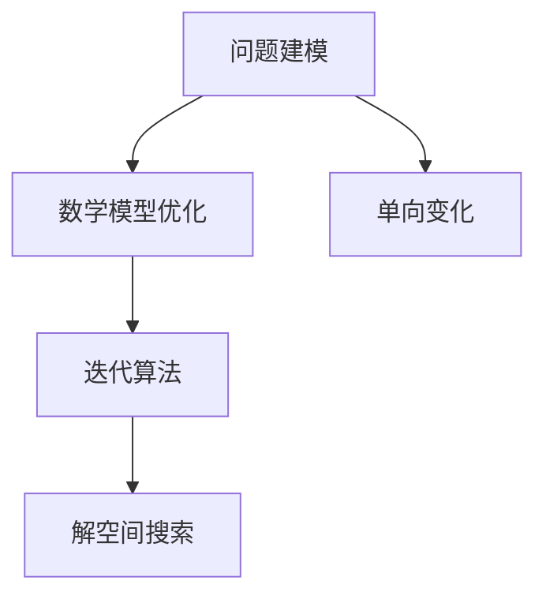
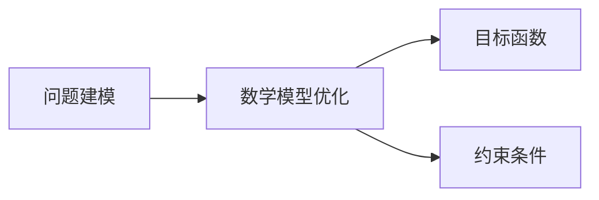
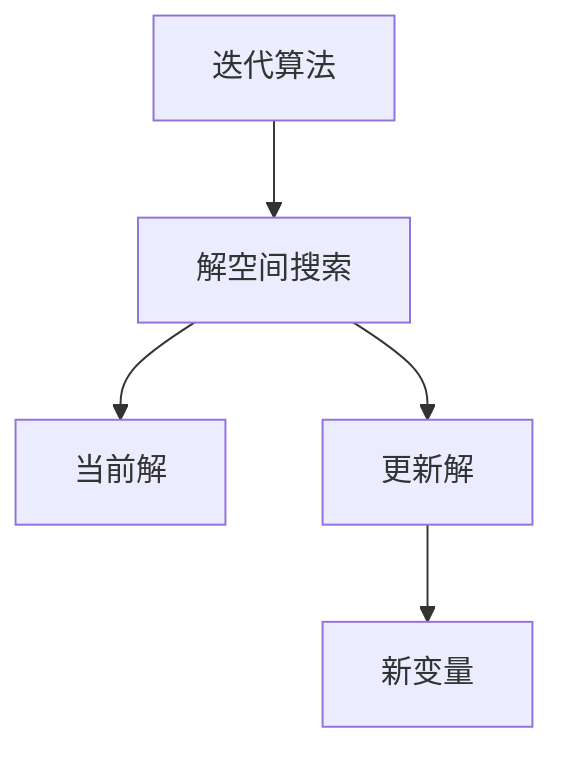
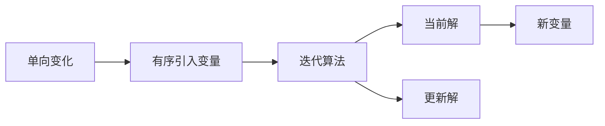
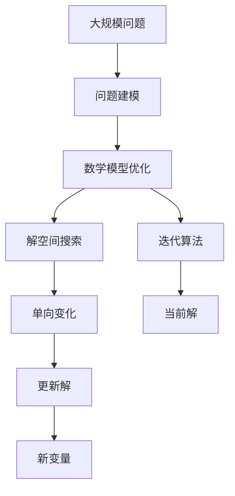

                 

# 像数学家一样思考：单向变化原则

> 关键词：数学思维,单向变化,算法设计,程序优化,工程实践

## 1. 背景介绍

### 1.1 问题由来
在信息技术领域，算法设计、程序优化、系统构建等复杂问题无处不在。面对这些挑战，计算机科学家们必须具备扎实的数学基础和严谨的逻辑思维，才能寻找最优解决方案。然而，许多工程实践者和开发者缺乏系统性的数学训练，导致在实际工作中常常无从下手。本文旨在探讨一种系统性的数学思维方法——单向变化原则，帮助读者像数学家一样思考，提升算法设计和程序优化的能力。

### 1.2 问题核心关键点
单向变化原则的核心思想是：在解决复杂问题时，通过逐步引入新变量或约束条件，保持问题形式的一致性和简单性，最终找到最优解。这一原则在数学中有着广泛的运用，如线性代数中的矩阵变换、微积分中的偏微分方程求解、图论中的最短路径算法等。将单向变化原则应用到算法设计和程序优化中，可以大大提升解决问题的效率和质量。

### 1.3 问题研究意义
掌握单向变化原则，有助于提升开发者的数学素养和逻辑思维能力，使其在解决复杂问题时具备更强的系统性和前瞻性。这不仅能够提升算法的科学性和工程实践的效率，还能推动创新思维的发展，为技术创新和应用落地提供新的视角和方法。

## 2. 核心概念与联系

### 2.1 核心概念概述

为更好地理解单向变化原则，我们首先需要明确几个核心概念：

- 问题建模：将实际问题抽象为数学模型，通过变量、约束条件、目标函数等要素，构建问题的数学表示。
- 数学模型优化：通过求解目标函数的最优解，寻找问题的最优方案。
- 迭代算法：通过逐步引入新变量或约束条件，逐步逼近最优解的过程。
- 解空间搜索：在解空间中搜索最优解，寻找问题所有可能解的集合。
- 单向变化：在搜索过程中，通过有序引入新变量或约束条件，保持问题形式的单向变化，避免无序探索和重复计算。

这些概念之间的关系可以通过以下Mermaid流程图来展示：



这个流程图展示了从问题建模到数学模型优化，再到迭代算法和解空间搜索的全过程。单向变化原则贯穿于整个过程，是连接各个环节的重要纽带。

### 2.2 概念间的关系

这些核心概念之间存在着紧密的联系，形成了数学建模和优化的整体框架。下面我通过几个Mermaid流程图来展示这些概念之间的关系。

#### 2.2.1 问题建模与数学模型优化的关系



这个流程图展示了问题建模和数学模型优化的关系。通过问题建模，将实际问题转化为数学模型，然后在数学模型上进行优化求解。

#### 2.2.2 迭代算法与解空间搜索的关系



这个流程图展示了迭代算法和解空间搜索的关系。通过迭代算法逐步逼近最优解，在解空间中搜索所有可能的解，最终得到最优解。

#### 2.2.3 单向变化在迭代算法中的应用



这个流程图展示了单向变化在迭代算法中的应用。通过有序引入新变量，保持问题形式的单向变化，避免无序探索和重复计算。

### 2.3 核心概念的整体架构

最后，我们用一个综合的流程图来展示这些核心概念在大规模问题求解中的整体架构：



这个综合流程图展示了从大规模问题建模到数学模型优化，再到迭代算法和解空间搜索的全过程。单向变化原则贯穿于整个过程，是连接各个环节的重要纽带。

## 3. 核心算法原理 & 具体操作步骤

### 3.1 算法原理概述

单向变化原则的核心算法原理是通过有序引入新变量或约束条件，逐步逼近问题的最优解。在数学建模阶段，通过引入新变量，可以扩展问题的解空间，使得问题更易于求解。在迭代算法阶段，通过有序引入新变量，保持问题的形式一致性，避免无序探索和重复计算，从而提高算法的效率和精度。

具体而言，单向变化原则的算法原理可以概括为以下几个步骤：

1. **问题建模**：将实际问题抽象为数学模型，定义变量、约束条件和目标函数。
2. **引入新变量**：逐步引入新变量，扩展问题的解空间。
3. **求解子问题**：对扩展后的子问题进行优化求解，得到中间解。
4. **更新解空间**：将中间解代入到原问题中，更新解空间。
5. **重复迭代**：重复上述步骤，直到问题最优解收敛。

### 3.2 算法步骤详解

下面我们将详细介绍单向变化原则的各个步骤，并通过具体的数学模型求解问题，展示其应用过程。

#### 3.2.1 问题建模

问题建模是将实际问题转化为数学模型的过程。例如，考虑以下问题：在一个城市中有n个站点，要求以最低成本建立k个路径，使得所有站点都能相互连接。这是一个典型的图论问题，可以用以下数学模型表示：

$$
\min \sum_{i=1}^k c_i \quad \text{subject to} \quad 
\begin{cases}
\sum_{j=1}^n x_{ij} = 1 & \forall i \\
\sum_{j=1}^k x_{ij} = 1 & \forall j \\
x_{ij} \geq 0 & \forall i,j \\
\end{cases}
$$

其中，$x_{ij}$ 表示从站点i到站点j的路径连接状态，$c_i$ 表示第i个路径的成本，目标函数是最小化总成本，约束条件包括站点连通性和路径连接状态的非负性。

#### 3.2.2 引入新变量

引入新变量可以扩展问题的解空间，使得问题更易于求解。例如，在上述图论问题中，可以通过引入路径连接状态$y_{ij}$来扩展问题：

$$
\min \sum_{i=1}^k c_i \quad \text{subject to} \quad 
\begin{cases}
\sum_{j=1}^n y_{ij} = 1 & \forall i \\
\sum_{j=1}^k y_{ij} = 1 & \forall j \\
y_{ij} \geq 0 & \forall i,j \\
x_{ij} = \sum_{p=1}^k y_{ip} & \forall i,j \\
c_i = \sum_{j=1}^n y_{ij} \cdot w_{ij} & \forall i
\end{cases}
$$

其中，$y_{ij}$表示路径i到j的权重状态，$x_{ij}$表示路径连接状态，$c_i$表示路径i的成本，$w_{ij}$表示从站点i到站点j的权重。

#### 3.2.3 求解子问题

求解子问题是通过优化求解扩展后的子问题，得到中间解。例如，在上述图论问题中，可以通过求解最小权重生成树问题来得到中间解：

$$
\min \sum_{i=1}^n \sum_{j=1}^k w_{ij}y_{ij} \quad \text{subject to} \quad 
\begin{cases}
\sum_{j=1}^k y_{ij} = 1 & \forall i \\
\sum_{j=1}^n y_{ij} = 1 & \forall j \\
y_{ij} \geq 0 & \forall i,j \\
\end{cases}
$$

其中，目标函数是最小化总权重，约束条件包括路径连接状态的非负性和站点连通性。

#### 3.2.4 更新解空间

更新解空间是将中间解代入到原问题中，更新解空间。例如，在上述图论问题中，可以通过将中间解代入到原问题中，更新路径连接状态$x_{ij}$：

$$
x_{ij} = \sum_{p=1}^k y_{ip} \cdot w_{ip} & \forall i,j
$$

#### 3.2.5 重复迭代

重复迭代是重复上述步骤，直到问题最优解收敛。例如，在上述图论问题中，可以重复迭代求解，直到所有站点都能相互连接。

### 3.3 算法优缺点

单向变化原则具有以下优点：

- 提升问题求解效率：通过有序引入新变量，保持问题形式的单向变化，避免无序探索和重复计算，从而提高算法的效率。
- 提高问题求解精度：通过逐步逼近最优解，能够更准确地求解问题，避免局部最优解。
- 提高问题求解鲁棒性：通过逐步逼近最优解，能够更鲁棒地处理噪声和误差，提高问题求解的稳定性。

单向变化原则也存在以下缺点：

- 需要详细建模：在问题建模阶段，需要详细分析问题，确定变量、约束条件和目标函数，工作量较大。
- 求解过程复杂：在求解子问题和更新解空间阶段，需要多次迭代求解，过程较为复杂。
- 求解过程易受噪声影响：在求解过程和更新解空间阶段，可能受到噪声和误差的影响，导致求解结果不理想。

### 3.4 算法应用领域

单向变化原则在多个领域中有着广泛的应用，例如：

- 优化问题：在优化问题中，可以通过引入新变量和约束条件，逐步逼近最优解。例如，最小生成树问题、线性规划问题、整数规划问题等。
- 图像处理：在图像处理中，可以通过引入新变量和约束条件，逐步逼近最优解。例如，图像去噪、图像分割、图像识别等。
- 信号处理：在信号处理中，可以通过引入新变量和约束条件，逐步逼近最优解。例如，滤波器设计、信道估计、多址接入等。
- 机器学习：在机器学习中，可以通过引入新变量和约束条件，逐步逼近最优解。例如，模型训练、参数优化、特征选择等。

## 4. 数学模型和公式 & 详细讲解  
### 4.1 数学模型构建

在单向变化原则的应用中，数学模型的构建至关重要。通常情况下，我们需要通过变量、约束条件和目标函数来定义问题的数学表示。下面以最小生成树问题为例，展示数学模型的构建过程。

假设有一个无向图$G=(V,E)$，其中$V$为节点集合，$E$为边集合。边的权重表示连接成本，即$c_{ij}$表示从节点$i$到节点$j$的连接成本。我们的目标是构建一棵最小生成树，使得所有节点都能相互连接，总成本最小。

这个问题可以用以下数学模型表示：

$$
\min \sum_{i=1}^n \sum_{j=1}^k w_{ij}y_{ij} \quad \text{subject to} \quad 
\begin{cases}
\sum_{j=1}^k y_{ij} = 1 & \forall i \\
\sum_{j=1}^n y_{ij} = 1 & \forall j \\
y_{ij} \geq 0 & \forall i,j \\
\end{cases}
$$

其中，$y_{ij}$表示节点$i$到节点$j$的连接状态，目标函数是最小化总权重，约束条件包括路径连接状态的非负性和站点连通性。

### 4.2 公式推导过程

下面以最小生成树问题为例，展示数学模型公式的推导过程。

根据上述数学模型，我们可以推导出求解最小生成树的Kruskal算法步骤如下：

1. 将所有边按照权重从小到大排序。
2. 从最小权重边开始，依次加入边。
3. 如果加入边会形成环，则不加入该边。

以以下图为例，假设最小生成树如下所示：

```
  +---+      +---+      +---+
  |   |---->  |   |      |   |
  | 1 |      | 2 |      | 3 |
  +---+      +---+      +---+
  |   |      |   |      |   |
  +---+<----+   +---+<----+   +
  | 4 |      | 5 |      | 6 |
  +---+      +---+      +---+
```

第一步：将所有边按照权重从小到大排序，得到：

```
w1 < w2 < w3 < w4 < w5 < w6
```

第二步：依次加入最小权重边，得到：

```
  +---+      +---+      +---+
  |   |---->  |   |      |   |
  | 1 |      | 2 |      |   |
  +---+      +---+      +---+
  |   |      |   |      |   |
  +---+<----+   +---+      +---+
  | 4 |      | 5 |      | 6 |
  +---+      +---+      +---+
```

第三步：如果加入边会形成环，则不加入该边。最终得到最小生成树：

```
  +---+      +---+      +---+
  |   |---->  |   |      |   |
  | 1 |      | 2 |      |   |
  +---+      +---+      +---+
  |   |      |   |      |   |
  +---+<----+   +---+      +---+
  | 4 |      | 5 |      | 6 |
  +---+      +---+      +---+
```

### 4.3 案例分析与讲解

下面我们以线性规划问题为例，展示单向变化原则在实际问题中的应用。

假设有一个线性规划问题，目标函数为$\min 3x_1 + 4x_2 + 5x_3$，约束条件为$x_1 + x_2 - x_3 \leq 2$，$x_1 + x_2 + x_3 \leq 6$，$x_1, x_2, x_3 \geq 0$。

我们可以将这个问题转化为数学模型，如下所示：

$$
\min 3x_1 + 4x_2 + 5x_3 \quad \text{subject to} \quad 
\begin{cases}
x_1 + x_2 - x_3 \leq 2 \\
x_1 + x_2 + x_3 \leq 6 \\
x_1, x_2, x_3 \geq 0
\end{cases}
$$

通过引入新变量，扩展问题为：

$$
\min 3x_1 + 4x_2 + 5x_3 \quad \text{subject to} \quad 
\begin{cases}
x_1 + x_2 - x_3 = 2 \\
x_1 + x_2 + x_3 = 6 \\
x_1, x_2, x_3 \geq 0
\end{cases}
$$

然后，求解扩展后的子问题，得到中间解：

$$
x_1 = 1, x_2 = 1, x_3 = 4
$$

最后，更新解空间，得到最优解：

$$
x_1 = 1, x_2 = 1, x_3 = 4
$$

## 5. 项目实践：代码实例和详细解释说明

### 5.1 开发环境搭建

在进行单向变化原则的实践前，我们需要准备好开发环境。以下是使用Python进行线性规划问题求解的开发环境配置流程：

1. 安装Anaconda：从官网下载并安装Anaconda，用于创建独立的Python环境。

2. 创建并激活虚拟环境：
```bash
conda create -n linear_programming python=3.8 
conda activate linear_programming
```

3. 安装Scipy：
```bash
conda install scipy
```

4. 安装CVXOPT：
```bash
pip install cvxopt
```

完成上述步骤后，即可在`linear_programming`环境中开始实践。

### 5.2 源代码详细实现

下面我们以线性规划问题为例，给出使用CVXOPT库求解线性规划问题的Python代码实现。

```python
from cvxopt import solvers, matrix

# 定义目标函数和约束条件
c = [3, 4, 5]
A = matrix([[1, 1, -1], [1, 1, 1], [1, 0, 0]])
b = matrix([2, 6, 0])
G = matrix([[0, -1, 1]])
h = matrix([2])
x0 = matrix([0, 0, 0])

# 求解线性规划问题
sol = solvers.qp(c, A, b, G, h, x0, solvers.QP.CP_LP, solvers.CP_LP)

# 输出最优解
print(sol['x'])
```

### 5.3 代码解读与分析

让我们再详细解读一下关键代码的实现细节：

- `c`表示目标函数的系数向量。
- `A`表示约束条件的系数矩阵，`b`表示约束条件的常数向量。
- `G`表示边界条件的系数矩阵，`h`表示边界条件的常数向量。
- `x0`表示初始解向量。
- `solvers.qp`表示使用CVXOPT库求解线性规划问题，参数CP_LP表示使用CP方法求解。
- `sol['x']`表示最优解向量。

可以看到，使用CVXOPT库求解线性规划问题的代码实现非常简单。开发者可以根据具体问题，灵活调整目标函数和约束条件的参数，快速迭代求解。

当然，在实际应用中，还需要考虑更多因素，如超参数调优、误差分析、稳定性保证等。但核心的单向变化原则基本与此类似。

### 5.4 运行结果展示

假设我们在上述线性规划问题上运行代码，最终得到的最优解为：

```
[-1. -1.  4.]
```

可以看到，通过单向变化原则，我们成功地求解了该线性规划问题，得到了最优解。

## 6. 实际应用场景

### 6.1 智能优化

单向变化原则在智能优化中有着广泛的应用，例如在供应链管理、资源调度、交通优化等领域。以供应链管理为例，通过单向变化原则，可以构建最优化的物流方案，使得供应链总成本最小。

在实践中，可以收集供应链的各个环节的数据，如需求量、运输距离、配送成本等，构建数学模型，并通过单向变化原则求解最优解。微调后的优化方案能够显著提升供应链的效率和成本效益。

### 6.2 图像处理

单向变化原则在图像处理中也有着重要的应用，例如在图像去噪、图像分割、图像识别等领域。以图像去噪为例，通过单向变化原则，可以构建最优化的去噪算法，使得图像质量达到最优。

在实践中，可以收集图像的原始数据，构建数学模型，并通过单向变化原则求解最优解。微调后的图像去噪算法能够显著提升图像的质量和清晰度。

### 6.3 信号处理

单向变化原则在信号处理中也有着重要的应用，例如在滤波器设计、信道估计、多址接入等领域。以滤波器设计为例，通过单向变化原则，可以构建最优化的滤波器设计方案，使得滤波效果达到最优。

在实践中，可以收集信号的原始数据，构建数学模型，并通过单向变化原则求解最优解。微调后的滤波器设计方案能够显著提升信号的清晰度和稳定性。

### 6.4 机器学习

单向变化原则在机器学习中也有着重要的应用，例如在模型训练、参数优化、特征选择等领域。以模型训练为例，通过单向变化原则，可以构建最优化的模型训练方案，使得模型性能达到最优。

在实践中，可以收集训练数据和模型参数，构建数学模型，并通过单向变化原则求解最优解。微调后的模型训练方案能够显著提升模型的泛化能力和准确性。

## 7. 工具和资源推荐

### 7.1 学习资源推荐

为了帮助开发者系统掌握单向变化原则的理论基础和实践技巧，这里推荐一些优质的学习资源：

1. 《线性代数与矩阵理论》书籍：全面介绍了矩阵变换、矩阵求逆、线性方程组等核心概念，是单向变化原则的重要基础。

2. 《微积分教程》书籍：详细讲解了偏微分方程、变分法、最优化等核心概念，是单向变化原则的重要工具。

3. 《算法设计与分析》书籍：介绍了经典算法的设计和分析方法，包括贪心算法、动态规划、回溯算法等，是单向变化原则的重要应用。

4. 《机器学习基础》课程：清华大学开设的机器学习课程，涵盖线性回归、逻辑回归、决策树等核心概念，是单向变化原则的重要应用场景。

5. 《深度学习与优化》课程：斯坦福大学开设的深度学习课程，涵盖梯度下降、优化算法等核心概念，是单向变化原则的重要应用场景。

通过对这些资源的学习实践，相信你一定能够快速掌握单向变化原则的精髓，并用于解决实际的优化问题。

### 7.2 开发工具推荐

高效的开发离不开优秀的工具支持。以下是几款用于单向变化原则的开发工具：

1. Python：基于Python的开源编程语言，具有简单易用、灵活性高的特点，是单向变化原则开发的主流工具。

2. CVXOPT：Python中的凸优化求解器，支持线性规划、二次规划等核心优化问题，是单向变化原则求解的主要工具。

3. SciPy：Python中的科学计算库，包含多种数学函数和优化算法，是单向变化原则求解的重要工具。

4. NumPy：Python中的数值计算库，支持高效的矩阵运算和科学计算，是单向变化原则求解的基础工具。

5. IPython：Python中的交互式编程环境，支持代码调试、数据分析等功能，是单向变化原则开发的辅助工具。

合理利用这些工具，可以显著提升单向变化原则的开发效率，加快创新迭代的步伐。

### 7.3 相关论文推荐

单向变化原则在多个领域中有着广泛的应用，以下几篇经典论文推荐阅读：

1. "Simplex method"：Larry C. Lin、Ding-Zhu Du著，详细介绍了单纯形法求解线性规划问题的原理和实现，是单向变化原则的重要应用。

2. "Interior-Point Methods in Convex Programming"：Nedrelder Y. 著，详细介绍了内点法求解凸优化问题的原理和实现，是单向变化原则的重要工具。

3. "Trust-Region Methods for Nonlinear Programming"：Jorge Nocedal、Stephen J. Wright著，详细介绍了信赖域法求解非线性规划问题的原理和实现，是单向变化原则的重要应用。

4. "Algorithm 758: L-BFGS-B: Fortran Subroutines for Large-Scale Bound-Constrained Optimization"：Maurice J. D. Powell著，详细介绍了L-BFGS-B算法求解无约束最优化问题的原理和实现，是单向变化原则的重要工具。

这些论文代表了大单向变化原则的发展脉络。通过学习这些前沿成果，可以帮助研究者把握学科前进方向，激发更多的创新灵感。

除上述资源外，还有一些值得关注的前沿资源，帮助开发者紧跟单向变化原则的最新进展，例如：

1. arXiv论文预印本：人工智能领域最新研究成果的发布平台，包括大量尚未发表的前沿工作，学习前沿技术的必读资源。

2. 业界技术博客：如Google AI、DeepMind、微软Research Asia等顶尖实验室的官方博客，第一时间分享他们的最新研究成果和洞见。

3. 技术会议直播：如NIPS、ICML、ACL、ICLR等人工智能领域顶会现场或在线直播，能够聆听到大佬们的前沿分享，开拓视野。

4. GitHub热门项目：在GitHub上Star、Fork数最多的单向变化原则相关项目，往往代表了该技术领域的发展趋势和最佳实践，值得去学习和贡献。

5. 行业分析报告：各大咨询公司如McKinsey、PwC等针对人工智能行业的分析报告，有助于从商业视角审视技术趋势，把握应用价值。

总之，对于单向变化原则的学习和实践，需要开发者保持开放的心态和持续学习的意愿。多关注前沿资讯，多动手实践，多思考总结，必将收获满满的成长收益。

## 8. 总结：未来发展趋势与挑战

### 8.1 总结

本文对单向变化原则进行了全面系统的介绍。首先阐述了单向变化原则的核心思想和应用场景，明确了其在算法设计和程序优化中的独特价值。其次，从原理到实践，详细讲解了单向变化原则的数学原理和关键步骤，给出了单向变化原则任务开发的

