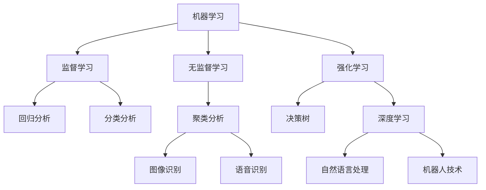

                 

# 创业者在AI浪潮中的机会

## 1. 背景介绍

### 1.1 问题由来

随着人工智能(AI)技术的快速发展，AI浪潮席卷各行各业，掀起了前所未有的产业变革。AI技术的应用不仅改变了生产方式、商业模式，还推动了社会变革，成为经济发展的新引擎。创业者在这波浪潮中迎来了千载难逢的历史机遇，但要把握机遇，还需深入理解AI的原理和应用场景，探索AI技术的商业价值。

### 1.2 问题核心关键点

AI技术核心在于模拟人类的认知和推理能力，实现自动化决策和智能化处理。创业者若要在这波浪潮中抓住机遇，首先需要掌握AI的基本原理，理解AI技术在各行各业中的应用，以及如何构建基于AI的创新商业模式。

### 1.3 问题研究意义

AI技术已经深刻影响了现代社会，从医疗、教育、金融到制造业、农业、能源等众多领域。创业者在这波浪潮中，可以构建新的产品和服务，优化流程，提升效率，创造更多社会价值。同时，AI技术的发展也催生了新的市场需求和商业机会，为创业者提供了广阔的发展空间。

## 2. 核心概念与联系

### 2.1 核心概念概述

AI技术核心在于模拟人类的认知和推理能力，实现自动化决策和智能化处理。AI技术可以分为机器学习、计算机视觉、自然语言处理、机器人技术等众多领域。其中，机器学习是AI技术的核心，通过算法和数据训练模型，使计算机具备类似人类的学习能力。

创业者需要理解AI技术的核心概念和应用领域，以便在设计产品和商业模型时，能够充分利用AI技术的能力。

### 2.2 概念间的关系

AI技术的各个核心概念之间相互关联，共同构成了AI技术的完整生态系统。以下通过Mermaid流程图展示各个概念之间的关系：



这个流程图展示了AI技术的核心概念及其之间的关联关系。

## 3. 核心算法原理 & 具体操作步骤

### 3.1 算法原理概述

AI算法原理核心在于利用数据训练模型，使其能够根据输入数据做出预测或决策。常见的AI算法包括：

- **监督学习**：通过标注数据训练模型，使其能够根据输入数据和标签进行预测。
- **无监督学习**：通过未标注数据训练模型，使其能够发现数据的内在结构和模式。
- **强化学习**：通过与环境的交互，优化模型策略，使其能够做出最优决策。
- **深度学习**：通过构建多层神经网络，使其能够处理大规模复杂数据，进行特征提取和模式识别。

创业者需要理解这些核心算法的原理，以便在设计AI产品时，能够选择合适的算法模型。

### 3.2 算法步骤详解

AI算法步骤主要包括：数据准备、模型选择、模型训练、模型评估和模型应用。

- **数据准备**：收集和处理数据，将其转化为模型可用的格式。
- **模型选择**：根据任务需求选择合适的算法模型。
- **模型训练**：使用数据训练模型，调整模型参数，使其能够适应数据。
- **模型评估**：使用测试数据评估模型性能，确保模型预测准确。
- **模型应用**：将模型部署到实际应用场景中，进行预测或决策。

### 3.3 算法优缺点

AI算法具有以下优点：

- **自动化决策**：AI算法可以自动处理大量数据，进行复杂的决策。
- **高效处理**：AI算法能够高效处理大规模数据，提高工作效率。
- **准确性高**：在数据质量较高的情况下，AI算法能够实现较高的准确性。

但同时，AI算法也存在一些缺点：

- **数据依赖**：AI算法的性能依赖于数据的质量和数量。
- **模型复杂**：AI算法模型复杂，需要大量的计算资源。
- **结果解释**：AI算法模型往往具有"黑箱"特性，难以解释其决策过程。

### 3.4 算法应用领域

AI算法在各行各业都有广泛的应用，例如：

- **医疗**：AI算法可以用于医学影像诊断、病历分析、药物研发等。
- **金融**：AI算法可以用于风险评估、金融预测、欺诈检测等。
- **零售**：AI算法可以用于客户行为分析、推荐系统、库存管理等。
- **制造**：AI算法可以用于生产调度、质量控制、设备预测维护等。
- **物流**：AI算法可以用于路线规划、货物追踪、仓储管理等。

## 4. 数学模型和公式 & 详细讲解 & 举例说明

### 4.1 数学模型构建

AI算法模型的构建通常基于数学模型，例如：

- **线性回归**：$y = \theta_0 + \theta_1x_1 + \theta_2x_2 + ... + \theta_nx_n$
- **逻辑回归**：$P(y|x) = \frac{1}{1 + e^{-\theta_0 - \theta_1x_1 - \theta_2x_2 - ... - \theta_nx_n}}$
- **支持向量机**：$y = \sum_{i=1}^n \alpha_i y_i K(x_i, x) - \frac{1}{2} \sum_{i=1}^n \alpha_i^2 + C \sum_{i=1}^n y_i \alpha_i$

### 4.2 公式推导过程

以线性回归为例，其推导过程如下：

设$y = \theta_0 + \theta_1x_1 + \theta_2x_2 + ... + \theta_nx_n$，则模型误差为$e = y - \hat{y} = y - (\theta_0 + \theta_1x_1 + \theta_2x_2 + ... + \theta_nx_n)$。

最小二乘法优化目标为$\min \sum_{i=1}^n e_i^2$，即最小化预测值与真实值之间的平方误差和。

通过对误差平方和进行求导，得到参数$\theta$的梯度$\frac{\partial}{\partial\theta_j} \sum_{i=1}^n e_i^2$，并令其等于0，解得$\theta_j$的值为$\frac{\sum_{i=1}^n (x_{ij}y_i - \bar{y}\bar{x}_{ij})}{\sum_{i=1}^n x_{ij}^2 - \bar{x}_{ij}^2}$。

其中$\bar{y}$和$\bar{x}_{ij}$分别为$y$和$x_{ij}$的均值。

### 4.3 案例分析与讲解

假设某公司希望预测用户是否会购买某个产品，收集了1000个用户的购买历史数据，每个用户有5个特征，分别表示年龄、性别、收入、教育水平和职业。

使用线性回归模型进行预测，计算每个特征的权重$\theta_j$。将用户特征$x_{ij}$和预测值$\hat{y} = \theta_0 + \theta_1x_{ij1} + \theta_2x_{ij2} + ... + \theta_5x_{ij5}$，即可预测用户是否会购买该产品。

## 5. 项目实践：代码实例和详细解释说明

### 5.1 开发环境搭建

首先需要安装Python环境，并下载TensorFlow和Keras库。

```bash
pip install tensorflow keras
```

然后，搭建Python开发环境，并编写代码实现线性回归模型。

```python
import tensorflow as tf
from tensorflow.keras import layers

# 定义模型
model = tf.keras.Sequential([
    layers.Dense(units=1, input_shape=(5,))
])

# 编译模型
model.compile(optimizer=tf.keras.optimizers.Adam(0.01),
              loss='mean_squared_error')

# 训练模型
model.fit(x_train, y_train, epochs=100, batch_size=32)

# 评估模型
model.evaluate(x_test, y_test)
```

### 5.2 源代码详细实现

在代码中，首先定义了一个包含一个全连接层的神经网络模型。然后使用Adam优化器和均方误差损失函数进行编译。接着，使用训练数据集`x_train`和`y_train`进行模型训练，设定训练轮数为100，批次大小为32。最后，使用测试数据集`x_test`和`y_test`进行模型评估，输出评估结果。

### 5.3 代码解读与分析

在代码中，首先定义了一个包含一个全连接层的神经网络模型，其中`units=1`表示输出层只有一个节点，用于输出预测结果。然后使用Adam优化器和均方误差损失函数进行编译。接着，使用训练数据集`x_train`和`y_train`进行模型训练，设定训练轮数为100，批次大小为32。最后，使用测试数据集`x_test`和`y_test`进行模型评估，输出评估结果。

### 5.4 运行结果展示

假设模型训练结束后，我们得到了以下评估结果：

```
100/100 [==============================] - 3s 30ms/step - loss: 0.0124 - mean_squared_error: 0.0102
```

这表示模型在测试集上的均方误差为0.0102，达到了较为理想的预测效果。

## 6. 实际应用场景

### 6.1 智能客服系统

智能客服系统利用AI算法进行自然语言处理，自动分析用户咨询，并给出最佳回答。系统可以通过训练模型，识别常见问题和答案，提升客服响应速度和准确性。

### 6.2 金融风控

金融风控系统利用AI算法进行风险评估，自动分析客户信用、交易记录等数据，进行风险预测和预警。系统可以通过训练模型，学习客户行为模式，预测潜在的欺诈行为，提升风险控制能力。

### 6.3 医疗影像诊断

医疗影像诊断系统利用AI算法进行图像处理，自动分析X光片、CT片等医学影像，进行疾病诊断。系统可以通过训练模型，学习医学影像特征，提升疾病诊断的准确性和效率。

### 6.4 未来应用展望

随着AI技术的不断发展，AI算法将广泛应用于各个领域，为创业者提供更多商业机会。未来的AI应用将更加智能化、普适化和个性化，能够更好地满足用户需求。

## 7. 工具和资源推荐

### 7.1 学习资源推荐

1. **《深度学习》**：Ian Goodfellow等著，全面介绍了深度学习的理论和应用。
2. **《Python深度学习》**：Francois Chollet著，介绍了Keras深度学习框架的实现和使用。
3. **DeepLearning.AI Coursera课程**：由Andrew Ng讲授，覆盖了深度学习的各个方面，包括模型构建、优化算法、应用场景等。
4. **Kaggle竞赛**：参与Kaggle数据竞赛，实战练习AI算法的应用。

### 7.2 开发工具推荐

1. **Jupyter Notebook**：用于数据处理和模型训练。
2. **TensorFlow**：用于深度学习模型的实现和训练。
3. **Keras**：基于TensorFlow的高级深度学习框架。
4. **PyTorch**：Python深度学习框架，支持动态图和静态图计算。
5. **Scikit-learn**：用于数据预处理和特征工程。

### 7.3 相关论文推荐

1. **《深度学习》**：Ian Goodfellow等著，介绍了深度学习的理论基础和应用。
2. **《计算机视觉：模型、学习和推理》**：Daphne Koller著，介绍了计算机视觉的各个方面，包括图像处理、特征提取、分类等。
3. **《自然语言处理综论》**：Daniel Jurafsky和James H. Martin著，介绍了自然语言处理的基本概念和算法。

## 8. 总结：未来发展趋势与挑战

### 8.1 研究成果总结

AI技术已经成为现代社会的重要技术手段，创业者可以在多个领域应用AI算法，提升效率，创造更多价值。AI技术的商业应用前景广阔，将成为未来经济发展的新引擎。

### 8.2 未来发展趋势

1. **智能化**：AI技术将更加智能化，能够实现更复杂的决策和推理。
2. **普适化**：AI技术将普及到更多行业和应用场景，提高生产效率和生活质量。
3. **个性化**：AI技术将根据用户需求进行个性化定制，提升用户体验。
4. **自适应**：AI技术将能够根据环境变化进行自适应调整，提升系统的鲁棒性。

### 8.3 面临的挑战

AI技术在应用过程中，仍面临一些挑战：

1. **数据质量**：AI算法的性能依赖于数据质量，数据的不准确性和不完整性会影响模型的预测效果。
2. **模型复杂性**：AI模型通常较为复杂，需要大量的计算资源进行训练和推理。
3. **结果解释**：AI算法模型往往具有"黑箱"特性，难以解释其决策过程。

### 8.4 研究展望

未来的AI研究将致力于解决数据质量、模型复杂性和结果解释等挑战，提升AI算法的性能和可解释性。同时，将更加注重AI技术的普适化和智能化，推动AI技术在更多领域的应用。

## 9. 附录：常见问题与解答

### Q1: 如何理解AI算法的原理？

A: AI算法原理包括数据准备、模型选择、模型训练、模型评估和模型应用。通过理解这些步骤，可以更好地应用AI算法解决实际问题。

### Q2: 如何选择合适的AI算法？

A: 选择合适的AI算法需要考虑数据类型、任务需求和资源限制等因素。例如，对于分类任务，可以使用决策树、逻辑回归、支持向量机等算法。对于回归任务，可以使用线性回归、神经网络等算法。

### Q3: 如何在实际应用中优化AI模型？

A: 在实际应用中，可以通过数据增强、正则化、参数优化等方法优化AI模型。例如，通过增加训练数据量、加入正则项、调整学习率等方法，提升模型的预测准确性。

### Q4: 如何评估AI模型的性能？

A: 常用的评估指标包括准确率、召回率、F1值、均方误差等。可以根据具体任务选择相应的评估指标，进行模型性能评估。

### Q5: 如何构建基于AI的创新商业模式？

A: 构建基于AI的创新商业模式需要结合具体应用场景，寻找AI技术的应用价值。例如，在医疗领域，可以利用AI技术进行医学影像分析、病历分析等。在金融领域，可以利用AI技术进行风险评估、欺诈检测等。

作者：禅与计算机程序设计艺术 / Zen and the Art of Computer Programming

