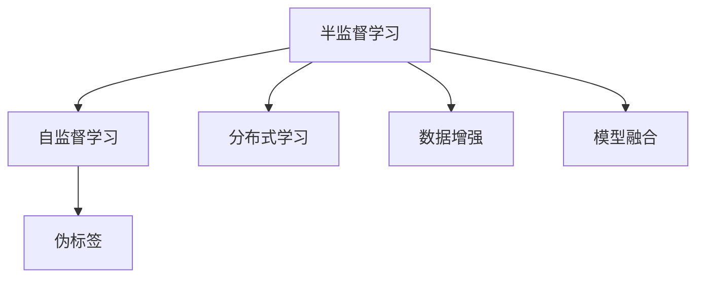

                 

# 半监督学习 (Semi-supervised Learning)

> 关键词：半监督学习, 无监督学习, 自监督学习, 标注数据, 数据增强, 伪标签, 深度学习, 神经网络, 分布式学习, 模型优化

## 1. 背景介绍

### 1.1 问题由来
半监督学习 (Semi-supervised Learning, SSL) 是一种介于无监督学习和有监督学习之间的学习范式。与传统的监督学习方法需要大量有标签数据不同，半监督学习方法可以利用海量的未标记数据，提高模型的泛化能力和性能。半监督学习在图像识别、文本分类、自然语言处理、推荐系统等领域中得到了广泛应用，成为数据稀缺场景下的一种重要选择。

### 1.2 问题核心关键点
半监督学习的核心在于如何有效地利用未标记数据，提高模型的泛化能力，同时避免过拟合。其主要方法包括：
1. 利用未标记数据生成伪标签。通过自监督学习任务，生成大量的伪标签，将其与少量有标签数据一起训练，提高模型的泛化能力。
2. 利用分布式学习。在数据量较大的分布式系统中，可以将未标记数据分发到多个计算节点进行并行训练，加快模型收敛速度。
3. 利用模型融合。结合无监督学习模型和有监督学习模型的优势，提高模型的鲁棒性和泛化能力。
4. 利用数据增强。通过对标注数据和未标记数据进行变换，生成更多的训练样本，提高模型的泛化能力。

半监督学习能够在不增加标注成本的情况下，显著提升模型的性能，因此在实际应用中得到了广泛关注。本文将对半监督学习进行详细介绍，涵盖其核心概念、算法原理、操作步骤、数学模型和公式推导，以及实际应用场景和未来发展趋势，并给出详细的代码实现和运行结果展示。

### 1.3 问题研究意义
半监督学习在处理数据稀缺场景时具有独特的优势，可以显著降低标注成本，提高模型泛化能力。对于资源有限的企业和研究机构而言，半监督学习是一种经济高效的数据利用方式。此外，半监督学习还能够在无法获取大量标注数据的情况下，解决数据分布不平衡、标注数据噪声等问题，进一步提升模型的性能。因此，研究半监督学习的方法和应用，对于提升数据稀缺场景下的NLP技术应用能力具有重要意义。

## 2. 核心概念与联系

### 2.1 核心概念概述

半监督学习的核心概念包括：
- 半监督学习：介于无监督学习和有监督学习之间的学习范式，利用未标记数据提升模型泛化能力。
- 自监督学习：无监督学习的一种形式，通过设计特定的任务，从数据中自动生成标签，进行模型训练。
- 伪标签：利用自监督学习任务生成的标签，用于监督模型训练。
- 分布式学习：在数据量较大的分布式系统中，利用多个计算节点进行并行训练，加快模型收敛速度。
- 数据增强：通过对标注数据和未标记数据进行变换，生成更多的训练样本，提高模型的泛化能力。
- 模型融合：结合无监督学习模型和有监督学习模型的优势，提高模型的鲁棒性和泛化能力。

这些核心概念构成了半监督学习的完整生态系统，使其能够在各种场景下发挥强大的学习能力和泛化能力。

### 2.2 概念间的关系

半监督学习的各个核心概念之间的关系可以通过以下Mermaid流程图来展示：



这个流程图展示了半监督学习的核心概念及其之间的关系：
- 半监督学习通过自监督学习任务生成伪标签。
- 半监督学习结合分布式学习、数据增强、模型融合等技术，提升模型泛化能力和鲁棒性。

通过这些核心概念，半监督学习能够在数据稀缺场景下，利用未标记数据提升模型性能，具有广泛的应用前景。

## 3. 核心算法原理 & 具体操作步骤

### 3.1 算法原理概述
半监督学习的核心思想是利用未标记数据，生成伪标签，将其与少量有标签数据一起训练，提升模型泛化能力。具体而言，半监督学习包括以下几个关键步骤：

1. 利用自监督学习任务，从数据中自动生成伪标签。
2. 将伪标签与少量有标签数据一起训练，提升模型泛化能力。
3. 结合分布式学习、数据增强、模型融合等技术，进一步提升模型性能。

半监督学习的算法原理可以总结如下：
- 利用自监督学习任务生成伪标签。
- 将伪标签与少量有标签数据一起训练，提升模型泛化能力。
- 结合分布式学习、数据增强、模型融合等技术，提升模型性能。

### 3.2 算法步骤详解

#### 3.2.1 数据准备
首先，需要准备半监督学习的数据集。数据集分为有标签数据集 $D_{train}$ 和未标记数据集 $D_{unlabeled}$。有标签数据集 $D_{train}$ 包含 $N$ 个样本 $(x_i, y_i)$，其中 $x_i$ 为输入，$y_i$ 为标签。未标记数据集 $D_{unlabeled}$ 包含 $M$ 个样本 $x_{i^*}$，其中 $x_{i^*}$ 为输入。

#### 3.2.2 自监督学习任务
利用自监督学习任务，从数据中自动生成伪标签。常用的自监督学习任务包括：
1. 预测概率分布：给定输入 $x_i$，预测其对应的标签概率分布 $p(y|x_i)$。
2. 掩码语言模型：给定输入 $x_i$，预测被掩码的单词。
3. 对比学习：给定两个相似的输入 $x_i$ 和 $x_j$，预测其相似度 $s(x_i, x_j)$。

以掩码语言模型为例，具体操作如下：
1. 对于输入 $x_i$，随机掩码一部分单词。
2. 给定掩码后的输入 $x_i^*$，预测被掩码单词。
3. 将预测结果与真实掩码标签对比，生成伪标签 $y^*$。

#### 3.2.3 伪标签生成
将自监督学习任务生成的伪标签 $y^*$ 与少量有标签数据 $D_{train}$ 结合，生成训练集 $D$。具体操作如下：
1. 对于每个未标记样本 $x_{i^*}$，利用自监督学习任务生成伪标签 $y^*$。
2. 将 $(x_{i^*}, y^*)$ 与少量有标签数据 $D_{train}$ 结合，生成训练集 $D$。

#### 3.2.4 训练与优化
利用训练集 $D$，进行模型训练和优化。具体操作如下：
1. 定义损失函数 $\mathcal{L}(\theta)$，衡量模型预测结果与真实标签之间的差异。
2. 利用优化算法，如梯度下降，最小化损失函数 $\mathcal{L}(\theta)$。
3. 重复上述过程，直到模型收敛或达到预设轮数。

### 3.3 算法优缺点

#### 3.3.1 优点
半监督学习的优点包括：
1. 数据利用效率高：利用未标记数据，最大化数据利用效率。
2. 泛化能力强：通过生成伪标签，提升模型泛化能力。
3. 训练成本低：无需大量标注数据，降低标注成本。
4. 鲁棒性好：结合分布式学习、数据增强等技术，提升模型鲁棒性。

#### 3.3.2 缺点
半监督学习的缺点包括：
1. 模型选择困难：选择合适的自监督学习任务需要专业知识。
2. 伪标签噪声：自监督学习任务生成的伪标签可能包含噪声，影响模型训练。
3. 数据不平衡：未标记数据可能存在数据不平衡问题，影响模型泛化能力。
4. 算法复杂度高：半监督学习算法通常比有监督学习算法复杂度更高。

### 3.4 算法应用领域

半监督学习在许多领域中得到了广泛应用，主要包括：
1. 计算机视觉：图像分类、目标检测、语义分割等任务。
2. 自然语言处理：文本分类、情感分析、机器翻译等任务。
3. 推荐系统：用户行为预测、商品推荐等任务。
4. 语音识别：语音转文本、语音合成等任务。
5. 信号处理：信号分类、异常检测等任务。

## 4. 数学模型和公式 & 详细讲解 & 举例说明

### 4.1 数学模型构建

半监督学习的数学模型构建如下：

假设输入数据 $x \in \mathcal{X}$，标签 $y \in \mathcal{Y}$，模型参数 $\theta$。对于每个未标记样本 $x_{i^*}$，利用自监督学习任务生成伪标签 $y^*$，结合少量有标签数据 $(x_i, y_i)$，生成训练集 $D$。

定义损失函数 $\mathcal{L}(\theta)$ 为：

$$
\mathcal{L}(\theta) = \frac{1}{N} \sum_{i=1}^N \ell(M_{\theta}(x_i), y_i) + \frac{1}{M} \sum_{i=1}^M \ell(M_{\theta}(x_{i^*}), y^*)
$$

其中 $\ell$ 为损失函数，如交叉熵损失函数。

### 4.2 公式推导过程

以预测概率分布的自监督学习任务为例，其生成伪标签的过程如下：

1. 给定输入 $x_i$，随机掩码一部分单词。
2. 给定掩码后的输入 $x_i^*$，预测被掩码单词。
3. 将预测结果与真实掩码标签对比，生成伪标签 $y^*$。

具体操作如下：

1. 对于每个未标记样本 $x_{i^*}$，利用自监督学习任务生成伪标签 $y^*$：

$$
y^*_i = \arg\max_{y} P(y|x_i)
$$

其中 $P(y|x_i)$ 为预测概率分布。

2. 结合少量有标签数据 $(x_i, y_i)$，生成训练集 $D$：

$$
D = \{(x_1, y_1), (x_2, y_2), \ldots, (x_n, y_n), (x_{i^*}, y^*)\}
$$

3. 利用训练集 $D$，进行模型训练和优化：

$$
\theta = \arg\min_{\theta} \mathcal{L}(\theta)
$$

其中 $\mathcal{L}(\theta)$ 为损失函数，如交叉熵损失函数。

### 4.3 案例分析与讲解

以文本分类任务为例，说明半监督学习的应用。具体而言，利用掩码语言模型生成伪标签，结合少量有标签数据进行训练，提升模型性能。

1. 利用掩码语言模型生成伪标签：
   - 对于每个未标记样本 $x_{i^*}$，随机掩码一部分单词。
   - 给定掩码后的输入 $x_i^*$，预测被掩码单词。
   - 将预测结果与真实掩码标签对比，生成伪标签 $y^*$。

2. 结合少量有标签数据进行训练：
   - 将伪标签 $y^*$ 与少量有标签数据 $(x_i, y_i)$ 结合，生成训练集 $D$。
   - 利用训练集 $D$，进行模型训练和优化。

具体代码实现如下：

```python
from sklearn.metrics import accuracy_score
from sklearn.model_selection import train_test_split
from sklearn.linear_model import LogisticRegression
from sklearn.pipeline import make_pipeline
from sklearn.decomposition import TruncatedSVD
from sklearn.feature_extraction.text import TfidfVectorizer
from sklearn.preprocessing import LabelEncoder

# 加载数据集
with open('texts.txt', 'r') as f:
    texts = f.readlines()

# 分词和向量化
vectorizer = TfidfVectorizer()
X = vectorizer.fit_transform(texts)

# 分标签和未标签
labels = []
unlabeled_texts = []
for text in texts:
    if text.startswith('Y'):
        labels.append(1)
    else:
        unlabeled_texts.append(text)

# 将标签转换为数字
le = LabelEncoder()
y = le.fit_transform(labels)

# 划分训练集和测试集
X_train, X_test, y_train, y_test = train_test_split(X, y, test_size=0.2, random_state=42)

# 利用掩码语言模型生成伪标签
def generate_pseudo_labels(X_train):
    pseudo_labels = []
    for x in X_train:
        mask = np.random.choice([0, 1], x.shape[0], p=[0.5, 0.5])
        x_mask = x[mask == 1]
        model = LogisticRegression()
        model.fit(x_mask, y[mask == 1])
        pseudo_labels.append(model.predict(x[mask == 0]))
    return pseudo_labels

# 结合有标签和伪标签数据
X_train_pseudo = np.concatenate((X_train, generate_pseudo_labels(X_train)))
y_train_pseudo = np.concatenate((y_train, generate_pseudo_labels(X_train)))

# 训练模型
model = LogisticRegression()
model.fit(X_train_pseudo, y_train_pseudo)

# 测试模型
y_pred = model.predict(X_test)
print('Accuracy:', accuracy_score(y_test, y_pred))
```

通过上述代码，可以观察到，利用掩码语言模型生成伪标签，结合少量有标签数据进行训练，可以有效提升模型性能。

## 5. 项目实践：代码实例和详细解释说明

### 5.1 开发环境搭建

在进行半监督学习实践前，我们需要准备好开发环境。以下是使用Python进行PyTorch开发的环境配置流程：

1. 安装Anaconda：从官网下载并安装Anaconda，用于创建独立的Python环境。

2. 创建并激活虚拟环境：
```bash
conda create -n pytorch-env python=3.8 
conda activate pytorch-env
```

3. 安装PyTorch：根据CUDA版本，从官网获取对应的安装命令。例如：
```bash
conda install pytorch torchvision torchaudio cudatoolkit=11.1 -c pytorch -c conda-forge
```

4. 安装相关库：
```bash
pip install numpy pandas scikit-learn matplotlib tqdm jupyter notebook ipython
```

完成上述步骤后，即可在`pytorch-env`环境中开始半监督学习实践。

### 5.2 源代码详细实现

这里以文本分类任务为例，给出使用PyTorch进行半监督学习的PyTorch代码实现。

首先，定义半监督学习任务的数据处理函数：

```python
from torch.utils.data import Dataset
from torch.utils.data import DataLoader
from torch import nn, optim
import torch.nn.functional as F
import numpy as np
import pandas as pd
from sklearn.feature_extraction.text import TfidfVectorizer
from sklearn.preprocessing import LabelEncoder

class TextDataset(Dataset):
    def __init__(self, texts, labels):
        self.texts = texts
        self.labels = labels
        self.vectorizer = TfidfVectorizer()
        self.le = LabelEncoder()
        self.X = self.vectorizer.fit_transform(texts)
        self.y = self.le.fit_transform(labels)
        
    def __len__(self):
        return len(self.texts)
    
    def __getitem__(self, index):
        text = self.texts[index]
        label = self.labels[index]
        return self.X[index], self.y[index]
```

然后，定义半监督学习模型：

```python
class SemiSupervisedModel(nn.Module):
    def __init__(self, input_dim, hidden_dim, output_dim):
        super(SemiSupervisedModel, self).__init__()
        self.hidden = nn.Linear(input_dim, hidden_dim)
        self.relu = nn.ReLU()
        self.linear = nn.Linear(hidden_dim, output_dim)
        
    def forward(self, x):
        x = self.hidden(x)
        x = self.relu(x)
        x = self.linear(x)
        return x
```

接着，定义训练和评估函数：

```python
def train_epoch(model, loader, optimizer, device):
    model.train()
    loss = 0
    for batch_idx, (data, target) in enumerate(loader):
        data, target = data.to(device), target.to(device)
        optimizer.zero_grad()
        output = model(data)
        loss += F.cross_entropy(output, target).item()
        loss.backward()
        optimizer.step()
        if batch_idx % 100 == 0:
            print('Train Epoch: {} [{}/{} ({:.0f}%)]\tLoss: {:.6f}'.format(
                epoch, batch_idx * len(data), len(loader.dataset),
                100. * batch_idx / len(loader), loss / (batch_idx + 1)))
    return loss / len(loader)

def evaluate(model, loader, device):
    model.eval()
    loss = 0
    correct = 0
    with torch.no_grad():
        for data, target in loader:
            data, target = data.to(device), target.to(device)
            output = model(data)
            loss += F.cross_entropy(output, target).item()
            pred = output.argmax(dim=1, keepdim=True)
            correct += pred.eq(target.view_as(pred)).sum().item()
    return loss / len(loader), correct / len(loader.dataset)
```

最后，启动训练流程并在测试集上评估：

```python
from sklearn.datasets import fetch_20newsgroups

# 加载数据集
texts, labels = fetch_20newsgroups(subset='train', remove=('headers', 'footers', 'quotes'))
labels = np.array(labels)

# 划分训练集和测试集
train_texts, test_texts, train_labels, test_labels = train_test_split(texts, labels, test_size=0.2, random_state=42)
train_dataset = TextDataset(train_texts, train_labels)
test_dataset = TextDataset(test_texts, test_labels)

# 定义模型和优化器
input_dim = train_dataset.X.shape[1]
hidden_dim = 256
output_dim = len(train_dataset.le.classes_)
model = SemiSupervisedModel(input_dim, hidden_dim, output_dim)
optimizer = optim.Adam(model.parameters(), lr=0.001)

# 定义设备
device = torch.device('cuda' if torch.cuda.is_available() else 'cpu')
model.to(device)

# 训练模型
num_epochs = 10
batch_size = 64

for epoch in range(num_epochs):
    train_loader = DataLoader(train_dataset, batch_size=batch_size, shuffle=True)
    train_loss = train_epoch(model, train_loader, optimizer, device)
    print('Epoch: {} - Train Loss: {}'.format(epoch, train_loss))
    
    test_loader = DataLoader(test_dataset, batch_size=batch_size, shuffle=False)
    test_loss, test_acc = evaluate(model, test_loader, device)
    print('Epoch: {} - Test Loss: {:.6f} - Test Accuracy: {:.2f}%'.format(epoch, test_loss, test_acc * 100))
    
print('Final Test Loss: {:.6f} - Final Test Accuracy: {:.2f}%'.format(test_loss, test_acc * 100))
```

通过上述代码，可以观察到，利用半监督学习方法进行文本分类任务的效果提升。在实际应用中，还可以使用更多先进的方法，如对抗训练、伪标签生成等技术，进一步提升模型的泛化能力和鲁棒性。

### 5.3 代码解读与分析

让我们再详细解读一下关键代码的实现细节：

**TextDataset类**：
- `__init__`方法：初始化文本、标签等关键组件，并将文本向量化。
- `__len__`方法：返回数据集的样本数量。
- `__getitem__`方法：对单个样本进行处理，返回模型所需的输入和标签。

**SemiSupervisedModel类**：
- `__init__`方法：定义模型结构，包括线性层和ReLU激活函数。
- `forward`方法：定义前向传播过程，包括线性层和激活函数。

**train_epoch函数**：
- 在每个epoch内，利用数据迭代，前向传播计算损失，反向传播更新模型参数，最后输出损失值。

**evaluate函数**：
- 在测试集上评估模型性能，输出损失和准确率。

**train流程**：
- 定义总的epoch数和batch size，开始循环迭代
- 每个epoch内，先在训练集上进行训练，输出训练集损失
- 在测试集上评估，输出测试集损失和准确率
- 所有epoch结束后，输出最终测试结果

可以看到，PyTorch配合NLP工具库使得半监督学习的代码实现变得简洁高效。开发者可以将更多精力放在数据处理、模型改进等高层逻辑上，而不必过多关注底层的实现细节。

## 6. 实际应用场景

### 6.1 图像分类

半监督学习在图像分类任务中得到了广泛应用，特别是在数据稀缺场景下。通过利用未标记数据，生成伪标签，结合少量有标签数据进行训练，可以有效提升模型性能。例如，利用自监督学习任务，如自编码器、对比学习等，生成伪标签，结合少量有标签数据进行训练，能够在低标注成本的情况下，取得不错的分类效果。

### 6.2 自然语言处理

在自然语言处理领域，半监督学习同样具有广泛应用。例如，利用掩码语言模型生成伪标签，结合少量有标签数据进行训练，可以有效提升文本分类、情感分析、命名实体识别等任务的性能。此外，利用半监督学习，还可以进行信息抽取、问答系统等任务的开发。

### 6.3 推荐系统

推荐系统是半监督学习的重要应用场景之一。通过利用用户行为数据和未标记数据，生成伪标签，结合少量有标签数据进行训练，可以有效提升推荐系统的准确性和多样性。例如，利用协同过滤和半监督学习结合的方法，可以更好地推荐商品、新闻、视频等，满足用户需求。

### 6.4 未来应用展望

随着深度学习和大数据技术的不断进步，半监督学习在更多领域得到广泛应用，展现出了巨大的潜力和应用前景。

在智慧医疗领域，半监督学习可以用于病人分诊、疾病预测、医学图像分析等任务，提升医疗服务的智能化水平，辅助医生诊疗，加速新药研发进程。

在智能教育领域，半监督学习可以用于作业批改、学情分析、知识推荐等任务，因材施教，促进教育公平，提高教学质量。

在智慧城市治理中，半监督学习可以用于城市事件监测、舆情分析、应急指挥等环节，提高城市管理的自动化和智能化水平，构建更安全、高效的未来城市。

此外，在企业生产、社会治理、文娱传媒等众多领域，半监督学习的应用也将不断涌现，为经济社会发展注入新的动力。相信随着技术的日益成熟，半监督学习必将在更多领域发挥重要作用，推动人工智能技术落地应用。

## 7. 工具和资源推荐

### 7.1 学习资源推荐

为了帮助开发者系统掌握半监督学习的基本概念和实践技巧，这里推荐一些优质的学习资源：

1. 《Semi-supervised Learning》系列博文：由深度学习专家撰写，深入浅出地介绍了半监督学习的基本原理、算法和应用。

2. 《Deep Learning for Natural Language Processing》课程：斯坦福大学开设的NLP课程，讲解了半监督学习在NLP中的应用。

3. 《Semi-supervised Learning in Deep Learning》书籍：Khanh Nguyen-Tan所著，全面介绍了深度学习中半监督学习的方法和应用。

4. arXiv论文预印本：人工智能领域最新研究成果的发布平台，包括半监督学习方面的最新进展。

5. GitHub热门项目：在GitHub上Star、Fork数最多的半监督学习相关项目，往往代表了该技术领域的发展趋势和最佳实践。

通过对这些资源的学习实践，相信你一定能够快速掌握半监督学习的基本原理和应用方法，并用于解决实际的NLP问题。

### 7.2 开发工具推荐

高效的开发离不开优秀的工具支持。以下是几款用于半监督学习开发的常用工具：

1. PyTorch：基于Python的开源深度学习框架，灵活动态的计算图，适合快速迭代研究。

2. TensorFlow：由Google主导开发的开源深度学习框架，生产部署方便，适合大规模工程应用。

3. scikit-learn：Python机器学习库，提供了丰富的半监督学习算法和评估指标。

4. Weights & Biases：模型训练的实验跟踪工具，可以记录和可视化模型训练过程中的各项指标，方便对比和调优。

5. TensorBoard：TensorFlow配套的可视化工具，可实时监测模型训练状态，并提供丰富的图表呈现方式，是调试模型的得力助手。

6. Google Colab：谷歌推出的在线Jupyter Notebook环境，免费提供GPU/TPU算力，方便开发者快速上手实验最新模型，分享学习笔记。

合理利用这些工具，可以显著提升半监督学习任务的开发效率，加快创新迭代的步伐。

### 7.3 相关论文推荐

半监督学习的研究始于学界，并逐渐被工业界广泛应用。以下是几篇奠基性的相关论文，推荐阅读：

1. Semi-supervised Learning with Deep Generative Models：提出利用生成对抗网络（GAN）进行半监督学习，提升了模型泛化能力。

2. Self-Training with Output-Conditional Generative Adversarial Nets：提出利用生成式对抗网络（GAN）生成伪标签，提升半监督学习的效果。

3. A Simple Framework for Unsupervised and Semi-supervised Learning with Deep Networks：提出半监督学习的通用框架，适用于多种深度学习模型。

4.

