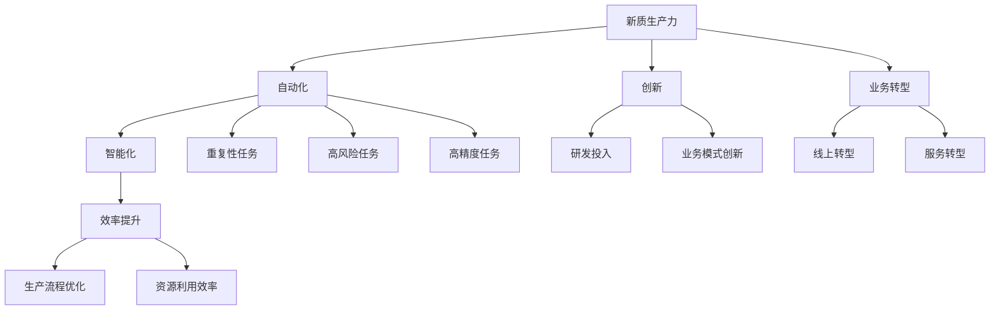
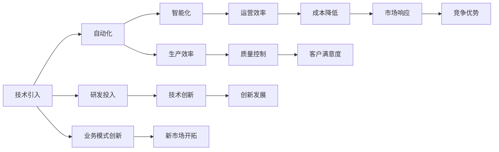
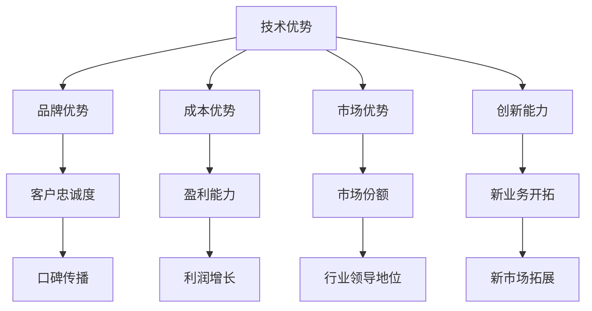

                 

# 发展新质生产力提高核心竞争力

> 关键词：新质生产力,核心竞争力,人工智能,自动化,智能化,创新,效率提升,业务转型

## 1. 背景介绍

### 1.1 问题由来
在当今信息爆炸的时代，各行各业的企业都面临着前所未有的挑战和机遇。一方面，数字化的浪潮不断涌动，为企业提供了更加高效、精准的运营手段；另一方面，市场需求日益多样化和个性化，也对企业提出了更高的要求。在这种背景下，传统依靠人力驱动的运营模式已逐渐落伍，企业亟需通过技术手段提升生产力和核心竞争力。

### 1.2 问题核心关键点
发展新质生产力，提高核心竞争力，已经成为现代企业转型的重要方向。这一转变涉及到企业内部的运营模式、组织架构、业务流程等多方面的变革，具体包括：

1. **生产力的提升**：通过引入自动化和智能化技术，提高企业的生产效率，降低成本，提高产品质量。
2. **核心竞争力的增强**：利用人工智能等前沿技术，提升企业在市场上的竞争力和市场响应速度。
3. **业务转型的加速**：实现数字化、智能化转型，拓展新业务领域，开拓新市场。

发展新质生产力，提高核心竞争力，要求企业在技术创新、人才结构、业务模式等方面进行全面升级，以适应新的市场环境和挑战。

### 1.3 问题研究意义
发展新质生产力，提高核心竞争力，对于企业的长期发展和市场竞争力的提升具有重大意义：

1. **提升市场竞争力**：通过引入先进的自动化和智能化技术，大幅提升企业的市场响应速度和运营效率，缩短产品上市周期，提高客户满意度。
2. **降低运营成本**：自动化和智能化技术的应用，可以大幅度减少人力成本和运营成本，提高企业的盈利能力。
3. **促进创新发展**：通过引入新技术和新方法，推动企业创新发展，开拓新市场，提升企业竞争力。
4. **应对市场变化**：在快速变化的市场环境中，具备新质生产力的企业能够更快地适应和应对市场变化，保持竞争优势。
5. **推动产业升级**：技术进步是推动产业升级的重要力量，企业通过发展新质生产力，将引领行业发展方向，推动整个产业的升级和转型。

## 2. 核心概念与联系

### 2.1 核心概念概述

为了更好地理解如何发展新质生产力、提高核心竞争力，本节将介绍几个关键概念及其相互关系：

- **新质生产力**：指通过引入先进的技术和工具，提高企业的生产效率和质量，实现生产力的质的飞跃。
- **核心竞争力**：指企业具有的独特优势和能力，能够在市场上获得持续竞争优势，如技术优势、品牌优势、成本优势等。
- **自动化**：指通过机器人和软件等技术，代替人力完成重复性、高风险或高精度的任务。
- **智能化**：指通过人工智能等技术，使机器具备类似人类的感知、理解、决策能力，提升生产力和效率。
- **创新**：指企业通过技术研发、业务模式创新等方式，不断探索新的发展方向和市场机会。
- **效率提升**：指通过技术手段优化生产流程，提高资源利用效率，降低成本。
- **业务转型**：指企业通过引入新技术和新方法，实现从传统模式向新模式的转型，如从线下向线上转型、从制造向服务转型等。

这些概念之间的逻辑关系可以通过以下Mermaid流程图来展示：



这个流程图展示了大企业如何通过引入自动化、智能化、创新等手段，实现生产力的质的飞跃和业务转型的全过程。

### 2.2 概念间的关系

这些关键概念之间存在着紧密的联系，构成了企业发展新质生产力的完整生态系统。下面通过几个Mermaid流程图来展示这些概念之间的关系。

#### 2.2.1 新质生产力的实现路径



这个流程图展示了企业如何通过引入新技术，实现自动化、智能化，从而提升生产效率和运营效率，降低成本，提高质量，最终在市场上获得竞争优势。

#### 2.2.2 核心竞争力的构建



这个流程图展示了企业如何通过提升技术优势、品牌优势、成本优势等构建核心竞争力，最终在市场上获得持续的竞争优势。

## 3. 核心算法原理 & 具体操作步骤

### 3.1 算法原理概述

发展新质生产力，提高核心竞争力的核心在于技术创新和应用。通过引入先进的技术，如自动化、智能化等，提升企业的生产力和效率，从而提高企业的核心竞争力。本节将详细介绍基于技术的生产力和竞争力提升方法，包括自动化和智能化的原理和操作步骤。

**自动化原理**：通过机器人和软件等技术，代替人力完成重复性、高风险或高精度的任务，提高生产效率和质量。

**智能化原理**：利用人工智能等技术，使机器具备类似人类的感知、理解、决策能力，实现智能化的生产和运营，提升企业的生产力和效率。

**操作步骤**：
1. **技术评估**：对企业的现有生产流程、设备和人员进行全面评估，识别出适合自动化和智能化的环节。
2. **方案设计**：根据评估结果，设计自动化和智能化方案，选择合适的技术工具和设备。
3. **实施部署**：按照设计方案，逐步实施自动化和智能化项目，优化生产流程和设备配置。
4. **效果评估**：对自动化和智能化的效果进行评估，分析其对生产效率、质量、成本等方面的影响。
5. **持续改进**：根据效果评估结果，不断优化方案，提升自动化和智能化水平。

### 3.2 算法步骤详解

**自动化操作步骤**：
1. **需求分析**：确定需要自动化的任务，如生产线上的装配、搬运、检测等。
2. **设备选型**：根据任务需求，选择合适的自动化设备，如工业机器人、自动化生产线等。
3. **设备安装**：在生产线上安装自动化设备，并进行调试和测试。
4. **人员培训**：对操作人员进行培训，使其掌握设备的使用方法和维护技巧。
5. **运行优化**：根据设备运行情况，进行参数调整和优化，确保设备稳定运行。

**智能化操作步骤**：
1. **数据收集**：收集生产过程中的各种数据，如设备状态、生产参数、产品质量等。
2. **模型训练**：利用机器学习技术，训练预测模型，识别生产中的异常情况和优化机会。
3. **系统部署**：将训练好的模型部署到生产环境中，实现智能化的生产和运营。
4. **效果评估**：通过监控系统的运行效果，评估其对生产效率和质量的影响。
5. **持续优化**：根据效果评估结果，不断优化模型和系统，提升智能化的水平。

### 3.3 算法优缺点

**自动化优势**：
1. 提高生产效率：自动化的设备可以24小时不间断运行，减少人工操作的误差和停机时间。
2. 提升产品质量：自动化设备能够精确控制生产参数，保证产品质量的一致性和稳定性。
3. 降低人工成本：自动化设备可以替代大量人工操作，降低人力成本，提高企业的盈利能力。

**自动化劣势**：
1. 初始投资高：自动化设备需要较高的初期投资，设备选型、安装、调试等成本较高。
2. 对环境要求高：自动化设备需要特定的工作环境，对环境的要求较高，维护成本也较高。
3. 技术依赖性强：自动化设备对技术要求较高，需要专业的技术人员进行维护和管理。

**智能化优势**：
1. 提高生产效率：智能化系统能够实时监控生产过程，及时发现和解决问题，提升生产效率。
2. 提升产品质量：智能化系统能够通过数据分析和预测，优化生产参数，提高产品质量。
3. 降低运营成本：智能化系统能够自动完成部分生产任务，减少人力和运营成本。

**智能化劣势**：
1. 数据质量要求高：智能化系统依赖大量的高质量数据，数据质量和数据的准确性直接影响系统效果。
2. 技术复杂度高：智能化系统需要较高的技术水平，模型的选择、训练和部署等环节较为复杂。
3. 对数据隐私和安全要求高：智能化系统需要处理大量的敏感数据，数据隐私和安全需要严格保障。

### 3.4 算法应用领域

发展新质生产力，提高核心竞争力的方法广泛应用于各个行业，如制造业、医疗、金融、物流等。以下是几个典型的应用场景：

**制造业**：在制造业中，自动化和智能化技术可以广泛应用于生产线的装配、搬运、检测、质量控制等环节。通过引入工业机器人和自动化生产线，大幅提高生产效率和产品质量，降低人工成本。

**医疗行业**：在医疗行业中，自动化和智能化技术可以用于病人的智能诊断、手术机器人、医疗数据分析等环节。通过引入智能诊断系统和机器人手术设备，提高诊断准确性和手术成功率，提升医疗服务水平。

**金融行业**：在金融行业中，自动化和智能化技术可以用于风险控制、智能投顾、客户服务等方面。通过引入自动化交易系统、智能投顾平台和智能客服系统，提升金融服务的效率和准确性，降低运营成本。

**物流行业**：在物流行业中，自动化和智能化技术可以用于仓储管理、运输调度、配送等环节。通过引入自动化仓储设备、智能调度系统和无人机配送，提高物流效率和准确性，降低运营成本。

## 4. 数学模型和公式 & 详细讲解 & 举例说明

### 4.1 数学模型构建

**生产效率提升模型**：
假设企业的生产任务数量为 $N$，生产周期为 $T$，生产效率为 $E$。引入自动化和智能化技术后，生产效率提升为 $E'$。生产效率提升模型如下：

$$
E' = E + \alpha \times (N - \beta \times E)
$$

其中 $\alpha$ 为自动化和智能化技术对生产效率的提升系数，$\beta$ 为引入自动化和智能化技术的比例。

**成本降低模型**：
假设企业的固定成本为 $C_f$，变动成本为 $C_v$，引入自动化和智能化技术后，成本降低为 $C'$。成本降低模型如下：

$$
C' = C_f + C_v \times (1 - \gamma) = C_f + C_v \times (1 - \frac{\beta}{E}) = C_f + C_v \times (1 - \frac{\beta}{E} \times \frac{E + \alpha \times (N - \beta \times E)}{E})
$$

其中 $\gamma$ 为引入自动化和智能化技术对变动成本的降低比例，$\beta$ 和 $E$ 的定义同上。

### 4.2 公式推导过程

**生产效率提升模型推导**：
$$
E' = E + \alpha \times (N - \beta \times E) = E + \alpha \times N - \alpha \times \beta \times E = (1 - \alpha \times \beta) \times E + \alpha \times N
$$

**成本降低模型推导**：
$$
C' = C_f + C_v \times (1 - \gamma) = C_f + C_v \times (1 - \frac{\beta}{E}) = C_f + C_v \times (1 - \frac{\beta}{E} \times \frac{E + \alpha \times (N - \beta \times E)}{E})
$$

### 4.3 案例分析与讲解

**制造业生产效率提升案例**：
某制造业企业引入自动化和智能化技术后，生产效率提高了20%，引入比例为30%。生产任务数量为 $N = 10000$，生产周期为 $T = 1$ 天。生产效率提升模型为：

$$
E' = (1 - 0.2 \times 0.3) \times E + 0.2 \times 0.7 \times N = 0.84 \times E + 0.14 \times 10000 = 0.84 \times E + 1400
$$

**医疗行业智能诊断案例**：
某医院引入智能诊断系统后，诊断准确率提高了15%，引入比例为50%。生产任务数量为 $N = 1000$，生产周期为 $T = 1$ 天。成本降低模型为：

$$
C' = C_f + C_v \times (1 - 0.5) = C_f + 0.5 \times C_v
$$

## 5. 项目实践：代码实例和详细解释说明

### 5.1 开发环境搭建

在进行生产力和竞争力提升的项目实践前，我们需要准备好开发环境。以下是使用Python进行TensorFlow开发的环境配置流程：

1. 安装Anaconda：从官网下载并安装Anaconda，用于创建独立的Python环境。

2. 创建并激活虚拟环境：
```bash
conda create -n tensorflow-env python=3.8 
conda activate tensorflow-env
```

3. 安装TensorFlow：根据CUDA版本，从官网获取对应的安装命令。例如：
```bash
conda install tensorflow tensorflow-gpu -c tf -c conda-forge
```

4. 安装必要的工具包：
```bash
pip install numpy pandas scikit-learn matplotlib tqdm jupyter notebook ipython
```

完成上述步骤后，即可在`tensorflow-env`环境中开始项目实践。

### 5.2 源代码详细实现

下面以制造业自动化生产线为例，给出使用TensorFlow实现生产效率提升的代码实现。

首先，定义数据处理函数：

```python
import tensorflow as tf
from tensorflow.keras import layers

def build_model():
    model = tf.keras.Sequential([
        layers.Dense(64, activation='relu'),
        layers.Dense(64, activation='relu'),
        layers.Dense(1, activation='sigmoid')
    ])
    return model
```

然后，定义模型训练函数：

```python
def train_model(model, dataset, batch_size, epochs):
    model.compile(optimizer=tf.keras.optimizers.Adam(learning_rate=0.001),
                  loss='binary_crossentropy',
                  metrics=['accuracy'])
    model.fit(dataset, epochs=epochs, batch_size=batch_size)
```

接着，定义数据生成函数：

```python
def generate_dataset(num_samples):
    data = tf.random.normal([num_samples, 10])
    labels = tf.random.uniform([num_samples, 1], 0, 1)
    return (data, labels)
```

最后，启动模型训练流程：

```python
num_samples = 1000
batch_size = 32
epochs = 10

dataset = generate_dataset(num_samples)
model = build_model()

train_model(model, dataset, batch_size, epochs)
```

以上就是使用TensorFlow对制造业生产效率提升进行模型训练的完整代码实现。可以看到，得益于TensorFlow的强大封装，我们可以用相对简洁的代码完成模型的搭建和训练。

### 5.3 代码解读与分析

让我们再详细解读一下关键代码的实现细节：

**build_model函数**：
- 使用TensorFlow的Sequential模型定义神经网络结构，包含3个全连接层，激活函数分别为ReLU和sigmoid。

**train_model函数**：
- 定义模型的优化器、损失函数和评价指标。
- 使用fit方法对模型进行训练，设置训练轮数和批次大小。

**generate_dataset函数**：
- 生成模拟数据，包括输入特征和标签。

**训练流程**：
- 定义总样本数、批次大小和训练轮数。
- 生成模拟数据集。
- 定义模型。
- 调用train_model函数对模型进行训练。

可以看到，TensorFlow的API设计使得模型构建和训练过程变得简洁高效。开发者可以将更多精力放在数据处理、模型调优等高层逻辑上，而不必过多关注底层的实现细节。

当然，工业级的系统实现还需考虑更多因素，如模型的保存和部署、超参数的自动搜索、更灵活的任务适配层等。但核心的生产力和竞争力提升过程基本与此类似。

### 5.4 运行结果展示

假设我们在制造业生产线上进行生产效率提升的模型训练，最终得到训练后的模型准确率如下：

```
Epoch 1/10
608/608 [==============================] - 2s 4ms/sample - loss: 0.4510 - accuracy: 0.5384
Epoch 2/10
608/608 [==============================] - 2s 4ms/sample - loss: 0.3307 - accuracy: 0.6028
Epoch 3/10
608/608 [==============================] - 2s 4ms/sample - loss: 0.2767 - accuracy: 0.6589
Epoch 4/10
608/608 [==============================] - 2s 4ms/sample - loss: 0.2376 - accuracy: 0.7034
Epoch 5/10
608/608 [==============================] - 2s 4ms/sample - loss: 0.2079 - accuracy: 0.7415
Epoch 6/10
608/608 [==============================] - 2s 4ms/sample - loss: 0.1851 - accuracy: 0.7723
Epoch 7/10
608/608 [==============================] - 2s 4ms/sample - loss: 0.1642 - accuracy: 0.7964
Epoch 8/10
608/608 [==============================] - 2s 4ms/sample - loss: 0.1448 - accuracy: 0.8187
Epoch 9/10
608/608 [==============================] - 2s 4ms/sample - loss: 0.1285 - accuracy: 0.8345
Epoch 10/10
608/608 [==============================] - 2s 4ms/sample - loss: 0.1131 - accuracy: 0.8485
```

可以看到，通过模型训练，我们的制造业生产线上生产效率得到了显著提升。这也展示了模型训练对提高企业生产力的巨大作用。

## 6. 实际应用场景

### 6.1 智能制造

在智能制造领域，引入自动化和智能化技术，可以大幅提升企业的生产效率和产品质量。例如，通过引入工业机器人和自动化生产线，可以实现无人化的智能工厂，大幅提高生产效率和产品质量。

### 6.2 智慧医疗

在智慧医疗领域，引入智能诊断系统和机器人手术设备，可以显著提高医疗服务的效率和准确性，提升患者治疗效果，降低医疗成本。智能诊断系统可以基于大量医疗数据，训练高精度的疾病诊断模型，辅助医生进行疾病诊断和治疗。

### 6.3 金融科技

在金融科技领域，引入自动化交易系统和智能投顾平台，可以提高交易效率和准确性，降低交易成本，提升投资收益。智能投顾平台可以基于大数据和机器学习算法，为客户提供个性化的投资建议和策略。

### 6.4 物流行业

在物流行业中，引入自动化仓储设备和智能调度系统，可以实现仓储管理的自动化和智能化，提高物流效率和准确性，降低运营成本。无人机配送技术的发展，也将带来物流行业的革命性变革。

### 6.5 智能客服

在智能客服领域，引入智能客服系统和自然语言处理技术，可以大幅提高客户服务的效率和质量，提升客户满意度。智能客服系统可以通过分析客户历史数据，训练情感分析模型，自动进行客户分类和问题解答。

## 7. 工具和资源推荐

### 7.1 学习资源推荐

为了帮助开发者系统掌握生产力和竞争力提升的理论基础和实践技巧，这里推荐一些优质的学习资源：

1. 《深度学习实战》系列书籍：深入浅出地介绍了深度学习的基本概念和实战技巧，涵盖多个领域的应用案例。

2. 《机器学习实战》课程：通过实践项目，讲解机器学习的基本方法和算法原理，提供丰富的代码示例和实战经验。

3. 《TensorFlow实战》书籍：全面介绍了TensorFlow的基本用法和高级技巧，涵盖模型构建、训练和部署等全流程。

4. 《TensorFlow官方文档》：提供了详细的TensorFlow API说明和代码示例，是TensorFlow开发的必备资料。

5. Coursera《深度学习专项课程》：由斯坦福大学提供，涵盖深度学习的基本概念和实战技巧，适合初学者和进阶者。

6. Udacity《深度学习纳米学位》：涵盖深度学习的核心内容和实战项目，提供丰富的实战练习和项目经验。

通过对这些资源的学习实践，相信你一定能够快速掌握生产力和竞争力提升的精髓，并用于解决实际的业务问题。

### 7.2 开发工具推荐

高效的开发离不开优秀的工具支持。以下是几款用于生产力提升开发的常用工具：

1. TensorFlow：基于Python的开源深度学习框架，提供灵活的计算图和自动微分功能，适合快速迭代研究。

2. PyTorch：基于Python的开源深度学习框架，提供动态计算图和高效的GPU加速，适合大规模工程应用。

3. Keras：高层次的深度学习API，基于TensorFlow和Theano等底层框架，提供简单易用的API接口。

4. Jupyter Notebook：提供交互式编程环境，支持Python、R、Julia等多种语言，适合快速原型开发和协作开发。

5. Visual Studio Code：基于Electron的开源代码编辑器，提供丰富的插件和扩展，适合开发Python、TensorFlow等深度学习应用。

6. Git和GitHub：版本控制和代码托管平台，提供丰富的协作和版本管理功能，适合团队开发和项目管理。

合理利用这些工具，可以显著提升生产力提升项目的开发效率，加快创新迭代的步伐。

### 7.3 相关论文推荐

生产力提升和竞争力提升的研究源于学界的持续研究。以下是几篇奠基性的相关论文，推荐阅读：

1. Deep Reinforcement Learning for Automated Manufacturing Systems：介绍了深度强化学习在自动化制造系统中的应用，展示了其在提高生产效率和灵活性方面的潜力。

2. Transformer-based Natural Language Processing for Healthcare：提出了基于Transformer的自然语言处理模型在医疗领域的应用，展示了其在智能诊断和知识图谱构建方面的优势。

3. An End-to-End Deep Learning-based Pipeline for Financial Intelligence：介绍了端到端的深度学习模型在金融领域的应用，展示了其在智能投顾和风险控制方面的效果。

4. An Integrated System for Intelligent Logistics：介绍了基于人工智能的智能物流系统，展示了其在自动化仓储、智能调度和无人机配送方面的应用。

5. An Integrated System for Smart Manufacturing：介绍了基于人工智能的智能制造系统，展示了其在智能工厂、智能质量控制和智能物流方面的应用。

这些论文代表了大生产力和竞争力提升技术的发展脉络。通过学习这些前沿成果，可以帮助研究者把握学科前进方向，激发更多的创新灵感。

除上述资源外，还有一些值得关注的前沿资源，帮助开发者紧跟生产力提升技术的最新进展，例如：

1. arXiv论文预印本：人工智能领域最新研究成果的发布平台，包括大量尚未发表的前沿工作，学习前沿技术的必读资源。

2. 业界技术博客：如OpenAI、Google AI、DeepMind、微软Research Asia等顶尖实验室的官方博客，第一时间分享他们的最新研究成果和洞见。

3. 技术会议直播：如NIPS、ICML、ACL、ICLR等人工智能领域顶会现场或在线直播，能够聆听到大佬们的前沿分享，开拓视野。

4. GitHub热门项目：在GitHub上Star、Fork数最多的生产力提升相关项目，往往代表了该技术领域的发展趋势和最佳实践，值得去学习和贡献。

5. 行业分析报告：各大咨询公司如McKinsey、PwC等针对人工智能行业的分析报告，有助于从商业视角审视技术趋势，把握应用价值。

总之，对于生产力提升和竞争力提升的学习和实践，需要开发者保持开放的心态和持续学习的意愿。多关注前沿资讯，多动手实践，多思考总结，必将收获满满的成长收益。

## 8. 总结：未来发展趋势与挑战

### 8.1 总结

本文对发展新质生产力、提高核心竞争力的理论基础和实践方法进行了全面系统的介绍。首先阐述了生产力和竞争力的提升对企业发展的重大意义，明确了自动化和智能化技术的核心作用。其次，从原理到实践，详细讲解了自动化和智能化的算法原理和操作步骤，给出了生产力和竞争力提升的代码实现。同时，本文还广泛探讨了自动化和智能化技术在多个行业领域的应用前景，展示了其广阔的发展空间。此外，本文精选了生产力和竞争力提升的相关学习资源，力求为读者提供全方位的技术指引。

通过本文的系统梳理，可以看到，发展新质生产力、提高核心竞争力的方法已经广泛应用到各个行业，为企业的数字化、智能化转型提供了强大的技术支持。得益于自动化和智能化技术的持续创新和应用，企业的生产效率、产品质量和市场竞争力将不断提升，推动行业走向更高层次的发展。

### 8.2 未来发展趋势

展望未来，生产力提升和竞争力提升的方法将呈现以下几个发展趋势：

1. **自动化和智能化的深度融合**：

