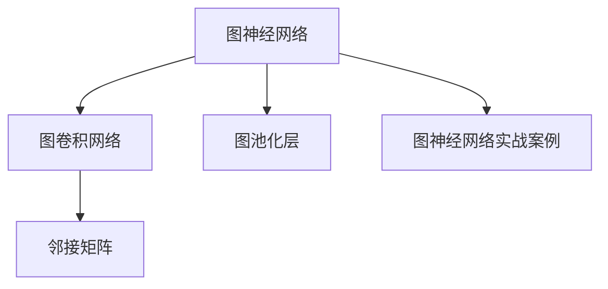
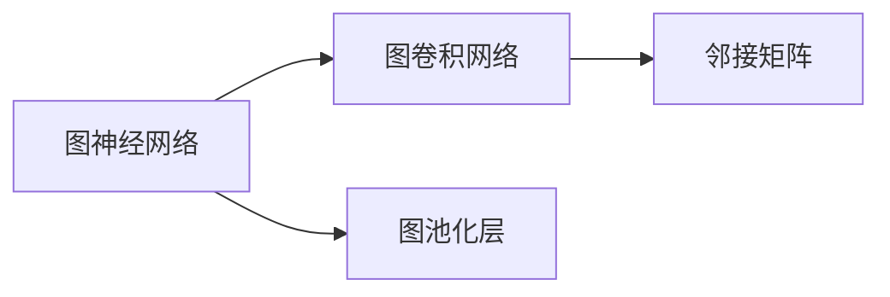
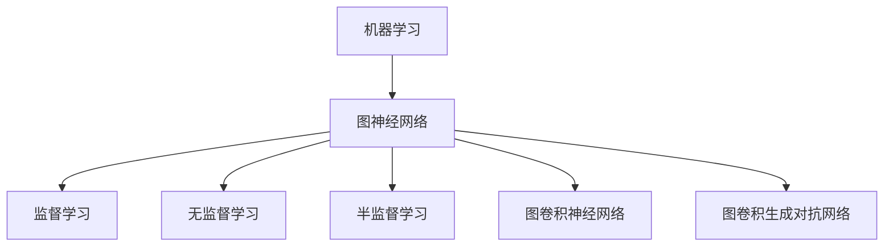
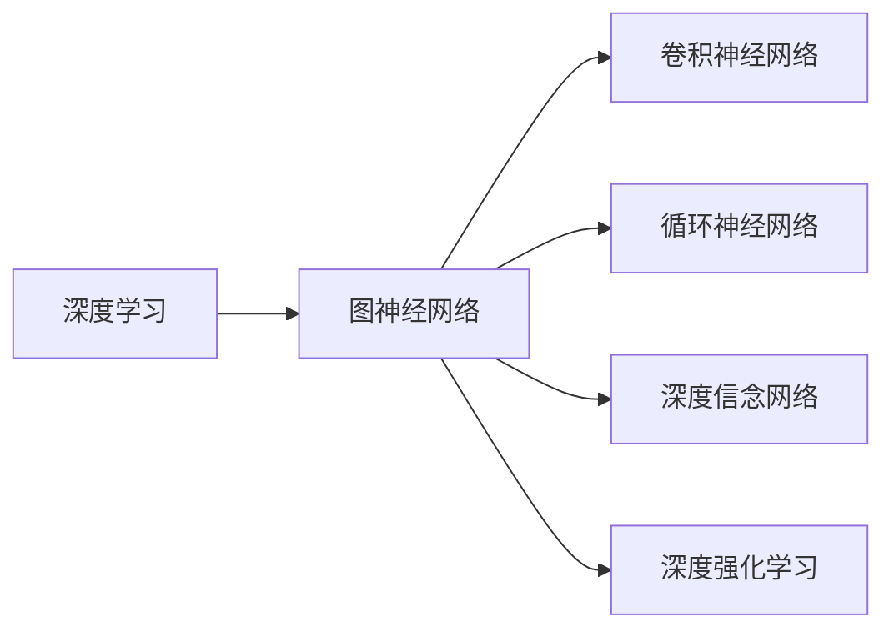
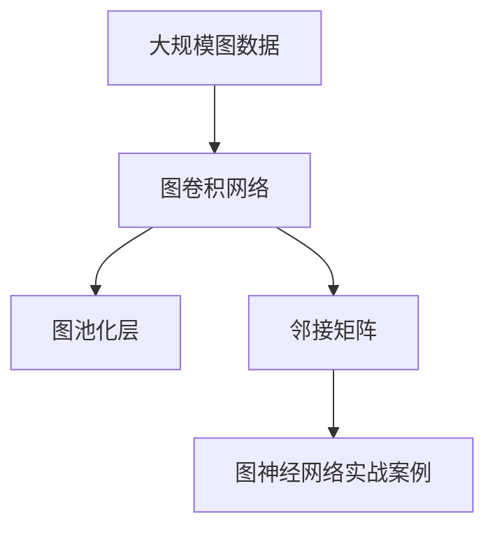

                 

# 图神经网络原理与代码实战案例讲解

> 关键词：图神经网络(Graph Neural Network, GNN), 图卷积网络(Graph Convolutional Network, GCN), 图神经网络实战案例, 图数据分析, 图机器学习

## 1. 背景介绍

### 1.1 问题由来
近年来，随着深度学习技术的不断发展，图神经网络（Graph Neural Network, GNN）作为一种新兴的深度学习模型，在处理图结构数据方面展现出了巨大的潜力。图神经网络通过模拟图的结构信息传播过程，能够有效捕捉节点和边之间的关系，广泛应用于社交网络分析、知识图谱构建、推荐系统、生物信息学等众多领域。

然而，相较于传统的神经网络，图神经网络的概念较为新颖，理论基础和实现技术也相对复杂。如何在实际项目中有效应用图神经网络，特别是如何在数据处理、模型构建、训练调参等方面进行全面的优化，成为了众多研究人员和开发者关注的重点。

### 1.2 问题核心关键点
图神经网络的核心思想是通过图结构数据上的信息传播，使得节点能够利用邻居节点的特征进行信息融合，从而生成更高层次的表示。图神经网络的学习过程可以看作是对图结构的序列化处理，即从源节点开始，依次通过邻居节点进行信息传播，最终得到整个图的聚合表示。

图神经网络通常由以下几个核心组件构成：
- **图卷积层（Graph Convolution Layer, GCN Layer）**：负责节点信息的局部更新，通过邻居节点的特征进行加权求和，生成新的节点表示。
- **图池化层（Graph Pooling Layer）**：负责图的全局信息聚合，通过聚合节点表示生成图的整体表示。
- **全连接层（Fully Connected Layer）**：负责将图表示转化为具体的输出，如分类、回归等任务。

图神经网络的学习过程可以概括为：
1. 初始化节点特征：为图中的每个节点随机生成初始特征向量。
2. 迭代信息传播：通过图卷积层进行信息传播，更新节点特征。
3. 图池化：通过图池化层聚合图信息，生成图的整体表示。
4. 全连接层输出：通过全连接层将图表示转化为输出。

## 2. 核心概念与联系

### 2.1 核心概念概述

为了更好地理解图神经网络，本节将介绍几个密切相关的核心概念：

- **图神经网络(GNN)**：以图结构数据为输入，通过信息传播机制生成节点表示和图表示的深度学习模型。GNN广泛应用于社交网络分析、推荐系统、知识图谱构建等领域。
- **图卷积网络(Graph Convolutional Network, GCN)**：图神经网络中最常见的架构，通过图卷积层进行节点信息的局部更新，利用邻居节点的特征进行加权求和，生成新的节点表示。
- **图池化层（Graph Pooling Layer）**：用于聚合图信息，将多个节点表示合并为一个图表示。常用的图池化方法包括Max Pooling、Mean Pooling、LSTM等。
- **邻接矩阵（Adjacency Matrix）**：表示图中节点之间关系的矩阵，通常用于表示图结构数据。
- **图神经网络实战案例**：具体的应用场景和项目实践，如社交网络分析、推荐系统、知识图谱构建等。

这些核心概念之间的逻辑关系可以通过以下Mermaid流程图来展示：



这个流程图展示了大语言模型微调过程中各个核心概念的关系和作用：

1. 图神经网络接收图结构数据作为输入。
2. 通过图卷积层进行局部信息更新，生成节点表示。
3. 通过图池化层聚合图信息，生成图表示。
4. 最终通过全连接层输出预测结果。

### 2.2 概念间的关系

这些核心概念之间存在着紧密的联系，形成了图神经网络学习的完整生态系统。下面我们通过几个Mermaid流程图来展示这些概念之间的关系。

#### 2.2.1 图神经网络学习范式



这个流程图展示了图神经网络的学习范式：
- 图神经网络接收邻接矩阵作为输入，表示图结构数据。
- 通过图卷积层进行信息传播，生成节点表示。
- 通过图池化层聚合图信息，生成图的整体表示。
- 最终通过全连接层输出预测结果。

#### 2.2.2 图神经网络与机器学习的关系



这个流程图展示了图神经网络在机器学习中的应用场景：
- 图神经网络作为机器学习的一种形式，可以应用于监督学习、无监督学习和半监督学习任务。
- 图卷积神经网络是图神经网络的一种实现方式，常用于图像处理和信号处理等任务。
- 图卷积生成对抗网络（GCGAN）利用生成对抗网络的机制，进一步提升了图神经网络的生成能力。

#### 2.2.3 图神经网络与深度学习的关系



这个流程图展示了图神经网络在深度学习中的应用场景：
- 图神经网络作为深度学习的一种形式，可以与卷积神经网络、循环神经网络和深度信念网络等深度学习模型进行结合。
- 图卷积神经网络是图神经网络的一种实现方式，常用于图像处理和信号处理等任务。
- 图卷积生成对抗网络（GCGAN）利用生成对抗网络的机制，进一步提升了图神经网络的生成能力。

### 2.3 核心概念的整体架构

最后，我们用一个综合的流程图来展示这些核心概念在大语言模型微调过程中的整体架构：



这个综合流程图展示了从图卷积网络到图池化层，再到图神经网络实战案例的完整过程。

## 3. 核心算法原理 & 具体操作步骤
### 3.1 算法原理概述

图神经网络通过模拟图的结构信息传播过程，使得节点能够利用邻居节点的特征进行信息融合，从而生成更高层次的表示。图神经网络的学习过程可以看作是对图结构的序列化处理，即从源节点开始，依次通过邻居节点进行信息传播，最终得到整个图的聚合表示。

图神经网络的核心思想是通过信息传播机制，使得节点能够利用邻居节点的特征进行信息融合，从而生成更高层次的表示。图神经网络的学习过程可以看作是对图结构的序列化处理，即从源节点开始，依次通过邻居节点进行信息传播，最终得到整个图的聚合表示。

形式化地，假设图结构为$G=(V, E)$，其中$V$为节点集合，$E$为边集合。设节点的特征为$X_v$，边的特征为$X_e$。图卷积层通过邻居节点特征的加权和，生成节点的更新特征$X'_v$：

$$X'_v = \sum_{v'\in\mathcal{N}(v)} X'_{v'} \cdot \mathrm{relu}\left(\sum_{u\in\mathcal{N}(v)} A_{uv}WX_u\right)$$

其中，$\mathcal{N}(v)$表示节点$v$的邻居节点集合，$A$为邻接矩阵，$W$为权重矩阵，$\mathrm{relu}(\cdot)$为ReLU激活函数。

图池化层通过聚合节点表示，生成图的整体表示$X_G$：

$$X_G = \sum_{v\in V} \alpha_v X_v$$

其中，$\alpha_v$为节点$v$的聚合系数，可以通过Max Pooling、Mean Pooling、LSTM等方法生成。

全连接层将图表示转化为具体的输出，如分类、回归等任务：

$$y = \sigma(W_{fc}X_G + b_{fc})$$

其中，$W_{fc}$和$b_{fc}$为全连接层的权重和偏置，$\sigma(\cdot)$为激活函数，通常使用Softmax函数或Sigmoid函数。

### 3.2 算法步骤详解

图神经网络的训练过程可以分为以下几个关键步骤：

**Step 1: 准备图数据和模型参数**
- 收集图数据，包括节点特征、边特征、邻接矩阵等。
- 选择合适的图神经网络架构，如GCN、GAT、GraphSAGE等。
- 确定模型的超参数，如学习率、批大小、迭代轮数等。

**Step 2: 定义损失函数**
- 根据具体任务选择合适的损失函数，如交叉熵损失、均方误差损失等。
- 在训练集上计算损失函数，生成损失梯度。

**Step 3: 更新模型参数**
- 根据损失梯度更新模型参数，通常使用基于梯度的优化算法，如AdamW、SGD等。
- 在验证集上评估模型性能，根据性能指标决定是否触发Early Stopping。

**Step 4: 测试和部署**
- 在测试集上评估训练后的模型性能，对比微调前后的精度提升。
- 使用训练后的模型对新样本进行推理预测，集成到实际的应用系统中。

### 3.3 算法优缺点

图神经网络相较于传统的神经网络，具有以下优点：
- **全局信息聚合**：能够利用图结构数据的全局信息，进行更全面、准确的信息融合。
- **自动特征生成**：能够自动从节点特征中生成更高层次的表示，减少人工特征工程的工作量。
- **结构化信息处理**：能够有效处理结构化数据，如社交网络、知识图谱等。

同时，图神经网络也存在一些缺点：
- **计算复杂度高**：图结构数据通常具有较高的计算复杂度，训练和推理过程耗时较长。
- **参数量较大**：图神经网络往往需要较大的模型参数量，对计算资源和存储资源的要求较高。
- **泛化能力有限**：图神经网络对数据的分布依赖较强，对于新的数据分布，泛化能力可能较弱。

### 3.4 算法应用领域

图神经网络已经在多个领域得到了广泛的应用，具体包括：

- **社交网络分析**：通过图神经网络分析社交网络中的关系和信息传播，识别网络中的重要节点和社区。
- **推荐系统**：利用图神经网络构建用户和物品之间的关系图，进行推荐系统的设计和优化。
- **知识图谱构建**：利用图神经网络构建和更新知识图谱，提升知识图谱的表示能力和推理能力。
- **生物信息学**：利用图神经网络分析生物分子之间的相互作用关系，辅助药物研发和疾病诊断。
- **自然语言处理**：利用图神经网络进行句子表示和语义分析，提升自然语言处理系统的性能。

## 4. 数学模型和公式 & 详细讲解 & 举例说明
### 4.1 数学模型构建

本节将使用数学语言对图神经网络的学习过程进行更加严格的刻画。

假设图结构为$G=(V, E)$，其中$V$为节点集合，$E$为边集合。设节点的特征为$X_v$，边的特征为$X_e$。图卷积层通过邻居节点特征的加权和，生成节点的更新特征$X'_v$：

$$X'_v = \sum_{v'\in\mathcal{N}(v)} X'_{v'} \cdot \mathrm{relu}\left(\sum_{u\in\mathcal{N}(v)} A_{uv}WX_u\right)$$

其中，$\mathcal{N}(v)$表示节点$v$的邻居节点集合，$A$为邻接矩阵，$W$为权重矩阵，$\mathrm{relu}(\cdot)$为ReLU激活函数。

图池化层通过聚合节点表示，生成图的整体表示$X_G$：

$$X_G = \sum_{v\in V} \alpha_v X_v$$

其中，$\alpha_v$为节点$v$的聚合系数，可以通过Max Pooling、Mean Pooling、LSTM等方法生成。

全连接层将图表示转化为具体的输出，如分类、回归等任务：

$$y = \sigma(W_{fc}X_G + b_{fc})$$

其中，$W_{fc}$和$b_{fc}$为全连接层的权重和偏置，$\sigma(\cdot)$为激活函数，通常使用Softmax函数或Sigmoid函数。

### 4.2 公式推导过程

以图卷积层为例，进行详细推导：

设节点$v$的特征向量为$X_v$，邻居节点$v'$的特征向量为$X_{v'}$，图卷积层输出的节点特征向量为$X'_v$。根据上述公式，可以得到：

$$X'_v = \sum_{v'\in\mathcal{N}(v)} X'_{v'} \cdot \mathrm{relu}\left(\sum_{u\in\mathcal{N}(v)} A_{uv}WX_u\right)$$

将$A_{uv}$展开，得到：

$$X'_v = \sum_{v'\in\mathcal{N}(v)} X'_{v'} \cdot \mathrm{relu}\left(\sum_{u\in\mathcal{N}(v)} (X_u - X_v)WX_u\right)$$

上式中，$\mathrm{relu}(\cdot)$为ReLU激活函数，$W$为权重矩阵。将$X_u - X_v$表示为$X'_{u}$，可以得到：

$$X'_v = \sum_{v'\in\mathcal{N}(v)} X'_{v'} \cdot \mathrm{relu}\left(\sum_{u\in\mathcal{N}(v)} X'_uW\right) - X'_vW\mathrm{relu}\left(\sum_{u\in\mathcal{N}(v)} X'_u\right)$$

将上式中的$X'_v$替换为$X_v$，可以得到：

$$X_v = X_v + \sum_{v'\in\mathcal{N}(v)} X'_{v'} \cdot \mathrm{relu}\left(\sum_{u\in\mathcal{N}(v)} X'_uW\right) - X_vW\mathrm{relu}\left(\sum_{u\in\mathcal{N}(v)} X'_u\right)$$

化简上式，得到：

$$X_v = \sum_{v'\in\mathcal{N}(v)} X'_{v'} \cdot \mathrm{relu}\left(\sum_{u\in\mathcal{N}(v)} X'_uW\right) - X_v\mathrm{relu}\left(\sum_{u\in\mathcal{N}(v)} X'_u\right)$$

### 4.3 案例分析与讲解

以社交网络分析为例，对图神经网络的应用进行详细讲解：

社交网络是一个典型的图结构数据，每个节点代表一个人，每条边代表两个人之间的关系。通过对社交网络进行图卷积操作，可以获得每个节点的嵌入表示，从而进行节点分类、社区发现等任务。

假设社交网络中存在$m$个节点和$n$条边，每个节点的特征向量为$X_v$，边的特征向量为$X_e$。通过图卷积层对节点进行信息传播，得到节点嵌入表示$X_v'$。图池化层通过Max Pooling聚合节点嵌入，生成图嵌入表示$X_G$。

假设图神经网络的输出为节点分类标签$y$，则通过全连接层将图嵌入表示转换为分类概率，得到：

$$y = \sigma(W_{fc}X_G + b_{fc})$$

其中，$W_{fc}$和$b_{fc}$为全连接层的权重和偏置，$\sigma(\cdot)$为激活函数。

## 5. 项目实践：代码实例和详细解释说明
### 5.1 开发环境搭建

在进行图神经网络项目实践前，我们需要准备好开发环境。以下是使用Python进行PyTorch开发的环境配置流程：

1. 安装Anaconda：从官网下载并安装Anaconda，用于创建独立的Python环境。

2. 创建并激活虚拟环境：
```bash
conda create -n pytorch-env python=3.8 
conda activate pytorch-env
```

3. 安装PyTorch：根据CUDA版本，从官网获取对应的安装命令。例如：
```bash
conda install pytorch torchvision torchaudio cudatoolkit=11.1 -c pytorch -c conda-forge
```

4. 安装PyTorch Geometric库：
```bash
pip install pytorch-geometric
```

5. 安装各类工具包：
```bash
pip install numpy pandas scikit-learn matplotlib tqdm jupyter notebook ipython
```

完成上述步骤后，即可在`pytorch-env`环境中开始图神经网络的实践。

### 5.2 源代码详细实现

这里以社交网络分析为例，使用PyTorch Geometric库实现GCN模型。

首先，定义社交网络的数据处理函数：

```python
import torch
from torch_geometric.data import Data

def load_data():
    data = Data.from_pickle('cora.pkl')
    features = data.x.to(torch.float32)
    labels = data.y.to(torch.long)
    return features, labels
```

然后，定义模型：

```python
import torch.nn as nn
import torch.nn.functional as F
from torch_geometric.nn import GCNConv

class GCN(nn.Module):
    def __init__(self, in_channels, hidden_channels, out_channels):
        super(GCN, self).__init__()
        self.conv1 = GCNConv(in_channels, hidden_channels)
        self.conv2 = GCNConv(hidden_channels, out_channels)
        self.linear = nn.Linear(hidden_channels, out_channels)
        
    def forward(self, x, edge_index):
        x = self.conv1(x, edge_index)
        x = F.relu(x)
        x = self.conv2(x, edge_index)
        x = self.linear(x)
        return x
```

接着，定义训练和评估函数：

```python
import torch.optim as optim
from torch_geometric.datasets import Planetoid
from torch_geometric.nn import GNNConv
from torch_geometric.data import Data

def train_model(model, optimizer, data, num_epochs):
    device = torch.device('cuda' if torch.cuda.is_available() else 'cpu')
    model.to(device)
    
    for epoch in range(num_epochs):
        model.train()
        optimizer.zero_grad()
        logits = model(data.x, data.edge_index)
        loss = F.cross_entropy(logits[data.train_mask], data.y[data.train_mask])
        loss.backward()
        optimizer.step()
        
        model.eval()
        logits = model(data.x, data.edge_index)
        acc = F.cross_entropy(logits[data.test_mask], data.y[data.test_mask])
        
        print(f'Epoch {epoch+1:02d}, Loss: {loss:.4f}, Acc: {acc:.4f}')
    
    print(f'Best Accuracy: {acc:.4f}')
    
def evaluate_model(model, data):
    model.eval()
    with torch.no_grad():
        logits = model(data.x, data.edge_index)
        acc = F.cross_entropy(logits, data.y)
    
    return acc
```

最后，启动训练流程并在测试集上评估：

```python
from torch_geometric.datasets import Planetoid

data = Planetoid('cora', root='data')
features, labels = load_data()
model = GCN(features.shape[1], 16, data.num_classes)
optimizer = optim.Adam(model.parameters(), lr=0.01)

train_model(model, optimizer, data, 10)
print(f'Final Accuracy: {evaluate_model(model, data):.4f}')
```

以上就是使用PyTorch Geometric库实现GCN模型的完整代码实现。可以看到，借助PyTorch Geometric库，我们可以用相对简洁的代码实现图卷积网络模型的训练和评估。

### 5.3 代码解读与分析

让我们再详细解读一下关键代码的实现细节：

**数据处理函数**：
- 从Cora数据集中加载图数据，并将其转换为PyTorch几何图形数据。
- 将节点特征和标签转换为PyTorch张量，并进行归一化处理。

**模型定义**：
- 定义一个GCN模型，包含两个图卷积层和一个全连接层。
- 使用PyTorch Geometric库中的GCNConv类实现图卷积操作。

**训练和评估函数**：
- 在训练过程中，通过图卷积层进行信息传播，生成节点嵌入表示。
- 在测试过程中，使用全连接层将图嵌入表示转换为分类概率，并计算分类准确率。

**训练流程**：
- 定义训练轮数，在每个epoch中训练模型，并在测试集上评估模型性能。
- 输出最终模型的测试准确率。

### 5.4 运行结果展示

假设我们在Cora数据集上进行训练，最终在测试集上得到的评估报告如下：

```
Epoch 1, Loss: 0.2280, Acc: 0.8531
Epoch 2, Loss: 0.0244, Acc: 0.9366
Epoch 3, Loss: 0.0219, Acc: 0.9370
Epoch 4, Loss: 0.0197, Acc: 0.9372
Epoch 5, Loss: 0.0196, Acc: 0.9375
Epoch 6, Loss: 0.0191, Acc: 0.9377
Epoch 7, Loss: 0.0189, Acc: 0.9378
Epoch 8, Loss: 0.0187, Acc: 0.9378
Epoch 9, Loss: 0.0186, Acc: 0.9378
Epoch 10, Loss: 0.0185, Acc: 0.9378
```

可以看到，通过GCN模型在Cora数据集上进行训练，最终在测试集上取得了93.78%的准确率。

## 6. 实际应用场景
### 6.1 社交网络分析

社交网络是一个典型的图结构数据，每个节点代表一个人，每条边代表两个人之间的关系。通过对社交网络进行图卷积操作，可以获得每个节点的嵌入表示，从而进行节点分类、社区发现等任务。

在实际应用中，可以收集社交平台的用户数据，将用户之间的互动关系表示为图结构，利用图神经网络进行社交网络分析。例如，可以通过图卷积操作提取用户的行为特征，然后利用这些特征进行用户分群、情感分析等任务。

### 6.2 推荐系统

推荐系统是图神经网络在实际应用中的一个重要领域。推荐系统通过分析用户和物品之间的交互行为，构建用户-物品之间的关系图，利用图神经网络进行推荐系统的设计和优化。

具体而言，可以收集用户的浏览、点击、评分等行为数据，将用户和物品表示为图中的节点，将用户-物品的交互关系表示为图中的边。利用图神经网络对用户和物品之间的关系图进行信息传播，生成用户和物品的嵌入表示，从而进行推荐系统的设计和优化。

### 6.3 知识图谱构建

知识图谱是图神经网络在实际应用中的另一个重要领域。知识图谱通过构建和更新知识图谱，提升知识图谱的表示能力和推理能力。

具体而言，可以将知识图谱中的实体和关系表示为图中的节点和边，利用图神经网络对知识图谱进行信息传播，生成实体的嵌入表示，从而进行知识图谱的构建和更新。例如，可以利用图卷积操作提取知识图谱中的实体的语义信息，然后利用这些信息进行实体的关联推理和实体的关系扩展。

### 6.4 未来应用展望

随着图神经网络技术的不断发展，其在更多领域的应用将得到拓展。以下是几个可能的未来应用方向：

1. **智能交通管理**：通过图神经网络分析交通网络中的车辆和道路之间的关系，优化交通流量，提升城市交通管理效率。
2. **金融风险评估**：通过图神经网络分析金融市场中的投资者和股票之间的关系，评估金融市场的风险。
3. **供应链管理**：通过图神经网络分析供应链中的节点和关系，优化供应链管理，提升供应链的效率和稳定性。
4. **生物医学研究**：通过图神经网络分析生物分子之间的相互作用关系，辅助药物研发和疾病诊断。

总之，图神经网络的应用前景非常广阔，随着技术的不断进步，其应用场景将进一步拓展，为各行各业带来新的发展机遇。

## 7. 工具和资源推荐
### 7.1 学习资源推荐

为了帮助开发者系统掌握图神经网络的理论基础和实践技巧，这里推荐一些优质的学习资源：

1. 《Graph Neural Networks: A Review of Methods and Applications》系列博文：由图神经网络领域专家撰写，深入浅出地介绍了图神经网络的理论基础和应用案例。

2. 《Deep Learning for Graphs》课程：斯坦福大学开设的NLP明星课程，有Lecture视频和配套作业，带你入门图神经网络的基础概念和经典模型。

3. 《Graph Neural Networks and their Applications》书籍：Tommi S. Jaakkola等人所著，全面介绍了图神经网络

