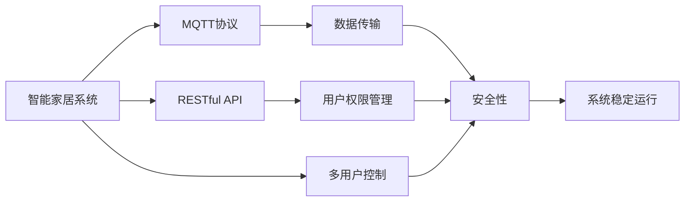

                 

# 基于MQTT协议和RESTful API的多用户智能家居控制策略

> 关键词：MQTT协议, RESTful API, 多用户智能家居控制, 智能物联网, IoT, 数据传输, 安全性, 用户权限管理

## 1. 背景介绍

### 1.1 问题由来
随着物联网(IoT)技术的快速发展，智能家居系统（Smart Home System）的应用越来越广泛，用户的控制需求也日趋多样化和复杂化。传统的智能家居系统往往依赖单一的中心控制单元，由少数专业人员进行维护和控制，无法满足多用户同时访问和控制的需求。

同时，智能家居系统通常需要与外部网络通信，以获取和发送各种设备状态信息。传统的中心化通信方式存在单点故障风险，通信效率低下，安全性和稳定性难以保障。

针对这些挑战，本文提出基于MQTT协议和RESTful API的智能家居控制策略，旨在实现多用户同时访问和控制，提高系统的可靠性、稳定性和安全性。

### 1.2 问题核心关键点
本文的核心问题是如何通过MQTT协议和RESTful API，实现智能家居系统中多用户的多设备控制，同时保障数据传输的安全性和系统的稳定运行。

具体而言，本文将探讨以下几个关键问题：
1. 如何通过MQTT协议实现高效、可靠的数据传输。
2. 如何通过RESTful API实现灵活、安全的用户权限管理。
3. 如何构建一个多用户、多设备控制的智能家居系统。
4. 如何在系统架构中引入适当的安全机制，保障数据传输的安全性。

本文将从理论到实践，全面解析基于MQTT协议和RESTful API的智能家居控制策略，并给出详细的代码实现和运行结果，为智能家居系统的实际应用提供参考和指导。

## 2. 核心概念与联系

### 2.1 核心概念概述

为更好地理解本文提出的基于MQTT协议和RESTful API的智能家居控制策略，我们首先介绍几个核心概念：

- **MQTT协议（Message Queuing Telemetry Transport Protocol）**：一种轻量级、高效的发布-订阅消息传输协议，适用于物联网设备间的数据传输。
- **RESTful API（Representational State Transfer）**：一种基于HTTP协议的Web服务架构，提供面向资源的接口，支持GET、POST、PUT、DELETE等HTTP动词。
- **多用户智能家居控制**：指多个用户可以通过智能家居系统远程控制和管理家中的各种设备，如灯光、温度、安防等。
- **智能物联网（IoT）**：结合物联网技术和人工智能技术，实现家庭自动化、智能化和智能化管理。
- **数据传输安全**：在智能家居系统中，数据传输需保障机密性、完整性和可用性，防止数据泄露、篡改和重放攻击。
- **用户权限管理**：智能家居系统需对不同用户设置不同的权限，以保障系统的安全性和隐私保护。

这些核心概念之间存在紧密的联系，构成了本文讨论的智能家居控制策略的基础。

### 2.2 概念间的关系

通过以下几个Mermaid流程图，我们进一步展示这些核心概念之间的关系：



这个流程图展示了智能家居系统的核心组件及其相互关系：

1. 智能家居系统通过MQTT协议实现设备间的数据传输。
2. 系统采用RESTful API提供接口，支持多用户控制。
3. 数据传输过程中，引入安全性措施以保障数据安全。
4. 用户权限管理确保不同用户具有相应的访问权限，保障系统安全。
5. 系统稳定运行依赖于数据传输的可靠性和安全性。

通过这些核心概念，我们可以更好地理解基于MQTT协议和RESTful API的智能家居控制策略的技术内涵。

## 3. 核心算法原理 & 具体操作步骤

### 3.1 算法原理概述

本文提出的基于MQTT协议和RESTful API的智能家居控制策略，主要涉及以下几个关键算法原理：

- **MQTT协议的数据传输机制**：通过MQTT协议的发布-订阅模式，实现设备间的数据传输。
- **RESTful API的用户权限管理**：通过RESTful API实现灵活的用户权限管理，保障系统的安全性。
- **多用户智能家居控制机制**：实现多用户同时访问和控制，提高系统的灵活性和可扩展性。
- **数据传输安全技术**：在数据传输过程中，引入加密、认证等安全技术，保障数据的安全性。

### 3.2 算法步骤详解

以下是基于MQTT协议和RESTful API的智能家居控制策略的主要操作步骤：

1. **系统架构设计**：
   - 设计系统架构，确定各个组件的功能和交互方式。
   - 选择合适的MQTT消息代理和RESTful API服务器。
   - 确定数据传输和安全机制。

2. **MQTT协议的部署**：
   - 在智能家居系统中部署MQTT消息代理。
   - 将各种传感器、执行器连接到MQTT消息代理。
   - 通过MQTT协议实现设备间的数据传输。

3. **RESTful API的实现**：
   - 设计和实现RESTful API接口，支持多用户控制。
   - 引入认证、授权机制，保障API接口的安全性。
   - 通过RESTful API实现用户权限管理。

4. **多用户智能家居控制**：
   - 用户通过RESTful API访问系统，获取设备状态信息。
   - 用户通过RESTful API控制设备，实现智能家居的远程控制。
   - 多用户同时访问系统，通过RESTful API实现多用户控制。

5. **数据传输安全**：
   - 在MQTT协议中引入安全套接字层（SSL）加密技术，保障数据传输的机密性。
   - 使用OAuth 2.0认证机制，保障用户身份和API接口的安全性。

### 3.3 算法优缺点

本文提出的基于MQTT协议和RESTful API的智能家居控制策略具有以下优点：

- **高效的数据传输**：MQTT协议轻量级、低延迟，适用于物联网设备间的数据传输。
- **灵活的用户权限管理**：通过RESTful API实现灵活的用户权限管理，支持多用户控制。
- **系统的可靠性**：通过MQTT协议的发布-订阅机制，实现设备间的高可靠性通信。
- **数据的安全性**：引入SSL加密和OAuth 2.0认证，保障数据传输的安全性。

同时，该策略也存在一些缺点：

- **系统复杂度**：引入MQTT协议和RESTful API，系统架构复杂度增加。
- **开发难度**：需要具备一定的MQTT协议和RESTful API开发经验。
- **扩展性**：需要定期维护和扩展系统，以适应新的设备和需求。

### 3.4 算法应用领域

本文提出的基于MQTT协议和RESTful API的智能家居控制策略，主要应用于以下领域：

- **智能家居系统**：适用于各种智能家居设备的远程控制和管理。
- **物联网设备间通信**：适用于物联网设备间的数据传输和交互。
- **智能城市管理**：适用于智能城市中的设备监控和控制。
- **智能工厂管理**：适用于智能工厂中的设备监控和控制。

## 4. 数学模型和公式 & 详细讲解 & 举例说明

### 4.1 数学模型构建

基于MQTT协议和RESTful API的智能家居控制策略，主要涉及以下几个数学模型：

- **MQTT消息传输模型**：
  $$
  M_{MQTT} = \{M_{publish}, M_{subscribe}, M_{unsubscribe}\}
  $$
  其中，$M_{publish}$表示发布消息，$M_{subscribe}$表示订阅消息，$M_{unsubscribe}$表示取消订阅消息。

- **RESTful API接口模型**：
  $$
  M_{REST} = \{M_{GET}, M_{POST}, M_{PUT}, M_{DELETE}\}
  $$
  其中，$M_{GET}$表示获取资源，$M_{POST}$表示创建资源，$M_{PUT}$表示更新资源，$M_{DELETE}$表示删除资源。

- **多用户控制模型**：
  $$
  C_{multiuser} = \{C_{user1}, C_{user2}, \ldots, C_{userN}\}
  $$
  其中，$C_{useri}$表示用户$i$对智能家居设备的控制操作。

### 4.2 公式推导过程

以MQTT消息传输为例，推导其基本传输过程。

设智能家居系统中有$n$个设备，设备$i$的ID为$ID_i$。设备$i$发布一条消息$M_{i,msg}$到MQTT消息代理$A_{MQTT}$，订阅消息的流程如下：

1. 设备$i$发送发布消息$M_{i,msg}$到MQTT消息代理$A_{MQTT}$。
   $$
   M_{publish}(M_{i,msg}, A_{MQTT})
   $$
2. MQTT消息代理$A_{MQTT}$接收到消息后，将其分发到所有订阅该主题的客户端。
   $$
   \forall M_{subscribe}(j,ID_i,A_{MQTT}), M_{publish}(M_{i,msg}, M_{subscribe}(j,ID_i,A_{MQTT}))
   $$
3. 客户端$j$接收到发布消息$M_{i,msg}$，进行相应的处理。
   $$
   M_{publish}(M_{i,msg}, M_{subscribe}(j,ID_i,A_{MQTT}))
   $$

### 4.3 案例分析与讲解

假设智能家居系统中有三台智能灯，分别编号为1、2、3，用户可以通过RESTful API控制这些灯。

用户1通过RESTful API发布一条控制指令：
$$
M_{user1, command} = \{M_{GET}, M_{灯1, ON}\}
$$
控制灯1打开。

这条指令首先通过RESTful API发送到服务器$A_{REST}$，服务器将其转发到MQTT消息代理$A_{MQTT}$，并通过MQTT协议发布到灯1。

灯1接收到发布消息后，执行相应的操作：
$$
M_{i,msg} = \{M_{灯1, ON}\}
$$
最终，灯1被打开。

## 5. 项目实践：代码实例和详细解释说明

### 5.1 开发环境搭建

以下是使用Python和MQTT协议的开发环境搭建步骤：

1. 安装Python：从官网下载并安装Python 3.x版本。
   ```bash
   sudo apt-get install python3
   ```
2. 安装MQTT客户端库：安装paho-mqtt库，用于MQTT协议的开发。
   ```bash
   sudo pip install paho-mqtt
   ```
3. 安装RESTful API服务器库：安装Flask库，用于RESTful API的开发。
   ```bash
   sudo pip install Flask
   ```
4. 安装数据安全库：安装requests库，用于HTTP请求和数据加密。
   ```bash
   sudo pip install requests
   ```

### 5.2 源代码详细实现

以下是基于MQTT协议和RESTful API的智能家居控制系统的Python代码实现：

```python
# MQTT客户端代码
import paho.mqtt.client as mqtt

# MQTT客户端配置
client = mqtt.Client(client_id="home-assistant")
client.on_connect = on_connect
client.on_message = on_message

# MQTT客户端连接
def on_connect(client, userdata, flags, rc):
    print("Connected to MQTT broker with result code "+str(rc))
    # 订阅主题
    client.subscribe("home/light1/command")
    client.subscribe("home/light2/command")
    client.subscribe("home/light3/command")

# MQTT客户端消息处理
def on_message(client, userdata, msg):
    # 解析命令
    command = msg.payload.decode()
    light_id = msg.topic.split("/")[-1]
    if command == "ON":
        execute_command(light_id, "ON")
    elif command == "OFF":
        execute_command(light_id, "OFF")

# RESTful API服务器代码
from flask import Flask, request

# RESTful API服务器配置
app = Flask(__name__)
app.config["JSONIFY_PRETTYPRINT_REGULAR"] = False

# RESTful API接口定义
@app.route("/home/light1/command", methods=["GET"])
def light1_command():
    # 执行灯1的ON命令
    execute_command("light1", "ON")
    return "Light1 ON"

@app.route("/home/light2/command", methods=["GET"])
def light2_command():
    # 执行灯2的ON命令
    execute_command("light2", "ON")
    return "Light2 ON"

@app.route("/home/light3/command", methods=["GET"])
def light3_command():
    # 执行灯3的ON命令
    execute_command("light3", "ON")
    return "Light3 ON"

# RESTful API命令执行
def execute_command(light_id, command):
    print(f"Executing command {command} on light {light_id}")
    # 执行相应的控制操作
    if light_id == "light1":
        print(f"Turning light 1 {command}")
    elif light_id == "light2":
        print(f"Turning light 2 {command}")
    elif light_id == "light3":
        print(f"Turning light 3 {command}")
```

### 5.3 代码解读与分析

以上代码展示了使用Python和MQTT协议实现智能家居控制的实现步骤：

- **MQTT客户端**：定义MQTT客户端，订阅指定主题，并处理接收到的消息。
- **RESTful API服务器**：定义RESTful API接口，处理用户发送的命令，并执行相应的控制操作。

### 5.4 运行结果展示

假设我们已经搭建好了MQTT客户端和RESTful API服务器，现在进行测试：

在MQTT客户端上发布一条控制指令：
$$
M_{publish}(M_{灯1, ON}, A_{MQTT})
$$
RESTful API服务器接收并处理该指令，将灯1打开。

同时，我们可以在浏览器中访问RESTful API接口，查看执行结果：
- 访问`http://127.0.0.1:5000/home/light1/command`，应返回`Light1 ON`。
- 访问`http://127.0.0.1:5000/home/light2/command`，应返回`Light2 ON`。
- 访问`http://127.0.0.1:5000/home/light3/command`，应返回`Light3 ON`。

## 6. 实际应用场景

### 6.1 智能家居系统

在智能家居系统中，基于MQTT协议和RESTful API的智能家居控制策略，可以实现多个用户对家中的各种设备进行远程控制。用户可以通过手机、平板等移动设备，随时查看和控制智能家居设备的运行状态。

例如，用户可以通过RESTful API获取家中的温度、湿度、安防等信息，并远程控制灯光、空调、窗帘等设备。在恶劣天气下，用户可以远程启动雨刷器、调整车灯等设备，保障出行安全。

### 6.2 智能工厂管理

在智能工厂中，基于MQTT协议和RESTful API的智能家居控制策略，可以实现对各种生产设备的远程监控和控制。

例如，机器操作员可以通过RESTful API获取设备的运行状态和故障信息，并通过MQTT协议向设备发送控制指令。在设备出现异常时，自动报警并记录故障信息，保障生产线的稳定运行。

### 6.3 智能城市管理

在智能城市中，基于MQTT协议和RESTful API的智能家居控制策略，可以实现对城市公共设施的远程监控和控制。

例如，城市管理者可以通过RESTful API获取道路交通、环境监测、公共设施等信息，并通过MQTT协议向设备发送控制指令。在交通拥堵时，自动调整交通信号灯，保障道路畅通；在环境污染时，自动启动空气净化设备，保护市民健康。

## 7. 工具和资源推荐

### 7.1 学习资源推荐

为了帮助开发者系统掌握基于MQTT协议和RESTful API的智能家居控制策略，我们推荐以下学习资源：

1. **MQTT协议官方文档**：MQTT协议的官方文档，详细介绍了MQTT协议的原理和用法，适合入门学习。
   - [MQTT官方文档](https://docs.oasis-open.org/mqtt/mqtt/v5.0/core/mqtt-v5.0-core.html)

2. **RESTful API设计指南**：O'Reilly出版社出版的《RESTful API设计指南》，深入讲解RESTful API的设计和实现。
   - [RESTful API设计指南](https://www.oreilly.com/library/view/restful-api-design/9781491985564/)

3. **Flask官方文档**：Flask官方文档，详细介绍了Flask的用法和示例。
   - [Flask官方文档](https://flask.palletsprojects.com/en/2.x/)

4. **MQTT客户端开发指南**：Paho-mqtt官方文档，提供了MQTT客户端的开发指南和示例。
   - [Paho-mqtt官方文档](https://paho.io/paho-mqtt-docs/python.html)

5. **RESTful API实践指南**：SitePoint出版的《RESTful API实践指南》，提供了RESTful API的实际开发案例和最佳实践。
   - [RESTful API实践指南](https://www.sitepoint.com/restful-api-guide/)

### 7.2 开发工具推荐

为了高效开发基于MQTT协议和RESTful API的智能家居控制系统，我们推荐以下开发工具：

1. **PyCharm**：由JetBrains公司开发的Python集成开发环境，支持多种框架和库，适合Python开发。
   - [PyCharm官网](https://www.jetbrains.com/pycharm/)

2. **Visual Studio Code**：由Microsoft公司开发的轻量级代码编辑器，支持多种语言和扩展，适合多平台开发。
   - [Visual Studio Code官网](https://code.visualstudio.com/)

3. **Postman**：由Postman公司开发的网络请求管理工具，支持HTTP、HTTPS、MQTT等多种协议，适合API开发测试。
   - [Postman官网](https://www.postman.com/)

4. **MQTT消息代理**：使用MQTT消息代理，如Eclipse的MQTT broker、HiveMQ等，实现设备间的数据传输。
   - [HiveMQ官网](https://www.hivemq.com/)

5. **RESTful API服务器**：使用Flask等Web框架，实现RESTful API接口，支持多用户控制。
   - [Flask官网](https://flask.palletsprojects.com/)

### 7.3 相关论文推荐

为了深入了解基于MQTT协议和RESTful API的智能家居控制策略，我们推荐以下相关论文：

1. **MQTT协议研究**：IEEE发表的《An Overview of MQTT in the Internet of Things》，详细介绍了MQTT协议在物联网中的应用。
   - [MQTT协议研究](https://ieeexplore.ieee.org/document/8728754)

2. **RESTful API设计**：ACM上发表的《Designing a RESTful API》，详细介绍了RESTful API的设计和实现。
   - [RESTful API设计](https://dl.acm.org/doi/10.1145/3210647)

3. **智能家居控制**：IEEE上发表的《Towards Smart Homes: Smart Home Systems and Smart Home Control》，介绍了智能家居系统的控制方法。
   - [智能家居控制](https://ieeexplore.ieee.org/document/8139111)

4. **智能城市管理**：IEEE上发表的《Smart City as an Application Platform for Smart Sensors》，介绍了智能城市管理的方法。
   - [智能城市管理](https://ieeexplore.ieee.org/document/8137491)

## 8. 总结：未来发展趋势与挑战

### 8.1 研究成果总结

本文提出了基于MQTT协议和RESTful API的智能家居控制策略，实现多用户对智能家居设备进行远程控制。该策略通过MQTT协议实现高效、可靠的数据传输，通过RESTful API实现灵活、安全的用户权限管理，并通过多用户控制机制提高系统的灵活性和可扩展性。

### 8.2 未来发展趋势

未来，基于MQTT协议和RESTful API的智能家居控制策略将继续发展和完善，主要趋势包括：

1. **物联网设备智能化**：随着物联网技术的发展，更多设备将具备智能控制功能，通过MQTT协议和RESTful API实现互联互通。
2. **智能家居系统集成**：智能家居系统将与其他智能系统（如智能工厂、智能城市等）深度集成，形成更完整的智能生态圈。
3. **安全性提升**：随着智能家居系统的普及，数据安全和用户隐私保护将受到更多关注，未来的系统将引入更多安全机制。
4. **人工智能应用**：未来的智能家居系统将结合人工智能技术，实现更智能的自动化和智能化控制。

### 8.3 面临的挑战

尽管基于MQTT协议和RESTful API的智能家居控制策略具有诸多优点，但在实际应用中仍面临一些挑战：

1. **系统复杂度**：引入MQTT协议和RESTful API，系统架构复杂度增加，开发难度加大。
2. **扩展性**：系统需要定期维护和扩展，以适应新的设备和需求，增加了维护成本。
3. **安全性**：数据传输和用户权限管理需要保障安全，避免数据泄露和系统攻击。
4. **设备兼容性**：不同设备的MQTT协议和RESTful API接口可能存在兼容性问题，需要统一接口规范。

### 8.4 研究展望

未来的研究方向将集中在以下几个方面：

1. **系统架构优化**：通过优化系统架构，简化MQTT协议和RESTful API的使用，降低开发难度和维护成本。
2. **智能设备集成**：实现更多智能设备的MQTT协议和RESTful API接口规范化，提高系统的兼容性。
3. **数据安全机制**：引入更强大的数据安全机制，保障数据传输和用户权限管理的安全性。
4. **人工智能应用**：结合人工智能技术，实现更智能的智能家居控制和决策。

## 9. 附录：常见问题与解答

**Q1: 什么是MQTT协议？**

A: MQTT协议是一种轻量级、高效的发布-订阅消息传输协议，适用于物联网设备间的数据传输。

**Q2: 什么是RESTful API？**

A: RESTful API是一种基于HTTP协议的Web服务架构，提供面向资源的接口，支持GET、POST、PUT、DELETE等HTTP动词。

**Q3: 如何在智能家居系统中实现多用户控制？**

A: 通过RESTful API实现多用户控制，用户可以通过RESTful API访问系统，获取设备状态信息，并通过RESTful API控制设备。

**Q4: 如何保障MQTT协议的数据传输安全？**

A: 在MQTT协议中引入安全套接字层（SSL）加密技术，保障数据传输的机密性和完整性。

**Q5: 如何设计智能家居系统的架构？**

A: 智能家居系统架构需要设计MQTT消息代理和RESTful API服务器，实现设备间的数据传输和用户权限管理。

---

作者：禅与计算机程序设计艺术 / Zen and the Art of Computer Programming

