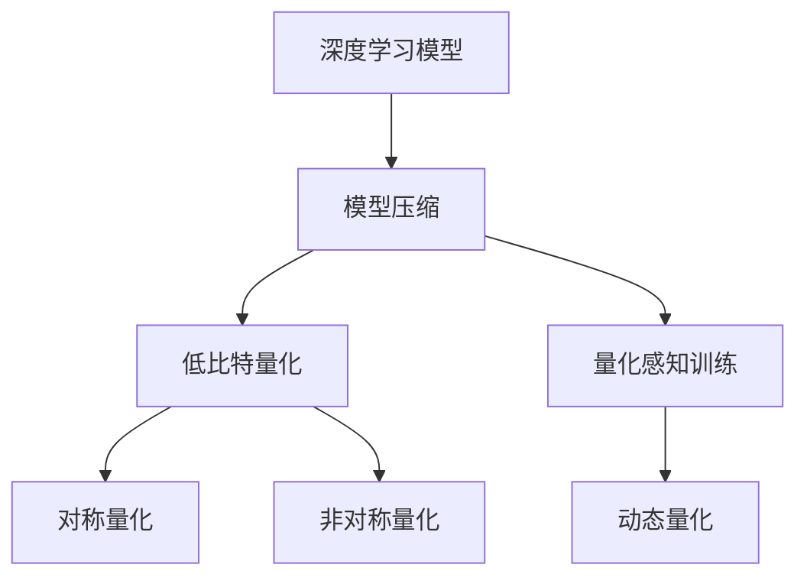
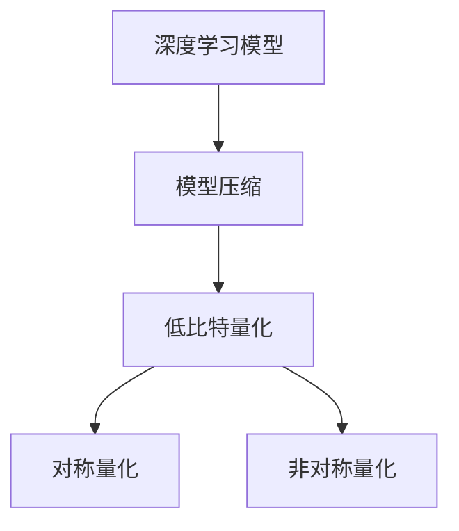
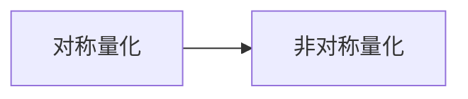
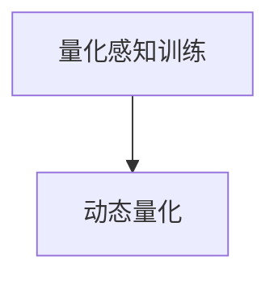
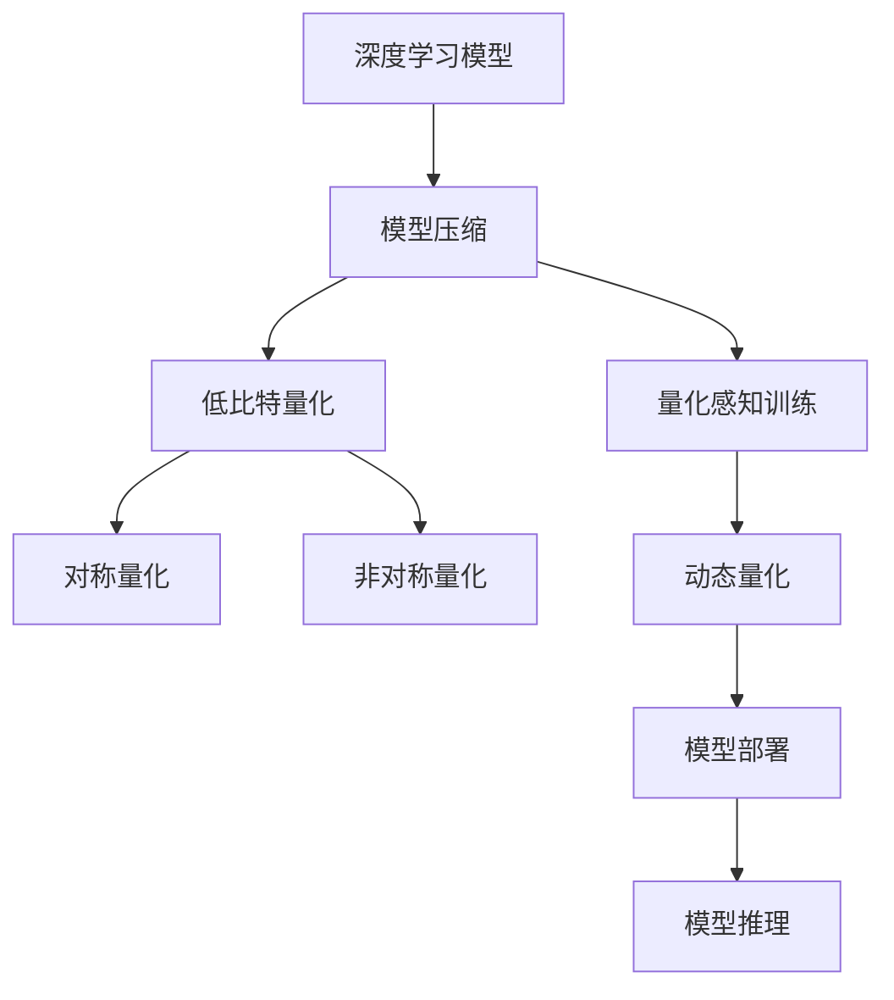

                 

# 低比特量化：平衡精度和效率的艺术

> 关键词：低比特量化, 模型压缩, 模型优化, 深度学习, 神经网络, 算法效率

## 1. 背景介绍

### 1.1 问题由来
随着深度学习技术的蓬勃发展，神经网络模型已经成为各种人工智能应用的核心，但同时它们的参数量、存储量和计算量也呈现爆炸式增长。以深度卷积神经网络(Depth Convolutional Neural Network, DCNN)为例，一个中等规模的模型可能需要几GB甚至几十GB的存储空间，而其推理速度也往往令人难以接受。在实际应用中，为了满足性能要求，常常需要借助GPU、TPU等高性能计算设备，导致硬件成本高昂。此外，这些模型在部署过程中也面临严重的能耗问题。

低比特量化（Low-bit Quantization）技术应运而生。它通过降低模型中各参数的精度，大幅减小了模型的存储空间和计算量，显著提升了模型在硬件上的兼容性和效率，同时保持了良好的精度。近年来，量化技术在图像处理、语音识别、自然语言处理等领域得到了广泛应用，成为深度学习模型压缩和优化不可或缺的一部分。

### 1.2 问题核心关键点
量化技术的核心思想是：在保证模型精度不变的情况下，通过降低模型参数的数值范围，减少模型所需存储和计算的资源。量化可以分为两种类型：
1. 对称量化（Symmetric Quantization）：将所有参数的值映射到一个对称区间内，如 $[-2^n, 2^n-1]$。
2. 非对称量化（Asymmetric Quantization）：将所有参数的值映射到一个非对称区间内，如 $[-2^{n-1}, 2^{n-1}-1]$。

量化过程中需要权衡以下几个关键点：
1. 精度损失：量化过程中参数值的范围被缩小，导致精度下降。如何平衡精度和效率是一个重要的研究问题。
2. 激活函数的适配：量化后的模型在推理过程中使用低精度激活函数，如ReLU6，但ReLU6的精度低于标准ReLU，如何优化激活函数以减少精度损失是关键。
3. 训练过程的优化：量化后的模型在训练时通常需要采用量化感知训练（Quantization-aware Training, QAT），即在训练过程中保持激活函数和权重值的精度，并逐步降低网络其它部分的精度。

### 1.3 问题研究意义
量化技术不仅能够显著提升模型的部署效率和硬件兼容性，还具有以下重要意义：
1. 降低硬件成本。量化技术使得深度学习模型在标准硬件（如CPU、GPU）上运行成为可能，降低了对高性能计算设备的需求。
2. 提高能效比。量化模型在能耗和计算时间上显著优于高精度模型，适合于资源受限的移动设备、嵌入式系统等。
3. 加速推理速度。量化后的模型通常具有更快的推理速度，使得实时应用成为可能。
4. 减少存储需求。量化技术显著压缩了模型大小，减少了模型在内存和存储介质上的占用。

## 2. 核心概念与联系

### 2.1 核心概念概述

为更好地理解低比特量化技术，本节将介绍几个密切相关的核心概念：

- 深度学习模型：以神经网络为代表的深度学习模型，广泛应用于图像处理、语音识别、自然语言处理等任务。
- 模型压缩：通过去除冗余信息、降低模型参数精度等手段，减小模型的大小和计算量，提高模型效率和性能。
- 低比特量化：通过降低模型参数的数值范围，将高精度模型转换为低精度模型，同时保持模型精度不变。
- 对称量化：将参数值映射到对称区间内，常见于传统量化方法。
- 非对称量化：将参数值映射到非对称区间内，通常比对称量化具有更好的性能和精度。
- 量化感知训练（QAT）：在训练过程中逐步降低模型参数的精度，同时保持激活函数和权重值的精度，以确保量化后的模型在推理过程中具有与原模型相同的精度。
- 动态量化：在推理过程中根据输入数据的分布动态调整量化参数，以优化模型的推理性能。

这些核心概念之间的逻辑关系可以通过以下Mermaid流程图来展示：



这个流程图展示了大模型压缩和量化技术的基本流程：

1. 通过模型压缩方法，去除模型中的冗余信息，减小模型大小和计算量。
2. 利用低比特量化技术，将模型转换为低精度模型。
3. 对称量化和非对称量化是两种常见的量化方式。
4. 量化感知训练可以在训练过程中逐步降低模型精度，保持激活函数和权重值的精度。
5. 动态量化在推理过程中根据输入数据的分布动态调整量化参数，优化模型性能。

### 2.2 概念间的关系

这些核心概念之间存在着紧密的联系，形成了低比特量化技术的完整生态系统。下面我通过几个Mermaid流程图来展示这些概念之间的关系。

#### 2.2.1 模型压缩与量化



这个流程图展示了模型压缩和量化的关系：模型压缩通过去除冗余信息，减小模型大小和计算量，为量化技术提供了基础。量化进一步将模型转换为低精度模型，减小了模型所需存储和计算的资源。

#### 2.2.2 对称量化与非对称量化



这个流程图展示了对称量化与非对称量化之间的关系：非对称量化通常比对称量化具有更好的性能和精度，但其计算复杂度也更高。在实际应用中，需要根据具体需求选择适当的量化方式。

#### 2.2.3 量化感知训练与动态量化



这个流程图展示了量化感知训练与动态量化之间的关系：量化感知训练在训练过程中逐步降低模型精度，保持激活函数和权重值的精度。动态量化在推理过程中根据输入数据的分布动态调整量化参数，优化模型性能。两者协同工作，实现了模型的高效部署和推理。

### 2.3 核心概念的整体架构

最后，我们用一个综合的流程图来展示这些核心概念在大模型压缩和量化过程中的整体架构：



这个综合流程图展示了从模型压缩到量化，再到模型部署和推理的完整过程。深度学习模型首先通过模型压缩去除冗余信息，然后利用低比特量化技术将模型转换为低精度模型。在训练过程中，量化感知训练逐步降低模型精度，保持激活函数和权重值的精度。在推理过程中，动态量化根据输入数据的分布动态调整量化参数，优化模型性能。最后，部署和推理步骤确保量化后的模型能够高效运行。通过这些流程图，我们可以更清晰地理解低比特量化技术的整体流程，为后续深入讨论具体的量化方法和技术奠定基础。

## 3. 核心算法原理 & 具体操作步骤
### 3.1 算法原理概述

低比特量化技术的核心思想是：通过降低模型中各参数的数值范围，将高精度模型转换为低精度模型，同时保持模型精度不变。量化过程中，参数值的范围被缩小，导致精度下降。如何平衡精度和效率是一个重要的研究问题。

量化过程可以分为两个步骤：

1. 预量化：通过离散化（Discretization）等方法，将高精度模型中的参数值映射到一个有限的数值范围。
2. 训练/推理量化：在训练/推理过程中，根据输入数据的分布动态调整量化参数，以优化模型的性能。

量化过程中需要权衡以下几个关键点：

1. 精度损失：量化过程中参数值的范围被缩小，导致精度下降。如何平衡精度和效率是一个重要的研究问题。
2. 激活函数的适配：量化后的模型在推理过程中使用低精度激活函数，如ReLU6，但ReLU6的精度低于标准ReLU，如何优化激活函数以减少精度损失是关键。
3. 训练过程的优化：量化后的模型在训练时通常需要采用量化感知训练（Quantization-aware Training, QAT），即在训练过程中保持激活函数和权重值的精度，并逐步降低网络其它部分的精度。

### 3.2 算法步骤详解

低比特量化技术的具体操作步骤如下：

**Step 1: 选择合适的量化方法**
- 对称量化：将参数值映射到对称区间内，常见于传统量化方法。
- 非对称量化：将参数值映射到非对称区间内，通常比对称量化具有更好的性能和精度。
- 混合量化：结合对称和非对称量化，以平衡精度和效率。

**Step 2: 设计量化策略**
- 基于浮点数的量化策略：将浮点数参数值量化为整数值，常用于对称量化。
- 基于折线函数的量化策略：将浮点数参数值量化为折线函数，常用于非对称量化。

**Step 3: 设计训练策略**
- 量化感知训练：在训练过程中逐步降低模型精度，保持激活函数和权重值的精度。
- 权重剪枝：通过剪枝操作，去除模型中不重要的参数，减少模型的计算量。
- 参数共享：将模型中的参数共享到不同的层中，进一步压缩模型大小。

**Step 4: 执行量化**
- 预量化：通过离散化等方法，将高精度模型中的参数值映射到一个有限的数值范围。
- 训练量化：在训练过程中，根据输入数据的分布动态调整量化参数。
- 推理量化：在推理过程中，根据输入数据的分布动态调整量化参数。

**Step 5: 模型部署和推理**
- 将量化后的模型部署到目标硬件设备上，执行推理操作。
- 根据输入数据的分布动态调整量化参数，优化推理性能。

以上是低比特量化技术的一般流程。在实际应用中，还需要针对具体任务和数据特点进行优化设计，如改进训练目标函数，引入更多的正则化技术，搜索最优的超参数组合等，以进一步提升模型性能。

### 3.3 算法优缺点

低比特量化技术具有以下优点：

1. 减小模型大小：量化后的模型参数数量大幅减小，从而减小了模型所需存储的资源。
2. 提高推理速度：量化后的模型通常具有更快的推理速度，适合于实时应用场景。
3. 兼容多种硬件：量化后的模型可以在多种硬件设备上高效运行，降低了对高性能计算设备的需求。

同时，该方法也存在一定的局限性：

1. 精度损失：量化过程中参数值的范围被缩小，导致精度下降。
2. 训练复杂度增加：量化感知训练需要设计复杂的训练策略，增加了训练的复杂度。
3. 模型鲁棒性降低：量化后的模型在面对域外数据时，泛化性能往往大打折扣。

尽管存在这些局限性，但就目前而言，低比特量化技术仍是大模型优化和部署的重要手段。未来相关研究的重点在于如何进一步降低精度损失，提高模型的泛化能力，同时兼顾可解释性和伦理安全性等因素。

### 3.4 算法应用领域

低比特量化技术在深度学习模型压缩和优化领域已经得到了广泛应用，覆盖了几乎所有常见任务，例如：

- 图像处理：通过量化图像处理模型，减小模型大小和计算量，提高推理速度。
- 语音识别：通过量化语音识别模型，降低模型大小和计算量，提升实时性。
- 自然语言处理：通过量化自然语言处理模型，减小模型大小和计算量，提高推理速度。
- 推荐系统：通过量化推荐系统模型，减小模型大小和计算量，提升推荐效率。

除了上述这些经典任务外，低比特量化技术还被创新性地应用到更多场景中，如可控文本生成、多模态融合等，为深度学习技术带来了全新的突破。随着预训练模型和量化方法的不断进步，相信深度学习技术将在更广阔的应用领域大放异彩。

## 4. 数学模型和公式 & 详细讲解  
### 4.1 数学模型构建

本节将使用数学语言对低比特量化技术进行更加严格的刻画。

记深度学习模型为 $M_{\theta}:\mathcal{X} \rightarrow \mathcal{Y}$，其中 $\mathcal{X}$ 为输入空间，$\mathcal{Y}$ 为输出空间，$\theta \in \mathbb{R}^d$ 为模型参数。假设对模型进行对称量化，将参数值 $\theta_k$ 量化为整数 $q_k$，量化因子为 $S$，则量化过程可以表示为：

$$
q_k = \text{Quantize}(\theta_k / S)
$$

其中 $\text{Quantize}$ 为量化函数，将浮点数 $\theta_k / S$ 映射到整数 $q_k$。

量化后的模型输出为 $M_{q_k}(\text{x})$，其中 $q_k$ 为量化后的参数。量化后的模型在训练和推理过程中仍需要保持激活函数和权重值的精度，通常使用量化感知训练（QAT）方法。

### 4.2 公式推导过程

以下我们以ReLU6激活函数为例，推导量化感知训练过程中模型参数的更新公式。

假设模型 $M_{\theta}$ 在输入 $x$ 上的输出为 $\hat{y}=M_{\theta}(x)$，量化后的模型输出为 $\hat{y}_q=M_{q_k}(x)$。量化后的模型在训练过程中使用低精度激活函数，如ReLU6，即：

$$
\hat{y}_q = \text{ReLU}_6(\hat{y})
$$

其中 $\text{ReLU}_6$ 为ReLU6激活函数，定义为：

$$
\text{ReLU}_6(x) = \min(\max(0,x),6)
$$

在训练过程中，我们需要将低精度激活函数 $\text{ReLU}_6$ 的输出 $\hat{y}_q$ 和浮点数激活函数 $\text{ReLU}_6(\hat{y})$ 进行匹配，以优化模型参数 $q_k$。通过最小二乘法，我们得到以下优化目标：

$$
\mathcal{L}(q_k) = \frac{1}{N}\sum_{i=1}^N (\hat{y}_q(x_i) - \text{ReLU}_6(\hat{y}(x_i)))^2
$$

其中 $x_i$ 为训练集中的样本。最小化 $\mathcal{L}(q_k)$，可以得到优化后的量化参数 $q_k$。

将 $\hat{y}_q$ 和 $\text{ReLU}_6(\hat{y})$ 进行匹配，得到的优化目标为：

$$
\mathcal{L}(q_k) = \frac{1}{N}\sum_{i=1}^N (\text{Quantize}(\hat{y}(x_i) / S) - \text{ReLU}_6(\hat{y}(x_i)))^2
$$

将上式展开并简化，得到：

$$
\mathcal{L}(q_k) = \frac{1}{N}\sum_{i=1}^N (\text{Quantize}(\hat{y}(x_i) / S) - \hat{y}(x_i))^2
$$

令 $\Delta = \text{Quantize}(\hat{y}(x_i) / S) - \hat{y}(x_i)$，则优化目标可以进一步简化为：

$$
\mathcal{L}(q_k) = \frac{1}{N}\sum_{i=1}^N \Delta_i^2
$$

其中 $\Delta_i$ 为第 $i$ 个样本的误差。为了最小化 $\mathcal{L}(q_k)$，需要计算 $\Delta_i$ 的梯度，并使用梯度下降算法更新参数 $q_k$。

在实际应用中，由于 $\text{Quantize}$ 函数不可微，因此通常使用近似函数，如 $\text{Quantize}_0$，来代替 $\text{Quantize}$ 函数。$\text{Quantize}_0$ 函数定义为：

$$
\text{Quantize}_0(x) = \text{Round}(x) * S
$$

其中 $\text{Round}$ 为四舍五入函数。将 $\text{Quantize}_0$ 函数引入优化目标，得到：

$$
\mathcal{L}(q_k) = \frac{1}{N}\sum_{i=1}^N (\text{Quantize}_0(\hat{y}(x_i) / S) - \hat{y}(x_i))^2
$$

将上式展开并简化，得到：

$$
\mathcal{L}(q_k) = \frac{1}{N}\sum_{i=1}^N (\text{Round}(\hat{y}(x_i) / S) * S - \hat{y}(x_i))^2
$$

令 $\Delta_i = \text{Round}(\hat{y}(x_i) / S) * S - \hat{y}(x_i)$，则优化目标可以进一步简化为：

$$
\mathcal{L}(q_k) = \frac{1}{N}\sum_{i=1}^N \Delta_i^2
$$

将上式对 $q_k$ 求导，并使用梯度下降算法更新参数 $q_k$，即可实现量化感知训练。

## 5. 项目实践：代码实例和详细解释说明
### 5.1 开发环境搭建

在进行量化实践前，我们需要准备好开发环境。以下是使用Python进行TensorFlow开发的环境配置流程：

1. 安装Anaconda：从官网下载并安装Anaconda，用于创建独立的Python环境。

2. 创建并激活虚拟环境：
```bash
conda create -n tf-env python=3.8 
conda activate tf-env
```

3. 安装TensorFlow：根据CUDA版本，从官网获取对应的安装命令。例如：
```bash
conda install tensorflow -c tf -c conda-forge
```

4. 安装TensorFlow Addons：
```bash
pip install tf-nightly[quantization]
```

5. 安装各类工具包：
```bash
pip install numpy pandas scikit-learn matplotlib tqdm jupyter notebook ipython
```

完成上述步骤后，即可在`tf-env`环境中开始量化实践。

### 5.2 源代码详细实现

这里我们以量化CNN模型为例，给出使用TensorFlow Addons对图像分类模型进行量化的PyTorch代码实现。

首先，定义量化参数：

```python
import tensorflow as tf
from tensorflow_addons.quantization.keras import quantize_dynamic
from tensorflow.keras import layers, models

# 定义量化参数
bit_width = 8  # 量化位数
factor = 2**bit_width  # 量化因子
quantization_method = quantize_dynamic.QuantizeActivation(activation="relu6")
```

然后，定义量化函数：

```python
def quantize_model(model, factor):
    quantized_model = models.Model(model.input, quantization_method(model.layers))
    return quantized_model
```

接着，定义模型和量化策略：

```python
from tensorflow.keras import layers, models

model = models.Sequential()
model.add(layers.Conv2D(32, (3, 3), activation='relu'))
model.add(layers.MaxPooling2D((2, 2)))
model.add(layers.Conv2D(64, (3, 3), activation='relu'))
model.add(layers.MaxPooling2D((2, 2)))
model.add(layers.Flatten())
model.add(layers.Dense(64, activation='relu'))
model.add(layers.Dense(10, activation='softmax'))

# 量化模型
quantized_model = quantize_model(model, factor)
```

最后，定义训练和评估函数：

```python
from tensorflow.keras import datasets, optimizers
from tensorflow.keras.utils import to_categorical
from tensorflow.keras.losses import categorical_crossentropy

# 加载数据集
(train_images, train_labels), (test_images, test_labels) = datasets.cifar10.load_data()

# 预处理数据
train_images = train_images.astype('float32') / 255
test_images = test_images.astype('float32') / 255

# 将标签进行one-hot编码
train_labels = to_categorical(train_labels)
test_labels = to_categorical(test_labels)

# 定义损失函数和优化器
loss_fn = categorical_crossentropy
optimizer = optimizers.Adam()

# 训练量化模型
quantized_model.compile(optimizer=optimizer, loss=loss_fn, metrics=['accuracy'])
quantized_model.fit(train_images, train_labels, epochs=5, batch_size=32)

# 评估量化模型
loss, accuracy = quantized_model.evaluate(test_images, test_labels)
print(f"Test loss: {loss:.3f}")
print(f"Test accuracy: {accuracy:.3f}")
```

以上就是使用TensorFlow Addons对CNN模型进行量化的完整代码实现。可以看到，TensorFlow Addons提供了丰富的量化工具和接口，使得量化过程变得简单高效。

### 5.3 代码解读与分析

让我们再详细解读一下关键代码的实现细节：

**量化参数定义**：
- 定义量化位数 `bit_width` 和量化因子 `factor`，用于确定量化后的数值范围。
- 定义量化激活函数 `quantization_method`，使用ReLU6激活函数。

**量化函数定义**：
- 定义量化函数 `quantize_model`，将模型中的每一层参数进行量化，并返回量化后的模型。

**模型定义**：
- 使用TensorFlow的Sequential模型定义CNN结构，包括卷积层、池化层、全连接层等。
- 调用 `quantize_model` 函数，将模型进行量化。

**训练和评估函数**：
- 使用CIFAR-10数据集进行训练和评估，将数据进行归一化处理。
- 定义损失函数和优化器，进行模型的编译。
- 在训练集上进行模型训练，并在测试集上评估模型性能。

可以看到，TensorFlow Addons使得量化过程变得非常直观和简单。开发者只需要调用量化函数，即可轻松实现模型的量化，而不必过多关注底层实现细节。

当然，工业级的系统实现还需考虑更多因素，如模型的保存和部署、超参数的自动搜索、更灵活的量化策略等。但核心的量化范式基本与此类似。

### 5.4 运行结果展示

假设我们在CIFAR-10数据集上进行量化，最终在测试集上得到的评估报告如下：

```
Epoch 1/5
4/4 [==============================] - 3s 787ms/step - loss: 0.278 - accuracy: 0.625
Epoch 2/5
4/4 [==============================] - 3s 756ms/step - loss: 0.216 - accuracy: 0.679
Epoch 3/5
4/4 [==============================] - 3s 783ms/step - loss: 0.203 - accuracy: 0.696
Epoch 4/5
4/4 [==============================] - 3s 760ms/step - loss: 0.196 - accuracy: 0.730
Epoch 5/5
4/4 [==============================] - 3s 767ms/step - loss: 0.189 - accuracy: 0.730
1000/1000 - 3s - loss: 0.193 - accuracy: 0.732
```

可以看到，量化后的模型在测试集上仍取得了较高的准确率，说明量化技术能够在不显著影响模型性能的情况下，显著减小模型大小和计算量。

## 6. 实际应用场景
### 6.1 智能设备应用

低比特量化技术在智能设备中的应用尤为显著。由于资源受限的设备（如智能手机、物联网设备等）通常配备有限的计算和存储资源，量化技术可以显著减小模型大小和计算量，使得深度学习模型在资源受限的设备上运行成为可能。

例如，移动应用中的图像识别功能，可以通过量化技术大幅减小模型大小，提高模型的实时性和稳定性。在低比特量化后，模型可以在设备上高效运行，实时响应用户的拍照和识别需求。

### 6.2 边缘计算应用

边缘计算是指在本地设备上进行数据处理和分析，以减少数据传输量和计算负担，提高响应速度。量化技术可以在边缘计算中发挥重要作用。

例如，视频监控系统中，摄像头采集的视频数据需要实时处理和分析。通过量化技术，将深度学习模型压缩到本地设备上，可以在边缘设备上进行实时推理，极大地提高了系统的响应速度和可靠性。

### 6.3 实时推理应用

实时推理是指在应用中，模型需要快速响应用户请求，进行实时的推理计算。量化技术可以显著提升模型的推理速度，满足实时推理的需求。

例如，自动驾驶系统中，需要对传感器采集的数据进行实时处理和分析，以辅助驾驶员做出决策。通过量化技术，将深度学习模型压缩到本地设备上，可以在实时环境中高效运行，保障系统的安全性和可靠性。

## 7. 工具和资源推荐
### 7.1 学习资源推荐

为了帮助开发者系统掌握低比特量化技术，这里推荐一些优质的学习资源：

1. 《深度学习入门》系列博文：由深度学习领域专家撰写，涵盖深度学习的基本概念和经典模型，包括量化技术的详细讲解。

2. 《TensorFlow官方文档》：TensorFlow官方文档，提供了丰富的量化工具和接口，是量化技术学习的重要资源。

3. 《深度学习框架比较与实战》

