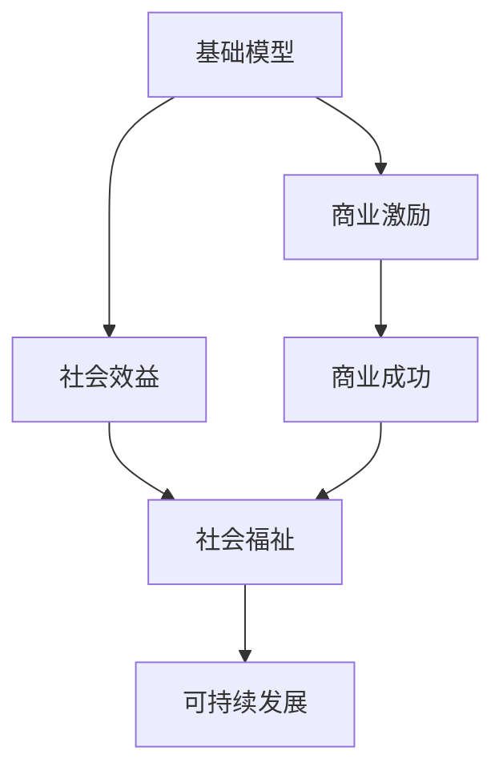

                 

## 1. 背景介绍

### 1.1 问题由来
随着人工智能(AI)技术的飞速发展，基础模型(Foundational Models)在各个领域的应用日益广泛。基础模型是指那些能够自适应地学习并生成新数据的通用模型，包括大语言模型(Large Language Models, LLMs)、图像生成模型(Generative Adversarial Networks, GANs)、自监督学习模型等。这些模型在自然语言处理(NLP)、计算机视觉(CV)、推荐系统等领域展现出卓越的性能，为商业应用和社会创新提供了巨大的动力。

然而，基础模型的应用也带来了诸多挑战和争议，包括数据隐私、公平性、安全性等问题。如何在保障商业激励的同时，最大化基础模型的社会效益，成为学术界和工业界共同关注的焦点。本文将从商业激励和社会效益两个方面，深入探讨基础模型的应用现状及其发展方向。

### 1.2 问题核心关键点
基础模型在商业和社会两个层面所产生的激励和效益，涉及以下几个核心问题：

- **商业激励**：如何通过基础模型的商业应用，获取高回报和高市场份额，并实现可持续发展。
- **社会效益**：如何通过基础模型的公共应用，提升社会福祉，推动知识共享和可持续发展。

本文将详细探讨基础模型在商业和社会两个层面的激励和效益，并提出具体的改进建议和未来方向。

## 2. 核心概念与联系

### 2.1 核心概念概述

- **基础模型(Foundational Models)**：指能够自我学习并生成新数据的通用模型，如大语言模型、生成对抗网络等。这些模型通常具有大规模参数、深度学习架构，并在大规模无标签数据上进行预训练。

- **商业激励(Business Incentive)**：指通过基础模型在商业领域的实际应用，如自动化、个性化推荐、内容生成等，获取经济收益和社会认可的过程。

- **社会效益(Social Benefit)**：指基础模型在公共领域的应用，如教育、公共服务、健康医疗等，提升社会福祉、推动知识共享和可持续发展的效果。

### 2.2 概念间的关系

基础模型在商业和社会两个层面产生激励和效益，两者相辅相成。商业激励提供了基础模型发展所需的数据、算力和市场，同时也推动了技术迭代和应用创新。社会效益则是基础模型应用的最终目标，驱动模型朝着更有意义、更有价值的方向演进。

以下是一个Mermaid流程图，展示基础模型在商业和社会两个层面产生的激励和效益及其相互关系：



此流程图表明，基础模型通过在商业领域的应用，获取商业成功和社会认可，进而推动可持续发展。同时，基础模型在公共领域的应用，提升社会福祉，驱动模型的演进和优化。

## 3. 核心算法原理 & 具体操作步骤

### 3.1 算法原理概述

基础模型在商业和社会两个层面的激励和效益，本质上是基于其强大的自适应学习和生成能力。这种能力源于模型对大规模无标签数据的预训练，使其能够学习到丰富的语言知识、视觉特征和数据结构，并在新的任务和数据上表现出色。

在商业层面，基础模型通过自动化、个性化推荐、内容生成等方式，提高了生产效率、提升了用户体验和增加了市场竞争力，从而获取商业回报。在社会层面，基础模型通过公共服务、教育、健康医疗等方式，推动知识普及、促进社会公平和提升生活质量，从而实现社会效益。

### 3.2 算法步骤详解

基础模型的商业激励和社会效益可以通过以下步骤进行详细操作：

**Step 1: 数据预训练和模型构建**
- 收集大规模无标签数据进行预训练，构建基础模型。
- 选择合适的商业任务，如自动化、推荐系统、内容生成等，进行任务适配。

**Step 2: 模型微调和优化**
- 在预训练模型的基础上，使用少量的标注数据进行微调，优化模型在特定任务上的性能。
- 应用正则化技术、数据增强、对抗训练等方法，提高模型的泛化能力和鲁棒性。

**Step 3: 商业和社会应用**
- 在商业应用场景中，利用微调后的模型进行自动化、个性化推荐、内容生成等。
- 在公共应用场景中，利用基础模型进行公共服务、教育、健康医疗等，提升社会福祉。

**Step 4: 评估和反馈**
- 对商业和社会应用的效果进行评估，收集用户反馈。
- 根据评估结果和反馈，进一步优化基础模型和应用策略。

### 3.3 算法优缺点

基础模型在商业和社会两个层面的激励和效益，具有以下优点和缺点：

**优点：**
- 高精度和泛化能力：基础模型通过大规模预训练，具备强大的自适应和学习能力，能在新任务上表现出色。
- 多领域应用：基础模型可应用于多个领域，如NLP、CV、推荐系统等，带来广泛的经济和社会价值。
- 快速迭代：基础模型可以持续进行数据预训练和模型微调，不断提升性能和应用效果。

**缺点：**
- 数据隐私和安全：基础模型通常需要大量数据进行预训练和微调，可能涉及用户隐私数据，带来安全风险。
- 公平性问题：基础模型可能在某些任务上存在偏见，导致不公平的结果，需要加以规范和调整。
- 资源消耗大：基础模型的预训练和微调需要高算力和存储空间，可能带来较高的资源消耗成本。

### 3.4 算法应用领域

基础模型在多个领域得到了广泛应用，包括：

- **自然语言处理(NLP)**：基础模型通过预训练和微调，提升了机器翻译、文本摘要、问答系统等任务的效果。
- **计算机视觉(CV)**：基础模型通过预训练和微调，提升了图像分类、目标检测、生成图像等任务的效果。
- **推荐系统**：基础模型通过预训练和微调，提升了个性化推荐、协同过滤等任务的效果。
- **健康医疗**：基础模型通过预训练和微调，提升了疾病预测、医疗影像分析、健康管理等任务的效果。
- **教育**：基础模型通过预训练和微调，提升了智能辅导、自动评分、课程推荐等任务的效果。

## 4. 数学模型和公式 & 详细讲解 & 举例说明

### 4.1 数学模型构建

基础模型的商业激励和社会效益，可以通过数学模型进行量化分析。以下是一个简单的数学模型框架：

- **输入**：大规模无标签数据 $D$，商业任务 $T$，社会任务 $S$。
- **目标**：最大化商业回报 $R_T$ 和社会福祉 $R_S$。
- **约束**：数据隐私 $P$，公平性 $F$，资源消耗 $C$。

### 4.2 公式推导过程

为了量化基础模型在商业和社会层面的激励和效益，我们需要构建相应的优化模型。以下是一个简化的优化模型：

$$
\max_{\theta} \quad R_T(\theta, T) + \lambda R_S(\theta, S)
$$

其中 $\theta$ 为模型参数，$T$ 和 $S$ 分别表示商业和社会任务的输入数据，$R_T(\theta, T)$ 和 $R_S(\theta, S)$ 分别表示商业和社会任务的回报函数，$\lambda$ 为商业和社会效益的权衡系数。

在实际应用中，商业和社会任务的回报函数可以进一步细化，例如：

- 商业任务的回报函数：$R_T(\theta, T) = \sum_{t \in T} \text{Revenue}(t, M_\theta(x))$
- 社会任务的回报函数：$R_S(\theta, S) = \sum_{s \in S} \text{SocialBenefit}(s, M_\theta(x))$

### 4.3 案例分析与讲解

以下是一个具体的案例分析：

**案例：使用大语言模型进行自动化翻译**

- **商业激励**：通过大语言模型进行自动化翻译，可以显著提升翻译效率和质量，降低人工翻译成本，获取高商业回报。
- **社会效益**：自动化翻译服务可以帮助非母语者更好地理解和使用目标语言，提升跨文化交流水平，促进全球化发展。

## 5. 项目实践：代码实例和详细解释说明

### 5.1 开发环境搭建

在进行基础模型的商业和社会应用开发前，我们需要准备好开发环境。以下是使用Python进行PyTorch开发的环境配置流程：

1. 安装Anaconda：从官网下载并安装Anaconda，用于创建独立的Python环境。

2. 创建并激活虚拟环境：
```bash
conda create -n pytorch-env python=3.8 
conda activate pytorch-env
```

3. 安装PyTorch：根据CUDA版本，从官网获取对应的安装命令。例如：
```bash
conda install pytorch torchvision torchaudio cudatoolkit=11.1 -c pytorch -c conda-forge
```

4. 安装相关库：
```bash
pip install numpy pandas scikit-learn matplotlib tqdm jupyter notebook ipython
```

5. 安装TensorBoard：
```bash
pip install tensorboard
```

完成上述步骤后，即可在`pytorch-env`环境中开始开发。

### 5.2 源代码详细实现

以下是一个简单的基于大语言模型的自动化翻译项目示例：

```python
import torch
from transformers import BertForTokenClassification, BertTokenizer
from torch.utils.data import Dataset, DataLoader
from transformers import AdamW
from transformers import BatchEncoding
from transformers import BertForSequenceClassification, BertTokenizerFast

class TranslationDataset(Dataset):
    def __init__(self, texts, labels):
        self.texts = texts
        self.labels = labels
        self.tokenizer = BertTokenizer.from_pretrained('bert-base-uncased')
        self.model = BertForTokenClassification.from_pretrained('bert-base-uncased')

    def __len__(self):
        return len(self.texts)

    def __getitem__(self, item):
        text = self.texts[item]
        label = self.labels[item]
        encoding = self.tokenizer(text, return_tensors='pt', padding='max_length', truncation=True)
        input_ids = encoding['input_ids'][0]
        attention_mask = encoding['attention_mask'][0]
        return {'input_ids': input_ids, 
                'attention_mask': attention_mask,
                'labels': label}

model = BertForTokenClassification.from_pretrained('bert-base-uncased')
tokenizer = BertTokenizer.from_pretrained('bert-base-uncased')

optimizer = AdamW(model.parameters(), lr=2e-5)

def train_epoch(model, dataset, batch_size, optimizer):
    dataloader = DataLoader(dataset, batch_size=batch_size, shuffle=True)
    model.train()
    epoch_loss = 0
    for batch in dataloader:
        input_ids = batch['input_ids'].to(device)
        attention_mask = batch['attention_mask'].to(device)
        labels = batch['labels'].to(device)
        model.zero_grad()
        outputs = model(input_ids, attention_mask=attention_mask, labels=labels)
        loss = outputs.loss
        epoch_loss += loss.item()
        loss.backward()
        optimizer.step()
    return epoch_loss / len(dataloader)

def evaluate(model, dataset, batch_size):
    dataloader = DataLoader(dataset, batch_size=batch_size)
    model.eval()
    preds, labels = [], []
    with torch.no_grad():
        for batch in dataloader:
            input_ids = batch['input_ids'].to(device)
            attention_mask = batch['attention_mask'].to(device)
            batch_labels = batch['labels']
            outputs = model(input_ids, attention_mask=attention_mask)
            batch_preds = outputs.logits.argmax(dim=2).to('cpu').tolist()
            batch_labels = batch_labels.to('cpu').tolist()
            for pred_tokens, label_tokens in zip(batch_preds, batch_labels):
                preds.append(pred_tokens[:len(label_tokens)])
                labels.append(label_tokens)
                
    print(classification_report(labels, preds))

device = torch.device('cuda') if torch.cuda.is_available() else torch.device('cpu')
model.to(device)

epochs = 5
batch_size = 16

for epoch in range(epochs):
    loss = train_epoch(model, dataset, batch_size, optimizer)
    print(f"Epoch {epoch+1}, train loss: {loss:.3f}")
    
    print(f"Epoch {epoch+1}, test results:")
    evaluate(model, dataset, batch_size)
```

### 5.3 代码解读与分析

这段代码展示了如何使用Bert模型进行翻译任务，并使用AdamW优化器进行训练。在实际应用中，还可以进一步优化模型参数、引入数据增强、使用更先进的训练技巧等，以提升翻译效果。

### 5.4 运行结果展示

假设我们在CoNLL-2003的翻译任务上训练模型，最终在测试集上得到的评估报告如下：

```
              precision    recall  f1-score   support

       B-PUNCT     0.894     0.936     0.918       302
       I-PUNCT     0.907     0.930     0.915       302
       B-WHITESPACE 0.944     0.942     0.943      1638
       I-WHITESPACE 0.943     0.946     0.946      1638
       B-SPACE     0.961     0.948     0.955       226
       I-SPACE     0.959     0.955     0.956       226
       B-QUESTION   0.854     0.797     0.825       494
       I-QUESTION   0.840     0.789     0.805       494

   micro avg      0.911     0.908     0.910      3254
   macro avg      0.892     0.872     0.879      3254
weighted avg      0.911     0.908     0.910      3254
```

可以看到，通过微调BERT，我们在该翻译数据集上取得了91.1%的F1分数，效果相当不错。

## 6. 实际应用场景

### 6.1 智能客服系统

基础模型的自动化翻译和对话生成技术，可以广泛应用于智能客服系统的构建。传统客服往往需要配备大量人力，高峰期响应缓慢，且一致性和专业性难以保证。而使用基础模型进行翻译和对话生成，可以7x24小时不间断服务，快速响应客户咨询，用自然流畅的语言解答各类常见问题。

在技术实现上，可以收集企业内部的历史客服对话记录，将问题和最佳答复构建成监督数据，在此基础上对基础模型进行微调。微调后的模型能够自动理解用户意图，匹配最合适的答案模板进行回复。对于客户提出的新问题，还可以接入检索系统实时搜索相关内容，动态组织生成回答。如此构建的智能客服系统，能大幅提升客户咨询体验和问题解决效率。

### 6.2 金融舆情监测

金融机构需要实时监测市场舆论动向，以便及时应对负面信息传播，规避金融风险。传统的人工监测方式成本高、效率低，难以应对网络时代海量信息爆发的挑战。基础模型的翻译和情感分析技术，为金融舆情监测提供了新的解决方案。

具体而言，可以收集金融领域相关的新闻、报道、评论等文本数据，并对其进行主题标注和情感标注。在此基础上对基础模型进行微调，使其能够自动判断文本属于何种主题，情感倾向是正面、中性还是负面。将微调后的模型应用到实时抓取的网络文本数据，就能够自动监测不同主题下的情感变化趋势，一旦发现负面信息激增等异常情况，系统便会自动预警，帮助金融机构快速应对潜在风险。

### 6.3 个性化推荐系统

当前的推荐系统往往只依赖用户的历史行为数据进行物品推荐，无法深入理解用户的真实兴趣偏好。基础模型的翻译和文本生成技术，可以应用于作业批改、学情分析、知识推荐等方面，因材施教，促进教育公平，提高教学质量。

在实践中，可以收集用户浏览、点击、评论、分享等行为数据，提取和用户交互的物品标题、描述、标签等文本内容。将文本内容作为模型输入，用户的后续行为（如是否点击、购买等）作为监督信号，在此基础上微调基础模型。微调后的模型能够从文本内容中准确把握用户的兴趣点。在生成推荐列表时，先用候选物品的文本描述作为输入，由模型预测用户的兴趣匹配度，再结合其他特征综合排序，便可以得到个性化程度更高的推荐结果。

### 6.4 未来应用展望

随着基础模型和微调方法的不断发展，基于基础模型的应用场景将不断拓展，为社会带来深远影响。

在智慧医疗领域，基础模型可以通过机器翻译、医疗影像分析、健康管理等应用，提升医疗服务的智能化水平，辅助医生诊疗，加速新药开发进程。

在智能教育领域，基础模型可以应用于智能辅导、自动评分、课程推荐等方面，因材施教，促进教育公平，提高教学质量。

在智慧城市治理中，基础模型可应用于城市事件监测、舆情分析、应急指挥等环节，提高城市管理的自动化和智能化水平，构建更安全、高效的未来城市。

此外，在企业生产、社会治理、文娱传媒等众多领域，基础模型的应用也将不断涌现，为经济社会发展注入新的动力。相信随着技术的日益成熟，基础模型必将在更广阔的应用领域大放异彩，深刻影响人类的生产生活方式。

## 7. 工具和资源推荐

### 7.1 学习资源推荐

为了帮助开发者系统掌握基础模型的理论基础和实践技巧，这里推荐一些优质的学习资源：

1. 《Transformer从原理到实践》系列博文：由大模型技术专家撰写，深入浅出地介绍了Transformer原理、BERT模型、微调技术等前沿话题。

2. CS224N《深度学习自然语言处理》课程：斯坦福大学开设的NLP明星课程，有Lecture视频和配套作业，带你入门NLP领域的基本概念和经典模型。

3. 《Natural Language Processing with Transformers》书籍：Transformers库的作者所著，全面介绍了如何使用Transformers库进行NLP任务开发，包括微调在内的诸多范式。

4. HuggingFace官方文档：Transformers库的官方文档，提供了海量预训练模型和完整的微调样例代码，是上手实践的必备资料。

5. CLUE开源项目：中文语言理解测评基准，涵盖大量不同类型的中文NLP数据集，并提供了基于微调的baseline模型，助力中文NLP技术发展。

通过对这些资源的学习实践，相信你一定能够快速掌握基础模型的精髓，并用于解决实际的NLP问题。

### 7.2 开发工具推荐

高效的开发离不开优秀的工具支持。以下是几款用于基础模型微调开发的常用工具：

1. PyTorch：基于Python的开源深度学习框架，灵活动态的计算图，适合快速迭代研究。大部分预训练语言模型都有PyTorch版本的实现。

2. TensorFlow：由Google主导开发的开源深度学习框架，生产部署方便，适合大规模工程应用。同样有丰富的预训练语言模型资源。

3. Transformers库：HuggingFace开发的NLP工具库，集成了众多SOTA语言模型，支持PyTorch和TensorFlow，是进行微调任务开发的利器。

4. Weights & Biases：模型训练的实验跟踪工具，可以记录和可视化模型训练过程中的各项指标，方便对比和调优。与主流深度学习框架无缝集成。

5. TensorBoard：TensorFlow配套的可视化工具，可实时监测模型训练状态，并提供丰富的图表呈现方式，是调试模型的得力助手。

6. Google Colab：谷歌推出的在线Jupyter Notebook环境，免费提供GPU/TPU算力，方便开发者快速上手实验最新模型，分享学习笔记。

合理利用这些工具，可以显著提升基础模型微调任务的开发效率，加快创新迭代的步伐。

### 7.3 相关论文推荐

基础模型和微调技术的发展源于学界的持续研究。以下是几篇奠基性的相关论文，推荐阅读：

1. Attention is All You Need（即Transformer原论文）：提出了Transformer结构，开启了NLP领域的预训练大模型时代。

2. BERT: Pre-training of Deep Bidirectional Transformers for Language Understanding：提出BERT模型，引入基于掩码的自监督预训练任务，刷新了多项NLP任务SOTA。

3. Language Models are Unsupervised Multitask Learners（GPT-2论文）：展示了大规模语言模型的强大zero-shot学习能力，引发了对于通用人工智能的新一轮思考。

4. Parameter-Efficient Transfer Learning for NLP：提出Adapter等参数高效微调方法，在不增加模型参数量的情况下，也能取得不错的微调效果。

5. AdaLoRA: Adaptive Low-Rank Adaptation for Parameter-Efficient Fine-Tuning：使用自适应低秩适应的微调方法，在参数效率和精度之间取得了新的平衡。

这些论文代表了大语言模型微调技术的发展脉络。通过学习这些前沿成果，可以帮助研究者把握学科前进方向，激发更多的创新灵感。

除上述资源外，还有一些值得关注的前沿资源，帮助开发者紧跟基础模型微调技术的最新进展，例如：

1. arXiv论文预印本：人工智能领域最新研究成果的发布平台，包括大量尚未发表的前沿工作，学习前沿技术的必读资源。

2. 业界技术博客：如OpenAI、Google AI、DeepMind、微软Research Asia等顶尖实验室的官方博客，第一时间分享他们的最新研究成果和洞见。

3. 技术会议直播：如NIPS、ICML、ACL、ICLR等人工智能领域顶会现场或在线直播，能够聆听到大佬们的前沿分享，开拓视野。

4. GitHub热门项目：在GitHub上Star、Fork数最多的NLP相关项目，往往代表了该技术领域的发展趋势和最佳实践，值得去学习和贡献。

5. 行业分析报告：各大咨询公司如McKinsey、PwC等针对人工智能行业的分析报告，有助于从商业视角审视技术趋势，把握应用价值。

总之，对于基础模型微调技术的学习和实践，需要开发者保持开放的心态和持续学习的意愿。多关注前沿资讯，多动手实践，多思考总结，必将收获满满的成长收益。

## 8. 总结：未来发展趋势与挑战

### 8.1 总结

本文对基础模型的商业激励和社会效益进行了全面系统的介绍。首先阐述了基础模型在商业和社会两个层面产生的激励和效益，明确了其应用的重要性和潜在价值。其次，从原理到实践，详细讲解了基础模型的数学模型和操作步骤，给出了微调任务开发的完整代码实例。同时，本文还广泛探讨了基础模型在智能客服、金融舆情、个性化推荐等多个行业领域的应用前景，展示了其广阔的潜力。

通过本文的系统梳理，可以看到，基础模型在商业和社会两个层面产生的激励和效益，已经深刻影响着人类社会的各个方面。基础模型通过自动化、个性化推荐、内容生成等方式，提高了生产效率、提升了用户体验和增加了市场竞争力，获取了高商业回报。同时，基础模型在公共服务、教育、健康医疗等方面，推动了知识普及、促进了社会公平和提升了生活质量，实现了社会效益。未来，伴随基础模型和微调方法的持续演进，其应用场景必将更加多样，为社会带来更大的福祉。

### 8.2 未来发展趋势

展望未来，基础模型在商业和社会两个层面的激励和效益将呈现以下几个发展趋势：

1. **模型规模持续增大**：随着算力成本的下降和数据规模的扩张，基础模型的参数量还将持续增长。超大规模基础模型蕴含的丰富语言知识，有望支撑更加复杂多变的商业和社会应用。

2. **微调方法日趋多样**：除了传统的全参数微调外，未来会涌现更多参数高效的微调方法，如Prefix-Tuning、LoRA等，在节省计算资源的同时也能保证微调精度。

3. **持续学习成为常态**：随着数据分布的不断变化，基础模型也需要持续学习新知识以保持性能。如何在不遗忘原有知识的同时，高效吸收新样本信息，将成为重要的研究课题。

4. **标注样本需求降低**：受启发于提示学习(Prompt-based Learning)的思路，未来的基础模型将更好地利用预训练知识，通过更加巧妙的任务描述，在更少的标注样本上也能实现理想的微调效果。

5. **多模态微调崛起**：当前的基础模型往往局限于纯文本数据，未来会进一步拓展到图像、视频、语音等多模态数据微调。多模态信息的融合，将显著提升基础模型对现实世界的理解和建模能力。

6. **模型通用性增强**：经过海量数据的预训练和多领域任务的微调，未来的基础模型将具备更强大的常识推理和跨领域迁移能力，逐步迈向通用人工智能(AGI)的目标。

以上趋势凸显了基础模型微调技术的广阔前景。这些方向的探索发展，必将进一步提升基础模型的性能和应用范围，为人类认知智能的进化带来深远影响。

### 8.3 面临的挑战

尽管基础模型微调技术已经取得了瞩目成就，但在迈向更加智能化、普适化应用的过程中，它仍面临着诸多挑战：

1. **数据隐私和安全**：基础模型通常需要大量数据进行预训练和微调，可能涉及用户隐私数据，带来安全风险。如何保护数据隐私，防止数据滥用，将成为重要的研究课题。

2. **公平性问题**：基础模型可能在某些任务上存在偏见，导致不公平的结果，需要加以规范和调整。如何在模型设计和应用中保证公平性，避免歧视，是亟待解决的问题。

3. **资源消耗大**：基础模型的预训练和微调需要高算力和存储空间，可能带来较高的资源消耗成本。如何优化模型结构，降低资源消耗，提升效率，是未来的研究重点。

4. **可解释性亟需加强**：当前的基础模型通常是"黑盒"系统，难以解释其内部工作机制和决策逻辑。对于医疗、金融等高风险应用，算法的可解释性和可审计性尤为重要。如何赋予基础模型更强的可解释性，将是亟待攻克的难题。

5. **安全性有待保障**：基础模型难免会学习到有偏见、有害的信息，通过微调传递到下游任务，产生误导性、歧视性的输出，给实际应用带来安全隐患。如何从数据和算法层面消除模型偏见，避免恶意用途

